# 八、JavaFX 9 场景图层次结构：Java 9 游戏设计的基础

让我们从用户界面和用户体验的角度，以及“引擎盖下”游戏引擎、3D 精灵引擎、碰撞引擎和物理引擎的角度，开始设计我们的 i3D JavaFXGame 游戏的基础设施，从而建立我们在第 8 章的前几章中学到的 JavaFX、游戏设计、多媒体和 Java 的新知识。我们将牢记优化，正如我们在本书剩余部分必须做的那样，这样我们就不会得到一个如此广泛或复杂的场景图，以至于脉冲系统无法有效地更新一切。这意味着将主游戏 UI 屏幕(StackPane 节点)保持在最少(四个或五个)，以便将大部分处理能力留给 3D 游戏渲染(组节点)，并确保媒体播放器(数字音频或数字视频)使用自己的线程，如果使用这种类型的媒体的话。(音频(尤其是视频)数据量非常大，可能需要大量处理。)你还需要确保驱动游戏的功能“引擎”都是模块化和逻辑编码的，使用它们自己的类，并利用你在第 [5](05.html) 章学到的适当的 Java 编程约定、结构、方法、变量、常量和修饰语。这将是一项艰巨的任务，从本章开始，将需要数百页才能完成，现在我已经确保你们都掌握了 Java、JavaFX、NetBeans、2D 和 3D 新媒体概念的知识。

我要介绍的第一件事是顶级的、正面的用户界面屏幕设计，这是你的游戏在启动 Java 应用时提供给用户的。这将包括用户在启动应用时看到的棋盘游戏“品牌”闪屏。该屏幕的一侧有按钮控件，用于访问包含说明、致谢、法律免责声明等信息的屏幕。这些 UI 屏幕是 StackPane 节点层，我们希望尽量减少它们的数量。StackPane 对象旨在包含堆叠的图像(合成)层。这些游戏支持屏幕将包含用户为了有效地玩游戏而需要知道的信息。这包括基于文本的信息，如游戏说明、演职员表、法律免责声明和高分屏幕。我们将包括法律免责声明，以使法律部门满意，并将突出强调致力于创建游戏和游戏素材的程序员和新媒体工匠的贡献。

在本章中，我们将概念化的棋盘游戏设计基础的下一个层次是游戏引擎组件 Java 类设计方面。这些将不会被游戏用户看到，但仍然非常重要。它们可能包括一个使用 JavaFX pulse 控制游戏更新的游戏引擎，一个管理游戏 3D 游戏精灵的 3D 精灵引擎，一个在两个精灵之间发生任何碰撞时进行检测和响应的碰撞引擎，一个将力和类似物理模拟应用于游戏的物理引擎，以便 3D 精灵加速和真实反弹，最后是一个 3D 演员引擎，它将管理为 JavaFXGame 游戏实例化的单个演员的特征。您将修改现有的`JavaFXGame.java`类来实现一个 UI，用按钮控件访问提供顶级用户界面游戏信息特性所需的功能信息屏幕。您将了解几个用于组织和定位的新 JavaFX 类，包括 Group、VBox、Insets 和 Pos 类。

## 游戏设计基础:主要功能屏幕

你要为你的游戏设计的第一件事是顶级的，或者说是最高级别的用户界面屏幕，你的游戏用户将会与它交互。这定义了用户第一次打开你的游戏时的用户体验。这些屏幕将使用您的 JavaFXGame Splash(品牌)屏幕访问，包含在主要 JavaFXGame.java 类代码中。正如您已经看到的，此 Java 代码将扩展 javafx.application.Application 类，并将启动应用，显示一个闪屏，以及查看说明、玩游戏、查看高分或查看游戏法律免责声明和游戏创作者(程序员、艺术家、作家、作曲家、声音设计师等)的选项。).图 [8-1](#Fig1) 显示了游戏的高层图，从顶部的功能 UI 屏幕开始，向下发展到 JavaFXGame.java 代码，然后到 API、JVM 和 OS 级别。

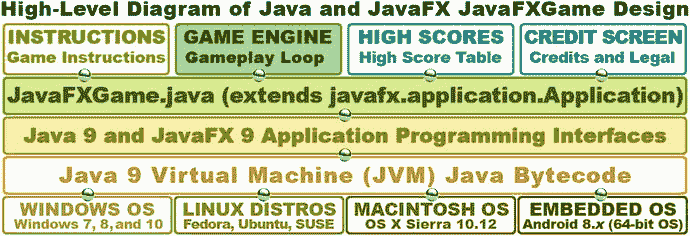

图 8-1。

JavaFXGame functional screens and how they’ll be implemented in Java 9 and JavaFX 9 by using the JVM

这将需要您向 StackPane 布局容器父分支节点添加另外四个按钮节点，并最终(在第 [9](09.html) 章)添加一个 ImageView 节点作为闪屏图像容器。这个 ImageView 节点必须添加到 StackPane“背板”中，以便成为 StackPane 中的第一个子节点(z-order=0)，因为 ImageView 包含我所说的闪屏 UI 设计的背景板。因为它在背景中，所以图像需要在按钮 UI 控件节点(SceneGraph)元素之后，这些元素的 z 顺序值为 1 到 5。

这意味着最初您将只使用八个 JavaFX SceneGraph 节点对象:一个父根组节点、第二个 StackPane 布局“分支”节点和 VBox UI 容器节点中的五个“叶”按钮控件节点来创建您的 JavaFXGame(功能)信息屏幕。您的说明、法律免责声明和信用屏幕将利用 TextFlow 和 ImageView 节点，因此在第 [9](09.html) 章之后，我们将有十个节点对象。你可以使用 VBox 节点来包含 UI 按钮，我们将在本章中把游戏 UI 导航基础设施放到你的游戏应用中。这是在我们考虑添加一个组“分支”节点，以及在它下面的分支和叶节点对象来包含 3D 游戏画面之前。当然，这是您希望 Java 游戏获得最佳脉冲更新性能的地方。

如果你仔细想想，这真的没有那么糟糕，因为这些 UI 屏幕都是静态的，不需要更新。也就是说，包含在这些节点对象中的 UI 元素是固定的，不需要使用 pulse 系统进行任何更新，因此您应该还有 JavaFX pulse 引擎 99%的能力来处理我们将在本书中编写的 JavaFXGame 游戏引擎。你总是需要知道你要求 pulse 引擎处理多少 SceneGraph 节点对象，因为如果这个数字变得太大，它将开始影响游戏的 i3D 性能。如果 i3D 游戏性能受到影响，游戏将不会流畅，这将影响你的用户体验(UX)。我们保持静态的节点对象越多，每个脉冲上需要处理的就越少。

## Java 类结构设计:游戏引擎支持

接下来让我们看看 JavaFXGame 代码需要如何“在引擎盖下”组装的功能结构。这将使用您的 Java 9 游戏编程代码来完成，我们将在本书中创建这些代码。正面 UI 屏幕的外观和你的底层编程逻辑的外观之间真的没有关联，因为你的游戏的大部分编程代码总是致力于在游戏屏幕上创造游戏体验。游戏说明、法律和信用屏幕将只是复合在背景图像(保存在 ImageView 对象中)上的文本(保存在 TextFlow 对象中)。记分牌和高分屏幕将需要更多一点的编程逻辑，我们将在本书的结尾进行，因为游戏逻辑需要为评分引擎创建(和播放)并能够生成高分。

图 [8-2](#Fig2) 显示了 JavaFXGame 完成所需的主要功能游戏组件。该图显示了层次结构顶部的一个`JavaFXGame.java`应用子类。这将在 JavaFXGame 应用的下面或内部创建顶级 JavaFXGame 场景对象及其包含的 SceneGraph。这些功能区域既可以实现为方法，也可以实现为类。在本书中，我们使用方法实现了一个 i3D 游戏。

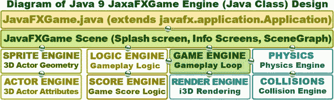

图 8-2。

Primary game engine functions, representing Java methods that you will need to code for your game

在 JavaFXGame 场景对象(在 JavaFXGame.java 应用子类中创建)的下面，是功能性 Java 9 类的更广泛的结构设计，您将需要在本书的剩余部分中对其进行编码。这些引擎(类)，如图 [8-2](#Fig2) 所示，将创建你的游戏功能，如游戏引擎(游戏处理循环)、逻辑引擎(游戏逻辑)、精灵引擎(3D 几何管理)、演员引擎(角色的属性)、分数引擎(游戏分数逻辑)、渲染引擎(实时渲染)、碰撞检测、物理模拟。您将需要创建所有这些 Java 方法，以便为 i3D 棋盘游戏实现一个全面的游戏引擎。

游戏引擎类，我称之为 GamePulse.java，是创建 AnimationTimer 对象的主要类，该对象基于不断触发游戏循环的脉冲事件在高级别处理游戏逻辑。如您所知，该循环将调用 handle()方法，该方法又包含最终访问您将创建的其他类的方法调用，这些类用于管理 3D 几何图形(sprite 引擎)、在屏幕上移动 3D 对象(actor 引擎)、检测碰撞(碰撞引擎)、在检测到所有碰撞后应用游戏逻辑(逻辑引擎)，以及应用物理力来为您的游戏提供逼真的效果，如摩擦、重力和风(物理引擎)。在本书的剩余部分，你将构建一些引擎，这些引擎将用于为你的玩家创造游戏体验。我们将根据每个引擎和它们需要处理的内容对章节主题进行逻辑分层，因此从学习和编码的角度来看，一切都是逻辑结构化的。

## JavaFX 场景图设计:最小化 UI 节点

最小化场景图的技巧是使用尽可能少的节点来实现一个完整的 UI 设计，正如你在图 [8-3](#Fig3) 中看到的，我已经用一个组根节点对象、一个 StackPane 布局“分支”节点对象、一个 VBox 分支节点对象和八个叶(子)节点(一个 TableView、一个 ImageView、一个 TextFlow 和五个按钮 UI 控件)完成了这个。正如您将看到的，当我们接下来开始编码场景图时，我将只使用 12 个对象并只导入 12 个类来实现我们在上一节中设计的 JavaFXGame 类的整个顶级 UI。TableView 和 TextFlow 对象将覆盖在 ImageView 对象之上，ImageView 对象包含 UI 设计的背景图像。这个 TableView 对象将在本书的后面添加，并将使用来自评分引擎的代码进行更新，如图 [8-2](#Fig2) 所示，您将在未来的章节中对其进行编码。

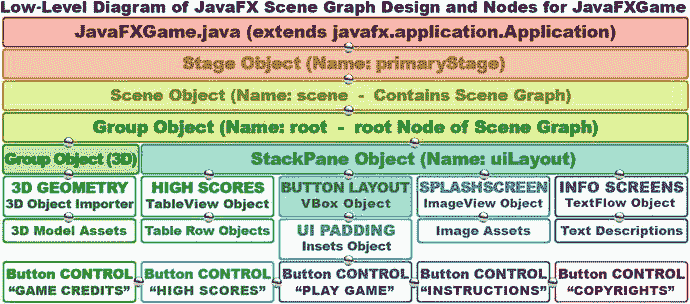

图 8-3。

Game Scene Graph Node hierarchy, objects that Nodes contain, and new media assets they reference

ImageView 背板将包含 BoardGame 插图，如果需要，您可以使用 ImageView 容器来保存不同的数字图像素材。这样，基于您的 ActionEvent 对象，处理按钮控件上的单击，您可以为每个信息屏幕使用不同的背景图像素材。VBox 父 UI 布局容器将控制五个按钮控件的布局(间距)。还有一个 Inset 对象，您将创建它来保存 UI 按钮填充值，以微调按钮对象相对于彼此的对齐方式。

由于按钮对象不能单独定位，我不得不使用 VBox 类和 Insets 类来专业地包含和定位按钮控件。在本章中，我们将讨论您将用来创建这个高级设计的类，以便您对要添加到 JavaFXGame 中的每个类有一个概述，以便为您的 JavaFXGame.java 应用子类创建这个顶级 UI 设计。

我们为需要匹配五个不同按钮的五个不同屏幕优化您的场景图形使用的方法是使用一个 ImageView 作为背板来包含游戏启动时的 BoardGame 闪屏插图。当用户单击您的 UI 按钮时，您可以使用 Java 代码让 ImageView 使用一个 ImageView 场景图节点对象引用不同的图像。您的 TextFlow 对象将覆盖 ImageView 上的文本资源。

最后，可能有一个 SceneGraph 节点，它将包含高分表的数据结构。这将通过一个分数引擎来创建，我们将在以后讨论游戏分数方法和技术时创建这个引擎。现在，我们将留下分数和游戏代码未实现。接下来让我们看看一些新的 JavaFX UI 设计类。

## JavaFX 设计:使用 VBox、Pos、Insets 和 Group

在深入编码之前，让我们深入了解一些新的 JavaFX 类，我们将利用它们来完成这些顶级游戏应用 UI 和 SceneGraph 设计。其中包括 Pos 类(定位)、Insets 类(填充)、VBox 类(垂直 UI 布局容器)和 Group 类(场景图形节点分组)。在下一章中，我们将介绍 Image(图像素材持有者)、ImageView(图像背板显示)和 TextFlow(文本数据显示)类。我们将按照从最简单(Pos)到最复杂(Group)的顺序来看这些，然后您将对您的 bootstrap JavaFX 项目代码进行相当广泛的更改，这将把这些新的类(和对象)添加到您的 JavaFX 场景图层次结构中，并重新组织它以更好地适应您的游戏。

### JavaFX Pos 类:使用常量的通用定位

Pos 类是 Enum <pos>类，是 enumeration 的简称。它包含一个常量列表，这些常量实际上被转换成整数值，以便在您的代码中使用。常量值使程序员更容易在他们的代码中使用这些值。在这种情况下，它将定位常量前缀，例如顶部、中心或基线。</pos>

Pos 类的 Java 类扩展层次结构从 java.lang.Object 主类开始，经过 java.lang.Enum <pos>类，以 javafx.geometry.Pos 类结束。您引用了图 [8-10](#Fig10) 中代码第 56 行的 Pos。Pos 位于 javafx.geometry 包中，使用下面的子类层次结构:</pos>

```java
java.lang.Object
  > java.lang.Enum<Pos>
    > javafx.geometry.Pos

```

正如您将在下一节中看到的，您必须使用 Insets 类和对象来获得您想要的像素精确定位。因为这是一个 Enum 类，所以除了 Pos 类为您提供的用于 Java 游戏中的广义和相对定位的常量之外，本节没有太多要学习的。

因此，Pos 类非常适合一般的定位，使用上、下、左、右以及基线(主要用于相对于字体的定位)。其中的每一个都有一个居中选项，所以通过使用这个 helper 类中提供的十几个常量，您可以实现您需要的任何类型的通用定位。

对于一般位置的示例，请参考您的网站设计经验，您可以设计一个网页，以便它可以缩放以适应不同的窗口大小和形状。这与像素精确定位有很大不同，在像素精确定位中，从固定屏幕尺寸和形状的位置 0，0 开始，将元素精确地放置在您想要的位置！

游戏设计通常使用像素精确定位，但在本章中，我将向您展示如何将一组 UI 按钮定位在一般位置(例如用户屏幕的右上角或左下角)，以便您可以尽可能多地使用 JavaFX API 实用程序类(这个类在 javafx.geometry 包中)。

你将使用 TOP_RIGHT 常量，如图 [8-10](#Fig10) 中的第 56 行所示，将你的按钮控制库定位在你的棋盘游戏用户界面设计的右上角，远离主要的中央 3D 视图。

Pos 类提供了一组常量，我将在表 [8-1](#Tab1) 中总结这些常量，用于提供“通用的”水平和垂直定位和对齐。

表 8-1。

The Pos Class Enum Constants That Can Be Used for Positioning and Alignment in JavaFX

  
| Pos 类常数 | 总体定位结果 |
| --- | --- |
| 基线 _ 中心 | 将对象垂直放置在基线上，水平放置在中心 |
| 基线 _ 左侧 | 将对象垂直放置在基线上，水平放置在左边 |
| 基线 _ 右侧 | 将对象垂直放置在基线上，水平放置在右侧 |
| 底部中心 | 将对象垂直放置在底部，水平放置在中央 |
| 左下角 | 将对象垂直放置在底部，水平放置在左侧 |
| 右下 | 将对象垂直放置在底部，水平放置在右侧 |
| 中心 | 将对象垂直放置在中心，水平放置在中心 |
| 中央 _ 左侧 | 将对象垂直放置在中央，水平放置在左侧 |
| 中间 _ 右侧 | 将对象垂直放置在中央，水平放置在右侧 |
| 顶部 _ 中间 | 将对象垂直放置在顶部，水平放置在中间 |
| 左上角 | 将对象垂直放置在顶部，水平放置在左侧 |
| 右上方 | 将对象垂直放置在顶部，水平放置在右侧 |

Pos 类提供广义定位；它可以与 Insets 类结合使用，以提供更精确的像素定位。接下来让我们看看 Insets 类，因为它也在 javafx.geometry 包中。

### JavaFX Insets 类:为用户界面提供填充值

insets 类是一个公共类，它直接扩展了 java.lang.Object 主类，这意味着 Insets 类是“临时编码”的，以在矩形区域内提供 Insets 或 offsets。想象一个相框，在它的外面和里面的图片之间留有一个“无光泽”或吸引人的边框。这就是 Insets 类用两个构造函数方法做的事情；一个提供相等或均匀的插入，一个提供不相等或不均匀的插入。

我们将使用提供不相等的插入值的构造函数，如果我们正在构造一幅图片，这会看起来非常不专业！Insets 类的 Java 类层次结构从 java.lang.Object 主类开始，并使用该类创建 javafx.geometry.Insets 类。正如你将在本章后面的图 [8-11](#Fig11) 的代码行 58 中看到的，Insets 类被设置为在两边提供 0 个像素，在两边提供 10 个像素。这会将按钮组从用户显示屏的角落推开。JavaFX Insets 类包含在 javafx.scene.geometry 包中，就像 Pos 类一样，并使用以下 Java 9 类层次结构:

```java
java.lang.Object
  > javafx.scene.geometry.Insets

```

Insets 类提供了一组四个双偏移值，指定矩形的上、右、下和左侧，并且应该在构造函数方法中按该顺序指定，正如您在编写代码时看到的那样。您将使用这个 Insets 类(对象)来“微调位置”您的按钮控件组，您将使用 VBox 布局容器(您将在下一节中学习)来创建它。将这些 Insets 对象视为在另一个框内绘制一个框的方法，这显示了您希望矩形内的对象围绕其边缘“尊重”的间距。这通常被称为填充，尤其是在 Android Studio 和 HTML5 编程中。

用于创建 Insets 对象的最简单的 Insets()构造函数将使用以下格式:

```java
Insets(double topRightBottomLeft)

```

此构造函数对所有间距边使用单个值(topRightBottomLeft)，重载的构造函数允许您分别指定每个值，如下所示:

```java
Insets(double top, double right, double bottom, double left)

```

这些值需要按此顺序指定。记住这一点的一个好方法是想象一个模拟时钟。这个钟的顶部有 12，右侧有 3，底部有 6，左侧有 9。因此，只需记住从正午开始指定顺时针方向(对于西方电影类型的爱好者来说)，当使用“不均匀值”构造方法时，您将有一个很好的方法来记住如何指定 Insets 值。

您正在使用 Insets 类来定位您的按钮控件库，它最初会“卡”在 BoardGame 用户界面设计的左下角。Insets 对象将允许您使用这四个 Insets 参数中的两个，将按钮控件推离屏幕的右侧和 VBox 的顶部。

### JavaFX VBox 类:为您的设计使用布局容器

因为按钮对象不容易定位，所以我将把这五个按钮对象放入 javafx.scene.layout 包中的一个布局容器中，该包名为 VBox，代表垂直框。这个公共类将事物排列成一列，由于您希望按钮在 BoardGame 的边上对齐，所以它是您将用于五个按钮控件节点的父节点，这些节点将成为这个 VBox 分支节点的子叶节点。这将创建一个 UI 按钮控件的“银行”,可以作为 UI 和闪屏设计的一个单元一起定位(移动)。

VBox 类是一个公共类，它直接扩展 javafx.scene.layout.Pane 超类，后者又扩展 javafx.scene.layout.Region 超类，后者扩展 javafx.scene.parent 超类，后者扩展 javafx.scene.Node 超类，后者扩展 java.lang.Object 主类。正如你在第 55 行看到的，在图 [8-10](#Fig10) 中，你将使用 VBox 作为按钮控件定位用户界面布局容器。这个 VBox 类包含在 javafx.scene.layout 包中，就像 StackPane 类一样，它使用以下 Java 类层次结构:

```java
java.lang.Object
  > javafx.scene.Node
    > javafx.scene.Parent
      > javafx.scene.layout.Region
        > javafx.scene.layout.Pane
          > javafx.scene.layout.VBox

```

如果 VBox 指定了边框或填充值，则 VBox 布局容器内的内容将“遵守”该边框和填充规范。填充值是使用 Insets 类指定的，我们在前面已经介绍过，您将在这个微调的用户界面控件按钮库应用中使用它。

您正在使用 VBox 类(object ),以及 Pos 类常量和 Insets 类(object ),以便将您的 UI 按钮对象组合在一起，并在以后将其微调为按钮控件库。因此，这个 VBox 布局容器将成为 UI 按钮控件(或叶节点)的父节点(以及分支节点)。

可以将 VBox 对象想象成一种使用列将子对象垂直排列在一起的方式。这可能是您的图像素材，排列在彼此的顶部，将使用基本的 VBox 构造函数(零像素间距)或 UI 控件，如按钮排列在彼此的顶部，间隔开，使用一个重载的构造函数。

创建 VBox 对象的最简单的构造函数将使用下面的空构造函数方法调用:

```java
VBox()

```

您将用于创建 VBox 对象的重载构造函数将有一个间距值，用于在 VBox 内的子按钮对象之间留出一些空间。它使用以下构造函数方法调用格式:

```java
VBox(double spacing)

```

还有另外两种重载构造函数方法调用格式。这将允许您在构造函数方法调用本身内部指定子节点对象(在我们的例子中，这些是按钮对象)，如下所示:

```java
VBox(double spacing, Nodes... children)  

```

此构造函数将在节点对象数组之间指定零像素的间距值:

```java
VBox(Nodes... children)

```

我们将使用“简短形式”。getChildren()。addAll()方法链向您展示这是如何做到的，但我们也可以通过使用以下构造函数来声明我们的 VBox 及其按钮节点对象:

```java
VBox uiContainer = new VBox(10, gameButton, helpButton, scoreButton, legalButton, creditButton);

```

如果子对象设置为可调整大小，VBox 布局容器将根据不同的屏幕大小、纵横比和物理分辨率来控制子元素的大小调整。如果 VBox 区域将容纳子对象的首选宽度，它们将被设置为该值。有一个 boolean fillWidth 属性(property)，它被设置为 true 作为其默认值。这指定子对象是否应该填充(放大)VBox 宽度值。

VBox 的对齐方式由 alignment 属性(属性或变量)控制，该属性默认为 Pos 类(Pos)中的 TOP_LEFT 常量。TOP_LEFT)。如果 VBox fillWidth 属性为 false，并且 VBox 的大小超过其指定的宽度，则子对象使用其首选宽度值，多余的空间将无法利用。fillWidth 的默认设置为 true，子级宽度将被调整以适合 VBox 宽度。请务必注意，VBox UI 布局引擎将对托管子元素进行布局，而不考虑它们的可见性属性(也称为属性、特征或对象变量)设置。

你还会注意到，我们在这一章中添加的类本来就有透明或空的背景(我称之为背板)，所以我们不必像在第 [7](07.html) 章中那样做任何额外的工作来保持 alpha。

现在我们已经花了几页讨论了 javafx.scene.layout 和 javafx.geometry 包中的一些类，您将使用它们来创建您的 UI(按钮对象库)设计，让我们仔细看看 javafx.scene 包中与 SceneGraph 分组相关的类。这些类将允许我们实现高级的 SceneGraph 层次结构，您需要将该层次结构放置在 VBox UI 布局容器对象中的五个 JavaFX 按钮控件 UI 元素(对象)旁边，VBox UI 布局容器对象位于 StackPane UI 层合成对象的内部。当我们在本书稍后进入 3D 和 i3D 时，这个组(节点)容器对象将保存你的 i3D 游戏对象层次。

### JavaFX Group 类:高级场景图节点分组

Group 类是一个公共类，它直接扩展 javafx.scene.Parent 超类，后者扩展 javafx.scene.Node 类，后者扩展 java.lang.Object master 类。因此，组对象是 JavaFX 场景图中的一种父(分支)节点对象，用于对其他分支和叶节点对象进行分组。Group 类使用以下 Java 类继承层次结构:

```java
java.lang.Object
  > javafx.scene.Node
    > javafx.scene.Parent
      > javafx.scene.Group

```

组父节点对象包含子节点对象的可观察列表，每当呈现该组父节点对象时，将按预定顺序呈现该列表。组节点对象将采用其子节点的集合(汇总)界限；但是，它不能直接调整大小。应用到组的任何变换、效果或状态都将应用到(传递到)该组节点的所有子节点，但不会应用到组本身。

这意味着这些应用的变换和效果将不包括在组父节点的布局边界中；但是，如果变换和效果是直接在该组内的子节点对象上设置的，则它们将包含在该组的布局边界中。因此，要影响组父节点的布局界限，您将通过转换组 ObservableList 的成员，而不是通过转换组对象本身，从内到外进行操作。

默认情况下，在布局过程中，组父节点将自动缩放其托管子对象集，使其大小可调整为首选大小。这确保了区域或控件子对象将随着其状态的改变而适当地缩放。如果应用需要禁用这种自动调整大小的行为，那么它应该将 autoSizeChildren 设置为 false。重要的是要注意，如果任何子对象的首选大小属性被更改，它们不会自动调整大小，因为 autoSizeChildren 已被设置为 false。这个`Group()`构造函数将创建一个空组。

```java
Group()

```

重载的`Group(Collection<Node>)`构造函数方法将使用下面的构造函数方法构造一个由 Java 集合<节点>组成的组，该组包含给定的节点对象子对象的 Java 集合:

```java
Group(Collection<Node> children)

```

第二个重载的`Group(Node…)`构造函数方法将构造一个由子节点对象的 Java 列表组成的组，在构造函数方法参数区域内构造为逗号分隔的列表。这可以通过使用以下构造函数方法格式来实现:

```java
Group(Node... children)

```

既然您已经对本章中使用的各种类有了一个概述，那么让我们回到组织 JavaFXGame 类的代码上来，这样它就符合我们对游戏 SceneGraph 所做的事情。

## 场景图代码:优化 JavaFXGame 类

我知道您渴望开发 JavaFXGame 类代码，所以让我们清理、组织和优化现有的 Java 9 代码，以实现如图 [8-3](#Fig3) 所示的大部分顶级用户界面和场景图设计，以便您在本章创建顶级 Java 9 游戏框架的过程中取得一些进展。您要做的第一件事是将所有对象声明和命名语句放在 JavaFXGame 类的顶部，在导入块和 Java 类声明之后。这些对象声明将出现在所有方法之前。许多程序员习惯于在代码的顶部声明全局变量，也可以用同样的方式在 Java 代码的顶部声明一个空的对象声明。这种方法更有条理，这个类中的所有方法都能够“看到”(访问或引用)这些对象，而不需要使用任何 Java 修饰关键字。这是因为对象声明位于 JavaFXGame 类的顶部，而不在该类包含的任何方法内部，所以以这种方式完成的所有声明对于在它们“下面”声明的所有方法都是“可见的”。如图 [8-4](#Fig4) 所示，我正在添加一个新的组对象，我将其命名为 root，因为它将成为新的场景图根。注意 Group 下的红色波浪下划线错误，因为没有 import 语句告诉 Java 9 您想要使用 Group 类。使用 Alt+Enter 组合键弹出 NetBeans helper 弹出窗口，选择为 javafx.scene.Group 添加导入选项，如图 [8-4](#Fig4) 所示。

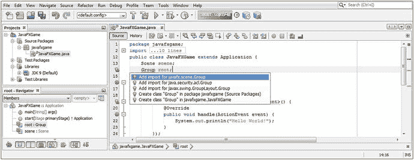

图 8-4。

Declare the scene Scene object and the root Group object at the top of the JavaFXGame class before .start()

正如你所看到的，我还将你现有的场景场景对象的声明移到了类的顶部，所以，代替`Scene scene = new Scene();`，我们现在有了下面的场景对象声明 Java 代码结构，如图 [8-5](#Fig5) 所示:

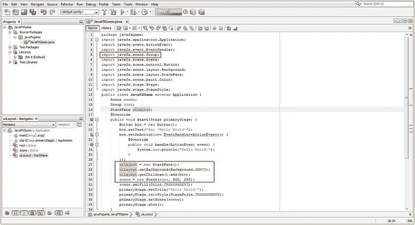

图 8-5。

Organize the .start() method by creating createBoardGameNodes() and addNodesToSceneGraph() methods

```java
public class JavaFXGame extends Application {
    Scene scene;
    public void start(Stage primaryStage) {
        scene = new Scene(root, 300, 250);
    }
}

```

接下来，我们将对 StackPane 对象做同样的事情，我将把它重命名为 uiLayout，因为根对象现在是一个组节点类对象。添加 StackPane uiLayout 声明，如图 [8-5](#Fig5) 所示，然后将图 [8-5](#Fig5) 中红框所示的 Java 代码改为使用 uiLayout 名称代替根名称，如下:

```java
uiLayout = new StackPane;
uiLayout.setBackground(Background.EMPTY);
uiLayout.getChildren().add(btn);

```

我将 uiLayout StackPane 代码放在场景实例化之前。我们将移动对象实例化，除了 Stage 对象(它需要成为。start()方法)，变成自己的。createBoardGameNodes()方法，之后我们在 JavaFXGame.java 类的顶部创建了对象声明和命名块。

请记住，如果您通过在类的顶部使用类名来声明任何对象，并且该对象下面出现红色波浪下划线，您只需使用 Alt+Enter 击键组合并选择 import Java FX . package name . class name 选项，就可以让 NetBeans 为您编写导入语句。

正如您在图 [8-4](#Fig4) 中看到的，在弹出的帮助器对话框中通常有不止一个可能的导入语句，因此请确保从 JavaFX API 中选择类，因为这是我们将用于富媒体、物联网和游戏开发的类；Java 9 APIs 中所有的多媒体制作特性都保存在那里。

在我们新的顶级 Group SceneGraph 节点子类中，还有 java.security.acl.Group 类和第二个 Java FX . swing . Group layout . Group helper 类。因为我们在这里没有使用 Swing UI 元素(Java 5)和 ACL 安全性，所以我们知道要选择的正确导入语句是 javafx.scene.Group 选项。

### JavaFX 对象声明:方法的全局类访问

让我们添加 JavaFX 对象声明和我们已经讨论过的新类的名称，以及在下一章设计游戏的 UI 视觉效果和闪屏元素时需要的 ImageView 和 TextFlow 对象。添加一个名为 uiContainer 的 VBox 对象(按钮对齐)、一个名为 uiPadding 的 Insets 对象、一个名为 boardGameBackPlate 的 ImageView 对象、一个名为 infoOverlay 的 TextFlow 对象以及五个名为 splashScreen、helpLayer、legalLayer、creditLayer 和 scoreLayer 的 Image 对象。向名为 helpButton、legalButton、creditButton 和 scoreButton 的按钮声明中再添加四个按钮对象，并将引导代码生成的 btn 按钮对象改为名为 gameButton。在下面的 Java 9 代码中，以及在图 [8-6](#Fig6) 中，您可以看到九行声明代码块，其中一些将是具有一个类名和多个对象名的复合声明(例如下面的 Image 和 Button，很快，我们还将有多个名为 root 和 gameBoard 的组对象):

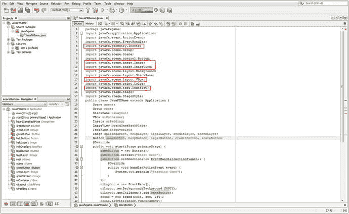

图 8-6。

Declare five new object types at the top of the JavaFXGame class and rename the btn object gameButton

```java
Scene scene;
Group root;
StackPane uiLayout;
VBox uiContainer;
Insets uiPadding;
ImageView boardGameBackPlate;
TextFlow infoOverlay;
Image splashScreen, helpLayer, legalLayer, creditLayer, scoreLayer;     //  Compound Declaration
Button gameButton, helpButton, legalButton, creditButton, scoreButton; // a Compound Declaration

```

正如您在图 [8-6](#Fig6) 中看到的红色轮廓，NetBeans 将为您编写五个新的导入语句，只要您在 JavaFXGame 类的顶部键入这些对象声明和命名语句时按 Alt+Enter。

正如你看到的用黄色突出显示的，我已经将 bootstrap btn 按钮重命名为 gameButton，并将它的`.setText("Hello World")`更改为`.setText("Start Game")`,以更直接地反映这个按钮 UI 元素最终将完成什么，因为我们在本书的整个过程中会继续完善这个 Java 9 类代码。

我还将`uiLayout.getChildren().add(btn);`改为`uiLayout.getChildren().add(gameButton);`,以反映这个类中当前影响这个按钮对象的所有 Java 9 代码的名称变化。所有这些都在图 [8-6](#Fig6) 中用红色方框、蓝色线条选择和黄色对象参考选择突出显示。

只要您使用 Alt+Enter 组合键，NetBeans 9 就会为您编写这五个新的导入语句。确保选择具有正确 javafx 包类路径的选项。接下来，让我们优化您的。start()方法，卸载游戏对象实例化(Stage 除外，它是您的`.onCreate(Stage primaryStage)`方法的一部分),以便所有非 Stage 对象创建都使用`.createBoardGameNodes()`方法完成。

### 场景图设计:优化棋盘游戏。start()方法

现在我们可以优化。start()方法，这样它使用的代码不到十几行(如果你想向前看，请参见图 [8-16](#Fig16) )。我想做的第一件事是将场景图节点创建 Java 构造模块化到它们自己的 createBoardGameNodes()方法中，该方法将在。start()方法，如图 [8-7](#Fig7) 所示。在方法的顶部添加一行代码，键入`createBoardGameNodes();`，使用 Alt+Enter 组合键让 NetBeans 9 在类的底部为您创建这个方法基础结构。此外，确保添加了`root = new Group();`对象实例化，因为您重命名了 StackPane 对象 uiLayout(如图 [8-5](#Fig5) 所示)。

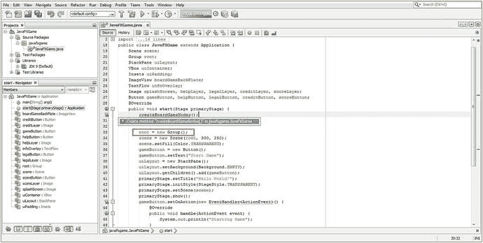

图 8-7。

Add a createBoardGameNodes() method call at the top of the .start() method and add root = new Group()

剪切并粘贴当前在。start()方法(您将在稍后添加到此)到 createBoardGameNodes()方法中，以替换 bootstrap 方法中的“尚不支持”错误代码行，如图 [8-8](#Fig8) 所示(选中)。新的。完成这个 Java 9 代码重新配置操作后，createBoardGameNodes()方法应该如下所示:

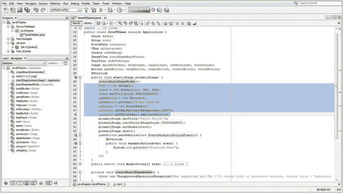

图 8-8。

Select all non-Stage and non-event-handling code in the start() method and cut and paste it in new method

```java
private void createBoardGameNodes() {
    root = new Group();
    scene = new Scene(root, 640, 400);
    scene.setFill(Color.TRANSPARENT);
    gameButton = new Button();
    gameButton.setText("Start Game");
    uiLayout = new StackPane();
    uiLayout.setBackground(Background.EMPTY);
    uiLayout.getChildren().add(gameButton);
}

```

请注意，我们将所有内容都从。start()方法，它不需要被“托管”在那里。因为 primaryStage Stage 对象是由。start()方法参数，我们将把所有 primaryStage 对象引用留在该方法中，以及所有事件处理结构，它们需要在应用启动时放置到位。其他的都将放在 createBoardGameNodes()和另一个 addNodesToSceneGraph()方法中，我们将在本章后面创建该方法来保存. getChildren.add()或。getChildren()。addAll()方法调用。

所以在。start()方法，我们将首先调用 createBoardGameNodes()来创建所有的 SceneGraph 节点对象(即 Node、Parent 或 Group 的所有子类)，然后调用 addNodesToSceneGraph()方法来使用。getChildren()。add()方法链或。getChildren()。addAll()方法调用链。这种组织方法允许我们在构建 Java 9 游戏时向场景图中添加新节点。

接下来，让我们创建第二个 addNodesToSceneGraph()方法，我们可以用它来组织、重新配置和扩展 JavaFX 游戏应用开发工作流程的 SceneGraph 节点构建部分。

## 添加场景图节点:addNodesToSceneGraph()

接下来，您需要创建一个方法，将我们已经创建的 SceneGraph 节点对象以及我们将要使用 VBox 构造函数实例化的节点对象添加到场景图形根对象中，在本例中，它现在是一个组对象。这个新的更高级别的 SceneGraph 根组对象将保存您的高级游戏功能的 StackPane UI 面板，以及我们将创建的用于保存 SceneGraph 的 3D 游戏分支的另一个组对象。在某种意义上，我们已经在使用 JavaFX 9 来创建一个混合应用，因为游戏 UI (StackPane)分支将是 2D，而游戏本身(组)将是 3D 的。我们将使用。getChildren()。add()方法链或。getChildren()。addAll()方法链，用于将“子”节点(节点、父节点或组的子类)对象添加到名为 root 的“父”组对象，该对象现在是 JavaFX 场景图的“根”。

为了创建第二个方法，我们将遵循与创建第一个定制方法相同的工作流程。在第`createBoardGameNodes();`行代码后立即添加一行代码，然后键入 addNodesToSceneGraph()；作为第二行代码。

NetBeans 9 用红色波浪错误下划线突出显示后，使用 Alt+Enter 组合键并选择创建方法“addNodesToSceneGraph”到 javafxgame。JavaFXGame 选项，如图 [8-9](#Fig9) 突出显示。我还用红色突出显示了当前在 createBoardGameNodes()方法体中的一个语句，它将被重新定位到这个新的 addNodesToSceneGraph()方法体中。这将替换原有的`throw new UnsupportedOperationException()` Java 语句，NetBeans 将该语句放入所有新创建的引导程序方法中，这些方法是使用这个特定的工作过程创建的，在这个过程中，您可以让 NetBeans 为您编写新的方法代码。

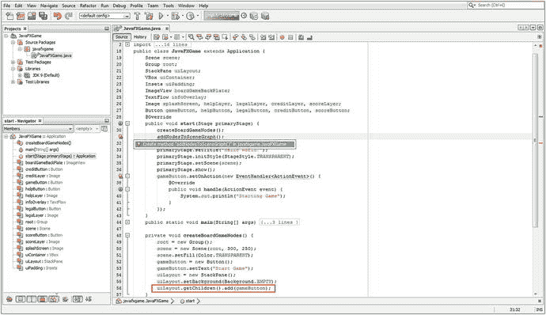

图 8-9。

After creating addNodesToSceneGraph() method, copy the uiLayout.getChildren() method chain to new method

剪切 uiLayout.getrChildren()。添加(game button)；语句，并将其粘贴到占位符上，抛出新的 UnsupportedOperationException()代码行，替换该代码。一旦我们在下一节实例化了这些新节点，我们将使用这个方法向场景图添加更多的节点。

### 向 createBoardGameNodes()添加新的 UI 场景图形节点

让我们将本章前面所学的那些新的 UI 设计和定位 JavaFX 类对象(VBox、Pos、Insets)添加到 JavaFXGame 类和我们创建的 createBoardGameNodes()方法中，该方法包含我们的 JavaFX 9 场景图节点对象创建(和配置)Java 9 语句。

使用以下 Java 对象实例化代码创建一个名为 uiContainer 的新 VBox，该代码将 Java new 关键字与 VBox()构造函数方法结合使用:

```java
uiContainer = new VBox();  // Create a Vertical Box UI element container named "uiContainer"

```

设置 VBox 与位置的对齐。方法从 Pos 助手类中调用 TOP_RIGHT 常量。setAlignment()方法通过使用下面的 Java 语句，显示在图 [8-10](#Fig10) 的构造下:

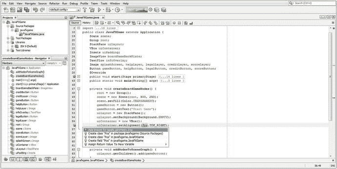

图 8-10。

Inside of the .setAlignment() method parameter area, type Pos.TOP_RIGHT and hit Alt+Enter to import

```java
uiContainer.setAlignment(Pos.TOP_RIGHT); // Set VBox Alignment to TOP_RIGHT via Pos helper class

```

使用 Alt+Enter 击键组合来消除红色波浪错误下划线，并确保选择问题的正确解决方案，在本例中是 javafx.geometry.Pos 选项的 Add import，它列在最前面(最有可能是正确的解决方案)，并且它是允许在您的代码中使用 Pos 类的解决方案。

下一步，我们将使用`uiPadding = new Insets(0,0,10,10);` Java 实例化语句创建 uiPadding Insets 对象，如图 [8-11](#Fig11) 中的第 58 行所示。最后，我们将通过使用`uiContainer.setPadding(uiPadding);`方法调用将 uiPadding Insets 对象“连接”到 uiContainer VBox 对象。这种联系在图 [8-11](#Fig11) 中用黄色显示，显示了 Insets 声明、实例化和实现之间的联系。

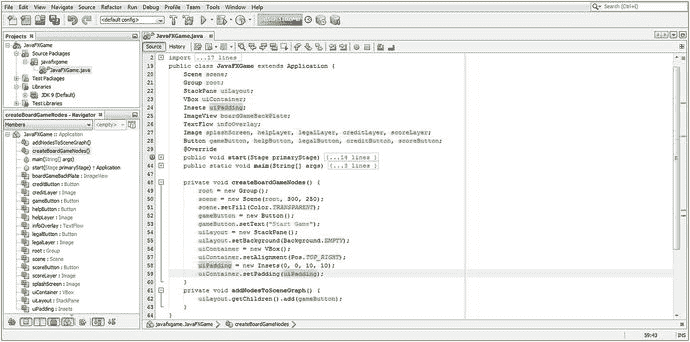

图 8-11。

Create a uiPadding Insets object and wire it to the uiContainer VBox object using .setPadding(uiPadding);

我们已经将我们的按钮对象重命名为 gameButton (was btn)，所以我们现在有 6 行对象实例化代码和 5 行对象配置代码，如图 [8-11](#Fig11) 所示，使用下面的 Java 9 代码:

```java
private void createBoardGameNodes()  {
    root = new Group();
    scene = new Scene(root, 300, 250);
    scene.setFill(Color.TRANSPARENT);
    gameButton = new Button();
    gameButton.setText("Start Game");
    uiLayout = new StackPane();
    uiLayout.setBackground(Background.EMPTY);
    uiContainer = new VBox();
    uiContainer.setAlignment(Pos.TOP_RIGHT);
    uiPadding = new Insets(0,0,10,10);
    uiContainer.setpadding(uiPadding);
}

```

重要的是要注意，因为在场景 scene 对象的构造函数方法调用中使用了根组对象，所以这一行代码需要首先出现，以便在使用它之前创建根组对象。

接下来，让我们使用方便的程序员的快捷方式，在`uiContainer.setPadding(uiPadding);`方法调用下剪切并粘贴你的两个游戏按钮实例化和配置代码行，然后在它自身下复制并粘贴代码四次，如图 [8-12](#Fig12) 底部突出显示的，使用在第 [6](06.html) 章中创建的修改的游戏按钮(btn)引导 UI 元素创建所有十个用户界面按钮元素。

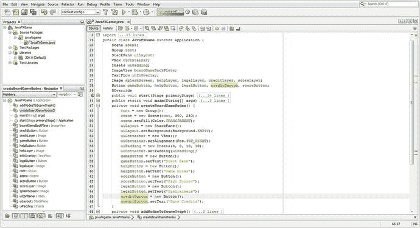

图 8-12。

Create 10 Button object instantiation and configuration statements at the end of createBoardGameNodes()

这将允许您将 gameButton 分别更改为 helpButton、scoreButton、legalButton 和 creditButton，以创建五个独特的 UI Button 对象。按钮的 Java 9 游戏代码应该如下所示:

```java
gameButton = new Button();
gameButton.setText("Start Game");
helpButton = new Button();
helpButton.setText("Game Rules");
scoreButton = new Button();
scoreButton.setText("High Scores");
legalButton = new Button();
legalButton.setText("Disclaimers");
creditButton = new Button();
creditButton.setText("Game Credits");

```

### 在 addNodesToSceneGraph()中添加新的 UI 设计节点

正如你在图 [8-13](#Fig13) 中看到的，Java 代码是没有错误的，我现在已经声明并实例化了另一个名为 gameBoard 的组对象。这将包含 SceneGraph 的 3D game elements 分支，因此 Group 对象声明现在已经成为类顶部的复合语句。我在代码中单击了 gameBoard 对象，以创建该对象声明的高亮跟踪，在 createBoardGameNodes()中实例化，并在 addNodesToSceneGraph()中使用，这表明如果在类的顶部声明，就可以在任何需要的地方使用对象。这种单击要跟踪的对象名称的方法是 NetBeans 9 的一个有用的技巧，只要您想跟踪对象的使用情况，就可以使用这种方法。我将经常在截图中使用它来突出我在添加新的 Java 代码时正在做的事情(以及为什么)。

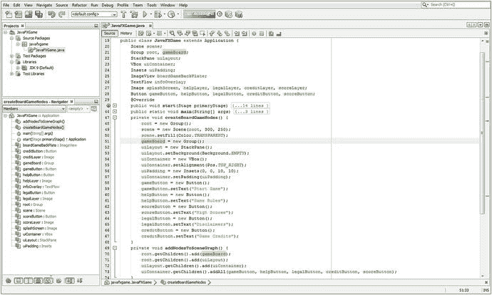

图 8-13。

Add gameBoard Group object and add Node objects to SceneGraph using .getChildren().add and .addAll()

接下来，让我们确保我们的节点被正确地添加到场景图中。在场景图形的根(顶部)之外，这是一个组对象，我们将有另一个 gameBoard 组对象来保存 i3D 游戏元素和素材，以及 uiLayout StackPane 对象。使用以下语句将它们添加到根组中:

```java
root.getChildren().add(gameBoard);        // Add new i3D Game Group Node to root Group Node

root.getChildren().add(uiLayout);         // Add uiLayout StackPane Node to root Group Node

```

接下来，我们将 uiContainer VBox 布局容器分支节点添加到 uiLayout StackPane 分支节点，并将五个按钮 UI 元素叶节点添加到 uiContainer VBox。这是使用两行 Java 9 代码完成的，如下所示:

```java
uiLayout.getChildren().add(uiContainer);      // Add VBox Vertical Layout Node to StackPane Node

uiContainer.getChildren().addAll(gameButton,  // Add All UI Button Nodes to the VBox Node
                                 helpButton,
                                 legalButton, creditButton, scoreButton);

```

图 [8-13](#Fig13) 显示了这个场景图构造代码。我在对象层次上使用了颜色填充，可视化地显示节点对象(更准确地说是节点子类对象)，它们是场景、根或分支节点。(如果您想查看这些 JavaFX 根、分支和叶节点对象层次结构，如图 [8-3](#Fig3) 所示。)

这里要注意的重要事情是您将节点对象添加到组根场景图形对象的顺序。该顺序会影响 3D 元素之上的场景渲染合成以及 UI 元素合成的合成层顺序。添加到根组的第一个节点将位于场景合成(渲染)堆栈的底部。因此，这需要是游戏板组节点对象，它将保存 i3D 游戏，以便节点首先被添加到场景图形根，如果你向下看，它在底部，或者如果你向前看，它在场景合成和渲染堆栈的后面。你可以在图 [8-13](#Fig13) 中看到这一点。

下一个要添加的节点将是您的 uiLayout StackPane 节点对象，因为您的 2D 用户界面(浮动)面板将需要覆盖在您的 3D 游戏板的顶部。将这些顶级节点对象放入场景图形层次后，我们可以将 uiContainer VBox 节点对象添加到 StackPane 节点对象，该对象将包含所有按钮控件叶节点对象。请注意，我们使用的是。getChildren()。addAll()方法链将按钮控件对象添加到 VBox 中，因为我们可以在。addAll()方法调用(链)从。getChildren()方法。

在第 [9](09.html) 章中，我们还将添加一个名为 boardGameBackPlate 的 ImageView 对象和一个名为 infoOverlay 的 TextFlow 对象。在第 [9](09.html) 章中，我还需要实例化五个图像对象来保存内存中的数字图像素材，以便我们在本章中声明的图像对象可以被实现。如您所知，我们使用复合 Java 语句将这些对象命名为 splashScreen、helpLayer、legalLayer、creditLayer 和 scoreLayer，就像我们对 Button 对象所做的那样。

## 交互性:创建 BoardGame 按钮 UI 控件

接下来您需要做的是将 gameButton.setOnAction()事件处理 Java 代码结构复制到您的。start()方法，然后在它本身下面再粘贴四次，以创建 helpButton、legalButton、creditButton 和 scoreButton 按钮控件对象事件处理结构。出于测试目的，在这一阶段，您可能希望将 System.out.println 语句更改为每个语句在输出控制台窗口中打印一条唯一的消息，这样您就可以确保五个按钮 UI 元素中的每一个都是唯一的，并且能够正确地处理其按钮事件。在继续添加更多的 Java 代码从而增加应用的复杂性之前，务必确保 Java 9 代码结构在每个阶段(也就是说，在每次更改或增强之后)都能正常工作。在开发过程中，这比一次编写所有代码花费的时间要长一点，但是可以节省调试时间。

如果您想知道图 [8-14](#Fig14) 中的黄色波浪下划线警告(或建议)是什么，以及我将鼠标放在您的事件处理程序 ActionEvent 处理构造`EventHandler<ActionEvent>() { public void handle(){...} });`下的黄色突出显示上时生成的弹出消息，这是因为可以使用较少的代码将该表达式转换为 lambda 表达式。请注意，这样做将确保您的代码只能在 Java 8 和 Java 9 下运行。如果您想在使用 Java 6 和 Java 7 的 Android 中使用您的代码，您可能只想保留这些稍微长一点的 Java 代码结构，因为它们做完全相同的事情。

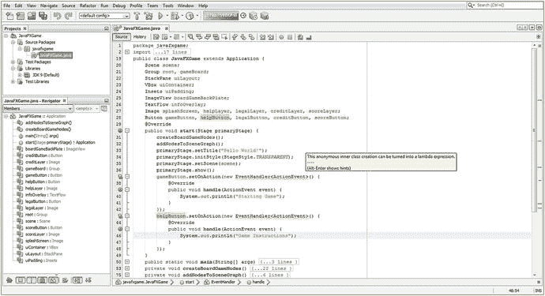

图 8-14。

Copy the gameButton event processing code and paste it underneath itself and create your helpButton event handling

完成后，新的事件处理结构应该看起来像下面的 Java 代码，如图 [8-15](#Fig15) 中间所示:

```java
gameButton.setOnAction(new EventHandler<ActionEvent>() {
    @Override
    public void handle(ActionEvent event) {
        System.out.println("Starting Game");
    }
});

helpButton.setOnAction(new EventHandler<ActionEvent>() {
    @Override
    public void handle(ActionEvent event) {
        System.out.println("Game Instructions");
    }
});

scoreButton.setOnAction(new EventHandler<ActionEvent>() {
    @Override
    public void handle(ActionEvent event) {
        System.out.println("High Score");
    }
});

legalButton.setOnAction(new EventHandler<ActionEvent>() {
    @Override
    public void handle(ActionEvent event) {
        System.out.println("Copyrights");
    }
});

creditButton.setOnAction(new EventHandler<ActionEvent>() {
    @Override
    public void handle(ActionEvent event) {
        System.out.println("Credits");
    }
});

```

正如你在图 [8-15](#Fig15) 中所看到的，你的事件处理代码是没有错误的，你已经准备好运行和测试你的 JavaFXGame.java 游戏应用，以确保你的场景图形层次被渲染到屏幕上，并且你的按钮 UI 控制对象正在正确地处理事件。一旦你确定你的场景图是在这个高层次上为你的游戏构建的，并且你的核心用户界面处理 Java 9 代码结构也在适当的位置并且正常工作，你就可以在下一章中继续添加数字图像素材并微调所有的 UI 元素定位，这样你就可以在游戏的最高层次上使一切看起来和运行起来都正确。

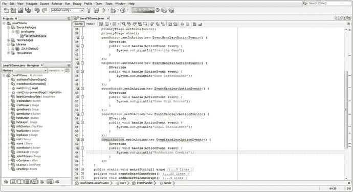

图 8-15。

Copy the gameButton and helpButton and paste them to create your scoreButton, legalButton, and creditButton

正如您在图 [8-16](#Fig16) 中看到的，在您复制。setOnAction()事件处理构造，当您使用屏幕左侧的减号图标折叠 EventHandler 例程时(在图 [8-16](#Fig16) 的左侧用红色圆圈显示)，您在。start()方法。第一行代码将调用一个方法来创建节点对象并配置它们，第二行代码将调用一个方法来将这些节点对象添加到场景图形层次结构中，第 3 行到第 6 行将配置 Stage 对象，第 7 行到第 11 行将设置 UI 按钮控件对象事件处理。如果考虑到您正在添加到游戏基础架构顶层的功能数量，这是相对紧凑的，包括为您的游戏、说明、法律免责声明、演职员表和记分牌显示创建顶层(根和分支节点)场景图形结构和用户界面设计元素。

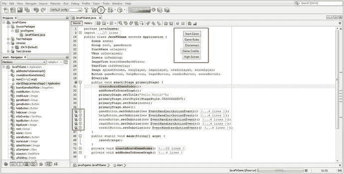

图 8-16。

Click the Run (Play) icon at the top of NetBeans and test your code to make sure your UI design is working

接下来，是时候测试重组 JavaFXGame 类并为游戏应用创建 UI 设计结构和场景图层次结构的代码了。让我们确保所有这些 UI 按钮元素(对象)都正常工作。

## 测试你的棋盘游戏:处理场景图

单击图 [8-16](#Fig16) 中用红色圈出的 NetBeans 9 IDE 顶部显示的绿色播放箭头，并运行您的 JavaFXGame 项目。这将调出 VBox UI 布局容器，在图 [8-16](#Fig16) 的中上部用红色圈出。正如您所看到的，您正在获得专业的结果，没有崩溃，使用了大约 12.5 个导入语句(外部类)，几十行 Java 代码，以及场景图形根组节点对象下不到 12 个子节点。优化您的场景图形层次非常重要，因为 JavaFX 将用来处理您的游戏设计结构的每个脉冲事件都必须遍历该层次，因此它越紧凑，您的游戏性能就越好，您的用户体验也就越流畅。因此，您应该从一开始就优化一切。正如你在图 [8-17](#Fig17) 底部的 Output-JavaFXGame 标签中看到的红色圆圈，我已经测试了所有按钮 UI 控件对象的事件处理结构。

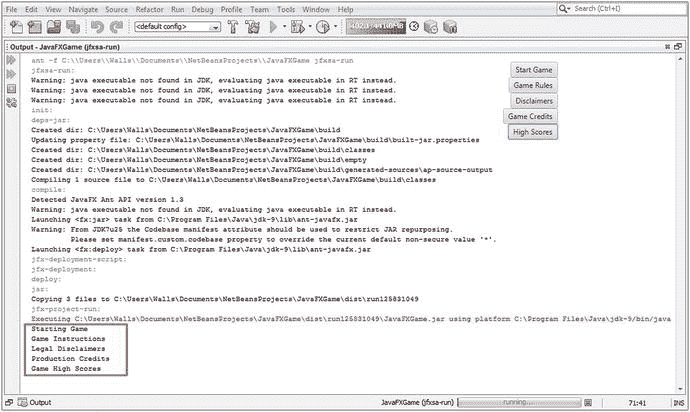

图 8-17。

Click each of the Button objects and make sure your event-handling code is printing the right messages

我这样做是为了确保每个按钮都实现了自己的事件处理，并且在我单击五个 UI 按钮控件中的每一个时都打印出正确的 System.out.println()文本消息。

稍后，我们可以将此 System.out.println()方法调用替换为另一个控制 ImageView 对 Image 对象的引用的方法调用，从而允许我们在您的用户界面设计 ImageView 数字图像背板支架的数字图像素材之间进行切换。

由于我们只复制和粘贴了每个按钮的 EventHandler 例程，并且只更改了按钮对象的名称和在这些例程中执行的代码，所以这些按钮对象应该仍然可以正常工作(将文本写入控制台)并且不会导致任何编译器错误。但是，它们最终不会按照您的要求去做，也就是更改 ImageView 对象(UI 背板)底层中引用的 Image 对象，或者使用 TextFlow 在该对象上放置适当的文本。这是你在下一章将要编写的代码；您还将做一些 UI 设计调整，将按钮库放在显示屏上的适当位置。如图 [8-16](#Fig16) 所示，虽然按钮控件对象确实在 VBox UI 容器节点内的 TOP_RIGHT 位置对齐，但是 VBox 本身还没有在其父(分支)StackPane 节点对象内对齐。就像第 [7](07.html) 章中的透明胶片一样，VBox(在 StackPane 中)和 StackPane(在组中)必须正确定位。

恭喜你，你保持了在第 7 章中添加的改进，并采用了新的方法来组织你的场景图层次，并改进了这个场景图，以包括你的 i3D 游戏分支，我们将在本书的后半部分开始添加对象和素材。

## 摘要

在第八章中，我们改进了游戏的实际顶级用户界面设计，概述了底层游戏引擎组件设计，并使用不到十几个节点实现大多数顶级游戏用户界面结构，找出了最有效的场景图节点设计，从而让您了解了我们的 JavaFXGame.java 代码。通过重新设计现有的 JavaFXGame.java 引导 Java 代码，您又回到了 Java 游戏编程中，这些代码最初是由 NetBeans 9 在第 [6](06.html) 章中为您创建的。由于 NetBeans 9 生成的 Java 9 代码设计对您的目的来说不是最佳的，所以您对它进行了重大的重写，使它更加模块化、简化和有组织。

您通过创建两个新的 Java 方法做到了这一点:。createBoardGameNodes()和。addNodesToSceneGraph()。这样做是为了模块化场景图节点创建过程，也是为了模块化添加两个父分支节点和五个控制叶节点对象到场景图根，在这种情况下恰好是组节点对象。在该目录下，您有一个名为 uiLayout 的 StackPane 分支节点，它用于多层 UI 对象合成功能，还有一个名为 gameBoard 的组分支节点，您将使用它来保存您将在本书剩余部分构建的 i3D 游戏对象层次结构。

您了解了我们将在这些新方法中实现的一些 JavaFX 类。其中包括 javafx.scene.geometry 包中的 Pos 类和 Insets 类、javafx.scene.layout 包中的 VBox 类以及 javafx.scene 包中的 Group 类。你编写了新的。createBoardGameNodes()方法，该方法使用 Inset 对象、StackPane uiLayout 分支节点对象、Group gameBoard 分支节点对象和五个 UI 按钮控件叶节点对象来实例化和配置 VBox 对象。

一旦实例化并配置了所有场景图节点，您就可以构建您的。addNodesToSceneGraph()方法将场景图节点对象添加到组根对象。这样做是为了在 Stage 对象中显示正确的场景图节点层次，它将引用和加载场景图根组节点对象以及我们在它下面构建的层次。

最后，您创建了其他四个按钮 UI 控件对象，并添加了 ActionEvent EventHandler 程序逻辑。这就完成了我们本章的编程任务，这些任务与为 JavaFXGame.java Java 9 游戏应用设置场景图层次和用户界面设计基础结构有关。

完成所有编码后，您就可以在 NetBeans 9 中测试您的顶级 Java 9 游戏应用用户界面设计和场景图层次结构了。

在下一章中，你将会在你的用户界面设计中添加很酷的数字图像资源，并在定位和对齐方面下功夫，同时让所有东西都与你的 UI 按钮对象一起工作。