# 十一、3D 场景配置：使用透视相机和点光源

现在，您已经完成了闪屏和用户界面设计的 2D 场景图层次，让我们回到第 [11](11.html) 章中的 JavaFXGame 主要应用类编码，并开始设计 3D 游戏棋盘场景基础设施，这将是棋盘游戏及其游戏性的渲染和照明的基础。我们将了解基本的 3D 场景组件，您会发现这些组件预装在 3D 软件包(如 Blender 或 Autodesk 3D Studio Max)中(适用于所有默认或空场景)。之后，我们可以在第 [12](12.html) 章进入 JavaFX 图元(盒子、平面、圆柱体、圆盘、球体和药丸)以及在第 [13](13.html) 章使用材质和纹理贴图进行着色。

在本章中，您将了解 JavaFX 9 `Camera`和 LightBase 子类的不同类型，这些子类包含在核心 javafx.scene 包中，而 Java FX . scene 包又包含在 javafx.graphics 模块中(从 Java 9 开始)。我们将讨论 PerspectiveCamera，因为您将在本章中创建的基本 3D 场景基础架构中使用它，以及 ParallelCamera，另一个更适合您的 2D 或 2.5D 游戏开发管道的相机子类。Camera 是一个抽象超类，不能直接使用。我们还将了解 public LightBase 抽象超类及其两个核心照明子类 AmbientLight 和 PointLight。

我们还将通过向 JavaFX SceneGraph 添加 3D 渲染、相机和照明来继续处理您的 JavaFXGame Java 代码，以便您可以开始向您的 3D 游戏添加 3D 元素，这将在我们讲述 JavaFX Shape3D 类及其图元子类(在第 [12](12.html) 章)并使用着色器以及将材质和纹理贴图应用于该 3D 几何图形(在第 [13](13.html) 章)之后进行。

关于 JavaFX 如何能够在 3D 场景中可视化(渲染)游戏的 3D 几何资源及其纹理贴图，我们还有很多需要了解的，所以让我们开始了解场景相机对象。

## 使用 3D 相机:给 3D 游戏添加视角

任何 3D 渲染管道的顶层都是场景摄像机，因为这是处理 3D 场景中所有事情的设备，然后将数据交给渲染引擎。在这种情况下，它是 PRISM 软件渲染器(在没有 GPU 的情况下)，或者它可能是您正在玩 3D 游戏的消费电子设备(PC、手机、平板电脑、iTV 电视机、笔记本电脑、游戏控制台、机顶盒)上的 OpenGL 硬件渲染引擎。如果您仍在使用 Windows，它可能还包括 DirectX 3D 渲染。相机对象(在我们的例子中，这将是一个 PerpectiveCamera 对象)专门用于 3D 场景渲染；我们将在本章的这一节讨论它。它是 JavaFX 9 SceneGraph 不可或缺的一部分，因此它有自己的 Scene.setCamera(Camera)方法调用。此方法调用用于将相机对象添加到场景图根，以确保它位于场景图渲染层次的最顶端(根)。它不使用。getChildren()。add()方法链，因此，它将被设置在 createSceneGraphNodes()方法中，在本章的这一节，当我们为您的 pro Java 9 游戏设置这个 Camera 对象时，您将会看到这一点。我们还将介绍 ParallelCamera，它更适合 2D 游戏。

### JavaFX Camera 类:定义相机的抽象超类

公共 JavaFX Camera 超类是一个抽象类，仅用于创建不同类型的相机。目前有一个正交或平行摄影机子类(对象)或透视摄影机子类(对象)。您的应用不应该试图直接扩展这个抽象的 Camera 类；如果您尝试这样做，Java 将抛出一个 UnsupportedOperationException，您的 pro Java 9 游戏将无法编译或运行。Camera 类保存在核心 javafx.scene 包的 javafx.graphics 模块中，是 Node 的子类，因为它最终是 SceneGraph 顶部的一个节点。Camera 类实现了 Styleable 接口，因此它可以被样式化，并且它包含 EventTarget 接口，因此它可以处理事件。JavaFX Camera 类的 Java 9 类层次结构如下所示:

```java
java.lang.Object
  > javafx.scene.Node
    > javafx.scene.Camera

```

camera 类是用于渲染场景的任何 Camera 子类的基类。相机用于定义场景的坐标空间如何呈现在用户正在观看的 2D 窗口(舞台)上。默认摄影机(如果您没有专门创建一个，我们将在本节稍后进行)将被定位在场景中，这样它在场景坐标空间中的投影平面在 Z=0 处(正好在中间)，并且在正 Z 方向上看向屏幕。出于这个原因，我们将在代码中使我们的相机远离屏幕中心(-1000)1000 个单位，因为 i3D 游戏板将位于“中心舞台”并位于 0，0，0 (X，Y，Z)。

从摄影机到投影平面的距离(以 Z 为单位)可以由摄影机所附着的场景(也是生成的投影平面)的宽度和高度以及摄影机对象的 fieldOfView 参数来确定。相机对象的 nearClip 和 farClip 属性是在这个抽象类中定义的仅有的两个属性或特征，并且是在 JavaFX 所谓的眼睛坐标空间中指定的。该空间由观察者的眼睛在相机对象的原点处定义，并且投影平面在眼睛前方的正 Z 方向上是一个单位。任何相机子类(如 PerspectiveCamera)的 nearClip 和 farClip 属性都可以使用。setNearClip()和。setFarClip()方法调用。这是两个 PerspectiveCamera 类(object)方法调用，我们将在本章的后半部分使用它们来配置 SceneGraph camera 对象。

### JavaFX PerspectiveCamera 类:您的 3D 透视相机

JavaFX PerspectiveCamera 类扩展了 Camera 类，用于创建 PerspectiveCamera(对象),该对象用于渲染 i3D 场景。PerspectiveCamera 类也保存在核心 javafx.scene 包的 javafx.graphics 模块中；它是 Node 的子类，是 JavaFX 场景图顶部的一个节点。PerspectiveCamera 类还实现了 Styleable 接口，以便可以对其进行样式化，并实现了 EventTarget 接口，以便可以处理事件。JavaFX PerspectiveCamera 类的 Java 9 类层次结构如下所示:

```java
java.lang.Object
  > javafx.scene.Node
    > javafx.scene.Camera
      > javafx.scene.PerspectiveCamera

```

PerspectiveCamera 对象定义透视投影的观察体积。想象一个截断的面向右侧的金字塔，因为大多数相机都是在 Blender 或 3D Studio Max 等 3D 软件中可视化表示的。

这个类有两个(重载的)构造函数方法。一个有一个空的参数区域，像这样:

```java
camera = new PerspectiveCamera();

```

第二个使用布尔值 fixedEyeAtCameraZero 属性(或参数或特征)，这是我们将在摄像机对象声明、实例化和配置 Java 代码中使用的属性，如下所示:

```java
camera = new PerspectiveCamera(true);

```

当然我们也会在类的顶部声明一个 PerspectiveCamera camera，用 Alt+Enter 让 NetBeans 9 为我们写一个这个类的 import 语句。PerspectiveCamera 有一个 fieldOfView 值，可用于更改相机投影的视野(FOV)角度，以度为单位。我将保留 FOV 的默认值，并假设这个默认的 FOV 给出了最佳的视觉效果，这是由 JavaFX 开发团队决定的。

我在游戏和模拟中使用 i3D 的倾向是“推拉”，或沿着 Z(场景内外)变换轴移动相机，而不是使用 FOV 值变化，因为即使在现实生活中，改变相机镜头(如从 24 毫米到 105 毫米)往往会更剧烈地改变视角。根据我的经验，使用不同的 3D 虚拟相机，这种视角的变化在虚拟 3D 中比使用真实相机时更加剧烈。

默认情况下，在创建(实例化)时，透视摄影机位于场景的中心，并沿着正 z 轴观察(指向下方)。如果使用 PerspectiveCamera(false)构造 PerspectiveCamera，那么由该相机定义的坐标系的 0，0 原点将位于面板的左上角，y 轴指向下方，z 轴指向远离查看者的方向(进入屏幕)。如果将 PerspectiveCamera 节点添加到场景图中，则转换后的相机位置和方向将定义相机的位置和相机正在观察的方向。在默认相机中，fixedEyeAtCameraZero 为 false，眼睛位置 Z 值在 Z 中进行调整，以便使用指定的视场生成的投影矩阵将使用设备无关的像素在 Z = 0 处(在投影平面上)生成单位。这符合你的平行摄像机的特点。调整场景大小时，投影平面(Z = 0)上场景中的对象将保持相同的大小，但场景中或多或少的内容是可见的，这比 3D 相机更适合 2D 相机和 2D 滚动条的使用，在 3D 相机中，调整相机大小将会缩放场景。这就是为什么 PerspectiveCamera 通常使用 PerspectiveCamera(true)进行实例化的原因，我们将在本章的这一节稍后进行。

当 fixedEyeAtCameraZero 设置为 true 时，眼睛位置在相机的局部坐标中固定在(0，0，0)。将使用默认的(或指定的)fieldOfView 属性生成投影矩阵，并且将在窗口(视口或舞台对象)上映射投影体积，使得它将在投影平面的点处的或多或少的设备无关像素上被“拉伸”(缩放)。当场景大小属性更改时，场景中的对象将按比例缩小或增大，但内容的可见范围(边界)将保持不变。

如果您计划变换(移动或推拉)相机对象，JavaFX 开发团队建议将此 fixedEyeAtCameraZero 设置为 true。当 fixedEyeAtCameraZero 设置为 false 时变换相机可能会导致最终用户感觉不直观的结果。

请注意，PerspectiveCamera 是一个有条件的 3D 特征。您可以轮询条件功能。确定给定用户的设备是否支持该特性的布尔变量(在本例中，支持 i3D)。这将使用以下 Java 代码结构来完成，该结构设置一个布尔变量来反映系统对 3D 渲染的支持:

```java
boolean supportFor3D = Platform.isSupported(ConditionalFeature.SCENE3D);

```

最后，该类有一个名为 verticalFieldOfView 的布尔属性，用于定义 FieldOfView 属性是否将应用于投影的垂直维度。这在逻辑上意味着，如果这是假的，增加或减少 FOV 将改变投影的宽度，但不改变(垂直)高度，如果这是真的，它将改变(缩放)相机投影的水平(宽度)和垂直(高度)维度，这将表面上比仅改变相机投影平面的一个维度更好地保持纵横比。

接下来，让我们看一下 ParallelCamera 类，我们将在 Camera 子类的覆盖范围中包括它，以保持一致性，尽管这个相机更适合用于 2D 游戏和可能的正交 3D 应用。

### JavaFX ParallelCamera 类:你的 2D 空间平行相机

JavaFX ParallelCamera 类也扩展了 Camera 类，并用于创建 ParallelCamera(对象)，该对象用于渲染 i2D 场景。这个 ParallelCamera 类也保存在核心 javafx.scene 包的 javafx.graphics 模块中；它是 Node 的子类，是 JavaFX 场景图顶部的一个节点。ParallelCamera 类还实现了 Styleable 接口，以便可以对其进行样式化，并实现了 EventTarget 接口，以便可以处理事件。因此，JavaFX ParallelCamera 类的 Java 类层次结构如下所示:

```java
java.lang.Object
  > javafx.scene.Node
    > javafx.scene.Camera
      > javafx.scene.ParallelCamera

```

JavaFX 9 创建的默认相机将始终是一个 ParallelCamera，这就是为什么我们在本章中编写特定相机和 LightBase 对象创建的原因。例如，如果您只是创建了一个球体对象，而没有创建任何 Camera 子类对象或任何 LightBase 子类对象，JavaFX 运行时将自动创建一个 ParallelCamera 对象和一个 AmbientLight 对象，以便 Shape3D 子类(球体)对渲染器可见。

如果一个场景只包含 2D 变换，那么它不需要透视相机，因此会使用平行相机，这不会渲染 3D 对象的所有特征。ParallelCamera 更适合 Java 8 游戏开发入门(Apress，2014)中所涉及的内容。这种相机定义了平行的观察体积，在 3D 行业中也称为正交投影。实质上，正投影相当于一个矩形平面。

ParallelCamera 始终位于窗口的中心，并将沿着 z 轴的正方向看。ParallelCamera(相对于 PerspectiveCamera)的不同之处在于，该相机定义的场景坐标系的原点位于屏幕的左上角，y 轴位于屏幕的左侧，x 轴位于屏幕顶部的右侧，z 轴指向远离观察者的方向(屏幕表示中的距离)。

ParallelCamera 对象中使用的单位使用像素坐标表示，因此这就像 2D 数字成像软件包和我们用于 2D UI 设计的 2D StackPane 图像合成层对象一样，它也引用屏幕左上角 0，0 (X，Y)处的坐标。这是另一个事实，这是一个更符合逻辑的相机子类，用于 i2D 游戏，而不是 i3D 游戏。

这个类只有一个构造函数方法，它使用一个空的参数区域，如下所示:

```java
Camera2D = new ParallelCamera();

```

接下来，让我们看看如何创建 PerspectiveCamera 对象，我们将在 pro Java 9 游戏中使用它。我们将了解如何对其进行初始配置，以及如何将其添加到 JavaFX SceneGraph 的根目录中。

### 向场景添加透视相机:使用。setCamera()

我们需要添加到 JavaFXGame 类顶部的第一件事是使用 PerspectiveCamera 摄像机声明 PerspectiveCamera 对象；Java 语句，它将在 PerspectiveCamera 对象下显示一个红色波浪下划线指示器(类用法)。使用 Alt+Enter 快捷键让 NetBeans 9 为您编写 import 语句，然后打开 createSceneGraphNodes()方法，以便您可以将该照相机对象添加到场景图的顶部(根)。使用 camera = new perspective camera(true)在根组实例化下实例化这个 camera 对象；构造函数语句。然后，在下一行中，使用-1000 值调用. setTranslateZ()方法，将相机从 3D 场景的 0，0，0 中心移动 1，000 个单位。

使用. setNearClip()方法调用摄影机对象，将 nearClip 摄影机对象属性设置为 0.1，并使用。setFarClip()方法调用。最后，使用。setCamera()方法调用了场景对象，并在`.setCamera(` `camera` `)`方法调用中使用相机对象作为参数传递相机对象。将场景对象的背景值设置为颜色。通过使用。setFill()方法调用，这样您的 3D 对象会很突出，使用这些 Java 语句:

```java
PerspectiveCamera camera;
...
createSceneGraphNodes() {
    camera = new PerspectiveCamera(true);
    camera.setTranslateZ(-1000);
    camera.setNearClip(0.1);
    camera.setFarClip(5000.0);
...
    scene.setFill(Color.BLACK);
    scene.setCamera(camera);

```

正如你在图 [11-1](#Fig1) 中看到的，你的代码是没有错误的，摄像机现在已经设置好并连接到你的 3D 场景，我们现在已经把它转换成一个 3D 场景。它现在是一个 3D 场景，因为它在其渲染管道的顶部(即在其根处)使用了 PerspectiveCamera，所以它下面的所有对象现在都将使用 3D 透视图。

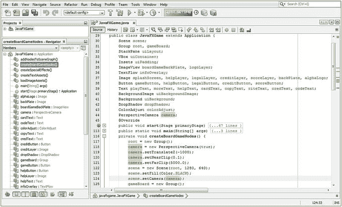

图 11-1。

Add a PerspectiveCamera object declaration at the top of the class and then instantiate it and configure it

接下来，让我们使用运行➤项目工作流程来看看您通过添加 PerspectiveCamera 创建的新 3D 场景如何影响您现有的 2D UI 设计；现在，这是一个“混合”2D 和 3D 应用，是 JavaFX 应用的最高级类型。这是真的，因为我们需要在一个无缝合成环境中结合 2D 和 3D 素材，这是一个极其复杂的任务。两个最先进的电影和特效合成软件包 Fusion 和 Nuke 完成了 2D 与 3D 的融合。事实上，如果你想了解更多关于将 2D 和 3D 素材结合到一个管道中的信息，请查看 VFX 基本面(Apress，2016)。正如你在图 [11-2](#Fig2) 中看到的，你的场景图根的 StackPane 分支，以及它下面的所有东西，都被它(正确地)携带着，并且现在从层次顶部的 PerspectiveCamera 和它的屏幕的 0，0，0 中心(视觉上)引用，你在这一章的前面已经学过。

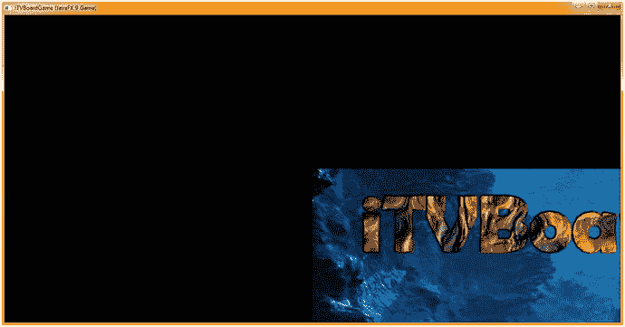

图 11-2。

Run the Project and notice that the StackPane is now located at the PerspectiveCamera 0,0,0 center origin

我尝试的第一件事是通过使用。settranslate(-640)和。setTranslateY(-320)，这在一定程度上起了作用，因为结果看起来像图[11-2](#Fig2)；但是，它在左上角，整个 StackPane 布局可见，并且缩小了 200%(四倍，或四分之一屏幕)。

这告诉我，StackPane 是一个 2D 对象，从技术上讲是一个“平面”，它与相机投影平面“完全平行”，面向相机对象的 z 轴。相比之下，现在 StackPlane 是 3D 渲染管道的一部分，因为它是 PerspectiveCamera 的子级(在渲染器处理管道之下)。

这意味着 StackPane 及其所有子元素(VBox、ImageView 和 TextFlow)都是通过 PerspectiveCamera 对象进行处理的。这包括它的所有算法和坐标系统(以及类似的“交战规则”，如果你愿意的话)，所有这些都改变了它将被渲染到屏幕(场景对象)的方式和位置。

我尝试的下一件事是使用。setTranslateX)和。setTranslateY(0)方法调用。这是通过添加以下两个 Java 语句来实现的，将 StackPane 重定位到。start()方法位于 uiLayout StackPane 对象实例化 Java 语句之后。

这里显示了这些 Java 代码，并且在图 [11-3](#Fig3) 的中间附近用蓝色突出显示:

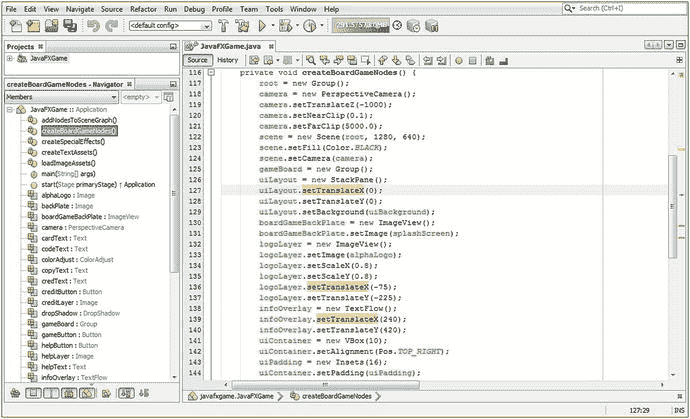

图 11-3。

Add the .setTranslateX() and .setTranslateY() method calls off the uiLayout StackPane object, both set to zero

```java
uiLayout = new StackPane();
uiLayout.setTranslateX(0);
uiLayout.setTranslateY(0);

```

注意图 [11-3](#Fig3) 中您正在使用。setTranslateX()和。setTranslateY()在 logoLayer ImageView 上，以及在 infoOverlay TextFlow 上，每个都保持它们相对于 uiLayout StackPane 的位置。

这种相对定位的保留是因为您已经在 SceneGraph 层次中建立了父子关系，这就是为什么这是一个强大的场景构造工具，适用于任何类型的场景，无论是 i2D、i3D 还是混合场景。这也将是非常重要的，因为我们在本书中开发了你的 pro Java 9 游戏的 i3D 部分，因为我们将需要在你的游戏的 3D 部分进行更多的整体转换，而不是简单地将你的 UI 控制面板放在相机前面，这样它就会阻挡 3D 游戏的视图(至少现在是这样；随着我们不断完善 Java 代码和游戏设计，我们可能会在以后更改这个 UI 设计)。这正是游戏设计和编码在现实生活中发生的方式；游戏开发是一个旅程，而不是目的地。

使用运行➤项目工作流程，看看我们是否更接近同步您的 2D UI 覆盖图及其背后的 3D 场景。正如你在图 [11-4](#Fig4) 中看到的，UI 面板现在在你屏幕的中央，尽管缩小了。因此，我们将继续细化我们的对象属性。接下来，我们将使用相机对象的 Z 平移变量来使相机更接近 3D 场景，以实现我们想要的最终结果。

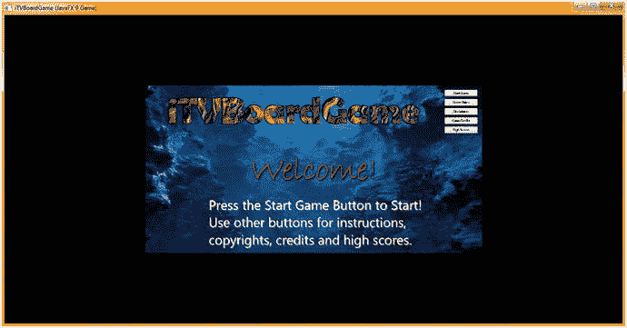

图 11-4。

Run the project; your StackPane is now centered, but your camera object Z translation is too far out

我认为这是因为相机的 Z 平移距离这个新的 3D 场景的中心 1000 个单位。因此，接下来我将尝试将 camera.setTranslateZ()方法调用参数从-1000 减少到-500，以查看 3D 合成中 2D 的最终变化。

完成这一修改的 Java 代码应该如下所示，并在图 [11-5](#Fig5) 的顶部以蓝色突出显示:

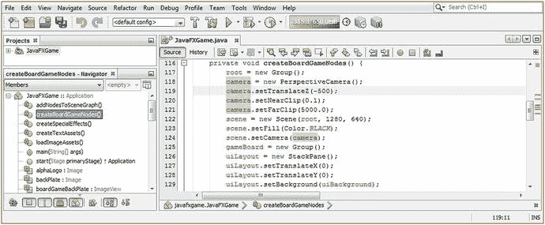

图 11-5。

Move the camera object 50 percent closer to the 3D scene projection plane by setting .setTranslateZ() to -500

```java
camera.setTranslateZ(-500);

```

再次使用“运行➤项目”工作流程。正如你在图 [11-6](#Fig6) 中看到的，你的 UI 屏幕现在大了 50 %,所以我们需要缩小我们的。将 TranslateZ()设置为零，使 StackPane 与 3D 场景投影平面同步。


图 11-6。

Run the project to see that the StackPane is still centered, but the camera Z translate value is still too far out

完成此任务的 Java 代码如下所示，在图 [11-7](#Fig7) 中可以看到用蓝色突出显示的代码:

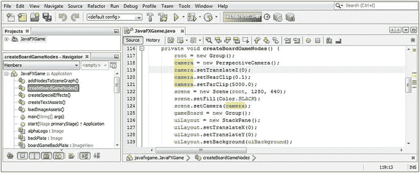

图 11-7。

Set the camera.setTranslateZ() method call to zero to synchronize the StackPane and projection plane

```java
camera.setTranslateZ(0);

```

接下来，使用“运行➤项目”工作流程来查看您是否已经实现了将 StackPane 节点分支及其子节点与 3D 相机对象的投影平面同步的视觉目标。正如你在图 [11-8](#Fig8) 中看到的，你的 UI 屏幕看起来很棒，按钮也工作正常。


图 11-8。

Use Run ➤ Project to see that your StackPane is perfectly synchronized (visually) with the camera projection plane

在我们开始学习 LightBase(超类)对象以及 AmbientLight 和 PointLight 子类之前，让我们确保我们之前的所有其他 2D UI 代码仍在工作，并做我们希望它做的事情。当向 Java 9 代码添加主要特性或更改时，花时间做这件事总是很重要的。

### StackPane UI 测试:确保其他一切仍然工作

点击游戏规则按钮，如图 [11-8](#Fig8) 所示，并确保游戏说明的用户界面屏幕在外观上仍然可读和专业，尽管我们将在游戏发布前进一步完善该用户界面。从图 [11-9](#Fig9) 中可以看到，指令屏幕确实仍然可读；然而，颜色。白色背景颜色已被替换为彩色。黑色因为我们设置了新的 3D 场景对象来使用这个为其填充颜色值，如图 [11-1](#Fig1) 所示，使用了一个`scene.` `setFill` `(Color.` `BLACK` `);`的 Java 语句。这意味着我们现在需要将 StackPane 的背景颜色值设置为 Color。白色在场景合成(现在是渲染)管道中用白色填充我们的 UI 屏幕。由于 StackPane 位于场景之上，VBox、ImageView 和 TextFlow 之下，因此这是要设置颜色的逻辑对象。白色背景填充颜色。这将涉及到在位于。start()方法，而不是更改许多与设置文本对象颜色和 DropShadow 属性相关的 Java 语句，更不用说使用。setLightness()方法调用来使标题图像的文本元素变亮。这也让我有机会向您展示如何避开 StackPane 对象(类)没有. setFill()方法的限制，这意味着我们必须创建一个复杂的方法链，其中包含两个嵌套的“方法内部的对象实例化”Java 构造，我们在. setBackground(Background)方法调用中创建一个新的 Background 对象和一个新的 BackgroundFill 对象，并将 BackgroundFill 配置为白色。

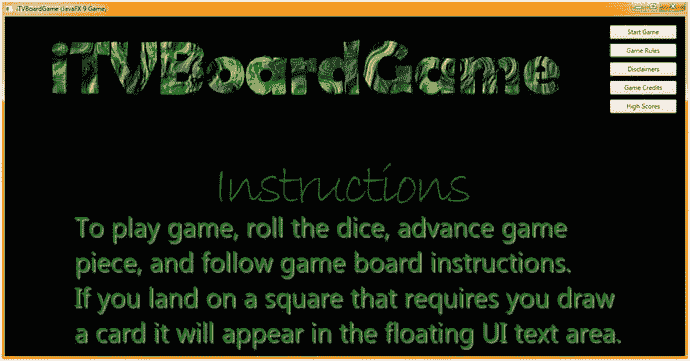

图 11-9。

Click the Game Rules Button control to see whether the Instructions section is rendering correctly. It is now black!

这个方法调用的基本 Java 9 编程语句结构(包含两个嵌套的对象实例化)将如下所示(最初；接下来我们会进一步配置)Java 9 编程结构:

```java
uiLayout.setBackground( new Background( new BackgroundFill(Color.WHITE) ) );

```

这显示在图 [11-10](#Fig10) 中，尽管在 BackgroundFill 下有红色波浪下划线，因为我们需要使用 Alt+Enter 击键组合让 NetBeans 从 javafx.scene.layout (package)导入 BackgroundFill 类。这在图中也以蓝色突出显示为“Add import for Java FX . scene . layout . background fill”，双击它可以让 NetBeans 9 为您编写此导入语句。

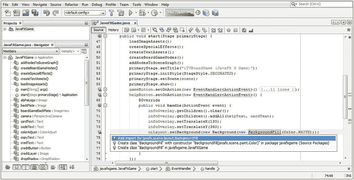

图 11-10。

Code your private void createSpecialEffects() method body to create and configure a DropShadow object

NetBeans 从最基本的(无导入语句)开始评估问题。因此，一旦为 BackgroundFill 对象准备好了 import 语句，NetBeans 就会继续评估该语句，从内部(BackgroundFill)到外部(到新的背景对象，再到。setBackground()方法调用)。

原来 BaclgroundFill 类的构造函数方法需要几个参数，而不仅仅是颜色。白色填充规格。这是因为 BackgroundFill 类将创建圆角并支持 Insets 对象规范，因此 BackgroundFill 构造函数的正确构造函数方法格式应该如下所示:

```java
backgroundFill = new BackgroundFill(Paint, CornerRadii, Insets);

```

因此，对于我们的用法，一个完整的白色背景填充构造函数方法将使用 EMPTY 常量，没有任何填充或圆角边缘，因此看起来像下面的 Java 实例化:

```java
new BackgroundFill( Color.WHITE, CornerRadii.EMPTY, Insets.EMPTY );

```

一旦导入了 BackgroundFill 类，NetBeans 就会向我们显示出`new BackgroundFill(Color.WHITE)`对象实例化有问题，这通过整个代码结构下面的红色波浪下划线来表示，如图 [11-11](#Fig11) 所示。我将鼠标放在我正在构建的 Java 语句部分，NetBeans 9 会弹出对该问题的解释，它显示在浅黄色框中，周围有黑色轮廓。

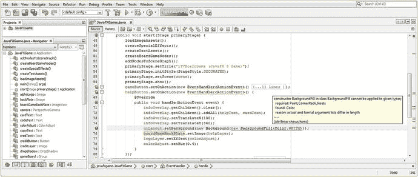

图 11-11。

Set uiLayout StackPane background to white using .setBackground(new Background(new BackgroundFill(Color.WHITE)));

我想要白色填充，所以我用了圆角半径。空和 Insets。按照构造函数方法参数的要求，最后两个参数按此顺序为空。最终的方法调用是这样的，如图 [11-12](#Fig12) 所示:

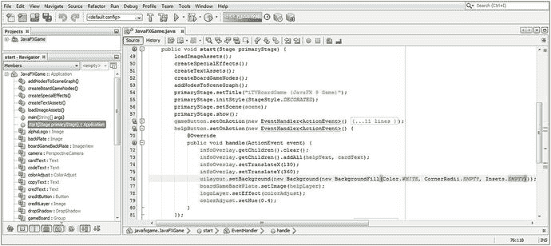

图 11-12。

Add BackgroundFill constructor method parameters (Paint, CornerRadii, and Insets) to the method call

```java
.setBackground(new Background(new BackgroundFill(Color.White,CornerRadii.EMPTY,Insets.EMPTY) ));

```

最后，使用“运行➤项目”工作流程来查看您是否已经完成了白色背景色填充的目标。正如您在图 [11-13](#Fig13) 中看到的，您的 UI 屏幕看起来又很棒，UI 按钮也工作正常。


图 11-13。

The StackPane now has a Color.WHITE background fill, preventing scene Color.BLACK from showing

让我们在 Legal 和 Credits 按钮事件处理结构中实现这一修复，并将我们的应用恢复到 100%的工作状态。如图 [11-14](#Fig14) 所示，我已经将这个 uiLayout StackPane 对象后台属性配置 Java 9 代码结构复制并粘贴到您的 legalButton 和 creditButton 事件处理基础设施中，代码编译无误。

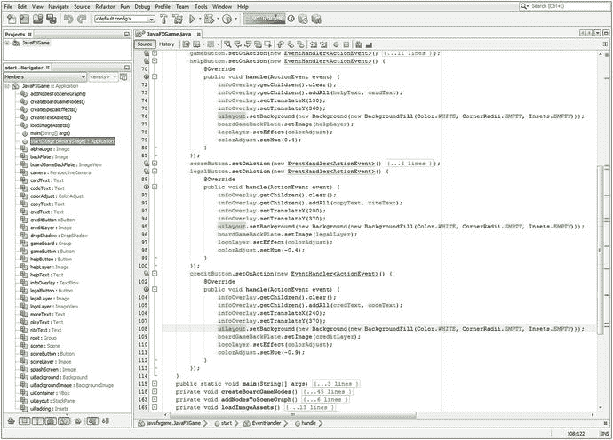

图 11-14。

Copy and paste the uiLayout.setBackground() construct from helpButton to legalButton and creditButton

如果您使用您的运行➤项目工作流程并测试这三个按钮 UI 元素，您将会看到，由于我们使用了 StackPane 的背板(背景对象)来保存设置为 Color.WHITE 的颜色辅助类常量的 Paint 对象，您在前面章节中所做的所有艰苦设计工作都已完全恢复

## 实现开始游戏按钮:隐藏你的用户界面

我们要做的下一件事是注释掉 gameButton 事件处理程序代码中的所有代码(这样我们可以在以后恢复它们，如果我们想的话)，然后添加一些新的语句，这些语句将隐藏(将 visibility 设置为 false)SceneGraph 的 StackPane 分支；我们还将把 camera.setTranslateZ()方法调用设置为我们最初想要使用的-1000 值。当我们构建游戏时，我们将添加额外的配置和控制语句到这个关于 i3D 游戏的按钮中，正如你现在看到的，它将“活”在 StackPane UI 控制面板后面。

正如你在图 [11-15](#Fig15) 中看到的，我已经注释掉了与你的 StackPane UI 合成管道相关的代码；我添加了关于从视图中移除 UI 控制面板以及将 3D 场景相机对象设置到游戏开始时我们想要的位置的语句。新的代码语句看起来像下面的 Java 代码，并在图 [11-15](#Fig15) 中间高亮显示:

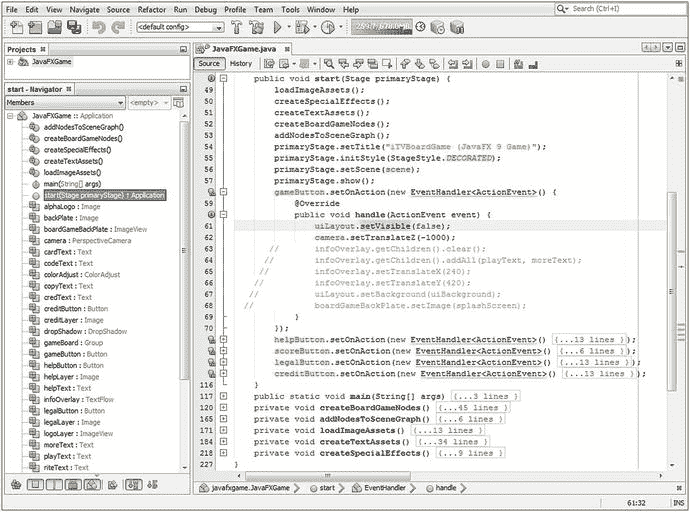

图 11-15。

Add a .setVisible(false) method call off of uiLayout and a .setTranslateZ(-1000) method call off the camera

```java
uiLayout.setVisible(false);
camera.setTranslateZ(-1000);

```

现在，当您使用“运行➤项目”工作流程并单击“开始游戏”按钮时，您的 StackPane 将会消失，空的(黑色)3D 场景将会显示出来。

现在是时候使用 JavaFX 9 LightBase 超类及其 AmbientLight 和 PointLight 子类来学习 3D 场景照明了。在我们的 JavaFXGame 类中实现它们之前，在我们结束关于核心 3D 场景元素(相机和灯光基础)的这一章之前，我们将详细介绍这些元素，这些元素需要在我们的 i3D pro Java 9 游戏设计和开发管道中作为 SceneGraph 的根。开始兴奋了吗？灯光，摄像机…动作事件！

## 使用 3D 照明:为 3D 游戏添加照明

JavaFX 9 中有两组不同的照明 API。一个是用于 3D 场景的，包含在 javafx.scene 包中，提供了一个抽象的 LightBase 超类和“concrete”(可在代码中作为可构造的对象使用)子类 AmbientLight 和 PointLight。另一个是抽象的 Light 超类，包含在 javafx.scene.effect 包中；这个包包含 2D 数字成像效果，正如我们在本书前面提到的。对于 3D 的使用，我们将重点放在灯光基础，环境光线和点光源类上，最初使用点光源类，因为我们可以使用该类获得最生动和真实的效果。

### JavaFX LightBase 类:定义光的抽象超类

公共 JavaFX LightBase 超类是一个抽象类，仅用于创建不同类型的灯光。目前，3D 场景有一个普通或“环境”级别的照明，由模拟灯泡属性的 AmbientLight 子类(对象)或 PointLight 子类(对象)提供。您的应用不应试图直接扩展抽象的 LightBase 类；如果您尝试这样做，Java 将抛出一个 UnsupportedOperationException，您的 pro Java 9 游戏将无法编译或运行。LightBase 类保存在核心 javafx.scene 包的 javafx.graphics 模块中，是 Node 的子类，因为它最终是 SceneGraph 顶部的一个节点。LightBase 类实现了一个 Styleable 接口，这样它就可以被样式化，还实现了一个 EventTarget 接口，这样它就可以处理事件。因此，JavaFX LightBase 类的 Java 9 类层次结构如下所示:

```java
java.lang.Object
  > javafx.scene.Node
    > javafx.scene.LightBase

```

LightBase 类为构造对象的子类提供了通用属性的定义，这些对象用于在 3D 场景中表示(“投射”)某种形式的光。这些 LightBase 对象属性应该包括光源的初始颜色，以及光源最初是打开(启用)还是关闭(禁用)。请务必注意，由于这是一个 3D 特征，因此它是一个有条件的特征。参考我在本章的 PerspectiveCamera 一节中给出的例子，了解如何设置代码来检测 ConditionalFeature。SCENE3D 标志。

LightBase 子类有两个属性(或者属性或特征，如果你喜欢这些术语的话)；一个是 color 或 ObjectProperty <color>，它指定从光源发出的光的颜色，第二个是一个名为 lightOn 的 BooleanProperty，它允许打开和关闭光。</color>

LightBase 抽象类有两个重载的受保护构造函数方法。一个没有参数，创建默认颜色。白光源，使用此构造函数方法调用格式:

```java
protected LightBase()

```

第二个重载的受保护构造函数方法允许子类使用下面的构造函数方法调用格式为灯光指定颜色值:

```java
protected LightBase(Color color)

```

LightBase 类有七个方法，每个 LightBase 子类都可以使用(继承)这些方法，包括 AmbientLight 和 PointLight 子类，所以在这里要注意这些方法，因为我只介绍一次。

colorProperty()方法指定光源的 ObjectProperty <color>，而 getColor()方法获取光源的颜色值属性。getScope()方法将获得一个 ObservableList <node>，其中包含一个节点列表，该列表指定了 LightBase 子类(object)的层次结构范围。</node></color>

isLightOn()方法调用返回光源的布尔值 On(真)或 off(假)，lightOnProperty()方法调用将设置光源 BooleanProperty lightOn 的布尔数据值。

最后，void setColor(Color value)方法将设置 light color 属性的数据值，void setLightOn(boolean value)方法将设置 LightBase 子对象 lightOn boolean value 属性的数据值。

接下来，让我们分别仔细看看 AmbientLight 和 PointLight 具体类。

### JavaFX AmbientLight 类:均匀地照亮 3D 场景

公共 JavaFX AmbientLight 类是一个具体的类，用于为 3D 场景创建常规或“环境”级别的照明。对于给定的 3D 场景实例，通常只定义一个 AmbientLight 实例。AmbientLight 类保存在核心 javafx.scene 包的 javafx.graphics 模块中，是 LightBase 的子类，light base 是 Node 子类，因为它最终是 SceneGraph 顶部的节点。AmbientLight 类还实现了一个 Styleable 接口，以便可以对其进行样式化，还实现了一个 EventTarget 接口，以便可以处理事件。因此，JavaFX AmbientLight 类的 Java 类层次结构如下所示:

```java
java.lang.Object
  > javafx.scene.Node
    > javafx.scene.LightBase
      > javafx.scene.AmbientLight

```

如果需要，AmbientLight 类为 3D 场景定义环境光源对象。环境光可以被定义为来自看起来从每个方向进入场景的看不见的光源对一个区域的整体或一般的照明量。所有 AmbientLight 对象属性都继承自 LightBase 超类，并且应该包括光源的初始颜色以及光源最初是打开(启用)还是关闭(禁用)。同样需要注意的是，由于这是一个 3D 特征，因此它是一个有条件的特征。

AmbientLight 有两个重载的构造函数方法；第一个使用(默认)颜色创建一个未配置的 AmbientLight 对象类。白色光源，使用以下 Java 实例化编程格式:

```java
AmbientLight ambient = new AmbientLight();

```

第二个重载构造函数方法使用非 color 的指定颜色创建一个新的 PointLight 实例。白色，使用以下 Java 实例化编程格式:

```java
AmbientLight ambientaqua = new AmbientLight(Color.AQUA);

```

接下来，让我们详细了解一下点光源的具体类，然后我们可以在本章结束之前将点光源对象添加到您的 3D 场景中，在本书的剩余部分中，我们可以将 3D 对象放入 3D 渲染场景环境中。

### JavaFX PointLight 类:戏剧性地照亮你的 3D 场景

公共 JavaFX PointLight 类是一个具体的类，用于为 3D 场景创建局部或“点源”照明实例。3D 场景中通常有多个点光源实例，以允许艺术家实现模拟真实世界光源的复杂照明模型。PointLight 类保存在核心 javafx.scene 包的 javafx.graphics 模块中，是 LightBase 的子类，light base 是 Node 子类，因为它最终是 SceneGraph 顶部的节点。PointLight 类还实现了一个 Styleable 接口，以便可以对其进行样式化，还实现了一个 EventTarget 接口，以便可以处理事件。因此，JavaFX PointLight 类的 Java 类层次结构如下所示:

```java
java.lang.Object
  > javafx.scene.Node
    > javafx.scene.LightBase
      > javafx.scene.PointLight

```

PointLight 类根据需要为 3D 场景定义点光源(比如灯泡)对象。尝试使用尽可能少的点光源对象，因为它们的渲染成本很高(计算或处理它们的算法)。点光源被定义为局部光发射点，可以制作动画来创建各种特殊效果。所有点光源对象属性都继承自 LightBase 超类，并且应该包括光源的初始颜色以及光源最初是打开(启用)还是关闭(禁用)。同样需要注意的是，由于这是一个 3D 特征，因此它也是一个条件特征。

聚光灯有两个重载的构造方法。第一个使用默认颜色创建一个未配置的点光源对象类。白色光源，使用以下 Java 实例化编程格式:

```java
PointLight light = new PointLight();

```

第二个重载构造函数方法使用非 color 的指定颜色创建一个新的 PointLight 实例。白色，使用以下 Java 实例化编程格式:

```java
PointLight aqualight = new PointLight(Color.AQUA);

```

接下来，让我们仔细看看添加一个 PointLight 对象作为 JavaFXGame 类基础设施的光源的工作过程。

### 为游戏的 3D 场景添加灯光:使用点光源对象

接下来，让我们在 JavaFXGame 代码中添加一个点光源，这样我们就可以在下一章学习 3D 图元了。在 JavaFXGame 类顶部声明一个名为 Light 的 PointLight 对象；然后使用 Alt+Enter 组合键弹出帮助器弹出窗口，选择“为 javafx.scene.PointLight 添加导入”选项，如图 [11-16](#Fig16) 底部用黄色和蓝色突出显示。

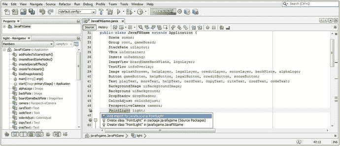

图 11-16。

Declare a PointLight named light at the top of your JavaFXGame class and hit Alt+Enter and Add Import.

因为你还需要灯光照明，在你的点光源声明后添加一个球体声明，这样我们就有东西来测试我们的代码了，如图 [11-17](#Fig17) 顶部用黄色突出显示的。接下来，在 scene.setCamera(相机)之后实例化你的点光源；方法调用。我使用了第二个更显式的构造函数方法，但给了它默认的颜色。白色，在我们看了材质以及它们如何与光色值相互作用之后，我们可能会改变它。使用`light.setTranslateZ(-25);`方法调用将灯光向下移动一点，使其不在球体内部(在 0，0，0 处)。接下来，使用一个`light.getScope().add(sphere);`方法链，将球体对象添加到点光源对象“看到”的范围内请注意，这允许您让不同的灯光对象影响 3D 场景中的不同 3D 对象，这是一个非常强大的功能。图 [11-17](#Fig17) 底部突出显示了点光源和球体对象声明、实例化和配置 Java 语句的 Java 代码，应该类似于以下 Java 代码:

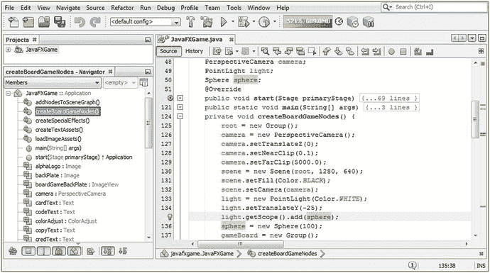

图 11-17。

Declare a sphere and light object, and in createBoardGameNodes instantiate and configure them for use.

```java
PointLight light;
Sphere sphere;
...
private void createBoardGameNodes() {
    ...
    light = new PointLight(Color.WHITE);
    light.setTranslateY(-25);
    light.getScope().add(sphere); // "Wire" the Sphere and Light together via .getScope().add()

    sphere = new Sphere(100);
    ...
}

```

你需要做的最后一件事是将你的点光源和球体连接到彼此，连接到相机，连接到场景图的游戏板 3D 分支。getChildren()。在您的。addNodesToSceneGraph()方法。

图 [11-18](#Fig18) 中间突出显示了 addNodesToSceneGraph()方法 Java 语句的代码，看起来应该是这样的 Java 方法体:

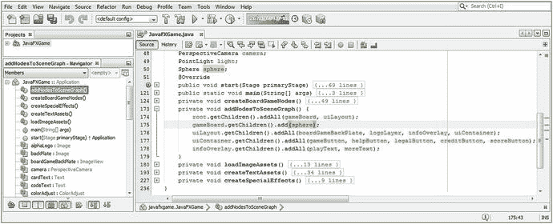

图 11-18。

Add the sphere to the gameBoard branch of the root Node so the primitive is added to your scenegraph.

```java
private void addNodesToSceneGraph() {
    root.getChildren().addAll(gameBoard, uiLayout);
    gameBoard.getChildren().add(sphere);
    uiLayout.getChildren().addAll(boardGameBackPlate, logoLayer, infoOverlay, uiContainer);
    ...
}

```

使用您的“运行➤项目”工作流程，确保我们在本章中完成的所有代码升级和添加都正常工作，并为您提供在 pro Java 9 游戏开发的早期阶段应该预期的最终结果。

确保三个(中间)游戏规则、免责声明和游戏积分按钮已经恢复到最大工作容量(现在再次填充白色背景)。此外，在 NetBeans 9 中,“高分”按钮仍然应该向输出控制台打印出一条文本消息，并且“开始游戏”现在应该移除 StackPane uiLayout 覆盖面板并显示 3D 场景。

3D 场景中应该有一个 3D 球体对象图元，我们将在下一章学习 3D 场景中的 3D 对象，在 3D 行业中称为模型、几何体、网格和图元。因为 3D 图元还没有纹理映射或颜色值，并且因为点光源对象被设置为颜色。白色，这应该是一个被白光照亮的浅灰色球体。

正如你在图 [11-19](#Fig19) 中看到的，开始游戏按钮控件现在隐藏了闪屏、UI 设计、按钮控件、文本流、文本元素和格式的整个 2D 合成管道，只需要一个简单的 Java 语句`uiLayout.setVisible(false);`，因为我们已经在本书中设置了 StackPane 父节点和 VBox、ImageView 和 TextFlow 子层次结构。一旦管道从视图中隐藏，我们就可以看到 3D 场景，为了测试 PerspectiveCamera 和 PointLight 对象，我们临时添加了一个球体对象原语。

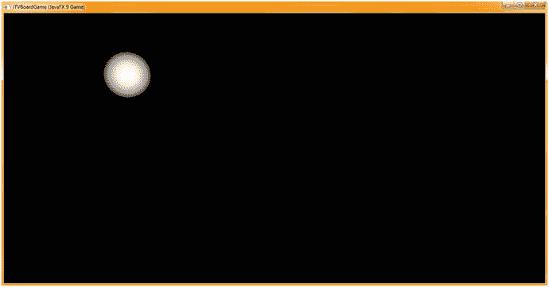

图 11-19。

Use your Run ➤ Project work process and test the 3D Scene infrastructure that you have put into place

我们现在能够使用 JavaFX APIs 进行 3D 建模和 3D 纹理映射。

## 摘要

在第十一章中，我们通过添加 PerspectiveCamera 对象为`JavaFXGame.java`添加了 3D 场景功能，该对象允许使用 X、Y 和 Z 维度以及场景对象的 3D 透视图来渲染 3D 素材。我们还添加了一个点光源对象来模拟灯泡光源来照亮这些 3D 素材，以及一个球体对象(“基本体”)来测试我们的基本 3D 场景设置。

您学习了抽象的 Camera 超类及其 ParallelCamera(用于 2D 或正交 3D 场景)和 PerspectiveCamera，我们将使用它们进行最有效的 3D 或 i3D 场景渲染。然后，我们学习了如何在 JavaFXGame 中声明、实例化和配置 PerspectiveCamera，改变它的操作方式。

然后，我们测试了我们的 2D UI 元素和层次结构，并观察到它们现在位于 3D 空间中的 2D“平面”上。我们修改了 Java 代码来补偿坐标空间的变化，将用户界面恢复为全屏。

然后，我们测试了所有的 UI 按钮对象，发现我们新的 3D 场景黑色背景颜色影响了我们的信息屏幕，并且非常巧妙地使用了一个复杂的嵌套 Java 语句来创建和插入颜色。白色背景将对象填充到 StackPane 对象的背景对象中。这解决了这个问题，用白色填充替换了一个合成层的透明度，并在我们现在的混合 3D 和 2D 合成管道中添加了另一个不透明层。这个问题解决后，我们改变了 gameButton 事件处理程序中的逻辑，允许最终用户通过隐藏 UI 覆盖来启动游戏，并显示正确点亮的测试球体原语。

在下一章中，我们将了解 JavaFX Shape3D 超类及其子类，继续学习创建 pro Java 9 游戏的 i3D 部分所需的基础知识。