# 十二、3D 模型设计和原语：使用 JavaFX 9 `Shape3D`类

现在，您已经通过将相机对象添加到场景根和专门设计用于 3D 资源的点光源对象完成了基本(空)3D 场景的设置，让我们开始了解一些关于 3D 资源本身的基础知识。这些素材以预定义的基本 3D 形状(称为图元)以及更多定制 3D 几何素材(业内通常称为网格或线框 3D 素材)的形式出现。JavaFX 9 在 javafx.graphics 模块的`javafx.scene.shape`包中提供了七个类，专门为您创建 3D 几何图形(图元或网格),我们将在本章中了解它们。在第 [12 章](12.html)中，我们还将回到 JavaFXGame 主应用类编码，并开始向场景图的游戏板组节点添加 3D 图元，以练习向 JavaFXGame 应用添加 3D 素材。虽然我们可以在 Blender 等 3D 软件包中完成这项工作，但棋盘游戏非常简单(正方形、球形、圆柱形)，我们完全可以在 JavaFX 代码中完成这项工作，这意味着我们不需要导入(和分发)3D 模型，而是可以编写代码来“凭空”模拟您的 i3D 游戏。这也将教会您更多关于 Java 9 和 JavaFX 9 中的 3D APIs，因为您可以学习如何仅使用最新的 Java 和 JavaFX APIs 来建模复杂的对象(例如您的棋盘游戏的游戏板)。

在本章中，您将了解 javafx.scene.shape 包中包含的不同类型的 JavaFX 3D 类。我们将讨论球体，它可以用来创建一个球体，你已经在第 [11](11.html) 章中使用它来测试你的 3D 场景设置。我们还将看看另外两个基本类，Box 和 Cylinder，它们可以用来创建平面和圆盘基本体。这些原语基于 Shape3D 超类，我们将首先研究这个超类。我们还将了解更高级的 TriangleMesh 类，它允许您构建基于多边形的网格对象，最后是 Mesh 和 MeshView 类层次，它允许您渲染在外部 3D 建模和渲染软件包(如 Blender 2.8(开源)或 Autodesk 3D Studio Max(付费软件包))中创建的 3D 网格对象。

## JavaFX Shape3D 超类:图元或网格视图

公共抽象 Shape3D 超类用于创建四个主要的 3D 类:长方体、球体、圆柱体和网格视图。您将使用这些类为您的 pro Java 9 游戏开发创建和显示 3D 素材。其中三个子类创建图元，这些图元是通过算法创建的预定义 3D 对象，MeshView 子类允许在 3D 场景中渲染基于多边形几何体的更详细的复杂 3D 模型。需要注意的是，还有一个 javafx.scene.shape.Shape 超类与 javafx.scene.shape.Shape3D 不相关(类层次结构方面);它用于 2D 形状，如 SVG 2D 数字插图语言中常见的形状，这在 Java 8 游戏开发入门(Apress，2014)和数字插图基础(Apress，2016)中有所介绍。

Shape3D 超类是 Node 的子类，正如我们将在 JavaFXGame 代码中使用的大多数具体类一样。像 Camera 和 LightBase 超类一样，这个 Shape3D 超类实现了 Styleable 和 EventTarget 接口，这样它的子类(对象)就可以被样式化和处理事件(可以是交互式的)。因此，Java 9 类层次结构跨越了 Java 和 JavaFX APIs，如下所示:

```java
java.lang.Object
  > javafx.scene.Node
    > javafx.scene.shape.Shape3D

```

创建 Shape3D 基类(抽象的或未直接实例化的)是为了给表示 3D 几何形状的 3D 对象提供公共属性的定义。三个主要的 3D 属性包括“材质”(或着色器和纹理贴图)，应用于形状的可填充内部或形状的轮廓，我们将在第 [13 章](13.html)中讨论；“绘制模型”属性，定义 JavaFX 9 渲染引擎如何向查看者呈现几何图形(作为实体或线框模型)；以及定义要剔除哪些面的“面剔除”属性。面剔除是一种优化，渲染引擎将通过不渲染场景中模型中的所有多边形来获得更好的性能(更快的 FPS)。由于渲染器正在从相机拍摄 3D 场景并渲染 2D 视图，因此这种“背面剔除”不会渲染模型背向相机(对相机不可见)的部分上的任何面(多边形)。正面剔除将进行相反的操作，只渲染背面的多边形，这基本上是渲染多边形的内部，模型正面(多边形)变得隐藏或不可见。还有 CullFace。关闭面剔除优化算法的 NONE 常量。卡夫斯。“后退”是默认设置，也是您通常想要使用的设置，除非您使用的是 CullFace。前面得到一些特殊的内部体绘制效果，这一章结束后，你会知道如何实验，如果你愿意的话。

如你所知，3D 渲染，以及 Shape3D 的任何子类，都是一个条件特性，你可以在你的代码中检查，就像我们在上一章中提到的那样。让我们深入了解任何 Shape3D 子类对象的三个对象设置(属性、特性、特征),它们定义了 3D 渲染引擎将如何渲染它。

cullFace 对象属性<cullface>将定义哪个 CullFace 优化算法(前、后或无)将用于此 Shape3D 对象。这很可能会影响专业 Java 9 3D 游戏的性能。</cullface>

drawMode ObjectProperty <drawmode>将定义用于呈现 Shape3D 对象的绘制模式。您的两个选项包括 DrawMode。实心 3D 对象的填充和绘制模式。线框表示的线。</drawmode>

材质对象属性<material>定义了 Shape3D 对象将用作“皮肤”的材质我们将在第 [13 章](13.html)中学习所有关于着色算法、材质和纹理贴图的知识，这一章涵盖了材质。</material>

抽象 Shape3D 超类的受保护(不可直接使用)构造函数如下所示:

```java
protected Shape3D()

```

现在让我们进入将成为所有 Shape3D 子类的一部分的方法。这很方便，因为我们可以在一个地方涵盖所有这些方法。这些可以用在任何原始三维形状或网格视图。

那个。cullFaceProperty()方法为 Shape3D 对象定义 ObjectProperty <cullface>，而。getCullFace()方法允许您轮询 Shape3D 对象的当前 CullFace 常量设置。还有就是。setCullFace(CullFace value)方法，该方法允许您更改 Shape3D 对象的 CullFace 常量设置。</cullface>

的。drawModeProperty()方法为 Shape3D 对象定义 ObjectProperty <drawmode>，而。getDrawMode()方法允许您轮询 Shape3D 对象的当前 DrawMode 常量设置。还有就是。setDrawMode(DrawMode 值)方法，该方法允许您更改 Shape3D 对象的 DrawMode 常量设置。</drawmode>

那个。materialProperty()方法为 Shape3D 对象定义 ObjectProperty <material>,而您的。getMaterial()方法允许您轮询 Shape3D 对象的当前材质对象设置。还有就是。setMaterial(Material value)方法，该方法允许您更改 Shape3D 对象的材质对象设置。</material>

接下来，让我们单独看看 Shape3D 子类，因为我们将在 JavaFXGame 中利用它们。

### JavaFX 球体:为 3D 游戏创建球体图元

因为我们已经在前一章中创建了一个名为 Sphere 的球体对象来测试 PerspectiveCamera 和 PointLight 3D 场景设置 Java 代码，所以让我们先来看看 Shape3D 子类。该类保存在 javafx.scene.shape 包中，是 Shape3D 的子类，因此它具有以下 Java 类层次结构:

```java
java.lang.Object
  > javafx.scene.Node
    > javafx.scene.shape.Shape3D
      > javafx.scene.shape.Sphere

```

Sphere 类定义了一个具有指定大小的三维球体。球体是使用程序员输入的半径尺寸(大小)通过算法创建的 3D 几何图元。该球体最初总是以 3D 原点 0，0，0 为中心。因此，球体对象有一个定义球体半径的 radius DoubleProperty 以及三个从 javafx.scene.shape.Shape3D 继承的 cullFace、drawMode 和 material 属性。

Sphere 类包含三个重载的构造函数方法，其中一个没有参数，它创建一个半径为 1.0 的球体实例。这看起来像下面的 Java 9 Sphere 实例化:

```java
sphere = new Sphere();

```

第二个构造方法，也就是我们在第 [11 章](11.html)中使用的方法，允许你使用双数值指定半径。这类似于下面的球体实例化 Java 代码:

```java
sphere = new Sphere(100);

```

第三个构造函数允许您通过多个分段参数指定半径和网格密度，类似于下面的 Java 语句，该语句创建了一个半径为 100 单位、分段数为 24 的球体:

```java
sphere = new Sphere(100, 24)

```

除了从 Shape3D 类继承的方法之外，Sphere 类还有一些自己独特的方法，包括。getDivisions()方法，该方法轮询球体对象以查看它使用了多少个分区；那个。radiusProperty()方法，它定义了球体对象的半径；那个。getRadius()方法，获取当前半径的值；还有。setRadius(double value)方法，该方法将半径值设置为不同的值。

### JavaFX 圆柱体:为游戏创建圆柱体或磁盘图元

接下来，让我们来看看公共的 Cylinder Shape3D 子类，它可以用来创建圆柱形 3D 对象，因为它是一个具体的(可用的)类，也实现了 Styleable 和 EventTarget 接口。该类保存在 javafx.scene.shape 包中，是 Shape3D 的子类，因此它将具有以下 Java 类层次结构:

```java
java.lang.Object
  > javafx.scene.Node
    > javafx.scene.shape.Shape3D
      > javafx.scene.shape.Cylinder

```

Cylinder 类用于定义具有指定半径和高度的三维圆柱体。圆柱体是一种 3D 几何图元算法，采用半径(double)属性和高度(double)属性。它最初以 0，0，0 原点为中心，半径使用 z 轴方向，高度使用 y 轴方向。

除了半径和高度属性，它还将继承 Shape3D cullFace、drawMode 和 material 属性。它有三个重载的构造函数方法，一个是默认的(空)，一个是半径和高度，第三个是半径、高度和等份。

第一个空构造函数方法创建一个半径为 1.0、高度为 2.0 的圆柱体对象的新实例。它具有以下 Java 语句格式:

```java
cylinder = new Cylinder();

```

第二个构造函数方法使用开发人员指定的半径和高度创建一个圆柱体对象的新实例。它具有以下 Java 语句格式:

```java
cylinder = new Cylinder(50, 250);

```

第三个构造函数方法使用开发人员指定的半径、高度和分辨率(确定平滑度的分割数)创建一个圆柱体对象的新实例。它具有以下 Java 语句格式:

```java
cylinder = new Cylinder(50, 250, 24);

```

半径有三种方法，高度有三种方法，还有一种。getDivisions()方法用于轮询 Divisions 属性，该属性必须使用第三个构造函数方法格式进行设置，因为没有。setDivisions()方法调用或 divisionsProperty()方法调用。

双份。getHeight()方法将轮询(获取)圆柱体对象的 Height 属性的值。DoubleProperty heightProperty()方法定义圆柱体对象的高度属性或 Y 维度。最后，void setHeight(double value)方法允许开发人员设置圆柱体对象的 Height 属性值。

double getRadius()方法将轮询(获取)圆柱体对象的 Radius 属性的值。DoubleProperty radiusProperty()方法定义圆柱体对象的半径属性或 Z 维度。最后，void setRadius(double value)方法允许开发人员为圆柱体对象设置 Radius 属性的值。

最后，让我们来看一个 Box 原语类，它允许创建各种有用的形状。

### JavaFX 盒子:为 3D 游戏创建盒子、柱子和平面

接下来，让我们来看看 public Box Shape3D 子类，它可以用来创建正方形、矩形和平面 3D 对象，因为它是一个具体的(可用的)类，也实现了 Styleable 和 EventTarget 接口。该类保存在 javafx.scene.shape 包中，是 Shape3D 的子类，因此它将具有以下 Java 类层次结构:

```java
java.lang.Object
  > javafx.scene.Node
    > javafx.scene.shape.Shape3D
      > javafx.scene.shape.Box

```

Box 类定义了一个三维盒子，通常称为立方体图元，具有指定的大小。Box 对象是一个 3D 几何基本体，除了三个继承的 cullFace、drawMode 和 material Shape3D 属性之外，还具有三个 double 属性(深度、宽度和高度)。在实例化时，它最初以原点为中心。

Box 类有两个重载的构造方法。一个创建默认的 2，2，2 立方体，看起来像下面的 Java 代码:

```java
box = new Box();

```

第二种构造函数方法允许您指定多维数据集的维度，如下所示:

```java
box = new Box(10, 200, 10); // Creates a Post (or Tall Rectangle) Primitive
box = new Box(10, 0.1, 10); // Creates a Plane (or a Flat Surface) Primitive

```

正如您可能已经猜到的，Box 类中有九个可用的方法，每个属性三个。这是我们将用来创建大部分游戏板基础设施的类，所以我们可能会经常使用它们。

DoubleProperty depthProperty()方法用于定义盒子的深度或 Z 维度。double getDepth()方法可用于从 Box 对象获取(轮询)深度属性的值。void setDepth(double value)方法可用于为 Box 对象的 Depth 属性设置或指定新值。

DoubleProperty heightProperty()方法用于定义框的高度或 Y 维度。double getHeight()方法可用于从 Box 对象获取(轮询)Height 属性的值。void setHeight(double value)方法可用于设置或指定 Box 对象的 Height 属性的新值。

DoubleProperty widthProperty()方法用于定义宽度，即盒子的 X 维度。double getWidth()方法可用于从 Box 对象获取(轮询)Width 属性的值。void setWidth(double value)方法可用于设置或指定 Box 对象的 Width 属性的新值。

接下来，让我们看看在 JavaFXGame 代码中实际实现不同的原语需要做些什么！

### 使用原语:向 JavaFXGame 类添加原语

让我们将另外两个基本对象 Box 和 Cylinder 添加到 JavaFXGame 类中，这样我们就可以了解面剔除和绘制模式。我们将为它自己的章节 [13](13.html) 保存材料，因为着色器和纹理贴图值得它们自己的章节和重点讨论。在类的顶部声明一个名为 box 的 Box 对象，并使用 Alt+Enter 让 NetBeans 9 帮助您编写导入语句。正如您在图 [12-1](#Fig1) 中所看到的，将正确的类添加到您的 Java 9 游戏中是非常重要的，因为还有一个 javax.swing.Box 类(在弹出助手下拉列表中排在第二位)用于 2D UI 设计，并且在列表的顶部是(NetBeans 最佳猜测)用作 3D 原语的 javafx.scene.shape.Box！双击第一个(正确的)类，让 NetBeans 为您编写导入语句。

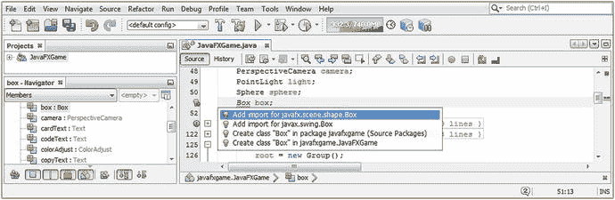

图 12-1。

Declare a Box object at the top of the class; use Alt+Enter, and select Add import for javafx.scene.shape.Box

使用第二个构造函数在 createBoardGameNodes()方法中实例化 box 对象，如图 [12-2](#Fig2) 所示。请记住，您需要将这个 box 节点添加到。addNodesToSceneGraph()方法。

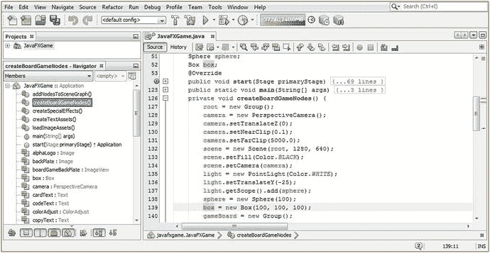

图 12-2。

Instantiate the Box in createBoardGameNodes, and set the depth, height, and width to 100, 100, 100

这可以通过将您当前的`gameBoard.getChildren().add(sphere);` Java 语句修改为`gameBoard` `.getChildren().` `addAll` `(sphere,` `box` `);`来轻松实现，如下图所示和图 [12-3](#Fig3) :

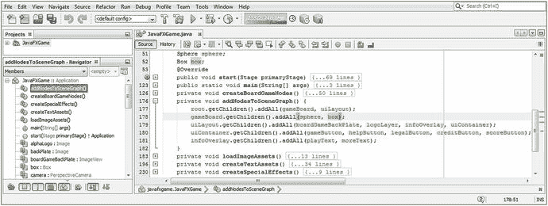

图 12-3。

Use the .addAll() method to add a box object to the SceneGraph in the addNodesToSceneGraph() method

```java
box = new Box(100, 100, 100);                   // in .createBoardGameNodes() method

gameBoard.getChildren().addAll(sphere, box);   //  in .addNodesToSceneGraph() method

```

声明 Box 对象后，在 createBoardGameNodes()方法中实例化该对象，使用与球体相同的 100 单位值。您将能够看到大小之间的关系，因为它们都是在 0，0，0 处创建的。对于 Box 构造函数方法，这需要三个(double)值，它们都应该是 100。

接下来，在类的顶部声明一个名为 pole 的圆柱体，并在。createBoardGameNodes()方法，使用 50 的宽度、250 的高度和 24 的用于网格(线)绘制表示的部分或分割的数量。

这应该看起来像下面的 Java 代码，在图 [12-4](#Fig4) 中用黄色和蓝色突出显示:

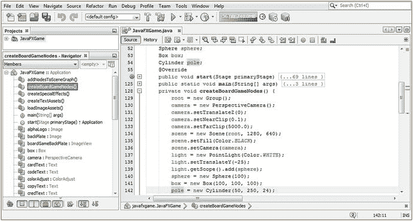

图 12-4。

Create a Cylinder object named pole and instantiate it with a radius of 50, a height of 250, and 24 divisions

```java
Cylinder pole;                        // Declare object for use at the top of your class
...
pole = new Cylinder(50, 250, 24);     // in .createBoardGameNodes() method

```

如果您在此时使用 Run ➤项目工作流程，您将看不到 pole 对象，因为您还没有将它添加到 JavaFX 场景图中。打开 addNodesToSceneGraph()方法，将 pole 对象添加到参数区域(parens)内包含的 Java 列表的末尾。这都是通过在。handle()方法，如图 [12-5](#Fig5) 中间高亮显示:

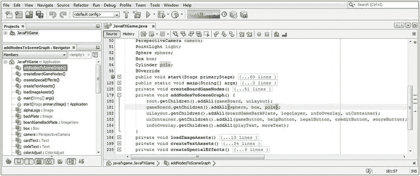

图 12-5。

Add a pole Cylinder object to SceneGraph, at the end of the gameBoard.getChildren().addAll() method call

```java
gameBoard.getChildren().addAll(sphere, box, pole);    // in addNodesToSceneGraph() method

```

正如您将看到的，当我们在 3D 场景中渲染此代码时，您在 3D 合成中将对象添加到场景图的顺序与 2D 合成堆栈中的 2D 素材层顺序类似，因为 3D 图元将显示为“在彼此前面”越晚将对象添加到场景图中的游戏板组，越晚将它们渲染到屏幕上。因此，添加到场景图的最后一个图元将被渲染在它之前的所有其他图元之上，而添加到场景图的第一个图元将首先被渲染(即，在所有其他 3D 图元的下面或后面)。

在大多数 3D 软件包中，位于 0，0，0(场景中心)的三个图元将在彼此内部进行渲染。这告诉我们一些关于 JavaFX 的非常重要的 3D 艺术家的事情，那就是你不能使用 JavaFX 原语执行建设性的实体几何(CSG)建模。CSG 是 3D 建模的早期形式之一，涉及使用基本的 3D 图元结合布尔运算来创建更复杂的 3D 模型。

让我们使用您的运行➤项目工作流程，看看 JavaFX 是如何渲染这三个位于 0，0，0 的原语的。如图 [12-6](#Fig6) 所示，圆柱体对象在一个盒子对象的前面，盒子对象在一个球体对象的前面。大多数 3D 软件包会将其渲染为球体内部的一个盒子，可能盒子的角穿过球体(取决于比例)，圆柱体的末端会从球体的顶部和底部出来。我按照这个特定的顺序做了这个练习，因为对于开发人员来说，在构建 Java 9 游戏时，意识到他们能做什么和不能做什么是至关重要的。您可以在 JavaFX 中实现这种布尔效果，方法是使用从三维建模器(如 MOI3D、SILO 或 Blender)导入的网格对象，其中布尔操作已在 JavaFX 9 外部完成。

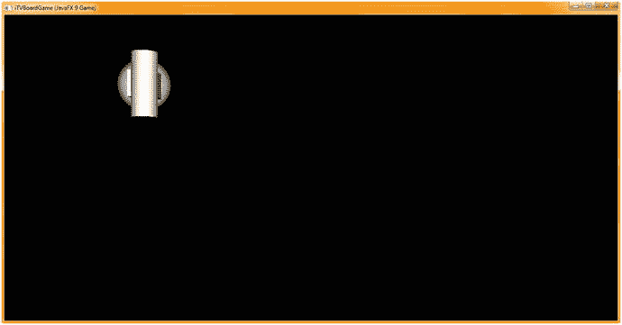

图 12-6。

Use the Run ➤ Project to see these three primitives in the Z-order that you added them to the SceneGraph

接下来，让我们使用一些 3D 图元修改(移动和旋转)方法调用，将它们从中心场景移开，并旋转立方体，使其看起来不像 2D 对象。这都可以通过使用。setTranslateX()和 setRotate()方法调用 box 和 pole 对象，如图 [12-7](#Fig7) 底部所示:

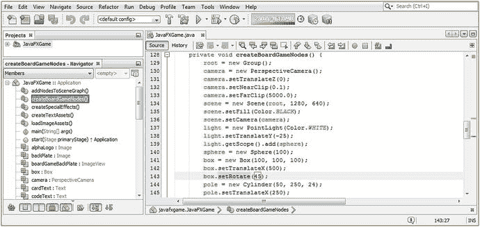

图 12-7。

Use setTranslateX(250) to move primitives 250 units apart and use setRotate(45) to rotate the box 45 degrees

```java
box.setTranslateX(500);
box.setRotate(45);
pole.setTranslateX(250);

```

接下来，使用“运行➤项目”工作流程来分别查看基本数据。如图 [12-8](#Fig8) 所示。setRotate()方法使用 z 轴进行旋转，因此您的 3D 对象仍然呈现为 2D 对象。让我们解决这个问题！

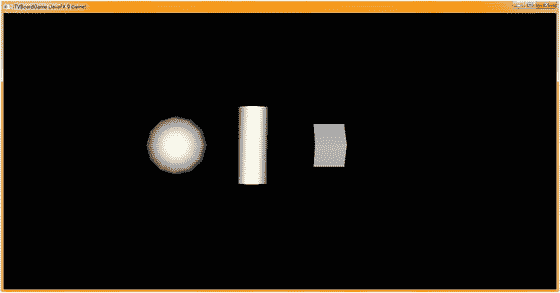

图 12-8。

All three primitives are now spaced apart; the box still looks 2D

要更改您的。setRotate()方法用来配置它的旋转算法，还有第二个。setRotationAxis()方法，可用于更改默认旋转。旋转的 z 轴设置。x 轴常量，正如你在 Rotate 类中看到的点符号。

显然，正如您现在所了解的那样。setRotationAxis()方法调用必须在。setRotate(45)方法调用，以便在实际使用旋转算法之前改变旋转轴。

在 box . settranslate(500)之后添加一个. setRotateAxis()方法调用 off 您的 box 对象；方法调用，使用旋转。用于配置旋转算法的 X_AXIS 常量。Java 语句序列应该类似于下面的 Java 代码，可以在图 [12-9](#Fig9) 的底部看到:

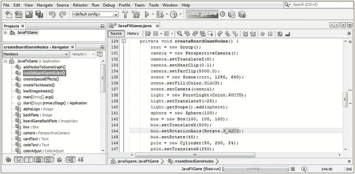

图 12-9。

Add a .setRotationAxis() method call off box after the box.setTranslateX(500); and set it to Rotate.X_AXIS

```java
box.setTranslateX(500);
box.setRotationAxis(Rotate.X_AXIS);
box.setRotate(45);
pole = new Cylinder(50, 250, 24);
pole.setTranslateX(250);

```

接下来，使用运行➤项目工作流程，再次单独查看您的原语。如图所示，在图 [12-10](#Fig10) 中。setRotate()方法现在使用 z 轴进行旋转，因此您的 3D 对象现在呈现为 3D 对象，您可以看到阴影(不同面上的颜色或亮度差异)。

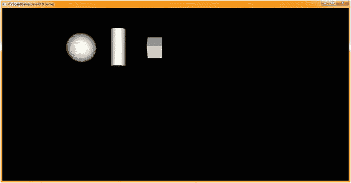

图 12-10。

Now all primitives are oriented in such a way that their default light gray shading is visible in the renderer

随着本书的深入，我们将了解 JavaFX 中旋转 3D 对象的更复杂的方法，因为旋转在 3D 中是一个非常复杂的主题，似乎不是“在表面上”(没有双关语)。旋转在它的算法中使用了比转换更复杂的数学体系，其中一些复杂性会渗透到表面，因此必须由所有专业 Java 9 3D 游戏开发人员来处理和理解。

现在我们已经将 JavaFX 中提供的三个基本图元分开，并以一种在渲染视图中向您显示更多面和边的方式面对，我们将进一步了解面剔除和绘制模式对几何图形的影响。我们将在第 [13 章](13.html)中为自己保存实物的创建和应用；材质对象创建是一个核心的 3D 主题(纹理映射),应该作为它自己的主题来对待，因为 3D 对象的着色决定了它的视觉质量。

接下来，让我们看看绘制模式(在大多数 3D 软件包中称为渲染模式)，以便您在开发 pro Java 9 游戏时可以查看对象的 3D 线框表示。

### Shape3D 绘制模式属性:实体几何图形和线框

现在我们已经在屏幕上排列了三个主要的 JavaFX 原语，让我们看看 Shape3D 超类的 drawMode 属性，它由这些原语中的每一个继承。这个属性使用了 DrawMode 类中的一个常量，您可能已经猜到了，目前可用的两个常量是 DrawMode。FILL 和 draw mode . LINE。FILL 常量为您提供实体模型几何图形表示，LINE 常量为您提供线框模型几何图形表示。我们将使用。本节中的 setDrawMode(drawMode)方法调用将我们的三个图元从实体模型更改为线框模型，以便我们可以更改线框的分辨率或分割，并查看这样做的效果，以便我们可以围绕 X 维度旋转球体，查看其线框构造的外观以及分割属性如何更改它在 3D 场景中的外观(渲染)。然而，首先，我有点厌倦了在 3D 场景的左上角看这些图元，所以我们将使用。setTranslateZ(-500)将相机对象拉近 100%(或将基本体放大 100%)，并使用。setTranslateY(300)方法将图元置于视图的水平中心。稍后我们将使用。settranslate(-300)方法调用使图元在视图的垂直中心居中。

打开你的。start()方法和 gameButton 事件处理代码块，并更改。setTranslateZ()方法调用值从-1000 到-500。然后添加一个. setTranslateY()方法调用关闭 camera 对象并传递给它一个-300 场景单位的数据值，如图 [12-11](#Fig11) 以及下面的 Java 代码语句所示:

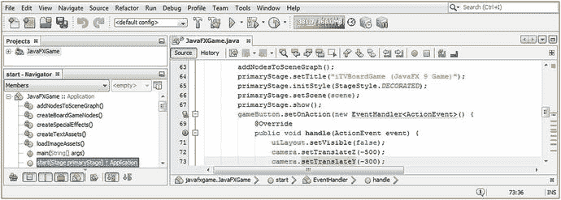

图 12-11。

Zoom the camera object in 100 percent using .setTranslateZ(-500), and move it down with .setTranslateY(-300)

```java
camera.setTranslateZ(-500);
camera.setTranslateY(-300);

```

接下来，让我们打开 createBoardGameNodes()方法，并为每个图元添加一个`.` `setDrawMode` `(DrawMode.` `LINE` `)`方法调用，将它们的渲染模式从立体几何设置为线框几何，这样我们就可以看到它们的底层结构。在图 [12-12](#Fig12) 中用黄色突出显示的 Java 语句应该如下所示:

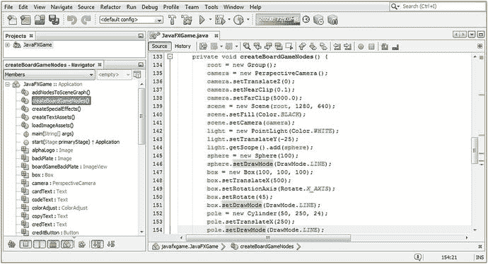

图 12-12。

Set the drawMode property to LINE for all primitives with a .setDrawMode(DrawMode.LINE) method call

```java
sphere.setDrawMode(DrawMode.LINE);
box.setDrawMode(DrawMode.LINE);
pole.setDrawMode(DrawMode.LINE);

```

接下来，使用运行➤项目工作流程，再次查看您的原语。正如你所看到的，在图 [12-13](#Fig13) 中，你的图元正在使用线框表示法进行渲染，并在 3D 场景中的 Y 维度上居中。

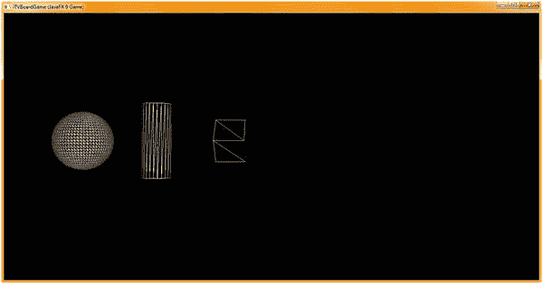

图 12-13。

All three primitives are now rendered in wireframe mode and are centered vertically

使用将相机置于 X 维度的中心。使用下面的代码 setTranslateX()，如图 [12-14](#Fig14) 所示:

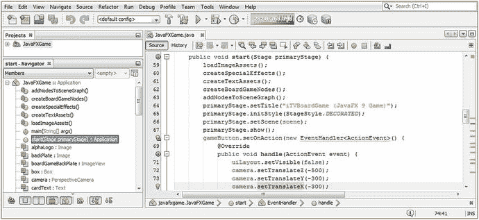

图 12-14。

Add a .setTranslateX(-300) to move your primitives to the vertical (X dimension) center of your 3D Scene

```java
camera.setTranslateX(-300);

```

请注意，当您移动相机对象时，它保持直视前方，而在 3D 软件包中，有一个相机“目标”保持锁定在场景的中心或场景中的 3D 对象上。在 JavaFX 中，相机对象是用一条直线(称为光线或向量)固定的，这条直线从相机的后面穿过前面，沿着相机对象指向的方向延伸到无穷远处。所以，在 3D 软件中，如果你向上移动相机，它的视野向下旋转，相机和它的主体之间有一个链接(或线)。

如果您想要 JavaFX 中的这种行为，您必须手动旋转相机，因为 JavaFX 相机超类当前没有指定目标属性(目标功能)。随着本书的进展，我们将关注 PerspectiveCamera 对象以及如何在 3D 场景中以更高级的方式利用它，因为相机是 i3D 场景的一个重要方面，也是 pro Java 9 i3D 游戏开发过程中使用的一个重要工具。

在我们再次渲染 3D 场景之前，因为我们从代码中知道它现在将会很好地居中，足以让我们查看分割和面剔除等属性，并了解这些属性如何影响组成 3D 图元的多边形，所以让我们使用重载的(第二个)球体(大小，分割)构造函数方法格式，并降低球体对象的网格分辨率，以优化保存该 3D 对象所需的内存量。您还将向前旋转它，以便可以看到球体构造的顶部，同时将圆柱体的分辨率降低 100%，从 24 等份减少到 12 等份。我总是使用可被 4 整除的除法值(90 度乘以 4 是 360)，如果打开面剔除，一半的除法甚至都没有渲染。这些都可以通过使用以下 Java 语句来完成，这些语句在图 [12-15](#Fig15) 中(和底部)突出显示:

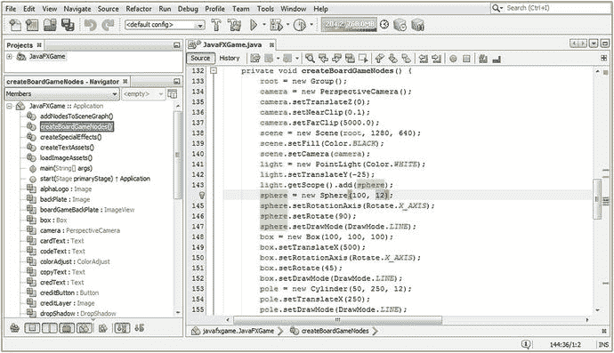

图 12-15。

Construct your Sphere with 12 divisions, X rotate it 90 degrees, and reduce your Cylinder to 12 divisions

```java
sphere = new Sphere(100, 12);
sphere.setRotationAxis(Rotate.X_AXIS);
sphere.setRotate(90);
sphere.setDrawMode(DrawMode.LINE);

```

现在是时候使用运行➤项目的工作过程，并渲染我们的场景。正如你在图 [12-16](#Fig16) 中看到的，我们的 3D 图元更接近 3D 场景的中心，更容易查看，并且使用更少的数据来构建。正如你在图 [12-13](#Fig13) 中看到的，这个球体使用了 48 个分区来构建。这使用了几百个多边形，可以计算为 48×48×2 = 192；192 个多边形需要大量内存来处理(存储和渲染)，因为每个多边形都有大量数据来定义它(模型中的位置、大小、方向、颜色、法线方向、平滑组)。

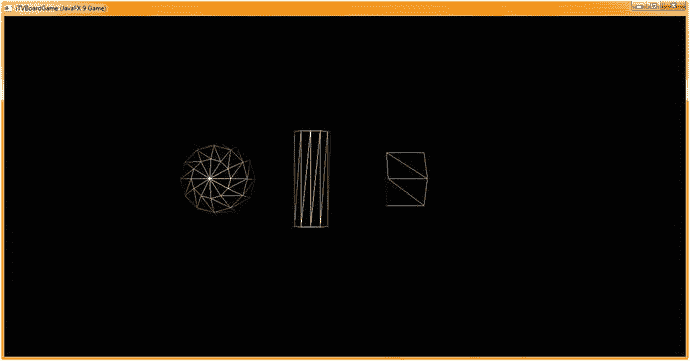

图 12-16。

Your primitives are now centered in the 3D Scene Camera view, and you can see the Sphere construction

当我们在下一节面剔除中渲染这些图元时，您将看到立方体和圆柱体在外观上并没有真正改变，因此圆柱体的分区减少了 100 %( 24 到 12 ),这是一次成功的优化。球体缩小了 200 %(从 48 到 12 ),这是一个很大的变化，平滑的错觉在球体周围有点分散，尤其是从顶部渲染时，这就是为什么我把它向前旋转了 90 度。

接下来，让我们看看使用背面剔除的渲染算法的优化，以及在使用实体模式渲染 3D 图元时，较低的分辨率(较少的划分)如何影响它们的视觉质量。

### Shape3D 面剔除属性:优化渲染管道

Shape3D cullFace 属性和 cullFace 类用于控制 3D 场景的面和多边形渲染优化。默认为 CullFace。没有，所以你需要使用代码来打开这个优化，我将在本章的这一节向你展示如何做。我认为模型在剔除人脸后看起来更好(对比度更高)，如果你对你的 pro Java 9 游戏进行了足够好的优化，它应该可以在所有平台和设备上很好地运行，而不必剔除模型中一半的人脸。也就是说，一旦你知道如何做到这一点，你应该很容易在测试阶段进行实验，看看它如何影响游戏的视觉质量和流畅度。

让我们继续向 createBoardGameNodes()方法添加代码，为基本对象设置背面剔除。首先，我们需要改变你的基本体的 drawMode 属性，在你的球体，盒子和柱子上使用`.` `setDrawMode` `(DrawMode.` `FILL` `)`来填充实体模型。在对每个基本对象调用这个方法之后，添加一个. setCullFace(CullFace。BACK)方法调用。如果您在 NetBeans 9 中使用弹出助手工作进程，您将会看到它使用默认的 CullFace 编写您的代码。无设置，因此您必须将它更改为 CullFace。返回以开启此渲染管道优化算法。

背面剔除语句的 Java 代码在图 [12-17](#Fig17) 的底部突出显示，看起来应该像下面的 Java 代码:

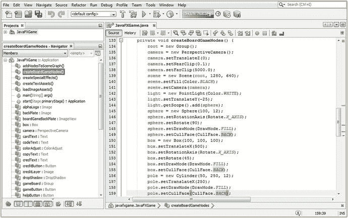

图 12-17。

Add method calls to .setCullFace() with the value CullFace.BACK off of all of the primitives in your Scene

```java
sphere.setDrawMode(DrawMode.FILL);
sphere.setCullFace(CullFace.BACK);
box.setDrawMode(DrawMode.FILL);
box.setCullFace(CullFace.BACK);
pole.setDrawMode(DrawMode.FILL);
pole.setCullFace(CullFace.BACK);

```

图 [12-18](#Fig18) 显示了一个运行➤项目 Java 代码测试的工作流程，显示了背面剔除算法的安装和对 3D 场景图元的操作。请注意，在您的球体上，降低的几何体分辨率(更少的划分)会导致网格上的一些平滑问题，其中网格拓扑通过平滑算法显示。我会将球体划分增加到 24 以减轻这种情况，这仍然是对默认设置的 100%优化。

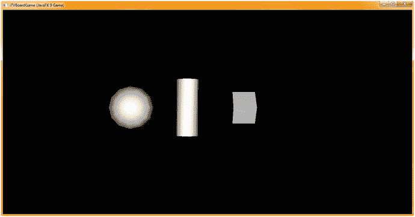

图 12-18。

The renderer is now rendering half as much 3D data, and your lower resolution can be seen on the Sphere

另请注意，当背面剔除打开时，立方体(长方体)基本体上的明暗对比的对比度(面之间明暗颜色的差异)要小得多。你做的自定义纹理映射越多，这个问题就越小(不太明显)(在下一章及以后的章节中讨论),但这可能是为什么默认为 FaceCull 类和这个方法调用的 NONE，因为面剔除优化可能以某种方式影响当前算法代码中的对比度(质量)。我以这种方式设置这一章，以便您可以看到这一点，因为最基本的图元之一是使用默认的中灰色着色器颜色显示面部之间的对比度明显降低，如果您比较图 [12-10](#Fig10) 和图 [12-18](#Fig18) ，您可以看到对比度从高到几乎为零。

接下来，让我们看看三个与网格相关的类，mesh、TriangleMesh 和 MeshView，看看它们做什么，以及它们如何相互关联，因为它们将允许您渲染使用 3D 软件创建的复杂网格对象。

## JavaFX Mesh 超类:构造一个三角形网格

理解抽象 Mesh 超类及其与 TriangleMesh 子类的关系很重要，triangle Mesh 子类可用于“手动编码”复杂的网格对象，以及它与 MeshView 类的关系，Mesh view 类实际上是 Shape3D 的子类，而不是 Mesh 的！这是为了使 MeshView 可以继承(扩展)Shape3D 的 cullFace、drawMode 和 material 属性，当然，这些属性对于使网格对象变得逼真是至关重要的(尤其是 material 属性和 Material 类)。正如您将看到的，MeshView 构造函数接受一个网格对象。这是复杂 3D 对象所基于的核心类(算法)，因此 Mesh 和 MeshView 是用于 pro Java 9 游戏开发的最关键的类。如果出于某种原因，您想要编码复杂的多边形几何体，也称为“三角形网格”，这不是一个最佳的工作流程，您可以使用 triangle mesh，我们将详细介绍它。

更好的工作流程是使用外部 3D 软件包，将 3D 对象直接导入网格对象，然后由 MeshView 对象引用。这是一种更快的方式来让一个先进的 i3D 游戏快速有效地运行起来，也是一种将专业技术人员引入 i3D 游戏开发工作流程的方式。

### JavaFX Mesh 超类:您的原始 3D 模型数据容器

公共抽象 Mesh 超类看似简单，只有一个 Mesh()构造函数方法和一个 TriangleMesh 子类(用于使用 Java 代码加载网格数据),因此我们将在这里首先介绍它。它本质上是一个用于包含 3D 数据的对象，与其他以 3D 模型为中心的类一起包含在 javafx.scene.shape 包中。Java 类的层次结构如下所示，因为 Mesh 类被临时编码为保存 3D 网格表示的 Java 类:

```java
java.lang.Object

  > javafx.scene.shape.Mesh

```

这是一个基类，用于表示不是 JavaFX Shape3D 图元的复杂 3D 几何表面。请注意，这显然是一个有条件的功能，因为复杂的 3D 几何图形将需要一个 3D 渲染管道来对您的 pro Java 9 游戏开发有用。轮询 ConditionalFeature。场景 3D 将是必要的。

如前所述，构造函数方法非常简单，类似于下面的 Java 代码:

```java
protected Mesh() // Protected Code Cannot Be Used Directly (but can be used by a subclass)

```

接下来，让我们看看 MeshView 类，它将引用、保存在内存中，并使用渲染引擎在 3D 场景中显示该网格对象。这个类是网格引擎和 Shape3D 之间的“桥梁”。

### JavaFX MeshView 类:格式化并显示 3D 网格数据

公共 MeshView 类几乎和 Mesh 类一样简单，只有两个重载的 MeshView()构造函数方法，没有子类，所以接下来我将在这里介绍它。它是 Shape3D 的子类，存储在 javafx.scene.shape 包中。它实现了 Styleable 和 EventTarget 接口，就像三个原语类一样。它用于使用网格对象中保存的原始 3D 模型数据来定义 3D 表面。MeshView 类的 Java 类层次结构如下所示，因为 MeshView 类需要继承所有这些关键的 Shape3D 渲染特征:

```java
java.lang.Object
  > javafx.scene.Node
    > javafx.scene.shape.Shape3D

      > javafx.scene.shape.MeshView

```

MeshView 对象有一个 ObjectProperty <mesh>mesh 属性，它指定 MeshView 的 3D 网格数据，该数据是从第二个重载的构造函数方法参数或使用. getMesh(mesh)方法调用获得的。此类(对象)还从 javafx.scene.shape.Shape3D 类继承核心 Shape3D 属性，这些属性您已经介绍过(除了 material ),它们是 cullFace、drawMode 和 material。</mesh>

有两种重载的构造函数方法。创建一个空的网格视图，以便在将来加载网格对象(3D 数据)，这当然会利用以下 Java 语句格式:

```java
meshView = new MeshView();

```

第二个重载构造函数方法调用使用以下对象实例化 Java 语句格式实例化 MeshView 对象，并同时用网格对象(3D 几何数据)加载它:

```java
meshView = new MeshView(yourMeshNameHere);

```

MeshView 类有三个用于处理网格对象的方法调用，包括获取属性 Mesh 的网格对象值的 getMesh(Mesh)方法调用，为调用此方法的任何 MeshView 指定 3D 网格(网格对象)数据的 ObjectProperty <mesh>meshProperty()方法调用，以及为 MeshView 属性 Mesh 设置网格对象值的 void setMesh(Mesh value)方法调用。</mesh>

在我们介绍 TriangleMesh 类之前，让我们先看一下 VertexFormat 类，它将通过指定用于给定 3D 模型(即网格对象及其 3D 模型数据)的顶点数据格式来定义顶点数据。

### JavaFX VertexFormat 类:定义你的 3D 顶点数据格式

public final VertexNormal 类还扩展了 Java Object master 类，这意味着该类是临时编码的，以定义数据点数组、其纹理坐标及其法线的格式，如果外部 3D 模型以 JavaFX 导入/导出软件支持的各种数据格式导出的话。该类是 Mesh、TriangleMesh 和 MeshView 类的实用程序类，这可以从它的最终修饰符看出，这意味着它不能被子类化。与我们介绍的其他六个类一样，它保存在 javafx.graphics 模块的 javafx.scene.shape 包中，其类层次结构如下所示:

```java
java.lang.Object
  > javafx.scene.shape.VertexFormat

```

VertexFormat 类(对象)定义了两个不同的数据格式常量，它们反映了 3D 网格对象中每个顶点所包含的 3D 数据的类型。静态顶点格式 POINT_NORMAL_TEXCOORD 字段将指定包含点坐标、法线和纹理坐标数据的顶点格式。静态 VertexFormat POINT_TEXCOORD 字段将指定包含点坐标和纹理坐标数据的顶点格式。我建议使用支持法线的格式，因为可以用来定义 3D 模型的数据越多，渲染器就可以更准确地渲染它们，因此也更专业。

该类中有五种方法用于处理顶点及其法线、点和纹理坐标数据组件。的。getVertexIndexSize()方法将返回表示顶点索引的整数个组件索引。的。getNormalIndexOffset()方法将返回给定顶点内法线组件的面数组的整数索引偏移量。的。getPointIndexOffset()方法将返回给定顶点内点组件的面数组中的整数索引偏移量。的。getTexCoordIndexOffset()方法将返回顶点内纹理坐标组件的面数组中的索引偏移量。String toString()方法将返回 VertexFormat 的字符串(文本)数据，允许您以可读格式查看顶点数据。

接下来，我们来看看 TriangleMesh 对象，它是最复杂的；它允许您使用 Java 代码创建 3D 模型。在本章中，我们不会看到这样的例子，因为这不是获得快速、专业的 i3D 游戏开发 3D 模型创建结果的最有效方式。

这是因为使用专业的 3D 建模、纹理、渲染和动画软件包，如开源的 Blender.org、Autodesk 3D Studio Max、Maya 或 NewTek Lightwave，是创建专业 3D 模型的最合理的工作流程。

由于大量的 3D 数据导入文件格式，可以更快地创建 3D 模型，然后 pro Java 9 游戏开发人员可以使用 JavaFX 9 importer 格式之一将高质量的 3D 数据作为网格对象引入 JavaFX。

我们将在第 [13](13.html) 章中查看纹理映射后，在第 [14](14.html) 章中查看这一工作过程，以便我们更好地理解什么是纹理映射，因为它也用于第三方 3D 建模软件包中。使用第三方开发工具，如 Fusion、Blender、Audacity、Gimp 和 Inkscape，通常会产生更好的结果。

### JavaFX TriangleMesh 类:创建一个 3D 多边形网格对象

public TriangleMesh 类是 Mesh 超类的一个子类，它不实现任何接口，因为它用于创建要存储在 Mesh 对象内部的 3D 数据，很像使用许多流行的 3D 文件格式导入程序导入 JavaFX 的 3D 模型，我们将在第 [14 章](14.html)中介绍这些导入程序。TriangleMesh 存储在 javafx.graphics 模块的 javafx.scene.shape 包中，其 Java 类层次结构如下所示:

```java
java.lang.Object
  > javafx.scene.shape.Mesh

    > javafx.scene.shape.TriangleMesh

```

TriangleMesh 对象用于定义 3D 多边形网格。该对象将使用两个 VertexFormat 常量之一，并包括一组包含顶点组件的独立数据数组对象，这些组件包括点、法线、纹理坐标和定义网格的各个三角形的面数组。正如我在本章中不止一次提到的，通过使用支持建模的外部 3D 软件包，如 Blender、Hexagon、Lightwave、Maya 或 3D Studio Max，可以完全避免这种低层次的复杂性，并加速过去。

请注意，JavaFX 术语点等同于 3D 软件术语顶点。JavaFX 9 使用 vertex 来指代顶点(点)及其所有关联的属性，包括其法线位置和关联的 UV 纹理贴图坐标。因此，在三角形网格方法名称和方法描述中提到的点(我们将在本章的后半部分介绍)实际上是指 3D 空间中的 3D 点(x，y，z)位置数据，代表一个顶点的空间位置。

类似地，术语点(或点的集合)用于表示表示多个顶点的 3D 点集。术语法线用于表示 3D 空间中的 3D 向量(nx，ny，nz ),其表示单个顶点的方向，该方向告诉渲染引擎面面向哪个方向，因此它可以在面的正确侧渲染纹理。术语法线(或法线数据的集合)用于表示多个顶点的 3D 向量集。

术语“纹理坐标”用于表示单个顶点的一对 2D 纹理坐标(u，v ),而术语“纹理坐标”(纹理坐标的集合)用于表示跨多个顶点的纹理坐标组。

最后，术语“面”用于表示一组三个交错点、法线(这些是可选的，取决于指定的相关 VertexFormat 字段类型)和纹理坐标，它们一起表示一个三角形的几何拓扑。术语面(面的集合)用于表示一组三角形(每个用一个面表示)，这通常是 3D 多边形模型的组成部分。困惑了吗？正如我所说的，使用导入/导出工作流并让高级 3D 建模软件用户界面完成所有工作是获得令人难以置信的结果的更好方法，而不是试图使用 Java 将点、法线和 UV 坐标放置到 3D 空间中。我在本书中尝试做的是向您展示创建混合 2D 和 3D 游戏的最快、最简单和最优化的方法，以便您可以创建市场上任何游戏玩家从未体验过的 pro Java 9 游戏。

这个 TriangleMesh 类(object)有一个 ObjectProperty <vertexformat>vertexFormat 属性，该属性将用于使用 vertexFormat 实用程序类指定这个 TriangleMesh 的顶点格式，因此这将是 vertex format。POINT_TEXCOORD 或 VertexFormat。点 _ 法线 _TEXCOORD。</vertexformat>

TriangleMesh 类有两个重载的构造函数方法。第一个(空的)使用默认的 VertexFormat 创建一个 TriangleMesh 类的实例。POINT_TEXCOORD 格式类型，如下所示:

```java
triangleMesh = new TriangleMesh(); // Creates Points & Texture Map Only Polygonal Mesh Object

```

第二个构造函数方法使用在方法调用的参数区域中指定的 VertexFormat 创建 TriangleMesh 的新实例。这类似于下面的 Java 实例化语句:

```java
normalTriangleMesh = new TriangleMesh(VertexFormat.POINT_NORMAL_TEXCOORD) // Includes Normals

```

有十几种方法用于处理 TriangleMesh 对象构造；接下来让我们来看看它们。

那个。getFaceElementSize()方法将返回表示给定人脸的元素数量。使用此方法确定任何给定面使用的数据(点、法线、纹理贴图)。

ObservableFaceArray getFaces()方法将获取 TriangleMesh 对象中的整个面数组，包括点的索引、法线(仅当 VertexFormat。POINT_NORMAL_TEXCOORD 是为网格指定的)，以及 TEXCOORD 数组。使用它从你的 TriangleMesh 对象中提取多边形数据。

ObservableIntegerArray getface smoothinggroups()方法将从 TriangleMesh 对象中获取一个 faceSmoothingGroups 数据数组。平滑组定义渲染的 3D 对象的表面着色(平滑)中接缝出现的位置。我们在本书前面的第 3 章中讨论过这个话题。

那个。getNormalElementSize()方法将返回表示 TriangleMesh 对象中法线的元素数量。这告诉你有多少法线被用来表示表面方向。

ObservableFloatArray getNormals()方法将获取三角形网格对象的法线数组。

的。getPointElementSize()方法将返回表示 TriangleMesh 对象中 XYZ 点的元素数量。这将告诉你有多少顶点(顶点计数)在你的三角网格的三维模型。

ObservableFloatArray getPoints()方法用于获取 TriangleMesh 的点数据数组。

那个。getTexCoordElementSize()方法将返回许多表示 TextureMesh 对象中纹理坐标的数据元素。使用它来确定模型中 UV 贴图坐标的数量。

ObservableFloatArray getTexCoords()方法将获取 TriangleMesh 对象的 tex coords 数组。使用此选项从 TextureMesh 3D 多边形对象中提取纹理坐标数据(仅限)。

VertexFormat getVertexFormat()方法将从 TriangleMesh 对象内部获取 VertexFormat 属性的值。使用它来确定该 3D 模型数据是否支持法线。

虚空。setVertexFormat(VertexFormat value)方法用于设置 TriangleMesh 对象的 VertexFormat 属性值。确保对象内的数据数组与此设置正确匹配。

object property<vertexformat>vertexFormatProperty()方法可用于指定三角形网格的顶点格式；它可以是 VertexFormat。POINT_TEXCOORD 或 VertexFormat。点 _ 法线 _TEXCOORD。</vertexformat>

在下一章我们学习了更多关于着色器、纹理和贴图的知识后，我们将进入 3D 软件并学习导入工作流，该工作流允许我们将强大的 3D 软件连接到 JavaFX 9 游戏引擎。

## 摘要

在第十二章中，我们学习了 javafx.scene.shape 包中允许您使用 3D 模型的类，包括使用 Box、Sphere 和 Cylinder 类的基本体以及使用 MeshView、VertexFormat 和 TriangleMesh 类的多边形对象。这些类都基于抽象网格和 Shape3D 超类。

您学习了如何创建 3D 基本体以及如何设置它们的属性，学习了面剔除和线框，并且观察了在 3D 场景中移动(平移)相机对象时它是如何工作的。

您了解了算法(代码)生成的图元和更高级的多边形网格对象之间的区别，以及为 pro Java 9 游戏设计和开发管道创建 3D 模型的不同工作流程，我们将在接下来的几章中继续学习。

在下一章中，我们将了解使用抽象材质超类及其 PhongMaterial 子类的 JavaFX 纹理映射，并了解更多关于着色器、纹理、纹理映射以及环境、漫射、镜面反射和自发光属性等相关主题的信息。