# 十三、3D 模型着色器创建：使用 JavaFX 9 `PhongMaterial`类

现在，您已经了解了 JavaFX API 中包含的 3D 资源(称为图元),让我们开始了解一些关于如何使用 2D 图像资源“装扮”这些 3D 资源的基础知识，我们将使用着色器将这些资源转化为可应用于 3D 表面的材质。JavaFX 支持 Phong 着色器，它包含几个通道，这些通道接受称为纹理贴图的特殊图像，这些纹理贴图应用不同的效果，如着色、照明、曲面凹凸、曲面光泽等。JavaFX 在 javafx.graphics 模块的`javafx.scene.paint`包中提供了两个核心着色器类，专门为您“着色”或表面 3D 几何体(基本体或网格)，我们将在本章中了解它们。我们还将看看如何使用 GIMP 2.8.22 基于像素和数学快速准确地创建纹理贴图，从而提供准确的纹理贴图结果。我们还将回到我们的 JavaFXGame 主要应用类编码，并开始将 Phong 着色器材质添加到 3D 图元中以获得一些实践。您可以在像 Blender 这样的 3D 软件包中完成这项工作，但是棋盘游戏非常简单(正方形、球形、圆柱形)，我们只需使用 JavaFX 代码就可以完成这项工作。这意味着我们不需要导入(和分发)3D 模型，而是可以编写代码来“凭空”为你的 i3D 游戏建模这也将教会您更多关于 Java 9 和 JavaFX 中的 3D APIs，因为您将学习如何仅使用 Java 9 及其 JavaFX APIs 来建模复杂的 3D 对象。

在本章中，您将了解 JavaFX 3D 着色器类层次，它包含在 javafx.scene.paint 包中。在 Java 9 和 Android 8 中，Paint 类将像素颜色和属性应用于画布，在本例中是 3D 图元的表面。paint 包包含与此“蒙皮”或纹理映射目标相关的类。您将涵盖 Material，一个保存顶级着色器定义的超类，以及 PhongMaterial 类，后者可用于为 3D 图元创建纹理贴图或“皮肤”(在第 [12](12.html) 章中介绍)。

## JavaFX 材质超类:i3D 着色器属性

public abstract Material 超类用于创建 PhongMaterial 类，您将使用该类为在 pro Java 9 游戏设计和开发中使用的 i3D 原语创建由 Shape3D 子类使用的 Material 属性。从外部 3D 软件包导入的高级模型在 3D 软件生产环境中已经应用了材质(有时称为着色器)和纹理贴图，导入后，它们将位于使用 MeshView 对象显示的网格对象中，因此在大多数实际应用中，您不会总是在此低级直接使用 PhongMaterial 类来着色高级 3D 对象。Material 超类比 Mesh 更像一个空壳，因为它只有一个空的构造函数，没有属性或方法！Material 类是 javafx.scene.paint 包的一部分，具有以下 Java 类层次结构:

```java
java.lang.Object
  > javafx.scene.paint.Material

```

一个空的构造函数方法是受保护的，这意味着它不会被直接实例化。然而，这个构造函数方法功能是在 PhongMaterial 子类中实现的，如 PhongMaterial()，我们将在本章的下一节中介绍。

```java
protected Material()

```

接下来，让我们看看 PhongMaterial 子类，它代表 Phong 着色器渲染算法。这就是我们将在本章中直接使用(和学习)的内容，为我们在第 [12](12.html) 章中创建的 3D 图元上色。

### JavaFX PhongMaterial: Phong 着色算法和属性

公共 PhongMaterial 类扩展了 Material 类，为 JavaFX 3D 场景定义 Phong(算法)着色器材质、其颜色设置及其纹理贴图。该类保存在 javafx.graphics 模块的 javafx.scene.paint 包中，并且是 Material 的子类，因此您将拥有以下 Java 类层次结构:

```java
java.lang.Object
  > javafx.scene.paint.Material
    > javafx.scene.paint.PhongMaterial

```

JavaFX 9 中的 Phong 着色(材质和纹理渲染)算法描述了点光源对象和环境光对象(如果存在)与 PhoneMaterial 对象所应用到的 3D 图元表面之间的交互。PhongMaterial 对象在应用漫反射和镜面反射颜色着色时反射光线，就像真实生活中的光线一样。当光线被有色物体反射时，光线本身也变得有颜色。PhongMaterial 算法支持 AmbientLight 对象设置(如果存在),并支持自发光或“辉光”贴图，以便您可以应用特殊效果来进一步增强着色器的真实感。

根据 JavaFX 9 PhongMaterial 文档，几何表面上任何给定点的着色都是以下四个部分的数学函数:环境光、漫反射、镜面反射和自发光贴图。这些对象的子组件(算法输入)包括环境光(对象)，点光源(对象)，漫反射颜色(设置)，漫反射颜色贴图(图像对象)，高光颜色(设置)，高光功率(设置)，高光贴图(图像对象)，自发光或辉光贴图(图像对象)。

如果有多个 AmbientLight 对象，则 AmbientLight 光源的最终颜色(在这种情况下，它们的值将被简单地相加(这就是我建议使用一个对象的原因)，将使用以下等式进行计算:

```java
For each AmbientLight (Object) Source [i]: { ambient += AmbientLightColor[i] } // Color Summed

```

点光源算法计算要高级得多，这就是为什么我建议在 Pro Java 9 3D 游戏中使用点光源，因为它允许对 PhongMaterial 对象的表现进行微调控制，并添加更具戏剧性的照明(衰减、阴影、更高的对比度等)。)添加到您的 3D 场景中，使其更加逼真。值得注意的是，这些等式中使用的周期指的是点积数学运算。

```java
For each PointLight (Object) Source [i]:
{    diffuse  += (SurfaceToLightVector . Normal) * PointLightSourceColor[i]

     specular += ( (NormalizedReflectionVector . NormalizedViewVector)
               ^ (specularPower * intensity(specularMap)) )
               * PointLightSourceColor[i]
}

```

渲染结果中的颜色值将使用以下输入组件算法进行计算:

```java
color = ((ambient + diffuse) * diffuseColor * diffuseMap
      + specular * specularColor * specularMap
      + selfIlluminationMap

```

这里列出这些是为了完整性，因为它们在 PhongMaterial 文档中有概述，而不是因为你需要成为一名高级着色数学家才能开发 pro Java 9 游戏。也就是说，这将使您了解我们将在本章中探索的着色器输入组件如何在 Phong 着色器算法中相互交互，以及如何通过足够的贴图和参数调整，微调这些输入中的任何一个可以让您获得任何您想要的专业表面渲染结果！

PhongMaterial 类中有七个属性，告诉您可以使用哪些类型的纹理贴图和颜色规范来绘制 3D 图元。这些也可以在所有标准 3D 包中获得，因此在 JavaFX 9 外部创建和纹理化的模型也可以访问这些(实际上还有更多)。

ObjectProperty  bumpMap 是一个图像对象，用于模拟 3D 模型上的凸起或表面高度的微小变化。这可用于向 3D 模型添加精细的表面细节，这些细节实际上不是模型的几何表面拓扑的一部分，但是凹凸贴图会使其看起来像是模型的物理拓扑的一部分。凹凸贴图有时会被错误地称为法线贴图，如 JavaFX 9 文档中所示。文档说“PhongMaterial 的凹凸贴图是以 RGB 图像形式存储的法线贴图”，所以我写信给 Oracle，询问他们 bump map 属性是凹凸贴图还是更高级的法线贴图！我所希望的是，它最初是一个凹凸贴图算法，随着时间的推移，它被升级为支持更复杂的法线贴图算法，同时保留属性名称 bump map，以便不破坏现有代码。法线贴图可以创建更好的表面效果。

ObjectProperty <color>diffuseColor 表示材质的漫射或基础表面颜色。通过使用漫反射颜色贴图或漫反射贴图，可以更改对象表面的颜色。如果您的 3D 软件具有比导入 JavaFX 更高级的着色贴图类型，可以使用一种称为烘焙的技术，其中 3D 渲染器的着色器管线和纹理贴图结果可以渲染到漫反射贴图图像中，然后导出(作为 TIFF、BMP、PNG 或 TGA 24 位 RGB 图像)并用作 JavaFX 中的漫反射贴图图像对象。让我们接下来看一看，事实上，因为我们已经基本上涵盖了它！</color>

ObjectProperty  diffuseMap 属性引用一个图像对象，该图像对象的数据定义了一个将使用 UV 纹理坐标映射到使用 PhongMaterial 的 3D 图元表面上的漫射贴图。

object propertyself illumination map 属性引用一个图像对象，该图像对象的数据定义了一个发光或照明贴图(使用灰度图像对象表示照明强度),该贴图将使用 PhongMaterial 使用 UV 纹理坐标映射到 3D 图元的表面上。

object property<color>specular color 属性指定 PhongMaterial 的镜面反射颜色。这是镜面高光的颜色(见图 [13-5](#Fig5) ),它改善了 3D 原始表面的视觉特性。</color>

ObjectProperty  specularMap 属性引用一个图像对象，该图像对象的像素数据定义了 3D 图元表面上的一个区域，该区域将使用镜面反射贴图响应镜面反射颜色(一个灰度图像对象，表示将应用或不应用镜面反射颜色)。这应该使用 UV 纹理坐标映射到一个基本体上，并且将影响基本体表面的反射映射区域的亮度。

DoubleProperty specularPower 属性用于指定镜面高光的功率(我喜欢把它看作焦点)。该属性在球体和圆柱体(弯曲的)基本体上特别明显，如图 [13-8](#Fig8) 所示，其具有应用于 phongMaterial 的高(紧密或聚焦)镜面高光功率值 100。

PhongMaterial 类有三个重载的构造函数方法。第一个使用默认颜色创建 PhongMaterial 对象的新实例。白色扩散颜色属性。这将使用以下 Java 代码:

```java
phongMaterial = new PhongMaterial();

```

第二个构造函数将使用指定的 diffuseColor 属性创建 PhongMaterial 对象的新实例。这将使用下面的 Java 代码和颜色类 GOLD 常量，我们将在后面的代码中用到:

```java
phongMaterial = new PhongMaterial(Color.GOLD);

```

第三个构造函数允许您指定漫射颜色和四种不同类型的效果图。这是最方便的构造方法，一旦我们进入游戏设计和开发的更高级阶段，我们就会用到它。这个高级构造函数方法将采用以下 Java 代码语句格式:

```java
phongMaterial = new PhongMaterial(Color diffuseColor, Image diffuseMap, Image specularMap,
                                                      Image bumpMap, Image selfIlluminationMap)

```

最后，让我们来看看 22 种方法，让您可以处理所有这些声音材料组件。这些允许您使用 Java 代码动态地或交互地更改 PhongMaterial。这将允许你在你的 3D 和 i3D 游戏属性上创建一些非常令人印象深刻的效果，正如你将在本书中看到的。

object property<color>diffuseColor property()方法调用将返回调用它的 PhongMaterial 的 diffuse color 属性。这是一个颜色值，用于设置图元的基本(或基础)颜色。</color>

object property<color>specularColorProperty()方法调用为调用它的 PhongMaterial 返回一个 specularColor 属性。这是一个颜色值，用于设置图元的镜面反射(或高光)颜色。</color>

double property specularPowerProperty()方法调用为调用它的 PhongMaterial 返回 double specularpower 属性。这是一个双精度值，用于设置图元的镜面反射(或高光)能力。

object propertybupmapproperty()方法调用将返回调用它的 PhongMaterial 的 bumpMap 属性。这是存储为 RGB 图像对象的法线贴图。

object propertydiffuseMap property()方法调用将返回调用它的 PhongMaterial 的 diffuse map 属性。这是一个作为 RGB 图像对象存储的漫反射颜色贴图。

object propertyselfIlluminationMap property()方法调用将返回调用它的 PhongMaterial 的 self illumination map 属性。该自发光贴图存储为 RGB 图像对象。

object propertyspecularMapproperty()方法调用返回调用它的 PhongMaterial 的 spectrurmap 属性。该高光颜色贴图存储为 RGB 图像对象。

getBumpMap()方法调用获取 PhongMaterial 属性 BumpMap 的图像对象。

getDiffuseColor()方法调用获取 PhongMaterial 属性 DiffuseColor 的颜色值。

getDiffuseMap()方法调用获取 PhongMaterial 属性 DiffuseMap 的图像对象。

getSelfIlluminationMap()方法调用获取 selfIlluminationMap 属性的图像对象。

getSpecularColor()方法调用获取 PhongMaterial 属性 SpecularColor 的颜色值。

getSpecularMap()方法调用获取 PhongMaterial 属性 specularMap 的 Image 对象。

getSpecularPower()方法调用为 PhongMaterial 属性 specularPower 获取一个双精度值。

void setBumpMap(Image image)方法调用为属性 BumpMap 设置图像引用。

void setDiffuseColor(Color color)方法调用为属性 DiffuseColor 设置颜色值。

void setDiffuseMap(Image image)方法调用为属性 DiffuseMap 设置图像引用。

void setselfIlluminationMap(Image)方法调用为 selflightionmap 属性设置图像。

void setspecularColor(Color Color)方法调用设置 spectrorcolor 属性的颜色值。

void 镜象映射(Image image)方法调用为属性镜象映射设置图像对象。

void setspecularPower(double value)方法调用设置属性 spectrorpower 的值。

toString()方法调用转换非文本(二进制、数字等)形式的任何数据。)格式化成文本格式。

接下来，让我们在 JavaFXGame 类中实现一些核心颜色属性，看看它们是如何工作的。

### 实现 PhongMaterial:指定颜色和功率值

既然我们已经熟读了声材料课，那就言归正传吧。让我们在 JavaFXGame 类的顶部声明一个 PhongMaterial 对象，并将其命名为 phongMaterial。在 light 对象代码后的 createBoardGameNodes()方法中，使用第二个重载的构造函数方法添加一个 PhongMaterial 实例化，并将漫反射颜色设置为 color。金色，如图 [13-1](#Fig1) 以及以下 Java 代码语句中突出显示的:

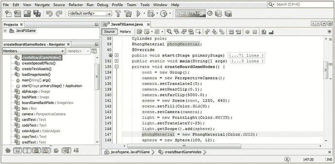

图 13-1。

Declare and instantiate your phongMaterial object and configure its diffuse color value to be Color.GOLD

```java
PhongMaterial phongMaterial;                    // Declared at the top of the JavaFXGame class
...

phongMaterial = new PhongMaterial(Color.GOLD);  // In the createBoardGameNodes() method body

```

如您所知，您的 PhongMaterial 对象可以配置颜色值并加载酷炫效果纹理贴图(图像对象)，但除非您使用 Shape3D 类 setMaterial(Material)方法调用(您在上一章中了解到)将 3D 基本体和 Phong 着色器定义连接在一起，否则您将看不到应用到 3D 对象表面的着色器。

球体对象实例化后，使用点标记法添加一个对球体对象的 setMaterial(phongMaterial)方法调用，如图 [13-2](#Fig2) 中黄色突出显示。将这个相同的方法调用添加到 pole Cylinder 对象和 box Box 对象中。在截图之前，我在 NetBeans 9 中用黄色单击了 phongMaterial 着色器对象，以突出显示它的所有用法，从声明到实例化再到用法。您添加的语句的 Java 代码应该如下所示:

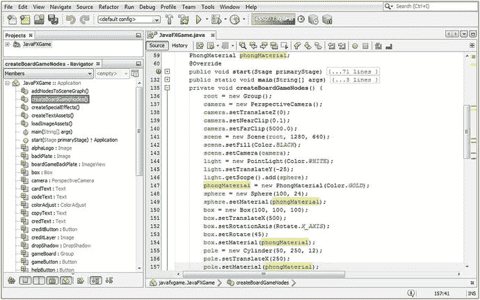

图 13-2。

Wire the phongMaterial to the three primitives, using a setMaterial(phongMaterial) method call off each

```java
sphere.setMaterial(phongMaterial);
box.setMaterial(phongMaterial);
pole.setMaterial(phongMaterial);

```

使用您的 Run ➤项目工作流程，查看 phongMaterial 渲染，如图 [13-3](#Fig3) 所示。

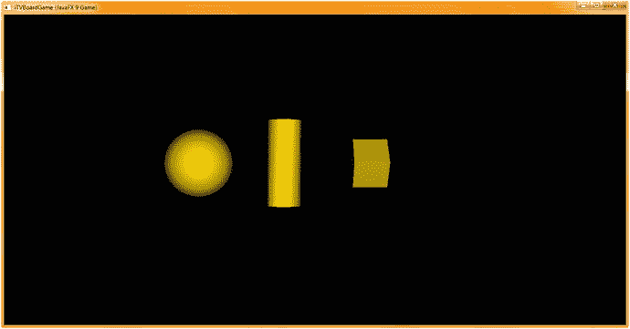

图 13-3。

Showing the phongMaterial object with the diffuseColor property set to a Color.GOLD value

接下来，让我们使用 setSpecularColor()方法和颜色将高光颜色添加到 phongMaterial shader 对象中。黄色常数。在 phongMaterial 对象实例化之后添加一行代码，然后键入 phongMaterial 对象名称。点击句点键，从弹出的帮助选择器中选择 setSpecularColor(颜色值)选项，双击它将其插入到 Java 语句中。在参数区域内键入 Color，然后键入句点键，并通过向下滚动或键入 Y 跳转到 Y 颜色常量来选择黄色常量。

您生成的 Java 语句应该看起来像下面的 Java 代码，在图 [13-4](#Fig4) 的中间用黄色和浅蓝色突出显示:

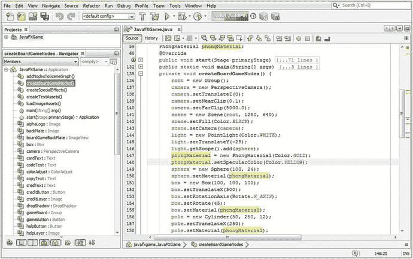

图 13-4。

Call the setSpecularColor() method off of the phongMaterial object, passing the Color.YELLOW constant

```java
phongMaterial.setSpecularColor(Color.YELLOW);

```

如果您使用您的运行➤项目工作流程，在这一点上，您将看到您的图元表面的外观发生了巨大的变化，图元的边缘变得更加圆滑。事实上，如果你比较图 [13-3](#Fig3) 和图 [13-5](#Fig5) ，你会发现长方体基本体根本不受高光颜色的影响，除非你设置它的动画，在这种情况下，当它平行于点光源时，偶然的面会被高光颜色着色。

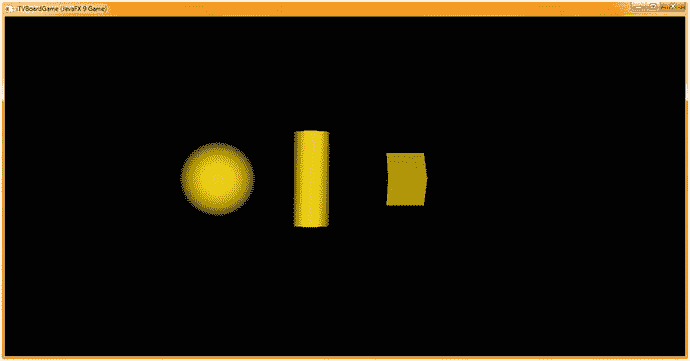

图 13-5。

Run your project to see the PhongShader object configured to use a Color.YELLOW specularColor property

但是，随着使用“镜面反射颜色”属性添加镜面反射高光，圆柱体和球体类(对象)基本体的外观发生了巨大变化。我用黄色给它一个金属的外观，但如果你用白色(默认)，它会看起来更正常。请注意，点光源可以设置为白色，并且您可以在点光源照射到原始曲面之前对其进行调节(添加颜色过滤器)。

因此，如果你正在寻找真实感，确保你的点光源和镜面颜色值匹配！

PhongMaterial 类(object)的 specularPower 属性(attribute)控制曲面的亮度，至少在弯曲的对象上是如此。如图 [13-3](#Fig3) 所示，镜面高光为零，产生了所谓的无光泽表面。需要注意的是，调用 setspectrorpower(0)不会移除镜面高光。事实上，那样会适得其反，给你一个巨大的“爆炸”高光，看起来很糟糕。接下来让我们研究一下这个属性，然后我们可以继续研究所有其他属性。其余的属性涉及地图和它们的图像对象，这将涉及数字成像软件，在我们的例子中是 GIMP 2.10(或者 3.0，如果已经发布的话)。

让我们使用双精度数据值为 12 的 setSpecularPower()方法调用，将 specularPower 属性设置添加到 phongMaterial shader 对象。从技术上讲，这在 Java 代码中被标注为“12.0d”。但是，由于一个整数(只有 12)数据值符合 Double 规范，所以您可以只使用 12，Java 构建和编译过程将理解您正在做什么，并确保它被配置为 Double 值(在运行时)。

在 PhongMaterial 对象实例化之后添加一行代码，并键入 phongMaterial 对象名称。点击句点键，从弹出的助手选择器中选择 setspecrorpower(Double value)选项，双击它将其插入到 Java 语句中。在参数区域内键入 12 或 12.0d。

您生成的 Java 代码将看起来像下面两个 Java 语句中的一个，如图 [13-6](#Fig6) 底部的三分之一所示:

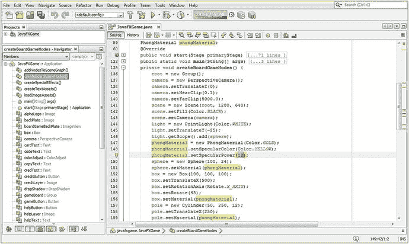

图 13-6。

Call the setSpecularPower() method off of the phongMaterial object, passing the double value of 12

```java
sphere.setSpecularPower(12);    // If you use Integer (simpler) format Java will convert for you
sphere.setSpecularPower(12.0d); // You can also use the 12.0d (double) required numeric format

```

我愚弄了这个值，改变它，并通过运行➤项目渲染。如图 [13-5](#Fig5) 所示，默认值似乎在 20 左右，即 20.0d。改变该值会产生非常细微的变化；较低的数值将用于扩大镜面高光(尝试零设置，但不要在游戏中使用它，除非是为了特殊效果)，而较高的数值将限制它在任何曲面上的精确位置。平坦的表面不会受到太大的影响，如果有的话。

使用“运行➤项目”工作过程来查看 12 的“镜面反射功率”设置将如何扩展镜面反射高光。这可以从图 [13-7](#Fig7) 中看出。


图 13-7。

A specularPower property set to 12 will expand the specular highlight on the surface

接下来，将 setspecularpower()方法调用值更改为 100(或 100.0d)，然后使用“运行➤项目”工作流程来查看具有更高镜面反射能力的图元，这将使它们更闪亮，或更“有光泽”，如图 [13-8](#Fig8) 所示。

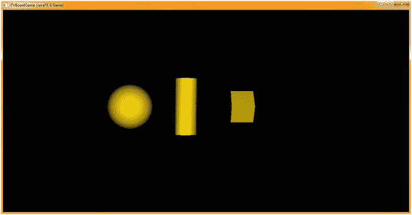

图 13-8。

A specularPower property set at 100 will actually contract or reduce the specular highlight on the surface

既然我们已经在本章的第一部分介绍了基本的漫反射颜色、镜面反射颜色和镜面反射能量属性，让我们更进一步，开始应用在 GIMP 中创建的图像，学习使用四个纹理贴图效果(凹凸/法线、漫反射、镜面反射和发光或自发光)通道的高级纹理贴图。

## 使用外部图像资源:创建纹理贴图

PhongMaterial 类及其算法最强大的功能是支持的四个纹理贴图属性。这为您提供了四个着色器通道来影响您的曲面颜色(漫反射贴图):光泽(镜面贴图)、照明(自照明贴图)和高度(凹凸贴图或法线贴图)。想象一下这种类似于数字图像层合成的情况，其中这四个通道将由 Phong 着色器渲染算法进行组合，然后将镜面反射颜色和能量应用到曲面(由 specularMap 属性图像对象引导，如果 PhongMaterial 着色器管道中存在)。

### 使用外部第三方软件:使用 GIMP 创建地图

Java 9 和 JavaFX 的设计足够灵活，允许您使用高级(专业)第三方软件，如 GIMP(数字图像合成)、Blender (3D 建模)、Fusion(特效)、Inkscape (SVG 内容)或 Audacity(数字音频编辑)。纹理贴图通常在专业的像素编辑和图层合成软件中制作和细化得最好，如免费的开源 GIMP 2.8(即将成为 GIMP 3.0)，它非常强大。

在 [`www.gimp.org`](http://www.gimp.org) 下载 GIMP 并安装。然后启动它，这样你就可以和我一起创建一些纹理贴图，这些贴图将恰当地展示你在本章前几页学到的四种不同类型的纹理贴图通道。使用文件➤新建菜单序列并访问创建新图像对话框，如图 [13-9](#Fig9) 红色 1 所示，并将宽度和高度字段设置为 2 的幂。渲染器最适用于二进制或 2 的幂的数字，包括 2、4、8、16、32、64、128、256 等。大多数游戏使用 256 像素的纹理贴图，所以我在这里使用这个尺寸。将色彩空间下拉列表设置为 RGB，并将背景色填充下拉列表设置为白色。使用图层➤新建图层菜单系列创建一个新图层，或者右键单击图层面板中的背景图层(红色 3)并选择新建图层，这将打开如图 [13-9](#Fig9) 中红色 2 所示的新建图层对话框。将图层名称设置为灰度贴图，将图层填充类型设置为透明，然后单击确定按钮创建图层。使用相同的工作过程来创建第二层，称为彩色地图，如红色 3 所示。选择灰度地图层以显示 GIMP 在哪里应用你的下一个图像创建“移动”(操作)，并选择一个矩形选择工具，在图 [13-9](#Fig9) 中右上方中间显示为按下。一个矩形选择工具选项(红色 4)将出现在图的右下角，在这里您可以精确地(像素精确地)设置选择的位置和大小设置。

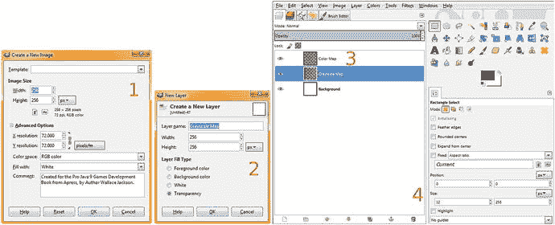

图 13-9。

Create a 256-pixel image, add layers to hold your color and grayscale maps, and create eight striped areas

接下来，在 GIMP 画布上画出任意大小的矩形选择，如图 [13-10](#Fig10) 右侧所示。在位置字段中，设置 0，0，在大小字段中，设置 32，256。这将把选区放在八分之一跨度和画布的左侧。单击 GIMP 工具图标下前景/背景颜色样本旁边的小黑底白字图标，将 FG 颜色设置为黑色，将 BG 颜色设置为白色；然后使用你的编辑➤填充 FG 颜色菜单序列，用黑色填充四个条纹的第一个。由于该层是透明的，背景是白色的，合成的结果将是一个黑白纹理贴图(最终是四个黑白相间的条纹)。接下来，将选区向右拖动，放置第二个条纹填充；然后编辑位置字段以设置 64，0，并将大小字段设置为 32，256。再次使用编辑➤填充 FG 颜色，并将选择拖动到位置(或将位置字段设置为)128，0，选择填充 FG 颜色，并将选择拖动到位置(或将位置字段设置为)192，0。最后，最后一次选择用 FG 颜色填充，完成黑白效果(凹凸，高光)应用纹理贴图。在图 [13-10](#Fig10) 中的第二层灰度贴图中可以看到黑白(或透明)纹理贴图。

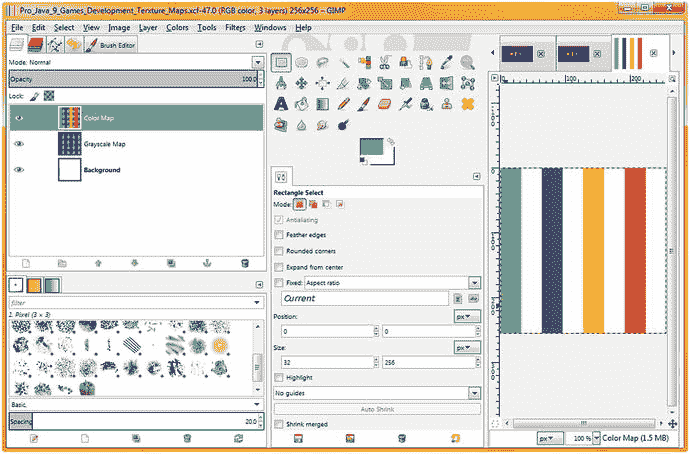

图 13-10。

Create a beach ball texture in the Color Map layer and an on/off (black/white) grayscale striped texture

现在，我们已经创建了(更容易的)镜面反射或凹凸贴图效果图像资源，让我们创建一个颜色来显示漫反射颜色贴图将如何工作。稍后，我们将把它们结合起来使用(在不同的着色器通道中),并试验这些 PhongMaterial 属性能为我们的 pro Java 9 游戏开发做些什么。

为了确保你的颜色数据与你的效果(灰度)数据是分开的，选择颜色贴图层，它会变成蓝色表示它被选中，如图 [13-10](#Fig10) 左侧所示。如果愿意，可以通过单击图层左侧的眼睛图标来关闭灰度地图图层的可见性。在位置字段中设置 0，0，在大小字段中设置 32，256。这将再次把选区放在八分之一跨度和画布的左侧。点击 FG/BG 色样(颜色选择器)上的黑色方块，弹出颜色选择器对话框，设置绿色，如图 [13-10](#Fig10) 所示。一旦你点击确定，这将设置 FG 颜色为绿色，BG 颜色将保持白色。使用编辑➤填充 FG 颜色菜单序列，用绿色填充四个条纹中的第一个。由于该层是透明的，背景是白色的，因此合成的结果将是一个绿色和白色的纹理贴图(最终是四个交替的彩色和白色条纹)。接下来，将选区向右拖动 64 个像素，将其定位为第二个条纹填充；然后编辑位置字段以设置 64，0，并将大小字段设置为 32，256。使用拾色器设置蓝色，并再次使用编辑➤填充 FG 颜色创建第二个蓝色条纹。接下来，将 64 个像素向右拖动到位置 128(或将位置字段设置为 128，0)，使用拾色器选择黄色前景(FG)颜色，并使用 FG 颜色填充第三个条纹。最后，将选择拖动到位置 192，0(或使用位置字段设置)，使用拾色器选择红色前景(FG)颜色，然后最后一次使用“编辑➤填充 FG 颜色”菜单序列来完成沙滩球颜色(漫射，发光)应用纹理贴图创建。图 [13-10](#Fig10) 显示了 GIMP 中的最终结果。

我还将创建一个纹理贴图，交替使用 25%的灰色和 50%的灰色条纹来显示不同效果的应用，如镜面和自发光，以及如何通过使用不同的灰色阴影来控制效果应用的强度或大小。您可以创建第三个贴图，作为重新创建我们之前用于彩色和黑白纹理贴图的工作流程的“练习回合”。要导出你在 GIMP 2.10 中创建的任何纹理贴图，你可以使用文件➤导出图像作为菜单序列，这将打开导出图像对话框，如图 [13-11](#Fig11) 所示。

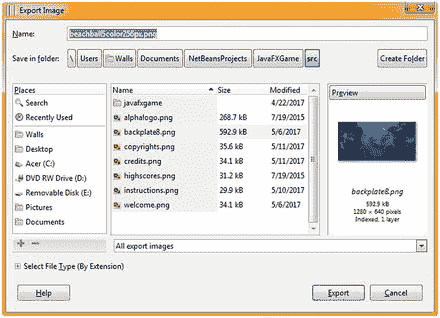

图 13-11。

Export to C:\Users\Name\Documents\NetBeansProjects\JavaFXGame\src

如图 [13-11](#Fig11) 所示，您可以使用该对话框顶部的文件导航部分来定位您的 NetBeansProjects 文件夹。我用文件名中的描述、颜色数和像素数来命名文件。确保使用您的 JavaFXGame 文件夹和\src\子文件夹，其中保存了游戏的源代码，就像我们在本书中一直做的那样。一旦文件位于正确的文件夹中，它们将对 NetBeans 9 可见，并且我们可以在代码中将它们用作图像对象素材。接下来，让我们回到 PhongMaterial 对象编码，并进一步探索着色器管线的创建，因为这是让您的 Pro Java 9 i3D 游戏看起来非常壮观的一种方式。

### 在 PhongMaterial 中使用纹理贴图:着色器特殊效果

在 JavaFX 中使用 Image 对象的第一步是将 Image 对象的名称添加到类顶部的 Image 对象复合声明语句中。我将图像对象命名为与它们将被使用的属性相同的名称。接下来，由于我们有一个 loadImageAssets()方法，我们将添加四个引用包含纹理映射数据的 PNG 文件的图像实例化语句。如图 [13-12](#Fig12) 所示的 Java 代码应该如下所示:

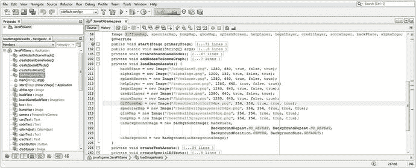

图 13-12。

Declare and instantiate Image objects to hold texture map data for a diffuse, specular, glow, or bump map

```java
Image diffuseMap, specularMap, glowMap, bumpMap // plus the other Image objects already in use
...
diffuseMap = new Image("/beachball5color256px", 256, 256, true, true, true);
specularMap = new Image("/beachball3grayscale256px", 256, 256, true, true, true);
glowMap = new Image("/beachball2grayscale256px", 256, 256, true, true, true);
bumpMap = new Image("/beachball3grayscale256px", 256, 256, true, true, true);

```

接下来，进入 createBoardGameNodes()方法，将漫反射和镜面反射颜色设置更改为一种颜色。白色值，并添加对 phongMaterial 对象的 setDiffuseMap(diffuseMap)方法调用。在图 [13-13](#Fig13) 中用蓝色突出显示的漫反射颜色纹理贴图语句的 Java 代码应该如下所示:

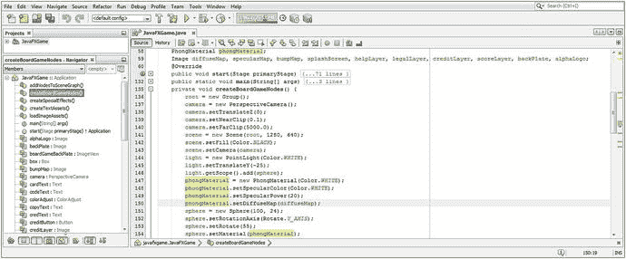

图 13-13。

Add a diffuseMap to the shader pipeline to add some surface color and set the specular and diffuse colors to white

```java
phongMaterial = new PhongMaterial(Color.WHITE);
phongMaterial.setSpecularColor(Color.WHITE);
phongMaterial.setSpecularPower(20);
phongMaterial.setDiffuseMap(diffuseMap);

```

接下来，使用运行➤项目工作流程，再次查看您的原语。正如你所看到的，在图 [13-14](#Fig14) 中，你的基本体的表面现在正在使用一个漫射贴图来控制它们的表面着色，并且球体 3D 基本体现在看起来像一个沙滩球。

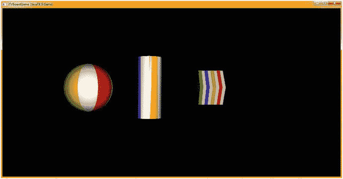

图 13-14。

A diffuse color texture map is now painting the surface of the primitive, making a sphere into a beach ball

接下来，让我们将你的球体旋转 25 度，以便黄色和白色条纹之间的描绘发生在镜面高光中，我们在前面的代码中将其扩展回默认设置 20。

我们将使用 beachball3grayscale256px.png 形象素材；它有八个条纹，其中四个是 100%开(白色)，两个是 75%开(25%灰色)，两个是 50%开(半功率，或 50%灰色)。这将“静音”或减少沙滩球白色部分的镜面眩光，因为镜面贴图定义了镜面效果的强度或数量(闪亮度)。

我们将保留调用 phongMaterial 的 setDiffuseMap(diffuseMap)方法，因为我们试图在本章中构建一个高级着色器渲染管道，以将 PhongMaterial 类推到专业着色器效果创建管道的极限，就像我们在 3D 软件中一样，但只使用 JavaFX API 和 Java 9 语句。

因此，在 setDiffuseMap()方法调用之后，我们将添加一行 Java 代码，调用 phongMaterial 对象的 setSpecularMap()，然后传入在 loadImageAssets()方法中已经设置为 beachball3grayscale256px.png 图像素材的 specularMap 图像对象，如图 [13-12](#Fig12) 所示。这将通过使用以下 Java 语句来完成，这些语句在图 [13-15](#Fig15) 的底部突出显示:

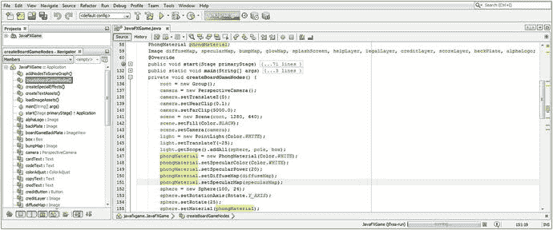

图 13-15。

Add a SpecularMap Image reference to the shader pipeline to control the specular highlight intensity

```java
phongMaterial = new PhongMaterial(Color.WHITE);
phongMaterial.setSpecularColor(Color.WHITE);
phongMaterial.setSpecularPower(20);
phongMaterial.setDiffuseMap(diffuseMap);
phongMaterial.setSpecularMap(specularMap);
sphere = new Sphere(100, 24);
sphere.setRotationAxis(Rotate.Y_AXIS);
sphere.setRotate(25);
sphere.setMaterial(phongMaterial);

```

现在是时候再次使用运行➤项目的工作过程，并把这个着色器管线渲染到您的 3D 场景中。正如你在图 [13-16](#Fig16) 中看到的，球体上的高光似乎被黄色和白色之间的线切断了。这是由纹理贴图的交替区域的高光贴图(降低高光强度)造成的。这也可以在圆柱体原语上看到。现在你可能已经注意到了，为了放大视图，我减少了相机与场景中心的距离，从 250 个单位减少到 100 个单位，并且我增加了 3D 图元的大小，这样我们可以更清楚地看到纹理映射效果。

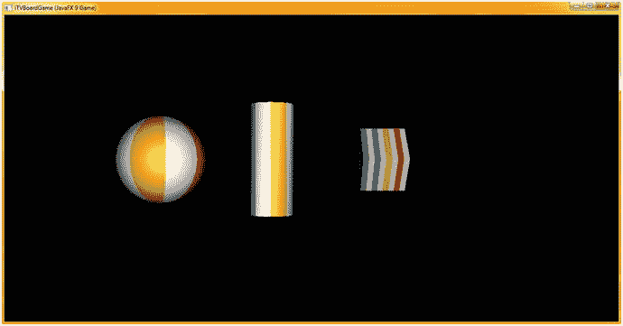

图 13-16。

The specular highlight on the curved surface sphere and pole objects is now brighter on the colored area

接下来，让我们把你的球体旋转回 5 度，这样你的黄色部分就在高光的中心，白色条纹在两边。这将更准确地向您展示自发光贴图的威力。

我们将使用 beachball2grayscale256px.png 图像素材，它有八个条纹。其中四个是 100%打开(白色)，四个是 100%关闭(黑色)，就效果处理纹理贴图而言，这是最极端的情况，因为这等同于完全应用(白色或全部打开 255 值)或不应用(黑色或零)。

这种自发光贴图(在 3D 软件中通常称为发光贴图)将像光源一样打开用白色贴图的 3D 图元部分，而黑色区域将不会被照亮，并将使用现有的纹理贴图管道。更多的灰色将增加更多的光，因此 25%的灰色将模拟 25%的照明(25%的光强度)。我们将保留调用 phongMaterial 的 setDiffuseMap()和 setSpecularMap()方法，因为我们试图构建一个高级着色器渲染管道，并将 PhongMaterial 类推到专业着色器效果创建管道的极限，就像在 3D 软件中一样，但只使用 JavaFX API 和 Java 9 语句。

因此，在 setSpecularMap()方法调用之后，我们将调用 phongMaterial 对象的 setselflightionmap(glowMap)方法，并传入 glow map 图像对象，设置为在 loadImageAssets()方法中实例化的 beachball2grayscale256px.png 图像素材，如图 [13-12](#Fig12) 所示。这将通过使用以下 Java 语句来完成，这些语句在图 [13-17](#Fig17) 的底部用黄色和浅蓝色突出显示:

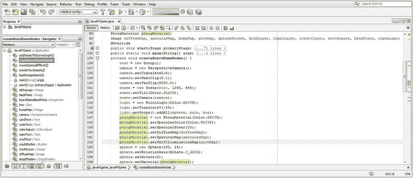

图 13-17。

Add the SelfIlluminationMap Image reference to the shader pipeline to control self-illumination intensity

```java
phongMaterial = new PhongMaterial(Color.WHITE);
phongMaterial.setSpecularColor(Color.WHITE);
phongMaterial.setSpecularPower(20);
phongMaterial.setDiffuseMap(diffuseMap);
phongMaterial.setSpecularMap(specularMap);
phongMaterial.setSelfIlluminationMap(glowMap);
sphere = new Sphere(100, 24);
sphere.setRotationAxis(Rotate.Y_AXIS);
sphere.setRotate(5);
sphere.setMaterial(phongMaterial);

```

图 [13-18](#Fig18) 显示了运行➤项目 Java 代码测试工作流程，在所有三个原语上都有自发光映射。白色区域已转化为光源，彩色区域仍显示漫反射和镜面反射贴图特征。selfIlluminationMap 属性代码的抗锯齿算法部分似乎有一点问题，正如您在球体图元的周界边缘上看到的那样。

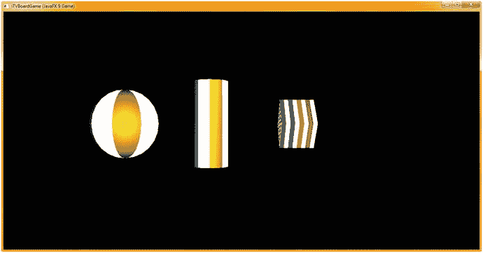

图 13-18。

The self-illumination map turns white area on 3D primitives into a light source, leaving color areas alone

接下来，让我们看看如何使用我们到目前为止所学的知识，并在 GIMP 2.8.22 中创建一些着色器的纹理贴图组件，以便在我们开始使用 Java 9 中的 JavaFX 9 APIs 构建 i3D 游戏时，在第 [14](14.html) 章中创建的游戏板组节点层次中使用。

## 游戏板纹理:创建游戏板方块

理解抽象网格超类及其与 TriangleMesh 子类(可用于“手工编码”复杂网格对象)的关系，以及它与 MeshView 类(实际上是 Shape3D 的子类，而不是 Mesh 的子类)的关系非常重要！这是为了使 MeshView 可以继承(扩展)Shape3D 的 cullFace、drawMode 和 material 属性，当然，这些属性对于使网格对象变得逼真是至关重要的(尤其是 material 属性和 Material 类)。正如您将看到的，MeshView 构造函数采用一个网格对象，因此这是复杂 3D 对象所基于的核心类(算法);因此，Mesh 和 MeshView 是用于 pro Java 9 游戏开发的关键类。如果出于某种原因，您想要编码复杂的多边形几何图形，也称为“三角形网格”(这不是一个最佳的工作流程)，您可以使用 Triangle Mesh，我们将详细介绍它。

更好的工作流程是使用外部 3D 软件包，将 3D 对象直接“导入”到网格对象中，然后由 MeshView 对象引用。这是一个工作流程，我们将用整整一章来讲述如何使用这些 JavaFX 类来“建模”3D 游戏，这样您就不必导入任何“数据繁重”的网格对象。导入 3D 资源可以更快地快速高效地启动和运行高级 i3D 游戏，也是将专业人员引入 i3D 游戏开发工作流程的一种方式。

### 准备创建游戏板:代码重新配置

让我们为下一章将要做的事情(构建我们的 i3D 游戏板)做好准备，并为我们的 gameButton 事件处理程序、createBoardGameNodes()方法、addNodesToSceneGraph()方法和 loadImageAssets()方法重新配置 Java 代码体。让我们从相机对象推拉切换，设置相机 Z = 0，而不是使用 FOV 来放大和缩小场景。由于我们现在要删除球体和圆柱体基本体，我们将 X 和 Y translate 属性设置为-500，并将相机绕 X 轴旋转 45 度，以便它向下看游戏板。进行这些摄像机调整的 Java 代码如图 [13-19](#Fig19) 所示，如下所示:

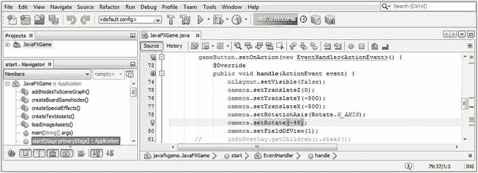

图 13-19。

Reconfigure your camera object to dolly to Z = 0, rotate 45 degrees, and zoom in with FOV = 1

```java
camera.setTranslateZ(0);
camera.setTranslateY(-500);
camera.setTranslateX(-500);
camera.setRotationAxis(Rotate.X_AXIS);
camera.setRotate(-45);
camera.setFieldOfView(1);

```

接下来，让我们删除球体球体和极柱圆柱体实例化和配置语句；如果你愿意，你可以把声明放在类的顶部，因为我们以后会用到它们。

要制作一个游戏板正方形，它将在游戏板的周边使用，并且将是 150 个单位的正方形和 5 个单位的薄(高)，我们将留下 Box box 对象并用 Box(150，5，150)方法调用来构造它。我现在也将它旋转 45 度，使点(角)面向相机对象。我们可以保留 PhongMaterial 代码，因为一旦我们在 GIMP 中创建了 diffuseMap，我们所要做的就是在 loadImageAssets()方法中更改文件名，这将在我们创建游戏棋盘正方形纹理贴图之后进行。不要忘记，如果你忘记删除我们已经从 SceneGraph 节点中删除的对象，你将在编译期间得到一个致命的错误。

如前所述，一个盒子构造器方法是非常基本的，看起来像图 [13-20](#Fig20) 中的 Java 代码:

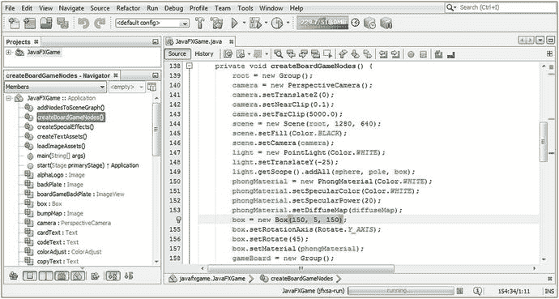

图 13-20。

Remove sphere and pole instantiations and configurations and change the box dimensions to 150, 5, 150

```java
box = new Box(150, 5, 150);
box.setRotationAxis(Rotate.Y_AXIS);
box.setRotate(45);
box.setMaterial(phongMaterial);

```

接下来，让我们从游戏板组对象中移除这些(当前)未使用的极点和球体原语，这将把我们的 addAll()方法调用改回 add()方法调用。如果您忘记这样做，并试图选择运行➤项目，它将不会编译。产生的 Java 语句如图 [13-21](#Fig21) 所示，如下所示:

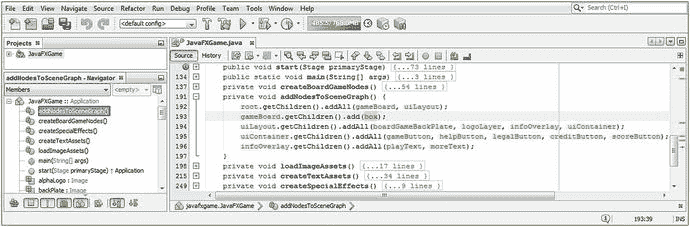

图 13-21。

Remove the pole and sphere objects from your gameBoard.getChildren().addAll() method call for now

```java
gameBoard.getChildren().add(box);

```

现在让我们回到 GIMP，给我们的纹理贴图合成添加一层，创建一个游戏棋盘方块。

### 创建你的游戏板正方形漫射纹理:使用 GIMP

让我们在本章中完成一些游戏棋盘方块的设计，所以在下一章中，我们要做的就是设计棋盘的中心，创建四周的方块，并对图像进行颜色转换，以创建方块之间的轮廓。我们将在 GIMP 中使用我们在本章前面使用的相同方法来完成此操作，使用相同的 32x256 条纹，只是这一次四个条纹将位于游戏棋盘正方形的周边。我们将使用 RGB 255，0，0(纯红色),这样我们就可以用 GIMP 中的算法对这个值进行颜色转换。

打开您的多层 GIMP XCF 文件，右键单击顶层，并使用新的➤图层菜单项创建一个空的透明层。关闭除白色背景图层之外的其他图层中的所有可见性(眼睛)图标。将层名称设置为 GameBoardTile。确保选择这一层，使它变成蓝色，以显示 GIMP 在哪里应用您的下一个图像创建“移动”(操作)。

选择你的矩形选择工具，在图 [13-22](#Fig22) 的中上方显示为按下。矩形选择工具选项将出现在工具图标的下面，如图的底部中间所示，您可以(再次)精确地(精确到像素)设置您的选择的位置和大小设置。

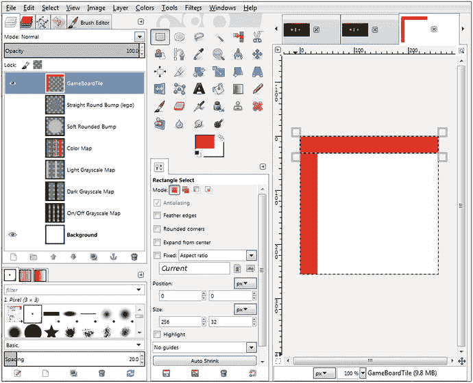

图 13-22。

Use the same Rectangle Select technique we used earlier in the chapter to create a game board square

接下来，在 GIMP 画布上画出任意大小的矩形选区，如图 [13-22](#Fig22) 右侧所示。在位置字段中，设置 0，0，在大小字段中，设置 32，256。这将把选区放在八分之一跨度和画布的左侧。单击顶部颜色上位于 GIMP 工具图标下的大前景色/背景色样本，并将 FG 颜色设置为红色。然后使用你的编辑➤填充 FG 颜色菜单序列，用红色填充前四个条纹。由于这一层是透明的，背景是白色的，合成的结果将是一个红白纹理贴图(最终四个重叠的红色条纹)。

接下来，将选区向右拖动，放置在第二个条纹填充的位置。然后编辑位置字段，将其设置为 0，0，并反转大小字段，将其设置为 256，32，如图 [13-22](#Fig22) 所示。再次选择编辑➤填充 FG 颜色。一半的游戏板广场漫射颜色纹理地图已创建在短短几个步骤！

让我们通过再次拖动选择到 256 像素纹理贴图画布右侧的位置(或将位置字段设置为)224，0 来完成其他两个周界条纹。请确保将您的大小数据字段设置回 32，256(宽度、高度)，然后再次使用“编辑➤填充 FG 颜色”将右边的周界条纹填充为红色(也是 JavaFX 中的颜色类常量)。最后，拖动选择位置(或将位置字段设置为)0，224，然后最后一次使用编辑➤填充 FG 颜色，以完成黑白效果(凹凸，镜面反射)应用纹理贴图。

除了能够为您的漫反射颜色纹理贴图对周边颜色进行颜色转换，以创建几十个独特的游戏棋盘方块，因为内部颜色是白色，不会受到影响(白色、黑色和灰色没有颜色值可以进行颜色转换)。

使用我们在本章中学到的其他概念和代码技术，我们将能够创建其他 PhongMaterial 类着色器对象，当游戏棋子落在特定的游戏棋盘方格上时，这些对象将高亮显示、发光或给当前活动的游戏棋盘方格涂上不同于所有其他方格的颜色。

值得注意的是，这将只使用一个单一的漫反射颜色纹理贴图(680 字节或 1 千字节数据/内存的三分之二)来完成，从而交互式地为您的游戏提供更专业的用户体验。我还将使用黑色、白色和灰色创建一个效果纹理图(可能是两个或三个),这将与红白一个像素一个像素地匹配，为我提供游戏代码中最具过程性(外科手术)的效果应用。白色周边(和黑色内部)将允许我只隔离彩色区域以获得特殊效果，而黑色周边(和白色内部)允许我隔离游戏棋盘方块的内部以获得特殊效果。我们将把这几个纹理与数字成像(第 [2](02.html) 章)和漫射和镜面颜色控制结合起来。

最后，确保使用 GIMP 的文件导出为工作流程，如图 [13-11](#Fig11) 所示，将完成的游戏棋盘正方形漫反射纹理贴图数据保存在 NetBeansProject 文件夹和 JavaFXGame 子文件夹中正确的 source assets 文件夹下的一个名为 gameboardsquare.png 的文件中。现在，我们所要做的就是将这个文件名引用交换到 loadImageAssets()方法体内的 diffuseMap 图像对象实例中，并且我们可以使用 box()构造器方法在我们之前创建的新的 box Box 对象配置中利用它(参见之前的图 [13-20](#Fig20) )。

打开 loadImageAssets()方法体，编辑 diffuseMap 图像对象实例化，使其引用从 GIMP 导出到`NetBeansProject\JavaFXGame\src\`文件夹的 gameboardsquare.png 文件。新图像实例化的 Java 语句应该如下所示，在图 [13-23](#Fig23) 中用黄色和浅蓝色突出显示:

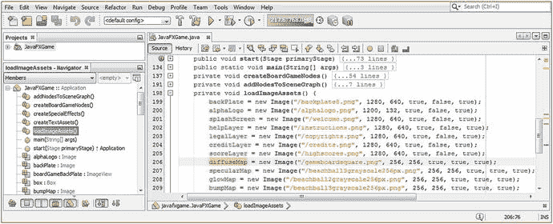

图 13-23。

Change your diffuseMap Image object instantiation statement to reference your gameboardsquare.png file

```java
diffuseMap = new Image("/gameboardsquare.png", 256, 256, true, true, true);

```

图 [13-24](#Fig24) 显示了运行➤项目 Java 代码测试的工作流程；您可以看到新的游戏棋盘方形盒子盒子对象映射了新的漫反射颜色纹理贴图，这是您刚刚使用 GIMP 2.8.22(或更高版本)创建的。


图 13-24。

We now have a game board square, which will be duplicated around the perimeter (in the next chapter)

边缘上有一点白色(JavaFX 目前不允许每边框对象映射)，我们将在以后的章节中通过调整`camera.setRotate()`方法调用值来最小化它，直到它变得不那么明显。

在结束本章的着色器管线创建和纹理贴图之前，我还想说明最后一点，即如何使用 JavaFX 为 3D 图元设置皮肤。你可能想知道为什么我对这个纹理使用 PNG24 (24 位)图像格式，而不是更优化的 PNG8 格式。嗯，这个 PNG24 编解码器在将 256 × 256 × 3 (196，608)字节压缩为 680 字节方面做得非常好，数据减少了 290 : 1 或 99.67%！

从更技术性的角度来看，Java 将在内存中使用 24 位 RGB 颜色表示，因此，如果我们使用了 8 位索引彩色图像，那么当它被加载到内存中时，就会被简单地转换回 24 位颜色值图像。因此，我倾向于尽可能使用 PNG24 和 PNG32 图像，特别是对于 3D 纹理贴图，无论如何，对于 pro Java 9 游戏设计和开发应用，这些贴图主要是 32x32、64x64、128x128、256x256 和 512x512。对于照片图像，您也可以使用 JPEG。

## 摘要

在第十三章中，我们学习了 javafx.scene.paint 包中允许您使用 3D 着色器、纹理贴图和材质的类，包括基于抽象材质超类的 PhongMaterial 类。我们了解到 Material 类基本上是一个“空”类或一个“外壳”来容纳一个“材质”对象(Shape3D 类中的属性),而 heavy lifting(算法)在 PhongMaterial 子类中。我们相当详细地研究了这个类中的属性、构造函数和方法调用，以便您知道 PhongMaterial 对象可以做什么，然后我们研究了如何用 Java 代码实现这些(bumpMap 除外，它在我正在使用的当前 JavaFX 9 代码库中不起作用，因此我们将在本书的后面部分再次讨论)。

您了解了如何使用 GIMP 创建纹理贴图资源(目前本书的版本为 2.8.22，但我预计 2.10 将于 2017 年推出，3.0 将于 2018 年推出)，以及如何通过在最佳工作流程中使用 GIMP 的工具来创建平衡的、像素精度的 2 次方纹理贴图，这些贴图针对专业 3D 游戏开发进行了优化。

然后，我们看了看如何在四个当前的纹理贴图“通道”中实现这些纹理贴图素材，这些通道目前通过 JavaFX 9 PhongMaterial 类提供给我们。我们看到了这些纹理贴图通道如何允许我们微调材质属性的渲染方式，从而允许我们为 Java 9 游戏创建更加专业的外观。

最后，我们为我们的游戏板方块创建了 diffuseColor 属性纹理贴图，将 box Box 对象转化为这些游戏板方块中的一个，并将新的纹理贴图应用到新的 3D 原始“plane”对象，为我们在下一章将要做的事情(在场景图中创建我们的游戏板分支)做准备，以便它看起来像我们正在创建的游戏板。如您所知，我建议以这样一种方式进行您的 pro Java 9 游戏开发，即在您编写 Java 9 代码、创建新媒体素材以及将您的 pro Java 9 游戏内容和交付内容“变形”成您最终想要的样子时，您可以看到 JavaFX 9 将要做什么。Pro Java 9 游戏开发是一个精炼的过程，所以这就是我写这本书的方式。我将向您展示我实际上是如何使用 NetBeans 9 IDE 以及 Java 9 和 JavaFX 9 APIs“凭空蒸发一个 3D 棋盘游戏应用”的。

在第 [14](14.html) 章中，我们将进一步完善我们的 Java 代码组织，创建新的方法并重组一些现有的方法，以创建并整合我们的 i3D 棋盘游戏的核心 gameboard。我们将在游戏板组节点(分支)下创建一个嵌套的组 3D 层次结构，并查看 3D 图元 X、Y、Z 定位和相关概念，这些概念适用于无缝布局 3D 游戏板，以便未来的 Java 代码可以以逻辑、最佳的方式访问和引用其组件和子组件。就像数据库设计一样，你如何设计你的 SceneGraph 极大地影响了你的 Pro Java 9 3D 游戏在未来如何运行。我们保持设计、层次结构和 3D 对象命名模式越简单、越直接，我们在为交互性、动画、运动、碰撞检测等编写未来代码时就会处于更好的状态。此时，您应该开始对 Java 9 和 JavaFX 9 为您提供的可能性感到兴奋了。