# 十四、3D 模型层次创建：使用原语创建游戏板

现在，您已经了解了如何使用 JavaFX Phong 着色器算法及其各种颜色和效果映射通道来“蒙皮”您的 3D 基本体，并且您已经创建了丰富多彩、高度优化的游戏板方形纹理贴图，是时候添加一些自定义方法来构建游戏板并使用纹理贴图设置 Phong 着色器对象了。我们将需要创建一个`createGameBoardNodes()`方法来组织组成我们的 3D 游戏板的 3D 原始素材，因为`createBoardGameNodes()`方法应该(也确实)包含更高级的节点子对象实例化和配置，例如场景、根、UI 堆栈面板、3D 游戏板组、相机和照明，以及四个名为 Q1 到 Q4 的游戏板象限组对象(象限 1 到 4)。我们还将创建其他 19 个游戏棋盘方块对象，命名为 Q1S1 到 Q1S5、Q2S1 到 Q2S5、Q3S1 到 Q3S5 和 Q4S1 到 Q4S5，以保持对象名称简短。将这些对象命名为 Quadrant1Square1 (Q1S1)的缩写版本将使使用这些缩写术语的 Java 代码可读性更好。

在本章中，您将构建 SceneGraph 的 gameBoard Group 分支，它位于 SceneGraph 根目录下，紧挨着您已经构建好的 uiLayout 分支。在您的游戏板组分支下，我们将游戏板分成四个象限，因此游戏板的中间可以有四个更大的 300x300 单位区域，我们可以用于游戏，每个象限都有 20 个周边游戏板方块中的 5 个作为子对象。使用三层 3D 基本对象层次，我们可以将整个游戏板作为一个整体访问(例如，旋转它)，将每个象限作为一个单元访问(例如，悬浮它或应用着色器效果)，并访问层次底部的单个游戏板方块(叶节点子对象)。我们开始工作吧！在本章中，我们要编写数百行新的 Java 代码来实现图元、着色器、图像和场景图层次节点。

## 原始创建方法:createGameBoardNodes()

因为创建 24 个原语(4 个中心棋盘象限和 20 个周边正方形)将需要 100 多个 Java 语句(使用 new、setTranslateX()、setTranslateZ()、setMaterial()等进行实例化)。)，让我们专门创建一个方法来保存我们的游戏板对象及其实例化和配置语句。这样，一个 createBoardGameNodes()方法将创建全局和顶级节点子类对象(场景、根、相机、灯光、uiLayout 分支、gameBoard 分支、Q1 到 Q4 分支等。).在本章的后面，我们还将把 PhongMaterial 着色器创建逻辑提取到另一个自定义 createMaterials()方法中，在这里我们将创建几十个自定义着色器对象来为这个游戏板的各种组件提供外观。要让 NetBeans 9 为您创建这个新方法，请在 start()方法的第一部分，在 createBoardGameNodes()方法调用之后添加一行代码，然后键入以下 Java 方法调用，命名您的新方法:

```java
createGameBoardNodes();

```

NetBeans 将意识到这不是一个有效的方法调用，并将使用红色波浪下划线突出显示它。

使用您的 Alt+Enter 工作流程，在 javafxgame 中双击您的创建方法“createGameBoardNodes()”。JavaFXGame 选项，在图 [14-1](#Fig1) 中突出显示，让 NetBeans 为您创建一个空的方法体结构。接下来，从 createBoardGameNodes()中删除与 box Box 对象相关的代码，并将该代码放入这个新方法中。我们还将删除圆柱杆和球体，这样它们就不会干扰你的游戏板设计。

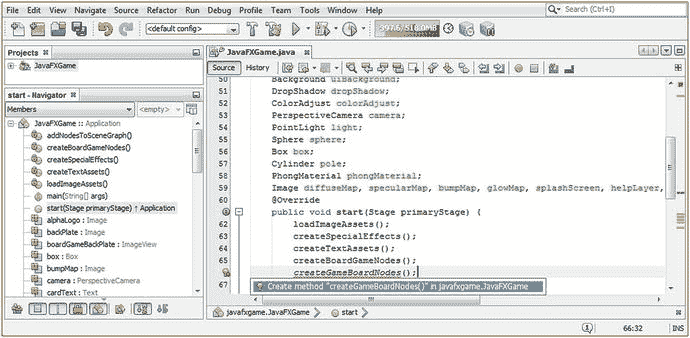

图 14-1。

Open the start() method; type a createGameBoardNodes() method call after createBoardGameNodes()

剪切并粘贴你的盒子原始代码。createBoardGameNodes()到。createGameBoardNodes()并将该框重命名为 Q1S1。删除除实例化和着色器方法调用之外的所有 Java 语句，如图 [14-2](#Fig2) 所示:

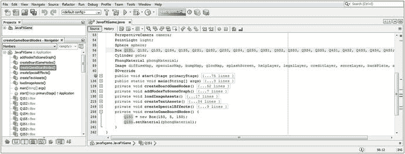

图 14-2。

Copy the primitive code to createGameBoardNodes(); delete everything except the instantiation and .setMaterial

```java
Q1S1 = new Box(150, 5, 150);
Q1S1.setMaterial(phongMaterial);

```

使用以下代码将引用该框的 Java 代码更改为引用 Q1S1，这也显示在图 [14-3](#Fig3) 中:

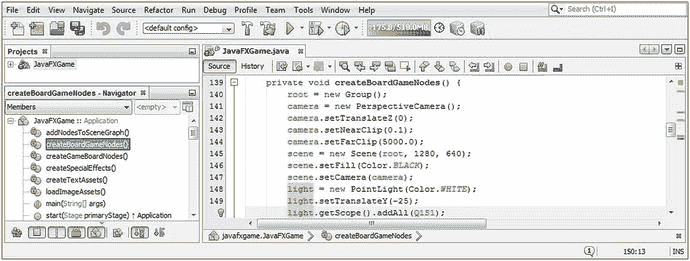

图 14-3。

Be sure to change all referencing from the box to Q1S1 in createBoardGameNodes() and addToSceneGraph()

```java
light.getScope().addAll(Q1S1);

```

您还必须打开 addNodesToSceneGraph()方法，并将游戏板节点代码行内的框更改为 Q1S1，这样 Q1S1 游戏板方块将在我们接下来要做的测试渲染中可见。稍后，我们将在本声明中引用 Q1 到第四季度象限，然后使用这些分支节点引用游戏棋盘方块对象，这是我们接下来要做的，以创建三层层次结构。您生成的 Java 语句应该看起来像下面的 Java 9 代码，在图 [14-4](#Fig4) 的中间用黄色和浅蓝色突出显示:

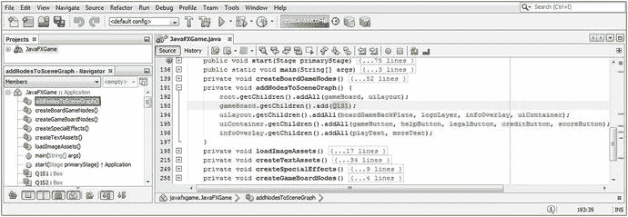

图 14-4。

Add the first Q1S1 game board square to the gameBoard Group node for now so it will compile the test render

```java
gameBoard.getChildren().add(Q1S1);

```

如果您使用运行➤项目工作流程，此时您将在图 [14-5](#Fig5) 中看到，我们已经将 3D 场景重置为一个游戏棋盘方块，并且我们可以开始构建与该方块相关的游戏棋盘的其他部分。

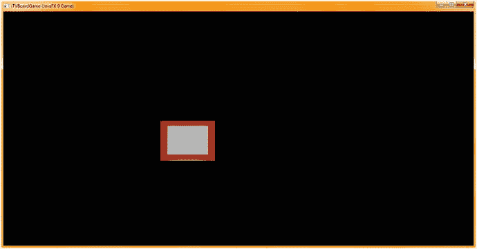

图 14-5。

Use the Run ➤ Project work process to test render the reconfiguration of the 3D Scene from Box to square

现在是时候开始在 SceneGraph 的 3D 游戏板组分支下构建 SceneGraph 层次结构了。游戏板组将包含从 Q1 到第四季度的四个象限组分支。这些象限组节点对象中的每一个都将包含一个盒基本象限(游戏板中心的四分之一)和该象限附属的五个游戏板方块。q1 到 q4 象限平面对象也将是四倍于(300x300)游戏棋盘正方形大小的盒子图元。

我将把游戏板组对象实例化移到根组实例化之下，然后在 createBoardGameNodes()方法的顶部添加 Q1 到 Q4 组对象实例化，以便 Java 代码顺序反映父子层次结构。您的叶对象(最底部的节点)将在 createGameBoardNodes()方法中创建，包括 q1 到 q4 象限平面对象，它们是 Q1 到 Q4 组(分支)节点的叶节点。

如果您愿意，您可以使用方便的复制粘贴程序员的技巧，键入第一个 q1 组对象的实例化语句，然后再复制粘贴三次，将 Q1 更改为 Q2 到 q4，因为在这一点上，我们只是创建了四个空的象限组节点，我们将引用它们上面的 gameBoard 组节点和它们下面的 Q1S1 到 Q4S5(以及 Q1 到 Q4)叶节点。生成的 Java 代码应该如下所示，在图 [14-6](#Fig6) 的顶部用黄色、红色和蓝色突出显示:

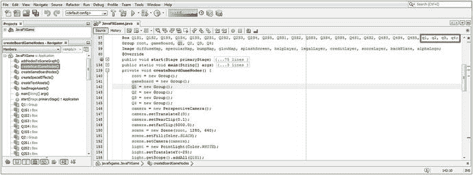

图 14-6。

Add four Group branch node object instantiations under your gameBoard Group, named Q1 through Q4

```java
gameBoard = new Group();

Q1 = new Group();

Q2 = new Group();

Q3 = new Group();

Q4 = new Group();

```

现在，我们需要从 gameBoard 分支节点中删除 Q1S1 叶节点，并将其替换为 Q1 到 Q4 分支节点。为了在我们为 3D 场景选择运行➤项目(渲染)时显示 Q1S1 盒图元，您需要创建第二个“节点生成器”。getChildren()。Q1 (Q1S1 对象的父分支)的 add()方法链，以便游戏板节点引用 Q1 节点，后者引用 Q1S1 节点。

您重新配置的 addNodesToSceneGraph()方法语句现在将有六个 Java 语句，并且您的游戏板场景图层次结构，从根到游戏板方块，现在跨越了三个 Java 9 语句，看起来应该像 addNodesToSceneGraph()方法中的以下 Java 语句，如图 [14-7](#Fig7) 的中间用黄色和蓝色突出显示(相关声明也在顶部突出显示):

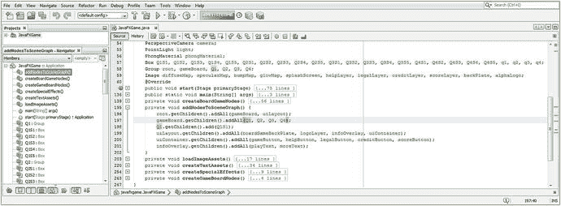

图 14-7。

Replace a Q1S1 reference in the gameBoard node builder with Q1 through Q4, and add a Q1 node builder

```java
root.getChildren().addAll(gameBoard, uiLayout);

gameBoard.getChildren().addAll(Q1, Q2, Q3, Q4);

Q1.getChildren().add(Q1S1);

```

接下来，让我们添加 q1 盒子游戏板中心象限，它将是 Q1S1 游戏板正方形的父对象；因此，这是下一个合乎逻辑的补充。因为你已经在你的类的顶部声明了 q1 到 q4 的盒子对象，如图 [14-6](#Fig6) 到 [14-8](#Fig8) 所示，你可以先把这个 q1 对象添加到你的 Q1 分支节点，或者你可以先用一个 300，5，300 (X，Y，Z)参数在 createGameBoardNodes()方法中实例化它，然后再把它添加到 addNodesToSceneGraph()方法中，如图 [14-8](#Fig8) 和

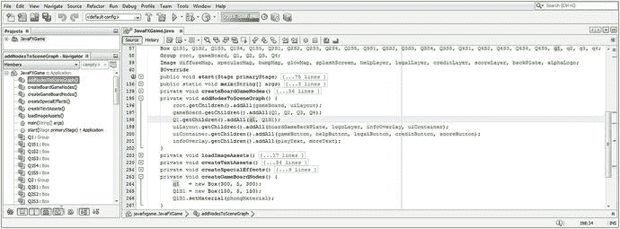

图 14-8。

Change the .add() method call to an .addAll() method call; add the q1 Box primitive for your first quadrant

```java
Q1.getChildren().addAll(q1, Q1S1);   // In addNodesToSceneGraph() method body

q1 = new Box(300, 5, 300);           // In createGameBoardNodes() method body

```

图 [14-9](#Fig9) 显示了一个运行➤项目的工作流程，显示了一个游戏棋盘方块和渲染为 0，0 的象限。

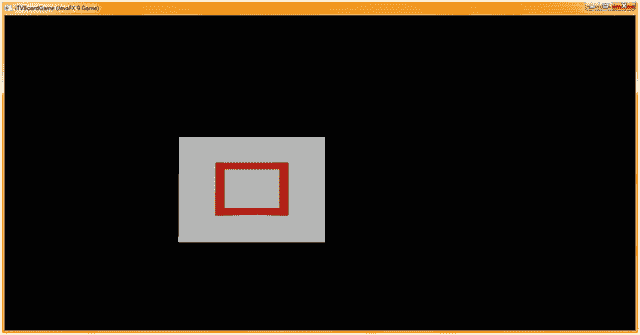

图 14-9。

Select Run ➤ Project and render your 3D Scene; both the quadrant and game board square are at 0,0,0

### 准备放置游戏板场景图节点

在我们开始围绕它们的周长定位 4 个象限和 20 个正方形之前，让我们为场景图的其余部分和着色器(PhongMaterial)使用的所有纹理贴图放置基础设施。使用剪切和粘贴将其他三个 Q2 到 Q4 场景图组节点添加到您的 addNodesToSceneGraph()方法中，如图 [14-10](#Fig10) 中以浅蓝色突出显示的内容。请注意，您可以使用。getChildren()。addAll()方法链，即使列表中只有一个 Node 子类 object 元素！您的 Java 语句将如下所示:

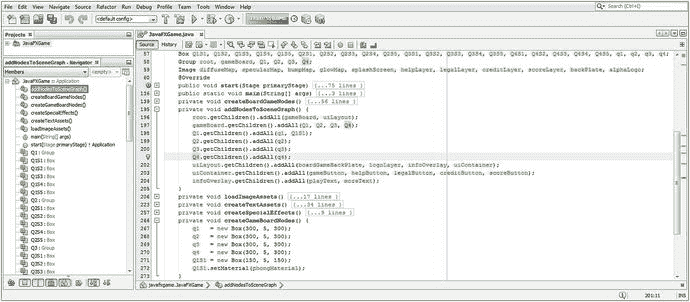

图 14-10。

Instantiate your other three quadrant Box primitives and your other three quadrant branch node objects

```java
Q2.getChildren().addAll(q2);

Q3.getChildren().addAll(q3);

Q4.getChildren().addAll(q4);

```

在此过程中，创建另外三个第 2 季度到第 4 季度的游戏板中心象限，以便我们可以将它们添加到 q2 到第 4 季度的节点构建声明中。同样，由于这些对象是在你的类的顶部声明的，你可以以任何你想要的顺序构造这些语句；只是不要使用运行➤项目来渲染场景，因为你不会看到对象，直到它们被实例化并添加到场景图层次。框实例化 Java 代码应该如下所示，如图 [14-10](#Fig10) 底部所示:

```java
q2 = new Box(300, 5, 300);

q3 = new Box(300, 5, 300);

q4 = new Box(300, 5, 300);

```

正如你在图 [14-9](#Fig9) 中看到的，象限 1 位于游戏棋盘方格 1 的下方，并且不在它们的角接触的位置。因此，将象限 1 的 q1 长方体对象对角移动 225 个单位。这相当于棋盘游戏正方形边的长度再加上 50%，即 225 个单位。如果您只使用 150 个单位，象限角将位于游戏棋盘方格的中心。创建这种对齐的代码如下所示。setTranslateX()和。setTranslateZ() Java 方法调用，如图 [14-11](#Fig11) 中间用黄色和蓝色高亮显示:

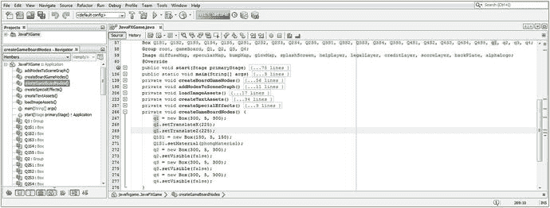

图 14-11。

Move the q1 quadrant to the X,Z location 225,225 so that it is internal to square Q1S1 with the corners touching

```java
private void createGameBoardNodes() {
    q1.setTranslateX(225);
    q1.setTranslateZ(225);
    Q1S1 = new Box(150, 5, 150);
    Q1S1.setMaterial(phongMaterial);
    q2 = new Box(300, 5, 300);
    q2.setVisible(false);
    q3 = new Box(300, 5, 300);
    q3.setVisible(false);
    q4 = new Box(300, 5, 300);
    q4.setVisible(false);
}

```

还要注意，我使用。setVisible(false)方法调用，这样我可以先处理象限 1 的 q1 框及其五个游戏棋盘方块子对象，因为我将先处理象限 1，向您展示我正在使用的工作流程，然后是象限 2，然后是象限 3，依此类推。如果可能的话，将复杂的任务分解成子任务是很有用的，这样你就不会在开发过程中不知所措。由于 SceneGraph 层级设置为使用 gameBoard 分支下的四个棋盘象限，这就是我将如何着手构建游戏棋盘，一次一个象限(在本例中为 Q1)。请注意，我的游戏棋盘方块名称也与此匹配，因此我有一个优势，因为我的游戏棋盘方块对象，在本例中为 Q1S1 到 Q1S5，与象限组对象名称 Q1 匹配。由于我不能将 q1 组对象名称复制为盒子象限对象名称，所以我必须将小写的 Q1 到 q4 用于我的象限平面基本体，这很好，因为我仍然知道发生了什么，并且因为游戏板的象限部分远不如游戏板正方形本身重要。

让我们使用“运行➤项目”工作流程渲染 3D 场景，看看两个长方体图元是否仍然重叠，或者它们的位置是否正确。正如您在图 [14-12](#Fig12) 中所看到的，游戏棋盘方块的角和第一象限的角现在已经对齐，您可以开始看到游戏棋盘将如何布局。

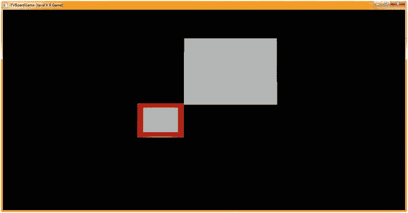

图 14-12。

Use the Run ➤ Project work process to see if the two 3D primitives are precisely aligned corner to corner

虽然这是我想看到的结果，但在考虑如何访问每个象限及其子方格时，我想让方格以 QxSy 1 到 5 的顺序围绕游戏板，如果我从每个象限的角上的方格 1 开始，这将不起作用！好好想想吧！因此，我实际上需要将这个正方形的位置从 0，0 (X，Z)移动到 300，0 (X，Z)。我将在创建自定义方法体来保存我的着色器后执行此操作。

由于我将有几十个着色器，我将快速创建另一个自定义方法来保持着色器创建的分离和组织，以便我可以根据需要折叠和展开着色器相关的代码。

### 编写 Phong 着色器创建方法代码:createMaterials()

由于着色器是 pro Java 9 游戏设计管道的重要组成部分，让我们为它们提供自己的方法体，并将 PhongMaterial 对象代码从 createBoardGameNodes()移到这个新的 createMaterials()方法中。在 loadImageAssets()之后的 start()方法的顶部添加一行代码，因为这些代码在着色器中以及 createGameBoardNodes()之前使用；这些对象将使用在此 createMaterials()方法体中创建的着色器。键入 createMaterials()和分号来调用不存在的方法；然后使用 Alt+Enter 组合键并选择“在 javafxgame 中添加 createMaterials()方法。JavaFXGame”选项。让我们也改变我们的 PhongMaterial 名称为 Shader1。我们可以在这个方法体中命名前 20 个着色器，也可以在您的类的顶部命名，在那里我已经为名为 diffuse1 到 diffuse 20 和 Shader1 到 Shader 20 的图像对象添加了声明，以预期我们将要编写的代码。剪切并将 PhongMaterial 代码粘贴到 createMaterials()中的“live”中，并删除高光属性。如图 [14-13](#Fig13) 所示的代码应该如下所示:


图 14-13。

Add Image object declarations diffuse1 through diffuse20 and create a createMaterials() shader method

```java
Image         diffuse1 ... diffuse20;      // Object Declarations at top of class
PhongMaterial Shader1  ... Shader20;
...
Shader1 = new PhongMaterial(Color.WHITE);  // Create Diffuse Shader in createMaterials()
Shader1.setDiffuseMap(diffuse1);

```

接下来，让我们移除我们在第 [13](13.html) 章中创建的 loadImageAssets()中所有与特效贴图相关的代码，除了 diffuseMap，它将被重命名为 diffuse1。复制并粘贴 diffuse1 实例化四次，并引用接下来的四个游戏板正方形纹理贴图，`gameboardsquare2.png`到`gameboardsquare5.png`。

从着色器的角度来看，您现在已经准备好构建游戏板的第一个象限了。在 loadImageAssets()方法的后半部分，现在应该有五个(diffuseMap)图像对象，分别命名为 diffuse1 到 diffuse5。这些将包含 diffuseMap 属性纹理贴图，定义暖色(红色、橙色、黄色)将被映射到游戏棋盘上的哪个方格，这些方格是游戏棋盘象限(1)的子方格，我们将首先对其进行布局。我们将首先布置绿色象限，然后是蓝色和紫色象限。

应使用以下 Java 语句添加(最终)24 个漫射颜色纹理贴图(漫射贴图属性)图像对象中的前五个，这些语句在图 [14-14](#Fig14) 的底部突出显示:

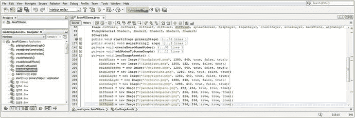

图 14-14。

Instantiate diffuse1 through diffuse5 in loadImageAssets() using your first five PNG diffuse texture maps

```java
diffuse1 = new Image("/gameboardsquare.png",  256, 256, true, true, true);
diffuse2 = new Image("/gameboardsquare2.png", 256, 256, true, true, true);
diffuse3 = new Image("/gameboardsquare3.png", 256, 256, true, true, true);
diffuse4 = new Image("/gameboardsquare4.png", 256, 256, true, true, true);
diffuse5 = new Image("/gameboardsquare5.png", 256, 256, true, true, true);

```

接下来，关闭 loadImageAssets()方法体。打开新的 createMaterials()方法体，将 Shader1 Java 语句复制并粘贴到其下四次。然后将它们重命名为 Shader2 到 Shader5。设置代表游戏棋盘正方形 diffuseMap 属性的图像对象，以引用您刚刚创建的 diffuse2 到 diffuse5 图像对象。

这可以通过使用以下十个 Java 语句来完成，它们在图 [14-15](#Fig15) 的底部用黄色和蓝色突出显示:

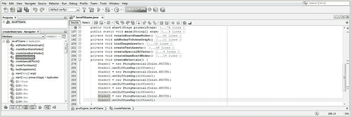

图 14-15。

Copy and paste the Shader1 Java code block four times underneath itself to create Shader2 through Shader5

```java
Shader1 = new PhongMaterial(Color.WHITE);
Shader1.setDiffuseMap(diffuse1);
Shader2 = new PhongMaterial(Color.WHITE);
Shader2.setDiffuseMap(diffuse2);
Shader3 = new PhongMaterial(Color.WHITE);
Shader3.setDiffuseMap(diffuse3);
Shader4 = new PhongMaterial(Color.WHITE);
Shader4.setDiffuseMap(diffuse4);
Shader5 = new PhongMaterial(Color.WHITE);
Shader5.setDiffuseMap(diffuse5);

```

### 完成游戏板的构建:象限 2 到 4

关闭 createMaterials()方法，然后重新打开 createGameBoardNodes()方法。使用`Q1S1.setTranslate` `X` `(` `300` `)`将 location 语句添加到 Q1S1 对象中，将第一个子方块定位到我们希望的位置，在象限的开始，顺时针方向。

接下来，复制并粘贴您的三个 Q1S1 游戏板 square 语句四次，以创建其余的 square 对象，我们也必须重新配置这些对象，直到 X，Z 位置参数和着色器对象引用被关注。

Q2S2 只需要将自己定位在离 0，0 原点 150 个单位的位置，因为你的正方形是 150 乘 150。这是通过改变定位方法调用到`.setTranslate` `X` `(` `150` `)`来实现的。确保还设置了`.setMaterial(` `Shader2` `)`来引用正确的着色器，该着色器然后引用(并应用)diffuse2 图像对象作为 diffuseMap 属性。

Q2S3 是唯一不需要重新定位的方块，因为它将位于 0，0 原点。我在示例代码中添加了名为`.setTranslate` `X` `(` `0` `)`的方法(但在 NetBeans 9 中没有)。请确保还设置了`.setMaterial(` `Shader3` `)`来引用正确的着色器，该着色器然后引用(并应用)diffuse3 图像对象作为 diffuseMap 属性。

Q2S4 只需要将自己定位在距离 0，0 原点 150 单位的位置，但这次是在 Z 方向。这是通过改变定位方法调用到`.setTranslate` `Z` `(` `150` `)`来实现的。确保设置`.setMaterial(` `Shader4` `)`来引用正确的 Shader4 对象，该对象然后引用(并应用)diffuse4 图像对象作为 diffuseMap 属性。

Q2S5 需要从 0，0 开始在 Z 方向上定位自己 300 个单位。这是用定位方法调用`.setTranslate` `Z` `(` `300` `)`来完成的。确保设置`.setMaterial(` `Shader5` `)`来引用正确的 Shader5 对象，然后它引用(并应用)diffuse5 图像对象作为 diffuseMap 属性。图 [14-16](#Fig16) 中突出显示的 Java 代码应该如下所示:

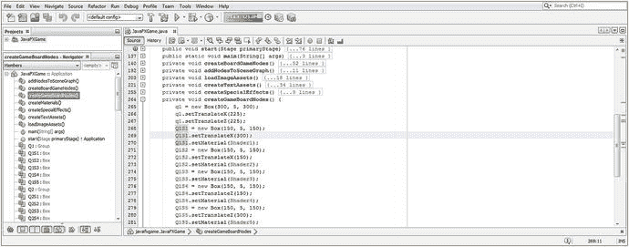

图 14-16。

Copy and paste the Q1S1 statements four times underneath themselves and reconfigure their method calls

```java
private void createGameBoardNodes() {
    q1.setTranslateX(225);
    q1.setTranslateZ(225);
    Q1S1 = new Box(150, 5, 150);
    Q1S1.setTranslateX(300);
    Q1S1.setMaterial(Shader1);
    Q1S2 = new Box(150, 5, 150);
    Q1S2.setTranslateX(150);
    Q1S2.setMaterial(Shader2);
    Q1S3 = new Box(150, 5, 150);
    Q1S3.setTranslateX(0);        // This statement can be omitted, as default X location is 0
    Q1S3.setMaterial(Shader3);
    Q1S4 = new Box(150, 5, 150);
    Q1S4.setTranslateZ(150);
    Q1S4.setMaterial(Shader4);
    Q1S5 = new Box(150, 5, 150);
    Q1S5.setTranslateZ(300);
    Q1S5.setMaterial(Shader5);
    q2 = new Box(300, 5, 300);
    q2.setVisible(false);         // Set q2 through q4 quadrant objects to visible=false for now
}

```

在我们可以看到 3D 场景中呈现的这些新对象之前，我们需要将它们添加到 addNodesToSceneGraph()方法体中的 SceneGraph 层次结构中。将 Q1S2 到 Q1S5 框对象添加到 Q1 组对象，如图 [14-17](#Fig17) 中用黄色和浅蓝色突出显示的。

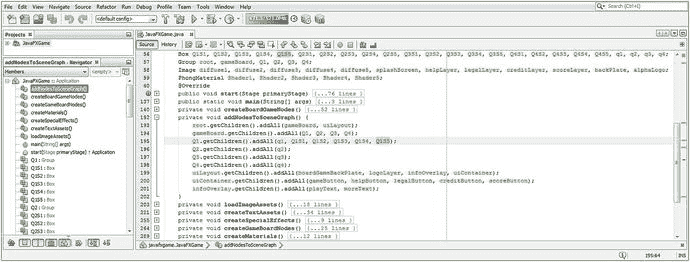

图 14-17。

Add your other three Q2 to Q4 Group objects to the gameBoard Group and the other four squares to Q1

让我们也完成场景图层次的第二层(q2 到 q4 分支节点),并将 Q2 到 Q4 盒平面基本体添加到其他三个 Q2 到 Q4 组节点，以将游戏板的内部象限添加到场景图层次。我们在工作过程中的这一点上这样做，以便我们能够在游戏板的中心部分工作，因为我们是一次构建一个象限。

因为我们基本上完成了第一个象限，所以我们将其他三个放入场景图中，这样当我们构建剩余的游戏板象限和它们的游戏板方块时，它们将会呈现(可见),这些方块将围绕每个相应象限的周界附着到它们。

从优化的角度来看，我们只用了九个就为 2D UI 和 3D 游戏板组件创建了一个相对复杂的场景图层次。getChildren()。addAll()方法链 Java 编程语句，如图 [14-17](#Fig17) 所示。这是相对紧凑的，因为我们以高度组织的方式引用了几十个 2D 和 3D 游戏组件叶节点，并且只使用了九个场景图层次结构语句。

添加其他四个正方形和其他三个象限可以通过使用以下 Java 编程语句来完成，这些语句在图 [14-17](#Fig17) 的底部以黄色和浅蓝色突出显示:

```java
root.getChildren().addAll(gameBoard, uiLayout);
gameBoard.getChildren().addAll(Q1, Q2, Q3, Q4);
Q1.getChildren().addAll(q1, Q1S1, Q1S2, Q1S3, Q1S4, Q1S5);

Q2.getChildren().addAll(q2);

Q3.getChildren().addAll(q3);

Q4.getChildren().addAll(q4);

```

图 [14-18](#Fig18) 显示了运行➤项目 JavaFX 9 代码测试的工作流程。正如你所看到的，我们已经有了四分之一的游戏板，它看起来非常适合组装所有这些素材的第一轮，包括 3D 盒子图元和 2D 纹理贴图图像，我们已经在类的顶部声明并即将创建。

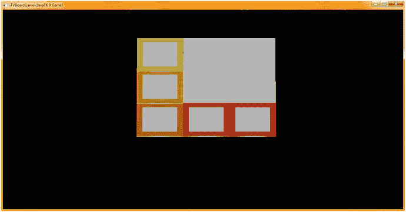

图 14-18。

Use the Run ➤ Project work process to see if the completed 3D game board quadrant is aligning properly

复制粘贴五个扩散图像语句，创建扩散 6 到 20，如图 [14-19](#Fig19) 所示。

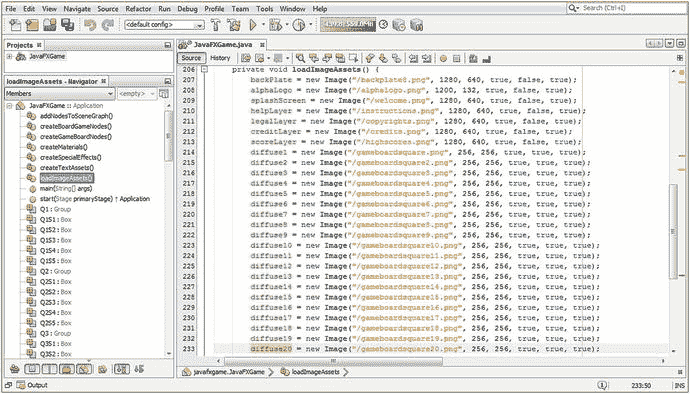

图 14-19。

Copy and paste 5 diffuse texture Image instantiations 3 times and create all 20 diffuse Image objects

关闭 loadImageAssets()方法体，现在漫反射图像实例化已经就绪，打开 createMaterials()方法，执行完全相同的操作，复制前五个着色器 Java 语句对，并在它们自身下面再粘贴三次。更改每个语句的编号部分，以便创建 Shader6 到 Shader20 Java 语句对。这些都可以在图 [14-20](#Fig20) 中用黄色突出显示。

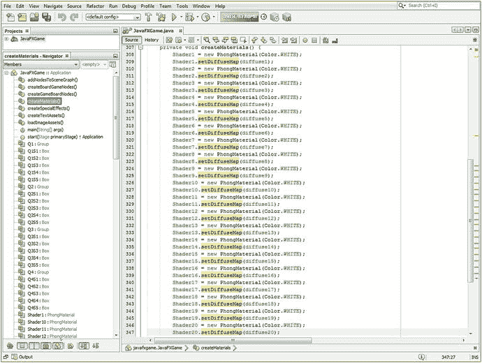

图 14-20。

Copy and paste 5 Shader PhongMaterial instantiations 3 times and create all 20 Shader objects

现在，让我们通过返回 createGameBoardNodes()方法体来创建游戏板的第二象限，并通过复制 Q1S1 到 Q1S5 语句来创建 Box 原语 Q2S1 到 Q2S5 的第二部分代码，将它们再次粘贴到它们自身的下面，然后更改对象名称和方法调用参数(这样，您就不必再次将这些 Java 语句的大部分键入 NetBeans 9 IDE)。

q2 盒子对象(第二象限)将需要沿 z 轴向外移动 300 个单位(象限大小为 300x300)，因此 q2.setTranslateZ()方法参数需要从 225 增加到 525，以完成第二象限游戏板组件定位，如图 [14-22](#Fig22) 所示，如果您想向前看。

Q2S1 需要沿 z 轴(从 0，0 原点)将自己定位 450 个单位，因为 Q1S5 位于 300 加上 150，即 450。这是通过改变定位方法调用到`.setTranslate` `Z` `(` `450` `)`来实现的。确保设置`.setMaterial(` `Shader6` `)`来引用正确的着色器，该着色器引用(并应用)diffuse6 图像对象作为 diffuseMap 属性。

Q2S2 需要将自己沿 z 轴定位 600 个单位(从 0，0 原点)，因为 450 加 150 等于 600。这是通过改变定位方法调用到`.setTranslate` `Z` `(` `600` `)`来实现的。请确保还设置了`.setMaterial(` `Shader7` `)`来引用正确的着色器，该着色器然后引用(并应用)diffuse7 图像对象作为 diffuseMap 属性。

Q2S3 需要将自己沿 z 轴定位 750 个单位(从 0，0 原点)，因为 600 加 150 等于 750。这是通过改变定位方法调用到`.setTranslate` `Z` `(` `750` `)`来实现的。确保还设置了`.setMaterial(` `Shader8` `)`来引用正确的着色器，该着色器然后引用(并应用)diffuse8 图像对象作为 diffuseMap 属性。

Q2S4 也需要从 0，0 原点沿 z 轴将其自身定位 750 个单位，但这一次，我们需要在 X 方向上将这个方块推过 150 个单位，以便沿游戏棋盘布局的顶部向右移动。这是通过转换到使用两个定位方法调用来完成的。一个是`.setTranslate` `X` `(` `150` `)`，另一个是`.setTranslation` `Z` `(` `750` `)`。请确保将`.setMaterial(` `Shader9` `)`设置为引用正确的 Shader9 对象，然后该对象将 diffuse9 图像对象作为 diffuseMap 属性进行引用(并应用)。

Q2S5 需要在 X 方向上从 0，0 开始定位 300 个单位，以及在 Z 方向上定位 750 个单位，使得该正方形位于该游戏板的顶部中间附近，在游戏板的另一侧，从正方形 1 开始。这也是使用两个位置方法调用完成的，对`.setTranslate` `Z` `(` `750` `)`和对`.setTranslate` `X` `(` `300` `)`。请确保将`.setMaterial(` `Shader10` `)`设置为引用正确的 Shader10 对象，该对象随后会引用(并应用)diffuse10 图像对象作为 diffuseMap 属性。

用于构建游戏棋盘第二象限的 Java 代码如图 [14-21](#Fig21) 所示，位于构建第一象限的代码之后，应如下所示(为便于阅读，将代码隔开):

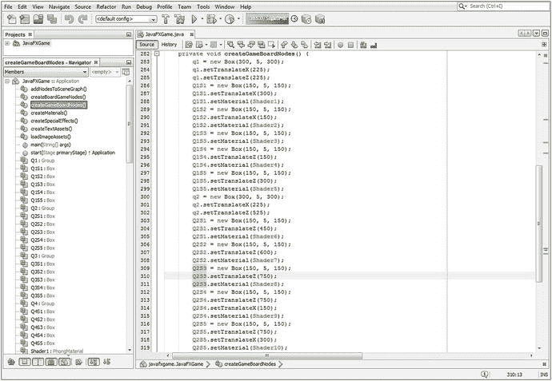

图 14-21。

Instantiate and configure game board squares Q2S1 through Q2S5 inside of createGameBoardNodes()

```java
private void createGameBoardNodes() {
    ...
    q2 = new Box(300, 5, 300);      // Java code creating a second quadrant for the gameboard
    q2.setTranslateX(225);
    q2.setTranslateZ(525);

    Q2S1 = new Box(150, 5, 150);
    Q2S1.setTranslateZ(450);
    Q2S1.setMaterial(Shader6);

    Q2S2 = new Box(150, 5, 150);
    Q2S2.setTranslateZ(600);
    Q2S2.setMaterial(Shader7);

    Q2S3 = new Box(150, 5, 150);
    Q2S3.setTranslateZ(750);
    Q2S3.setMaterial(Shader8);

    Q2S4 = new Box(150, 5, 150);
    Q2S4.setTranslateZ(750);
    Q2S4.setTranslateX(150);
    Q2S4.setMaterial(Shader9);

    Q2S5 = new Box(150, 5, 150);
    Q2S5.setTranslateZ(750);
    Q2S5.setTranslateX(300);
    Q2S5.setMaterial(Shader10);

    q3 = new Box(300, 5, 300);
    q3.setVisible(false);
    ...                            // The third quadrant configuration code will go in here
    q4 = new Box(300, 5, 300);
    q4.setVisible(false);
}

```

如图 [14-22](#Fig22) 所示，使用运行➤项目来确认游戏板的构建已经完成了一半！

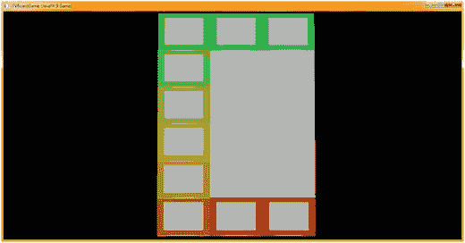

图 14-22。

Quadrants 1 and 2 are now coded and aligning properly

接下来为 gameBoard 组分支的最终场景图构造代码添加 Java 语句。你的 3D 场景层次应该如下图所示，在图 [14-23](#Fig23) 中用黄色和浅蓝色突出显示:

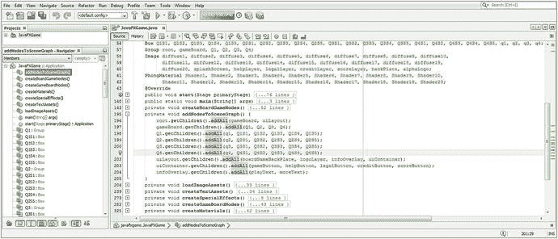

图 14-23。

Add all remaining SceneGraph Node object “wiring” code to add the rest of the squares to the quadrants

```java
root.getChildren().addAll(gameBoard, uiLayout);
gameBoard.getChildren().addAll(Q1, Q2, Q3, Q4);
Q1.getChildren().addAll(q1, Q1S1, Q1S2, Q1S3, Q1S4, Q1S5);
Q2.getChildren().addAll(q2, Q2S1, Q2S2, Q2S3, Q2S4, Q2S5);
Q3.getChildren().addAll(q3, Q3S1, Q3S2, Q3S3, Q3S4, Q3S5);
Q4.getChildren().addAll(q4, Q4S1, Q4S2, Q4S3, Q4S4, Q4S5);

```

接下来，让我们通过返回到 createGameBoardNodes()方法体并为 Box 原语 q3S1 到 Q3S5(以及 Q3 中心象限)创建第三部分代码，来为您的游戏板创建第三象限。只需复制 Q2S1 到 Q2S5 语句，并再次将它们粘贴到自身之下(在 q3 实例化和配置语句之后，将分组的节点逻辑地保存在 Java 代码体中)。接下来，您将再次更改您的对象名称和方法调用参数(这样您就不必再次将这些 Java 9 语句中的大部分输入到 NetBeans 9 IDE 中),以便从您的第一个象限开始对角定位您的方块。

q3 盒子对象(第三象限)将需要沿 x 轴和 z 轴向外移动 300 个单位(象限大小为 300x300)，因此`q3.setTranslateX()`方法参数也需要从 225 增加到 525，以完成第三象限游戏板组件定位，如图 [14-24](#Fig24) 所示。

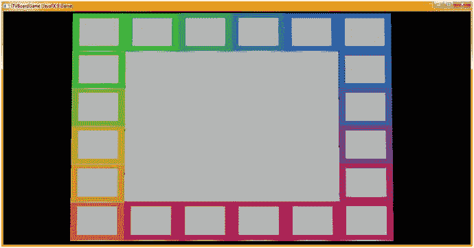

图 14-24。

Use your Run ➤ Project work process to see that quadrants 1 to 4 are now coded and aligning properly

Q3S1 需要沿 x 轴从 0，0 原点定位 450 个单位，沿 z 轴定位 750 个单位。这是通过将您的 locational 方法调用更改为`.setTranslateX(450)`并离开(或者添加`w`，这取决于您复制了哪个 Java 代码)`.setTranslate` `Z` `(` `750` `)`。请确保还设置了`.setMaterial(` `Shader11` `)`来引用正确的着色器编号，该编号然后引用(并应用)diffuse11 图像对象作为 diffuseMap 属性。

Q3S2 需要沿 x 轴从 0，0 原点定位 600 个单位，沿 z 轴定位 750 个单位。这是通过将位置方法调用更改为`.setTranslate` `X` `(` `600` `)`并离开(或添加，取决于您复制的 Java 代码块)`.setTranslate` `Z` `(` `750` `)`)来完成的。请确保还设置了`.setMaterial(` `Shader12` `)`来引用正确的着色器编号，该编号然后引用(并应用)diffuse12 图像对象作为 diffuseMap 属性。

Q3S3 需要沿 z 轴从 0，0 原点定位 750 个单位，沿 x 轴定位 750 个单位，这使其与 0，0 原点成对角线。这是通过将位置方法调用更改为`.setTranslate` `Z` `(` `750` `)`，然后添加第二个`.setTranslate` `X` `(` `750` `)`方法调用来完成的。请确保还设置了`.setMaterial(` `Shader13` `)`来引用您正确的 Phong 着色器对象编号，该编号引用(并应用)diffuse13 图像对象作为您的 diffuseMap 属性。

Q3S4 还需要从 0，0 原点沿 X 方向将自己定位 750 个单位，但这一次，我们还需要将这个方块沿 Z 方向再向下拉 150 个单位，以便沿游戏棋盘布局的右侧向下移动。这通过再次使用两个定位方法调用来完成。一个将是`.setTranslate` `Z` `(` `600` `)`，另一个仍将被设置为`.setTranslation` `X` `(` `750` `)`。同样，请确保将`.setMaterial(` `Shader14` `)`设置为引用匹配的 Shader14 对象，然后该对象引用并应用 diffuse14 图像对象作为 diffuseMap 属性。

Q3S5 需要在 X 方向上从 0，0 和 450 个单位定位自己 750 个单位在 Z 方向上，以便这个正方形位于这个游戏板的中间右侧附近。这也是使用两个位置方法调用完成的，对`.setTranslate` `X` `(` `750` `)`和对`.setTranslate` `Z` `(` `450` `)`。请确保将`.setMaterial(` `Shader15` `)`设置为引用正确的 Shader15 对象，然后该对象引用(并应用)diffuse15 图像对象作为 diffuseMap 属性。

用于构建游戏棋盘第二象限的 Java 代码应该如下所示:

```java
private void createGameBoardNodes() {
    ...
    q3 = new Box(300, 5, 300);    // Java code creating a third quadrant for the gameboard
    q3.setTranslateX(525);
    q3.setTranslateZ(525);
    Q3S1 = new Box(150, 5, 150);
    Q3S1.setTranslateZ(750);
    Q3S1.setTranslateX(450);
    Q3S1.setMaterial(Shader11);
    Q3S2 = new Box(150, 5, 150);
    Q3S2.setTranslateZ(750);
    Q3S2.setTranslateX(600);
    Q3S2.setMaterial(Shader12);
    Q3S3 = new Box(150, 5, 150);
    Q3S3.setTranslateZ(750);
    Q3S3.setTranslateX(750);
    Q3S3.setMaterial(Shader13);
    Q3S4 = new Box(150, 5, 150);
    Q3S4.setTranslateZ(600);
    Q3S4.setTranslateX(750);
    Q3S4.setMaterial(Shader14);
    Q3S5 = new Box(150, 5, 150);
    Q3S5.setTranslateZ(450);
    Q3S5.setTranslateX(750);
    Q3S5.setMaterial(Shader15);
    ...                           // Your fourth quadrant configuration code will go in here
    q4 = new Box(300, 5, 300);
    q4.setVisible(false);
}

```

最后，让我们通过返回 createGameBoardNodes()方法体并为 Box 原语 Q4S1 到 Q4S5 创建第四段代码来创建游戏板的第四象限。只需复制你的 Q3S1 到 Q3S5 语句(以及 q4 语句)并再次粘贴在它们自己的下面；然后更改对象名和方法调用参数(这样您就不必再次在 NetBeans 9 中键入所有这些 Java 语句)。

q4 盒子对象(第四象限)将需要沿 z 轴向下移动 300 个单位，因此您的 q4.setTranslateZ()方法参数需要从 525 减少到 225，以完成第四象限游戏板组件定位，如图 [14-24](#Fig24) 所示。

Q4S1 需要沿 Z(从 0，0 原点)定位 300 个单位，并沿 X 向右定位 750 个单位。这是通过改变定位方法调用到`.setTranslate` `Z` `(` `300` `)`来实现的。确保将`.setMaterial(` `Shader16` `)`设置为引用正确的着色器，该着色器然后引用并应用 diffuse16 图像对象作为 diffuseMap 属性。

Q4S2 需要沿 Z(从 0，0 原点)定位 150 个单位，沿 x 定位全部 750 个单位。这是通过将定位方法调用更改为`.setTranslate` `Z` `(` `150` `)`来完成的。请确保将`.setMaterial(` `Shader17` `)`设置为引用正确的着色器，然后该着色器引用并应用 diffuse17 图像对象作为 diffuseMap 属性。

Q4S3 只需要将自己定位在距离 0，0 原点沿 X 方向 750 个单位的位置，因为它位于右角。这意味着唯一需要的定位方法调用是`.setTranslate` `X` `(` `750` `)`。确保将`.setMaterial(` `Shader18` `)`设置为引用正确的着色器，该着色器然后引用并应用 diffuse18 图像对象作为 diffuseMap 属性。

Q4S4 只需要将自己定位在距离原点 0，0 沿 X 方向 600 个单位的位置，就可以将这个方块向原点方向拉回 150 个单位，以便将其沿游戏棋盘布局的底部向左移动。这是通过仅使用`.setTranslate` `X` `(` `600` `)`方法调用来完成的。确保设置`.setMaterial(` `Shader19` `)`来引用正确的 Shader9 对象，该对象引用(并应用)diffuse19 图像对象作为 PhongMaterial diffuseMap 属性。

Q4S5 需要在 X 方向上从 0，0 开始定位自己 450 个单位，因此您的最后一个游戏方块位于该游戏板的底部中间附近。这也是使用一个定位方法调用`.setTranslate` `X` `(` `450` `)`来完成的。确保设置`.setMaterial(` `Shader20` `)`来引用正确的 Shader20 对象，然后它引用(并应用)diffuse20 图像对象作为 diffuseMap 属性。用于构建游戏棋盘最后一个象限的 Java 代码应该类似于下面的 Java 代码:

```java
private void createGameBoardNodes() {
    ...
    q4 = new Box(300, 5, 300);      // Java code creating a second quadrant for the gameboard
    q4.setTranslateX(525);
    q4.setTranslateZ(225);
    Q4S1 = new Box(150, 5, 150);
    Q4S1.setTranslateX(750);
    Q4S1.setTranslateZ(300);
    Q4S1.setMaterial(Shader16);
    Q4S2 = new Box(150, 5, 150);
    Q4S2.setTranslateX(750);
    Q4S2.setTranslateZ(150);
    Q4S2.setMaterial(Shader17);
    Q4S3 = new Box(150, 5, 150);
    Q4S3.setTranslateX(750);
    Q4S3.setMaterial(Shader18);
    Q4S4 = new Box(150, 5, 150);
    Q4S4.setTranslateX(600);
    Q4S4.setMaterial(Shader19);
    Q4S5 = new Box(150, 5, 150);
    Q4S5.setTranslateX(450);
    Q4S5.setMaterial(Shader20);
}

```

图 [14-24](#Fig24) 显示了运行➤项目 Java 代码测试的工作流程，展示了一个完成的 3D 游戏板。

有一两个渲染异常是可见的，例如 Q1S2 方块，它看起来像是位于 Q1S1 方块之上。这很奇怪，因为代码是精确的，并且基于 150 的倍数，所以它应该像其他代码一样精确对齐。因为这个问题不在代码上，我们将在下一章看看如何处理这个渲染异常。使用。setRotationAxis(旋转。y 轴)和。setRotate(30)方法将游戏板旋转 30 度，就像您之前所做的那样，以查看旋转游戏板层次所使用的枢轴点。这个 Java 9 测试代码应该放在你的 createBoardGameNodes()方法中，如图 [14-25](#Fig25) 中突出显示的。

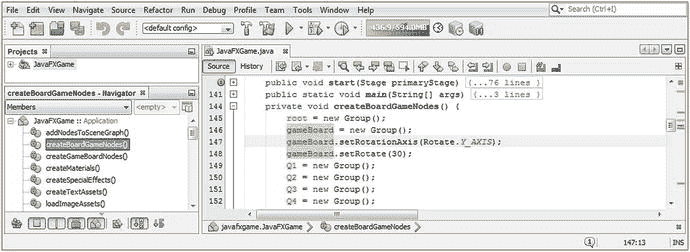

图 14-25。

Add .setRotationAxis(Rotate.Y_AXIS) and a .setRotate(30) method call to the gameBoard Group object

我们这样做的原因是，在我们离开这一章之前，我们需要检查一下，这个游戏板是否作为一个层级在工作。也就是说，如果我们围绕 y 轴旋转它，它会以游戏板组的中心为支点，还是会围绕游戏板的 0，0 原点角方块的中心旋转(旋转)？

正如你在图 [14-26](#Fig26) 中看到的，游戏板组对象确实在定义它自己的 0，0 中心，使用它所有组节点子节点的平均中心。我们从游戏棋盘的 6 × 150 (900)构造中知道，这个 0，0 中心在原点之间的 X 和 Z (450，450)上偏移 450(900 的一半)，或者在直线单位(对角线上)上偏移 625(450+450 的 1/2)。通过用可整除的整数来构造事物，我们将能够在后面的章节中使用整数(int)作为我们的游戏代码，这为 JavaFX 游戏引擎节省了内存和处理。

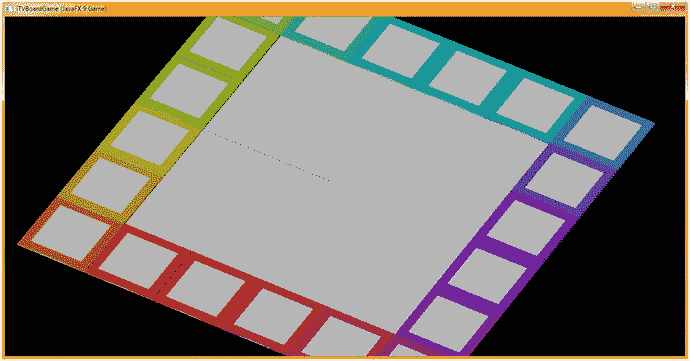

图 14-26。

Rotate the gameBoard Group Node object 30 to 45 degrees to see where it defines its center for rotation

在我们结束本章之前，让我们看看是否可以通过使用不同的相机(算法)类来改善我们的游戏板渲染结果，因为我们似乎有一些盒子表面渲染顺序和定位问题。如果不是相机对象在方块之间造成了这些轻微的脊，我们将不得不进一步寻找这个问题的解决方案，因为我们需要获得一个逼真的游戏板，看起来像我们在现实生活中用来玩游戏的纸板游戏板。正如你现在所知道的，pro Java 9 游戏开发是一个迭代的过程，所以你知道我们最终会解决它！

## 更改摄像机:使用 ParallelCamera 类

接下来，我将把 camera 对象从 PerspectiveCamera 更改为 ParallelCamera，这既是为了给你一些使用它们的经验，也是为了看看这种面顺序渲染问题(看起来在正方形中重叠)在两个 Camera 类算法之间(在两个 Camera 子类之间)是否有任何不同。这很简单，只需将类顶部的声明从 PerspectiveCamera 更改为 ParallelCamera，并确保对 createBoardGameNodes()中的实例化语句进行相同的更改，如此处以及图 [14-27](#Fig27) 所示:

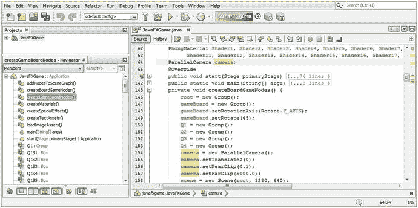

图 14-27。

Change the Scene camera object to use a ParallelCamera class (algorithm) instead of PerspectiveCamera

```java
ParallelCamera camera;
...
camera = new ParallelCamera();
camera.setTranslateZ(0);
camera.setNearClip(0.1);
camera.setFarClip(5000.0);

```

接下来，让我们进入 gameButton 事件处理代码块并移除。setFieldOfView(1)方法调用只需注释掉该行代码，正如您所看到的，这是一个巧妙而常见的代码调试技巧。

我们这样做是因为新的 ParallelCamera 对象不支持该特定的方法调用。我们还会将 camera.setTranslateZ()方法调用更改为游戏板的对角线值，我计算该值以将相机视图放置在游戏板中心(625)。

我还会将 camera.setTranslateX()方法调用设置为游戏板宽度 225 的四分之一，如图 [14-28](#Fig28) 中间高亮显示的 camera 对象代码所示。

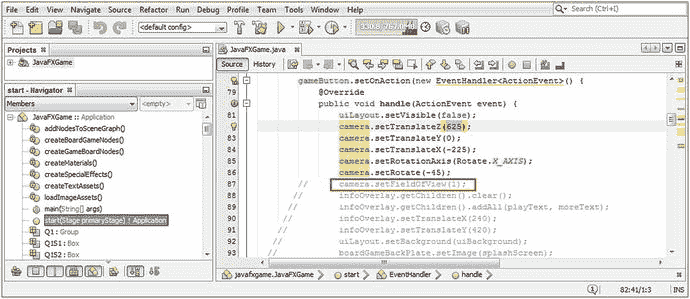

图 14-28。

Remove the FOV setting code, change .setTranslateX() to 225, .setTranslateZ() to 625, and Y = 0

我正在改进这段代码，以便更好地查看游戏板，并使其更好地适应窗口，这样当我们在随后的动画和游戏性章节中旋转它时，它将在任何旋转方向上完美地适应场景，同时它也在动画中随机旋转以选择主题象限。

我要做的下一件事是“调整”onStart()中的相机值，以适应窗口中的游戏板。正如你在图 [14-29](#Fig29) 中看到的，我们需要展平摄像机视图(30 度)并稍微调整 X、Y、Z 位置。

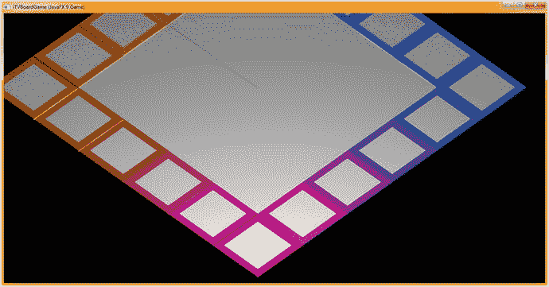

图 14-29。

The game board is almost fitting perfectly in the window; let’s adjust the camera angle and spacing next!

正如你在图 [14-30](#Fig30) 中看到的，我将旋转调整到 30°，Z 轴调整到 500°，Y 轴调整到-300°，X 轴调整到-260°。

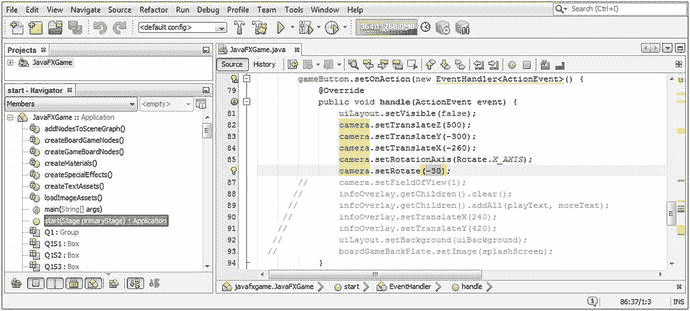

图 14-30。

Set the camera rotation at 30 degrees, the Z location to 500, the Y location to -300, and the X location to -260

正如您在图 [14-31](#Fig31) 中看到的，我们现在已经设置了游戏板的“极限”以适合窗口，使用这些新的相机设置和 ParallelCamera 算法，这似乎比 PerspectiveCamera 更少扭曲游戏板。如果我们现在旋转游戏板，它应该都留在窗口(可视)区域内。

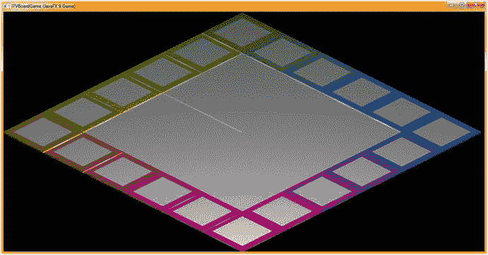

图 14-31。

Use your Run ➤ Project work process to see if the new camera algorithm and settings fit the game board

## 摘要

在第十四章中，我们构建了 JavaFX SceneGraph 层次结构的 3D 部分，即根节点下的 gameBoard 组(节点子类)分支节点(我们之前已经创建了 uiLayout StackPane 节点子类)。我们创建了一个由四个名为 q1 到 q4 的游戏棋盘象限组分支节点组成的子组，每个节点包含四分之一的游戏棋盘内部，这些节点是名为 Q1 到 Q4 的长方体基本体，以匹配它们的组节点父对象。在这些象限下面，我们分组了五个游戏棋盘方形叶节点对象，它们将在游戏设计中与象限游戏功能相对应。

我们创建了两个新的方法体，一个用于创建游戏棋盘方块，因为有几十个方块，另一个用于创建 Phong 材质，因为将会有几十个方块！这让事情井井有条。我们现在有八个(如果算上 main()的话有九个，它仍然处于引导代码状态)方法体，其中七个是定制的，我们有 400 多行 Java 代码，全部组织成逻辑折叠和扩展部分。我们为每个游戏棋盘方块创建了彩色着色器，将适当的漫反射纹理贴图映射到每个方块上。

在第 [15](15.html) 章中，我们将进一步完善我们的游戏板设计和 Java 代码组织，并为游戏玩家创建一种在 3D 空间中操纵游戏板的方式，以便他们(或游戏 AI 代码)可以访问他们感兴趣的游戏板内容和主题部分。