# 十五、3D 游戏界面创建：使用球体原语创建一个界面节点

现在，您已经创建了多层游戏板组节点(子类)层次，并对其进行了测试，以查看它是否像一个 3D 模型一样旋转，是时候添加一个球体 3D 图元了，这样我们就可以创建一个 3D 用户界面元素，供用户在游戏过程中用来创建随机的“旋转”。我们还将为这些设置 Phong 着色器对象，并再次使用 GIMP 2.8.22 为游戏板象限创建(从头开始)其余的漫反射纹理贴图，以及为球体图元创建 3D“spinner”UI 纹理贴图。该旋转器将在每个玩家的回合中使用，以随机旋转游戏板来选择主题类别。你总是需要将你的 pro Java 9 游戏与其他游戏区分开来，所以我们将是独一无二的，并旋转游戏板本身来选择象限(主题类别)，这不能用现实生活中的游戏板来完成，但可以用虚拟的 i3D 游戏板来完成。我们将把 Java 9 代码添加到类的顶部以及 createMaterials()、addNodesToSceneGraph()和 loadImageAssets()方法体中。我们将创建自定义的 PNG24 漫反射纹理添加到您的项目源(/src)文件夹中。我们将重新安排 createGameBoardNodes()方法来重新组织象限 3D 图元，我们将在本章中完成游戏板设计的内部部分。我们将把象限一起放在这个方法的顶部。

在这一章中，我们还将看看你是如何解决在创作专业品质游戏的过程中遇到的问题的。在这种情况下，有一个人脸渲染的问题，是我们在对游戏板建模时遇到的；它应该渲染顺利(顶部平坦)，但渲染与游戏板广场重叠，这是不应该发生的。也有一些小的 Y(高度)变化，一旦它们被漫反射纹理映射，就会使象限看起来凹陷。(请记住，在第 [14](14.html) 章中，中心象限在没有应用着色器的情况下看起来是平坦的，但是一旦我们继续对它们进行处理，它们也会显示出这些渲染工件，这一点您将在本章的后面部分看到。)

## 完成 3D 资源:主题象限和微调器

让我们继续设计和开发棋盘游戏的 3D 组件，包括使用 GIMP 为游戏棋盘内部开发纹理贴图，以及使用 3D spinner UI 元素为游戏创建随机旋转，就像在现实生活中的棋盘游戏一样。我们将使用 Java 9 (JavaFX API)类来完成这项工作，这样我们就可以只使用 Java 9 APIs 和我们的数字图像资源(背景图像和纹理贴图)来创建游戏。到目前为止，我们已经用了大约 400 行代码完成了这项工作！在本章中，我们将添加另外 10 %( 440)来“修饰”象限，并在屏幕的左上角添加一个“spinner”UI 元素。在类的顶部，我们需要做的第一件事是再添加五个名为 diffuse21 到 diffuse25 的图像对象声明，以及五个名为 Shader21 到 Shader25 的声音材料对象声明。这显示在下面的 Java 代码中，并且在图 [15-1](#Fig1) 中的类的顶部显示为绿色(一些代码用黄色和蓝色突出显示):

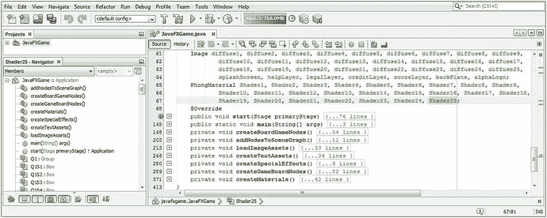

图 15-1。

Add objects at the top of your class for diffuse texture maps and shaders for your quadrants and a spinner

```java
Image ... diffuse21, diffuse22, diffuse23, diffuse24, diffuse25;
PhongMaterial ... Shader21, Shader22, Shader23, Shader24, Shader25;

```

剪切并粘贴最后五个 diffuse16 到 diffuse20 图像对象声明，创建五个名为 diffuse21 到 diffuse25 的新声明，并对它们进行配置以供使用，如图 [15-2](#Fig2) 所示:

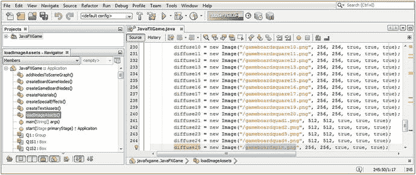

图 15-2。

Create five new diffuse image map objects in your loadImageAssets() method and configure them for use

```java
diffuse21 = new Image("/gameboardquad1.png", 512, 512, true, true, true);
diffuse22 = new Image("/gameboardquad2.png", 512, 512, true, true, true);
diffuse23 = new Image("/gameboardquad3.png", 512, 512, true, true, true);
diffuse24 = new Image("/gameboardquad4.png", 512, 512, true, true, true);
diffuse25 = new Image("/gameboardspin.png",  256, 256, true, true, true);

```

我们将在本章的下一节使用 GIMP 创建这些漫射纹理贴图数字图像素材。打开 createMaterials()方法体，并添加相应的 Shader21 到 Shader25 对象实例化和配置语句，这些语句“连接着色器”以引用漫反射纹理贴图图像对象资源。

如果您愿意，也可以使用复制和粘贴来完成此操作，就像您对漫反射纹理贴图图像对象所做的那样。创建新着色器并将其引用到漫反射纹理贴图图像对象素材的 Java 代码应类似于以下 Java 代码语句块，在图 [15-3](#Fig3) 中高亮显示:

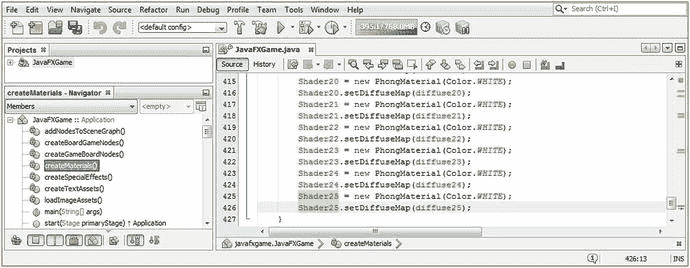

图 15-3。

Create five new Shader PhongMaterial objects in your createMaterials() method and wire them to diffuseMap objects

```java
Shader21 = new PhongMaterial(Color.WHITE);
Shader21.setDiffuseMap(diffuse21);
Shader22 = new PhongMaterial(Color.WHITE);
Shader22.setDiffuseMap(diffuse22);
Shader23 = new PhongMaterial(Color.WHITE);
Shader23.setDiffuseMap(diffuse23);
Shader24 = new PhongMaterial(Color.WHITE);
Shader24.setDiffuseMap(diffuse24);
Shader25 = new PhongMaterial(Color.WHITE);
Shader25.setDiffuseMap(diffuse25);

```

你现在将不得不再次利用 GIMP 来创建你的象限和旋转纹理贴图来专业地纹理化你的棋盘游戏元素。当前版本是 2.8.22。

### 创建您的象限和微调器漫射颜色纹理贴图

使用 GIMP 文件➤新工作进程创建一个透明(空)的漫反射纹理贴图合成，这次使其为 512×512 像素，因为象限框对象 q1 到 q4 在两个轴上都是方形框对象的两倍大(或总共四倍大)。这在数学上与游戏棋盘方格所用的 256 像素纹理贴图尺寸加倍相匹配。单击圆形(或椭圆)选择工具，在图 [15-4](#Fig4) 的顶部高亮显示，并再次使用工具图标下方的椭圆选择工具选项选项卡，为圆形设置精确的大小和位置，因为我们希望白色圆形完美地位于每个游戏板象限的中心。我将圆的大小设置为 400(相等的宽度和高度值创建一个完美的圆；任何变化都将创建一个椭圆或卵形)，我将其余部分(512 - 400 = 112 / 2 = 56)相除，得到我的 X，Y 位置值 56，它也以红色突出显示。

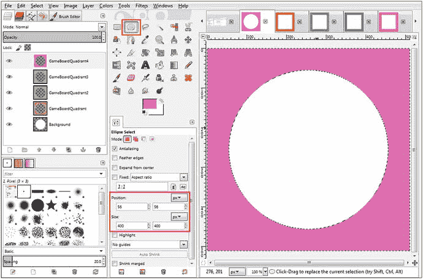

图 15-4。

Create the four quadrant texture maps at 512-pixel resolution using 60 percent of the corner square color value

选中背景层，确保前景色样设置为白色，并使用编辑➤填充前景颜色(白色)选项在合成层堆栈的最底部为所有四个象限纹理贴图创建白色中心，如图 [15-4](#Fig4) 所示。右键单击背景层，使用新建层命令，创建一个名为 GameBoardQuadrant 的新层。使用“选择➤反转”菜单序列来反转选择，并选择 GameBoardQuadrant 层来指定该层保存您的外部颜色填充。打开 gameboardsquare3.png 文件，使用吸管工具选择它的橙色值。单击 FG 颜色(前景)样本，调用“拾色器”对话框，并将值(V)滑块设置为 60%颜色(40%白色),为位于对角的象限创建角正方形的彩色版本。如图 [15-2](#Fig2) 中的图像对象代码所示，使用编辑➤填充 FG 颜色来填充中心圆周围的区域，使用文件➤导出为将文件保存到项目的/src 文件夹，并将其命名为 boardgamequad1.png。重复这个过程:创建一个新的层，得到一个角方块颜色值，变亮 40%，填充前景色，将图像导出为 PNG24 来创建另外三个编号的 boardgamequad PNG24 素材，它们显示在图 [15-4](#Fig4) 最左侧各自的层中。你也可以在图 [15-4](#Fig4) 的右上角看到我打开来采样颜色值的 gameboardsquare 3、8、13 和 18 图像素材。吸管工具位于椭圆选择工具的右下方。

当我们在 GIMP 中时，让我们打开我们的纹理贴图创建 GIMP XCF 文件，其中包含我们在第 [13](13.html) 章中创建的所有不同的贴图类型，包括着色器和材质，并使用您的沙滩球漫反射纹理创建一个 3D 旋转球纹理，当它旋转时读取“SPIN ”, S 和 I 为白色(彩色), P 和 N 为黑色。

打开 Pro _ Java _ 9 _ Games _ Development _ Texture _ Maps GIMP XCF 文件，选择文本工具，如图 [15-5](#Fig5) 红框所示。设置您的文本选项使用 Arial Heavy，设置字体大小为 48，并选择抗锯齿。点击色样，选择白色，在绿色条纹中间输入大写字母 S，如图 [15-5](#Fig5) 所示。右键单击 S 图层，选择复制图层工具，设置文本工具色样为黑色，选择黄色的 S，如图[15-5](#Fig5)；然后键入大写的 P 来替换 s。您可以使用右箭头键使用移动工具(四个相连的箭头)来移动文本元素，以便它与 s 保持精确对齐。将其置于白色条纹的中心，然后对 I 和 N 文本元素重复该过程，直到您创建了单词 SPIN。

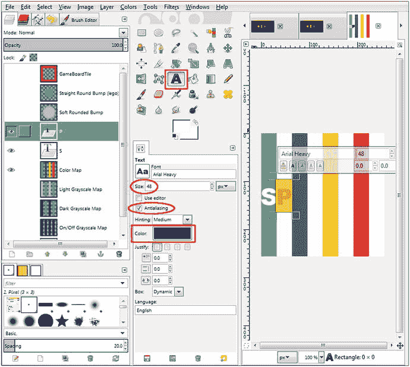

图 15-5。

Create the word SPIN twice on your beach ball texture map to create your animated spinner texture map

一旦你做了所有四个字母一次，你可以使用相同的右键单击一个层，并使用复制层工作过程来复制这些字母；然后使用移动工具将字母定位在其他四个条纹上，如图 [15-6](#Fig6) 右侧所示。

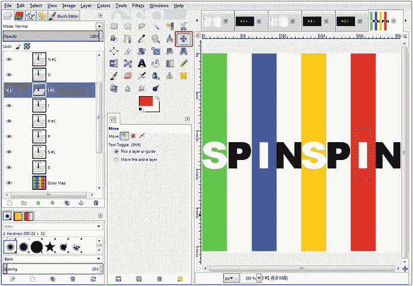

图 15-6。

Replicate the four SPIN letters twice in the center of each of the eight stripes, at exactly the same height

要使用 GIMP 移动工具，首先单击文本元素，这将向移动工具显示您要移动的内容，然后使用右箭头键将字母定位在下一个条纹上。使用右箭头键而不是用鼠标拖动字母将使字母保持在完全相同的像素高度位置，使字母彼此完全对齐。

正如你将在图 [15-6](#Fig6) 中看到的，这个工作过程将产生一个统一的、专业的地图结果。尽管您的字母在 GIMP 画布上看起来很拥挤，但当映射到球体基本体的曲率上时，结果是非常可读的，即使是在动画中，因为曲面的曲率似乎将这些字母“拉伸”得更远。

一旦你对旋转纹理贴图感到满意，使用文件➤导出为菜单序列，并保存你的游戏面板旋转。png 文件到您的`C:/Users/Name/Documents/NetBeansProjects/JavaFXGame/src/`文件夹中，如图 [15-7](#Fig7) 所示。请注意，我们的 boardgamesquare PNG24 文件经过了很好的优化，有 680 字节，而我们的 boardgamequad 文件每个只有 10KB。如果你点击一个文件名，你会在对话框的右边得到一个很好的纹理贴图预览。这是一个很棒的特性，特别是对于相似的文件名，因为你可以点击任何文件名来预览它，GIMP 会把那个文件名放在 name 字段中；那你就把末尾的数字改了当打字快捷键就行了！

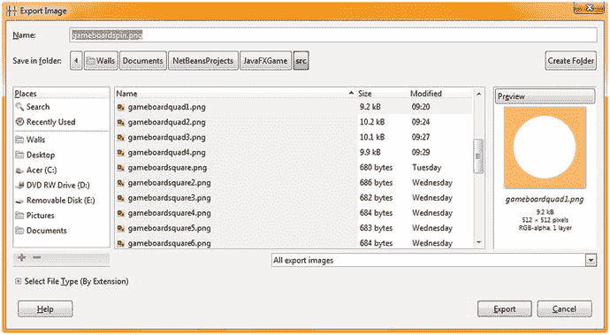

图 15-7。

Name your new diffuse color texture map file gameboardspin.png and then save it into your /src folder

接下来，让我们开始将漫射纹理贴图应用到我们的 3D 棋盘游戏元素中，并完成 3D 贴图的创建。

### 3D 游戏棋盘象限的纹理映射:Java 代码

打开 createGameBoardNodes()方法体，将 q1 到 q4 的对象代码剪切并粘贴到方法的顶部，这样象限框元素 q1 到 q4 就可以在同一个 Java 9 语句块中进行实例化和配置。您现在可以更清楚地看到相对于每个象限的不同 225 和 525 组合的 X、Z 移动模式，没有相同的 X、Z 坐标对，它们会与您的象限重叠。

将`q1` `.setMaterial(` `Shader21` `);`添加到第一个中，如图 [15-8](#Fig8) 所示，使用以下 Java 代码:

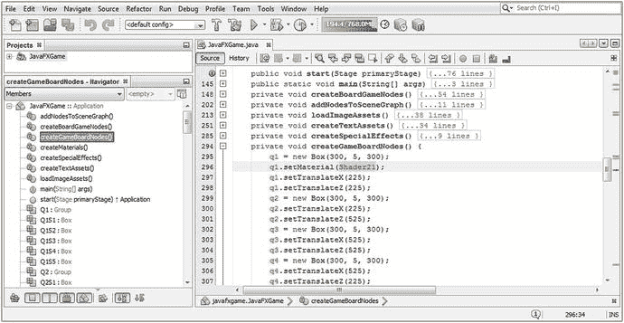

图 15-8。

Cut and paste all quadrant Box primitive code to one place and start adding shaders using .setMaterial()

```java
q1 = new Box(300, 5, 300);
q1.setMaterial(Shader21);
q1.setTranslateX(225);
q1.setTranslateZ(225);
q2 = new Box(300, 5, 300);
q2.setTranslateX(225);
q2.setTranslateZ(525);
q3 = new Box(300, 5, 300);
q3.setTranslateX(525);
q3.setTranslateZ(525);
q4 = new Box(300, 5, 300);
q4.setTranslateX(525);
q4.setTranslateZ(225);

```

图 [15-9](#Fig9) 显示了游戏板象限 1 纹理映射和测试渲染的运行➤项目工作流程。正如你所看到的，一旦你的漫反射纹理贴图被应用，面顺序渲染问题就出现了！

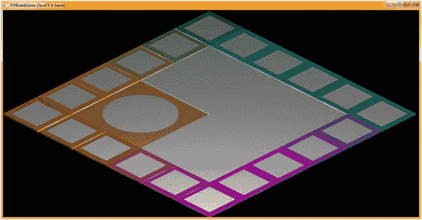

图 15-9。

Select Run ➤ Project to render and preview the first quadrant texture map application (the face order bug appears)

接下来，添加您的。setMaterial()方法调用您的其他三个象限框图元，并在方法调用参数列表中引用您正确的 Shader22 到 Shader24 PhongMaterial 对象。完成后，Shader 对象到 Box 原语的连接应该看起来像下面的 Java 代码，在图 [15-10](#Fig10) 中用黄色突出显示:

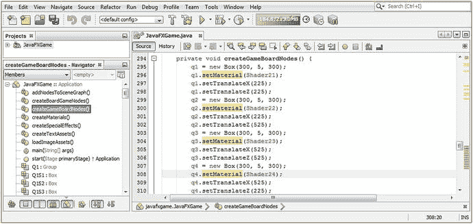

图 15-10。

Complete the Shader object wiring to Box primitives for all quadrants so we can see the finished gameboard

```java
q1 = new Box(300, 5, 300);
q1.setMaterial(Shader21);
q1.setTranslateX(225);
q1.setTranslateZ(225);

q2 = new Box(300, 5, 300);
q2.setMaterial(Shader22);
q2.setTranslateX(225);
q2.setTranslateZ(525);

q3 = new Box(300, 5, 300);
q3.setMaterial(Shader23);
q3.setTranslateX(525);
q3.setTranslateZ(525);

q4 = new Box(300, 5, 300);
q4.setMaterial(Shader24);
q4.setTranslateX(525);
q4.setTranslateZ(225);

```

正如你在图 [15-11](#Fig11) 中看到的，象限盒图元现在呈现出与 i3D 游戏板的其余部分相同的面渲染顺序问题。让我们暂时停止编码，看看是否可以找到其他 Java 开发人员在 JavaFX 9 游戏开发中遇到这种特殊 3D 模型人脸渲染问题的证据。正如你所想象的，用来做这项研究的工具是搜索引擎。


图 15-11。

The diffuse texture mapping looks very professional, other than the face depth and rendering anomalies

在 JavaFX 9 dev 论坛上提交错误报告之前，让我们看看我是如何找到面部顺序呈现问题的解决方案的，我尝试使用 Google 搜索引擎和目标明确的关键字来完成这个问题。

### 使用 Google 解决 JavaFX 异常:使用 StackOverflow

要找到有类似问题的开发人员，请使用 Google 搜索引擎，输入您在屏幕上看到的最常见或最可能的问题描述。在这种情况下，这将是“错误的重叠形状”或“框面顺序渲染的问题”有时你可能不得不尝试几个不同的关键字字符串。在这种情况下，有几个正确的答案，那就是打开一个叫做深度缓冲的特性。这是一种处理密集型算法，因此默认情况下是关闭的。由于我们也得到一些锯齿状的边缘，我们可以打开另一个处理密集型算法，称为反走样。这两个都可以在重载的 Scene()构造函数中访问，所以只需对我们的 Scene scene 对象实例化做一个简单的修改就可以解决这两个问题！以下是关于此问题及其解决方案的两个 StackOverflow 答案的示例:

```java
stackoverflow.com/questions/19589210/overlaping-shapes-wrong-overlapping-shapes-behaviour

   --OR--

stackoverflow.com/questions/28567195/javafx-8-3d-z-order-overlapping-shape-behaviour-is-wrong

```

场景的重载构造函数方法允许您将深度缓冲和抗锯齿作为 3D 场景对象的默认行为，类似于以下 Java 代码:

```java
Scene(Parent root, double width, double height, boolean depthBuffer, SceneAntialiasing constant)

```

因此，我们需要添加 depthBuffer=true 和 SceneAntialiasing。平衡到我们在 createBoardGameNodes()方法中使用的 Scene()构造函数，正如你在图 [15-12](#Fig12) (红色矩形)中看到的，我把它添加到了`scene = new Scene(root, 1280, 640);` Java 9 场景对象实例化语句的末尾。这将切换您的构造函数方法调用，以利用不同的重载构造函数方法来创建您的 3D 场景。

让我们添加一个名为 spinner 的 3D UI 元素，玩家可以使用它来随机旋转游戏板以选择主题。

### 创建 3D 用户界面元素:3D 微调器随机发生器

现在让我们重用我们的球体原始代码和沙滩球纹理图来创建一个 3D 用户界面(UI)元素，玩家可以单击它来旋转棋盘，以选择一个随机的主题(topic)类别。在类的顶部声明球体并将其命名为 spinner。然后用半径 60 实例化它，并用 Shader25 和 X，Y 位置-200，-500 配置它，这使它位于屏幕的左上角。使用 Y 旋转轴并将旋转值设置为 25 度，尝试将单词 SPIN 面向用户。您的 Java 代码，如图 [15-12](#Fig12) 所示，将如下所示:

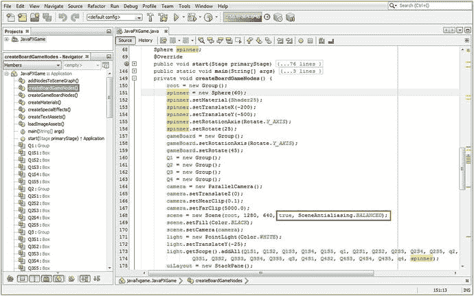

图 15-12。

Add a Sphere primitive named spinner, set the material and translation parameters, and fix the face order render bug

```java
Sphere spinner;
...

spinner = new Sphere(60);
spinner.setMaterial(Shader25);
spinner.setTranslateX(-200);
spinner.setTranslateY(-500);
spinner.setRotationAxis(Rotate.Y_AXIS);
spinner.setRotate(25);

scene = new Scene(root, 1280, 640, true, SceneAntialiasing.BALANCED);

```

在我们能够渲染您的 3D 场景并查看新的微调器 UI 以确定我们是否需要以任何方式调整漫射纹理贴图之前，我们需要将其添加到 JavaFX 场景图。我将把它添加到顶部，直接在根目录下，因为 3D 用户界面最终会有自己的层次结构，就像 2D uiLayout 和 3D 游戏板一样。通过这种方式，如果我们想在任何时候影响 3D UI 元素作为一个整体，我们可以使用一行代码来引用 3D UI 分支，这将影响它下面的所有叶节点。现在，微调器将是根下面的一个叶节点。添加微调器的 Java 代码如图 [15-13](#Fig13) 所示，应该如下所示:

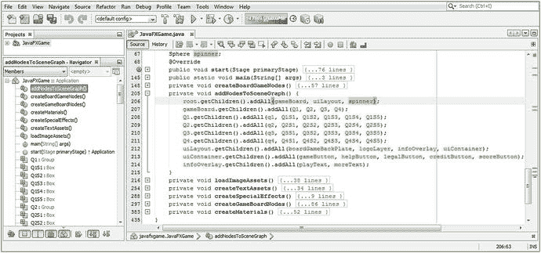

图 15-13。

Add your spinner Sphere object to the top of the SceneGraph hierarchy using root.getChildren().addAll()

```java
root.getChildren().addAll(gameBoard, uiLayout, spinner);

```

现在，我们可以使用“运行➤项目”工作流程并测试我们的新 Java 代码，将球体旋转器 UI 添加到我们在这个 3D 场景中创建的棋盘游戏中。我们还将能够看到，通过使用更复杂的重载 Scene()构造函数方法(具有五个参数，而不是只有三个参数)，添加抗锯齿和深度缓冲算法(分别检查正确的面顺序渲染和在渲染过程中对粗糙边缘应用平滑)是否解决了我们的视觉质量问题。

正如你在图 [15-14](#Fig14) 中看到的，3D 游戏板层次结构，包括二十几个 3D 基本对象，如游戏板方块和游戏板象限，现在被渲染为一个内聚的 3D 模型。它最终看起来像你在大多数流行的棋盘游戏中看到的棋盘游戏(纸板游戏板)，并且每个方块和象限将能够在你的代码中被单独访问和控制，即使游戏板模型看起来只是 3D 场景中的一个 3D 对象。这是我们在过去几章中努力学习和实现的。

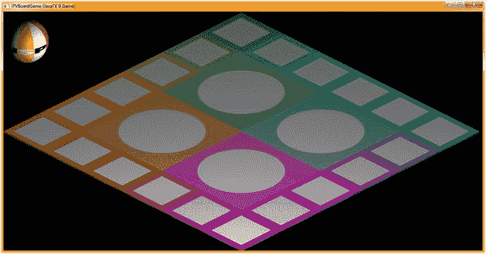

图 15-14。

The face rendering order problem has been fixed, and we're now getting a smooth, thin cardboard game

另一方面，spinner UI 元素没有给我们最初想要的视觉效果，它是一个沙滩球类型的对象，前面写着单词 SPIN。这是可以的，因为我们知道 pro Java 9 games 开发是一个迭代的细化过程，所以让我们考虑如何缩小单词 SPIN down，以便在 Sphere 原语上一次显示四个字母，而不是像当前呈现的那样只有两个字母。

缩小文本以使单词 SPIN 适合球体图元的四分之一，以及增加彩色条纹的数量(和厚度)的最简单方法是使该纹理贴图为 512 像素纹理。这将缩小所有的文本元素，使四个适合，我们可以复制和粘贴条纹和颜色移动他们添加更多的颜色。

接下来，让我们回到 GIMP，看看增强 spinner UI 漫反射纹理贴图的工作过程。

### 增强 3D 微调器纹理贴图:提高分辨率

如果您在优化的工作流程中使用 GIMP 的工具和算法，为 3D spinner UI 元素创建更详细的 512x512 像素纹理贴图的工作流程会比您想象的容易得多。我们可以在仅仅十几或两个“动作”中使分辨率加倍、条纹加倍、条纹颜色加倍、文本元素加倍，GIMP 会以我们所要求的最高质量水平为您完成所有的像素操作。

图 [15-15](#Fig15) 显示了移动的 GIMP 合成结果。首先要做的是添加另外 256 个像素到文档的右侧，使用图像➤画布大小➤宽度=512 ➤调整大小(按钮)，这将添加 256 个像素的透明度到纹理贴图合成的右半部分。选择背景层和白色色样，使用画笔工具(第四行，第四个图标)填充背景层的右半部分，使其为 100%白色。接下来，右键单击彩色地图图层，选择复制图层选项，这将创建彩色地图复制图层，如图 [15-15](#Fig15) 所示。选择该图层，使用彩色➤色相-饱和度算法(菜单序列)，将四种颜色都移动 60 度左右，创建四种不同的颜色，如图 [15-15](#Fig15) 所示。接下来，要将(y 或高度)尺寸调整为 512 个匹配像素，这一次使用图像➤缩放图像菜单序列，通过单击宽度和高度之间的链图标解锁纵横比，并将高度值设置为 512。这将拉伸颜色条来填充图像，这样你就不必像最初创建沙滩球纹理图那样做大量的选择-移动-填充工作。这种缩放操作也将使文本组件变高，这将使它们在球体微调器 UI 中更具可读性，尤其是在它旋转的时候。最后，右键单击 S、P、I 和 N 的第 2 层，并为每个层创建第 3 层和第 4 层。使用移动工具和右箭头键来精确定位它们。

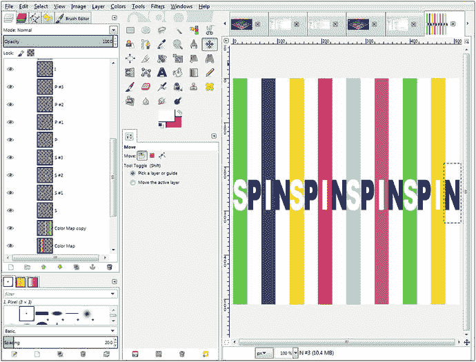

图 15-15。

Use a 256-pixel beach ball texture map to create a more detailed 512-pixel Sphere spinner UI texture map

最后，使用“文件”“导出为”覆盖项目/src/文件夹中的当前 gameboardspin.png 文件。由于该文件名已经在 diffuse25 图像对象实例化语句中被引用，您所要做的就是将宽度和高度值从 256 更改为 512，当映射到相同大小的球体图元上时，这将有助于减少球体上的条纹和文本元素(字母)的大小，因此将显示四个字母(SPIN)而不是两个字母(SP，如图 [15-14](#Fig14) 所示)。此时，您所要做的就是将旋转值调整到 20 到 30 度之间，以便单词 SPIN 将位于名为 spinner 的球体对象的中心，这样用户就知道当单击这个球体 spinner UI 对象时会发生什么。

您的 diffuse25 对象实例化的新 Java 9 语句应该类似于下面的 Java 代码，在图 [15-16](#Fig16) 中也用黄色和蓝色突出显示:

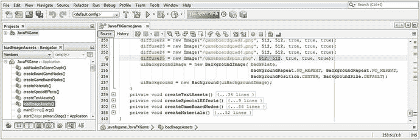

图 15-16。

Modify the width and height resolution parameters and change them from 256 pixels to 512 pixels each

```java
diffuse25 = new Image("/gameboardspin.png", 512, 512, true, true, true);

```

接下来需要做的事情是“调整”所有微调器对象配置设置，使球体图元变大一点，并将其移近屏幕的角落，以便它远离游戏板。我做了半径 64 和 Y 平移-512 来进一步上移。我发现 30 度的旋转值使单词 SPIN 居中。图 [15-17](#Fig17) 中突出显示的 Java 代码应该如下所示:


图 15-17。

Tweak the Sphere spinner settings to radius 64 to make the spinner bigger and rotate it to 30 degrees to see SPIN

```java
Sphere spinner;
...

spinner = new Sphere(64);
spinner.setMaterial(Shader25);
spinner.setTranslateX(-200);
spinner.setTranslateY(-512);
spinner.setRotationAxis(Rotate.Y_AXIS);
spinner.setRotate(30);

```

图 [15-18](#Fig18) 显示了运行➤项目的 Java 代码测试工作流程。正如你所看到的，游戏板现在看起来非常专业，3D 旋转器 UI 看起来像一个旋转器，并使用大的可读字母标记为 SPIN。

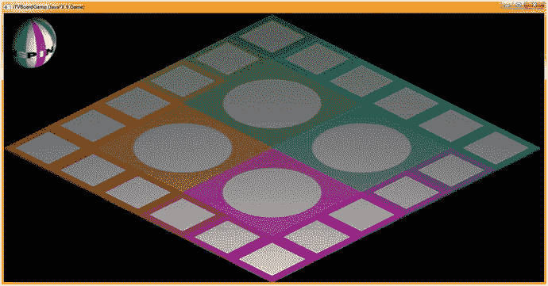

图 15-18。

The spinner Sphere UI element now looks more like a spinner, and the word SPIN is now visible to the user

现在我们已经完成了 3D 棋盘游戏的设计和编码，我们可以回到 javafx.graphics 模块中一些常用于游戏的更具技术性的 JavaFX 类。技术含量最高的领域之一是 3D 动画，我们将在接下来的内容中对旋转器和游戏板等进行动画制作，从而将 3D boardGame 节点层次带入第四维时间！之后，我们可以添加交互性，使之成为 i3D 桌游！在我们继续添加动画之前，我只需要让事情变得完美和一个 3D 旋转器到位。

## 摘要

在第十五章中，我们构建了 3D“spinner”球体原始 UI 元素，它允许用户在游戏板上随机旋转以选择主题象限。我们还完成了游戏板的纹理映射，并找出了如何修复面部渲染异常，这些异常使游戏板模型(游戏的核心)无法正确渲染，因此无法获得专业的外观。该解决方案涉及使用更复杂的场景对象实例化，包括打开深度缓冲算法的标志以及启用所有 3D 对象的场景范围抗锯齿的常数。这消除了 Y 维度(高度)面部渲染错误，以及我们在游戏板组件边缘看到的锯齿状边缘。

我们为四个游戏棋盘中心象限和 spinner UI 元素创建了五个新的纹理贴图，该元素允许玩家旋转棋盘以确定他们的下一步行动，在这种情况下，是一个教育主题。

我们添加了漫射纹理贴图图像对象和利用这些纹理贴图的 Phong 着色器定义。我们还添加了 Java 代码，将 spinner UI 添加到 SceneGraph 层次结构中，并获得了更多使用 GIMP 的实践。

在第 [16](16.html) 章中，我们将学习 JavaFX 9 中所有强大的动画相关过渡类。