# 十六、3D 游戏动画创建：使用动画过渡类

现在，您已经创建了多层游戏板组节点(子类)层次结构，对该层次结构下的所有 3D 组件进行了纹理处理，确保您的 3D 游戏板模型中心旋转，并创建了一个 3D 旋转器 UI 来随机旋转该游戏板 3D 模型(层次结构)以选择一个随机象限，现在是时候使用自定义的`createAnimationAssets()`方法为旋转器添加动画对象以创建在游戏过程中使用的随机“旋转”了。我们还将设置 3D 对象鼠标单击事件处理代码来触发动画和逻辑，这将在进行旋转之前随机化您的旋转变换参数。

在本章中，我们将详细介绍抽象动画和过渡超类以及所有强大的属性过渡子类，您可以在 i3D 棋盘游戏中将它们实现为不同类型的动画对象。我们将为您的游戏板和旋转器制作旋转动画，以及旋转器的平移(运动)动画。

## 动画 3D 素材:动画超类

public abstract Animation 类扩展了 Object，保存在 javafx.animation 包中，其他与动画相关的类也是如此，其中一些我们将在游戏中使用，本章将详细介绍。Animation 超类有两个直接已知的子类，Timeline 和 Transition。Transition 有十个预定义的动画(算法)子类，随时可以应用到您的游戏开发中，因此我们将重点关注它们，因为它们可以立即有效地使用。javafx.animation 包可以写一整本书，而我只有一章，所以我将介绍用来创建 pro Java 9 游戏的最有效的动画类。

动画超类的 Java 9 类层次结构向我们展示了该类是临时编码的，以提供对象动画功能，因为它没有自己的超类，因此看起来像下面的类层次结构:

```java
java.lang.Object
  > javafx.animation.Animation

```

抽象 Animation 类不能直接创建动画对象，但它确实为 JavaFX API 中使用的所有动画类提供了核心功能。唯一的例外是 AnimationTimer 类(一个脉冲引擎)，它实现了一个核心定时器脉冲引擎(因此，它更像一个定时器类，而不是动画类)，非常适合基于 2D 精灵的游戏。我在 Java 8 游戏开发入门中进入了这个类，在那里我将详细介绍 i2D 游戏开发。在本书中，我更关注 i3D 游戏的开发，所以我将借此机会介绍一些其他有用的(也是固定的或预编码的)动画过渡类。

通过设置 cycleCount 属性，动画可以运行有限的次数。要使任何动画“乒乓”(即从开始到结束再到开始来回运行)，请将 autoReverse 属性设置为 true 否则，使用一个假布尔值，我们将在我们的 pro Java 9 游戏中使用它来随机地向一个方向旋转 i3D 游戏板。

要在实例化和配置动画对象后播放它，可以调用 play()方法或 playFromStart()方法。动画对象的 currentRate 属性设置您的速度和方向。通过反转 currentRate 的数值，您可以切换您的播放方向。每当“持续时间”属性被“满足”(耗尽、结束、耗尽、达到、过期等)时，动画将停止。

通过使用具有不定常数的 cycleCount 属性，可以为动画对象设置不定的持续时间(有时称为循环或无限循环)。以这种方式配置的动画对象会重复运行，直到调用 stop()方法。这将停止正在运行的动画，并将其回放重置到起点(属性设置)。也可以通过调用 pause()来暂停动画，下一个 play()调用将从动画暂停的地方继续播放动画，除非您使用. playFromStart()方法调用。接下来让我们看看动画超类的属性。这些都是由 Transition 超类及其所有子类继承的，所以在本书的剩余部分中，您将在您的 Pro Java 9 游戏开发代码中使用它们。

autoReverse BooleanProperty 用于定义动画对象是否应该在交替循环中反转其方向。currentRate 是一个 ReadOnlyDoubleProperty，用于指示动画对象的其他设置正在播放的当前速度(和方向，由正值或负值表示)。

current time ReadOnlyObjectProperty<duration>用于定义动画对象回放位置，cycleCount IntegerProperty 用于定义播放动画对象的周期数。cycle duration ReadOnlyObjectProperty<duration>是一个只读变量，可用于指示动画对象的一个周期的持续时间。这是从时间 0 到动画结束所花费的时间，默认速率为 1。</duration></duration>

delay ObjectProperty <duration>用于延迟动画的开始时间，onFinished ObjectProperty <eventhandler>属性包含在动画对象播放结束时触发的 ActionEvent。rate DoubleProperty 用于定义动画播放的速度和方向。注意，由于硬件的限制，这个速率并不总是可能的，所以有一个 currentRate 属性来保存实际达到的回放速率。</eventhandler></duration>

status ReadOnlyObjectProperty<animation.status>属性包含动画对象的枚举状态常量。枚举动画。Status helper 类包含三个常量:PAUSED、RUNNING 和 STOPPED。</animation.status>

total duration ReadOnlyObjectProperty<duration>属性保存一个只读变量以指示动画对象的总持续时间，该变量乘以 cycleCount 属性以计算它重复的次数。所以，duration 是一个周期，totalDuration 等于(delay + (duration * cycleCount))。</duration>

动画有一个静态(嵌套)类，它是一个动画。Status 类，保存表示状态的可能状态的枚举常量。这些包括暂停、运行和停止。

Animation 有一个数据字段，即 static int 不定字段，该字段用于指定一个动画，该动画将无限重复自身，直到。调用 stop()方法。

Animation 有两个重载的构造函数，一个是简单的(空参数区域)构造函数，创建一个空的或未配置的动画对象，另一个用目标帧速率配置动画对象。这些构造函数方法(它们的子类的构造函数方法格式，因为它们不能在您的代码中直接使用)应该看起来像下面的 Java 代码:

```java
protected Animation()                        // Protected: Cannot Be Directly Instantiated
protected Animation(double targetFramerate)

```

你可以用几十种方法来控制你的动画对象，在这一章中，就是各种各样的过渡子类。这些从动画类继承方法，通过转换类，到各种属性转换类，我们将用于 Java 9 游戏。

autoReverseProperty()方法调用返回一个 BooleanProperty，该属性定义动画对象是否将在(交替)播放周期之间反转其方向。currentRateProperty()方法调用返回一个只读 double 变量，用于指示动画对象播放的当前速度和方向。

a。rateProperty()方法调用返回动画预期播放的速度和方向的双值。. statusProperty()方法调用返回动画的 ReadOnlyObjectProperty <animation.status>状态，而. currentTimeProperty()方法调用返回动画对象的播放位置。那个。cycleCountProperty()使用代表 cycleCount 属性的整数值返回动画对象中的循环数。</animation.status>

那个。cycleDurationProperty()方法返回一个只读变量，表示动画一个周期的持续时间，即从时间 0.0 开始以默认速率 1.0 播放到动画结束所用的时间。那个。delayProperty()方法调用返回延迟动画对象开始的延迟属性的持续时间。

a。totalDurationProperty()方法调用返回只读的持续时间属性设置，以指示动画对象的总持续时间。值得注意的是，该值将包括所有动画重复周期。

那个。getCuePoints()方法调用返回包含动画对象提示点的 ObservableMap <string>。这些提示点应该用来标记动画对象中的重要位置。那个。getCurrentRate()方法调用将为动画对象的 CurrentRate 属性返回双精度值。</string>

的。getCurrentTime()方法调用将返回动画对象的 CurrentTime 属性的值。

的。getCycleCount()方法调用将返回动画对象 CycleCount 属性的整数值。getCycleDuration()方法调用将返回 CycleDuration 属性的值。的。getDelay()方法调用将返回 Delay 属性的值。

a。getOnFinished()方法调用将返回 OnFinished 属性的 EventHandler <actionevent>值，而. getRate()方法调用将返回 Rate 属性的 double 值。那个。getStatus()方法调用将返回动画。状态属性的状态值。</actionevent>

那个。getTargetFramerate()方法调用将返回目标帧速率，即动画对象运行的最大帧速率(使用每秒帧数)。

那个。getTotalDuration()方法调用将返回 TotalDuration 属性的持续时间值。

那个。isAutoReverse()方法调用将返回 AutoReverse 属性的值。

虚空。jumpTo(持续时间)方法调用将跳转到动画对象中的给定位置，就像 void 一样。jumpTo(String cuePoint)方法调用，使用 cuePoint 参数而不是 Duration 参数。

那个。onFinishedProperty()方法调用返回在动画对象播放结束时触发的 ObjectProperty <eventhandler>>动作。虚空。pause()方法调用用于暂停动画对象的回放循环。虚空。play()方法调用将从动画对象的当前位置按照 rate 属性指示的方向播放动画对象。</eventhandler>

虚空。playFrom(持续时间)方法调用是一种方便的方法，它将从特定的位置播放动画，就像 void 一样。使用 cuePoint 而不是持续时间的 playFrom(String cuePoint)方法调用。一片空白。playFromStart()方法调用将从动画对象的初始位置向前播放动画对象。一片空白。setAutoReverse(布尔值)方法调用可用于设置 AutoReverse 属性的值。

虚空。setCycleCount(int value)方法调用可用于设置 CycleCount 属性的值。受保护的空间。setCycleDuration(持续时间值)方法调用可用于设置 CycleDuration 属性的值。虚空。setDelay(持续时间值)方法调用可用于设置 Delay 属性的值。虚空。set OnFinished(EventHandler<actionevent>value)方法调用可用于设置 onFinished 属性的值。</actionevent>

虚空。setRate(double value)方法调用可用于设置动画对象的 Rate 属性值。受保护的空间。setStatus(动画。Status value)方法调用可用于设置 Status 属性的常数值。

虚空。stop()方法调用用于停止动画对象播放循环，需要注意的是，该方法调用会将播放头重置到其初始开始位置，因此它可以用作重置。接下来，让我们看看另一个抽象超类 Transition，它是动画的一个子类，用于创建属性转换。

## 自动对象动画:过渡超类

公共抽象过渡超类与其子类一起保存在 javafx.animation 包中，这些子类是预定义的算法，用于应用不同类型的属性动画，而不必使用时间轴或动画计时器或设置关键帧。因此，Transition 子类是动画类的最高(最高级)形式，非常适合 pro Java 9 游戏开发，因为它们允许您将时间集中在游戏开发上，而不是重新发明 Java 动画代码。这就是为什么我们要介绍这些类来快速实现游戏动画！Transition 超类的 Java 类层次结构如下所示:

```java
java.lang.Object
  > javafx.animation.Animation
    > javafx.animation.Transition

```

已知的可以快速有效地实现以增强 Java 游戏开发过程的直接子类包括 RotateTransition、ScaleTransition 和 TranslateTransition，以调用基本的 3D 对象转换(这些也可以用于 2D、文本和 UI 元素)；以及用于处理 2D(即向量)对象的 FadeTransition、FillTransition、StrokeTransition 和 path transition(fade transition 也适用于文本和 UI 元素)。还有两个子类用于创建复合(或复杂)动画，它们无缝地结合了这些其他类型的属性转换。其中包括 ParallelTransition 和 SequentialTransition，parallel transition 同时执行属性转换，sequential transition 串行执行一串属性转换(一个接一个)。还有一个 PauseTransition 子类用于将“等待状态”引入复杂的动画，这将允许更多的运动真实感添加到您试图创建的特殊动画效果中。

抽象过渡超类包含了基于过渡的动画所需的所有基本功能。这个类提供了一个定义属性动画的框架，如果你愿意，也可以用来定义你自己的转换子类。游戏中使用的大多数类型的过渡都已经提供了(淡入淡出、变换、路径等)。)，因此您所要做的就是实现已经创建、调试和优化的代码。

Transition 子类都需要实现一个叫做`.interpolate(double)`的方法。只要 Transition 子类(object)正在运行，就会在动画对象的每个循环中调用该方法。除了。interpolate()方法，任何扩展 Transition 的子类都需要使用`Animation.setCycleDuration(javafx.util.Duration)`方法调用来设置动画周期的持续时间。

例如，应该使用 duration 属性设置此持续时间(如 RotateTransition.duration 中所示)。但是它也可以由扩展类来计算，如在 ParallelTransition 和 FadeTransition 中所做的那样。

过渡类有一个类型为 ObjectProperty <interpolator>的插值器属性，用于控制每个过渡周期的加速和减速时间。从 Animation 超类继承的属性包括 autoReverse、currentRate、currentTime、cycleCount、cycleDuration、delay、onFinished、status、Rate 和 totalDuration 属性。还有一个动画。Status 嵌套类，继承自 Animation 类。</interpolator>

有两个重载的构造函数；一个构造一个空的转换子类对象，另一个构造一个帧速率配置的转换子类。这些看起来像下面的两个构造函数方法:

```java
Transition()
Transition(double targetFramerate)

```

最后，这个抽象超类增加了六个方法，其中大部分都与 interpolate 属性相关。这个类也继承了我们在上一节中介绍的方法。getCachedInterpolator()方法返回启动 Transition 子类时设置的插值器属性。那个。getInterpolator()方法将获取插值器属性的值，而 void。set Interpolator(Interpolator value)方法将为插值器属性设置一个值。如前所述，受保护的抽象虚空。interpolate(double)方法需要由 Transition 子类提供，而。interpolatorProperty()方法控制加速和减速的时间。

最后是。getParentTargetNode()方法调用将返回为 Transition 子类播放动画的目标节点。接下来，让我们详细看看其中一个 Transition 子类，然后我们可以在 JavaFXGame Java 代码中实现它来旋转(动画旋转)游戏板组节点。

### 制作 3D 对象旋转动画:使用 RotateTransition 类

public final RotateTransition 类将用于创建旋转动画并扩展 Transition 超类。它将与所有其他动画和动画计时器相关的类一起存储在 javafx.animation 包中。RotateAnimation 子类的 Java 类层次结构应该类似于下面的 Java 类层次结构:

```java
java.lang.Object
  > javafx.animation.Animation
    > javafx.animation.Transition
      > javafx.animation.RotateTransition

```

RotateTransition 类(对象)可用于创建持续时间与其持续时间设置一样长的旋转动画。这是通过定期更新它所附加到的节点的 rotate 变量来完成的。应使用度数指定旋转角度值。旋转从 fromAngle 属性(如果提供)开始，否则将从节点的当前(上一个)旋转值开始。旋转将停止使用 toAngle 值(如果提供),否则将使用 start 值加上 byAngle 值。如果 toAngle 和 byAngle 都已指定，toAngle 值将优先。

RotateTransition 将属性添加到从动画和过渡中继承的属性中，这有助于定义旋转过渡算法。这些属性包括 axis ObjectProperty <point3d>属性，用于指定 RotateTransition 对象的旋转轴；node ObjectProperty <node>属性，用于指定应该受 RotateTransition 影响的目标节点对象；以及 duration ObjectProperty <duration>属性，用于指定 RotateTransition 的持续时间。</duration></node></point3d>

byAngle DoubleProperty 可用于指定从 RotateTransition 开始的增量停止角度值。fromAngle DoubleProperty 可用于指定 RotateTransition 的起始角度值。toAngle double 属性可用于指定 RotateTransition 的停止角度值。

前面讨论的嵌套类、字段和属性是从动画和过渡中继承的。

RotateTransition 类有三个重载的构造函数方法。一个创建未配置的 RotateTransition，一个创建持续时间配置的 RotateTransition，一个创建持续时间和节点对象配置的 RotateTransition。这三个构造函数方法看起来像下面的 Java 代码:

```java
RotateTransition()
RotateTransition(Duration duration)
RotateTransition(Duration duration, Node node)

```

除了从这个类扩展的动画和过渡超类继承的方法之外，还有 19 个方法专门用于这个类。那个。axisProperty()方法调用使用 ObjectProperty <point3d>格式指定 RotateTransition 的旋转轴。那个。byAngleProperty()方法为 RotateTransition 对象指定增量停止角度值，该值是从开始角度的偏移量。</point3d>

那个。durationProperty()方法使用 ObjectProperty <duration>指定 RotateTransition 的持续时间。那个。fromAngleProperty()方法使用 DoubleProperty 指定此 RotateTransition 的起始角度值。那个。getAxis()方法调用使用 Point3D 对象获取轴属性的值。</duration>

那个。getByAngle()方法将获得 ByAngle 属性的 double 值。那个。getFromAngle()方法调用将获得 FromAngle 属性的 double 值。那个。getToAngle()方法调用将获得 ToAngle 属性的 double 值。那个。getNode()方法调用将获取节点属性的节点对象值，而。getDuration()方法调用将获得 Duration 属性的值。受保护的空间。如你所知，interpolate(double value)方法调用必须由 Transition 超类的子类实现提供。那个。nodeProperty()方法指定 RotateTransition 的目标 ObjectProperty <node>。</node>

虚空。setAxis(Point3D value)方法调用用于设置属性轴的值。虚空。setByAngle(double value)方法调用用于设置 ByAngle 属性的值。虚空。setDuration(持续时间值)方法调用用于设置属性 Duration 的值。虚空。setFromAngle(double value)方法调用用于设置 FromAngle 属性的值。虚空。setNode(节点值)方法调用用于设置属性节点的值。虚空。setToAngle(double value)方法调用用于将属性值设置为 Angle。那个。toAngleProperty()方法使用 DoubleProperty 指定 RotateTransition 的停止角度值。接下来让我们实现 rotGameBoard 和 rotSpinner RotateTransition 对象，给您一些实际操作的经验。

### RotateTransition 示例:设置 RotateAnimation 素材

让我们使用下面的 Java 语句创建一个 createAnimationAssets()方法来保存 RotateTransition、TranslateTransition 和其他 Transition 子类对象，在图 [16-1](#Fig1) 中用黄色(和红色波浪下划线)突出显示:

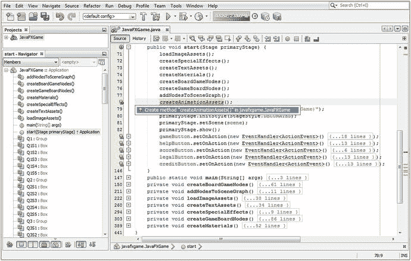

图 16-1。

Add a createAnimationAssets() method call at the end of the custom method call list in the start() method

```java
createAnimationAssets();

```

记得双击 javafxgame 中的创建方法“createAnimationAssets()”。JavaFXGame 选项，并让 NetBeans 为您编写一个引导方法。在本章的这一节中，您将使用 RotateTransition 对象实例化和配置代码替换占位符 Java 代码。

你需要做的第一件事是声明一个 RotateTransition 对象在类的顶部使用，并将其命名为 rotGameBoard，因为这是该对象将要做的事情。在你的内心。createAnimationAssets()方法，实例化 rotGameBoard 对象并配置为播放五秒；然后将其连接到游戏板组节点，如下面的 Java 9 代码所示，并在图 [16-2](#Fig2) 中用浅蓝色和黄色突出显示:

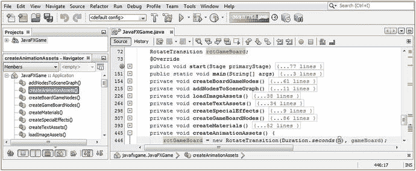

图 16-2。

Declare a rotGameBoard object at the top of your class and instantiate it inside createAnimationAssets()

```java
RotateTransition rotGameBoard;
...
private void createAnimationAssets() {
    rotGameBoard = new RotateTransition(Duration.seconds(5), gameBoard);
}

```

现在，您可以开始使用各种。set()方法调用，您在本章的前一节中已经了解了。使用设置 Y 旋转轴。setAxis(旋转。并使用. setCycleCount(1)方法调用将 cycleCount 属性设置为一个周期。使用. setRate(0.5)方法调用 rotGameBoard 对象，将 rate 属性设置为 50%的速度。核心动画对象设置的 Java 语句应该类似于下面的 Java 9 语句，它们在图 [16-3](#Fig3) 的底部突出显示:

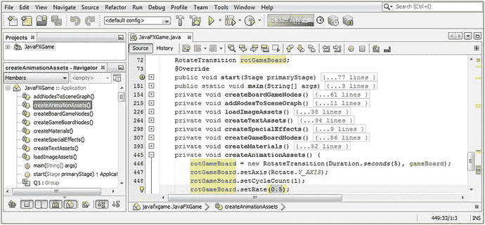

图 16-3。

Configure the rotGameBoard RotateTransition object with a y-axis, cycleCount of 1, and rate of 50 percent speed

```java
RotateTransition rotGameBoard;
...
private void createAnimationAssets() {
    rotGameBoard = new RotateTransition(Duration.seconds(5), gameBoard);
    rotGameBoard.setAxis(Rotate.Y_AXIS);
    rotGameBoard.setCycleCount(1);
    rotGameBoard.setRate(0.5);
}

```

你已经知道为什么我们用 y 轴旋转；然而，你可能想知道为什么我们只使用一个周期。原因是，一旦我们通过指定 fromAngle 和 toAngle 值使这个 RotateTransition 交互，这些值将在每个 rotGameBoard.play()方法调用之前使用来自随机旋转生成器的代码进行设置，我们将在后面编写代码，我们将使用这些角度之间的差异来控制旋转的次数(目前这是 1080 或三次旋转)；因此，我们仅使用一个循环。出于代码测试的目的，我使用了三次旋转。

速率设置 1 太快了，无法获得平滑的旋转动画，游戏板不应该旋转得那么快，所以我将这个默认值 1.0 减少了 50%到 0.5，以向您展示速率变量如何为您提供微调的速度控制。

接下来，让我们添加所需的插值器类常数规格，这将是默认的线性，因为我们需要一个平滑、均匀的旋转。这是使用。setInterpolator()方法调用和插值器。线性常数。最后，我们要添加两个最重要的配置语句，它们告诉 RotateTransition 引擎旋转的开始角度(fromAngle 属性)和结束角度(toAngle 属性)。使用这些将允许我们控制旋转在哪个象限开始(45、135、225 或 315)和结束。现在，我们将使用从 45 度角开始的三次完整旋转(1080 ),对于 toAngle 来说是 1125°。要开始(并测试)动画，您还需要一个. play()方法调用，如下面完整的 Java 方法体所示，并在图 [16-4](#Fig4) 的底部以黄色和浅蓝色突出显示:

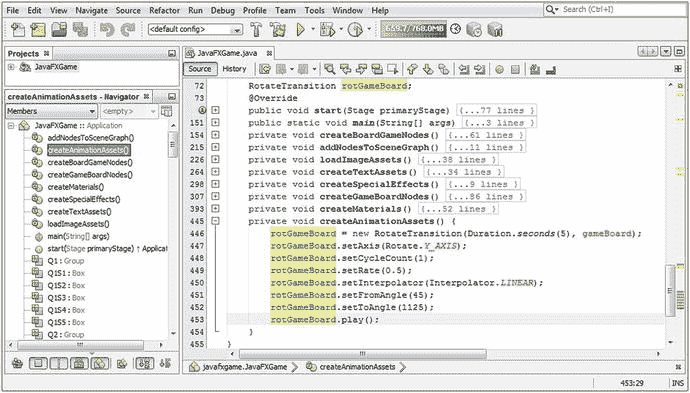

图 16-4。

Configure the rotGameBoard object with a LINEAR interpolator, a fromAngle of 45, and a toAngle of 1125

```java
RotateTransition rotGameBoard;
...
private void createAnimationAssets() {
    rotGameBoard = new RotateTransition(Duration.seconds(5), gameBoard);
    rotGameBoard.setAxis(Rotate.Y_AXIS);
    rotGameBoard.setCycleCount(1);
    rotGameBoard.setRate(0.5);
    rotGameBoard.setInterpolator(Interpolator.LINEAR);
    rotGameBoard.setFromAngle(45);
    rotGameBoard.setToAngle(1125);
    rotGameBoard.play();
}

```

图 [16-5](#Fig5) 显示了运行➤项目的工作过程，其中一个游戏板处于其旋转周期的中间。屏幕截图无法显示平滑的运动，但您可以知道游戏板不在其四个象限的“静止”位置之一(45、135、225、315 度)，因为游戏板的点不在屏幕底部的中心。在图 [16-5](#Fig5) 中，当 3D 游戏板组节点还在动画时，我按了一个 PrintScreen 键。

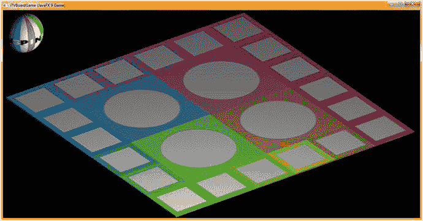

图 16-5。

Use your Run ➤ Project work process, click Start Game, and watch your gameboard spin around smoothly

同样重要的是要注意，当您测试您的动画代码时，您需要在应用启动时立即单击 Start Game 按钮 UI 元素(稍后，这将通过单击 3D spinner UI 元素来触发，您可能已经猜到了)。这是为了让您可以看到您的动画特性，这是我们在本章中开发的，因为目前您的 Java 9 代码在构造和配置动画(过渡子类)对象后立即开始播放生命周期。所以，点击你的开始游戏 2D 用户界面按钮，只要它出现！

稍后，当我们进入如何捕捉 3D 对象上的鼠标点击(或屏幕触摸)时，例如您的 spinner UI 元素，我们将通过单击 spinner UI 元素来触发 rotGameBoard.play()，以随机旋转游戏板来选择新的象限。当下一个玩家的回合准备好时，我们将触发 rotSpinner.play()，以便他们可以旋转游戏板。在本书的剩余部分，我们将开发这个动画代码的复杂性。

在本章的后面，我们将使用 TranslateTransition 和 RotateTransition，使用 ParallelTransition，这将允许我们将 3D spinner UI 元素在视图内外进行动画处理，以便玩家知道何时使用它来随机旋转游戏板，以选择一个新的象限(一个新的内容主题动物-植物-矿物或地标类别)用于游戏循环。

接下来，让我们添加 rotSpinner RotateTransition 对象。首先，通过在类顶部的 rotGameBoard 对象名称后添加 rotSpinner 对象名称，将 RotateTransition 声明转换为复合语句。剪切并粘贴 rotGameBoard 语句，将 rotGameBoard 更改为 rotSpinner，并确保将实例化的节点参数从 GameBoard 更改为 Spinner。从角度改变到 30 度(你在第 [15 章](15.html)中开发的初始值)和角度到 1110 度(1080 + 30)。您的 Java 9 代码应该看起来像下面的方法体，它也在图 [16-6](#Fig6) 的底部突出显示:

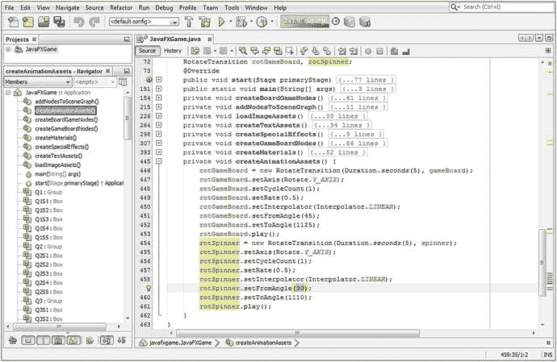

图 16-6。

Add a rotateSpinner RotateTransition object and configure it with the same parameters as rotGameBoard

```java
RotateTransition rotGameBoard, rotSpinner;
...
private void createAnimationAssets() {
    rotGameBoard = new RotateTransition(Duration.seconds(5), gameBoard);
    rotGameBoard.setAxis(Rotate.Y_AXIS);
    rotGameBoard.setCycleCount(1);
    rotGameBoard.setRate(0.5);
    rotGameBoard.setInterpolator(Interpolator.LINEAR);
    rotGameBoard.setFromAngle(45);
    rotGameBoard.setToAngle(1125);
    rotGameBoard.play();
    rotSpinner = new RotateTransition(Duration.seconds(5), spinner);
    rotSpinner.setAxis(Rotate.Y_AXIS);
    rotSpinner.setCycleCount(1);
    rotSpinner.setRate(0.5);
    rotSpinner.setInterpolator(Interpolator.LINEAR);
    rotSpinner.setFromAngle(30);
    rotSpinner.setToAngle(1110);
    rotSpinner.play();
}

```

使用运行➤项目工作流程查看游戏板和旋转器的旋转，如图 [16-7](#Fig7) 所示。

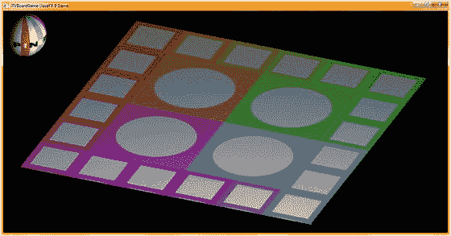

图 16-7。

Select Run ➤ Project and click Start Game to preview the game board and spinner rotation

正如你所看到的，唯一的问题是你的“SPIN”微调器是向后旋转的，我们希望单词 SPIN 向前旋转，所以我们需要通过将 fromAngle 设置为 30 和 toAngle 设置为-1050(1080 = 30-1050)来改变方向。这里显示了最终的 Java 代码块，在图 [16-8](#Fig8) 中用黄色和蓝色突出显示:

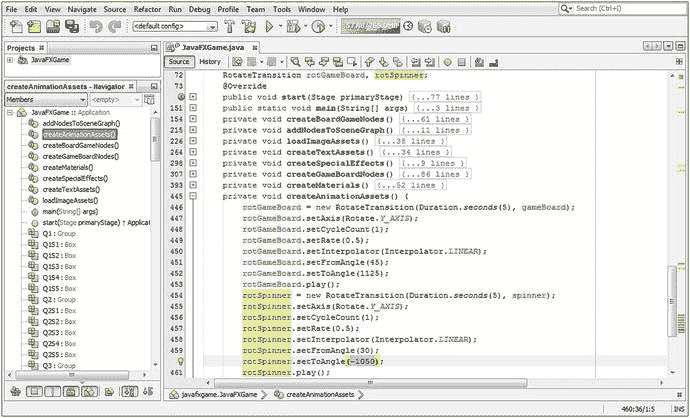

图 16-8。

Adjust the rotSpinner.setToAngle() method call to spin in a negative direction so the spinner UI spins forward

```java
RotateTransition rotGameBoard, rotSpinner;
...
private void createAnimationAssets() {
    rotGameBoard = new RotateTransition(Duration.seconds(5), gameBoard);
    rotGameBoard.setAxis(Rotate.Y_AXIS);
    rotGameBoard.setCycleCount(1);
    rotGameBoard.setRate(0.5);
    rotGameBoard.setInterpolator(Interpolator.LINEAR);
    rotGameBoard.setFromAngle(45);
    rotGameBoard.setToAngle(1125);
    rotGameBoard.play();
    rotSpinner = new RotateTransition(Duration.seconds(5), spinner);
    rotSpinner.setAxis(Rotate.Y_AXIS);
    rotSpinner.setCycleCount(1);
    rotSpinner.setRate(0.5);
    rotSpinner.setInterpolator(Interpolator.LINEAR);
    rotSpinner.setFromAngle(30);
    rotSpinner.setToAngle(-1050); // Reverse rotation direction using a negative toAngle value
    rotSpinner.play();
}

```

接下来，让我们看看平移过渡，它可用于在 3D 场景中以 X、Y 或 Z 维度移动对象。我们将使用它来将我们的 spinner UI 元素带到(离开)屏幕上，因为在游戏过程中需要它来允许玩家随机旋转游戏板来选择他们的新主题象限。

### 制作节点移动的动画:使用 TranslateTransition 类

public final TranslateTransition 类扩展了 public abstract Transition 超类，保存在 javafx.graphics 模块的 javafx.animation 包中。TranslateTransition 创建移动(平移)动画，其持续时间与其 duration 属性一样长。通过以插值器常数定义的间隔更新正在设置动画的节点的 translateX、translateY 和 translateZ 变量(属性)来创建运动。翻译将从“from”值(fromX，fromY，fromZ)开始，如果提供了一个；否则，算法将使用节点对象的当前位置(translateX，translateY，translateZ)值。翻译停止在“to”值(toX，toY，toZ)，如果提供的话；否则，它将使用起始值加上 byX、byY 或 byZ 值。如果同时指定了“到”(toX，toY，toZ)和“到”(byX，byY，byZ)值，则“到”值(toX，toY，toZ)优先。

```java
java.lang.Object
  > javafx.animation.Animation
    > javafx.animation.Transition
      > javafx.animation.TranslateTransition

```

TranslateTransition 类有 11 个属性，其中 9 个涉及到 X、Y 和 Z 3D 坐标的 to、from 和 by 规范。另外两个是持续时间属性和节点属性，它们定义动画的时间长度以及它影响的节点对象。byX 属性用于为 TranslateTransition 指定增量停止 X 坐标双精度值，该值从起始值计算得出。byY 属性用于为 TranslateTransition 指定从起始值计算的增量停止 Y 坐标双精度值。byZ 属性用于为 TranslateTransition 指定从起始值计算的增量停止 Z 坐标双精度值。fromX 属性用于指定 TranslateTransition 的起始 X 坐标双精度值。fromY 属性用于指定 TranslateTransition 的起始 Y 坐标双精度值。fromZ 属性用于指定 TranslateTransition 的起始 Z 坐标双精度值。toX 属性用于指定 TranslateTransition 的停止(静止或最终)X 坐标值。toY 属性用于指定 TranslateTransition 的停止(静止或最终)Y 坐标值。toZ 属性用于指定 TranslateTransition 对象的停止(静止或最终)Z 坐标值。

TranslateTransition 有三个重载的构造函数方法；一个为空，一个指定了持续时间，一个指定了持续时间和节点属性。它们看起来像这样:

```java
TranslateTransition()
TranslateTransition(Duration duration)
TranslateTransition(Duration duration, Node node)

```

这个类有将近 36 种方法，其中 27 种(9 组，每组 3 种)处理 from、to 和 by 属性。这是因为对于每个 X、Y 和 Z 属性，都有一个. get()、一个. set()和一个. property()方法。还有一些方法可用于持续时间、节点和插值器属性。所有的 X、Y 和 Z 方法都使用 double 值。A .byXProperty()方法用于将停止 X 坐标值指定为从 TranslateTransition 开始的增量偏移量。那个。byYProperty()方法用于将偏移增量停止 Y 坐标值指定为距 TranslateTransition 起点的偏移。那个。byZProperty()方法用于将增量停止点 X 坐标值指定为距 TranslateTransition 起点的偏移量。

那个。fromXProperty()方法调用用于指定 TranslateTransition 的起始 X 坐标值。

那个。fromYProperty()方法调用用于指定 TranslateTransition 的起始 Y 坐标值。

那个。fromZProperty()方法调用用于指定 TranslateTransition 的起始 Z 坐标值。

那个。getByX()方法调用用于获取 ByX 属性的值。那个。getByY()方法调用用于获取 ByY 属性的值。那个。getByZ()方法调用用于获取 ByZ 属性的值。

那个。getFromX()方法调用用于从 FromX 获取属性值。那个。getFromY()方法调用用于从 mY 获取属性值。那个。getFromZ()方法调用用于从 FromZ 获取属性值。那个。getToX()方法调用用于获取属性 ToX 的值。那个。getToY()方法调用用于获取 ToY 属性的值。那个。getToZ()方法调用用于获取属性 ToZ 的值。

虚空。setByX(double value)方法调用用于设置(指定)属性 ByX 的值。虚空。setByY(double value)方法调用用于设置(指定)属性值 ByY。虚空。setByZ(double value)方法调用用于设置(指定)ByZ 属性的值。虚空。setFromX(double value)方法调用用于设置(指定)属性 FromX 的值。虚空。setFromY(double value)方法调用用于设置(指定)属性 FromY 的值。虚空。setFromZ(double value)方法调用用于设置(指定)属性 FromZ 的值。

虚空。setToX(double value)方法调用用于设置(指定)属性 ToX 的值。虚空。setToY(double value)方法调用用于设置(指定)属性 ToY 的值。一片空白。setToZ(double value)方法调用用于设置(指定)属性 toX 的值。

那个。toXProperty()方法调用用于指定 TranslateTransition 对象的停止 X 坐标值。那个。toYProperty()方法调用用于指定 TranslateTransition 对象的停止 Y 坐标值。那个。toZProperty()方法调用用于指定 TranslateTransition 对象的停止 Z 坐标值。

那个。durationProperty()方法调用将返回 TranslateTransition 的当前持续时间属性。使用. getDuration()方法调用来获取 TranslateTransition duration 属性的持续时间值。虚空。setDuration(持续时间值)可用于设置(指定)Duration 属性的持续时间值。

那个。nodeProperty()方法调用将返回 TranslateTransition 的目标节点 node 属性。那个。getNode()方法调用将获取(读取)TranslateTransition 的节点属性的节点对象引用值。虚空。setNode(节点值)方法调用将为 TranslateTransition 节点属性设置节点值。虚空。插值(double frac)方法调用总是需要由 Transition 的子类提供。

接下来，让我们实现一个 TranslateTransition 动画对象，该对象将 spinner UI 元素移入和移出屏幕。这些动画对象最终将被命名为 moveSpinnerOn 和 moveSpinnerOff。之后，我们将进入 ParallelTransition 类，并结合移动和旋转来旋转屏幕上的 spinner UI 元素，从左角到右角。

### TranslateTransition 示例:设置平移动画资源

让我们将 TranslateTransition 动画对象添加到您的游戏项目中，方法是在类的顶部声明一个名为 moveSpinner 的对象，然后在 RotateTransition Java 代码之后，在 createAnimationAssets()方法中实例化它。引用微调器节点，并使用五秒钟的持续时间。接下来，使用以下 Java 语句，将 moveSpinnerOn 动画对象配置为在屏幕顶部移动 1150 X 个单位(实际上是 1350 个单位，因为微调器当前处于-200)，并将 cycleCount 属性设置为一个周期，在图 [16-9](#Fig9) 中以黄色突出显示:

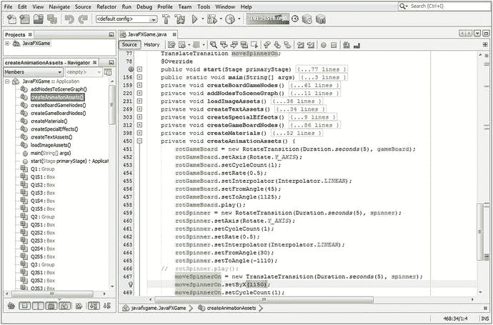

图 16-9。

Declare a moveSpinnerOn TranslateTransition at the top of the class and instantiate it in createAnimationAssets()

```java
TranslateTransition moveSpinnerOn;
...

moveSpinnerOn = new TranslateTransition(Duration.seconds(5), spinner);
moveSpinnerOn.setByX(1150);
moveSpinnerOn.setCycleCount(1);

```

接下来，让我们看一下 ParallelTransition 类，因为我们需要使用此对象算法来将 spinner rotSpinner 动画对象与 moveSpinnerOn 动画对象相结合，这样您的最终结果是一个在屏幕顶部移动的同时旋转的 spinner。

### 合并动画属性:使用 ParallelTransition 类

公共 final 类 ParallelTransition 扩展了抽象 Transition 超类，可以在 javafx.animation 包中找到，这个包可以在 javafx.graphics 模块中找到。该过渡并行播放一系列动画对象，这意味着同时(一个接一个被称为串行或顺序)。如果没有使用方法调用(通常是构造函数方法)显式指定 Node 属性，则此转换的子级将继承 Node node 属性。其原因是 ParallelTransition 只是将现有的动画对象合并在一起，因此在合并的动画中可能已经指定了一个节点。ParallelTransition 的 Java 类层次结构如下所示:

```java
java.lang.Object
  > javafx.animation.Animation
    > javafx.animation.Transition
      > javafx.animation.ParallelTransition

```

ParallelTransition 类只有一个本地属性，即 ObjectProperty <node>节点属性，它是组合动画将应用到的节点对象。如果未指定节点，将使用子动画对象节点属性。如果指定了一个节点，则该节点将被设置(即指定)给所有本身没有定义任何目标节点属性的子转换。</node>

ParallelTransition 类包含四个重载的构造函数方法。第一个创建一个空对象，第二个指定子动画对象的列表，第三个指定要受影响的节点，第四个指定要受影响的节点对象和子动画对象的列表。第二个和第四个构造函数方法是最常用的。我们将为我们的子动画对象使用第二个构造函数；两个引用的动画过渡对象都将微调器节点对象指定为 ParallelAnimation 对象的目标。这些构造函数方法的 Java 代码如下所示:

```java
parallelTransition = new ParallelTransition();
parallelTransition = new ParallelTransition(Animation... children);
parallelTransition = new ParallelTransition(Node node);
parallelTransition = new ParallelTransition(Node node, Animation... children);

```

ParallelTransition 类只有大约六个方法调用，您需要掌握它们。那个。getChildren()方法调用将返回动画对象的 ObservableList <animation>,这些对象将作为单个统一的动画一起播放。</animation>

那个。getNode()方法调用可以用来获取(poll)Node 属性的 Node 对象值，以及 void。setNode(Node value)方法调用可用于设置(指定)Node 属性的 Node 对象值。

还有一个受保护的节点。getParentTargetNode()方法调用，该调用将返回没有指定节点属性的过渡的子动画对象的目标节点。要指定父目标节点属性，必须使用第四个构造函数方法，该方法为 ParallelTransition(父节点)指定节点属性。否则，将使用第二个构造函数方法，子动画对象的 node 属性将定义动画对象将影响哪个节点对象。

并行转换。nodeProperty()方法调用将返回您的 parallel transition(parent)object property<node>值，该值将使用第三个或第四个构造函数方法或。setNode(节点)。如果指定(设置)了此节点，它将用于所有未明确定义其目标节点的子转换。</node>

最后，受保护的空间。interpolate(double value)方法调用需要由抽象 Transition 超类的所有子类实现提供。

接下来，让我们设置一个 ParallelTransition 对象，它将 rotSpinner 和 moveSpinnerOn 动画对象无缝地结合在一起。

### ParallelTransition 对象:合并 rotSpinner 和 moveSpinnerOn

让我们通过在类的顶部声明一个名为 spinnerAnim 的 ParallelTransition 动画对象来将它添加到游戏项目中，然后在 RotateTransition 和 TranslateTransition Java 代码之后，在 createAnimationAssets()方法中实例化它。在构造函数方法中，引用 moveSpinnerOn 和 rotSpinner 动画子对象，然后调用。spinnerAnim 对象的 play()方法。请注意，我已经注释掉了 rotSpinner.play()方法调用，并且没有向 moveSpinnerOn 动画对象添加. play()方法调用，因为这是在 spinnerAnim ParallelTransition 对象中完成的。该并行(混合)动画的设置将使用以下 Java 语句完成，这些语句在图 [16-10](#Fig10) 中也用黄色和蓝色突出显示:

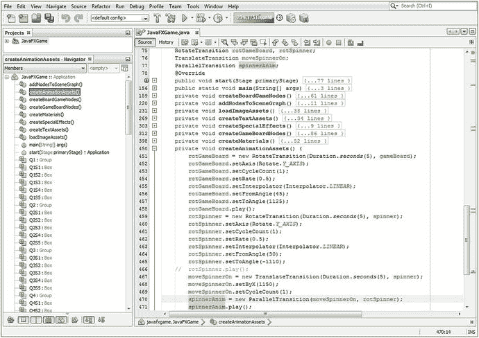

图 16-10。

Declare a spinnerAnim ParallelTransition at the top of the class and instantiate it in createAnimationAssets()

```java
ParallelTransition spinnerAnin;
...

spinnerAnin = new ParallelTransition(moveSpinnerOn, rotSpinner);
spinnerAnim.play();

```

当您选择运行➤项目时，一个旋转器从游戏的左侧旋转到右侧，如图 [16-11](#Fig11) 所示。

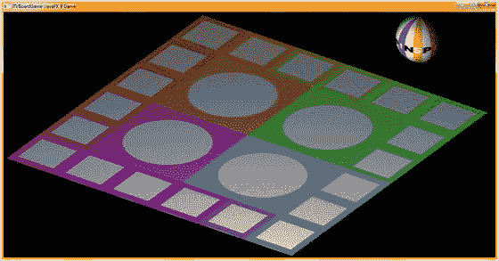

图 16-11。

Select Run ➤ Project, click Start Game, and watch the spinner animate

在下一章之后，当我们讨论 3D 场景事件处理以及 PickResult 类时，我们可以开始完成 spinner UI 元素的动画，以便它在需要时出现在屏幕上，当用户不再需要旋转游戏板时离开屏幕。

我想专门用一章来介绍动画对象，向您展示预编码的 Transition 子类如何为您提供 Java 9 代码来将动画添加到您的游戏中，并向您展示如何设置大多数动画对象及其代码。我还想向您展示如何放置 createAnimationAssets()方法，以便您可以添加动画对象，从现在开始，这些对象将在您的 pro Java 9 游戏开发中拥有自己的位置。

## 摘要

在第十六章中，我们学习了动画超类和过渡超类，以及一些重要的过渡子类，RotateTransition 和 TranslationTransition，它们允许我们在游戏中移动和旋转 3D 对象。我们还看了 ParallelTransition 子类，它允许我们组合这些动画对象来创建更复杂的动画对象。我们还为我们的游戏构造了动画对象，这将允许用户对游戏板应用随机旋转来选择主题象限，并在随机旋转游戏板时将旋转的 spinner UI 元素移进移出屏幕。

我们为 JavaFXGame 类创建了一个名为 createAnimationAssets()的新自定义方法，该方法将保存为 pro Java 9 游戏设计创建的所有动画对象，这些动画对象使用 Transition 子类，如 RotateTransition、TranslateTransition、ScaleTransition 和 ParallelTransition。

在第 [17](17.html) 章中，我们将学习 3D 场景元素的鼠标事件处理，这样我们可以点击球体 3D 旋转器 UI 来旋转游戏板，这样我们最终可以点击每个游戏板方块来选择教育问题类别并提出问题供玩家回答。