# 十七、i3D 游戏方块选择：对 3D 模型使用`PickResult`类

现在，您已经创建了多层游戏板组节点(子类)层次，对该层次下的所有 3D 组件进行了纹理处理，确保该层次中心旋转，创建了一个旋转器 UI 来将游戏板 3D 模型(层次)随机旋转到一个随机象限，并使用您的`createAnimationAssets()`方法将动画对象添加到您的游戏设计中，是时候让您的 3D 游戏元素具有交互性了。我们将设置您的 3D 对象鼠标单击事件处理代码，该代码将用于触发 3D 旋转器动画和选择游戏棋盘方块。

在本章中，我们将详细了解公共 PickResult 类和公共 MouseEvent 类，并在自定义 createSceneProcessing()方法中使用它们来设计我们自己的游戏，该方法将用于处理 i3D 游戏元素(盒子和球体对象)事件处理，以便我们的玩家可以与 3D 游戏组件进行交互。

## 选择您的 3D 资源:PickResult 类

公共类 PickResult 扩展 Object 并保存在 javafx.scene.input 包中，该包包含输入事件处理实用程序，如 clipboard、GestureEvent、SwipeEvent、TouchEvent 和 ZoomEvent。PickResult 对象包含一个 pick 事件的结果，在这个游戏中，来自鼠标或触摸。支持在其构造函数方法中使用 PickResult 对象的输入类包括 MouseEvent、MouseDragEvent、DragEvent、GestureEvent、ContextMenuEvent 和 TouchPoint。每个类中都有一个. getPickResult()方法调用，它返回 PickResult 对象，该对象包含 Java 游戏开发过程中需要处理的所有选择信息。

PickResult 类的 Java 类层次结构向我们展示了该类是临时编码的，以提供 3D 对象选择功能；它没有自己的超类，因此看起来像下面的 Java 9 类层次结构:

```java
java.lang.Object
  > javafx.scene.input.PickResult

```

PickResult 类包含一个数据字段，静态 int FACE_UNDEFINED 数据字段，它表示一个未定义的面。我们通常会使用这个类来选择整个节点(旋转器、象限 q1 到 q4、正方形 Q1S1 到 Q4S5 以及类似的 3D 游戏元素)，而不是单个的多边形面或纹理贴图像素，这也是可能的。

PickResult 类中的前两个构造函数方法创建处理 2D 和 2.5D 场景拾取场景结果的 PickResult 对象。第一个构造函数使用 EventTarget 对象和(double) sceneX 和 sceneY 属性为 2D 场景创建 PickResult 对象。此构造函数方法使用以下 Java 语句语法:

```java
PickResult(EventTarget target, double sceneX, double sceneY);

```

第二个构造函数为“非 Shape3D”目标创建一个 PickResult 对象。由于它使用 Point3D 对象和距离，我称之为 2.5D PickResult 场景，因为它不支持基于 Shape3D 类的 3D 图元。但是，它支持 Point3D 对象和场景对象的距离概念。此构造函数方法使用以下 Java 语句语法:

```java
PickResult(Node node, Point3D point, double distance)

```

第三个构造函数为 Shape3D 目标创建一个 PickResult 对象，这是我们用来创建 i3D 游戏的对象。创建此构造函数方法的 Java 语法应该类似于下面的 Java 语句:

```java
PickResult(Node node, Point3D point, double dist, int face, Point2D texCoord);

```

第四个构造函数为包含法线的导入的 3D 对象目标创建 PickResult 对象。如果您从外部 3D 建模软件包(如 Blender)导入高级 3D 模型，将会用到这一点。创建这个高级构造函数方法的 Java 语法应该类似于下面的 Java 语句:

```java
PickResult(Node node, Point3D point, double distance, int face, Point3D normal, Point2D texCoor)

```

PickResult 类支持六个。get()方法调用，返回相交距离、相交面、相交节点、相交法线、相交点或相交纹理坐标(texCoord)。getIntersectedDistance()方法调用将以双精度值的形式返回当前摄像机位置和交叉点之间的相交距离。

那个。getIntersectedFace()方法调用将返回一个整数，表示所选节点的相交面。如果节点没有用户指定的面，如 Shape3D 图元之一，或者在边界上拾取，此方法将返回 FACE_UNDEFINED 常量。getIntersectedNode()方法调用将返回一个相交的节点作为节点对象，并且是我们将用来选择微调 UI 和游戏板节点元素的方法调用。

那个。getIntersectedNormal()方法调用将返回拾取的 Shape3D 对象或导入的 3D 几何图形的相交法线。那个。getIntersectedPoint()方法调用将使用拾取的节点对象的本地坐标系返回相交点(Point3D 对象)。那个。getIntersectedTexCoord()方法调用将以 Point2D 对象格式返回拾取的 3D 形状的相交纹理坐标。

接下来，让我们看看另一个重要的事件处理类 MouseEvent。这是 InputEvent 的子类，用于将鼠标事件处理附加到我们用来创建 i3D 棋盘游戏模拟的 3D 图元上。

### MouseEvent 类:捕捉 3D 图元上的鼠标单击

公共 MouseEvent 类扩展了 InputEvent 超类。MouseEvent 与其子类 MouseDragEvent 和其他 InputEvent 超类子类一起保存在 javafx.scene.input 包中。MouseEvent 实现了可序列化和可克隆的 Java 接口。这个类用于实现或“捕获”鼠标事件，以供 Java 游戏逻辑处理，你将在本章中学习如何操作。当鼠标事件(如单击)发生时，光标下的第一个(顶部或前部)节点对象被“选取”，mouse event 被传递到该节点对象事件处理结构。通过使用 javafx.event 包中存储的公共 EventDispatcher Java 接口描述的捕获和冒泡阶段来传递事件。因此，MouseEvent 类的 Java 层次结构应该如下所示:

```java
java.lang.Object
  > java.util.EventObject
    > javafx.event.Event

      > javafx.scene.input.InputEvent

        > javafx.scene.input.MouseEvent

```

鼠标指针(光标)位置在几种不同的坐标系中可用。可以使用相对于 MouseEvent 的 Node 对象原点(以及相对于场景对象)的 X，Y 坐标，使用相对于包含节点的场景原点的 sceneX，sceneY 坐标，甚至使用相对于包含鼠标指针的显示屏原点的 screenX，screenY 坐标。在这个特殊的 i3D BoardGame 项目中，我们将比较被点击的节点和我们的游戏处理逻辑。

有许多特定于 MouseEvent 对象的事件字段。它们是静态的，使用大写字母，因为它们是由 InputEvent 的 MouseEvent 类型提供的不同类型事件的“硬编码”常量。任何静态事件类型<mouseevent>被用作一个公共的“超类型”来表示任何鼠标事件类型。</mouseevent>

DRAG_DETECTED 静态事件类型<mouseevent>将被传递给被识别为拖动手势的源的任何节点对象。当鼠标按钮被点击(在同一个节点上按下并释放)时，将传递一个 MOUSE_CLICKED 静态事件类型<mouseevent>。这是我们将用于我们的 i3D 棋盘游戏。您还可以捕获鼠标被按下和鼠标被释放的事件。当鼠标按钮被按下时，会产生一个 MOUSE_PRESSED 静态事件类型<mouseevent>，当鼠标按钮被释放时，会产生一个 MOUSE_RELEASED 静态事件类型<mouseevent>。</mouseevent></mouseevent></mouseevent></mouseevent>

您还可以在鼠标移动到一个节点上，然后又离开该节点而没有任何鼠标点击发生时处理事件！当鼠标进入一个节点对象但没有被点击(这称为悬停)时，将会传递一个 MOUSE _ ENTERED 静态事件类型<mouseevent>。当鼠标第一次进入节点(越过其边缘边界)时，将传递一个 MOUSE _ ENTERED _ TARGET 静态事件类型< MouseEvent >。类似地，当鼠标退出一个节点对象时，一个鼠标退出的静态事件类型<鼠标事件>将被传递。当鼠标第一次退出节点对象(越过边界)时，将会传递 MOUSE_EXITED_TARGET 静态事件类型< MouseEvent >。</mouseevent>

最后，当鼠标在没有按钮被按下或释放的情况下在节点对象中移动时，将会传递 MOUSE_MOVED 静态事件类型<mouseevent>。当使用按下(按住)的鼠标按钮移动鼠标时(称为拖动操作)，将传递 MOUSE _ DRAGGED 静态事件类型<mouseevent>。</mouseevent>T3】</mouseevent>

我们不会专门构造(实例化)MouseEvent 对象。我们会用。setOnMouseClick()事件处理构造，作为其功能的一部分，它将为我们进行构造。然而，为了完整起见，我将在这里包含这两个重载的构造函数方法。第一个构造了一个新的 MouseEvent 事件对象，具有空的源和目标，看起来像下面的 Java 9 构造函数方法语法:

```java
MouseEvent(EventType<? extends MouseEvent> eventType, double x, double y, double screenX, double
           screenY, MouseButton button, int clickCount, boolean shiftDown, boolean controlDown,
           boolean altDown, boolean metaDown, boolean primaryButtonDown, boolean
           middleButtonDown, boolean secondaryButtonDown, boolean synthesized, boolean
           popupTrigger, boolean stillSincePress, PickResult pickResult)

```

第二个构造了一个新的 MouseEvent 事件对象，类似于下面的 Java 语法:

```java
MouseEvent(Object source, EventTarget target, EventType<? extends MouseEvent> eventType, double
           x, double y, double screenX, double screenY, MouseButton button, int clickCount,
           boolean shiftDown, boolean controlDown, boolean altDown, boolean metaDown, boolean
           primaryButtonDown, boolean middleButtonDown, boolean secondaryButtonDown, boolean
           synthesized, boolean popupTrigger, boolean stillSincePress, PickResult pickResult)

```

MouseEvent 类中有 27 个方法可以帮助您控制鼠标事件的处理。的。copyFor(Object newSource，Event target new target)mouse Event 方法调用将复制事件对象，以便它可以用于不同的源和目标。

那个。copyFor(Object newSource，EventTarget newTarget，Event type extends MouseEvent>Event type)MouseEvent 方法调用还将创建给定事件对象的副本，并用给定的 mouse Event 字段进行替换。

静态 MouseDragEvent。copyForMouseDragEvent(MouseEvent e，Object source，EventTarget target，EventType <mousedragevent>type，Object gestureSource，PickResult pickResult)方法调用将创建 MouseDragEvent 类型的 mouse event 的副本。</mousedragevent>

那个。getButton()方法调用将轮询 MouseEvent 对象，以查看哪个鼠标按钮(如果有)负责生成该事件对象。那个。getClickCount()方法调用将返回与事件对象关联的整数(int)鼠标单击次数。

那个。getEventType()方法调用将返回该事件对象的 EventType extends MouseEvent>事件类型。那个。getPickResult()方法调用将返回 PickResult 对象关于该选择的信息。

那个。getSceneX()方法调用将返回事件相对于包含 MouseEvent 源的场景原点的水平位置的 double 值。那个。getSceneY()方法调用将返回事件相对于包含 MouseEvent 源的场景原点的垂直位置的 double 值。

那个。getScreenX()方法调用将返回事件绝对水平位置的 double 值。那个。getScreenY()方法调用将返回事件绝对垂直位置的 double 值。

那个。getX()方法调用将返回事件相对于 MouseEvent 源原点的水平位置的 double 值。那个。getY()方法调用将返回事件相对于 MouseEvent 源原点的垂直位置的 double 值。那个。getZ()方法调用将返回事件深度位置的 double 值，该值相对于 MouseEvent 源的原点。

那个。isAltDown()方法调用可用于确定在此事件中 Alt 修饰键是否被按住。它返回一个真或假(布尔值)。那个。isControlDown()方法调用可用于确定在此事件期间 Ctrl 修饰键是否被按住。它还返回真或假(布尔值)。那个。isMetaDown()方法调用可用于确定元修饰键在此事件中是否被按住。它还返回真或假(布尔值)。那个。isShiftDown()方法调用可用于确定在此事件中 SHIFT 修饰键是否被按住。它还返回真或假(布尔值)。

那个。应使用 isDragDetect()方法调用来确定此 MouseEvent 之后是否会有 DRAG_DETECTED 事件，并返回布尔值 true(检测到拖动)或 false(未检测到拖动)。

安。isMiddleButtonDown()方法调用可用于确定鼠标中键是否被按住。如果您的中间按钮(鼠标键#2)当前被按下，它将返回一个真布尔值。

那个。应该使用 isPopupTrigger()方法调用来确定该事件是否是平台的弹出菜单触发事件。如果鼠标事件实际上是平台的弹出菜单触发事件，它将返回 true。

那个。如果您的主鼠标按钮(按钮#1，通常是鼠标左键)当前被按下，isPrimaryButtonDown()方法调用将返回真布尔值。那个。如果您的辅助按钮(按钮#2，通常是鼠标右键)当前被按下，isSecondaryButtonDown()方法调用将返回真布尔值。

那个。isShortcutDown()方法调用将返回在此 MouseEvent 期间主机平台的公共快捷方式修饰符是否被按住。

那个。isStillSincePress()方法调用使用一个布尔值来指示自从在此事件之前发生的最后一次鼠标按下事件以来，鼠标光标是否停留在系统提供的滞后区域中。

那个。isSynthesized()方法调用返回一个布尔值，该值指示 MouseEvent 是否是使用触摸屏设备而不是通常的鼠标事件源设备(如鼠标、跟踪球、跟踪板或类似的鼠标模拟硬件设备)合成的。

最后，一片虚空。setDragDetect(boolean dragDetect)方法调用用于在使用鼠标、跟踪板或触摸屏设备将 MouseEvent 处理与拖动检测结合使用时增强拖动检测行为。

### 实现微调用户界面功能:鼠标事件处理

让我们创建一个 createSceneProcessing()方法来保存场景对象的创建、配置和事件处理 Java 代码。必须在创建根组节点对象之后创建场景场景对象，因此必须在创建这些节点对象的 createBoardGameNodes()方法调用之后调用该方法。这是使用下面的 Java 语句完成的，在图 [17-1](#Fig1) 中也用浅蓝色(和红色波浪下划线)突出显示:

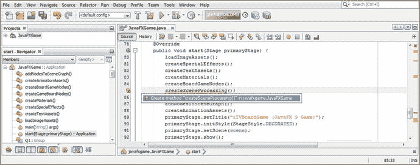

图 17-1。

Add the createSceneProcessing() method call, after the createBoardGameNodes() method in the start method

```java
createSceneProcessing();

```

记得双击 javafxgame 中的创建方法“createSceneProcessing()”。JavaFXGame 选项，让 NetBeans 9 为您编写一个引导方法。您将使用场景对象实例化和配置代码替换占位符 Java 代码，然后添加 MouseEvent 处理逻辑。

你需要做的第一件事是打开你的 createBoardGameNodes()方法，选择所有的场景场景对象实例化和配置 Java 9 代码，目前有三个 Java 9 语句；然后右键单击选择集并选择 Cut 选项，从该方法体中删除 Java 代码。

在你的内心。createSceneProcessing()方法，通过选择那一行代码并右键单击它来替换您的引导代码(未实现的错误代码)；选择“粘贴”来替换您从 createBoardGameNodes()方法中“剪切”的三行代码。最后，在方法的末尾添加一行代码，开始构建您的场景对象的事件处理；键入 scene，然后键入句点，再键入 setOnMouse，这将弹出一个包含所有 MouseEvent 事件的帮助器对话框。以下是现有语句的 Java 代码和一个空的事件处理 lambda 表达式基础结构(用于更改)，如图 [17-2](#Fig2) 中用蓝色突出显示的:

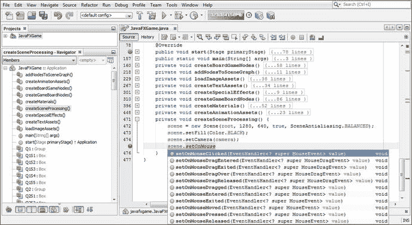

图 17-2。

Cut and paste the Scene object code into the new method and call .setOnMouseClicked() off the scene object

```java
private void createSceneProcessing() {
    scene = new Scene(root, 1280, 640, true, SceneAntialiasing.BALANCED);
    scene.setFill(Color.BLACK);
    scene.setCamera(camera);
    scene.setOnMouseClicked(event-> { ... } );  // This is an Empty OnMouseClicked Event Handler
}                                              //  Structure is using a Lambda Expression Format

```

双击您的 setOnMouseClicked(EventHandler super MouseEvent>value)(void)选项，在图 [17-2](#Fig2) 中用亮蓝色显示，并在。setOnMouseClicked()方法调用参数区域来创建空的事件处理基础结构，这将在 NetBeans 9 中产生零错误。正如我以前在本书中说过的，当你写代码时，要确保它在你的 IDE 中始终没有错误！

现在您可以开始配置 onMouseClicked()事件处理，正如您所看到的，它使用了 Java 8 中引入的简化的 lambda 表达式。lambda(简称 lambda)需要的只是事件名称和一个箭头，Java 编译器会计算出使用哪种类型的事件处理对象(EventHandler)以及需要处理哪种类型的事件对象(MouseEvent)。您的逻辑放在花括号内，您可以专注于事件处理逻辑要做的事情，即声明一个名为 picked 的节点对象并用. getPickResult()的结果加载它。getIntersectedNode()方法链。确保在 Java 语句的`Node picked`(初始)部分下出现红色波浪错误下划线时使用 Alt+Enter，并从弹出的帮助器对话框中选择“import javafx.scene.Node”选项，以指示 NetBeans 9 为您编写节点类导入语句。如果你愿意，你可以输入等号(=)和事件，然后点击句号；NetBeans 弹出帮助程序将允许您选择。getPickResult()方法。双击它将其插入，然后再次使用句点来显示弹出帮助程序。这次选择。getIntersectedNode()方法调用。添加分号以结束 Java 语句。用于鼠标事件处理的 Java 语句应该如下所示，并显示在图 [17-3](#Fig3) 的底部:

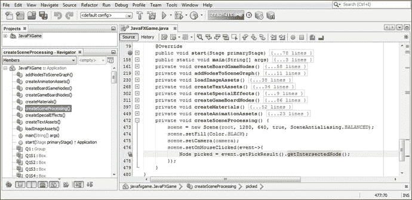

图 17-3。

Configure event handling as a lambda expression, create a Node named picked, and get an intersected Node

```java
private void createSceneProcessing() {
    scene = new Scene(root, 1280, 640, true, SceneAntialiasing.BALANCED);
    scene.setFill(Color.BLACK);
    scene.setCamera(camera);
    scene.setOnMouseClicked(event->{
        Node picked = event.getPickResult().getIntersectedNode();

    });
}

```

现在，您已经创建并加载了一个名为 picked 的节点对象，它与用户用鼠标(或触摸屏，也生成鼠标事件)点击的 BoardGame 中的节点对象一起使用，我们需要添加条件处理逻辑(人工智能)来告诉游戏如何操作。您需要做的第一件事是过滤掉所有不在 3D 节点对象上的单击，这是通过使用`if` `(` `picked != null` `)`构造来完成的，它表示如果拾取的节点对象不为空，则继续。下一个嵌套的 if()语句查找与拾取的节点对象相同(==或等效)的微调器节点对象。如果这等于一个真值，rotGameBoard 动画对象将通过使用。play()方法调用，旋转游戏板组节点。如果您使用“运行➤项目”工作流程并测试这段代码，它可以完美地工作，尽管您必须等到最后一章的代码完成(我们将在接下来修复它，因为我们将动画对象更改为鼠标事件触发)。

整个完整的 Java 9 结构只有八行代码；这将随着我们构建游戏逻辑而增长。此处显示了完整的 Java 方法体代码，并在图 [17-4](#Fig4) 中以黄色和蓝色突出显示:

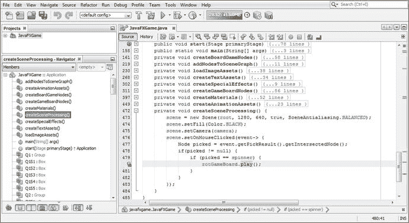

图 17-4。

Evaluate the picked Node object using two nested if{} constructs, testing for null and then for the spinner UI Node

```java
private void createSceneProcessing() {
    scene = new Scene(root, 1280, 640, true, SceneAntialiasing.BALANCED);
    scene.setFill(Color.BLACK);
    scene.setCamera(camera);
    scene.setOnMouseClicked(event->{
        Node picked = event.getPickResult().getIntersectedNode();
        if (picked != null) {
            if (picked == spinner) {
                rotGameBoard.play();

            }
        }
    });
}

```

要使微调器 UI 在屏幕上呈现动画效果，我们首先必须将它在屏幕外的初始位置设置在其当前起始位置的左侧。进入 createBoardGameNodes()并将 TranslateX 属性从-200 更改为-350。这将从视图中移除微调器，就在屏幕的左侧。稍后我们将更改。将 moveSpinnerIn 中的 setByX()方法设置为 150，因此它位于-200。这是使用此处和图 [17-5](#Fig5) 中所示的 Java 代码完成的:

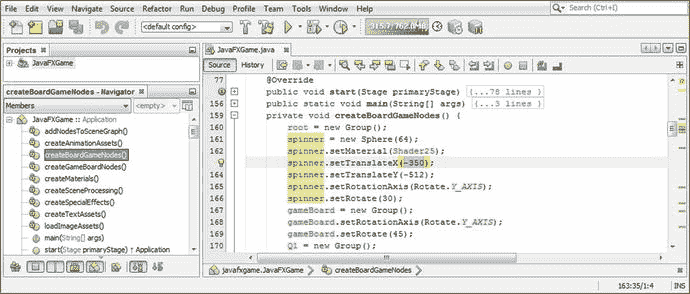

图 17-5。

Prepare for implementing the interactive spinner UI by setting its initial position off-screen value to the -350 X location

```java
spinner.setTranslateX(-350);

```

注意 TranslateY 是-512；这将 3D 旋转器 UI 放置在屏幕的顶部，不在游戏棋盘视图的范围内，并且在旋转器动画显示到-150 X 位置时位于屏幕的左上角。

接下来，让我们重新编码我们的 createAnimationAssets()方法体，以便它只实例化和配置我们的动画对象，而不触发它们，这将在游戏过程中由用户通过鼠标点击(或屏幕触摸，因为这些也将生成鼠标事件，扩大我们的目标消费电子设备)来完成。

移除。play()方法调用 rotGameBoard、rotSpinner 和 spinnerAnim 动画对象构造，然后更改 movespinner on translate transition 对象的。setByX()方法调用引用 150 个单位。这将把你的 3D 旋转器 UI 从屏幕外的新-350 位置移动到屏幕的左上角。触发这个动画的逻辑位置，第一次将旋转器带到屏幕上，应该是在开始游戏按钮 UI 事件处理方法中，我们很快就会这样做。我们还将在本章稍后创建 rotSpinner 动画对象，它将在被单击时旋转 3D spinner UI，以便当玩家启动 3D 游戏板的每个随机旋转时它也旋转。

除了在“开始游戏”按钮事件处理中将这个 i3D 旋转器显示在屏幕上之外，我们还将在每个玩家的回合结束时将它显示在屏幕上(在第 [21](21.html) 章)，以便下一个玩家知道随机旋转游戏板来选择新的教育问题类别(象限)。我们将在第 [20 章](20.html)中制作它的离线动画，当游戏板完成它的相机旋转动画对象时。关于如何在 JavaFX 中将您的交互性(事件处理)与您的不同动画对象相集成，以便您可以获得无缝且响应迅速的游戏效果，这一章中还有很多内容需要学习。

您的新 createAnimationAssets() Java 方法体现在应该如下所示，在图 [17-6](#Fig6) 中也用浅蓝色和黄色突出显示:

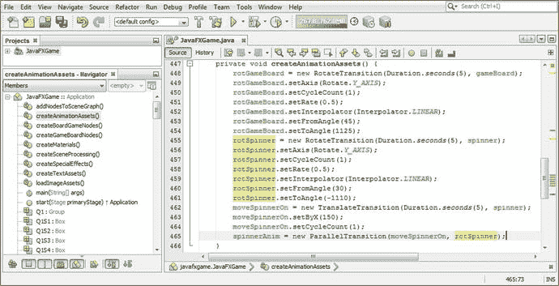

图 17-6。

Remove all .play() method calls and change the .setByX() method call to 150 to bring the spinner on-screen

```java
RotateTransition rotGameBoard, rotSpinner;
TranslateTransition moveSpinnerOn;
ParallelTransition spinnerAnim;
...
private void createAnimationAssets() {
    rotGameBoard = new RotateTransition(Duration.seconds(5), gameBoard);
    rotGameBoard.setAxis(Rotate.Y_AXIS);
    rotGameBoard.setCycleCount(1);
    rotGameBoard.setRate(0.5);
    rotGameBoard.setInterpolator(Interpolator.LINEAR);
    rotGameBoard.setFromAngle(45);
    rotGameBoard.setToAngle(1125);
                                                                      // .play() removed

    rotSpinner = new RotateTransition(Duration.seconds(5), spinner);
    rotSpinner.setAxis(Rotate.Y_AXIS);
    rotSpinner.setCycleCount(1);
    rotSpinner.setRate(0.5);
    rotSpinner.setInterpolator(Interpolator.LINEAR);
    rotSpinner.setFromAngle(30);
    rotSpinner.setToAngle(-1110);                                     // .play() removed

    moveSpinnerOn = new TranslateTransition(Duration.seconds(5), spinner);
    moveSpinnerOn.setByX(150);
    moveSpinnerOn.setCycleCount(1);
    spinnerAnim = new ParallelTransition(moveSpinnerOn, rotSpinner);
                                                                      // .play() removed

}

```

在 gameButton 事件处理程序的末尾添加一条`spinnerAnim.play();`语句，如图 [17-7](#Fig7) 所示。

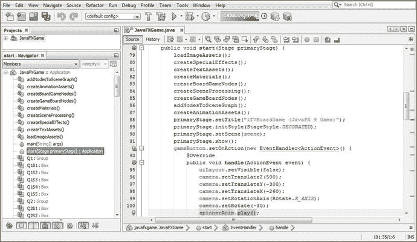

图 17-7。

Add the spinnerAnim.play() method call to the end of your gameButton event-handling method construct

现在使用您的运行➤项目工作流程来测试您的代码，您可以看到微调器在游戏开始时没有显示(在您单击隐藏 uiLayout StackPane 节点对象的按钮之后),并且缓慢而平稳地旋转到游戏屏幕左上角的视图中。

下一件事，我们需要做的是创建一个单独的 rotSpinner 动画对象，以便我们可以在游戏板旋转的同时进行 3D spinner UI 旋转，以保持连续性。您会发现，如果在 MouseEvent 处理构造中调用 rotSpinner.play，将会得到一个错误，因为 rotSpinner 是 spinnerAnim ParallelAnimation 对象的一部分；因此，我们需要复制一个 rotSpinner 构造，并创建一个 rotSpinnerIn 构造以在 spinnerAnim ParallelAnimation 中使用，让 rotSpinner 动画在玩家随机旋转游戏板时免费供我们调用。

为此，选择所有与 rotSpinner 相关的 Java 代码，右键单击选择集，然后选择 Copy 然后在这个代码块之后添加一行(空格)代码，右键单击，并选择 Paste 复制这个代码块。然后，您所要做的就是在“rotSpinner”的末尾添加“In ”,并创建一个 rotSpinnerIn 代码块，它做同样的事情，但不是 ParallelTransition 构造的组件。在 spinnerAnim ParallelTransition 对象的对象实例化(构造函数方法)中引用新的 rotSpinnerIn 动画对象。

正如你所看到的，唯一的问题是你的“旋转”旋钮旋转到了错误的 1110 度角，正如我们在第 [16](16.html) 章中编码的那样。在下一节中，我将把它设置为-1050。代码如下所示，如图 [17-8](#Fig8) 所示:

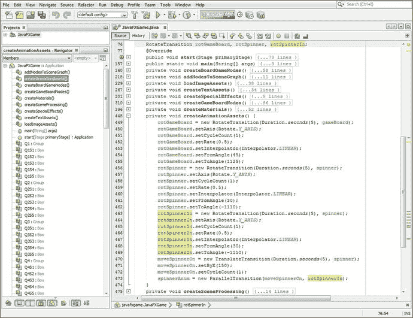

图 17-8。

Copy and paste the rotSpinner object code under itself to create a rotSpinnerIn, and reference in spinnerAnim

```java
RotateTransition rotGameBoard, rotSpinner;
TranslateTransition moveSpinnerOn;
ParallelTransition spinnerAnim;
...
private void createAnimationAssets() {
    rotGameBoard = new RotateTransition(Duration.seconds(5), gameBoard);
    rotGameBoard.setAxis(Rotate.Y_AXIS);
    rotGameBoard.setCycleCount(1);
    rotGameBoard.setRate(0.5);
    rotGameBoard.setInterpolator(Interpolator.LINEAR);
    rotGameBoard.setFromAngle(45);
    rotGameBoard.setToAngle(1125);
    rotSpinner = new RotateTransition(Duration.seconds(5), spinner);
    rotSpinner.setAxis(Rotate.Y_AXIS);
    rotSpinner.setCycleCount(1);
    rotSpinner.setRate(0.5); 

    rotSpinner.setInterpolator(Interpolator.LINEAR);
    rotSpinner.setFromAngle(30);
    rotSpinner.setToAngle(-1110);
    rotSpinnerIn = new RotateTransition(Duration.seconds(5), spinner);
    rotSpinnerIn.setAxis(Rotate.Y_AXIS);
    rotSpinnerIn.setCycleCount(1);
    rotSpinnerIn.setRate(0.5);
    rotSpinnerIn.setInterpolator(Interpolator.LINEAR);
    rotSpinnerIn.setFromAngle(30);
    rotSpinnerIn.setToAngle(-1110);
    moveSpinnerOn = new TranslateTransition(Duration.seconds(5), spinner);
    moveSpinnerOn.setByX(150);
    moveSpinnerOn.setCycleCount(1);
    spinnerAnim = new ParallelTransition(moveSpinnerOn, rotSpinnerIn);
}

```

现在，我可以在条件事件处理结构中添加一个`rotSpinner.play()` `;` Java 语句，而不会产生任何错误，这样，当点击旋转器 UI 时，它会沿着游戏板旋转相同的时间和速率。完整的 Java 代码如下所示，在图 [17-9](#Fig9) 中用黄色突出显示:

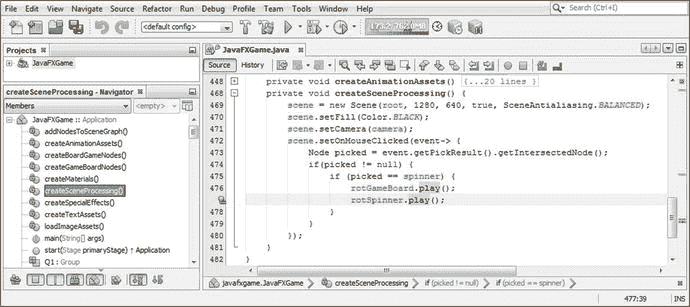

图 17-9。

Add rotSpinner.play() after rotGameBoard.play() in the mouse event handling construct so both will animate

```java
private void createSceneProcessing() {
    scene = new Scene(root, 1280, 640, true, SceneAntialiasing.BALANCED);
    scene.setFill(Color.BLACK);
    scene.setCamera(camera);
    scene.setOnMouseClicked(event->{
        Node picked = event.getPickResult().getIntersectedNode();
        if (picked != null) {
            if (picked == spinner) {
                rotGameBoard.play();
                rotSpinner.play();

            }
        }
    });
}

```

让我们使用一个运行➤项目的工作流程并测试我们的代码。单击开始游戏按钮对象，注意屏幕上只包含游戏板。然后，spinner UI 出现，旋转到位(旋转到错误的“大头针”位置，我们将很快修复)。点击旋转器，旋转器和游戏板旋转，如图 [17-10](#Fig10) 所示。

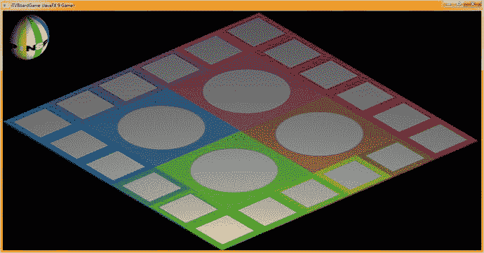

图 17-10。

The spinner UI element now animates on-screen and also rotates when clicked to spin the game board

## 使用 java.util.Random:生成随机旋转

公共类 Random 扩展 Object 并实现 Serializable。它保存在 java.util 包中，有两个已知的直接子类 SecureRandom 和 ThreadLocalRandom。这个类的一个实例可以用来创建一个随机数生成对象，它将生成一个“伪随机数”流为了创建随机的游戏旋转器 UI 功能，这些数字将足够随机。该类的算法使用 48 位种子，该种子使用线性同余公式进行修改。如果你想更详细地研究这个算法，你可以参考 Donald Knuth 的《计算机编程的艺术》(第 2 卷，第 3.2.1 节)。因此，Random 类的 Java 类层次结构如下所示:

```java
java.lang.Object
  > java.util.Random

```

值得注意的是，如果使用相同的种子创建随机对象的两个不同实例，并且对每个对象进行相同的方法调用序列，则算法会生成(返回)相同的数值结果序列。在某些应用中，这实际上是可取的；因此，为了保证相同的结果，java.util.Random 类实现了特定的算法。类 Random 的子类被允许使用替代算法来增加安全性或多线程的使用，只要它们遵守所有方法的通用契约。

java.util.Random 的实例是线程安全的。但是，在多个线程中同时使用同一个 java.util.Random 实例可能会遇到争用，从而导致性能下降。您应该考虑为您的多线程游戏设计使用 ThreadLocalRandom 子类。

此外，java.util.Random 的实例在加密方面并不安全。相反，您应该考虑使用 SecureRandom 子类来获得一个加密安全的伪随机数生成器，供敏感且需要高级安全性的应用使用。

这个类有两个重载的构造函数方法。第一个创建一个随机数生成器，第二个创建一个随机数生成器，并使用长格式给它一个种子值。这些构造函数方法看起来像下面的 Java 代码:

```java
Random()             // We'll be using this in our code later on during this chapter
Random(long seed)

```

这个类有 22 个方法，可以用来从 random 对象获得随机数结果。的。doubles()方法调用将返回一个称为 DoubleStream 的无限数值流，其中包含伪随机双精度值。这些值中的每一个都将介于零(含)和一(不含)之间。还有三个额外的超载。doubles()方法调用。的。doubles(double randomNumberOrigin，double randomNumberBound)方法调用将返回伪随机双精度值的无限绑定流，每个值都符合方法调用参数区域中指定的给定绑定原点(包括)和绑定限制(不包括)。的。doubles(long streamSize)方法调用将返回一个流，该流产生给定 streamSize 数量的伪随机双精度值，这些值介于零(含)和一(不含)之间。最后，还有一个. doubles(long streamSize，double randomNumberOrigin，double randomNumberBound)方法调用，它返回一个流，该流产生符合给定 streamSize 数量的伪随机双精度值的流，每个值都符合给定的绑定原点(包含)和绑定限制(不包含)。

那个。ints()方法调用将返回一个无限的伪随机 int(整数)数值流，称为 IntStream。还有三个额外的超载。ints()方法调用，包括。ints(int randomNumberOrigin，int randomNumberBound)方法调用，它将返回一个无限的伪随机 int (integer)值流，每个值都符合参数区域中指定的绑定原点(包含)和绑定限制(不包含)值。那个。ints(long streamSize)方法调用将返回一个随机值流，这将产生一个流大小，该流大小是使用 streamSize 参数指定的，该参数建立了所需数量的伪随机 int (integer)值。

最后是。ints(long streamSize，int randomNumberOrigin，int randomNumberBound)方法调用将返回一个数值(整数)流，该流产生参数区域中指定的 streamSize 数量的伪随机 int 值，每个值都符合指定的绑定原点(包括)和绑定限制(不包括)，这也是从方法调用参数区域获取的。

那个。longs()方法调用将返回一个无限的伪随机长数值流，称为 LongStream。还有三个额外的超载。longs()方法调用，包括一个. longs(long randomNumberOrigin，int randomNumberBound)方法调用，它将返回一个无限的伪随机长值流，每个长值都符合参数区域中指定的绑定原点(包含)和绑定限制(不包含)值。那个。longs(long streamSize)方法调用将返回一个随机长值流，该流产生使用 streamSize 参数指定的流大小，该参数建立所需数量的伪随机长值。

最后，一个. long(long streamSize，int randomNumberOrigin，long randomNumberBound)方法调用将返回一个数字长值流，该流产生参数区域中指定的 streamSize 数量的伪随机长值，每个值都符合指定的绑定原点(包括)和绑定限制(不包括)，这也是从方法调用参数区域获取的。

受保护的 int。next(int bits)方法调用将使用整数位数作为参数规范来生成下一个伪随机整数。的。nextBoolean()方法调用将从随机数生成器对象的序列中返回一个伪随机的、均匀分布的布尔值。这个方法可能不应该用于这个游戏的用例，因为 next()被设计为由其他 random()方法调用。

虚空。nextBytes(byte[] bytes)方法调用将生成一个参数提供的字节数组，并用随机字节值填充它。那个。nextDouble()方法调用将通过使用随机数生成器对象的序列返回一个介于值 0.0 和 1.0 之间的伪随机、均匀分布的 Double 值。那个。nextFloat()方法调用将使用随机数生成器对象的序列返回一个伪随机的、均匀分布的浮点值，介于 0.0 和 1.0 之间。

那个。nextGaussian()方法调用将从这个随机数生成器对象的序列中返回一个伪随机、高斯分布的双精度值，其平均值为 0.0，标准差为 1.0。那个。nextInt()方法调用将从这个随机数生成器对象的序列中返回下一个伪随机、均匀分布的 Int(整数)值。

那个。nextLong()方法调用将从这个随机数生成器对象的序列中返回下一个伪随机、均匀分布的长值。

虚空。setSeed(long seed)方法调用可用于设置(或重新设定)随机数生成器对象的种子，在方法调用的参数区域内使用单个长值种子规范。

最后是。nextInt(int bound)方法调用是我们将在本章的最后一节使用的方法，它将返回一个伪随机的、均匀分布的 int (integer)值，该值介于 0(包括 0)和指定值(不包括 0)之间，在我们的示例中为 4，从随机数生成器对象的 random int 序列中提取。

### 随机象限选择:使用带条件 If()的随机

既然我们已经很好地设置了旋转器和游戏板旋转以及鼠标事件处理，足以将两者连接在一起，为游戏板创建一个随机旋转，我们需要向代码中添加一个随机数发生器算法，以便每次单击旋转器时，游戏板都会被随机设置到一个新的象限。我们将使用至少三次旋转，以便旋转足够长，对玩家来说完全是随机的。让我们在类的顶部声明一个名为 Random 的随机对象，然后使用 Alt+Enter 组合键打开 NetBeans 9 弹出助手。最后，选择(双击)“为 java.util.Random 添加导入”选项，如图 [17-11](#Fig11) 中蓝色部分所示。

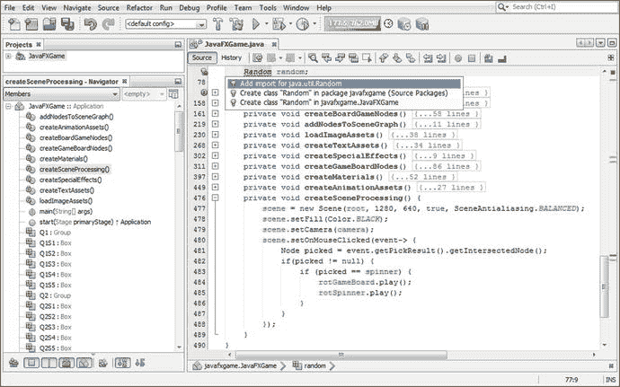

图 17-11。

Declare a Random object named random at the top of class; use Alt+Enter to add import java.util.Random

由于我们希望在实际使用随机数生成器“引擎”之前实例化(创建)它，所以让我们的代码在游戏应用启动时实例化(创建并加载到系统内存中)随机数生成器。

这表明我们将把 Random()构造函数方法代码放在您的。start()方法，在 ActionEvent 处理构造之前，在所有节点、场景和舞台对象创建并添加到 SceneGraph 之后。为了更好地衡量，我们将把它放在创建素材、图像、动画以及最终数字音频样本和其他新媒体素材的所有自定义方法之后，我们将使用它们来创建专业的 Java 9 游戏。

我们可以这样做，因为这个随机对象(名为 Random)直到玩家单击开始游戏按钮对象进入 3D 场景，然后单击 spinner 3D UI (Sphere)元素时才被使用。因此，您可以将这个随机对象实例化放在。start()方法，从第一行代码到最后一行代码，只要在您开始在您的自定义 createSceneProcessing()方法中生成任何 MouseEvent 处理方法调用之前创建了该对象(加载到系统内存中),我们将在本章中继续增强该方法。打开你的。NetBeans 9 中的 start()方法体，在你的自定义方法调用之后添加一行代码，使用下面的 Java 代码实例化你的名为 Random 的随机对象，也如图 [17-12](#Fig12) 所示:

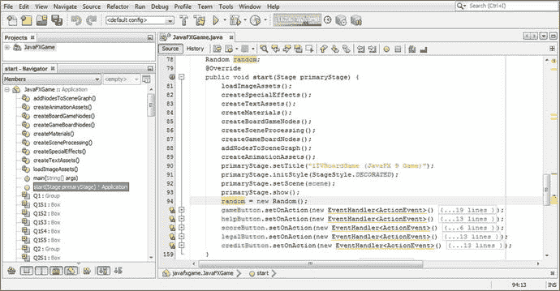

图 17-12。

Instantiate the random Random object in the .start() method so that it is loaded into memory and ready

```java
public void start(Stage primaryStage) {
    ...                                  //  Custom Methods Up Here
    random = new Random();
    ...                                  //  ActionEvent Handling Constructs Down Here
}

```

现在，您已经准备好在 MouseEvent 处理代码中调用微调器逻辑内部的这个随机数生成器，它告诉您的游戏在单击 3D 微调器 UI 时该做什么。显然，要做的第一件事是检查 NULL 以查看点击是否在 3D 场景元素上，如果是，则查看点击的是否是 3D 微调器。

如果单击了微调器，那么 if(picked==spinner)之后的第一行代码将是一个. nextInt(bound)方法调用，上边界值为 4(下边界为零)。这为我们提供了四个象限中的随机结果(从 0 到 3，因为 4 的上限是唯一的，因此不在随机数选择范围内使用)，这是我们需要在游戏的四个象限中随机选择的结果。

在调用 RotateTransition 动画对象之前添加一行代码，并创建一个名为 spin 的新 int 变量，它将保存您的`random.nextInt(4)`方法调用的结果。添加一个等号(=)运算符，然后键入 random 和一个句点，这将打开 NetBeans 9 method helper 弹出选择器下拉列表。

选择。nextInt(int bound) (int)选项，在图 [17-13](#Fig13) 中用蓝色显示，然后双击它插入到你的代码中。将默认值 0(通过生成零到零的结果来关闭随机数生成器)更改为 4，告诉随机数生成器随机生成四个整数值，这将为您的玩家旋转提供四个不同的象限结果。此时的 Java 代码应该看起来像下面的 Java 嵌套 if()结构，在图 [17-13](#Fig13) 中也用蓝色突出显示(也在构建中):

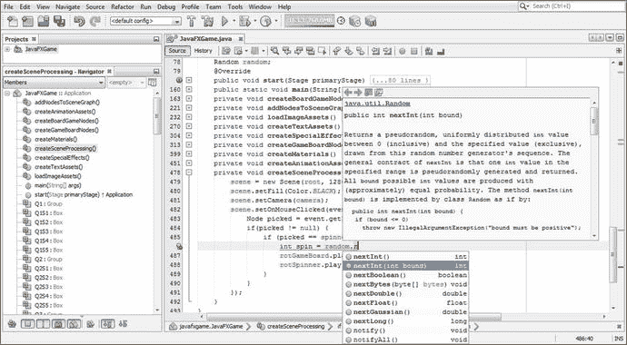

图 17-13。

Add an int variable named spin and then type random and a period and select nextInt(int bound ) set to 4

```java
if (picked != null) {
    if (picked == spinner) {
        int spin = random.nextInt(4);

        rotGameBoard.play();
        rotSpinner.play();
    }
}

```

在我们编写这个自旋逻辑之前，我们需要移除。setFromAngle()和。setToAngle()方法调用 createAnimationAssets()方法中 rotGameBoard 语句块，这将 rotGameBoard 动画对象逻辑简化为五个必需的语句(实例化、轴、周期、速率和插值器)。在我们确定从 toAngle 和 fromAngle 到 byAngle 的切换将正确地使用最少的代码行和零错误生成正在进行的游戏板旋转后，我们将为您的 rotSpinner 执行此操作。

我们在这里做的是使用 createAnimationAssets()来创建和配置动画对象，然后在 if()条件语句中使用. setByAngle()，该语句评估随机的随机对象结果，并将其放入 spin integer 中，这是我们接下来要做的。这种方法也将减少这个方法体中的代码量，减少到不到 24 行代码(除非我们在本书概述的设计和开发过程中添加游戏板动画)。rotGameBoard 代码如图 [17-14](#Fig14) 所示，现在看起来像这样:

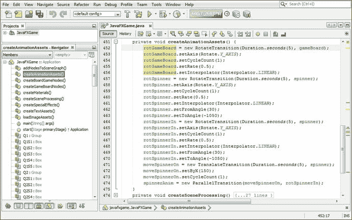

图 17-14。

Remove the .setFromAngle(45) and .setToAngle(1125) method calls from the rotGameBoard object code

```java
private void createAnimationAssets() {
    rotGameBoard = new RotateTransition(Duration.seconds(5), gameBoard);
    rotGameBoard.setAxis(Rotate.Y_AXIS);
    rotGameBoard.setCycleCount(1);
    rotGameBoard.setRate(0.5);
    rotGameBoard.setInterpolator(Interpolator.LINEAR);
    rotSpinner = new RotateTransition(Duration.seconds(5), spinner);
    rotSpinner.setAxis(Rotate.Y_AXIS);
    rotSpinner.setCycleCount(1);
    rotSpinner.setRate(0.5);
    rotSpinner.setInterpolator(Interpolator.LINEAR);
    rotSpinner.setFromAngle(30);
    rotSpinner.setToAngle(-1050);
    ...
}

```

确保游戏板旋转在一个象限结束的最简单的方法是将游戏板旋转初始化为 45 度，并使用。setByAngle()为每次 if()计算旋转 90 度增量(加上三次旋转)。这样我们得到 0 的 1080，1 的 1170，2 的 1260 和 3 的 1350。Java if()结构如图 [17-15](#Fig15) 所示，如下所示:

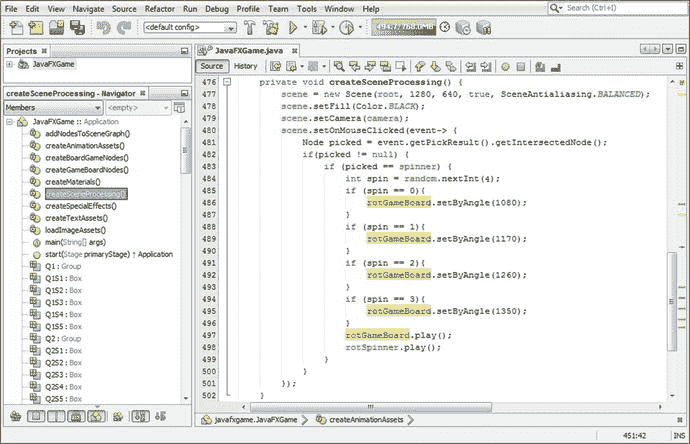

图 17-15。

Add if() constructs, setting the .setByAngle() method call to four different 90-degree increments plus 1080

```java
if (picked == spinner) {
    int spin = random.nextInt(4);
    if (spin == 0) {
        rotGameBoard.setByAngle(1080);  // Zero degrees plus 1080

    }
    if (spin == 1) {
        rotGameBoard.setByAngle(1170);  // 1080 plus 90 degrees is 1170

    }
    if (spin == 2) {
        rotGameBoard.setByAngle(1260);  // 1080 plus 180 degrees is 1260

    }
    if (spin == 3) {
        rotGameBoard.setByAngle(1350);  // 1080 plus 270 degrees is 1350

    }
    rotGameBoard.play();
    rotSpinner.play();
}

```

使用运行➤项目工作流程，多次点击 spinner UI 进行测试，如图 [17-16](#Fig16) 所示。


图 17-16。

The game board now randomly lands on a different quadrant with each 3D spinner click

返回 createAnimationAssets()方法并移除。setFromAngle()和。setToAngle()方法从 rotSpinner 动画对象中调用，产生如下 Java 代码，如图 [17-17](#Fig17) 所示:

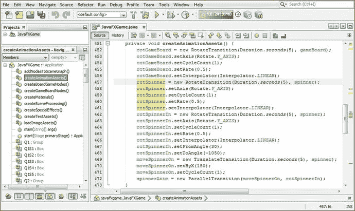

图 17-17。

Remove rotSpinner.setFromAngle() and rotSpinner.setToAngle() method calls in createAnimationAssets

```java
private void createAnimationAssets() {
    rotGameBoard = new RotateTransition(Duration.seconds(5), gameBoard);
    rotGameBoard.setAxis(Rotate.Y_AXIS);
    rotGameBoard.setCycleCount(1);
    rotGameBoard.setRate(0.5);
    rotGameBoard.setInterpolator(Interpolator.LINEAR);
    rotSpinner = new RotateTransition(Duration.seconds(5), spinner);
    rotSpinner.setAxis(Rotate.Y_AXIS);
    rotSpinner.setCycleCount(1);
    rotSpinner.setRate(0.5);
    rotSpinner.setInterpolator(Interpolator.LINEAR);
}

```

返回到 createSceneProcessing()方法，使用 rotGameBoard.setByAngle()方法调用中使用的负角度值添加 rotSpinner.setByAngle()方法调用，使用此代码，也如图 [17-18](#Fig18) 所示:

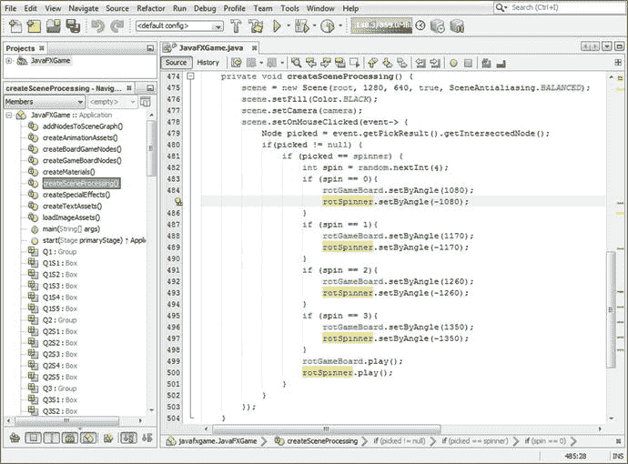

图 17-18。

Add the rotSpinner.setByAngle() method calls to the random spin logic, this time subtracting 1080 plus 90

```java
if (picked == spinner) {
    int spin = random.nextInt(4);
    if (spin == 0) {
        rotGameBoard.setByAngle(1080);
        rotSpinner.setByAngle(-1080);  // Zero degrees minus 1080
    }
    if (spin == 1) {
        rotGameBoard.setByAngle(1170);
        rotSpinner.setByAngle(-1170);  // -1080 minus 90 degrees is -1170
    }
    if (spin == 2) {
        rotGameBoard.setByAngle(1260);
        rotSpinner.setByAngle(-1260);  // -1080 minus 180 degrees is -1260
    }
    if (spin == 3) {
        rotGameBoard.setByAngle(1350);
        rotSpinner.setByAngle(-1350);  // -1080 minus 270 degrees is -1350
    }
    rotGameBoard.play();
    rotSpinner.play();
}

```

现在使用一个运行➤项目的工作流程，并彻底测试我们在本章中开发的代码。正如你在图 [17-19](#Fig19) 中所看到的(因为它不是动画或互动的，就像我们现在的游戏一样)，每次你点击 3D 旋转器，你会在 3D 旋转器 UI 上得到不同的象限和不同的颜色序列，而它仍然总是说“旋转”！

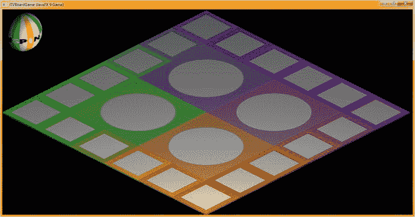

图 17-19。

The game board randomly lands on a different quadrant , and the spinner always lands on the word SPIN

在本章中，我们添加了一些相当复杂的功能，我们仍然有大约 500 行 Java 代码，正如您在 NetBeans 9 底部的图 [17-18](#Fig18) 中看到的那样(第 504 行是课程的结尾)。令人印象深刻，伙计们！

## 摘要

在第十七章中，我们学习了 MouseEvent、PickResult 和 Random 类，它们允许我们完成 3D spinner UI 的实现，并让它在旋转的 3D spinner 沙滩球的每个后续旋转中选择一个随机象限。我们还构建了一个新的自定义 createSceneProcessing()方法，该方法包含您的 MouseEvent 处理逻辑，以及您的用于处理(现在的)i3D 基本对象的逻辑，我们的 i3D 游戏板和旋转器是由这些基本对象组成的(构建时使用)。在这个新方法中，我们开始构建一个条件 if()结构来评估鼠标点击，以及基于点击的内容游戏逻辑需要发生什么。在接下来的几章中，当我们设计和开发我们的游戏模型时，我们显然会扩展这个逻辑。

我们还获得了更多使用 RotateTransition 类方法的经验，方法是使用。setFromAngle()和。setToAngle()旋转动画配置参数为单个。setByAngle()旋转动画配置方法，减少了 12 行 Java 代码。

在第 [18](18.html) 章中，我们将开发你的游戏内容，这样我们就可以完成你的鼠标事件处理代码(在第 [19](19.html) 和 [20](20.html) 章中)用于游戏棋盘方格和游戏棋盘象限。