# 十八、3D 游戏设计：使用 GIMP 和 Java 创建你的游戏内容

现在，您已经创建了多层 3D 游戏板组节点(子类)层次，对该层次下的所有 3D 图元进行了纹理处理，配置了 RotationTransition 动画算法(对象)以使游戏板栩栩如生，并创建了 3D 旋转器 UI 以将游戏板 3D 模型(层次)旋转到随机象限，现在是时候完成游戏设计并创建组成游戏的视觉素材了。这些将在游戏过程中替换纹理贴图图像资源；我们将使用现有的 24 个棋盘游戏组件，并将它们变形为不同的内容配置，用与您的教育游戏相关的内容替换旋转的游戏棋盘。

在这一章中，我们将看看创建替换纹理贴图的工作过程，这些贴图将在游戏过程中根据随机旋转和玩家鼠标点击(或屏幕触摸)改变图像对象资源引用，以将内容添加到游戏棋盘方块和象限中。虽然这一章没有深入探讨 Java 9，但需要注意的是，开发专业的 Java 9 游戏涉及到数字图像工匠，以及数字音频工程师、3D 建模师、3D 纹理艺术家、动画制作人、2D 插画师和 VFX 艺术家。因此，我们需要在本书中涵盖一些非 Java 主题，这是其中的一章。内容设计工作流程中的一章将允许我们涵盖开发一个被大众认为是“专业”的游戏需要什么。在本书中，我将使用许多新媒体类型，这样我就不会留下任何漏网之鱼了！

## 设计你的游戏:创建象限定义

由于这是一个针对学龄前儿童以及自闭症、智力障碍和学习障碍者的教育游戏，我们需要保持分类简单。与我们的配色方案相匹配的常年分类范例之一是动物、植物或矿物，这将为我们留下一个正方形用于其他主题，例如人和著名的地方。显然，我们的绿色象限将是蔬菜，因为人们说“吃你的绿色”，橙色象限将是动物，因为狮子、老虎、猫、狗和其他动物正是橙色的阴影。我们的蓝色象限将是矿物的，因为像蓝宝石和紫水晶这样的矿物存在于这个冷色系光谱中。这就剩下了粉色象限，我们可以在每次旋转后决定对其进行分类。这些游戏棋盘方格随机选择的主题将使用高质量的图像进行视觉呈现，我们将在本章中使用专业级 GIMP 开发替代纹理映射数字图像素材。

### 游戏板象限:创建游戏象限内容(GIMP)

我将向您展示在 GIMP 中创建一个游戏板纹理素材(为您的动物象限创建一只鹦鹉)的工作过程，这样该章节就不会膨胀到数百页，因为您最终需要为您的 24 个游戏板元素创建数百个图像素材。让我们启动 GIMP(目前版本为 2.8.22)并创建一个新的图像合成来开发内容纹理！要开始你的象限(和游戏棋盘方块)纹理贴图层合成构造，只需启动 GIMP 并使用文件➤打开菜单序列打开你的`/NetBeansProjects/JavaFXGame/src/`文件夹中的 gameboardquad1.png 文件。这将使其成为最底层，如图 [18-1](#Fig1) 的左侧(蓝色高亮显示)所示。打开另外三个 gameboardquad 纹理贴图，如图 [18-1](#Fig1) 右上方的三个选项卡所示。选择每个选项卡，使用选择➤全部菜单序列，然后使用编辑➤副本。点击第一个标签，包含你的多层复合，并使用编辑➤粘贴为➤新层菜单序列添加这三层在第一层(橙色)之上，如图 [18-1](#Fig1) 左侧所示。用破折号和单词动物、植物、矿物和其他将这些层重命名为 gameboardquad，如图 [18-1](#Fig1) 所示。选择第四层(粉色，最顶层)，使用文件➤打开为层菜单序列，将 SteelHoop.png 24 位图像文件添加到合成的顶层，给出如图 [18-1](#Fig1) 中预览区域所示的结果。现在，让我们在网上找到一个动物图像，我们可以在纹理的钢圈区域内使用。

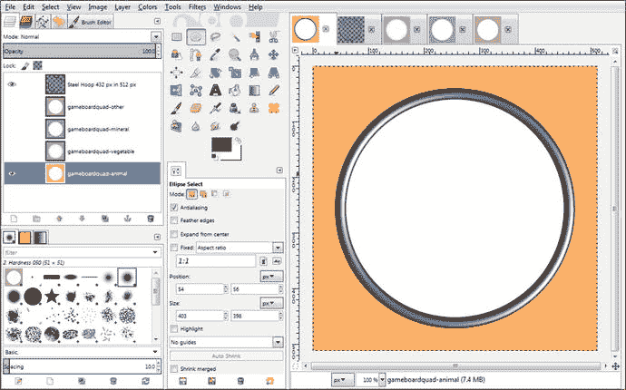

图 18-1。

Create a quadrant texture composite with four quadrant diffuse color maps; then add a steel decorative hoop

我用于商业用途(如这个教育游戏和书籍)的免版税图像的网站是 Pexels.com。进入 [`www.pexels.com`](http://www.pexels.com) ，如果在首页没有看到鹦鹉，在搜索栏输入 parrot。下载一个鹦鹉图片，如图[18-2](#Fig2)；然后右键单击下载的图像(在浏览器中它自己的选项卡中)并选择复制图像。进入 GIMP，使用剪贴板菜单序列中的文件➤创建➤，将数字图像数据粘贴到 GIMP 中它自己的合成文件中(并在右上方的一个新选项卡下)。

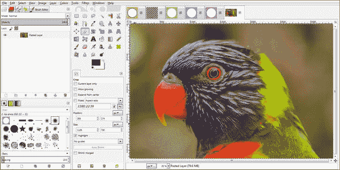

图 18-2。

Use File ➤ Create ➤ From Clipboard to paste content copied from the Pexels.com download in GIMP for editing

我们需要这个图像的一个正方形区域来使用游戏棋盘正方形纹理和游戏棋盘象限纹理的圆形部分。这将使用图 [18-3](#Fig3) 所示的矩形选择工具创建，设置为 2160x2160 的正方形区域，其大小将调整 500%以适应游戏板象限内 432x432 的圆形区域。

定位您的正方形选择以优化您内容的可识别部分，如图 [18-3](#Fig3) 所示。

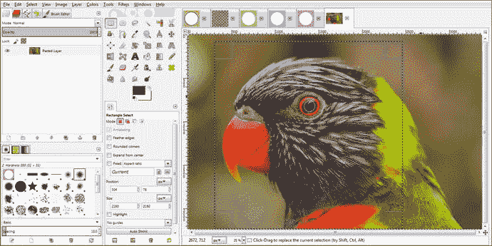

图 18-3。

Set the Rectangle Select tool’s Size properties to 2160x2160 and then drag the selection into an optimal position

由于 Pexels.com 图像的像素大小不同，我只需找到每个象限的中心区域所需的目标 432 像素正方形图像大小的偶数倍，并为此设置矩形选择工具。一旦设置了选择方块，您就可以拖动它的内部区域来微调它的位置，以显示其中的最大内容。然后使用编辑➤复制菜单序列将数据复制到剪贴板，然后使用文件➤从剪贴板菜单序列创建➤来创建新的正方形图像，如图 [18-4](#Fig4) 所示，我们将对其进行五倍缩减采样，以达到 432x432。这是通过使用图像➤缩放图像菜单序列打开缩放图像对话框来完成的，在该对话框中，您将用 432 替换 2160(保持纵横比锁定)并单击缩放按钮。

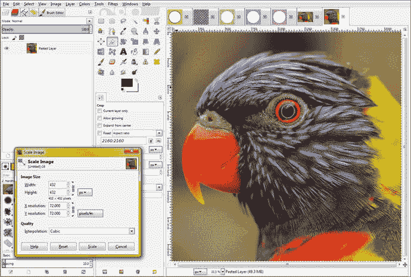

图 18-4。

Use the Image ➤ Scale Image work process and reduce the 2160-pixel image 500 percent to be 432 pixels square

下一步是将这个 432 像素的正方形图像放在你的象限纹理贴图的 512 像素正方形区域的中心，这是我们在复制它之前要做的，因为这是一个更简单的工作过程。为此，我们将简单地使用图像➤画布大小菜单序列，然后将画布大小从 432x 432 增加到 512x 512。请确保单击对话框的中心按钮，否则您的图像将位于调整大小的画布的左上角，这个居中过程将允许您在没有图像的地方获得透明度(alpha 通道)值，这正是我们想要实现的结果。

正如您在“设置图像画布大小”对话框中看到的，一旦您单击图 [18-5](#Fig5) 中以浅蓝色显示的中间按钮，该对话框将计算图像整个周长周围的 X 偏移和 Y 偏移值(在本例中为 40 像素)，如 512–432 = 80/2 = 40。最后，单击调整大小按钮，将这个 432 像素的正方形变成 512 像素的正方形，使用透明度居中，因此它将在钢圈中居中。现在，您已经准备好使用全选➤，然后编辑➤复制菜单序列将数据放入剪贴板，数据将被粘贴到不同的选项卡上。

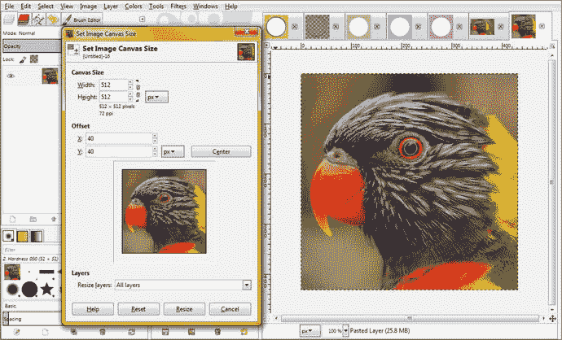

图 18-5。

Use the Set Image Canvas Size dialog to resize the canvas to 512 pixels

确保将图层下拉选择器设置为所有图层，以包含图层中生成的透明区域。如果你忘记这样做，只需右键单击新的 512 像素层，并使用图层图像大小选项。确保在使用“选择➤全部”和“编辑➤副本”之前完成此操作，以便同时选择透明度和影像。

下一步是点击象限纹理合成选项卡，如图 [18-6](#Fig6) 所示，然后选择最底层(动物)层，这样当你粘贴居中的鹦鹉方块图像时，它位于象限的基础纹理之上，钢环装饰之下。我们将使用这个钢箍图像和它的透明度来切掉鹦鹉图像的角，以便它与钢箍图像无缝集成。

为了完成这个 GIMP“移动”，你将选择钢箍层，在图 [18-6](#Fig6) 中显示为选中的蓝色，然后单击魔棒工具，在 GIMP 工具图标区域显示为选中(按下)。单击钢圈中心(透明)区域内的魔棒工具，这将选择钢圈内的这个区域。您需要扩展这个选择区域，以便鹦鹉图像实际上位于钢圈边缘的下面，或者您将看到鹦鹉图像的边缘周围有一条缝，一旦它被剪切出来，它就位于钢圈的内部。

要做到这一点，在你看到你的钢圈里面的选择后，如图 [18-6](#Fig6) 所示，你会想要使用选择➤增长菜单序列和扩展选择，这样它实际上看起来像是在钢圈的顶部，从 1 到 9 个像素的任何地方。(我一般至少用 2 个，保险起见；在这种情况下，我使用了 4 个像素。)

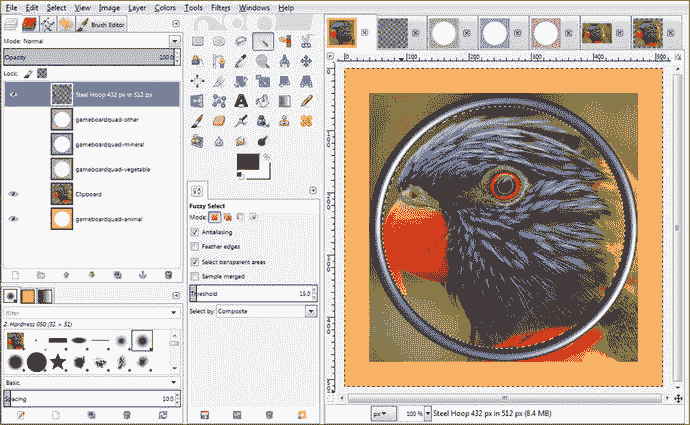

图 18-6。

Select the Steel Hoop layer and Magic Wand tool and click inside the hoop to create a selection

此时，由于选择了钢箍层，因此选择确实在钢箍的顶部。但是，一旦选择了剪贴板层(如果您愿意，可以通过双击层名称来重命名 Parrot ),该选择将位于该层的顶部(以及在该层上使用),因此将位于钢圈层的下方。

将增大选择对话框值设置为 4，点击确定按钮，如图 [18-7](#Fig7) 底部所示。

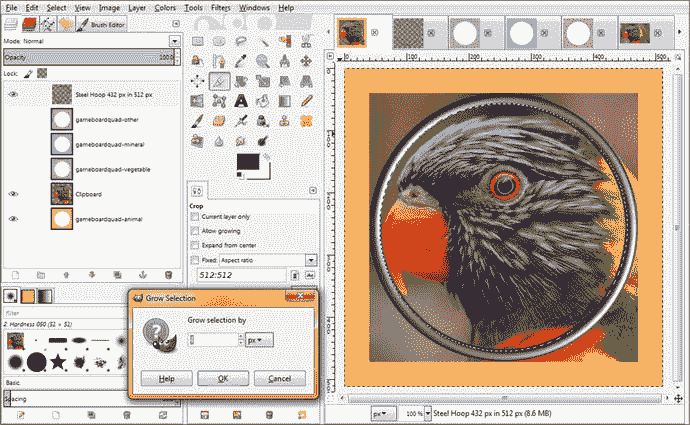

图 18-7。

Use the Grow Selection dialog and expand the selection area by 4 pixels beyond the interior

下一步是选择您的剪贴板层，其中包含您的鹦鹉图像，使其受到选择的影响，我们从钢圈层(内部)透明度“挑选”。然后选择选择➤反转菜单序列。这将“保留”圆圈内的内容，删除圆圈外的内容(也就是说，只要您点击键盘上的 delete 键)。这将移除图 [18-7](#Fig7) 中突出的图像边角。

如图 [18-8](#Fig8) 所示，这一工作过程的最终结果是一个完全平滑的图像合成，圆形的鹦鹉图像在钢圈装饰的内部(和后面)。图 [18-8](#Fig8) 还显示了制作完美游戏板象限纹理贴图的最后一步，即将内容旋转 45 度，这样当你的 3D 游戏板旋转到它的点上时，图像相对于观看的玩家被正确定位。

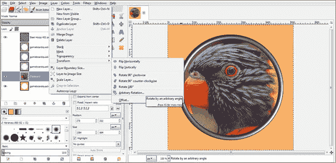

图 18-8。

Once you delete the corners, you have a perfect compositing result and are ready to rotate the parrot 45 degrees

接下来需要做的事情是旋转剪贴板(鹦鹉)层 45 度，这应该是无缝的，因为鹦鹉图像已经使用基于数学的工作过程居中和四舍五入。由于你的剪贴板图层仍然被选中，你所要做的就是选择图层➤变换➤任意旋转，如图 [18-8](#Fig8) 所示，打开旋转对话框，如图 [18-9](#Fig9) 所示。

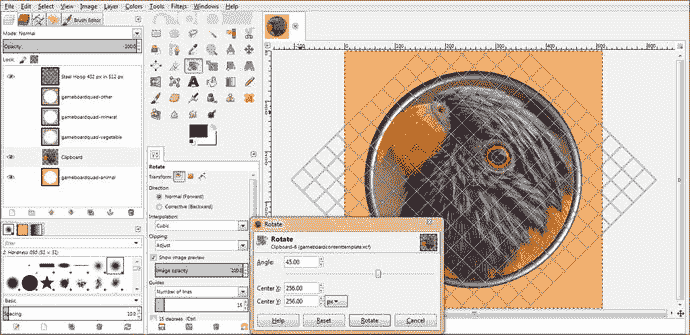

图 18-9。

Rotate the parrot 45 degrees using a Rotate dialog so that it is upright for the game board quadrant spin

在角度文本字段中输入 45 度值来旋转鹦鹉图像，以便在游戏板微调器选择橙色动物象限后，它将是直立的。将你的中心 X 和中心 Y 旋转坐标放在 512 像素纹理贴图的正中心，这将是一个 256 的值，如图 [18-9](#Fig9) 所示。

图 [18-9](#Fig9) 中还显示了旋转工具网格，它覆盖正在旋转的图像。这将允许您使用 16x16 的直线网格覆盖，更精确地显示内容是如何旋转的。

旋转工具和网格的设置可以在“旋转”对话框的左侧看到，您可以在其中设置网格线(称为参考线)的数量，设置图像预览选项，设置旋转方向，以及设置剪辑和图像不透明度。如您所见，GIMP 2.8.22 可以成为专业 Java 9 游戏开发者的强大工具。

请注意，旋转栅格导向显示在钢箍层上，因为它在层合成中处于打开状态(显示)。如果你想在圆形的鹦鹉图像上看到旋转向导，你可以关闭钢圈和游戏板四动物层的眼睛图标。请记住，只有所选图层才会受到图层➤变换➤旋转操作的影响，因为 GIMP 是一个模态软件包，只能对所选图层、工具、颜色、选择集和选项的组合进行操作。这使得它相对复杂，但同样的功能使它比非模态数字成像软件更强大。

单击旋转按钮完成旋转算法设置，并将旋转应用于图像。现在您所要做的就是将图像作为 gamequad1bird1.png 导出到 netbeans projects/Java FX game/src 文件夹中。然后，我们可以进入 Java loadImageAssets()方法，通过更改 diffuse21 贴图来引用此图像，而不是默认图像，从而测试新的纹理贴图。(我们这样做是暂时的，以便我们可以看到它在 3D 游戏棋盘象限上呈现时的样子。)

打开 NetBeans 9 和 JavaFXGame 项目。然后，通过使用空白处的加号(+)图标打开 loadImageAssets()方法体，并临时编辑用于橙色游戏棋盘象限的 diffuse21 纹理，以引用您刚刚使用以下 Java 语句创建的 gamequad1bird1.png 文件，该文件也显示在图 [18-10](#Fig10) 中，以黄色和蓝色突出显示:

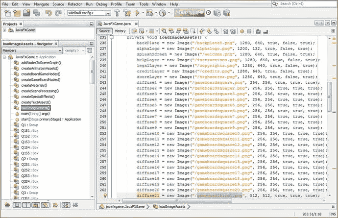

图 18-10。

Set the diffuse21 Image object to temporarily reference the gamequad1bird1.png texture map you created

```java
...

diffuse21 = new Image("/gamequad1bird1.png", 512, 512, true, true, true);
...

```

现在我们需要做的就是测试新代码，看看当 3D 旋转器随机选择这个游戏棋盘象限(主题)让玩家回答时，游戏棋盘落在动物(橙色)象限时是什么样子。

这可能需要多次旋转尝试，因为 random 类的 Random 对象(随机数生成器引擎)实际上非常有效，可以在 3D 旋转器的每次后续旋转中提供随机游戏板象限结果。

使用运行➤项目工作流程旋转微调器，直到选择象限 1，如图 [18-11](#Fig11) 所示。

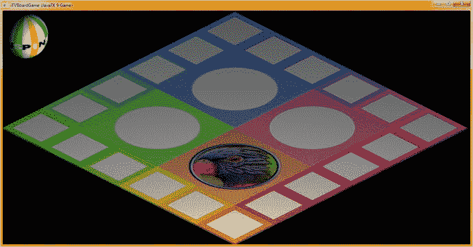

图 18-11。

The parrot quadrant texture map rendered on the game board surface

### 游戏棋盘方块:在 GIMP 中创建游戏方块内容

游戏棋盘方格定义符合象限定义，为玩家提供了五个与象限类别相关的不同主题以供选择。在游戏板随机旋转为他们选择类别并随机加载主题内容后，玩家可以决定自己的命运(问题)。打开第二个(256 像素)纹理贴图文件，我们用游戏棋盘方块模板处理，如图 [18-12](#Fig12) (第三个标签)所示。也打开 Pexels.com 图像和 2160 像素的正方形区域，我们将使用它来表示鹦鹉。我们需要做的第一件事是将 2160 像素的图像缩小到 192 像素，以适应颜色区域。由于周长为 32 像素(两个维度上的中心区域为 256-(2×32)= 192 像素)，使用图像➤缩放图像工作流程将图像缩小到 192 像素，如图 [18-12](#Fig12) 左下方所示。

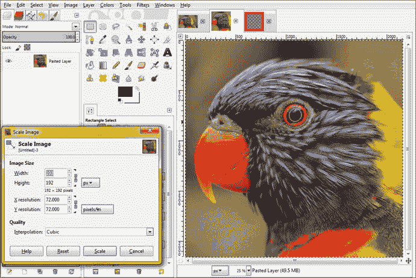

图 18-12。

This time scale your 2160-pixel image to 192 pixels so it perfectly fits inside your game board squares

接下来，使用视图➤缩放➤ 100%(称为实际像素视图模式)菜单序列，“正常化”您正在查看的图像，然后进行相同的“居中透明”工作过程，就像我们使用图像➤画布大小菜单序列对象限所做的那样。将画布扩展并居中回到 256 像素，以匹配游戏板正方形纹理贴图的大小，如图 [18-13](#Fig13) 所示，这样图像就会完美贴合你的纹理贴图。


图 18-13。

Resize the canvas to 256 pixels and center the 192-pixel image inside the 32 pixels of transparency to center

使用“选择➤全部”菜单序列，然后使用“编辑➤复制”菜单序列，将透明的 32 像素边界和内部的 192 像素图像数据复制到操作系统剪贴板中。(是的，剪贴板实际上是操作系统的一部分，因此您可以在所有不同的运行应用之间剪切、复制和粘贴数据。)

选择 256 像素游戏板正方形纹理合成选项卡和游戏板正方形图层下面的图层，并使用编辑➤粘贴为图层菜单序列将图像粘贴到红色边框下面。请注意，在这种情况下，您也可以将该层粘贴到游戏板方形边缘颜色层的顶部；因为我们在合成层中使用了所有的直线，每一层在数学上“像素对像素”地邻接另一层，所以没有重叠的像素，这在我们的圆形象限合成中不是这样。

我将使用不同的名称 gameboardsquarecontent1.xcf 保存这个纹理贴图文件，这样它只包含第一个游戏棋盘方块的图像和边缘装饰。最终将会有 20 个这样的 XCF 文件，Q1S1 到 Q4S5 游戏板节点象限子节点各一个。

当我们添加内容时，这些文件的大小会均匀地增加，这样你就不会有一个庞大的文件需要处理。这种方法将使您的 pro Java 9 游戏开发工作过程更有条理。

请注意，图 [18-14](#Fig14) 中的截图仍然使用第 [13 章](13.html)中的 Pro _ Java _ 9 _ Games _ Development _ Texture _ maps 4 XCF 文件，该文件涵盖了 3D 图元着色器和纹理映射概念以及 Java 编码。

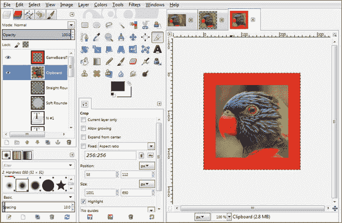

图 18-14。

Select the 256 texture map composite tab, select the layer under the red square, and select Edit ➤ Paste as Layer

在本章的后面，我们将生成 20 个游戏棋盘方格内容生成 XCF 文件，这些文件将累积数字图像内容，Java 代码最终将从初始随机旋转为游戏选择的每个游戏棋盘方格(即，随机选择的象限中的五个方格)中选择这些内容。这种方法允许我们随机化象限以及象限中每个游戏棋盘方格的内容。

最后，让我们使用 GIMP 文件➤导出为菜单序列，并将这个新的漫反射纹理贴图保存在/netbeans projects/Java FX game/src 文件夹中作为 gamesquare1bird1.png。注意在你的文件管理器中，这个纹理贴图的大小小于 80KB，比你的默认纹理 1KB 要大很多。高质量的 24 位内容总是会增加应用的数据占用量。如果您想进一步优化此数据足迹，您应该使用 GIMP 中的图像➤模式➤索引菜单序列，将您的图像转换为 8 位索引彩色图像，并使用 Floyd-Steinberg 抖动生成最佳调色板(256 色)。这将把 gamesquare1bird1.png 的大小减少到 27.4KB，因为它现在是一个 PNG8 映像，具有高质量的结果。

你如何命名这些文件是很重要的，因为你的游戏 Java 代码，我们将在下一章开始写，将会根据这些命名成分做出随机的决定逻辑。显然，gamesquare1(名称的第一部分)将定义映射哪个 gamesquare (Q1S1 到 Q4S5)。第二部分是子类化。在这种情况下，它是“鸟”，但也可能是“猫”、“狗”或“牛”等等。最后一部分是随机数发生器必须从多少个选项中选择，所以如果游戏棋盘方格 1 有鸟 1 到鸟 5，你的随机对象将从 0 到 5 中选择。这样，当您添加新内容时(在 20 个集合中，或者每个游戏棋盘方格一个图像主题中)，您可以增加随机对象的随机数——生成 Java 代码，以便在您添加内容时添加新的最大随机数(零穿过选择上限)。

接下来，让我们在 3D 游戏板上测试第一个游戏板方块，方法是将 diffuse1 图像对象引用从空白(默认)游戏板方块纹理贴图替换为其中有图像的贴图。图 [18-15](#Fig15) 的顶部显示了您的 Java 9 图像对象实例化(和加载)构造，应该类似于以下代码:

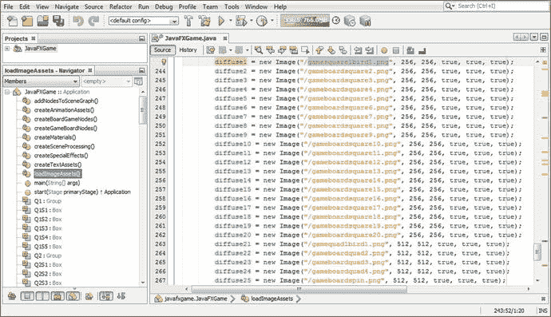

图 18-15。

Test the first game board square by swapping in the new texture map image in the diffuse1 instantiation

```java
diffuse1 = new Image("/gamesquare1bird1.png", 256, 256, true, true, true);

```

使用运行➤项目工作流程，确保内容面向正确的方向，如图 [18-16](#Fig16) 所示。

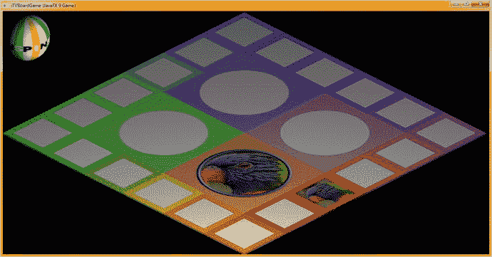

图 18-16。

The parrot is facing out of the edge of the game board, so there’s no need to rotate the image

因为我们需要至少两张游戏棋盘方格的纹理贴图，所以去 Pexels.com 找另一张鸟的图片来做第二张 gamesquare1bird0.png 的图片。我们将从零开始对图像文件进行编号，以更好地匹配随机数生成器的输出。我发现了一只巨大的鹰(或者可能是一只鹰；我们将在后面的章节中研究游戏板的内容，以确保一切都是正确的)，如图 [18-17](#Fig17) 所示。

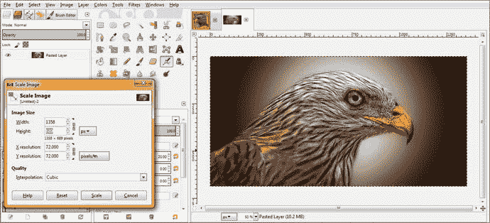

图 18-17。

Paste the second bird image data into GIMP and use Scale Image to find the lowest common resolution

由于这是一个低分辨率的图像，我们将使用 689(高度)作为正方形的尺寸，因此使用矩形选择工具并在位置 428，0 输入一个 689，689 大小的正方形，如图 [18-18](#Fig18) 的左侧所示。

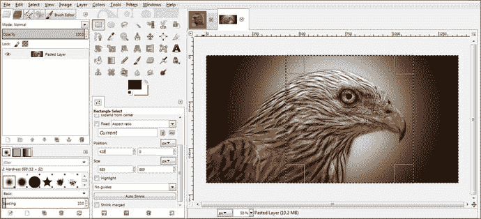

图 18-18。

Create a 689x689 pixel square for the image since it’s not an HD | UHD image with thousands of pixels

使用编辑➤复制菜单序列将这些数据复制到你的操作系统的剪贴板，然后使用 GIMP 文件➤从剪贴板创建菜单序列将方形图像数据粘贴到它自己的编辑标签中，如图 [18-19](#Fig19) 所示。使用图像➤缩放图像菜单序列，将 689 像素数据缩小到 192 像素。然后使用图像➤画布大小菜单序列，进入设置图像画布大小对话框，如图 [18-19](#Fig19) 所示。使用对话框中的中心按钮，将图像画布的大小扩展到 256 像素见方，同时将图像数据放在透明度的中间。请记住，在对图像应用调整大小操作后，选择层下拉列表中的全部调整层大小或右键单击以调用层到图像大小。

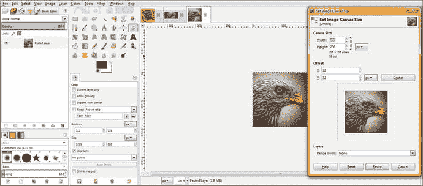

图 18-19。

Scale 689 pixels to 192 pixels and then use Set Image Canvas Size to add your 32-pixel transparent perimeter

接下来，使用“选择➤全部”和“编辑➤复制”菜单序列来选择图像和透明数据；然后单击游戏板正方形 1 纹理贴图选项卡(第一个选项卡)，并单击游戏板颜色正方形下面的层。然后使用编辑➤粘贴为层菜单序列，将第二个鸟的图像粘贴到你的合成中，如图 [18-20](#Fig20) 所示。在图 [18-20](#Fig20) 右上角的第三个选项卡的预览图标中可以看到图 [18-19](#Fig19) 的操作结果。

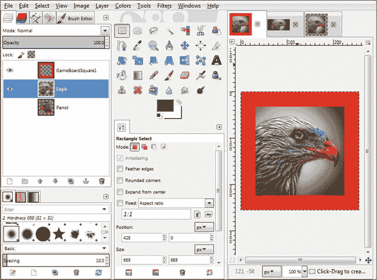

图 18-20。

Paste your 256-pixel image plus transparency under your GameBoardSquare1 edge coloring texture layer

如果你仔细观察它的用户界面，你会发现 GIMP 很好地向你展示了你的工作过程。您还可以通过选择不同的预览图标大小以及使用您自己的信息性(描述性)文本标签命名层来自定义 UI。

要改变图层图标预览的大小，我将在本章的后面做一点，使用小箭头在图层面板的右上角，在你的笔刷编辑器标签的旁边，在模式(正常)下拉选择箭头的上面。你可以选择预览大小➤微小到预览大小➤巨大，给你八个不同的图标大小的选择。

现在你已经创建了 192 像素的游戏棋盘方块插页，如图 [18-20](#Fig20) 所示，你需要使用编辑➤撤销工作流程来返回到 689x689 的原始图像方块，这样你就可以为每个游戏棋盘方块创建一个游戏棋盘象限版本。我们将在下一步这样做，这样我们就可以创建象限纹理。

一旦玩家在随机选择的象限中选择了五个游戏棋盘方格中的一个，您的 Java 代码(最终)会将所选的问题图像放入游戏棋盘象限，并就此向玩家提问。

要返回到 689 像素的正方形图像，请在 GIMP 中选择包含正方形图像数据的选项卡，并使用“编辑➤”“撤消”菜单序列来撤消您之前应用的所有选择、画布大小调整和图像缩放操作，以创建用于 256 像素游戏板正方形漫反射颜色纹理贴图的层数据。

这样做是为了进行类似的工作过程(加上 45 度旋转)来创建 512 像素的象限纹理贴图。这是为了当玩家点击包含相同图像的游戏棋盘方块时，将会有更大(装饰的)版本的图像内容主题(问题)进行预览。

每次你使用编辑➤撤销，你会看到 GIMP 在软件中重新创建以前的图像编辑状态，这样你就可以直观地看到你什么时候回到你原来的 689x689 图像方块。如果你回去太远，你会看到整个原始图像从 Pexels.com，因为也有一个编辑➤重做命令，你可以很容易地回到广场图像版本！撤销/重做功能对于像这样的重复工作过程是非常强大的，我们需要使用相同的原始图像数据源创建多个纹理贴图。

创建第二象限纹理，如图 [18-21](#Fig21) 所示，通过使用图像➤图像尺寸将 689 像素的图像调整为 432 像素。接下来，使用“图像➤画布大小”工作流程，通过将画布大小增加到 512 像素并单击“中心”按钮，将此图像数据置于透明区域的中心。使用“图层到图像大小”选项将图层的透明像素包含在图像像素中，然后使用“选择➤全部”和“编辑➤副本”将所有图像和透明数据传输到操作系统剪贴板中。选择一个层下的钢箍层，并使用编辑➤粘贴为层插入它。

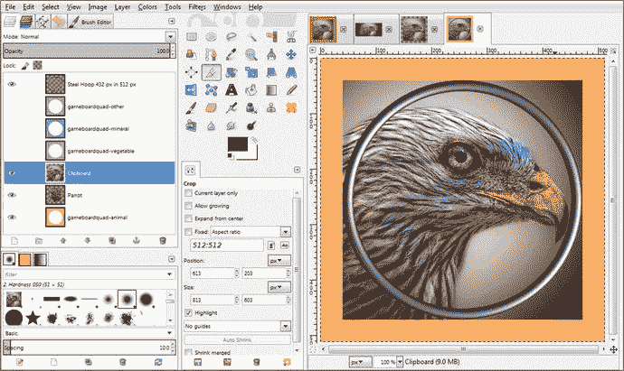

图 18-21。

Create a 432-pixel image inside the 512-pixel texture with a transparent border; paste it underneath the hoop

将此图像数据粘贴到钢圈图层下，并将剪贴板图层旋转 45 度，如图 [18-22](#Fig22) 所示。

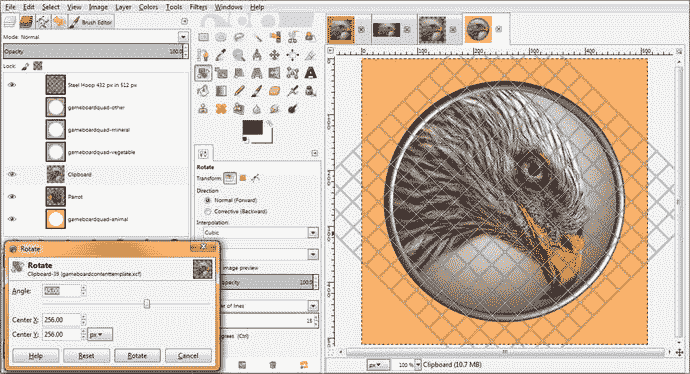

图 18-22。

Rotate the image layer 45 degrees after inverse-selecting and deleting corners protruding from the hoop

接下来，使用文件➤导出作为工作过程，并保存您的第二个 gameboardquadrant1bird0.png 文件(因为我已经决定从零开始编号，以匹配随机数生成器的输出)。

让我们通过使用下面的 Java 9 代码更改 diffuse1 和 diffuse21 图像对象文件名引用来预览第二个游戏板 square 1 和游戏板 quadrant 1 纹理，如图 [18-23](#Fig23) 所示:


图 18-23。

Change the diffuse1 and diffuse21 Image object texture map reference to test the two new texture maps

```java
diffuse1  = new Image("/gamesquare1bird0.png", 256, 256, true, true, true);

diffuse21 = new Image("/gamequad1bird0.png", 512, 512, true, true, true);

```

使用您的“运行➤项目”工作流程，确保内容看起来不错，并且面向正确的方向，如图 [18-24](#Fig24) 所示。祝贺您，您已经完成了 80 个纹理贴图中的 4 个，为了测试 random.nextInt(2)方法调用 Java 9 代码，您需要准备好这些贴图，Java 9 代码将为每个游戏棋盘方格随机选择两个图像。

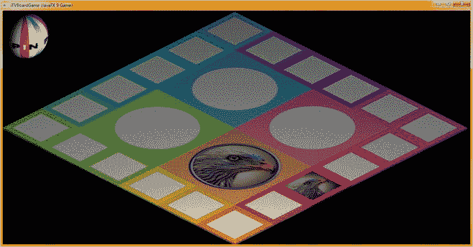

图 18-24。

Use Run ➤Project and render the quadrant 1 and square 1 texture maps to check the orientation and quality

如果每个游戏棋盘方格有 4 个随机图像可供选择，则需要 160 个图像；如果每个游戏棋盘方格有 8 个随机图像可供选择，则需要使用您在本章中学到的工作流程创建 320 个图像。

重要的是要记住，游戏棋盘方形角图像需要旋转 45 度，所有象限图像也是如此。一些游戏棋盘的正方形侧面图像(正方形 4、5、9、10、14、15、19 和 20)需要旋转 90 度才能在游戏棋盘上正确“面朝外”。在本章中，我们将会看到所有这些数字成像场景，对于一个没有编程的章节来说，这将会是一个相当长的章节，有很多 GIMP 截图。

也就是说，专业的 Java 游戏开发涉及的不仅仅是编码，因为 JavaFX 9 支持六种新的媒体类型，包括 3D、数字插图(SVG)、数字图像(PNG)、数字音频等等！

现在我们已经创建了 GameSquare1.xcf 游戏板 Square1 图像合成的基础，让我们创建其他的，用正确的周长颜色值替换纹理贴图的顶部装饰部分，并使用相同的文件名保存它们，同时每次将末尾的数字增加 1，直到您拥有所有 20 个。之后，你所要做的就是添加图像层到每一个中，为游戏棋盘方格和游戏棋盘象限创建棋盘游戏内容。事实证明，创建 Pro Java 9 游戏需要大量的艰苦工作！

我们可以使用文件➤另存为菜单序列来保存文件的另一个版本，一旦我们改变了游戏板正方形周长的颜色值，并用替代内容替换图像层。要以外科手术般的精确度做到这一点，最简单的方法是使用文件➤打开为层，并在合成的层中打开 gameboardsquare2.png 纹理贴图，使用滴管(拾色器)工具单击周边颜色以将 FG 前景色设置为该值，选择 PaintCan(颜色填充器)工具，选择透明的游戏板方形装饰层，然后单击方形颜色区域(在本例中为红色)中的 PaintCan 工具。这将用下一个(橙色)颜色值填充红色。然后，您所要做的就是删除具有默认(空白)游戏棋盘方块颜色参考的层，并使用文件➤另存为来保存 GameSquare2.xcf 合成文件，该文件现在已准备好供您填充要在第二个棋盘游戏方块中使用的图像数据。

请注意，在图 [18-25](#Fig25) 中，我将图层图像预览图标做得更大了，这样你就可以更详细地看到我对游戏棋盘 square 2 图像、边框装饰颜色等所做的工作。如果您正在使用新的 UHD (4K)显示器，这可能也是必要的，因为所有东西看起来都有点小(除非 UHD 显示器是 60 英寸或更大)。我的大多数 UHD 桌面显示器都是 43 英寸的，因为它们价格实惠。

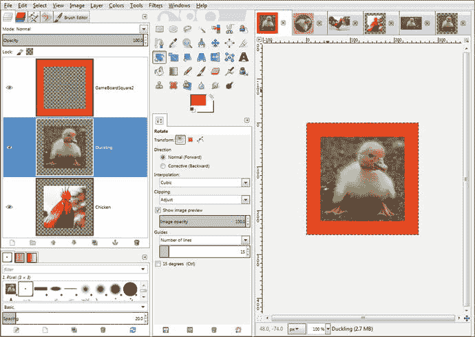

图 18-25。

Create a GameSquare2.xcf compositing file with a red-orange border and image assets to use for square 2

接下来，让我们看看如何将 GameSquare3.xcf (corner)中的图像内容旋转 45 度，以及如何将 GameSquare4.xcf 和 GameSquare5.xcf 中的图像内容旋转 90 度，使其远离游戏板，就像方块 1 和 2 中的内容一样。

如图 [18-26](#Fig26) 所示，第三个(以及第八、第十三和第十八个)游戏棋盘角方块的彩色方块周边装饰内的数字图像内容需要顺时针旋转 45 度，就像游戏棋盘象限纹理贴图一样。这将使数字图像内容在每次游戏板旋转后面向玩家。

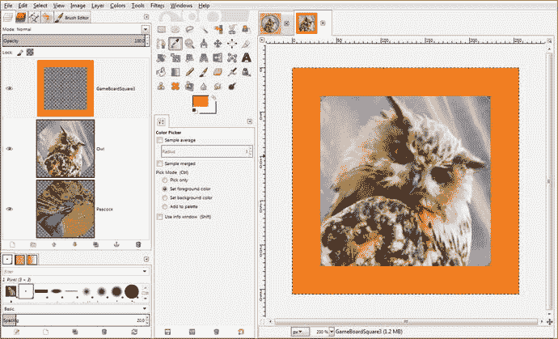

图 18-26。

Create a GameSquare3.xcf compositing file with an orange border and two image assets to use for square 3

由于这个原因，我不得不使用更高的像素分辨率值，而不是将高清正方形图像缩小到 192 像素，因为旋转会暴露一些透明像素；你可以在图 [18-26](#Fig26) 中的第二层和第三层预览图像中看到这一点(记住，灰色棋盘方块代表透明像素)。

在图 [18-26](#Fig26) 中，您可以在主要 GIMP 图像预览(画布)区域的角落中看到一点点这种透明度。我使用了 264 的下采样值，这并不完美(268 或 272 会更好)，但这对于本章中我们现在所处的内容开发和代码测试阶段来说已经足够了。

我怀疑是否有任何玩家会注意到纹理贴图图像的远处角落里的这一小撮透明像素，尤其是在它被映射到游戏棋盘的方格上之后。我将使用 Java 代码渲染棋盘游戏(就像我在本章中一直做的那样)，一旦我使用这些工作过程为游戏棋盘的象限 1 完成了 20 个纹理贴图。如果你想提前看到这一点，并确认很难看到游戏棋盘方块 3 的纹理贴图有任何问题，请随意这样做(图 [18-28](#Fig28) )。

然而，在你发布你的游戏之前，确保所有对角游戏板的正方形角落都有足够大的图像数据(比如，旋转前 272 像素，只是为了确保没有角落伪像)!

第四个和第五个(以及第九个、第十个、第十四个、第十五个、第十九个和第二十个)游戏棋盘方块的彩色方块周边装饰内的数字图像内容需要顺时针旋转 90 度，如图 [18-27](#Fig27) 所示，以便数字图像内容在每次游戏棋盘旋转后面向玩家。

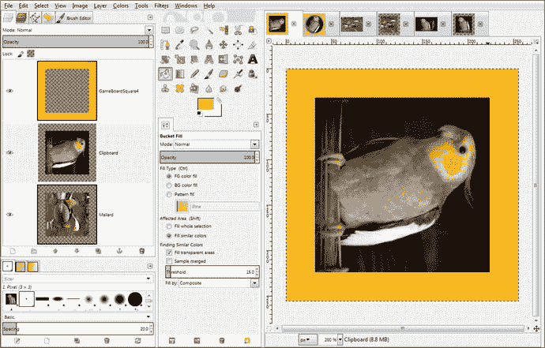

图 18-27。

The game board squares 4, 5, 9, 10, 14, 15, 19, and 20 will need to use an image rotated clockwise 90 degrees

在这种情况下，我们仍然会将您的高清方形图像缩小到 192 像素，在周边添加 64 个额外像素(居中时为 32 个)，并且，正如您在图 [18-27](#Fig27) 中的第二层和第三层预览图像中看到的，使用图层➤变换➤顺时针旋转 90°菜单序列。一旦创建了五个纹理贴图，您将在 loadImageAssets()方法中引用它们，并使用运行➤项目工作流程来测试它们，以查看它们如何映射到象限 1 游戏棋盘正方形子元素上，如图 [18-28](#Fig28) 所示。

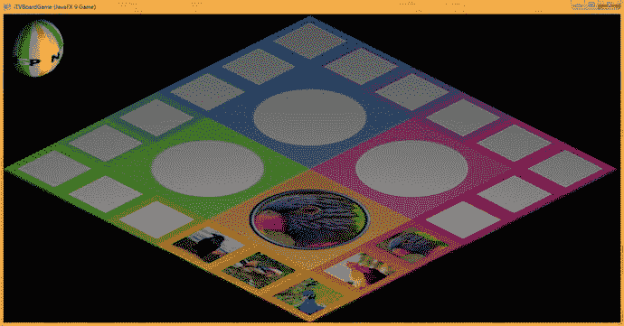

图 18-28。

Render six quadrant and square texture maps to check their orientation and quality

我要做的最后一件事是改变 diffuse6 到 diffuse10 的图像对象引用，以及 diffuse 22 的图像对象引用，以测试纹理贴图将如何应用到与象限 2 相连的游戏棋盘方格。这将告诉我，如果，以及如何，我将需要改变我的图像旋转值，因为我开发蔬菜象限纹理贴图。这是使用图 [18-10](#Fig10) 、 [18-15](#Fig15) 和 [18-23](#Fig23) 中所示的工作流程完成的，你的一半漫反射纹理贴图将引用你正在开发的纹理贴图，暂时使用你的 loadImageAssets()方法体代码。对于真正的棋盘游戏，这将在事件处理方法主体中交互地完成，基于玩家的鼠标点击，结合条件处理和随机数生成。

分别复制 diffuse1 到 diffuse5 和 diffuse6 到 diffuse10 中引用的文件名，并将最后一个数字从零更改为一(或者反过来，如果您愿意，可以混合使用的图像)。在本章结束时，您可以看到运行➤项目工作流程的结果，如图 [18-29](#Fig29) 所示。

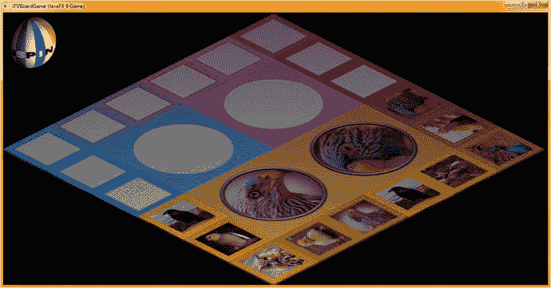

图 18-29。

Add the quadrant 1 texture maps to the quadrant 2 Java code and test the texture map orientation

图 [18-28](#Fig28) 显示了使用运行➤项目工作流程在游戏板上渲染的六个漫射纹理贴图。

正如你在图 [18-29](#Fig29) 中看到的，你将需要调整你在本章中学到的游戏板每个象限的工作过程(直到旋转值)。只要你测试你的纹理贴图，就像你在本章中学到的那样，这应该不是什么问题，并且会给你一些 GIMP 的练习。

在创建您自己的自定义数字图像内容时，您将获得本章中描述的工作流程的大量实践。GIMP 是一个令人惊奇的软件包，它的新版本很快就会问世，在某些情况下，它会超越昂贵的数字图像合成器软件包的功能！

## 摘要

在第十八章中，我们学习了更多关于 GIMP 中创建大量游戏内容所需的工作流程，我们需要这些内容来为学龄前儿童、自闭症患者和学习障碍者创建专业级教育游戏。我向您展示了为第一象限完成足够内容的工作过程，以便能够开发我们将在下一章中开发的随机内容选择 Java 代码。然后，您可以使用相同的工作流程来开发其他三个游戏板象限的内容。

您了解了如何从 Pexels.com 获得免费的商业用途内容，如何将其复制到操作系统剪贴板，以及如何使用从剪贴板创建➤特性在 GIMP 的选项卡中打开它。您学习了如何制作用于游戏棋盘象限和正方形纹理贴图的正方形图像数据，以及如何将其居中、裁剪和旋转。

在第 [19](19.html) 章中，我们将实际开发 Java 代码来实现更多的游戏性和你在本章中学到的如何创建的游戏内容，这样我们就可以在完成游戏棋盘方格和游戏棋盘象限的鼠标事件处理代码(在第 [19](19.html) 章中)方面取得一些进展。