# 十九、游戏内容引擎：人工智能逻辑与随机内容选择方法

现在你已经有了游戏板动画，并且在每次点击 3D spinner UI 元素时随机选择了一个象限，我们需要弄清楚如何以某种方式跟踪这些旋转，这将持续地告诉我们我们已经到达了哪个象限。这样，我们可以将正确的漫射纹理贴图映射到该象限的游戏棋盘方格上。我们将使用简单的数学方法来做这件事，使用 int(整数),因为一个圆中的 360 度和一个象限中的 90 度都可以被整除。这将是一个有趣的章节，因为人工智能经常可以使用紧凑的 Java 代码来编码！一旦确定了一种方法，就需要对逻辑进行大量的思考，还要进行一些测试来提炼这些值。

在这一章中，我们将创建两个新的 int (integer)变量:`spinDeg`表示旋转角度，它是玩家旋转的旋转角度的累加器(或总和),以及 quadrantLanding，它将保存一个简单而强大的计算的最新结果，它将始终告诉我们最新的旋转落在哪个象限。

我们将创建六个新方法，包括用于确定当前象限的 calculateQuadrantLanding()方法，用于在每次新旋转之前将游戏板方块纹理贴图重置为默认值的 resetTextureMaps()方法，以及用于保存随机数生成的 populateQuadrantOne()到 populateQuadrantFour()以及为玩家的每次随机旋转挑选游戏板方块内容的条件 if()处理。

## 编码随机自旋跟踪器:余数算子

为了得到一个玩家在一次旋转后降落的最新象限的结果，我们需要跟踪整个旋转次数后的百分比，特别是当我们旋转三次加上偏移时。因此，对于 if()条件 1 中的 45 + 1080，这将是象限一。对于 if()条件 2 中的 45 + 1170，这将是象限二。对于 if()条件 3 中的 45 + 1260，这将是象限三。对于 if()条件 4，对于象限四，这将是 45 + 1350。然而，对于随后的旋转，这不会总是从 45 度开始的相同偏移，因此我们需要保留一个`spinDeg` total 变量，并将每个旋转角度相加，得到一个总数，我们可以将这个总数除以 360，得到完整的旋转，然后在 Java 中使用余数%操作数，得到游戏板象限已经到达的完整旋转之后的角度旋转。在 Java 代码中，该等式类似于以下内容:

```java
int spinDeg = 45;                        // Initialize at 45 degrees
int quadrantLanding;                    //  Initialize at zero

spinDeg = spinDeg + lastSpinRotation;  //   Total Spin Angle Accumulator
quadrantLanding = spinDeg % 360;      //    Resting Angle Offset Calculation

```

象限变量将始终包含四个值之一:45(粉色或其他象限)、135(蓝色或矿物象限)、225(绿色或蔬菜象限)或 315(橙色或动物象限)。我们将创建一个名为 calculateQuadrantLanding()的方法，我们将在实现随机旋转的 MouseEvent 处理程序的末尾调用该方法。

### 实现自旋跟踪器功能:创建空方法

让我们创建两个整数变量和五个新方法的基础结构，我们需要它们来保存我们将在本章中编写的 Java 代码。这段代码将跟踪游戏板在每次旋转后停留在哪个象限，然后用随机内容处理游戏板方块的“群体”,这是我们在前一章中部分(25 %)开发的。我将使用象限 1(橙色)内容来测试我们在本章中制作的逻辑，因为我还没有创建开发初始代码所需的数百个图像素材(每个游戏棋盘方格六个，或开始时 120 个)。以后只需增加随机数生成器的上限值并更新 populateQuadrant()方法的逻辑，就可以添加更多的素材。我们在这一章要做的将会有几百行代码，所以我们会在这一章做很多编码工作，让游戏随机选择内容让玩家解决。

在 JavaFXGame 类的顶部声明一个名为 spinDeg 的 int，并将其设置为游戏板在启动时旋转的 45 度。此外，声明一个初始化为零(缺省值，因此不需要 0)的象限区域变量来保存象限旋转增量(45、135、225 或 315)。在类的底部创建五个空的公共 void 方法(您不必总是强迫 NetBeans 为您创建 Java 代码)。这应该类似于图 [19-1](#Fig1) 中用浅蓝色和黄色显示的 Java 语句和方法结构:

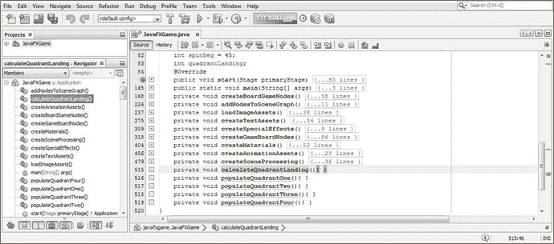

图 19-1。

Declare int spinDeg and quadrantLanding variables; create empty quadrant content population methods

```java
int spinDeg = 45;   // Gameboard is always rotated to point/corner; initialize to 45 degrees
int quadrantLanding;
...
private void calculateQuadrantLanding() {...}  // Empty Method Constructs will compile clean
private void populateQuadrantOne()      {...}
private void populateQuadrantTwo()      {...}
private void populateQuadrantThree()    {...}
private void populateQuadrantFour()     {...}

```

我们需要做的第一件事是将每次旋转的旋转量添加到 spinDeg“累加器”变量中。这将在 createSceneProcessing()方法体中的 MouseEvent 处理程序的`if(picked == spinner)`逻辑内完成，在设置每个随机象限的四个`if(spin == randomNum)`条件语句的每一个内完成。

在你的内心。createSceneProcessing()方法，并在 if(picked == spinner)条件构造内部，为四个随机旋转 if(spin == random)条件构造中的每一个添加一个累加器语句 spinDeg += degrees。

这些应该分别是`spinDeg += 1080;`、`spinDeg += 1170;`、`spinDeg += 1260;`和`spinDeg += 1350;`。正如您所看到的，传递给动画对象的角度值也应该是添加到 spinDeg 累加器变量的相同值，这样您就有了用户旋转的所有角度增量的记录。

在 spinner random number picked conditional if()结构体的底部，添加对 calculateQuadrantLanding()方法的调用，以便在旋转发生后，您可以计算该 pick 的偏移量(象限),并将该整数数据值植入(写入)到您的 quadrantLanding 变量中，以便在您的其他游戏逻辑中使用，我们将在本章稍后编写代码。接下来我们将编写 calculateQuadrantLanding()方法。

spinDeg 累加器和 calculateQuadrantLanding()方法调用的 Java 代码应如下所示，并在图 [19-2](#Fig2) 中用蓝色和黄色突出显示:

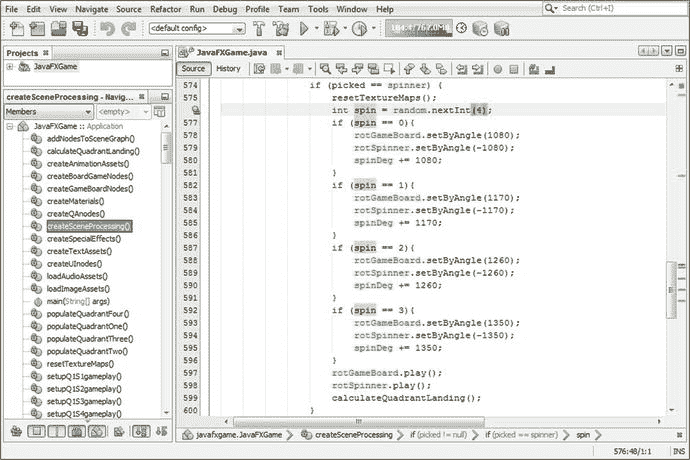

图 19-2。

Add a spinDeg accumulator to your spinner UI mouse click conditional if() logic to track where the quadrant is

```java
if (picked == spinner) {

    int spin = random.nextInt(4);      // Random Number Generator determines next quadrant

    if (spin == 0) {
        rotGameBoard.setByAngle(1080);
        rotSpinner.setByAngle(-1080);
        spinDeg += 1080;               // Add 1080 to the spinDeg total
    }

    if (spin == 1) {
        rotGameBoard.setByAngle(1170);
        rotSpinner.setByAngle(-1170);
        spinDeg += 1170;               // Add 1170 to the spinDeg total
    }

    if (spin == 2) {
        rotGameBoard.setByAngle(1260);
        rotSpinner.setByAngle(-1260);
        spinDeg += 1260;               // Add 1260 to the spinDeg total
    }

    if (spin == 3) {
        rotGameBoard.setByAngle(1350);
        rotSpinner.setByAngle(-1350);
        spinDeg += 1350;               // Add 1350 to the spinDeg total
    }

    rotGameBoard.play();
    rotSpinner.play();

    calculateQuadrantLanding();        //  Call Method to calculate quadrantLanding variable
}

```

接下来，打开空的 calculateQuadrantLanding 并添加 quadrantLanding 变量和一个等号来设置我们将要在 equals 运算符右侧定义的方程。

由于 spinDeg 累加器是我们要分解为完整旋转加上四分之一旋转偏移的值，接下来键入 spinDeg 变量，它将始终保存玩家所做的每次旋转的累积“记录”。

要找到已经着陆的最新象限，只需通过将该累计总值除以 360(一次完整旋转的度数)从该累计总值中移除所有完整旋转，以保留(提取)完整旋转之外的增量，这将指示玩家最近旋转着陆的象限。

幸运的是，Java 语言中有一个叫做余数运算符的运算符，它可以帮您完成这项工作，让您不必构建任何复杂的方程。此余数运算符在要从中提取余数的变量后使用一个%(百分比)符号，在%符号后是要除以(在本例中为累加器)变量的数字，在本例中是旋转一整圈(360)的度数。如果使用伪代码，这将是 totalspindegreasaccumulated % OneFullSpin = degrees remaining。calculateQuadrantLanding()方法的 Java 代码应该如下所示，显示在图 [19-3](#Fig3) 的底部:

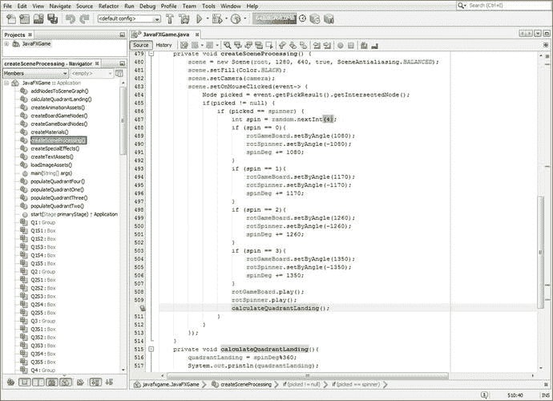

图 19-3。

Add a calculateQuadrantLanding() method and code method body and call calculateQuadrantLanding() at the end of each MouseEvent

```java
private void calculateQuadrantLanding() {
    quadrantLanding = spinDeg % 360;       // Remainder of spinDeg accumulator after all 360 spins
    System.out.println(quadrantLanding); // Print Angle Offset to Output Pane for Debugging Use
}

```

让我们使用一个运行➤项目的工作流程，看看输出窗格现在是否告诉我们自旋将落在哪个象限。这是你最终想要对玩家隐藏的信息，这样他们的“目的地”象限就不会在游戏棋盘停止旋转之前暴露出来，否则会破坏预期和游戏乐趣。

我所做的是创建图 [19-4](#Fig4) 中的截图，将 NetBeans 9 输出窗格定位(并调整大小)在游戏窗口的后面(和左边),以便可以看到角度增量(余数)的 println 输出。当我测试 i3D spinner UI 和游戏棋盘旋转周期时，这个 println 输出通知触发以确保它们现在随机并准确地落在随机游戏的不同颜色象限上(就像掷骰子，只旋转棋盘)。

当你点击微调按钮时，一个计算出来的旋转角度偏移量就会显示出来(现在的计算机速度很快)，所以你可以提前知道游戏板将要落在哪个象限。目前，我们只是试图让游戏板在每次随机旋转时落在不同的象限上，并查看象限变量中的角度值，以便我们可以在未来的代码中测试这些。我们还希望旋转许多次，以确保这些象限角度偏移值每次都是完全相同的四个整数，并且它们不会变化，因为我们只想在代码中测试四个象限角度偏移值。此变量中的任何其他值都将“破坏”此代码。幸运的是，所有涉及象限和旋转的都涉及偶数！

至于哪个角度偏移值属于每个颜色象限，我们还没有测试和改进 Java 代码。这是我们在本章将要做的一部分，以确保我们确切地知道我们的 Java 9 游戏代码和 i3D 游戏棋盘旋转象限旋转着陆视觉结果之间发生了什么。

我们还希望看到我们得到了一个随机象限选择结果，它在图 [19-4](#Fig4) 的左下角用红色圈出。

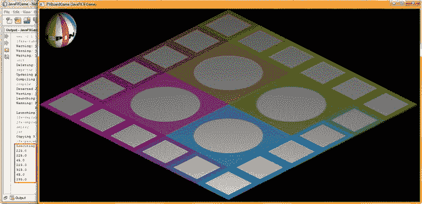

图 19-4。

Test the code to make sure that the remainder output represents one of the four quadrant rotation offsets

既然您已经确定 calculateQuadrantLanding()方法工作正常，随机象限选择也相对正常，我们需要处理填充您选择的游戏棋盘方格的代码。

### Spin: OnFinished()事件处理后填充象限

现在，我们已经在 createSceneProcessing()方法中修改了 MouseEvent 处理构造，让我们打开 createAnimationAssets()方法，并在 rotGameBoard 动画对象中添加一些事件处理，以便我们可以在动画对象的旋转周期完成时触发一些代码来填充游戏板方块。我们这样做的原因是，如果我们在旋转之前填充游戏棋盘上的方块，玩家就会知道旋转的游戏棋盘会停在哪里！此外，我想向您展示如何“连接”一个动画对象，以便它可以在播放结束后触发其他事件和代码构造，正如您可能会想到的那样，这对于 pro Java 9 游戏开发非常重要。我们将从实现一个空的事件处理基础设施开始，我们将使用它来保存条件 if() Java 逻辑，告诉游戏板方块如何使用对四个 populateQuadrant()方法之一的方法调用来填充它们自己，这四个方法是 populateQuadrantOne()到 populateQuadrantFour()。在这里，我们必须首先推测象限图中的哪个角度偏移值应该等于每个游戏棋盘象限颜色空间(橙色或动物、绿色或植物、蓝色或矿物、粉色或其他主题)。

创建初始(空)OnFinished 事件处理程序 lambda 表达式所需的 Java 9 代码如下:在图 [19-5](#Fig5) 中也用红色、黄色和蓝色突出显示:

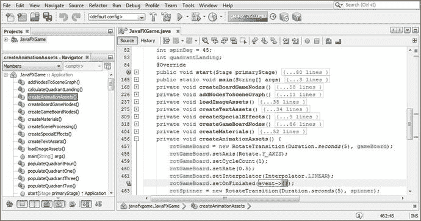

图 19-5。

The empty createAnimationAssets() setOnFinished() event handling infrastructure for the rotGameBoard Animation

```java
rotGameBoard.setOnFinished( event-> { ... } );

```

接下来，让我们使用一系列条件 if()语句来编写 rotGameBoard.setOnFinished()事件处理方法体。其中的每一个都将计算四个象限角度偏移整数值中的一个，并将该值“连接”到对位于类末尾的这四个 populateQuadrant()方法之一的方法调用。

然后，这些 populateQuadrant()方法将从您的不同内容图像中随机选择每个游戏棋盘方格，我目前有十五个(象限 1 的五个附加游戏棋盘方格中的每一个有三个)。因此，我们将有一个 random.nextInt(3)方法，该方法将从每个方块的三个图像素材中进行选择，设置漫射图像对象以引用选定的数字图像素材，然后设置该游戏棋盘方块的着色器以将该图像对象重新加载到该纹理贴图的内存中。

为了测试这一点，我们需要编写至少一个 populateQuadrant()方法；逻辑上的一个是 populateQuadrantOne()方法，因为我们已经创建了游戏棋盘象限内容(游戏棋盘方格 1 到 5)。在我们测试完这个之后。setOnFinished()事件处理程序来查看这些角度偏移是否确实将我们带到了正确的象限，然后我们将通过 populateQuadrantFour()方法体代码创建 populateQuadrantTwo()，方法体代码(临时)将象限 1 中的内容用作“虚拟”内容，仅用于代码测试目的。

你的新。setOnFinished()事件处理方法主体最初将从 45 度开始，并通过 315 度进行处理；它应该看起来像下面的代码，在图 [19-6](#Fig6) 中用蓝色和黄色突出显示:

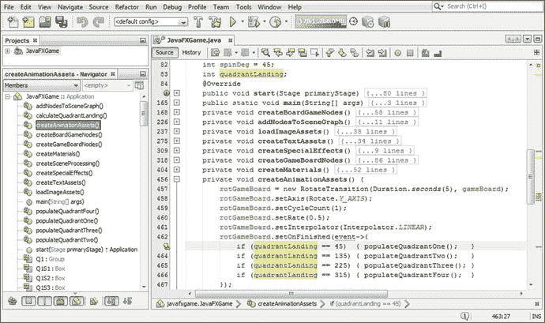

图 19-6。

In the .setOnFinished() event handler, check the quadrantLanding variable for degree offsets to determine quadrant

```java
rotGameBoard.setOnFinished(event-> {
    if (quadrantLanding == 45)  { populateQuadrantOne();   }
    if (quadrantLanding == 135) { populateQuadrantTwo();   }
    if (quadrantLanding == 225) { populateQuadrantThree(); }
    if (quadrantLanding == 315) { populateQuadrantFour();  }
});

```

对于您的第一个 populateQuadrantOne()方法体，您将拥有五个游戏棋盘方格中每一个方格的部分。第一条语句将为该正方形生成您的随机数选择，第二条语句将对其进行评估，最后一条语句将使用。setDiffuesMap(图像对象)方法调用。该方法体的 Java 语句应该如下所示，如图 [19-7](#Fig7) 所示:

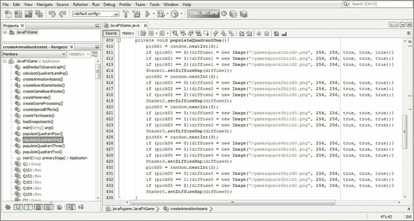

图 19-7。

Create the image load and texture map change logic in the populateQuadrantOne() method based on random number selected

```java
int pickS1 = random.nextInt(3);
if (pickS1 == 0){diffuse1 = new Image("/gamesquare1bird0.png", 256, 256, true, true, true);}
if (pickS1 == 1){diffuse1 = new Image("/gamesquare1bird1.png", 256, 256, true, true, true);}
if (pickS1 == 2){diffuse1 = new Image("/gamesquare1bird2.png", 256, 256, true, true, true);}
Shader1.setDiffuseMap(diffuse1);
int pickS2 = random.nextInt(3);
if (pickS2 == 0){diffuse2 = new Image("/gamesquare2bird0.png", 256, 256, true, true, true);}
if (pickS2 == 1){diffuse2 = new Image("/gamesquare2bird1.png", 256, 256, true, true, true);}
if (pickS2 == 2){diffuse2 = new Image("/gamesquare2bird2.png", 256, 256, true, true, true);}
Shader2.setDiffuseMap(diffuse2);
int pickS3 = random.nextInt(3);
if (pickS3 == 0){diffuse3 = new Image("/gamesquare3bird0.png", 256, 256, true, true, true);}
if (pickS3 == 1){diffuse3 = new Image("/gamesquare3bird1.png", 256, 256, true, true, true);}
if (pickS3 == 2){diffuse3 = new Image("/gamesquare3bird2.png", 256, 256, true, true, true);}
Shader3.setDiffuseMap(diffuse3);
int pickS4 = random.nextInt(3);
if (pickS4 == 0){diffuse4 = new Image("/gamesquare4bird0.png", 256, 256, true, true, true);}
if (pickS4 == 1){diffuse4 = new Image("/gamesquare4bird1.png", 256, 256, true, true, true);}
if (pickS4 == 2){diffuse4 = new Image("/gamesquare4bird2.png", 256, 256, true, true, true);}
Shader4.setDiffuseMap(diffuse4);
int pickS5 = random.nextInt(3);
if (pickS5 == 0){diffuse5 = new Image("/gamesquare5bird0.png", 256, 256, true, true, true);}
if (pickS5 == 1){diffuse5 = new Image("/gamesquare5bird1.png", 256, 256, true, true, true);}
if (pickS5 == 2){diffuse5 = new Image("/gamesquare5bird2.png", 256, 256, true, true, true);}
Shader5.setDiffuseMap(diffuse5);

```

接下来，使用您的“运行➤项目”工作流程并测试您的代码，您将在图 [19-8](#Fig8) 中看到，NetBeans 输出窗格显示，在第一次单击微调器 UI 后，quadrantlanding 变量中留下的角度偏移为 45 °,我最初将它(在原始代码中设置)为象限 1，正如您在图 [19-6](#Fig6) 中我的原始代码中看到的那样。

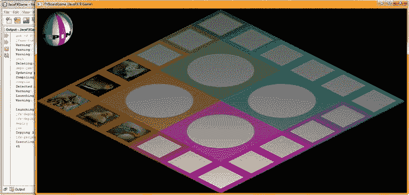

图 19-8。

Test the OnFinished code with the quadrant content code, and notice that the angle offsets are off by one

然而，屏幕上选择的象限是象限 4，这意味着我必须将 onFinished()事件处理条件 if()代码中的角度偏移量移动 1，以便 315 移动到评估语句的顶部，将其他三个角度偏移量向下推一个角度评估。

我们接下来将测试的新 Java 代码如图 [19-9](#Fig9) 所示，它将所有内容旋转一周，现在看起来像下面的条件 if()求值语句块:

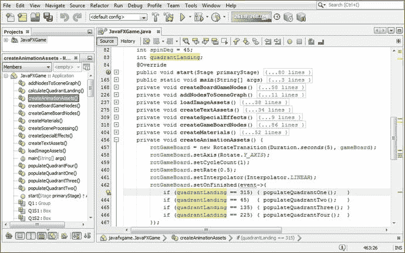

图 19-9。

Shift the angle offset evaluation down (over) by one, bringing 315 to the top and pushing the others down

```java
rotGameBoard.setOnFinished(event->{
    if (quadrantLanding == 315) { populateQuadrantOne();   }
    if (quadrantLanding == 45)  { populateQuadrantTwo();   }
    if (quadrantLanding == 135) { populateQuadrantThree(); }
    if (quadrantLanding == 225) { populateQuadrantFour();  }
});

```

让我们再次利用运行➤项目的工作过程，并测试这个新代码。当您单击旋转器时，当随机数生成器选取 315 时，游戏板现在停止在橙色象限，如图 [19-10](#Fig10) 所示。现在我们可以继续向 populateQuadrantTwo()添加代码，并继续我们的测试过程。

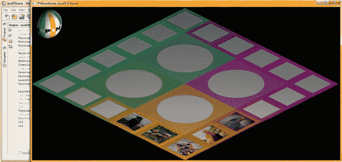

图 19-10。

Your logic now works, as evidenced by the Output Pane’s 315 value and the correct quadrant positioning

选择 populateQuadrantOne()中的 Java 代码，复制粘贴到 populateQuadrantTwo 中，将 pick 整数名称和对象名称的 1 到 5 的值改为 6 到 10，但不改变文件名，如图 [19-11](#Fig11) 所示。


图 19-11。

Duplicate populateQuadrantOne code in populateQuadrantTwo and configure the squares 6 through 10

```java
int pickS6 = random.nextInt(3);
if (pickS6 == 0){diffuse6 = new Image("/gamesquare1bird0.png", 256, 256, true, true, true);}
if (pickS6 == 1){diffuse6 = new Image("/gamesquare1bird1.png", 256, 256, true, true, true);}
if (pickS6 == 2){diffuse6 = new Image("/gamesquare1bird2.png", 256, 256, true, true, true);}
Shader6.setDiffuseMap(diffuse6);
int pickS7 = random.nextInt(3);
if (pickS7 == 0){diffuse7 = new Image("/gamesquare2bird0.png", 256, 256, true, true, true);}
if (pickS7 == 1){diffuse7 = new Image("/gamesquare2bird1.png", 256, 256, true, true, true);}
if (pickS7 == 2){diffuse7 = new Image("/gamesquare2bird2.png", 256, 256, true, true, true);}
Shader7.setDiffuseMap(diffuse7);
int pickS8 = random.nextInt(3);
if (pickS8 == 0){diffuse8 = new Image("/gamesquare3bird0.png", 256, 256, true, true, true);}
if (pickS8 == 1){diffuse8 = new Image("/gamesquare3bird1.png", 256, 256, true, true, true);}
if (pickS8 == 2){diffuse8 = new Image("/gamesquare3bird2.png", 256, 256, true, true, true);}
Shader8.setDiffuseMap(diffuse8);
int pickS9 = random.nextInt(3);
if (pickS9 == 0){diffuse9 = new Image("/gamesquare4bird0.png", 256, 256, true, true, true);}
if (pickS9 == 1){diffuse9 = new Image("/gamesquare4bird1.png", 256, 256, true, true, true);}
if (pickS9 == 2){diffuse9 = new Image("/gamesquare4bird2.png", 256, 256, true, true, true);}
Shader9.setDiffuseMap(diffuse9);
int pickS10 = random.nextInt(3);
if (pickS10 == 0){diffuse10 = new Image("/gamesquare5bird0.png", 256, 256, true, true, true);}
if (pickS10 == 1){diffuse10 = new Image("/gamesquare5bird1.png", 256, 256, true, true, true);}
if (pickS10 == 2){diffuse10 = new Image("/gamesquare5bird2.png", 256, 256, true, true, true);}
Shader10.setDiffuseMap(diffuse10);

```

现在让我们使用一个运行➤项目的工作流程，看看象限是否填充了正确的内容，因为我们已经将“哑元”(象限 1)内容放入了 populatequadranttwo()方法体。当我们单击微调器时，代码现在应该选择一个随机象限，然后用内容填充该象限。除了游戏面板前面的象限充满随机图像之外的任何视觉结果都意味着代码中仍然有一些错误，我们仍然需要继续我们的游戏开发调试过程！

正如您在图 [19-12](#Fig12) 中看到的，第一次旋转 45 度的角度偏移，我们知道是象限 3(粉色或其他内容)，选择了正确的内容，但是 onFinished 事件处理构造填充的是象限 2 (225 度角度偏移)，而不是正确的象限 3！我们还有一些调试工作要做！

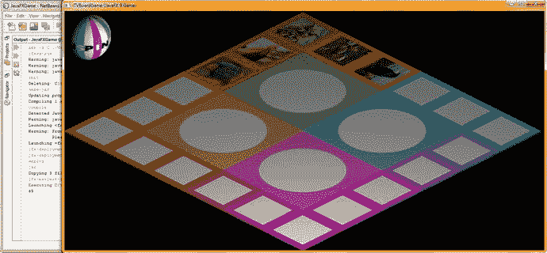

图 19-12。

Use Run ➤ Project to test your code; something is still wrong with the quadrantLanding conditional if() code

因为我们不能简单地在条件 if()求值查找矩阵中再次旋转值，所以这里一定发生了别的事情！在考虑旋转时，即使 RotateTransform 中的值是正的，我记得在使用负值来纠正微调器方向以使其向前移动时，游戏板实际上是向后或逆时针旋转的，这对于游戏板旋转来说看起来更好。因此，我不想改变这一点！这意味着我需要回到最初的 45、135、225、315 评估，并简单地反转，因为游戏板实际上在数学上是向后旋转的，所以您的正确评估顺序应该反转为 315(象限 1)、225(象限 2)、135(象限 3)，然后是 45(象限 4)。

populateQuadrant()方法对的这个新的角度评估顺序应该可以一劳永逸地解决我们的问题，所以让我们回到 OnFinished()事件处理基础结构中的 createSceneProcessing()方法体，重新排序这些 quadrantLanding = = angle 值，从 315 度开始，每次减少 90 度，直到 45 度。你可以在这里看到，你的代码和思想逻辑必须同步，才能成功地创建你的游戏逻辑！

请注意，用“虚拟内容”填充这些象限可以让您更好地确定您的游戏逻辑发生了什么，并且仍然可以将代码放在适当的位置，稍后您只需在所有游戏板内容开发完成后更改几个字符。正如你可能从上一章中了解到的，这需要和编写游戏代码一样长的时间，甚至可能更长，这取决于你要在游戏中包含多少内容。

我将尝试在每个游戏棋盘方格中提供至少三幅图像(主题或问题)。但是，对于一个专业的 Java 9 游戏，您可能希望至少有九个(使用 random.nextInt(9)方法调用)来获得内容选择频率更随机的内容外观。由于我必须在短时间内写这本书，我将无法在开发游戏逻辑、编码和截图的同时完成这本书。

除了尝试这个新的。setOnFinished()事件处理 Java 代码块，我从 populateQuadrantOne()方法体中复制粘贴 Java 代码创建 populateQuadrantThree()方法体并编辑，为下一轮测试创建游戏方块内容。如果成功了，我会对 populateQuadrantFour()做同样的事情。

经过这些修改后，您的 OnFinished()事件处理条件 if() Java 代码应该看起来就像下面的代码块，它也在图 [19-13](#Fig13) 的底部用黄色和浅蓝色突出显示:

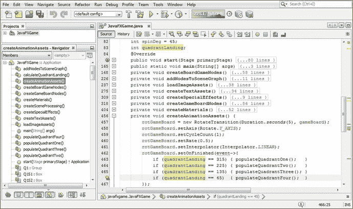

图 19-13。

Reorder the angle offset if() statements so that they evaluate to the reverse direction of the game board spin

```java
rotGameBoard.setOnFinished( event-> {
    if (quadrantLanding == 315) { populateQuadrantOne();   }
    if (quadrantLanding == 225) { populateQuadrantTwo();   }
    if (quadrantLanding == 135) { populateQuadrantThree(); }
    if (quadrantLanding == 45)  { populateQuadrantFour();  }
});

```

如图 [19-14](#Fig14) 所示，当我选择运行➤项目来测试代码时，象限和内容是正确的，尽管象限 1 内容的旋转对于其他象限是不正确的。


图 19-14。

The new angle offset evaluation code now provides the correct game board quadrant landing position

接下来，让我们完成 populateQuadrantThree()和 populateQuadrantFour()方法的创建，以便在测试游戏棋盘旋转和象限着陆代码时，我们可以在所有游戏棋盘方格中看到数字图像(视觉)内容；正如你所看到的，仍然有游戏内容设计工作要做，关于游戏板正方形图像的方向取决于它们在哪个象限被使用。

将您的 populateQuadrantTwo()(或您的 populateQuadrantOne()内容)代码结构复制并粘贴到空的 populateQuadrantThree()方法体中，并将 pickS、diffuse 和 Shader 值的范围更改为 11 到 15。暂时不要考虑图像对象引用，因为您只创建了一组象限图像资源。

将 populateQuadrantTwo()(或 populateQuadrantOne()内容)代码结构复制并粘贴到空的 populateQuadrantFour()方法体中，并将 pickS、diffuse 和 Shader 值更改为 16 到 20。暂时不要考虑图像对象引用，因为您只创建了一组象限图像资源。

图 [19-15](#Fig15) 显示了 populateQuadrantFour()的 Java if()结构，看起来像这样的 Java 代码:

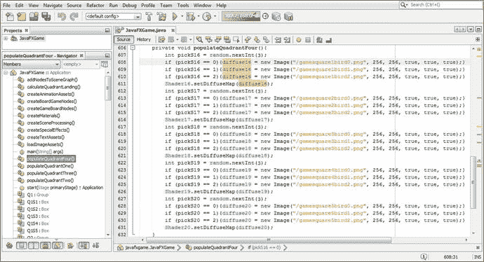

图 19-15。

Copy the populateQuadrantOne code to populateQuadrantThree and populateQuadrantFour and modify it

```java
int pickS16 = random.nextInt(3);
if (pickS16 == 0){diffuse16 = new Image("/gamesquare1bird0.png", 256, 256, true, true, true);}
if (pickS16 == 1){diffuse16 = new Image("/gamesquare1bird1.png", 256, 256, true, true, true);}
if (pickS16 == 2){diffuse16 = new Image("/gamesquare1bird2.png", 256, 256, true, true, true);}
Shader16.setDiffuseMap(diffuse16);

int pickS17 = random.nextInt(3);
if (pickS17 == 0){diffuse17 = new Image("/gamesquare2bird0.png", 256, 256, true, true, true);}
if (pickS17 == 1){diffuse17 = new Image("/gamesquare2bird1.png", 256, 256, true, true, true);}
if (pickS17 == 2){diffuse17 = new Image("/gamesquare2bird2.png", 256, 256, true, true, true);}
Shader17.setDiffuseMap(diffuse17);

int pickS18 = random.nextInt(3);
if (pickS18 == 0){diffuse18 = new Image("/gamesquare3bird0.png", 256, 256, true, true, true);}
if (pickS18 == 1){diffuse18 = new Image("/gamesquare3bird1.png", 256, 256, true, true, true);}
if (pickS18 == 2){diffuse18 = new Image("/gamesquare3bird2.png", 256, 256, true, true, true);}
Shader18.setDiffuseMap(diffuse18);

int pickS19 = random.nextInt(3);
if (pickS19 == 0){diffuse19 = new Image("/gamesquare4bird0.png", 256, 256, true, true, true);}
if (pickS19 == 1){diffuse19 = new Image("/gamesquare4bird1.png", 256, 256, true, true, true);}
if (pickS19 == 2){diffuse19 = new Image("/gamesquare4bird2.png", 256, 256, true, true, true);}
Shader19.setDiffuseMap(diffuse19);

int pickS20 = random.nextInt(3);
if (pickS20 == 0){diffuse20 = new Image("/gamesquare5bird0.png", 256, 256, true, true, true);}
if (pickS20 == 1){diffuse20 = new Image("/gamesquare5bird1.png", 256, 256, true, true, true);}
if (pickS20 == 2){diffuse20 = new Image("/gamesquare5bird2.png", 256, 256, true, true, true);}
Shader20.setDiffuseMap(diffuse20);

```

使用“运行➤项目”工作流程，并多次单击微调器 UI 来彻底测试代码。您应该看到的是，每次游戏板落在正确的象限上，如 NetBeans 9 输出窗格中所指定的那样，游戏板方格将使用动物图像填充正确的象限，如图 [19-16](#Fig16) 所示。

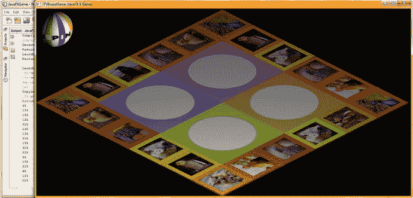

图 19-16。

All the angle spin evaluations are now correct, eventually filling all Shaders with texture map image data

请注意，纹理贴图的颜色和方向与每个象限的配色方案和方向还不匹配，但话说回来，当你在 GIMP 中工作时，你可以使用这个渲染预览向你展示你需要做什么来实现这一点，我在上一章关于游戏内容的 [18](18.html) 中向你展示了如何做。

### 纹理映射管理:编码一个 resetTextureMaps()方法

从图 [19-16](#Fig16) 中可以看出，下一个编程任务是编写方法，在下一个旋转动画开始之前将游戏板重置为默认(空)状态。这是通过用新的图像资源引用重新实例化图像对象(当前没有 setImageReference()方法调用，尽管应该有)，将漫射颜色贴图数字图像引用设置回它们的默认文件来完成的。这将迫使 Java 9 对内存中先前引用的图像进行垃圾收集(重新分配),并用引用的新图像数据替换它。您还必须在下一行代码中引用关联的 Shader 对象，以将 Shader 对象重新插入内存，新的引用数据指向刚刚加载到内存中的新图像对象。由于我们将始终使用您的默认(空白)纹理贴图，这可以在一个 resetTextureMaps()方法中实现，该方法不会改变，但在每次后续随机游戏板旋转开始之前(即，在处理您的`if(pressed == spinner)`条件 if()构造中的其余语句之前)，当调用该方法时，会将您的 3D 游戏板方块重置为其默认的未填充(带有数字图像主题或问题内容)状态。

回到你的 createSceneProcessing()方法，在你的`if (picked == spinner) { ... }`构造的顶部添加一个`resetTextureMaps();`方法调用，如图 [19-17](#Fig17) 所示。NetBeans 会弹出一个帮助菜单，为您编写方法体，因此在 javafxgame 中选择并双击创建方法“resetTextureMaps()”。JavaFXGame 选项，在图 [19-17](#Fig17) 中间用蓝色显示。

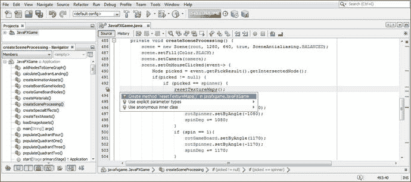

图 19-17。

Add the resetTextureMaps() method call to the MouseClick event handling code; press Alt+Enter to have NetBeans create it

使用复制粘贴编程技术创建这个新的方法体相对容易。您只需键入引用 gameboardsquare.png 的新图像实例化 Java 语句，并键入新 Shader1 语句，将 setDiffuseMap()方法设置为 diffuse1 图像对象。之后，您所要做的就是选择这两行代码，在前两行代码下面再复制 19 次，将 1 更改为数字 2 到 20，并将这些数字添加到 PNG 文件名的末尾，这将引用不同颜色的默认游戏棋盘方形纹理贴图资源。

这将产生以下 40 条 Java 编程语句，在图 [19-18](#Fig18) 中也用浅蓝色和黄色显示:

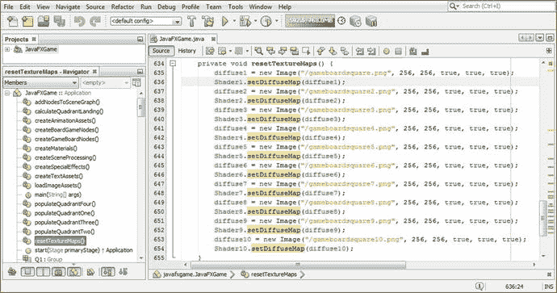

图 19-18。

Re-create the default Shader and diffuse statements for the blank game board in the body of resetTextureMaps()

```java
private void resetTextureMaps() {
    diffuse1 = new Image("/gameboardsquare.png", 256, 256, true, true, true);
    Shader1.setDiffuseMap(diffuse1);
    Diffuse2 = new Image("/gameboardsquare2.png", 256, 256, true, true, true);
    Shader2.setDiffuseMap(diffuse2);
    Diffuse3 = new Image("/gameboardsquare.png3", 256, 256, true, true, true);
    Shader3.setDiffuseMap(diffuse3);
    diffuse4 = new Image("/gameboardsquare.png4", 256, 256, true, true, true);
    Shader4.setDiffuseMap(diffuse4);
    Diffuse5 = new Image("/gameboardsquare.png5", 256, 256, true, true, true);
    Shader5.setDiffuseMap(diffuse5);
    Diffuse6 = new Image("/gameboardsquare.png6", 256, 256, true, true, true);
    Shader6.setDiffuseMap(diffuse6);
    Diffuse7 = new Image("/gameboardsquare.png7", 256, 256, true, true, true);
    Shader7.setDiffuseMap(diffuse7);
    Diffuse8 = new Image("/gameboardsquare.png8", 256, 256, true, true, true);
    Shader8.setDiffuseMap(diffuse8);
    Diffuse9 = new Image("/gameboardsquare.png9", 256, 256, true, true, true);
    Shader9.setDiffuseMap(diffuse9);
    diffuse10 = new Image("/gameboardsquare.png10", 256, 256, true, true, true);
    Shader10.setDiffuseMap(diffuse10);
    diffuse11 = new Image("/gameboardsquare.png11", 256, 256, true, true, true);
    Shader11.setDiffuseMap(diffuse11);
    diffuse12 = new Image("/gameboardsquare.png12", 256, 256, true, true, true);
    Shader12.setDiffuseMap(diffuse12);
    diffuse13 = new Image("/gameboardsquare.png13", 256, 256, true, true, true);
    Shader13.setDiffuseMap(diffuse13);
    diffuse14 = new Image("/gameboardsquare.png14", 256, 256, true, true, true);
    Shader14.setDiffuseMap(diffuse14);
    diffuse15 = new Image("/gameboardsquare.png15", 256, 256, true, true, true);
    Shader15.setDiffuseMap(diffuse15);
    diffuse16 = new Image("/gameboardsquare.png16", 256, 256, true, true, true);
    Shader16.setDiffuseMap(diffuse16);
    diffuse17 = new Image("/gameboardsquare.png17", 256, 256, true, true, true);
    Shader17.setDiffuseMap(diffuse17);
    diffuse18 = new Image("/gameboardsquare.png18", 256, 256, true, true, true);
    Shader18.setDiffuseMap(diffuse18);
    diffuse19 = new Image("/gameboardsquare.png19", 256, 256, true, true, true);
    Shader19.setDiffuseMap(diffuse19);
    Diffuse20 = new Image("/gameboardsquare.png20", 256, 256, true, true, true);
    Shader20.setDiffuseMap(diffuse20);
}

```

请注意，我只显示了图 [19-18](#Fig18) 中一半的语句，因为我的高清显示器无法显示所有语句，但仍然显示(包含)NetBeans IDE UI。我猜是时候升级到 4K UHD 显示器了！

使用一个运行➤项目的工作流程，如图 [19-19](#Fig19) 所示，来彻底测试我们到目前为止开发的代码。它工作稳定。

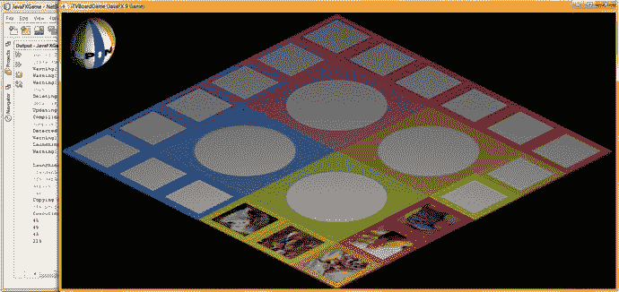

图 19-19。

As you see in the Output Pane, subsequent random spinner clicks now populate the correct quadrant

我们已经添加了更多的核心游戏功能，这些功能是在本章中控制和随机化您的游戏棋盘方块内容和游戏所需要的，并且我们已经设置了您的 Java 代码，以便在您每次添加一个方块内容图像时，只需增加`random.nextInt(` `bounds` `)`(绑定变量)，就可以轻松地添加更多内容。这使得我们的游戏很容易扩展，这对专业的 Java 9 游戏设计很重要。

您还需要添加 if()语句(或者，如果您有两个或三个以上的内容选项可供选择，更有可能的是，改为使用 Java case 语句)来添加代码逻辑，以允许游戏从给定方块的不同图像选项中随机选择。我们将在下一章中增强这些代码，因为我们将继续用 populateQuadrant()方法自己的(非虚拟)内容对其进行改进，并为玩家添加点击游戏方块的功能，并使用我们在第 [17](17.html) 章中已经开发的象限纹理贴图将所选内容填充到当前象限中。在这一点上，我们将准备添加与游戏广场内容选择直接相关的游戏，挑战我们的游戏玩家的知识体系，并在这个过程中教育他们。

请注意，我们仍然只有不到 700 行的 Java 代码，包含 17 个方法(平均每个方法 39 行)，正如您在 NetBeans 底部的图 [19-18](#Fig18) 中看到的那样(在我添加最后 20 个 Java 语句之前，类的末尾是第 655 行，所以，基本上我们在第 675 行)。

## 摘要

在第十九章中，我们学习了如何实现游戏棋盘方块内容的随机选择，同时实现更多的游戏代码，这些代码可以智能地跟踪游戏棋盘的旋转，并使用 Java 数学运算符和简单而强大的编程算法和结构来确定象限在每次旋转中的位置。我们在角度偏移评估的顺序和这些指向的 populateQuadrant()方法中调试了几个问题，并且我们找到了一种将图像加载到内存中的方法，而无需一次在系统内存中声明二十多个游戏板漫反射纹理图像。这种方法允许我们向游戏应用添加数百个内容图像，而不会产生内存不足的错误。

我们构造了几个新的自定义方法，包括 resetTextureMaps()、calculateQuadrantLanding()、populateQuadrantOne()、populateQuadrantTwo()、populateQuadrantThree()和 populateQuadrantFour()。

我们在 createSceneProcessing()方法的鼠标事件处理逻辑中添加了更多的游戏逻辑，这样在每次旋转中，游戏 AI 逻辑将会跟踪游戏启动后的每一次旋转。这将允许我们开发一种算法，计算每次旋转时的着陆角度，这将为游戏逻辑提供每次旋转的当前“着陆象限”的知识，这对我们将开发的所有其他游戏逻辑至关重要。

我们开发了一个优雅的解决方案，仅使用整数(角度中的度数)或整数(整数),通过使用 Java % remainder 运算符将 spinDeg 累加器变量除以 360 度，仅保留 delta(最新的象限角度偏移),该运算符将分子(spinDeg total)除以除数(360 度),并将余数放在等号(=)运算符另一侧的象限变量中。

我们开发了四个 populateQuadrant()方法来保存代码，这些代码为每个象限的五个游戏棋盘方格随机选择内容。这些方法可以随着游戏内容的增加而扩展。

我们还开发了一个 resetTextureMaps()方法，在下一次旋转之前将游戏板重置为默认的空白状态。我们看到了如何“重用”图像实例化，引用不同的纹理贴图。这将请求 Java 9 执行垃圾收集来重新加载图像内容内存位置，而不是必须将游戏内容的每个纹理贴图的图像对象加载到系统内存中，这将导致内存不足错误！

在第 [20](20.html) 章中，你将开发额外的游戏代码基础设施，它将处理当玩家点击(选择)游戏方块内容本身时发生的事情，这样你就可以完成鼠标事件处理代码，该代码涉及与 3D 旋转器 UI 和每个游戏棋盘方块相关的点击事件。我们还将在下一章中添加相机动画对象，这样你的相机对象就可以在更靠近你的电路板的地方制作动画了！