# 二十一、问答：完成启动方法和数字音频

现在，您的玩家可以为每个棋盘游戏方块单击多个图像来选择要回答的视觉问题，我们可以在他们自己的 UI 中添加这些问题的答案。这将使用第二个 qaLayout StackPane 对象和四个子 Button 对象来完成，这将我们的 SceneGraph 层次结构扩展为四个分支(一个用于 3D，一个用于 2D UI，一个用于 3D UI，一个用于 2D 答案内容)。在下一章中，当我们实现我们的评分引擎和游戏右侧的 2D 评分内容 UI 区域时，我们将为评分添加第五个顶级分支。

在本章中，我们将继续使用所有基于文本的答案内容来填充 20 个`setupQSgameplay()`方法，这些内容与我们在第 [20 章](20.html)中添加的视觉效果(问题)相匹配。我们还将向您的 SceneGraph 添加 qaLayout 分支，它包括一个 StackPane 背景和四个大按钮 UI 元素。玩家将使用这些来选择正确的答案，揭示该方块的视觉代表什么。

这意味着在本章中你将增加几百行代码。幸运的是，您可以使用一种最佳的“编写一次代码，然后复制、粘贴和修改”的方法，因此不需要太多的输入！我只需要向您展示如何向一个 setupQ1S1gameplay()方法添加一组答案，然后您将能够添加其余的视觉问题的答案选项，因此我不需要在本章的代码(文本)和图形中实际添加数百行 Java 9 代码。但是，我必须将它们添加到源代码中，您可以下载源代码。

一旦我们完成游戏“答案选择和显示”基础设施的大部分编码，并测试每个象限以确保其工作，我们就可以在第 [22](22.html) 章创建 Java 代码的得分部分。我们还将研究 JavaFX AudioClip 类，它允许我们添加音频音效。这将使用 JavaFX API(环境)的另一个新媒体组件(数字音频)进一步增强 pro Java 9 游戏体验。

## 完成游戏:添加 qaLayout 分支

本章第一部分的主要任务是通过在游戏中添加选择答案的用户界面来完成游戏。我们还将为 setupQSgameplay()方法加载每个可视问题的文本(按钮标签)答案。我们将在这一章的前半部分这样做，然后在这一章的后半部分给游戏添加一些音效。我们将从一点自定义方法组织开始，并对我们的方法进行分层，以便有一个用于 3D 节点组件，一个用于游戏启动时看到的 2D UI 节点组件，一个用于选择答案的 2D UI 节点组件(我们将在本章中创建)，在下一章中，一个用于 2D UI 节点组件，用于创建评分引擎。在对 Java 代码进行了一些重新配置之后，我们将使用 StackPane 来保存四个大按钮 UI 元素，从而为问答面板创建 UI 基础结构。在我们创建了将这个 UI 放置到位的基本代码之后，我们将“调整”它的设置，以在我们在第 [20](20.html) 章中创建的相机放大动画对象中最佳地工作，因为这个动画移动了相机的位置和旋转，这无疑将改变 2D Q&UI 窗格在您的显示器上的视觉呈现方式。

### 添加另一个组织层:createUInodes()方法

让我们将 createBoardGameNodes()方法分成两个部分，一个用于创建 3D 场景对象(如点光源、平行摄像机、游戏板、3D 旋转 UI 和游戏板象限),另一个用于保存我们在本书前几章中创建的 2D UI 对象。这将在每个方法体中放置 20 到 30 条语句，并在我们创建 createQAnodes()方法来保存节点对象之前更好地组织场景图的每个部分，这些节点对象将创建和配置我们的问答面板，这是我们接下来要做的。选择应该看起来像图 [21-1](#Fig1) 中用蓝色显示的 34 个 Java 语句。


图 21-1。

Select and cut your uiLayout branch Node statements and paste them into a createUInodes() method body

右键单击选择集，如图 [21-1](#Fig1) 中蓝色部分所示，选择一个剪切选项，从 createBoardGameNodes()方法中删除语句。这将把它们放到你的操作系统剪贴板中，然后粘贴到我们将要创建的新的 createUInodes()方法中。

在 start()方法中，在`createBoardGameNodes();`之后添加一行代码，并创建一个对 createUInodes()方法的方法调用，该方法尚不存在。使用 Alt+Enter 组合键让 NetBeans 为您创建此方法，创建后如图 [21-2](#Fig2) 中黄色和浅蓝色所示。

NetBeans 9 将创建这个新的方法和占位符错误代码，我们将选择它(确保只选择错误代码语句，而不是方法体),然后使用粘贴将错误代码语句替换为 34 个 Java 语句，这些语句创建了我们的 uiLayout SceneGraph 节点层次结构，它当前位于操作系统剪贴板中。我还选择了整个方法体(必须在用剪贴板代码替换引导错误代码之后完成)，并将其从类的末尾剪切并粘贴到 createBoardGameNodes()方法体之后。这使得 20 个 setupQSgameplay()方法体留在了类的末尾，因为我们将在这些类中添加问题(图片)答案，作为游戏制作工作的一部分，必须在本章中完成。

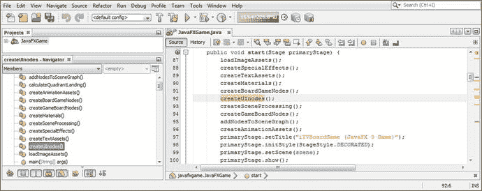

图 21-2。

Create the createUInodes() method call after the createBoardGameNodes() method call and use Alt+Enter

这两个新方法如图 [21-3](#Fig3) 所示，只是对之前方法的 Java 代码进行了重新配置。在创建 createQAnodes()方法之前，我们只是在这里进行了一点代码组织。

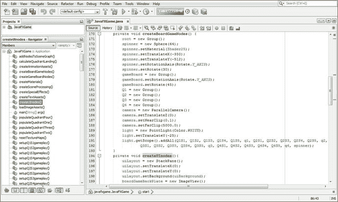

图 21-3。

You’ve now reorganized the Node object creation into the createUInodes() and createBoardGameNodes() methods

在 createUInodes()方法后添加一行代码，并键入 createQAnodes()方法名和一个分号，如图 [21-4](#Fig4) 中突出显示的。使用 Alt+Enter 组合键，让 NetBeans 编写引导方法主体代码。

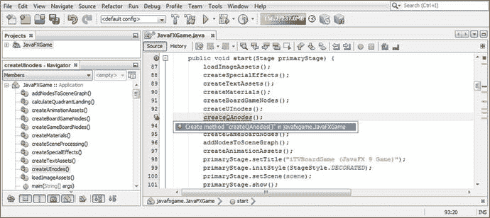

图 21-4。

Add a line of code after the createUInodes() method call, add the createQAnodes() method call, and press Alt+Enter

使用剪切和粘贴将 createQAnodes()方法移动到 createAnimationAssets()方法调用之后，如图 [21-5](#Fig5) 所示。将 qaLayout StackPane 对象添加到类顶部的声明中，使其成为复合语句。然后在 createQAnodes()方法中实例化 qaLayout StackPane，并使用 setTranslate()方法将其配置在-250 和-425 X，Y 位置。另外，设置一种颜色。白色背景色，并使用 setPrefSize()方法调用为 StackPane 设置一个 400x500 的首选大小，如图 [21-5](#Fig5) 中突出显示的。

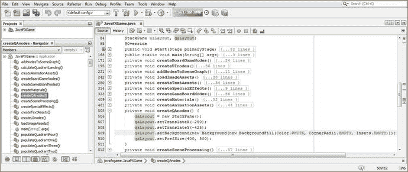

图 21-5。

Declare and instantiate a qaLayout object and configure it for location, color, and size in createQAnodes()

一旦完成，如图 [21-5](#Fig5) 所示的 Java 9 代码应该看起来像下面的 Java 9 语句:

```java
StackPane uiLayout, qaLayout;    // Declaration at the top of the JavaFXGame class
...

qaLayout = new StackPane();      // Statements inside of the createQAnodes() method body
qaLayout.setTranslateX(-250);
qaLayout.setTranslateY(-425);
qaLayout.setBackground(new Background(new BackgroundFill(Color.WHITE, CornerRadii.EMPTY,
                                                         Insets.EMPTY) ) );
qaLayout.setPrefSize(400, 500);

```

在我们可以渲染 i3D 场景以查看初始问答布局结果(最终将进行微调)之前，我们需要使用 getChildren()将 qaLayout StackPane 添加到 addNodesToSceneGraph()方法中的 SceneGraph 根对象。addAll()方法链。否则，它将不会显示在“运行➤”项目中使用的渲染中。

另请注意，此 qaLayout StackPane 需要放置在第二个位置(新的 SceneGraph 层次结构中现在包含的四个顶级节点分支的第二个位置)，以便它位于 gameBoard 3D 游戏板模型的前面，uiLayout 用户界面 StackPane 和 3D spinner 游戏板 spin Sphere 3D UI 元素的后面。

这一增加显示在下面的 Java 9 代码语句中，并在图 [21-6](#Fig6) 的中间以浅蓝色和黄色突出显示:

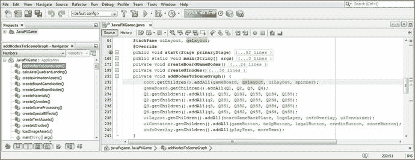

图 21-6。

Add the qaLayout StackPane object to the root.getChildren.addAll() method call list in the second position

```java
root.getChildren().addAll(gameBoard, qaLayout, uiLayout, spinner);

```

让我们使用运行➤项目工作流程，看看我们对游戏左侧问答面板的基本 2D StackPane 配置参数的猜测有多准确。正如你将在图 [21-7](#Fig7) 中看到的，Java 代码正在工作，但是在你的 StackPane 背景颜色中有一些半透明的问题，并且由于在 Z 维度中的(未指定的)位置而与游戏板相交。此外，我们在预放大相机设置中进行了布局，所以一旦我们修复了这个 Z 定位问题，我们可能还需要调整一些或所有的位置和大小设置，这些都是我们最初设置的(在为了我们的 Q & A UI 测试而深入游戏代码之前)。这将允许我们快速生成 Java 代码，并在以后对其进行调整。

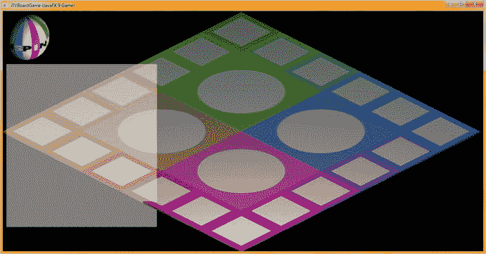

图 21-7。

Use your Run ➤ Project work process and test your new Java code to see whether it gives you the desired results

使用以下 setTranslateZ() Java 方法调用将 qaLayout StackPane 对象的 Z 位置向屏幕前方移动-75 个单位，在图 [21-8](#Fig8) 中用浅蓝色和黄色突出显示:

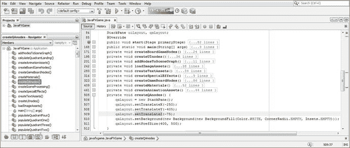

图 21-8。

Add a setTranslateZ(-75) method call off the qaLayout object to move it 75 units toward the front screen

```java
qaLayout.setTranslateZ(-75);

```

同样，使用运行➤项目工作流程，并通过向前移动 z 轴来测试这个新的 Java 代码，看看它是否给出了您想要的结果。正如你在图 [21-9](#Fig9) 中看到的，StackPane 现在被正确地渲染成一个白色的正方形。

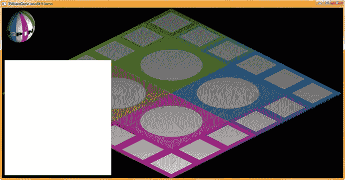

图 21-9。

Use your Run ➤ Project work process and test your new Java code to see whether it gives you the desired results

下一个任务是在类的顶部添加四个应答按钮元素 a1Button 到 a4Button 声明，并在 createQAnodes()方法中实例化和配置这些按钮对象。我使用 setMaxSize()将它们调整为 350 个单位宽和 100 个单位高，并使用 setTranslateY()将它们放置在-180、-60、60 和 180 处。出于 UI 设计测试的目的，我使用 setText()方法将它们命名为答案 1 到答案 4。实现这四个按钮 UI 元素所需的 Java 9 代码如图 [21-10](#Fig10) 和 [21-11](#Fig11) 所示，如下所示:

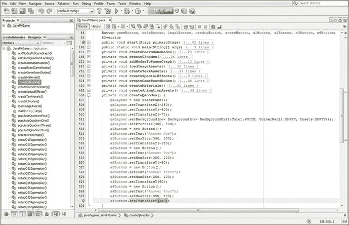

图 21-10。

Add four 350x100 Button UI objects at Y location -180, -60, 60, 180, labeled Answer One through Answer Four

```java
Button gameButton, ..., a1Button, a2Button, a3Button, a4Button;   // at top of JavaFXGame class

a1Button = new Button();                                // statements in createQAnodes() method
a1Button.setText("Answer One");
a1Button.setMaxSize(350, 100);
a1Button.setTranslateY(-180);

a2Button = new Button();
a2Button.setText("Answer Two");
a2Button.setMaxSize(350, 100);
a2Button.setTranslateY(-60);

a3Button = new Button();
a3Button.setText("Answer Three");
a3Button.setMaxSize(350, 100);
a3Button.setTranslateY(60);

a4Button = new Button();
a4Button.setText("Answer Four");
a4Button.setMaxSize(350, 100);
a4Button.setTranslateY(180);
...                                               // Remember to add Button Nodes to SceneGraph

qaLayout.getChildren().addAll(a1Button, a2Button, a3Button, a4Button); // addNodesToSceneGraph()

```

请记住，我们必须通过在 Q1 到 Q4 节点对象之后添加 qaLayout 节点并调用 getChildren()来将这些按钮对象添加到场景图层次结构中。addAll()方法链，将四个按钮对象作为子对象添加到 SceneGraph 层次结构中。Java 语句在图 [21-11](#Fig11) 中突出显示。

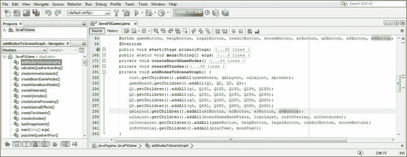

图 21-11。

Add the four Button UI elements to the SceneGraph , using a qaLayout.getChildren().addAll() method call

同样，使用“运行➤项目”工作流程，通过添加“答案按钮”对象来测试这个新的 Java 代码，看看它是否给出了您想要的结果。正如你在图 [21-12](#Fig12) 中看到的，StackPane 正在渲染，我们需要处理的只是按钮表面使用的字体系列和字体大小，这样文本就很大，玩家可以阅读。

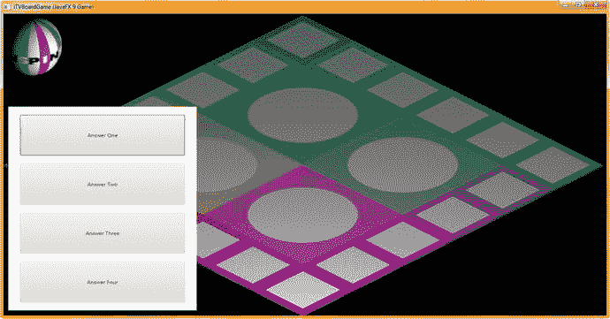

图 21-12。

Use your Run ➤ Project work process and test your first try at your Q&A hierarchy creation and rendering

在每个 setText()方法调用之后添加一个最终的 setFont()方法调用，以设置字体系列，在本例中是一个漂亮的、可读的 Arial 黑色字体，以及字体大小。最初，我们在这个按钮上能装的最大尺寸是 30 个单位，这是相当大的。在 setFont()方法调用中，我们嵌套了一个 Font.font()方法调用，它创建了这个 Font 对象，用 Arial 黑色字体加载它，并将其大小设置为 30。这显示在下面的 Java 代码中，并在图 [21-13](#Fig13) 中突出显示:

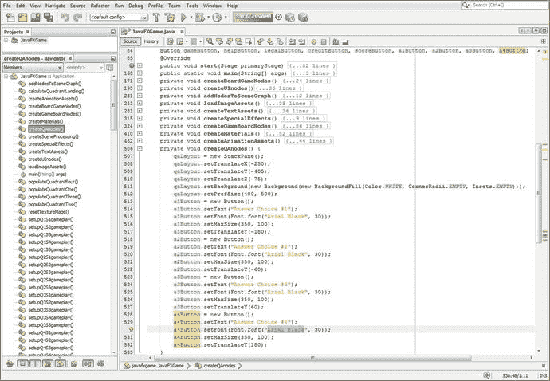

图 21-13。

Add the setFont (Font.font(“Arial Black”, 30)) method call to each Button after the setText() method call

```java
a1Button = new Button();
a1Button.setText("Answer One");
a1Button.setFont(Font.font("Arial Black", 30));
a1Button.setMaxSize(350, 100);
a1Button.setTranslateY(-180);
a2Button = new Button();
a2Button.setText("Answer Two");
a2Button.setFont(Font.font("Arial Black", 30));
a2Button.setMaxSize(350, 100);
a2Button.setTranslateY(-60);
a3Button = new Button();
a3Button.setText("Answer Three");
a3Button.setFont(Font.font("Arial Black", 30));
a3Button.setMaxSize(350, 100);
a3Button.setTranslateY(60);
a4Button = new Button();
a4Button.setText("Answer Four");
a4Button.setFont(Font.font("Arial Black", 30));
a4Button.setMaxSize(350, 100);
a4Button.setTranslateY(180);

```

在我们编写代码以在 JavaFXGame 代码的剩余部分中实际实现这个新的问答 UI 之前，让我们最后一次利用运行➤项目工作流程。我们需要隐藏 StackPane 和子按钮对象，直到需要向玩家显示答案选项。我们还需要在相机动画的结尾显示这个 StackPane，这将使相机倾斜和缩放到游戏板上，改变相机的角度和距离，这可能会改变 StackPane 和 Button 对象的渲染方式，因此需要“调整”大小和位置设置。当我们在 start()方法和 createAnimationAssets()方法中实现完 StackPane 和 Button 对象的问答 UI 设计后，我们可以返回到前面的代码，调整数值以微调它在自顶向下的“游戏板问答视图”中的外观

正如你在图 [21-14](#Fig14) 中看到的，这些按钮 UI 对象上使用的字体系列和字体大小在可读性方面与图 [21-12](#Fig12) 有很大的不同。我能看到的唯一问题是面板有点太高了，在边缘和按钮 UI 元素之间有太多的空间，我们将在稍后在我们已经编写的 Java 代码中实现这个 Q & A UI 之后解决这个问题。记住，游戏开发是一个迭代的过程！

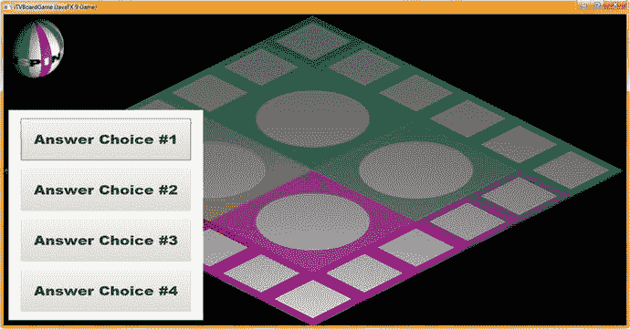

图 21-14。

Use your Run ➤ Project work process and make sure that the text on the buttons is readable

接下来，让我们休息一下，在当前代码中实现这个 StackPane 和按钮的外观。

### 在 JavaFXGame 中实现新的问答用户界面

在开始游戏按钮 gameButton.setOnAction()事件处理基础设施中，我们需要做的第一件事是在游戏启动时隐藏问答 UI 面板。之后，一旦相机放大到游戏板象限，我们将需要显示这个问答 UI 面板，这将需要在 createAnimationAssets()方法体的末尾添加一个 setOnFinished()方法调用。要在单击开始游戏按钮时隐藏 qaLayout Q&A panel StackPane，只需复制 gameButton.setOnAction()基础结构内 handle()事件处理程序中的第一个 Java 语句，并将其粘贴到自身下方；然后将 uiLayout 更改为 qaLayout，如下图所示，如图 [21-15](#Fig15) 中突出显示的:

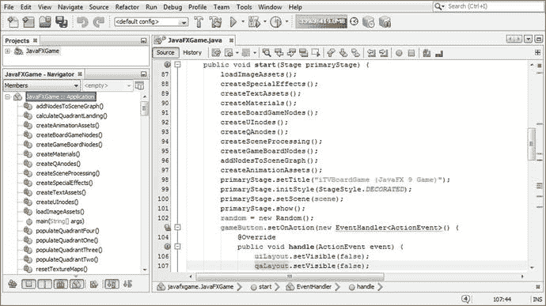

图 21-15。

Hide the Q&A UI panel on the game startup by using qaLayout.setVisible(false) in the start() method

```java
gameButton.setOnAction(new EventHandler<ActionEvent>() {  // Using non-Lambda Expression Format
    @Override
    public void handle(ActionEvent event) {
        uiLayout.setVisible(false);
        qaLayout.setVisible(false);
        camera.setTranslateZ(500);
        camera.setTranslateY(-300);
        camera.setTranslateX(-260);
        camera.setRotationAxis(Rotate.X_AXIS);
        camera.setRotate(-30);
        spinnerAnim.play();
    }
});

```

第一次隐藏问答 UI 面板(直到需要它时)后要做的下一件事是，一旦玩家选择了他们想要玩的游戏棋盘方块，在 3D 相机旋转并移动到游戏棋盘后立即显示它。这里的理论是，由于新的摄像机焦距(单元重新定位)和摄像机角度(从 30 度旋转到 60 度)，新的问答面板视觉特征可能已经改变。换句话说，不同的呈现参数可能已经改变了 StackPane、Button 甚至字体特征中的任何一个(或全部)。

事实上，毫不奇怪，这确实发生了，所以在我们实现了新的 cameraAnimIn.setOnFinished()事件处理程序之后，我们需要返回到 createQAnodes()方法体中，并“调整”Q&A UI 面板参数，使其与“问题答案选择”游戏视图的左下角更紧密地对齐。我们还将收紧回答按钮 UI 元素周围的间距，并增加字体大小！

在 cameraAnimIn ParallelTransition 对象实例化之后，添加您对 cameraAnimIn 对象的 setOnFinished()方法调用，并放置一个 QA layout . set visible(true)；事件处理基础结构中的语句，以便在玩家单击他们认为会知道答案的游戏棋盘方格后，摄像机放大到随机选择的游戏棋盘象限后，可以看到您的问答 UI 面板。

这里显示了这个新的 Java 代码结构，在图 [21-16](#Fig16) 中用蓝色和黄色突出显示:

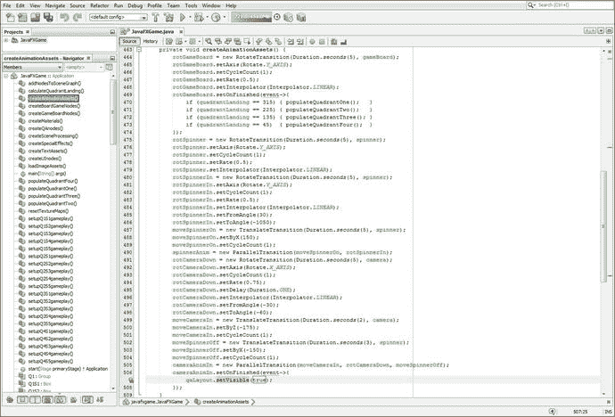

图 21-16。

Add a cameraAnimIn.setOnFinished() method call and add qaLayout.setVisible(true) to the event handler

```java
private void createAnimationAssets() {
    ...
    cameraAnimIn = new ParallelTransition(moveCameraIn, rotCameraDown, moveSpinnerOff);
    cameraAnimIn.setOnFinished(event->{
        qaLayout.setVisible(true);
    });
}

```

正如你在图 [21-17](#Fig17) 中看到的，当你使用运行➤项目来测试你刚刚添加的 setOnFinished()代码时，你会看到改变你的摄像机视图和位置已经改变了你的 Q & A 面板布局。

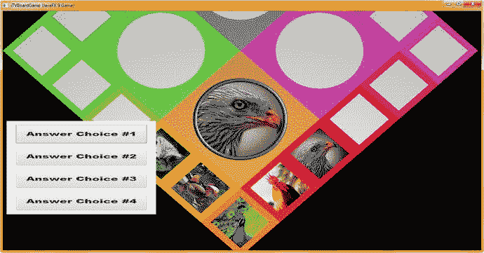

图 21-17。

Use Run ➤ Project to see whether the camera has changed the Q&A panel layout

接下来，让我们调整 createQAnodes()方法体 StackPane 和 Button UI 对象配置，以便问答 UI 面板出现在游戏视图的左下角，尽可能远离游戏板方块，并且所有按钮对象仍然相对较大，间隔均匀，并使用尽可能大(和可读)的字体系列和字体大小。

### 调整问答面板:优化 createQAnodes()设置

让我们开始调整 createQAnodes()方法体中保存的对象配置设置的参数，从 StackPane 开始。我们将使用 setTranslateY()方法调用将它移动 20 个单位，从-405 移动到-385；使用 setPrefSize()方法调用将大小减少 40 个单位，从 400 减少到 360；并将高度增加 154 个单位，从 500 增加到 654，同样使用 setPrefSize()方法调用。我编辑了 setText()方法调用来为按钮 UI 元素添加更长的答案占位符，使用答案选项 1(到 4)而不是答案选项 1(到 4)来更好地用文本填充按钮。通过调用 setFont()方法，我将字体大小增加了 10 %,达到 33 个单位，这样我就可以看到按钮表面上的文本有多大。我使用 setMaxSize()方法调用将按钮高度增加了 40 %,将按钮高度从 100 个单位增加到 140 个单位。这个按钮高度的更改还要求我使用 setTranslateY()方法调用将 StackPane 上按钮间距的 Y 间距从-160、-60、60 和 160 更改为-240、-80、80 和 240。

这里显示了新的(调整后的)Java 9 代码，包括新的 createQAnodes()方法，以及图 [21-18](#Fig18) :

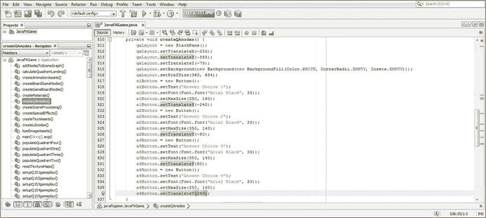

图 21-18。

Recalibrate the createQAnodes() settings to adjust the Q&A Panel location, size, Button spacing, and font

```java
private void createQAnodes()  {
    qaLayout = new StackPane();
    qaLayout.setTranslateX(-250);
    qaLayout.setTranslateY(-385);
    qaLayout.setBackground(new Background(new BackgroundFill(Color.WHITE,
                                                             CornerRadii.EMPTY,
                                                             Insets.EMPTY) ) );
    qaLayout.setPrefSize(360, 654);

    a1Button = new Button();
    a1Button.setText("Answer Choice 1");
    a1Button.setFont(Font.font("Arial Black", 33));
    a1Button.setMaxSize(350, 140);
    a1Button.setTranslateY(-240);
    a2Button = new Button();
    a2Button.setText("Answer Choice 2");
    a2Button.setFont(Font.font("Arial Black", 33));
    a2Button.setMaxSize(350, 140);
    a2Button.setTranslateY(-80);
    a3Button = new Button();
    a3Button.setText("Answer Choice 3");
    a3Button.setFont(Font.font("Arial Black", 33));
    a3Button.setMaxSize(350, 140);
    a3Button.setTranslateY(80);
    a4Button = new Button();
    a4Button.setText("Answer Choice 4");
    a4Button.setFont(Font.font("Arial Black", 33));
    a4Button.setMaxSize(350, 140);
    a4Button.setTranslateY(240);
}

```

正如你在图 [21-19](#Fig19) 中看到的，Q & A UI 面板现在在你的游戏面板视图的左下角。按钮很大，并与漂亮的、大的、可读的文本紧密相连，问答用户界面不妨碍你的每个数字图像素材(游戏的视觉组件)，现在看起来相当专业。

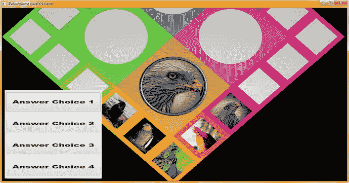

图 21-19。

Use a Run ➤ Project work process to see if the Q&A panel layout has been restored to its large readable state

### 向 setupQSgameplay()方法添加应答按钮内容

现在，我们可以通过在每个 setupQSgameplay()方法体内的每个 if(pickSn == n)条件 if()求值语句中添加四个相对简单的 Java 语句，来简单地为每个游戏棋盘添加问答 UI 面板答案。为了用真实的答案数据测试我们的用户界面，我们需要做的就是添加第一个 setup Q1 S1 gameplay()if(picks 1 = = 0)部分，添加对 diffuse 和 Shader21 对象配置的四个 setText()方法调用，这些对象配置已经在该代码部分中就位，以控制您的图像。

Java 代码也显示在图 [21-20](#Fig20) 的末尾，应该如下所示:

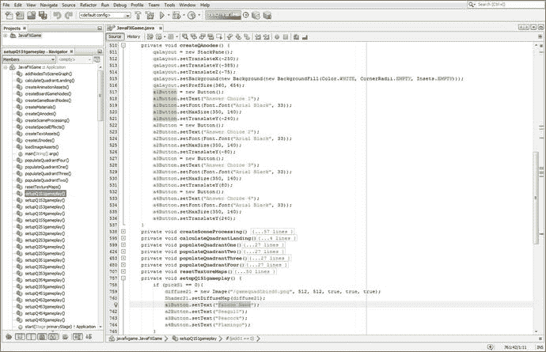

图 21-20。

Add the four a1Button through a4Button object answers (one is correct) using the setText() method call

```java
private void setupQ1S1gameplay() {
    if (pickS1 == 0) {
        diffuse21 = new Image("gamequad1bird0.png", 512, 512, true, true, true);
        Shader21.setDiffuseMap(diffuse21);
        a1Button.setText("Falcon Hawk");
        a2Button.setText("Seagull");
        a3Button.setText("Peacock");
        a4Button.setText("Flamingo");
    }
}

```

使用您的“运行➤项目”工作流程来测试添加真实答案按钮对象的代码，如图 [21-21](#Fig21) 所示。

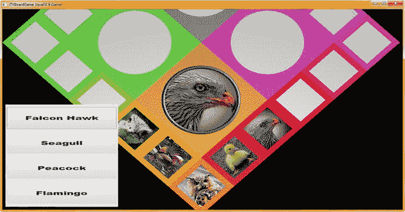

图 21-21。

Use a Run ➤ Project work process to see how answer Button data looks when you test square 1

为了获得一些实践，现在在 setupQSgameplay()方法中创建另外 59 组问题答案。接下来，让我们放置一个 AudioClip 对象(类),这样我们就可以将声音效果附加到我们的游戏棋盘旋转动画中。

## 游戏的数字音频:使用 AudioClip 类

在本章中，我们也来看看如何将数字音频素材添加到您的游戏中。这将需要使用 javafx.media 模块，这将使您的发行版更大，因为该模块需要添加到您的发行版 JAR 中，并且包括 MediaPlayer(用于音频和视频)和 AudioClip 类，等等。AudioClip 类用于较短的音频“片段”,技术上称为样本。如果您想要播放较长格式的数字音频(比如歌曲)或数字视频，您将需要使用 MediaPlayer 类。游戏通常使用较短格式的音频，因此我们将在这里介绍 AudioClip 类；它本质上是一个数字音频音序器，这是一个非常强大的工具，无论是对于游戏开发者，还是对于声音设计师和歌曲作者。

公共的 final AudioClip 类扩展了 java.lang.Object，这意味着它被临时编码为数字音频音序器。它保存在 javafx.media 模块的 javafx.scene.media 包中，因此，该类的 Java 类层次结构如下所示:

```java
java.lang.Object
  > javafx.scene.media.AudioClip

```

AudioClip 对象可用于包含以最小延迟播放的数字音频短片段。与媒体对象类似，从网络或 JAR 加载剪辑，但行为不同。例如，由 MediaPlayer 对象播放的媒体对象不能“播放”它们自己，而您的 AudioClip 对象可以。AudioClips 可以立即重用，因此它们的延迟为零，使用的内存更少，这对游戏来说很重要。

AudioClip 对象的回放行为被 Oracle 称为“一劳永逸”一旦调用了该类的 play()方法之一，唯一可操作的控件就是 stop()方法。我们将使用这两种方法。

一个 AudioClip 对象也可以同时播放多次！要使用 MediaPlayer 中的媒体对象完成相同的任务，必须为并行播放的每个声音创建新的 MediaPlayer 对象。这对于游戏场景来说不是最佳的，这就是为什么我们在这里不讨论媒体和 MediaPlayer 对象。

媒体对象和 MediaPlayer 更适合长格式的音频，如歌曲或有声读物。这主要是因为音频剪辑(在内存中)存储整个数字音频素材的原始、未压缩(PCM)音频数据，对于长音频剪辑来说，这通常相当大。媒体播放器在存储器中只有足够的“预滚动”的解压缩音频数据来播放一小段时间；因此，对于较长的剪辑，MediaPlayer 的内存效率要高得多，尤其是在它们已经过压缩的情况下，例如，使用 MP3(数字音频)或 MPEG4(数字视频)文件格式或 OGG Vorbis(数字音频)、FLAC(数字音频)或 WebM (ON2 VP6、VP8 或 VP9)数字视频格式。

AudioClip 类有六个数字音频属性，它们影响声音平衡、循环、位置、优先级、速率和音量。这些属性包括 balance DoubleProperty 和 pan DoubleProperty，前者控制 AudioClip 对象的(相对)左右音量，后者控制 audioClip 对象的相对“中心”位置。rate DoubleProperty 控制播放音频剪辑的相对速率(速度), volume DoubleProperty 控制播放音频剪辑的相对音量。调用 play()方法时，cycleCount IntegerProperty 控制音频剪辑的播放次数。priority IntegerProperty 控制 AudioClip 对象相对于其他 AudioClip 对象的相对优先级。

有一个静态 int 不定数据字段，当 cycleCount 设置为该值时，AudioClip 将连续循环，直到使用 stop()方法调用停止为止，我们很快就会了解到这一点。

只有一个 AudioClip 构造函数方法，它采用源 URL 并使用以下格式:

```java
AudioClip(String sourceURL)

```

接下来，让我们看看 AudioClip 类允许我们调用 AudioClip 对象的方法。DoubleProperty balanceProperty()方法调用允许您获取 AudioClip 对象的相对左右音量。integer property cycleCountProperty()方法调用允许您在调用 play()方法时获取将播放 AudioClip 对象的次数。DoubleProperty panProperty()方法调用允许您获取 AudioClip 对象的(相对)中心。integer property priority property()方法调用允许您获取该音频剪辑对象相对于其他音频剪辑对象的(相对)优先级设置。DoubleProperty rateProperty()方法调用允许您获得正在播放的音频剪辑的(相对)速率。DoubleProperty volumeProperty()方法调用允许您获取播放音频剪辑时的(相对)音量。

除了六个 AudioClip 属性方法之外，还有七个 get()方法允许您获取 AudioClip 属性的值，包括其数字音频源文件。double getBalance()方法调用将用于获取 AudioClip 的默认平衡级别。int getCycleCount()方法调用将用于获取 AudioClip 对象的默认循环计数。double getPan()方法调用将用于获取 AudioClip 对象的默认声相值。int getPriority()方法调用将用于获取 AudioClip 对象的默认播放优先级值。double getRate()方法调用将用于获取 AudioClip 对象的默认回放速率。String getSource()方法调用将用于获取用于创建 AudioClip 对象的源 URL。double getVolume()方法调用将用于获取 AudioClip 对象的默认音量。

还有七个 set()方法允许您设置 AudioClip 属性的值，包括数字音频源文件。void setBalance(double balance)方法调用应用于设置 AudioClip 对象的默认平衡级别。void setCycleCount(int count)方法调用应用于设置 AudioClip 对象的默认循环计数。void setPan(双声相)方法调用应用于设置 AudioClip 对象的默认声相值。

void setPriority(int priority)方法调用应该用于设置默认播放优先级。void setRate(double rate)方法调用应该用于设置默认回放速率。应使用 void setVolume(double value)方法调用来设置默认音量级别。还有五种方法，可用于在播放时控制 AudioClip 对象。

布尔 isPlaying()方法调用将用于指示音频剪辑当前是否正在播放。void play()方法调用应该用于使用默认参数播放 AudioClip 对象。应该使用 void play(double volume)方法调用，使用除音量之外的所有默认参数来播放音频剪辑。应使用 void play(双音量、双平衡、双速率、双声相、int priority)方法调用，使用给定的音量、平衡、速率、声相和优先级参数来播放音频剪辑。最后，应该使用 void stop()方法调用来立即停止 AudioClip 对象的所有回放。现在，我们可以在游戏中将数字音频素材实现为 AudioClip 对象，为游戏板旋转和相机缩放等操作提供音频音效。

### 实现音频剪辑:添加数字音频素材声音效果

我们需要做的第一件事是在 JavaFXGame 类的顶部声明两个名为 spinnerAudio 和 cameraAudio 的 AudioClip 对象，如下面的 Java 9 代码所示，并在图 [21-22](#Fig22) 中突出显示:

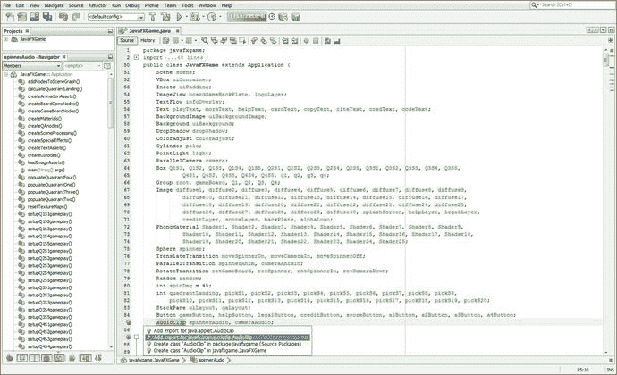

图 21-22。

Declare spinnerAudio and cameraAudio AudioClip at the top of the class; use Alt+Enter to add an import

```java
AudioClip spinnerAudio, cameraAudio;

```

接下来，在 loadImageAssets()方法调用的正下方创建一个 loadAudioAssets()方法调用，并再次使用 Alt+Enter 键，如图 [21-23](#Fig23) 所示，让 NetBeans 为您创建空的引导方法体。

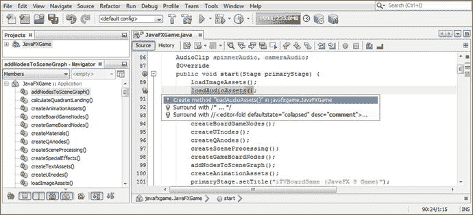

图 21-23。

Create a loadAudioAssets() method call after loadImageAssets(); use Alt+Enter to have NetBeans code it

在类方法结构中向上移动这个新方法体，使其靠近 loadImageAssets()方法，并开始添加 spinner audio = new audio clip()；实例化语句，如图 [21-24](#Fig24) 正在构建中所示。当我们构造语句的内部(String sourceURL)部分时，这个实例化将变得更加复杂。这看起来像下面的代码，它正在 NetBeans 中构建，并在图 [21-24](#Fig24) 中突出显示:

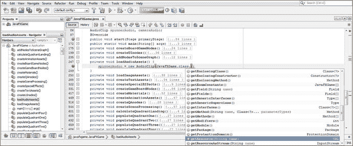

图 21-24。

Add your internal getResource(String) portion of the AudioClip instantiation statement for spinnerAudio

```java
spinnerAudio = new AudioClip( JavaFXGame.class.getResource(String sourceURL) );

```

让我们看几页纸，找到一个专业级 CD 和 HD 数字音频样本网站，其中有免费的商业用途 WAVE 文件(未压缩的 PCM 数字音频，44.1 KHz，16 位和 24 位分辨率)。

### 寻找免费的商业用数字音频:99Sounds.org

在我们引用 spinnerAudio 数字音频素材的内部文件名之前，我们需要创建我们接下来将使用的数字音频素材，所以让我们先这样做。幸运的是，我发现了一个名为 99Sounds 的数字音频样本库网站，它拥有数千兆字节的电影质量音频样本，可以免费用于商业项目，只要它们不在另一个库中作为数字音频样本重新分发。它们使用标准的 44.1 Hz、CD 质量和音频采样速率，分辨率为 16 位或 24 位，使用未压缩的 PCM (WAVE)格式。如果你想了解更多关于数字音频编辑软件和工作流程的内容，请查阅 Apress.com 的《数字音频编辑基础》。我从 [`www.99SOUNDS.org`](http://www.99sounds.org) 下载了所有的样本库，因为我为客户和我自己的公司制作了很多游戏、网站、电子书、iTV 节目、智能手表和类似的数字产品。图 [21-25](#Fig25) 显示了我下载的文件浏览器应用列表和几十个文件夹(现在在我的硬盘上的一个`C:\Audio`文件夹下)。

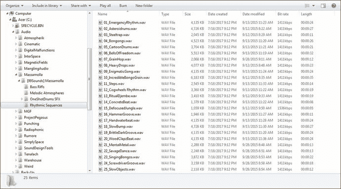

图 21-25。

Go to [`www.99sounds.org`](http://www.99sounds.org) and download free digital audio samples for all your pro Java 9 game projects

我将使用 Massamolla 系列中的第 24 个样本，该样本位于节奏序列文件夹中，如图 [21-25](#Fig25) 所示。这个例子叫做螺丝刀槽，是 32 位 44.1 Hz 波形格式；它使用 1411 Kbps 的压缩率，长度为 18 秒，其中我们将循环 7 秒以减少内存数据占用。我们还将把它转换成一个单声道样本以节省内存，并将创建这个文件的几个版本。

### 数据足迹优化:使用 Audacity 创建游戏音频

请注意图 [21-25](#Fig25) 中的文件大小为 3159 千字节，这对于旋转音频来说是太大的内存了！我们将为低质量的音频组件削减几乎 3MB 的文件大小，并创建一个略大于半兆字节大小的高质量音频素材，因此这应该是所有游戏开发者感兴趣的部分！启动 Audacity 2.1.3(或更高版本)，我假设您已经下载并安装了它。使用文件➤打开菜单序列打开图 [21-25](#Fig25) 所示的螺丝刀槽样本；找到其重复声音中的第一个大间隙，如图 [21-26](#Fig26) 用绿线所示，大约在这个文件的 7.6 秒。

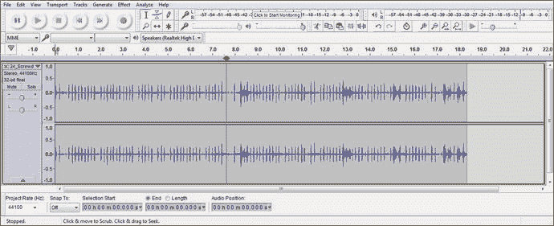

图 21-26。

Open Audacity 2 and find a point at 7.6 seconds, which will loop seamlessly for the gameboard spin audio

选择两个立体声音轨中超过 7.6 秒的音频样本部分，如图 [21-27](#Fig27) 所示；使用“编辑➤删除”菜单序列从样本中移除此音频数据。

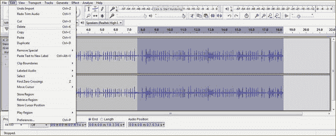

图 21-27。

Select the portion between 7.6 and 18.3 seconds and use your Edit ➤ Delete menu sequence to remove it

这会立即删除大约五分之三(18.3 的 7.6 大约是五分之二)的数字音频数据。我们要做的下一步是将两个立体声音轨合并成一个单声道音轨，再次将数据量减少 100%。选择两个立体声音频轨道，如图 [21-28](#Fig28) 所示，并使用轨道➤立体声轨道至单声道菜单序列将这两个(立体声)数字音频轨道合并为一个单声道数字音频轨道。

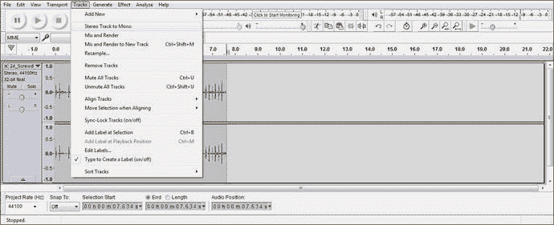

图 21-28。

Select the entire sample on both tracks and use Tracks ➤ Stereo Track to Mono to combine the sample

接下来，我们需要将样本分辨率减半，将 32 位(浮点)音频样本降低到 16 位 PCM 分辨率，通常称为“CD 质量”音频。这可以使用波形音频最左侧单声道 44100Hz 32 位浮点指示器顶部的下拉箭头来完成，如图 [21-29](#Fig29) 所示。

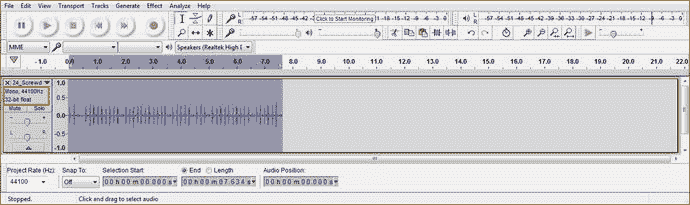

图 21-29。

A seven-second Mono 44.1Hz 32-bit float sample is now more than 400 percent less data than the original sample

点击此下拉箭头，进入主菜单底部的格式子菜单，如图 [21-30](#Fig30) 左下方所示。这将显示所选的 32 位浮点格式，并允许您选择 16 位 PCM (CD)或 24 位 PCM (HD)音频分辨率格式。由于我们试图为游戏音频素材节省系统内存，我们将选择 16 位、44.1 KHz 的格式。

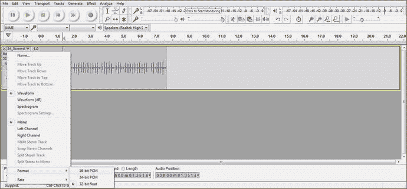

图 21-30。

Reduce the sample format another 100 percent from 32-bit to 16-bit resolution using the sample drop-down arrow

现在，我们将通过将采样速率从 44.1 KHz 降至 22.05 Hz(正好一半)来创建中低质量的数字音频素材。将数据减少 100 %(一半)或 200 %(四分之一)会得到完美的结果，因为没有余数(偶数除法)。为此，使用轨道编辑面板底部的项目速率(Hz)下拉选择器，并选择 22050 而不是 44100，如图 [21-31](#Fig31) 左侧红色圆圈所示。还可以看到分辨率已经降低到了 16 位。使用 Audacity 用户界面左上角的播放按钮(也用红色圈出)预览数字音频，看看您是否能听到音频质量的任何差异。作为效果听起来还是很棒的。

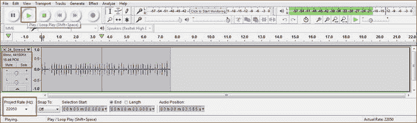

图 21-31。

Reduce the sample format by another 100 percent, from 44.1 to 22.05 KHz using the Project Rate drop-down menu

最后，让我们通过将其采样速率从 44.1 KHz 降低到 11.025 KHz，将该音效样本再降低 100%(始终从最高可能采样速率采样到目标采样速率，以便为算法提供最高质量的数据来施展魔法)。正如您在图 [21-32](#Fig32) 中看到的，我们大胆使用了 44.1 KHz、16 位音频样本数据(见左中的设置)，并将项目速率(Hz)下拉菜单设置为 11.025 KHz。您可以使用 Play 按钮再次预览音频质量，如果您这样做了，您将会看到质量水平已经下降，但质量水平仍然非常适合重复的游戏棋盘旋转动画音频反馈声音效果。

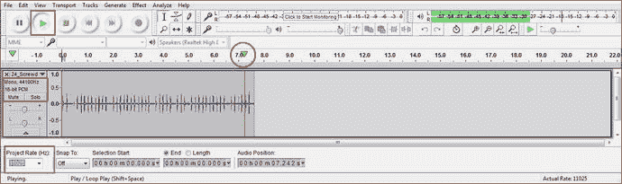

图 21-32。

Reduce the sample format by another 100 percent from 44.1 to 11.025 KHz, using the Project Rate drop-down menu

在图 [21-33](#Fig33) 中，我将所有三个 Audacity 文件➤另存为对话框合并成一个以节省空间；在这一章中，我们有很多东西需要了解，包括 NetBeans 和 Audacity。第一个面板编号为 1，显示您的 44.1 KHz 16 位文件被保存为 spinner。在`NetBeansProjects/JavaFXGame/src/`文件夹中。图的第二部分显示了保存为 spinner22.wav 的 22.05 KHz 16 位版本，图的第三部分显示了保存为 spinner11.wav 的 11.025 KHz 16 位版本。这三种音频资源的文件大小约为 658KB、329KB 和 165KB。因为这些是 16 位 PCM。wav 文件，用来存储该文件的内存量恰好也是用来部署游戏中使用的文件的系统内存量。

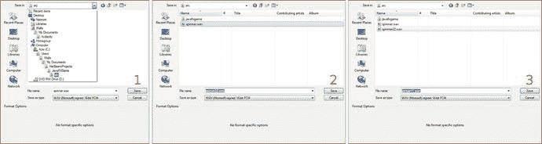

图 21-33。

Use Audacity’s File ➤ Save function to export 44, 22, and 11 Hz, 16-bit audio versions to /JavaFXGame/src

现在我们可以继续 AudioClip 实例化语句，并在我们的游戏逻辑中使用新的音频样本！

### 使用 toExternalForm()将 URI 引用作为字符串对象加载

现在我们可以添加这个微调器。然后将该方法调用链接到 toExternalForm()方法调用，后者将 spinner.wav 音频资源转换为 AudioClip 构造函数方法所需的外部(URI 字符串)形式。确保将根(/)正斜杠添加到 spinner.wav 中，以便可以在根源文件(/src)文件夹中看到它。该语句的 Java 代码如图 [21-34](#Fig34) 所示:

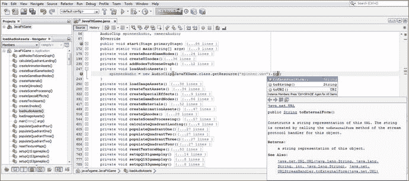

图 21-34。

Go back to the instantiation and add the spinner.wav audio file and the toExternalForm() method chain

```java
spinnerAudio = new AudioClip( JavaFXGame.class.getResource("\spinner.wav").toExternalForm() );

```

由于游戏板旋转超过 7 秒，您还需要添加一个 setCycleCount()方法调用，并使用以下 Java 9 代码将其设置为不定(无限循环)数据值，如图 [21-35](#Fig35) 所示:

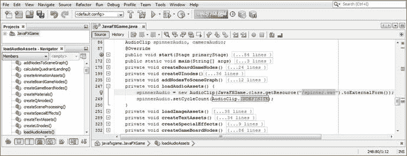

图 21-35。

Add a slash (/), or root, to spinner.wav. Then add a spinnerAudio.setCycleCount(AudioClip.INDEFINITE) method call

```java
spinnerAudio.setCycleCount(AudioClip.INDEFINITE);

```

既然已经设置了 spin AudioClip 素材，我们现在必须在用鼠标单击 spinner UI 时触发它。

### 在 createSceneProcessing()中触发微调器音频播放

要播放 AudioClip 对象，我们需要将一个`spinnerAudio.play();`方法调用插入到您的`if (picked == spinner)`结构的事件处理中，就在 calculateQuadrantLanding()方法调用之前。

在图 [21-36](#Fig36) 的底部突出显示了用于添加的 Java 9 代码。

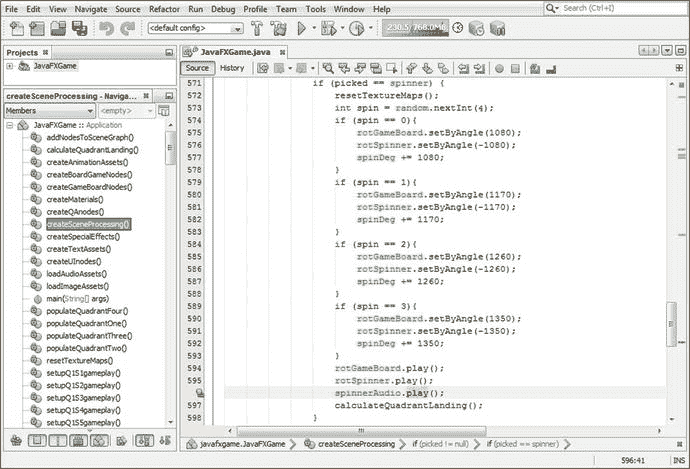

图 21-36。

Trigger a spinnerAudio.play() in the createSceneProcessing() method in an if(picked == spinner) structure

要停止 spinnerAudio AudioClip 对象的播放，您需要在 setOnFinished()事件处理代码结构中调用 spinnerAudio AudioClip 的 stop()方法，该方法在 createAnimationAssets()方法体中的 rotGameBoard 动画对象中调用。

这样，当动画对象完成动画制作时，就会调用您的 spinnerAudio.stop()方法，当游戏板停止旋转时，游戏板旋转音频也会停止。

我使用以下代码将此代码放在事件处理结构的最末端，在图 [21-37](#Fig37) 的末端用浅蓝色和黄色突出显示:

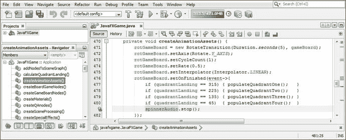

图 21-37。

Stop the spinnerAudio object in the createAnimationAssets() method in a rotGameBoard.setOnFinished() event handler

```java
rotGameBoard.setOnFinished(event-> {
    if (quadrantLanding == 315) { populateQuadrantOne();   }
    if (quadrantLanding == 225) { populateQuadrantTwo();   }
    if (quadrantLanding == 135) { populateQuadrantThree(); }
    if (quadrantLanding == 45)  { populateQuadrantFour();  }
    spinnerAudio.stop();
});

```

接下来，让我们创建我们的相机动画对象音频，这一次匹配音频长度到动画长度。

### 相机动画音频:匹配音频长度到动画

对于 camera 对象动画 AudioClip，我们将五秒钟的动画与五秒钟的音频相匹配，这样我们就不需要循环播放音频，因此也不需要使用 stop()方法调用，因为 AudioClip 将在五到六秒的长度后停止播放。重要的是，你要看到这两种游戏设计的主要数字音频方法:循环音频根据需要开始和停止，以及定时音频。正如你在图 [21-38](#Fig38) 中所看到的，我从 Project Pegasus 琶音系列中选择了有节奏的冰川样本，并对其进行了微调，使其长度约为 5.5 秒。正如您所看到的，这个样本是 48000 Hz，所以我还创建了 16000 Hz (1/3)和 8000 Hz (1/6)的中低质量 16 位版本，它们分别是 526KB、176KB 和 88KB。这使得 CD 音质的声音约为 1MB，高质量的声音约为半兆字节。

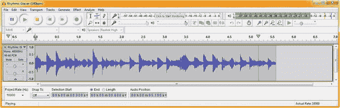

图 21-38。

Match almost six seconds of Rhythmic Glacier audio with almost six seconds of camera zoom animation

现在，我们可以用这个 camera.wav 资源加载第二个 cameraAudio AudioClip 对象，并在我们的代码中使用它。

由于您已经在类的顶部声明了 cameraAudio AudioClip，下一步将是在 spinnerAudio AudioClip 对象及其实例化和配置语句之后，在 loadAudioAssets()方法中实例化它。完成此操作后，我们可以再次将 play()触发器添加到 createSceneProcessing()代码中。

您不需要向 createAnimationAssets()on finished()事件处理程序添加 stop()方法调用，因为声音只播放一次，并且大约在动画对象完成移动和旋转照相机对象的同时过期。如果您希望更紧密地同步这些内容，请使用我们对微调器音频资源使用的相同方法，循环一个较短的音频剪辑，然后在 setOnFinished()事件处理程序内调用 stop()方法。

第二个实例化的 Java 代码与第一个相同(除了音频素材的文件名)，如下所示，在图 [21-39](#Fig39) 中间用浅蓝色和黄色突出显示:

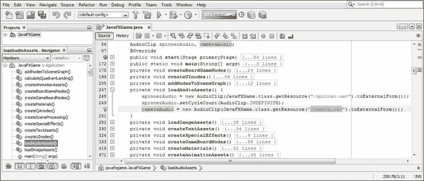

图 21-39。

Add a cameraAudio AudioClip to the loadAudioAssets() method and reference the new camera.wav asset

```java
cameraAudio = new AudioClip( JavaFXGame.class.getResource("/camera.wav").toExternalForm() );

```

如果您想要添加更多的数字音频声音效果，您可以简单地模仿这些 AudioClip 对象中的一个或另一个，例如，在 i3D spinner UI 元素出现在屏幕上时向其添加音频，添加与 Q&A 会话有关的音频，或者甚至添加当开始游戏按钮等待玩家单击时循环播放的音频。因此，随着您继续开发和改进这个 pro Java 9 游戏设计，您可能会扩展这个 loadAudioAssets()方法。

当玩家单击游戏棋盘方块以选择问答会话中使用的内容时，相机动画和音频在 createSceneProcessing()方法的不同部分被触发。因此，play()方法不是在`if(picked == spinner)`中被调用，而是在`if(picked == Q1S1)`或其他 19 个游戏棋盘方格条件 if()语句之一中被调用。如图 [21-40](#Fig40) 所示的 Java 代码应该如下所示:

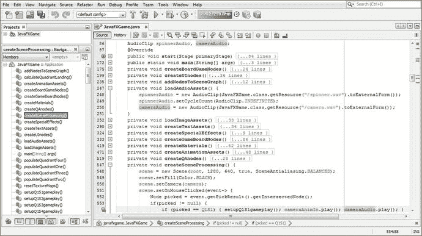

图 21-40。

To trigger a cameraAudio AudioClip , add a cameraAudio.play() method call to the OnMouseClicked event handler

```java
if (picked == Q1S1) {
    setupQ1S1gameplay();
    cameraAnimIn.play();
    cameraAudio.play();

}

```

为了练习本章所讲的内容，创建另外 19 个 setupQSgameplay()方法调用，包括每个主题的问题，以及触发摄像机音频放大的 cameraAudio.play()调用。

## 摘要

在第 21 章中，我们学习了如何为每个游戏棋盘方格创建答案选项。我们还为玩家创建了 StackPane 和 Button 对象来记录他们的答案。您需要创建另一个 Java 代码来回答每个游戏棋盘上的随机选项，并输入此代码来完成游戏，这样您就可以进入下一章，在下一章中，我们将创建计分引擎、记分牌和跟踪游戏这一部分的高分代码。

我们还学习了如何使用 JavaFX AudioClip sequencer 将数字音频素材添加到游戏中，它拥有合成器拥有的所有核心音乐合成、声音跟踪和触发工具。我们创建了一个定时的数字音频剪辑和一个循环(播放到停止)版本的数字音频，以便您了解如何添加数字音频素材，以便在玩家的游戏体验中为他们提供听觉反馈。

在第 [22](22.html) 章中，你将开发一个评分引擎代码基础设施，它将处理玩家选择正确的游戏方块内容答案时发生的事情。这意味着我们将再次开发 2D 游戏元素来保存记分牌内容，这将弹出并覆盖更多的 3D 游戏用户界面的未使用部分。在这种情况下，这将是游戏屏幕的右下角部分。