# 二十二、评分引擎：创建评分 UI 布局并对内容评分

现在，您已经编写了游戏板方块答案选择逻辑，并且编写了游戏板旋转和摄像机动画序列的声音效果，我们需要将另一半 Java 代码放入适当的位置，查看用户选择(点击)了什么答案，并相应地更新记分板。我们将跟踪正确和错误的答案，并使用简单而有效的评分界面实时鼓励玩家。本章中的工作过程需要我们在屏幕右侧创建一个乐谱 UI 面板(panel ),我们将使用名为`scoreLayout`的 StackPane 和名称也以 Score 开头的文本对象来创建它。

在这一章中，我们将实现一个单人游戏和评分模型来让你的评分用户界面就位，因为很多游戏玩家都想根据游戏内容来玩游戏，作为一种学习体验。也就是说，仍然需要为每个按钮 UI 元素编写大量代码来查看答案是否是正确答案；如果是，代码将增加“正确:”的分数，如果不是，将增加“错误:”的分数。

这意味着在你学会如何实现本章中的评分逻辑后，你仍然需要增加几百行 Java 代码。这将为你所有的答案打分，这些答案是你在前一章中学会的。

幸运的是，我们将使用最佳的“编写一次代码，然后复制、粘贴和修改”方法，因此不应该像上一章那样涉及太多的输入。真正的工作将是在你学习完如何实现评分(在当前章节中)后，创建答案(第[章第 21 章](21.html))和评分逻辑(本章)。

还有一个上一章的小错误，我们将通过移动。setVisible(false)从开始游戏按钮到 JavaFX application start()方法启动序列调用问答 UI 面板，这将在游戏启动时(而不是在单击按钮时)隐藏问答 UI 面板(以及后来的乐谱 UI 面板)。

## 闪屏渲染错误:启动时隐藏用户界面面板

您可能已经注意到，在前一章的游戏运行➤项目测试渲染中，JavaFX 错误地渲染了游戏闪屏上方的部分问答 UI 面板，如图 [22-1](#Fig1) 的左上角所示。这个 Q&UI 面板应该真正位于你的闪屏之后，因为你已经在 root.addChildren.()addAll()方法链的节点对象参数列表序列中的 addNodesToSceneGraph()方法中指定了呈现顺序。通过添加 i3D 元素来使您的场景成为 3D(或“混合”2D+3D 场景)实体，这也可能是 Z 单位位置(方位)设置问题。因此，有两种方法可以调查并修复这个小的渲染问题。由于我们已经设置了 X、Y、Z 显示单元，并且可以有效地实现我们想要在 i3D 游戏渲染管道中实现的功能，解决这个问题最简单的方法就是在游戏启动时自动隐藏 UI 面板(因为我们在游戏启动时隐藏了它),而不是手动使用开始游戏按钮 UI 元素。这是在 JavaFX 所要求的 start()方法的顶部完成的，而不是在一个事件处理结构中完成的，该事件处理结构与开始游戏按钮 UI 元素上的初始单击相连接。

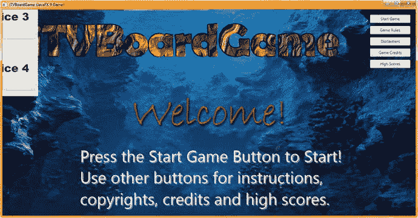

图 22-1。

Let’s fix the Q&A Button pane rendering bug that affects the startup screen first before developing the scoring

首先，从 gameButton 事件处理代码中移除`qaLayout.setVisible(false);` Java 语句，并将其放在。start()方法，以便自动处理该隐藏。

请记住，您的 qaLayout StackPane 将在 createQAnodes()方法中创建，因此该语句需要出现在您的`createQAnodes();`自定义方法调用之后，也就是在该自定义方法之前调用的任何方法之后。这很好，因为这些只是设置将在游戏中使用的资源引用和对象。

这最终成为解决这个视觉缺陷的一个更快更容易的方法；因为我们已经准备在游戏启动时隐藏这个面板，所以在更早的时候(自动地)而不是在事件处理逻辑中隐藏(设置可见性为假)这个面板既创建了更干净的代码，又节省了我们弄清楚为什么会发生这种情况(显然是 3D 空间中的 Z 单位设置问题)以及如何为 qaLayout StackPane 对象添加(和调整)Z 位置代码的时间，这不会弄乱您当前的原始结果(除了在这个初始闪屏显示上)。

这个简单修改的 Java 代码在图 [22-2](#Fig2) 的中间突出显示，应该类似于下面的 Java 9 语句，现在可以在您的 public void start() core JavaFX 9 方法的第一部分找到:

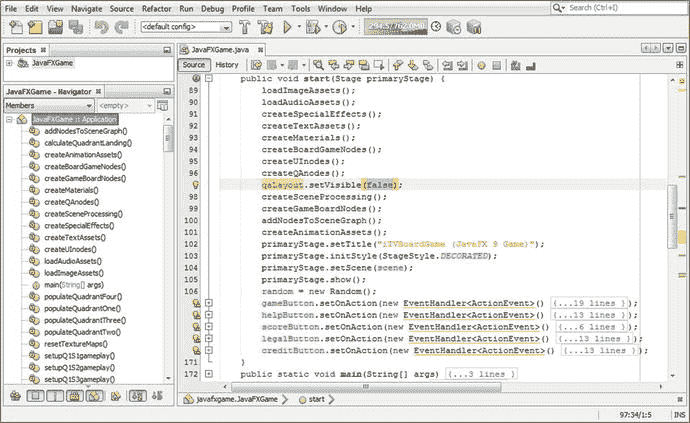

图 22-2。

Remove the .setVisible() call from your gameButton handler and place it in .start() after createQAnodes()

```java
public void start()  {
   loadImageAssets();
   loadAudioAssets();
   createSpecialEffects();
   createTextAssets();
   createMaterials();
   createBoardGameNodes();
   createUInodes();
   createQAnodes();

   qaLayout.setVisible(false);
   createSceneProcessing();
   createGameBoardNodes();
   ...
}

```

使用图 [22-3](#Fig3) 中的运行➤项目工作流程，在你的闪屏中查看对该问题的修复。

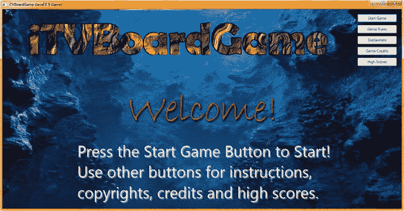

图 22-3。

Your Q&A UI panel is now hidden on startup, in the top of your .start() method

现在我们已经修复了这个小的(代码方面的)闪屏呈现问题，我们可以继续创建您的 Score UI 布局设计，从 scoreLayout StackPane 对象和包含其装饰的 Text 对象开始。

## 记分板 UI 设计:createScoreNodes()方法

让 NetBeans 为我们创建一个 createScoreNodes()自定义方法体，方法是在我们刚刚添加的`qaLayout.setVisible(false);`语句后添加一行代码，然后使用 Alt+Enter 击键组合来触发 NetBeans 9 的这一自动化方法编码。此处显示了 Java 语句，并在图 [22-4](#Fig4) 中间突出显示:

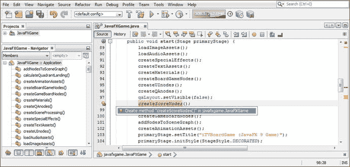

图 22-4。

Create a createScoreNodes() method after the qaLayout logic and use Alt+Enter to have NetBeans code it

```java
public void start()  {
   loadImageAssets();
   loadAudioAssets();
   createSpecialEffects();
   createTextAssets();
   createMaterials();
   createBoardGameNodes();
   createUInodes();
   createQAnodes();
   qaLayout.setVisible(false);
   createScoreNodes();

   ...
}

```

将类底部的方法复制到 createQAnodes()方法之后，如图 [22-5](#Fig5) 底部所示。将 qaLayout 语句从 createQAnodes()方法复制到 createScoreNodes()方法中，并将。setTranslateX()方法从-250 调用到 250，以将其镜像到显示器的另一个角落。

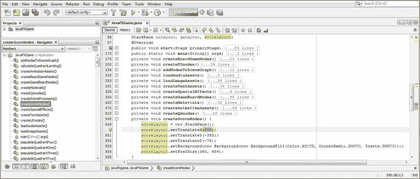

图 22-5。

Add a StackPane named scoreLayout at the top of the class and instantiate and configure it like qaLayout

您将保持其他四个复制的 Java 语句不变(除了将 qaLayout 更改为 scoreLayout)，因为除了 X 位置之外，您希望“镜像”高度、深度、背景颜色和首选 StackPane 大小。使用以下 Java 代码将此 scoreLayout 添加到 SceneGraph 中，这些代码也在图 [22-6](#Fig6) 中突出显示:

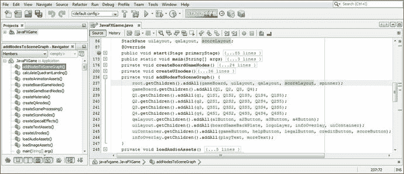

图 22-6。

To render the scoreLayout StackPane , you must first add it to the root.getChildren().addAll() method chain

```java
private void addNodesToSceneGraph() {
    root.getChildren().addAll(gameBoard, uiLayout, qaLayout, scoreLayout, spinner);
    ...
}

```

让我们再次使用“运行➤项目”工作流程，并测试您的乐谱 UI 面板的新代码，以确保使用. settranslatex()方法调用值将乐谱 UI 面板设计镜像到屏幕右侧足够远的位置。正如你在图 [22-7](#Fig7) 中看到的，根据我们的猜测，我们离游戏的右角还差 400 个单位。因此，我们需要将值 250 更改为 650，以将 StackPane 容器进一步向右移动，并防止 2D StackPane UI 容器对象与您的 i3D 游戏棋盘节点层次结构相交。

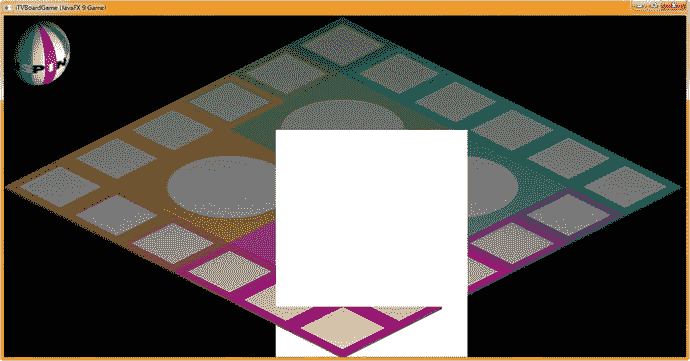

图 22-7。

As you can see, this StackPane is intersecting with the game board and needs to move right 400 units in X

完成乐谱 UI 背景和容器的 Java 9 代码在图 [22-8](#Fig8) 中高亮显示。setTranslateX()方法调用(从 250 X 单位到 650 X 单位)应该类似于下面的代码:

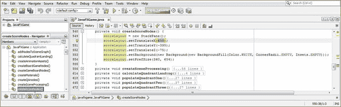

图 22-8。

Change the scoreLayout.setTranslateX() method call from 250 to 650 to move the Score UI panel by 400 units

```java
scoreLayout.setTranslateX(650);

```

我们需要做的下一件事是将 Java 代码放在适当的位置，它将在游戏启动时隐藏分数 UI 面板，就像它隐藏问答 UI 面板一样。一旦您添加了您的`scoreLayout.setVisible(false);` Java 语句，您的新 start()方法代码应该看起来像下面的代码，如图 [22-9](#Fig9) 所示:

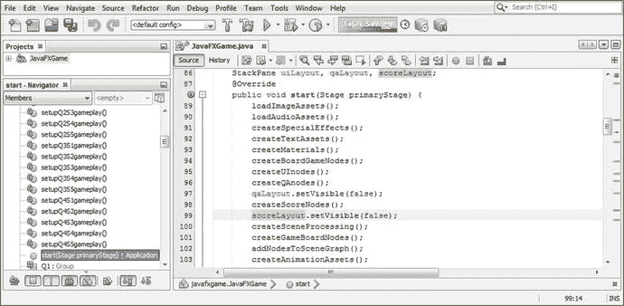

图 22-9。

Add the .setVisible(false) method call off scoreLayout after the createScoreNodes() method to hide the panel on startup

```java
public void start()  {
   loadImageAssets();
   loadAudioAssets();
   createSpecialEffects();
   createTextAssets();
   createMaterials();
   createBoardGameNodes();
   createUInodes();
   createQAnodes();
   qaLayout.setVisible(false);
   createScoreNodes();
   scoreLayout.setVisible(false);
   ...
}

```

正如您在图 [22-10](#Fig10) 中看到的，您仍然需要使用您的。setOnFinished(event)事件处理基础结构。这段代码已经就绪，因为我们已经在摄像机动画完成后展示了 Q & A UI 面板。因此，我们所要做的就是在`cameraAnimIn.setOnFinished(event->{});`结构的末尾添加`scoreLayout.setVisible(true);`语句，在图 [22-10](#Fig10) 的中间用浅蓝色和黄色突出显示。在能够测试您的 Score UI 面板之前，您必须将这个 Java 9 代码放在适当的位置。

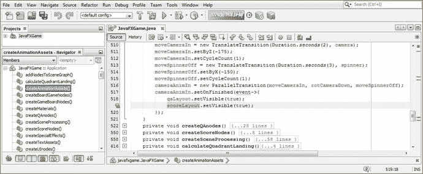

图 22-10。

To show the scoreLayout StackPane, add a .setVisible(true) method call in cameraAnimIn.setOnFinished()

再次，使用运行➤项目的工作流程，并确保您的游戏闪屏和游戏板旋转回到他们的“干净”的外观；然后旋转并选择游戏棋盘方格 1 来调用 cameraAnimIn 对象。setOnFinished(event)事件处理方法逻辑，此时显示两个 StackPane UI 容器。

这允许我们在摄像机角度改变后测试 Score UI 容器代码。如图 [22-11](#Fig11) 所示，我们所要做的就是通过改变。将-395(如图 [22-8](#Fig8) 所示)的 setTranslateY()方法调用为-385 的值，以获得完美镜像的乐谱 UI 面板结果。

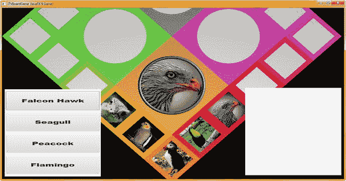

图 22-11。

Use Run ➤ Project to render the Score panel, via the .setOnFinished() event handler, showing the initial pane position

现在，我们可以使用不同颜色的文本对象来“装饰”scoreLayout StackPane 的内部，我们可以使用漂亮的大字体和暗原色(RGB)值来标记 Score UI 面板的各个部分。

### 添加乐谱 UI 容器设计元素:文本对象

将 scoreTitle 文本对象添加到类顶部的文本复合语句，然后将 scoreTitle 添加到 scoreLayout.addChildren()。你的 addNodesToSceneGraph()方法中的 addAll()方法链，如图 [22-12](#Fig12) 所示。Java 代码应该如下所示，同样在图 [22-12](#Fig12) 的顶部以黄色显示:

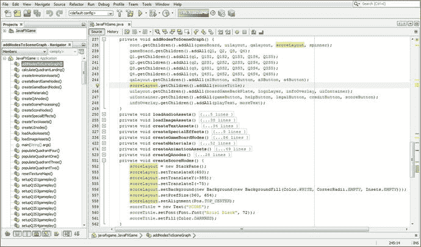

图 22-12。

Add a scoreTitle Text object , instantiate it, and configure it in createScoreNodes(). Then add it to the SceneGraph

```java
private void addNodesToSceneGraph() {
    root.getChildren().addAll(gameBoard, uiLayout, qaLayout, scoreLayout, spinner);
    gameBoard.getChildren().addAll(Q1, Q2, Q3, Q4);
    Q1.getChildren().addAll(q1, Q1S1, Q1S2, Q1S3, Q1S4, Q1S5);
    Q2.getChildren().addAll(q2, Q2S1, Q2S2, Q2S3, Q2S4, Q2S5);
    Q3.getChildren().addAll(q3, Q3S1, Q3S2, Q3S3, Q3S4, Q3S5);
    Q4.getChildren().addAll(q4, Q4S1, Q4S2, Q4S3, Q4S4, Q4S5);
    qaLayout.getChildren().addAll(a1Button, a2Button, a3Button, a4Button);
    scoreLayout.getChildren().addAll(scoreTitle);
    uiLayout.getChildren().addAll(boardGameBackPlate, logoLayer, infoOverlay, uiContainer);
    uiContainer.getChildren().addAll(gameButton, helpButton, legalButton, creditButton,
                                     scoreButton);
    infoOverlay.getChildren()addAll(platText, moreText);
}

```

使用设置 scoreLayout StackPane 中 scoreTitle 标题的对齐方式。用 Pos 调用 setAlignment()方法。TOP_CENTER 常量，它将这个深红色的分数标题置于 StackPane 容器的顶部和中间。有趣的是，文本对象对齐是在父 StackPane 容器中设置的。我们可以在以后使用。setTranslateX()和。setTranslateY()方法调用文本子对象来微调乐谱 UI 面板中的对齐方式，我们将在接下来的几页中充实这个设计。

在 createScoreNodes()方法的底部实例化 scoreTitle 文本对象，然后使用。setFont()方法。使用 Arial 黑色字体，在 72 磅的大字体下具有醒目的可读性。使用。setFill()方法调用并将颜色从黑色更改为深红色，以便乐谱标题可以在乐谱 UI 面板的顶部轻松查看。图 [22-12](#Fig12) 底部突出显示的 Java 代码如下所示:

```java
private void createScoreNodes()  {
    scoreLayout = new StackPane();
    scoreLayout.setTranslateX(650);
    scoreLayout.setTranslateY(-385);
    scoreLayout.setTranslateZ(-75);
    scoreLayout.setBackground(new Background(new BackgroundFill(Color.WHITE,
                                                                CornerRadii.EMPTY,
                                                                insets.EMPTY) ) );
    scoreLayout.setPrefSize(360, 654);
    scoreLayout.setAlignment(Pos.TOP_CENTER);
    scoreTitle = new Text("SCORE");
    scoreTitle.setFont( Font.font("Arial Black", 72) );
    scoreTitle.setFill(Color.DARKRED);
}

```

图 [22-13](#Fig13) 显示了运行➤项目的工作流程，以预览“乐谱”标题如何在乐谱窗格中工作。


图 22-13。

Use the Run ➤ Project work process to preview the Score UI panel with its new Dark Red title heading

如图 [22-14](#Fig14) 中突出显示的，我们在类的顶部声明了一个 scoreRight 文本对象，并将其添加到 scoreLayout.addChildren()中。addAll()方法链，这样就可以在我们将要做的测试渲染中看到它。

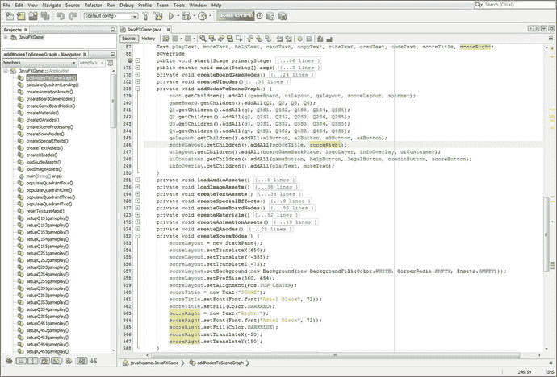

图 22-14。

Add a scoreRight object at the top of the class, instantiate and configure it, and add it to the SceneGraph

我在 scoreTitle 对象后添加了 scoreRight 对象实例化，并将其配置为使用深蓝色、Arial 黑色字体，字体大小为 72 磅。我添加了 X 和 Y 坐标，最初将其定位在 scoreLayout StackPane 中的(-50，150)。图 [22-14](#Fig14) 显示了代码，如下所示:

```java
private void createScoreNodes()  {
    ...
    scoreTitle = new Text("SCORE");
    scoreTitle.setFont( Font.font("Arial Black", 72) );
    scoreTitle.setFill(Color.DARKRED);
    scoreRight = new Text("Right:");
    scoreRight.setFont( Font.font("Arial Black", 72) );
    scoreRight.setFill(Color.DARKBLUE);
    scoreRight.setTranslateX(-50);
    scoreRight.setTranslateY(150);
}

```

图 [22-15](#Fig15) 显示了一个运行➤项目的工作流程，以预览右:heading 如何在配乐窗格中工作。

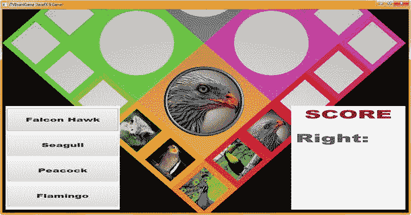

图 22-15。

Use a Run ➤ Project work process to preview the Score UI panel with new Dark Blue “Right:” score heading

因为这个特殊的 i3D 棋盘游戏设计是为即将入学的孩子设计的，所以让我们也包括一个“错误:”分数跟踪标题，并在每个答案后添加一些鼓励，如干得好！或者再次旋转。编写这段代码的最快方法是复制并粘贴 scoreRight 代码，并将其本身放在下面，将 scoreRight 更改为 score error，同时将颜色更改为红色，并将 X，Y 位置更改为-25，300。这显示在下面的 Java 9 代码中，并在图 [22-16](#Fig16) 的底部以黄色突出显示:

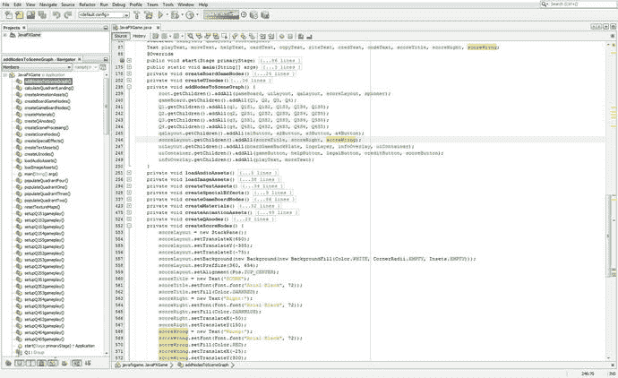

图 22-16。

Add scoreWrong object at the top of the class, instantiate and configure it, and add it to the SceneGraph

```java
private void createScoreNodes()  {
    ...
    scoreLayout.setPrefSize(360, 654);
    scoreLayout.setAlignment(Pos.TOP_CENTER);
    scoreTitle = new Text("SCORE");
    scoreTitle.setFont( Font.font("Arial Black", 72) );
    scoreTitle.setFill(Color.DARKRED);
    scoreRight = new Text("Right:");
    scoreRight.setFont( Font.font("Arial Black", 72) );
    scoreRight.setFill(Color.DARKBLUE);
    scoreRight.setTranslateX(-50);
    scoreRight.setTranslateY(150);
    scoreWrong = new Text("Wrong:");
    scoreWrong.setFont( Font.font("Arial Black", 72) );
    scoreWrong.setFill(Color.RED);
    scoreWrong.setTranslateX(-25);
    scoreWrong.setTranslateY(300);
}

```

图 [22-17](#Fig17) 显示了一个运行➤项目的工作流程，用于测试 Java 代码中的红色错误:文本标题。

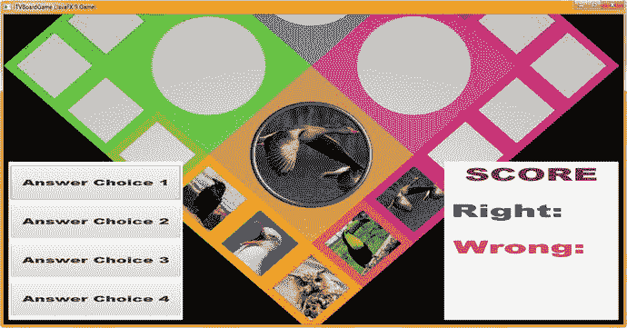

图 22-17。

Use a Run ➤ Project work process to preview the Score panel and Red “Wrong:” text

接下来，让我们在类顶部的复合语句中添加一个 scoreCheer 文本对象声明。正如你在图 [22-18](#Fig18) 顶部看到的黄色，你的复合语句现在有两行，一行用于启动(闪屏)UI 文本对象，另一行用于乐谱 UI 文本对象。

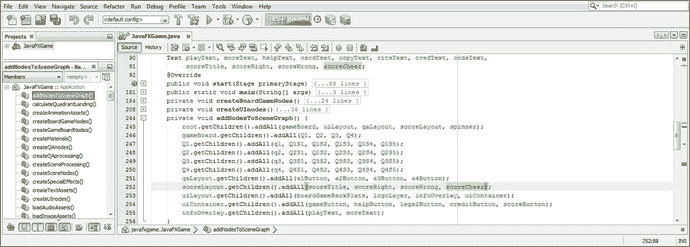

图 22-18。

Declare the scoreCheer Text object at the top of the class; then add it to your scoreLayout SceneGraph branch

由于已经声明了该对象，因此可以将其添加到 scoreLayout.getChildren()中。addAll()方法链，如图 [22-18](#Fig18) 所示，甚至在 NetBeans 9 中实例化它并且不创建错误之前。图 [22-18](#Fig18) 底部用浅蓝色突出显示的 Java 语句应该如下所示:

```java
scoreLayout.getChildren().addAll(scoreTitle, scoreRight, scoreWrong, scoreCheer);

```

将 score error Java 语句复制并粘贴到它们下面，并将 score error 更改为 scoreCheer。将 scoreCheer 设为深绿色，并将 scoreRight 和 scoreCheer 上的字体大小分别减小到 64 磅和 56 磅，以便它们更适合 scoreLayout。记住，我们需要空间来容纳代表这些分数的数字！由于 scoreWrong 更宽(因为字体中使用的字母)，我将此降低到 60 分。我将标题在 Y 维度上多间隔了 10 个单位，并通过使用-56、-44 和-2 的 X 位置将它们排列在左侧，如图 [22-19](#Fig19) 中粗体和突出显示的(至少是 scoreGrade 语句):

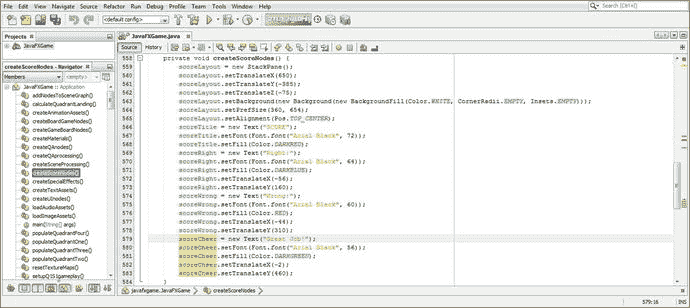

图 22-19。

Add the scoreCheer Text object in DarkGreen and tweak the other Text object font sizes and XY locations

```java
    scoreRight = new Text("Right:");
    scoreRight.setFont( Font.font("Arial Black", 64) );
    scoreRight.setFill(Color.DARKBLUE);
    scoreRight.setTranslateX(-56);
    scoreRight.setTranslateY(160);
    scoreWrong = new Text("Wrong:");
    scoreWrong.setFont( Font.font("Arial Black", 60) );
    scoreWrong.setFill(Color.RED);
    scoreWrong.setTranslateX(-44);
    scoreWrong.setTranslateY(310);
    scoreCheer = new Text("Great Job!");
    scoreGrade.setFont( Font.font("Arial Black", 56) );
    scoreGrade.setFill(Color.DARKGREEN);
    scoreGrade.setTranslateX(-2);
    scoreGrade.setTranslateY(460);

```

图 [22-20](#Fig20) 显示了用于渲染新文本对象标题及其调整后的字体大小和定位设置的运行➤项目工作流程。请注意，由于我们尚未扩散答案或评分逻辑，只有猎鹰(图 [22-11](#Fig11) 或 15 中的方块 1 选项 1)显示了代表答案选项的按钮标签。

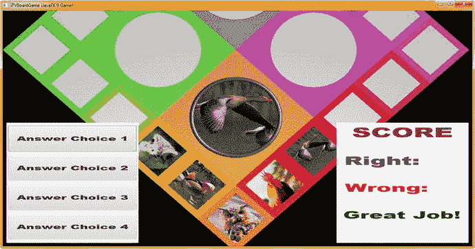

图 22-20。

Use the Run ➤ Project work process to preview the Score panel and Text object headings you have added

现在，我们准备将分数引擎逻辑添加到我们在第 [21](21.html) 章中放置的问答按钮元素中，并将文本答案正确和答案错误选项添加到我们的分数 UI 设计中。这将显示由 Q&UI 按钮元素生成的分数。之后，我们可以计算等级，并将其分配给字母等级的第七个文本元素。

## 评分引擎:计算答案分数的逻辑

让我们添加一个名为 createQAprocessing()的自定义方法来保存我们的评分引擎逻辑。在 createQAnodes()方法中创建的四个按钮元素的 setOnAction(event)事件处理。正如你在图 [22-21](#Fig21) 中看到的，这需要在我们在 createQAnodes()和 createScoreNodes()中设置 Q & A 并对 UI 设计评分之后，在我们在 createSceneProcessing()中调用这个 Q & A 事件处理之前。所以，在 scoreLayout.setVisible(false)后面加一行 Java 代码；语句和 createSceneProcessing()之前；声明，如图 [22-21](#Fig21) 中黄色高亮部分所示。使用 Alt+Enter 工作进程，通过让 NetBeans 9 编写引导方法代码和错误语句来删除红色波浪下划线，我们将很快替换这些代码和语句。这将打开一个下拉菜单，其中包含 javafxgame 中的创建方法“createQAprocessing()”。JavaFXGame 选项，双击该选项即可执行(单击将选中该单选，如图 [22-21](#Fig21) )。

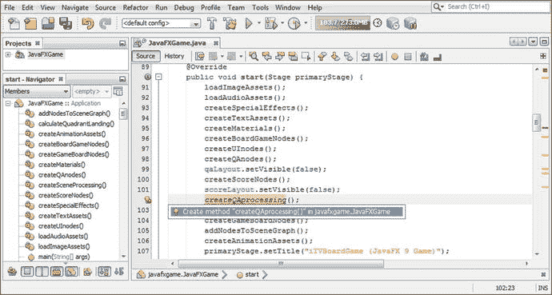

图 22-21。

Add the createQAprocessing() method call after createQAnodes() and createScoreNodes() and use Alt+Enter

对这四个动作事件处理结构中的第一个进行编码的最简单的方法是进入您的。start()方法，并将您在本书前面创建的按钮事件处理结构复制并粘贴到这个新创建的 createQAprocessing()方法中。在使用 Paste 命令之前，请确保完全选择 NetBeans 引导错误语句代码行，以便 ActionEvent 处理代码替换此引导错误语句。

更改。setOnAction()方法调用从调用到 a1Button，并删除此事件处理构造中的处理语句，使其成为一个空事件处理程序，以便我们可以从头开始构建分数处理逻辑。事件处理程序的 Java 代码如下所示，如图 [22-22](#Fig22) 所示:

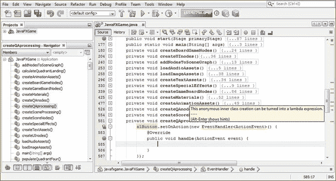

图 22-22。

Mouse over the event handling structure, and notice NetBeans wants to convert to a lambda expression

```java
private void createQAprocessing() {
    a1Button.setOnAction(new EventHandler<ActionEvent>() {
        @Override
        public void handle (ActionEvent event) {
            ... // An Empty ActionEvent Handling Structure
        }
    });
}

```

Alt+Enter 生成的 Java 代码将是相同的空事件处理结构，使用 lambda 表达式方法，这将删除八行代码中的三行，即 37.5%的编码结构。

您的 Java 9 代码应该如下所示，您得到的 lambda 表达式如图 [22-24](#Fig24) 所示。图 [22-23](#Fig23) 显示了调用 NetBeans Alt+Enter 键后的工作过程。选择“使用 lambda 表达式”选项，该选项将在 NetBeans 9 IDE 中执行一个算法，该算法将为您重写 Java 代码，并将其转换为更短的 lambda 表达式编程格式。

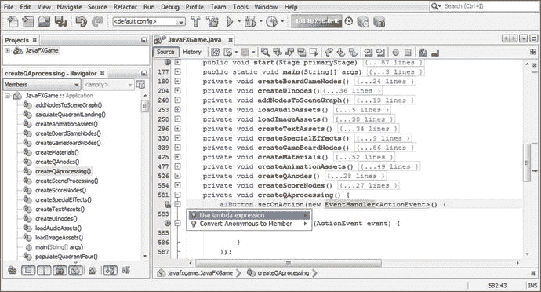

图 22-23。

Use the Alt+Enter keystroke and select and double-click the “Use lambda expression” option to convert

```java
private void createQAprocessing() {
    a1Button.setOnAction(ActionEvent event) -> {

        ... // Empty ActionEvent Handling Lambda Expression Structure

    });
}

```

在您的空 ActionEvent 处理 lambda 表达式中，我们将为每个 Button 对象提供条件 if()结构，该结构将查看 picked Node 对象和 pickSn Random 对象，以确定我们正在处理哪个游戏棋盘方块(Q1S1 到 Q4S5)和随机数生成器值(pickS1 到 pickS20)。这将告诉我们正在查看哪些内容，然后我们的评分引擎逻辑将对该选择进行评分。

在 a1Button.setOnAction()构造中，添加一个 if(picked == Q1S1)来开始这个编码过程。请注意，NetBeans 错误突出显示了选中的节点对象，因为它当前是 createSceneProcessing()方法的本地(私有)对象，如图 [22-24](#Fig24) 所示。接下来，我们将不得不使这个选中的节点对象成为一个全局(公共)变量。

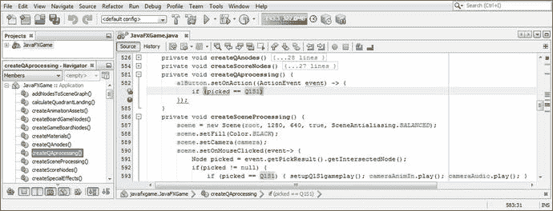

图 22-24。

NetBeans error highlights picked Node in the if() statement because it is local to createSceneProcessing()

在你的类的顶部声明选中的节点，如图 [22-25](#Fig25) 中突出显示的，以消除这个错误。

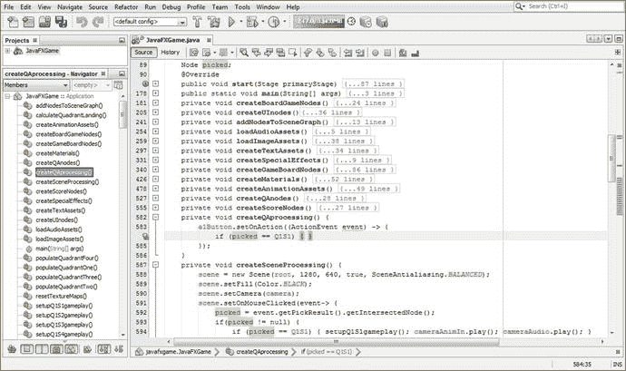

图 22-25。

Remove the Node declaration from createSceneProcessing(); relocate it to the top of the class, making it global

现在，我们将在 createQAprocessing()方法中查看的所有对象都已声明，因此它们对整个类都是可见的，我们可以继续使用位于 a1Button 事件处理构造中的`if (picked == Q1S2` `&&` `pickS1 == 0) { ... }`结构对 a1Button 事件处理进行编码。

在类的顶部声明一个 rightAnswer integer 和 rightAnswers Text 对象，作为 int 变量和 Text 对象的复合声明语句的一部分，因为我们将要编写的 Java 9 代码将利用这些。

我们在 if()构造中要做的是(如果按钮 1 包含正确答案)将 rightAnswer 整数加 1，然后通过使用. setText()方法调用将 rightAnswers 文本对象设置为这个 right answer 值。在里面。setText()方法我们将使用 String.valueOf()方法将 rightAnswer 整数转换为字符串值并使用。setText()将 scoreCheer 设置为伟大的工作！。正确答案处理的代码，在 Q1S1 选项 0(第一个答案选项)的情况下是正确的(一个正确答案)，应该看起来像下面的代码，如图 [22-26](#Fig26) 中突出显示的。它被编码成两行(四行，包括 lambda 表达式),以允许 20 个 board square score 逻辑处理 Java 构造适合 createQAprocessing()方法体内的 120 行代码。

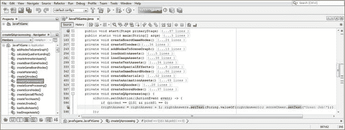

图 22-26。

Code a compact if() statement evaluating Q1S1 and pickS1 to see whether the a1Button answer is a correct one

```java
a1Button.setOnAction(ActionEvent event) -> {
    if (picked == Q1S1 && pickS1 == 0) { rightAnswer = rightAnswer + 1;
        rightAnswers.setText(String.valueOf(rightAnswer)); scoreCheer.setText("Great Job!"); }
});

```

为了能够显示这个 rightAnswer 整数，我们需要在 createScoreNodes()中将 rightAnswers 文本对象添加到您的 UI 设计中。这是使用复制粘贴技术完成的。将 Java 代码的 scoreRight 块直接复制到它自己的下面。设置颜色为黑色，X 位置为 96。Y 位置应该保持不变，以便对齐“右”文本对象。通过在构造函数方法中使用“0”字符串值，将初始文本值设置为零。

图 [22-27](#Fig27) 底部显示的 Java 代码应该类似于以下代码:

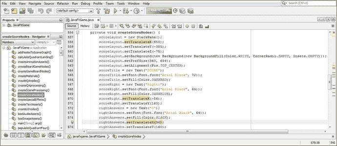

图 22-27。

Add the rightAnswers Text object to createScoreNodes() to display the result of your integer calculation

```java
rightAnswers = new Text("0");                            // Initializes rightAnswers to Zero
rightAnswers.setFont(Font.font("Arial Black", 64));
rightAnswers.setFill(Color.BLACK);
rightAnswers.setTranslateX(96);
rightAnswers.setTranslateY(160);

```

图 [22-28](#Fig28) 显示了用于渲染 rightAnswers 文本对象及其设置的运行➤项目工作流程。

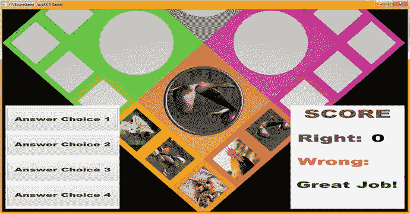

图 22-28。

Use a Run ➤ Project work process to preview the Score panel and the rightAnswers Text object placement

其他按钮元素使用类似的代码，只不过它们将向一个 wrongAnswer int 变量添加一个。这意味着您将复制您创建了三次的 a1Button 构造，通过 a4Button 将 a1Button 更改为 a2Button。将 rightAnswer 改为 wrongAnswer，将 rightAnswers 改为 wrongAnswers，如图 [22-29](#Fig29) 所示。

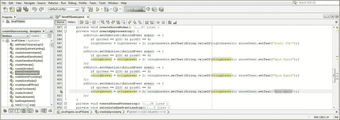

图 22-29。

Copy and paste a1Button construct three times underneath itself and change the object and variable names

还要改“干得好！”“再次旋转”为了能够显示一个错误答案整数，我们需要添加一个错误答案文本对象到 createScoreNodes()。这是通过复制粘贴过程完成的。将 score error Java 代码块直接复制到其自身下面。设置颜色为黑色，X 位置为 96。Y 位置保持不变，以对齐两个文本对象。在构造函数方法中使用“0”字符串值将初始文本值设置为零。

图 [22-30](#Fig30) 底部显示的 Java 9 代码看起来应该类似于下面的代码:

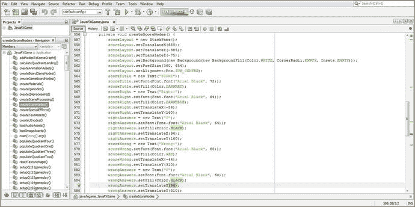

图 22-30。

Add the wrongAnswers Text object to createScoreNodes() to display the result of the integer calculation

```java
wrongAnswers = new Text("0");                            // Initializes wrongAnswers to Zero
wrongAnswers.setFont(Font.font("Arial Black", 64));
wrongAnswers.setFill(Color.BLACK);
wrongAnswers.setTranslateX(96);
wrongAnswers.setTranslateY(160);

```

请记住，为了查看正确答案和错误答案答案结果文本对象值持有者，您必须将它们添加到 scoreLayout StackPane 内的 SceneGraph 层次结构中。getChildren()。addAll()语句。

我只用了一个屏幕截图来展示将这些文本节点添加到 StackPane 中以节省本章的空间，因为我们有许多 Java 代码要做来完成您的棋盘游戏评分和分级基础结构。一旦我们完成了对这段代码的测试，您所要做的就是在 createQAprocessing()方法体中复制其他 59 个选项的评分代码，为其他 19 个游戏棋盘方格创建评分。这将需要与您的其他 59 组答案相匹配，您将复制并粘贴这些答案，然后使用我们在第 [21](21.html) 章中创建的代码进行编辑。

然后你会得到你所有的答案和分数！你可以在下一章开始“防错”你的代码，以确保多个 UI 元素在需要之前不会被点击。请记住，这些是年幼的儿童，智力受到挑战，玩教育游戏，所以你需要这个用户界面的保护。`scoreLayout.getChildren().addAll()`方法链的 Java 代码看起来像下面的 Java 代码，如图 [22-31](#Fig31) 所示:

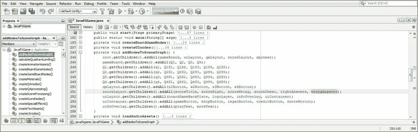

图 22-31。

Be sure to add any new Node objects to the SceneGraph hierarchy so they will be visible at render time

```java
scoreLayout.getChildren().addAll( scoreTitle, scoreRight, scoreWrong, scoreCheer,
                                  rightAnswers, wrongAnswers);

```

图 [22-32](#Fig32) 显示了用于呈现新的错误答案文本对象及其设置的运行➤项目工作流程；如您所见，这对齐了 score (integer)元素，如果数值字段向右扩展，则为更大的分数(10 和 100)留出了空间，我们将在下一节 score 代码测试中确定这一点。

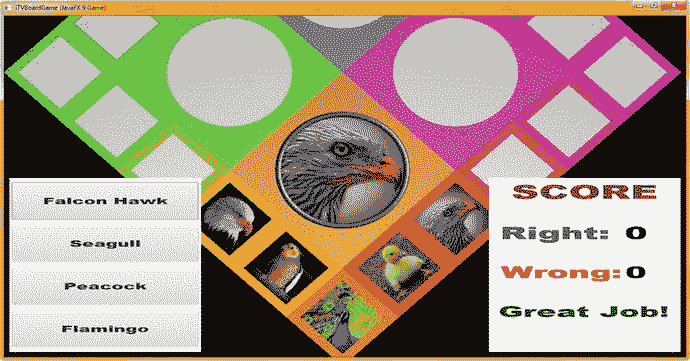

图 22-32。

Use your Run ➤ Project work process to preview your Score UI panel and your wrongAnswers Text object

接下来，让我们测试一下我们刚刚编写的评分代码，看看评分 UI 设计是否正确地响应了分数向两位数的递增。也就是说，数值的增加是向右扩展还是向左扩展？还是从中心向外扩展？一旦我们弄清楚了这一点，我们就可以进一步“调整”(优化)我们的评分 UI 设计。

## 分数 UI 测试:显示更大的整数

由于我们还没有实现“玩家验证”Java 代码，我们将在下一章中实现，这样玩家就不能在每个游戏周期中多次单击 UI 元素(3D 旋转器、游戏棋盘方块、按钮)来“游戏”系统(或导致呈现错误出现)，我们目前可以多次单击按钮元素。这允许我们测试记分板 UI，以找出大于 9 的数字将如何显示，以便我们可以“调整”X 位置，并将数字(正确和错误)间隔到左侧(当前间距)、最右侧或标签中心(标题)和乐谱 UI 面板的右边缘。如图 [22-33](#Fig33) 所示，我已经点了十次正确的(猎鹰 Hawk)答案，看看数字会如何移动。正如你所看到的，数字从中心向外扩展，这可以通过比较 10 和 2 来看出，而不是向左或向右。因此，我们需要将这 120 个单位向右移动。现在你的得分值将能够扩大到两位数或三位数。

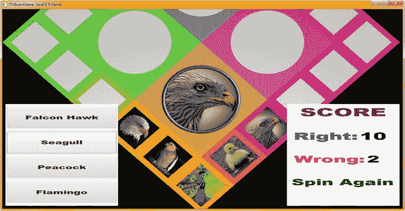

图 22-33。

Use your Run ➤ Project work process and click the Button elements to increment (test) your scoring code

递增。从 96 到 120 的 rightAnswers 和 wrongAnswers 文本对象的 setTranslateX()方法调用。这将使乐谱 UI 的数字部分在标签(标题)和乐谱 UI 面板的右侧居中。您的代码现在应该看起来如下，它在图 [22-34](#Fig34) 的中间和底部突出显示:


图 22-34。

Expand the X position of each numeric element 24 units to the right, from a value of 96 to a value of 120

```java
rightAnswers = new Text("0");
rightAnswers.setFont(Font.font("Arial Black", 64));
rightAnswers.setFill(Color.BLACK);

rightAnswers.setTranslateX(120);                    // Update X position 24 units from 96 to 120
rightAnswers.setTranslateY(160);
wrongAnswers = new Text("0");
wrongAnswers.setFont(Font.font("Arial Black", 64));
wrongAnswers.setFill(Color.BLACK);

wrongAnswers.setTranslateX(120);                    // Update X position 24 units from 96 to 120
wrongAnswers.setTranslateY(160);

```

同样，使用图 [22-35](#Fig35) 中所示的“运行➤项目”工作流程来渲染游戏，并导航到分数 UI 面板，以查看这是否会分隔数字显示，以便 10 到 99 的分数在分数 UI 面板中显示时看起来很棒。

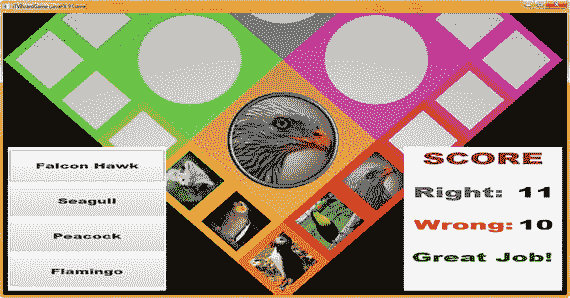

图 22-35。

Use the Run ➤ Project work process and click the Button elements to increment (test) double-digit scores

大多数玩家不会在一次游戏中玩(旋转)游戏板数百次，所以这对这个游戏来说应该很好。但是，请注意，三位数(100 到 999)也应该合适。

然而，如果你期待这么多的游戏性，你可能想要在分数 UI 设计的左侧再多留 4 到 8 个单位的标签(标题),这样就可以轻松容纳你的三位数游戏分数。

现在你已经准备好“增殖”我们在这一章关于计分和第 [21](21.html) 章中写的代码来创建整个游戏基础设施。这将在我们已经创建了超过 22 章的 1000(或更多)行 Java 代码的基础上再增加 1000 行代码，以将整个 i3D 棋盘游戏基础设施放置到位。接下来就说说怎么做这个吧。这是关于 2D 内容(图像、答案选项和得分)的大量工作，但它将与我们迄今为止使用 JavaFX 9 APIs 创建的 i3D 棋盘游戏无缝集成。

## 完成游戏:添加答案和分数

为 60 个不同的游戏棋盘方格选项添加 4 个答案涉及 240 个不同的内容选项(和代码行)，为这 60 个不同的游戏棋盘方格选项添加得分涉及另外 480 行代码，如果包括 lambda 表达式容器，可能还要多一点。这是一个相当容易无错执行的大量工作的原因是，我们已经创建了一个代码设计，可以复制并粘贴到适当的位置，并且可以创建、插入和跟踪文本值，以便游戏内容在播放时能够正确工作。也就是说，不要期望为您的专业 Java 9 游戏开发管道创建内容会比创建 Java 9 代码更容易，因为游戏设计和游戏开发涉及大量的新媒体、内容、策略和编码工作，最终会产生专业的结果。

我会一次添加一个游戏棋盘方格的答案和分数，直到所有 20 个游戏棋盘方格都就位。添加未来的游戏板广场选项可以很容易地完成。您只需使用 random.nextInt(n)变量将 pickS1 到 pickS20 变量增加 1，即可添加 4 个不同的随机图像主题到每个游戏棋盘方格中。添加额外的一轮随机内容将相当于添加 20 轮新的按钮回答(80 个回答选项)并在您的评分逻辑中对这 80 个新回答进行评分，这将相当于 160 行代码，或者每个游戏板内容深度添加大约 240 行代码。增加游戏板内容的深度意味着玩家玩游戏的时间越长，看到的重复内容就越少。如果您愿意，还可以添加代码来跟踪已使用的内容。

一旦你将剩下的内容扩展成答案和评分逻辑，你就完成了游戏设计和开发工作流程的大部分。在接下来的章节中，我们将研究防错 UI 设计，以便用户在玩游戏的过程中被迫正确使用它，以及使用新的 Java 9 NetBeans IDE 进行优化和代码分析等事情。

## 摘要

在第二十二章中，我们学习了如何在 i3D 棋盘游戏设计的右下角实现一个乐谱 UI 面板。我们还学习了如何使用问答面板中的按钮 UI 元素上的 ActionEvent 处理来更改记分板数字部分的分数，这是我们在上一章 [21](21.html) 中创建的。这基本上把我们放在一个位置，我们可以完成编码和评分的个人广场(和象限，一旦广场被选中)，游戏，其中一个关于内容的视觉问题得到回答和评分。(在我开始写第 23 章[之前，我必须这么做。)](23.html)

这意味着这是您的另一个繁重的编码章节，因为您构造了 20 个自定义方法，setupQ1S1gameplay()到 setupQ4S5gameplay()。您还在 createQAprocessing()事件处理基础结构中为每个按钮元素放置了条件 if()结构。您仍然需要确保交叉检查所有棋盘游戏方法之间的图像素材，最后，您需要一起测试所有代码，以确保它对每个游戏棋盘方格都正常工作。

在第 [23](23.html) 章中，作为游戏性保护的一部分，我们当然会在回答和评分完成后反转相机动画，并以更倾斜的视角显示动画，这是查看游戏棋盘旋转的最佳方式。我们还将防止点击任何可以点击的 UI 元素，这样用户就只能选择一个主题，例如，可以旋转一次白板。我们决不会结束游戏设计工作流程！