# 二十四、使用 NetBeans 优化游戏素材和代码以及游戏分析

现在你的游戏运行了，玩家一次点击(回合)使用它，我们可以看看它使用了多少内存，所有这些素材有多大。我们还可以想办法将数字音频和图像素材缩小 2 到 4 倍。首先使用 GIMP 进行数据占用优化，然后使用 NetBeans 9 Profiler 对当前的 24 位图像素材和 CD 质量的 16 位 44.1KHz 音频素材进行分析。通过这种方式，我们可以看到高端多媒体素材是否占用了太多的内存和 CPU 开销，或者我的开发系统是否处理得很好，我的开发系统是沃尔玛的一款老式 4GB Win7 Acer 四核微塔式机(几年前售价 300 美元)。我一直在这个系统上使用 NetBeans 9 开发 Java 9，没有发生任何事故。目前的系统是六核或八核，内存为 8MB 或 16MB，因此 Java 9 开发可以在旧系统上轻松完成，不需要像 Unity、Android 或 Lumberyard 等其他 i3D 平台那样需要先进的系统。

在本章中，我们将转换您的数字图像资源，以使用 8 位(索引)颜色而不是 24 位“真实”颜色来创建纹理贴图，并且我们将运行 NetBeans Profiler 来查看您的 Java 代码在运行游戏时使用了多少内存和 CPU 处理。

## 优化纹理贴图:转换为 8 位颜色

目前，您的 source ( `/src/`)文件夹中的数字图像素材大约为 24MB，即 24，000，000 字节，这对于一个有 120 个不同图像的 i3D 棋盘游戏来说是相当不错的(平均每个图像大约 200KB)。然而，如果我们能把它压缩到 10MB(每张图片 84KB)，这将会大大减少我们游戏发行包的大小。实现图像“重量”或大小减少 300%到 400%的方法是使用 8 位颜色(索引色)以及“抖动”或点图案，用于模拟比用于表示索引图像的最大 256 色更多的颜色。小到中等的纹理贴图，这正是我们在游戏棋盘的正方形和象限中使用的，可以很好地处理索引色。这样做的原因是因为抖动可以被放大(近距离)看到，但当图像被观看得更远时(从远处看或缩小)，这种视觉效果就会消失。我将在本章的这一节向您展示这一点，我们将把所有 120 个图像素材从 24 位转换为 8 位索引颜色。

### 创建索引颜色纹理:在 GIMP 中更改颜色模式

让我们以这样一种方式优化我们的图像素材，即我们不必对我们的 Java 代码做任何重大的改变。为了保持我们的 Java 代码不变，我们将使用相同的文件名，并将它们放在不同的文件夹中，在/src/ called /8bit/下。因此，我们将拥有索引颜色资源的/src/8bit/ path 和 24 位高质量资源的/filename 路径。使用操作系统文件管理实用程序在当前/src 文件夹下创建一个名为/8bit/的文件夹(目录),其中包含原始的真彩色图像资源。图 [24-1](#Fig1) 显示了这个新文件夹。

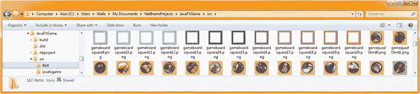

图 24-1。

Create the /JavaFXGame/src/8bit/ folder to hold optimized versions of your 120 texture map image assets

使用文件➤打开在 GIMP 中打开第一张 gamequad1bird0.png 纹理贴图图像，然后使用图像➤模式➤索引菜单序列将 24 位颜色空间(颜色模式)转换为 8 位，如图 [24-2](#Fig2) 所示。这将打开“索引颜色转换”对话框，允许您选择多种颜色和一种抖动算法。8 位模式将位数减少了 300%或更多，抖动算法模拟了超过 256 种颜色。

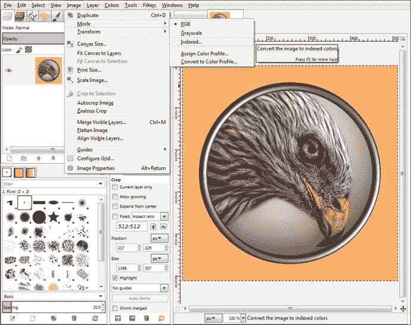

图 24-2。

Use a File ➤ Open menu sequence to open a texture map and use Image ➤ Mode ➤ Indexed to convert it to 8-bit

我使用了最大允许的 256 种颜色(0 到 255)，方法是选择生成最佳调色板单选按钮，如图 [24-3](#Fig3) 中最左边的对话框所示，以及正常的 Floyd-Steinberg 颜色抖动算法。然后我点击对话框右下角的转换按钮。要将 8 位图像导出到/src/8bit/文件夹，使用 GIMP 文件➤导出为菜单序列，双击 8 位文件夹(在图 [24-3](#Fig3) 的第二个面板中高亮显示)，点击导出按钮(保持 24 位文件名不变，如第三个面板中高亮显示)。

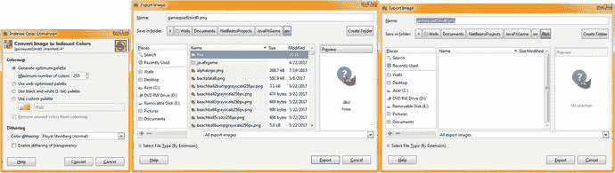

图 24-3。

Set the conversion to 256-color Floyd-Steinberg, convert, and save in the /src/8bit folder with the same file name

正如你在图 [24-4](#Fig4) 中看到的，如果我们将一幅图像(`gamequad1bird1.png`)转换成 8 位索引色后放大到第二象限，你可以清楚地看到背景、鸟嘴和钢箍中的抖动。有趣的是，当你使用图像作为纹理贴图(缩小)时，你看不到这种抖动！当我们在 Java 代码中实现这些变化时，我将在本章的后面向您展示这一点(在图 [24-26](#Fig26) 和 [24-27](#Fig27) )。

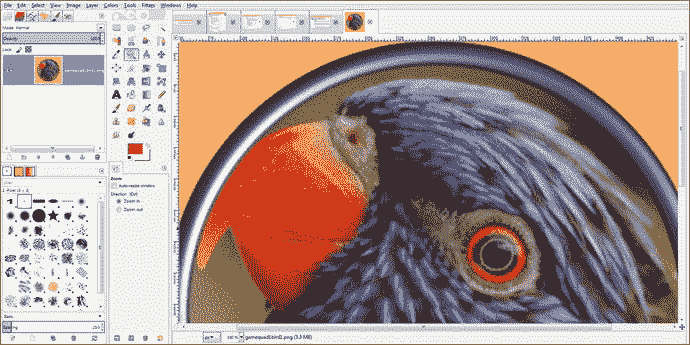

图 24-4。

Click the Magnify Glass (Zoom) Tool and zoom in 300 percent (three times) to see the color dithering algorithm

正如你在图 [24-5](#Fig5) 中看到的，你的真彩色(24 位)图像在质量上是原始的，但是使用了数倍的数据。当缩小时(用作纹理贴图)，两个图像看起来几乎相同，这就是为什么我们将您的 24 位图像转换为 8 位图像，因为我们可以从 24MB 的数字图像素材增加到不到 8MB，而几乎没有损失 i3D 游戏板纹理贴图的感知质量，至少从玩家的角度来看是这样。

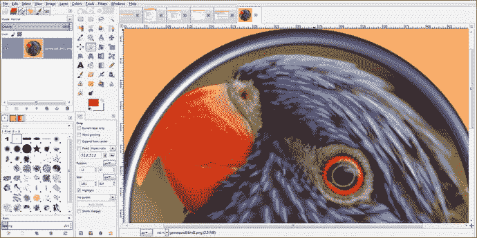

图 24-5。

Undo the indexed color, click the Magnify Glass Tool, and again zoom in 300 percent to see the (original) true-color data

使用如图 [24-6](#Fig6) 所示的文件➤关闭对话框，在将索引图像文件保存到/src/8bit 文件夹后关闭该文件。因为您从/src 文件夹中打开了 24 位文件，所以您希望确保单击“放弃更改”,这样您将得到原始的 24 位 PNG24 文件和新导出(保存)的 8 位 PNG8 文件，它们使用相同的名称，但保存在不同的文件夹中。这一点很重要，你要注意 120 次，这样你就有 120 个 PNG24 文件和 120 个 PNG8 文件在不同的目录中。要更改这些图像的引用，您只需将/8bit/filename.png 路径更改添加到您已创建的索引颜色素材文件夹名称中，然后 i3D 游戏将使用这些较小的文件大小来纹理映射您的游戏棋盘方块和象限。

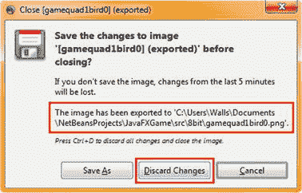

图 24-6。

Click Discard Changes to keep a 24-bit version

如图 [24-7](#Fig7) 所示，第一象限完成，8 位文件大小从 76KB 到 104KB 不等。

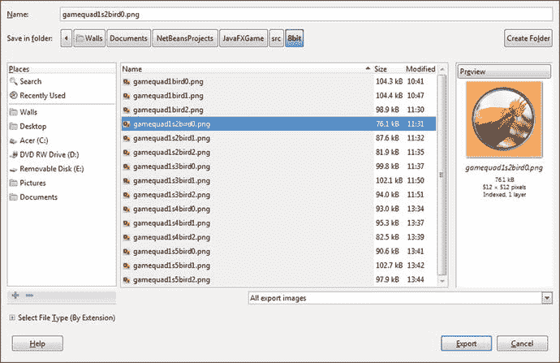

图 24-7。

The first quadrant texture maps have all been reduced more than 300 percent and still look fantastic as texture maps

正如你在图 [24-8](#Fig8) 中看到的，我们已经将象限纹理贴图数据从 4MB 减少到 1.33MB。

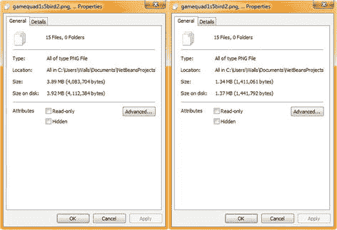

图 24-8。

Preview data reduction in File Explorer

正如你在图 [24-9](#Fig9) 中看到的，我继续减少所有 60 个图像素材的象限纹理贴图。

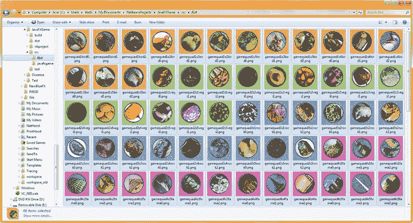

图 24-9。

Go into the /src/8bit folder, select all 60 images, right-click the selection, and open Properties

正如你在图 [24-10](#Fig10) 中看到的，我现在也已经为你的游戏棋盘方块完成了这些 8 位图像。

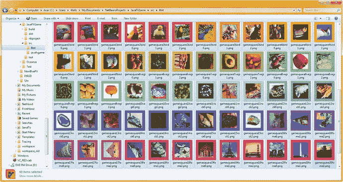

图 24-10。

Go into the /src/8bit folder and select all 60 images; right-click the selection and open Properties

如图 [24-7](#Fig7) 、 [24-9](#Fig9) 和 [24-10](#Fig10) 所示，这些索引彩色图像越小，它们看起来就越像真彩色图像，尽管在许多情况下它们要小几倍(三到四倍)！在本章的第一部分，我们将介绍如何将图像优化为 8 位(索引)颜色，因为这是减少分发文件数据占用空间(代码和素材包中图像素材的大小)的有效方法。

其中一些图像，例如红色的柿子椒，将非常适合索引色，因为红色光谱、白色背景和绿色边框颜色可以非常接近于仅使用 256 种颜色和紧密匹配的颜色之间的微妙抖动来表示真彩色图像，这在放大时甚至看不到。图 [24-11](#Fig11) 显示了象限纹理贴图(左半部)和方形纹理贴图(右侧)的真彩色和索引图像结果(来自图 [24-9](#Fig9) 和 [24-10](#Fig10) 所示的选择类型)。

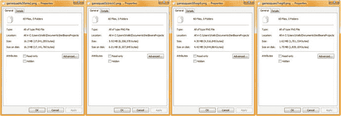

图 24-11。

Right-click the selected square and quadrant images in both folders; use Properties to preview the optimization

我们已经将游戏棋盘象限纹理贴图的数据占用空间从 17，041，285 字节减少到 6，208，570 字节，减少了 10，832，715 字节。这意味着象限图像的数据占用空间减少了 65 %(三分之二)。这是 512 像素的正方形，对于一个 i3D 游戏来说是相当大的(高质量)，所以 60 张图片的 6MB 是很好的质量，每象限图片大约 100KB，正如你在 GIMP 中已经在图 [24-7](#Fig7) 中看到的。

我们还将游戏棋盘正方形纹理贴图的数据占用空间从 4，516，845 字节减少到 1，701，334 字节，减少了 2，815，511 字节。游戏板正方形图像的数据占用空间减少了 63%。这些是 256 像素的正方形，这是 i3D 游戏的主流(高质量)，因此 1.7MB 的 60 张图像是很好的质量，每个游戏棋盘正方形图像大约 28KB，或者每个游戏主题选择大约 128KB 的图像数据。

要引用这些优化的素材，只需在 Java 代码中的文件名前添加/8bit/ path，这将在我使用原始的 24 位数字图像素材和 CD 质量的数字音频素材对当前代码进行分析之后进行。始终使用最高质量的素材来分析您的代码，以便您可以看到内存和 CPU 周期是否受到过大的新媒体元素的影响(数据占用方面)。就职业 Java 游戏而言，这是 NetBeans profiler 将告诉您的大部分内容。是的，你的 Java 逻辑很重要。无限循环问题会很快在 profiler 中出现，但非优化的动画对象构造、过大的纹理贴图、过长的数字音频声音效果、没有很好优化的数字视频以及使用过多多边形(过多几何体)的 i3D 资源也会出现。这就是为什么我们在本书前三分之一的时间里研究了各种新媒体的概念和原理，因为新媒体的优化影响了游戏的玩法。

## NetBeans 9 Profiler:测试内存和 CPU 使用率

要调用 NetBeans 9 Profiler，只需使用 Profile 菜单和位于该菜单顶部的 Profile 项目(JavaFXGame)选项，如图 [24-12](#Fig12) 所示。还显示了 40 个自定义方法、必需的 start()和 main()方法，以及自从创建 JavaFXGame 引导应用以来我们添加的 1700 行 Java 9 代码。NetBeans 9 分析会话可以显示程序执行期间计算机上发生的大量复杂的“幕后”操作，以及与服务器的交互，甚至 SQL 数据库访问模式。因此，在本章中，我们不会涉及 NetBeans 9 分析系统的所有功能；但是，如果您对 Java 软件概要分析感兴趣，您当然应该利用自己的时间，在各种 64 位工作站上使用您的其他 Java 9 软件开发项目，探索和试验概要分析器选项。

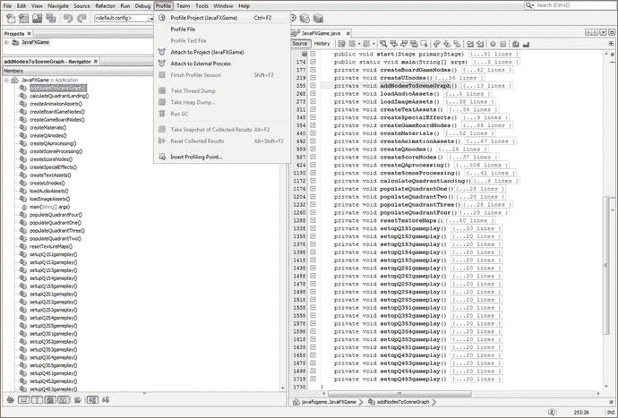

图 24-12。

Invoke a Profiler ➤ Profile Project (JavaFXGame) menu sequence to start a NetBeans profiling session

一旦您第一次调用了分析器，您将在 IDE 中得到一个选项卡，其中包含了分析 UI 和生成的分析器数据 UI，如图 [24-13](#Fig13) 所示。JavaFXGame 选项卡有一个性能分析图标，左上角有一个配置会话下拉菜单 UI 元素，还有一个配置和启动性能分析指令序列，它将概述性能分析程序选项类型，并准确地告诉您如何选择要使用的选项。

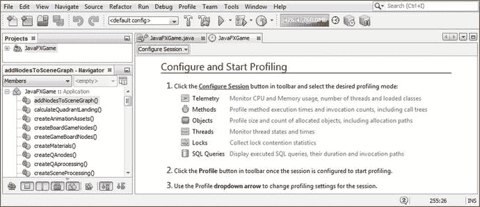

图 24-13。

Once you invoke the NetBeans 9 profiler, you’ll get a JavaFXGame Profiling tab and configuration instructions

我们将首先查看遥测分析模式，因为这向我们展示了游戏如何使用系统内存和 CPU 周期，以及线程、类和垃圾收集如何影响游戏在您的开发系统上的运行。这是大部分关键的游戏代码处理信息，我们希望首先查看这些信息，以确保您的 i3D 棋盘游戏以最佳方式(即高效地)使用 Java 9 和 JavaFX 9。

单击选项卡窗格左上角的配置会话 UI 选择器旁边的向下箭头，并选择遥测选项(在图 [24-14](#Fig14) 中以浅蓝色突出显示),以启动 NetBeans 遥测分析会话。保持默认的“使用已定义的分析点”选项处于选中状态，以允许 NetBeans 9 最初为您配置此分析会话。如果发现了异常情况，您可以在稍后的分析会话中设置定制的分析点，以进一步尝试确定 Java 游戏代码有什么问题。现在让我们希望我们在本书中对以最佳方式做事的关注得到了回报。无论哪种方式，NetBeans profiler 都会揭示这一点！

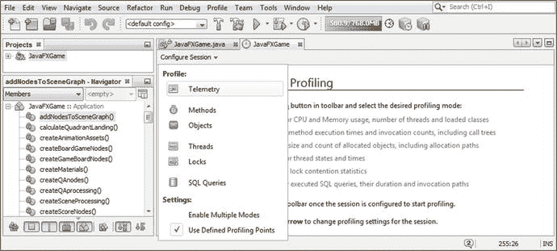

图 24-14。

Drop down the Configure Session menu and select the Telemetry option to profile your memory and CPU

然后，JavaFXGame 分析窗格将显示 CPU(和垃圾收集)图形的 UI 基础结构、(系统)内存实时使用图形、垃圾收集处理图形以及线程和类图形，如图 [24-15](#Fig15) 所示。还没有收集到数据，因为还没有使用 Profile 项目图标激活(启动)概要分析，该图标显示在图的顶部，带有淡黄色的弹出描述符。

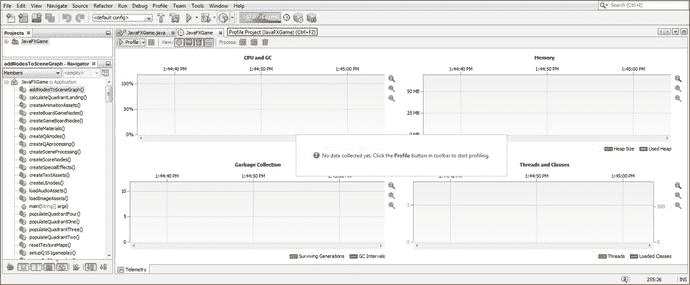

图 24-15。

Once you click the Profile Project Icon or Menu Item, the JavaFXGame Profile pane will populate with empty UI elements

单击您的 Profile 项目图标，您将得到“Profiler 现在将执行您的机器和目标 JVM 的初始校准”消息，如图 [24-16](#Fig16) 所示，位于五个对话框的最左边。请记住，NetBeans Profiler 正在分析您的系统和 Java 9 JVM，因此，如果您在 8 核、12 核或 16 核计算机上进行分析(比如一个新的 AMD 锐龙 5 或 7 系统，具有 16GB 的 DDR4-2400)，您将获得与我在只有 4GB DDR 3-1333 内存的旧四核 Acer AMD 3.11GHz 系统上获得的结果不同的结果。我使用这样一个旧的 Windows 7 系统的原因是为了展示 Java 9 和 NetBeans 9 有多么优化，这样你就可以使用一台不能用于 Amazon Lumberyard 或 Android Studio 3.0 或 Unity development 的计算机来开发一个专业的 JavaFX i3D 游戏。

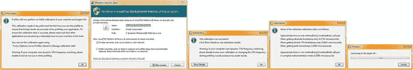

图 24-16。

Once you start a profiler, you’ll get a series of dialogs for calibrating and configuring this profiling process

如果出现 Windows 7 防火墙对话框，点击允许访问按钮，如图 [24-16](#Fig16) 第二个对话框所示。然后选择显示此校准数据的详细信息，并单击确定按钮继续。您将看到一个对话框，其中显示了一些已获得的校准数据。单击该对话框的“确定”按钮后，您将看到一个“连接到目标虚拟机”对话框，其中显示了一个进度条，指示 NetBeans 9 IDE 将游戏代码和内容加载到系统内存中，以便执行校准，并最终收集和显示性能分析数据。

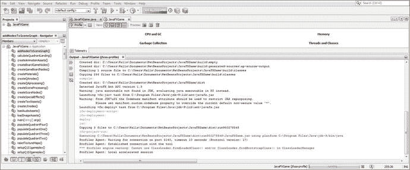

图 24-17。

An Output Pane will open, showing your Java 9 code being run in the NetBeans Profiler Agent Utility

如图 [24-17](#Fig17) 所示，接下来你会看到的是执行游戏 Java 代码的输出面板。

关闭输出窗格，再次显示 Profiler 遥测 UI。游戏和剖析程序现在应该共享屏幕了。您在游戏中所做的任何事情都会实时反映在这些 NetBeans Profiler 遥测面板中，如图 [24-18](#Fig18) 所示。我使用红色 Arial 文本注释接下来的五个图形，以阐明我正在测试游戏的五个主要阶段中的哪一个，您可以从 profiler UI 数据中看到 3D 动画、音频回放、纹理贴图加载(或卸载)、事件处理和 Java 代码处理在 CPU 处理(百分比)开销、系统内存使用(大部分将用于加载数字图像或保存和播放数字音频， 以及保存我们用来进行 3D 建模、3D 纹理、3D 动画和音频的 JavaFX API 类)、垃圾收集、线程使用和(单个游戏原型)类使用。

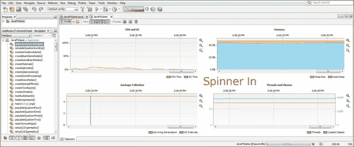

图 24-18。

The Animation object moving a rotating 3D spinner UI onto the screen uses 0 to 5 percent of the CPU’s capacity

正如你在图 [24-18](#Fig18) 中看到的，将你的 i3D spinner UI 移动到屏幕上只使用了百分之几的 CPU，只有一两秒钟，所以这似乎是很好的编码。一旦 i3D 微调器“着陆”在屏幕上，点击它的用户界面，其分析数据如图 [24-19](#Fig19) 所示，就 CPU 使用而言，看起来也是高度优化的。请注意，可以在垃圾收集窗格和线程和类窗格中看到着陆的游戏棋盘象限(五个)正方形图像的数量。当您的随机数生成时，此活动会达到峰值，五个游戏方格会加载随机选择的图像素材，然后这些素材会被放入系统内存中。

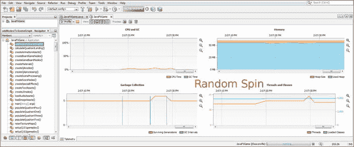

图 24-19。

The board spin uses garbage collection to load images into memory and threads to pick a random number

选取一个方块会调用垃圾收集来加载象限图像，当选取一个方块时，CPU 线程处理会出现峰值，代表垃圾收集、事件处理、问答和分数处理，如图 [24-20](#Fig20) 所示。

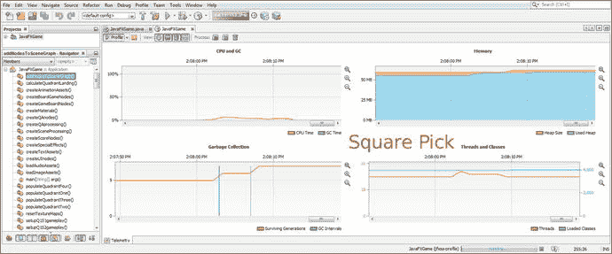

图 24-20。

A square pick uses garbage collection to load imagery into memory and uses threads to display UI panels

另一方面，选择答案会调用零垃圾收集来加载影像，如图 [24-21](#Fig21) 所示。它使用很少(几乎没有)CPU 开销来增加乐谱面板和显示文本资源。

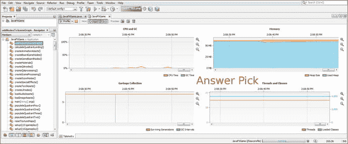

图 24-21。

Picking an answer (Button) involves the least amount of overhead and just minor CPU overhead for scoring

使用“让我们再玩一次”按钮对象重置游戏，其所有处理使用的开销与 3D 棋盘旋转(图 [24-19](#Fig19) )一样多，如图 [24-22](#Fig22) 所示。垃圾收集重置所有纹理贴图，相机动画改变游戏视角，然后事件处理锁定不需要的点击，音频回放播放相机动画音频效果，类似的处理密集型代码重置另一轮游戏。

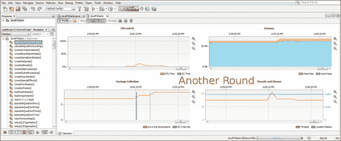

图 24-22。

Clicking a Let’s Play Again Button object invokes a second flurry of CPU and memory use for special effects such as audio and animation

考虑到这包括图像数据、CD 质量的音频效果和 JavaFX 动画(过渡)类，以及 AudioClip、图像、StackPane、按钮、3D 图元、文本、(SceneGraph)节点和实用程序(Inset、Color、Pos 等), 60MB 的内存使用率也相当不错。)用法，所有这些都利用了我们用来构建这个 i3D 专业级 Java 9 游戏的 JavaFX 类。

这些内存开销中很少一部分可以直接归因于您编写的 1，700 行 Java 代码，这些代码是为了组装这个游戏而编写的；99%的内存使用可归因于加载新的媒体素材和许多 JavaFX 9 类，这些类访问和运行这些新的媒体素材。

正如你在图 [24-23](#Fig23) 中看到的，一旦你完成了对你的 Java 9 游戏的分析，你将得到一个信息对话框，显示“被分析的应用已经完成执行”单击 OK 终止 VM，您将看到一个摘要方框(黑色),显示分配的内存堆大小(71MB)和运行性能分析会话所使用的内存总量(66MB)。如果您认为 66MB 是很大的内存，请考虑这台机器有 4，096MB 的内存，66MB 代表 1.6%的内存。许多现代智能手机、iTV 电视机、平板电脑和笔记本电脑都有 8GB 的系统内存，因此整个游戏生态系统和基础设施只占不到 1%的系统资源。在 2GB 的智能手机或(古老的)计算机系统上，这将代表大约 3%的系统资源。这对于一个动画的、交互式的 3D 棋盘游戏来说是相当不错的，所以 Java 做得非常好！

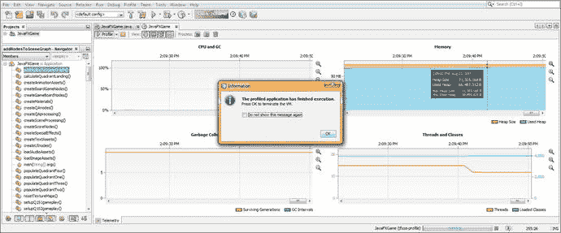

图 24-23。

Once you are finished profiling, NetBeans will give you a memory used summary and Information dialog

接下来，让我们看看如何优化我们的 Java 代码，因为我用来写这本书的代码就是我所说的“原型”代码。它在技术上是正确的，但是(还)没有利用任何可能实现高级 Java 语言语法或特性(如数组或哈希表)的 Java 编码结构。这样做的原因是，我试图帮助新的游戏开发者和程序员“可视化”Java 游戏逻辑(代码)在他们头脑中正在做的事情，而最简单的方法是以一种显示代码试图做什么的方式可视化地编码它。

请注意，Java 9 的编译、构建和执行过程也将做大量的工作来“在幕后”优化这段代码，因为前面关于概要分析的部分将展示这段 Java 9 代码在没有以任何方式进行专门的“程序员优化”的情况下是如何优化的。此外，从一个程序员到下一个程序员，有许多不同的方法可以做到这一点，因此我想更多地关注 JavaFX 游戏 API、游戏设计和开发工作流程以及游戏素材开发，而不是标准的 Java 代码优化，后者在数百本其他 Apress 书籍中有很好的介绍。

在 Java 9 游戏代码优化思想这一章的后面部分，我们将会看到一些 Java 代码优化。首先，让我们在游戏中完成 8 位索引图像资源的实现，并播放它，看看索引色 PNG8 资源和真彩色 PNG24 图像资源之间是否有任何视觉差异。

## 实现索引颜色影像:添加路径

将图像资源从真彩色更改为索引色就像将/8 位路径添加到 populateQuadrant()方法和 setupQSgameplay 方法一样简单。对于 loadImageAssets()和 resetTextureMaps()方法，您不必这样做，因为这些方法使用没有索引的纹理贴图，因为它们已经很小(几千字节)，并且可以保持为真彩色图像。这是因为它们不包含数字图像，因为这些是空白纹理，用于在每一轮游戏旋转之前使游戏板看起来空无一物。我截图了 populateQuadrantOne()方法显示添加的/8 位路径，如图 [24-24](#Fig24) 所示。

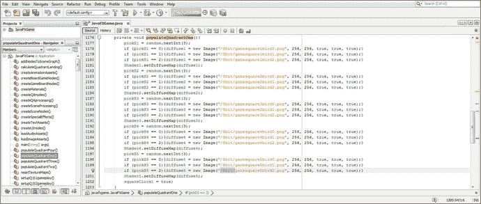

图 24-24。

Add an /8bit path in front of the current image file name reference to point to your new indexed imagery

你需要把这个相同的/8 位路径添加到你的 20 种设置游戏性的方法中的数字图像引用的前面。这些是为每个象限(Q)和正方形(S)命名的，作为您的 setupQSgameplay()方法，我在自定义的 40 个方法和 2 个必需方法(start()和 main() Java 方法)的末尾留了下来。

我截取了第一个 setupQ1S1gameplay()方法的截图，以显示我已经在数字图像引用的前面安装了/8bit 路径。我这样做是为了让您的新 8 位(索引色)PNG8 数字图像将被用作棋盘游戏的纹理贴图，而不是我们一直使用的 24 位真彩色数字图像。

我们这样做是为了让我们可以使用“运行➤项目”工作流程来测试您的游戏，看看在使用 325%的小索引彩色图像而不是真彩色 24 位 PNG 图像玩 i3D 游戏时，是否有任何视觉差异。图 [24-25](#Fig25) 显示了 20 种方法中的第一种，必须通过在数字图像参考名称的前面(头部)添加一个/8 位文件夹路径来进行“路径修改”。要轻松做到这一点，只需复制/8 位路径一次，并在 populateQuadrant()方法中粘贴 60 次，在 setupQSgameplay()方法中粘贴 60 次。

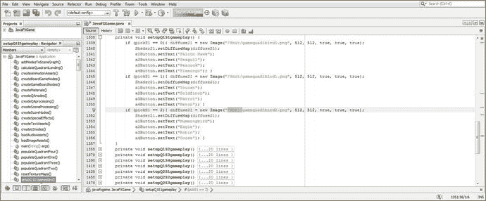

图 24-25。

Add an /8bit path in front of the current image file name reference to point to your new indexed imagery

接下来，让我们使用图 [24-26](#Fig26) 所示的 Run ➤项目工作流程，看看游戏板在随机旋转后看起来是否相同。正如你所看到的，它看起来和我们在整本书中使用真彩色图像时几乎一模一样。我们需要做的下一件事是放大，看看 8 位图像如何支撑。

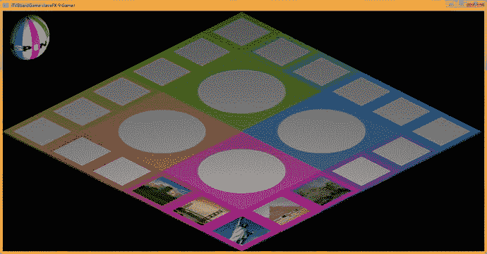

图 24-26。

Use a Run ➤ Project work process; spin the game board to see whether the new 8-bit color images look the same

点击带有颜色渐变的图像，在本例中是旧金山海湾大桥，如图 [24-27](#Fig27) 所示。这将向我们展示大象限图像，以便我们可以看到是否有任何抖动模式。

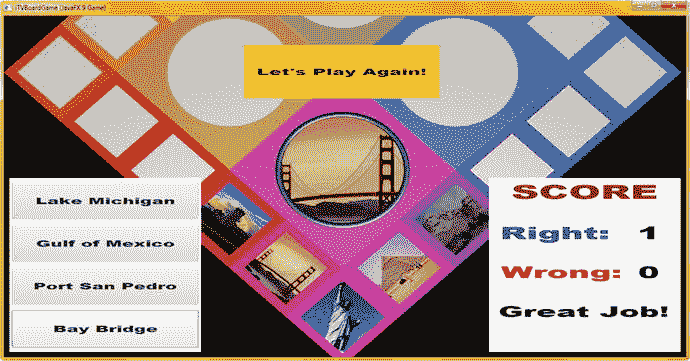

图 24-27。

Select an image that will show dithering to zoom the game board in closer to see whether the image looks the same

正如你所看到的，当它被用作 i3D 游戏板上的纹理贴图时，没有可见的抖动图案(点状伪像),因此这表明我们可以在这个 i3D 游戏板上成功地将索引色用于纹理贴图，而不会遭受任何可感知的交付质量下降。这给出了一个专业的结果，每样东西看起来都像是使用了真彩色，直到每个象限中的钢圈，它看起来仍然像钢一样，没有任何可察觉的抖动。接下来，让我们看看如何优化您的 16 位数字音频素材。

## 优化音频:以较低的采样率使用 16 位

我们在如何使用 Audacity 2.1.3 优化数字音频方面做得很好，所以我建议使用 16 位音频采样分辨率并优化采样率(48、44、32、22、16、11 或 8kHz)，直到您听到质量变化。我们已经有 16 位 44.1 kHz(目前使用)和 16 位 22.05 kHz，这是我们每个音效样本的一半数据，但听起来质量非常相似。如果您想使用更小的数字音频内存，您可以简单地在 loadAudioAssets()方法体中引用更优化的音频资源。

在这一点上，我将把这个内存与质量的决定完全留给您。如果您想回到 Audacity 并优化其他三个采样速率，如 THX (48 kHz)或 32 kHz，甚至 16 kHz，您可以聆听每个采样速率产生的 16 位音频质量，并决定每个数字音频质量级别需要使用多少系统内存。

请注意，您可以对游戏中的每个数字音频资源使用不同的采样速率。一些声音效果将保持较低的采样速率(11 和 16 kHz)，而其他声音效果(音乐、声乐)可能需要较高的采样速率(22 和 32 kHz)。不过，我建议全面使用 16 位采样分辨率，因为它更适合内存，因为内存“分块”为 8 位、16 位和 32 位，而您想要无缝匹配。

## Java 游戏代码优化:利用 Java 技巧

您可能已经注意到，在本书的整个过程中，当我们设计和构建我们的 pro Java 9 游戏时，我一直在使用长格式的、易于阅读(和理解)的 Java 代码。这段代码是合法的，可能会被 Java 9 编译和构建(以及执行)软件阶段优化，所以它不是“坏”代码，但是有一些优化过程和构造会使它明显更短、更精简。为一本书完成这个过程的问题是，每个 Java 程序员都有不同的首选方法，那么我应该选择哪种方法呢？还是我展示了大部分？不幸的是，这本书的页数是固定的，涵盖了新媒体素材开发、游戏设计、开发和测试，以及类似的需要掌握的广泛主题，以便成为一名专业的 Java 9 游戏开发人员。在这一章的最后一节，我将介绍一些其他的东西，你可能想自己添加到这个棋盘游戏中，用你所学到的东西进行一些练习。

让我们先看看 populateQuadrant()方法代码。populateQuadrantOne()方法以下面的 Java 序列开始，象限 1 中的五个游戏棋盘方格各有一个这样的构造:

```java
pickS1 = random.nextInt(3);
if (pickS1 == 0) { diffuse1 = new Image("/gamesquare1bird0.png", 256, 256, true, true, true); }
if (pickS1 == 1) { diffuse1 = new Image("/gamesquare1bird1.png", 256, 256, true, true, true); }
if (pickS1 == 2) { diffuse1 = new Image("/gamesquare1bird2.png", 256, 256, true, true, true); }
Shader1.setDiffuseMap(diffuse1);

```

您将通过用以下代码替换它来简化这段代码(一旦您知道它可以工作，在原型化之后)，这也消除了条件 if() CPU 处理和内存开销:

```java
pickS1 = random.nextInt(3);
diffuse1 = new Image("/gamesquare1bird" + pickS1 + ".png", 256, 256, true, true, true);
Shader1.setDiffuseMap(diffuse1);

```

的确，这使得更难看到你在游戏代码中做了什么，但是代码以相同的方式运行，并且几乎是代码行数的一半，允许你将 populateQuadrantN()方法从 26 行代码减少到 16 行代码，这减少了 38%的代码，或者所有四种方法减少了 40 行代码。

接下来，考虑第 [19](19.html) 章中的以下代码块，它可能需要 17 到 25 行代码来编写:

```java
if (picked == spinner) {
    int spin = random.nextInt(4);
    if (spin == 0) {
        rotGameBoard.setByAngle(1080); rotSpinner.setByAngle(-1080); spinDeg += 1080;
    }
    if (spin == 1) {
        rotGameBoard.setByAngle(1170); rotSpinner.setByAngle(-1170); spinDeg += 1170;
    }
    if (spin == 2) {
        rotGameBoard.setByAngle(1260); rotSpinner.setByAngle(-1260); spinDeg += 1260;
    }
    if (spin == 3) {
        rotGameBoard.setByAngle(1350); rotSpinner.setByAngle(-1350); spinDeg += 1350;
    }
    rotGameBoard.play();
    rotSpinner.play();
    calculateQuadrantLanding();
}

```

下面的 Java 代码块是基于数组的，相当于前面的代码。它要短得多，只有 10 行 Java 9 代码，减少了 41%到 60%(取决于如何在 if (spin == n) { … })中编写代码):

```java
if (picked == spinner) {
    int spin = random.nextInt(4);
    double[] angles = { 1080, 1170, 1260, 1350 };

    rotGameBoard.setByAngle(angles[spin]);
    rotSpinner.setByAngle(-angles[spin]);
    spinDeg += angles[spin];
    rotGameBoard.play();
    rotSpinner.play();
    calculateQuadrantLanding();
}

```

在计算出您的随机旋转值之后，这个代码片段声明了一个双精度值的四元素数组，它表示象限着陆角度。然后，我使用 spin 值(random.nextInt(4)输出四个随机象限值中的一个，范围从 0 到 3)来访问一个角度值(通过 angles[spin])，该角度值被传递给 setByAngle，并且也被添加到 spinDeg 变量中。

请注意，如果 spinDeg 是 int (32 位整数)类型，则必须在赋值前将 double angle 值转换为(int ),否则将面临 Java 编译器错误。在这种情况下，您可以用 Java 9 代码`spinDeg += (int) angle[spin];`替换`spinDeg += angle[spin];`来避免这个 Java 编译器错误。

如果您不想三次指定 angles[spin],也可以将该值存储在一个 angle 变量中，并使用这个 double angle 变量，如下面的 Java 代码所示:

```java
if (picked == spinner) {
    int spin = random.nextInt(4);
    double[] angles = { 1080, 1170, 1260, 1350 };
    double angle = angles[spin];

    rotGameBoard.setByAngle(angle);
    rotSpinner.setByAngle(-angle);
    spinDeg += angle;
    rotGameBoard.play();
    rotSpinner.play();
    calculateQuadrantLanding();
}

```

正如您所看到的，有许多方法可以为这个游戏编写 Java 代码，这将减少使用的代码行，甚至可能稍微减少游戏使用的 CPU 的几个百分点，如本章的 NetBeans 9 性能分析部分所示。由于每个人都有自己的编码优化风格和方法，我将把 Java 9 代码优化留给您，并利用书中材料的(较长的)原型代码。这将让您更好地了解我在游戏设计和开发工作流程中对新媒体素材所做的工作，并将本书内容集中在使用 Java 9 及其强大的 JavaFX 9 API 进行专业游戏设计和开发上。

最后，让我们在本章中增加一个章节，看看我们还可以利用哪些 JavaFX 9 API 类来进一步扩展这个 i3D 游戏，就像你最终会做的那样。您可以从第三方导入程序包中导入 i3D 模型(不幸的是，这还不是 JavaFX 的“原生”部分，所以我在本书中坚持使用 JavaFX i3D APIs)并添加数字视频素材，只要您仔细优化它们。因为 JavaFX 9 模块(分发包)还没有完全完成(离 Java 9 发布还有一个月，或者更久)。一旦 Oracle 发布了该书，包含 JavaFX 9 模块(游戏分发包)的附录将作为该书可下载源代码的一部分提供。要下载这本书的源代码，导航到 [`www.apress.com/9781484209745`](http://www.apress.com/9781484209745) 并点击下载源代码按钮。

## 未来扩展:添加数字视频和 3D 模型

通过使用第三方网站 InteractiveMesh.org 的 i3D 导入软件，以及添加使用 Black Magic Design 的 DaVinci Resolve 14 等创建的数字视频资源，您可以向您的 i3D 棋盘游戏添加更复杂的新媒体。你可以使用一些专业的东西来优化你的视频，比如 Sorenson Media 的 Squeeze Desktop Pro 11。这将为您提供更多使用 JavaFX 9 更高级的数字视频和 3D APIs 的经验。

我下一步要做的事情之一是为指令、信用、法律信息等提炼 2D 启动代码。既然一个游戏已经有了原型，那么重温一下闪屏图形可能也是一个好主意。请记住，Pro Java 9 游戏开发，尤其是 i3D 游戏，是一个改进的过程，因为组成 i2D 和 i3D 游戏素材的数百个新媒体组件通常经过改进，以使游戏符合游戏开发者 artisan 的愿景。

一旦你完成了游戏原型，你就可以像我们之前提到的那样进行代码优化，如果有必要的话，甚至可以为不同的特性或功能创建不同的类。我的技术编辑同意我的观点，这个游戏不需要额外的类，因为我试图使用 JavaFX API 中已经编码的类来创建一个 i3D 棋盘游戏。事实上，我正在导入(使用)44 个 Java 或 JavaFX 类来创建这个游戏，所以仅仅因为我有一个 JavaFXGame 主类将所有的东西绑在一起，实际上就有 45 个类创建了这个游戏。其中 44 个已经由 Sun Microsystems 创建、编码和优化，后来由 Oracle 在收购 Sun 后创建、编码和优化。我在本书中试图做的是展示如何创建一个专业的 Java 9 游戏，通过简单地优化使用 JavaFX API 类来利用这些公司在过去十年中的所有工作，并最大限度地减少开发人员创建一个 i3D 棋盘游戏的实际工作量。随着 Oracle 继续改进这些类，JavaFX 9 将继续成为一个更加强大和令人印象深刻的游戏引擎，理想情况下，iOS 和 Android 8 支持将继续发展和改进。

## 摘要

在最后的第 24 章中，我们讨论了各种素材(数字图像和数字音频)的优化，以及 Java 代码的优化。我们学习了 NetBeans Profiler，以及如何查看运行我们的游戏使用了多少系统内存。我们还查看了有多少百分比的 CPU 被用来处理我们的 Java 代码，以及垃圾收集何时将我们的纹理贴图加载到系统内存中。我们还研究了线程何时被用于处理内存位置、指令、循环、随机数生成以及类似的 Java 代码指令。

我们还研究了其他一些我们可以在游戏中改进并在未来添加到游戏中的东西，以便进一步利用 JavaFX 9 类。只是要确保使用 Profiler 来监视系统内存和 CPU 的使用情况。我使用我的一个“弱”(4GB，四核 AMD 3.11GHz 宏基)工作站，所以我在一台“次主流”计算机上测试代码，同时我有足够的能力和内存来流畅地运行 NetBeans 9、Java 9 和 JavaFX 9。这证明了 NetBeans 9、Java 9 和 JavaFX 的效率。

我希望您喜欢这二十几章，它们涵盖了新媒体素材开发以及 Java 9 和 JavaFX 9 游戏开发，重点是 JavaFX 9 API 的 i3D 部分，因为我开始的 Java 8 游戏开发标题侧重于 JavaFX API 的 i2D 部分。我在 Apress ( [`www.apress.com`](http://www.apress.com) )也有几本新媒体素材(内容)创作书籍，涵盖数字图像合成、数字音频编辑、数字视频编辑、数字插图(SVG)矢量编辑、数字绘画、视觉特效(VFX)创作，使用 Fusion 8。所有这些书都使用免费的商业用专业开源软件包，如 GIMP、Inkscape、Audacity 和 Fusion。一旦 Black Magic Design 完成 DaVinci Resolve 14(一个非线性编辑套件)，我会将它添加到我的开源内容制作套件中，我会在我为 JavaFX 9、Android 8 或 HTML 5.1 内容制作设置的每个工作站上安装该套件。对于新硬件，我正在看 AMD 的新锐龙 7 1700，它只使用 65W 的功率以 3.0GHz(超频的话是 3.7GHZ)运行 16 个 64 位线程；它拥有镭龙 7000 GPU，并在大多数主板上支持 64GB DDR 4-2400 MHz 内存(四个插槽)、USB 3.1、24 位音频、M2 SSD 卡、超高速硬盘访问等。装有 Windows 10 的全负荷系统售价不到 1000 美元。游戏编码快乐！