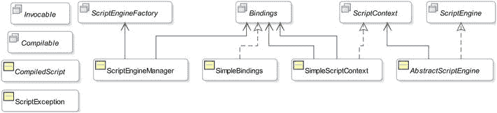

# 一、入门指南

在本章中，您将学习:

*   什么是 Java 脚本
*   如何从 Java 执行您的第一个脚本
*   如何使用来自 Java 的 JRuby、Jython 等其他脚本语言
*   `javax.script` 原料药
*   如何发现和实例化脚本引擎

## Java 中的脚本是什么？

有人认为 Java 虚拟机(JVM)可以执行只用 Java 编程语言编写的程序。然而，事实并非如此。JVM 执行语言无关的字节码。如果程序可以被编译成 Java 字节码，它可以执行用任何编程语言编写的程序。

脚本语言是一种编程语言，它使您能够编写由运行时环境评估(或解释)的脚本，运行时环境称为脚本引擎(或解释器)。脚本是使用脚本语言的语法编写的字符序列，用作由解释器执行的程序的源。解释器解析脚本，产生中间代码，中间代码是程序的内部表示，并执行中间代码。解释器将脚本中使用的变量存储在称为符号表的数据结构中。

通常，与编译的编程语言不同，脚本语言中的源代码(称为脚本)不被编译，而是在运行时被解释。然而，用一些脚本语言编写的脚本可以被编译成 Java 字节码，由 JVM 运行。

Java 6 向 Java 平台添加了脚本支持，允许 Java 应用执行用 Rhino JavaScript、Groovy、Jython、JRuby、Nashorn JavaScript 等脚本语言编写的脚本。支持双向通信。它还允许脚本访问由宿主应用创建的 Java 对象。Java 运行时和脚本语言运行时可以相互通信并利用彼此的特性。

Java 对脚本语言的支持来自 Java 脚本 API。Java 脚本 API 中的所有类和接口都在`javax.script`包中。

在 Java 应用中使用脚本语言有几个好处:

*   大多数脚本语言都是动态类型的，这使得编写程序更加简单。
*   它们为开发和测试小型应用提供了一种更快捷的方式。
*   最终用户可以进行定制。
*   脚本语言可以提供 Java 中没有的特定领域的特性。

脚本语言也有一些缺点。例如，动态类型有利于编写更简单的代码；然而，当一个类型被错误地解释时，它就变成了一个缺点，你必须花很多时间去调试它。

Java 中的脚本支持让您可以利用两个世界的优势:它允许您使用 Java 编程语言来开发应用的静态类型、可伸缩和高性能部分，并使用适合特定领域需求的脚本语言来开发其他部分。

我将在本书中频繁使用术语脚本引擎。脚本引擎是执行用特定脚本语言编写的程序的软件组件。通常，但不一定，脚本引擎是脚本语言的解释器的实现。Java 已经实现了几种脚本语言的解释器。它们公开了编程接口，因此 Java 程序可以与它们进行交互。

JDK 7 与一个名为 Rhino JavaScript 的脚本引擎捆绑在一起。JDK 8 用一个轻量级、更快的脚本引擎 Nashorn JavaScript 取代了 Rhino JavaScript 引擎。这本书讨论的是 Nashorn JavaScript，不是 Rhino JavaScript。请访问 [`www.mozilla.org/rhino`](http://www.mozilla.org/rhino) 了解更多关于 Rhino JavaScript 文档的详细信息。如果你想把用 Rhino JavaScript 编写的程序迁移到 Nashorn，请访问 [`https://wiki.openjdk.java.net/display/Nashorn/Rhino+Migration+Guide`](https://wiki.openjdk.java.net/display/Nashorn/Rhino+Migration+Guide) 的 Rhino 迁移指南。如果你有兴趣在 JDK 8 中使用 Rhino JavaScript，请访问页面 [`https://wiki.openjdk.java.net/display/Nashorn/Using+Rhino+JSR-223+engine+with+JDK8`](https://wiki.openjdk.java.net/display/Nashorn/Using+Rhino+JSR-223+engine+with+JDK8) 。

Java 包含一个名为`jrunscript`的命令行 shell，可以用来以交互模式或批处理模式运行脚本。`jrunscript` shell 是脚本语言中立的；JDK 7 的默认语言是 Rhino JavaScript，JDK 8 的默认语言是 Nashorn。我将在第 9 章中详细讨论`jrunscript`外壳。JDK 8 包括另一个名为`jjs`的命令行工具，它调用 Nashorn 引擎并提供特定于 Nashorn 的命令行选项。如果你正在使用 Nashorn，你应该使用`jjs`命令行工具而不是`jrunscript`。我将在第 10 章的[中讨论`jjs`命令行工具。](10.html)

Java 可以执行任何为脚本引擎提供实现的脚本语言的脚本。比如 Java 可以执行 Nashorn JavaScript、Rhino JavaScript、Groovy、Jython、JRuby 等编写的脚本。本书中的例子使用了 Nashorn JavaScript 语言。

在本书中，术语“Nashorn”、“Nashorn 引擎”、“Nashorn JavaScript”、“Nashorn JavaScript 引擎”、“Nashorn 脚本语言”和“JavaScript”作为同义词使用。

可以通过两种方式调用 Nashorn 脚本引擎:

*   通过将引擎嵌入到 JVM 中
*   通过使用`jjs`命令行工具

在这一章中，我将讨论使用 Nashorn 脚本引擎的两种方法。

## 执行您的第一个脚本

在本节中，您将使用 Nashorn 在标准输出上打印一条消息。您将从 Java 代码中访问 Nashorn 引擎。使用任何其他脚本语言都可以使用相同的步骤来打印消息，只有一点不同:您需要使用特定于脚本语言的代码来打印消息。在 Java 中运行脚本需要执行三个步骤:

*   创建脚本引擎管理器。
*   从脚本引擎管理器获取脚本引擎的实例。
*   调用脚本引擎的`eval()`方法执行脚本。

脚本引擎管理器是`ScriptEngineManager`类的一个实例。您可以创建一个脚本引擎，如下所示:

```java
// Create a script engine manager

ScriptEngineManager manager = new ScriptEngineManager();
```

接口的一个实例代表了 Java 程序中的一个脚本引擎。一个`ScriptEngineManager`的`getEngineByName(String engineShortName)`方法用于获取一个脚本引擎的实例。要获得 Nashorn 引擎的实例，使用`JavaScript`作为引擎的简称，如下所示:

```java
// Get the reference of a Nashorn engine

ScriptEngine engine = manager.getEngineByName("JavaScript");
```

Tip

脚本引擎的简称区分大小写。有时一个脚本引擎有多个简称。Nashorn 发动机有以下简称:`nashorn`、`Nashorn`、`js`、`JS`、`JavaScript`、`javascript`、`ECMAScript`、`ecmascript`。您可以使用引擎的任何简称，通过使用`ScriptEngineManager`类的`getEngineByName()`方法来获得它的实例。

在 Nashorn 中，`print()`函数在标准输出上打印一条消息，字符串是用单引号或双引号括起来的一系列字符。下面的代码片段在一个`String`对象中存储了一个脚本，该脚本在标准输出中打印`Hello Scripting!`:

```java
// Store a Nashorn script in a string

String script = "print('Hello Scripting!')";
```

如果要在 Nashorn 中使用双引号将字符串括起来，该语句将如下所示:

```java
// Store a Nashorn script in a string

String script = "print(\"Hello Scripting!\")";
```

要执行脚本，需要将其传递给脚本引擎的`eval()`方法。脚本引擎在运行脚本时可能会抛出一个`ScriptException`。因此，当您调用`ScriptEngine`的`eval()`方法时，您需要处理这个异常。以下代码片段执行存储在`script`变量中的脚本:

```java
try {

engine.eval(script);

}

catch (ScriptException e) {

e.printStackTrace();

}
```

清单 1-1 包含了在标准输出上打印消息的完整代码。

清单 1-1。使用 Nashorn 在标准输出上打印信息

```java
// HelloScripting.java

package com.jdojo.script;

import javax.script.ScriptEngine;

import javax.script.ScriptEngineManager;

import javax.script.ScriptException;

public class HelloScripting {

public static void main(String[] args) {

// Create a script engine manager

ScriptEngineManager manager = new ScriptEngineManager();

// Obtain a Nashorn script engine from the manager

ScriptEngine engine = manager.getEngineByName("JavaScript");

// Store the script in a String

String script = "print('Hello Scripting!')";

try {

// Execute the script

engine.eval(script);

}

catch (ScriptException e) {

e.printStackTrace();

}

}

}

Hello Scripting!
```

## 使用 jjs 命令行工具

在上一节中，您看到了如何在 Java 程序中使用 Nashorn 脚本引擎。在这一节中，我将向您展示如何使用`jjs`命令行工具来执行相同的任务。刀具存储在`JDK_HOME\bin`和`JRE_HOME\bin`目录中。例如，如果您在 Windows 的`C:\java8`目录下安装了 JDK8，`jjs`工具的路径将会是`C:\java8\bin\jjs.exe`。`jjs`工具可用于执行文件中的 Nashorn 脚本或交互执行脚本。

以下是在 Windows 命令提示符下对`jjs`工具的调用。脚本被输入并执行。您可以使用 q `uit()`或`exit()`功能退出`jjs`工具:

```java
C:\>jjs

jjs> print('Hello Scripting!');

Hello Scripting!

jjs> quit()

C:\>
```

执行`jjs`命令时，可能会出现以下错误:

```java
'jjs' is not recognized as an internal or external command, operable program or batch file.
```

该错误表明命令提示符无法定位`jjs`刀具。在这种情况下，您可以输入`jjs`工具的完整路径，或者在系统路径中添加包含 too 的目录。

考虑清单 1-2 中列出的代码。Nashorn 代码使用`print()`函数在标准输出上打印消息。代码保存在一个名为`helloscripting.js`的文件中。

清单 1-2:hello scripting . js 文件的内容

```java
// helloscripting.js

// Print a message on the standard output

print('Hello Scripting!');
```

以下命令执行存储在`helloscripting.js`文件中的脚本，假设该文件存储在当前目录中:

```java
C:\>jjs helloscripting.js

Hello Scripting!

C:\>
```

如果此命令显示类似以下内容的错误，则意味着该命令无法找到指定的文件，您需要指定 helloscritping.js 文件的完整路径:

```java
java.io.FileNotFoundException: C:\helloscripting.js (The system cannot find the file specified)
```

命令行工具是一个很大的话题，我将用整整一章来讲述它。我会在第十章中详细讨论。

## 在 Nashorn 打印文本

Nashorn 为您提供了三个在标准输出上打印文本的功能:

*   `print()`功能
*   `printf()`功能
*   `echo()`功能

`print()`函数是一个 varargs 函数。您可以向它传递任意数量的参数。它将其参数转换为字符串并打印出来，用空格隔开。最后，它打印一个新行。下面两次调用`print()`函数是相同的:

```java
print("Hello", "World!"); // Prints Hello World!

print("Hello World!");    // Prints Hello World!
```

`printf()`功能用于使用 printf 风格的格式化打印。这与调用 Java 方法`System.out.printf()`是一样的:

```java
printf("%d + %d = %d", 10, 20, 10 + 20); // Prints 10 + 20 = 30
```

`echo()`函数与`print()`函数相同，只是它只在脚本模式下工作。脚本模式在[第 10 章](10.html)中讨论。

## 使用其他脚本语言

在 Java 程序中使用除 Nashorn 之外的脚本语言非常简单。在使用脚本引擎之前，您只需要执行一项任务:在应用类路径中包含特定脚本引擎的 JAR 文件。脚本引擎的实现者提供这些 JAR 文件。

Java 使用一种发现机制来列出其 JAR 文件已经包含在应用类路径中的所有脚本引擎。接口的一个实例用于创建和描述一个脚本引擎。脚本引擎的提供者为`ScriptEngineFactory`接口提供了一个实现。`ScriptEngineManager`的`getEngineFactories()`方法返回所有可用脚本引擎工厂的`List<ScriptEngineFactory>`。`ScriptEngineFactory`的`getScriptEngine()`方法返回`ScriptEngine`的一个实例。工厂的其他几个方法返回关于引擎的元数据。

表 [1-1](#Tab1) 列出了在 Java 应用中使用脚本引擎之前，如何安装脚本引擎的详细信息。网站列表和说明在撰写本文时有效；它们可能在阅读时失效。但是，它们向您展示了脚本语言的脚本引擎是如何安装的。如果你对使用 Nashorn 感兴趣，你不需要在你的机器上安装任何东西。Nashorn 在 JDK 8 中可用。

表 1-1。

Installation Details for Installing Some Script Engines

    
| 脚本引擎 | 版本 | 网站(全球资讯网的主机站) | 安装说明 |
| --- | --- | --- | --- |
| 绝妙的 | Two point three | `groovy.codehaus.org` | 下载 Groovy 的安装文件；这是一个压缩文件。拉开拉链。在`embeddable`文件夹中查找名为`groovy-all-2.0.0-rc-2.jar`的 JAR 文件。将这个 JAR 文件添加到类路径中。 |
| 脚本语言 | 2.5.3 | [T2`www.jython.org`](http://www.jython.org/) | 下载 Jython 安装程序文件，它是一个 JAR 文件。提取`jython.jar`文件并将其添加到类路径中。 |
| JRuby | 1.7.13 | [T2`www.jruby.org`](http://www.jruby.org/) | 下载 JRuby 安装文件。您可以选择下载一个 ZIP 文件。拉开拉链。在`lib`文件夹中，您将找到一个需要包含在类路径中的`jruby.jar`文件。 |

清单 1-3 显示了如何打印所有可用脚本引擎的细节。输出显示 Groovy、Jython 和 JRuby 的脚本引擎可用。它们之所以可用，是因为我已经将它们引擎的 JAR 文件添加到了我机器上的类路径中。当您在类路径中包含了脚本引擎的 JAR 文件，并且想知道脚本引擎的简称时，这个程序会很有帮助。运行该程序时，您可能会得到不同的输出。

清单 1-3。列出所有可用的脚本引擎

```java
// ListingAllEngines.java

package com.jdojo.script;

import java.util.List;

import javax.script.ScriptEngineFactory;

import javax.script.ScriptEngineManager;

public class ListingAllEngines {

public static void main(String[] args) {

ScriptEngineManager manager = new ScriptEngineManager();

// Get the list of all available engines

List<ScriptEngineFactory> list = manager.                getEngineFactories();

// Print the details of each engine

for (ScriptEngineFactory f : list) {

System.out.println("Engine Name:" +                         f.getEngineName());

System.out.println("Engine Version:" +

f.getEngineVersion());

System.out.println("Language Name:" +                         f.getLanguageName());

System.out.println("Language Version:" +                         f.getLanguageVersion());

System.out.println("Engine Short Names:" +                         f.getNames());

System.out.println("Mime Types:" +                         f.getMimeTypes());

System.out.println("----------------------------");

}

}

}

Engine Name:jython

Engine Version:2.5.3

Language Name:python

Language Version:2.5

Engine Short Names:[python, jython]

Mime Types:[text/python, application/python, text/x-python, application/x-python]

----------------------------

Engine Name:JSR 223 JRuby Engine

Engine Version:1.7.0.preview1

Language Name:ruby

Language Version:jruby 1.7.0.preview1

Engine Short Names:[ruby, jruby]

Mime Types:[application/x-ruby]

----------------------------

Engine Name:Groovy Scripting Engine

Engine Version:2.0

Language Name:Groovy

Language Version:2.0.0-rc-2

Engine Short Names:[groovy, Groovy]

Mime Types:[application/x-groovy]

----------------------------

Engine Name:Oracle Nashorn

Engine Version:1.8.0_05

Language Name:ECMAScript

Language Version:ECMA - 262 Edition 5.1

Engine Short Names:[nashorn, Nashorn, js, JS, JavaScript, javascript, ECMAScript, ecmascript]

Mime Types:[application/javascript, application/ecmascript, text/javascript, text/ecmascript]

----------------------------
```

清单 1-4 展示了如何使用 JavaScript、Groovy、Jython 和 JRuby 在标准输出中打印消息。如果脚本引擎不可用，程序会打印一条消息说明这一点。

清单 1-4。使用不同的脚本语言在标准输出上打印消息

```java
// HelloEngines.java

package com.jdojo.script;

import javax.script.ScriptEngine;

import javax.script.ScriptEngineManager;

import javax.script.ScriptException;

public class HelloEngines {

public static void main(String[] args) {

// Get the script engine manager

ScriptEngineManager manager = new ScriptEngineManager();

// Try executing scripts in Nashorn, Groovy, Jython, and JRuby

execute(manager, "JavaScript", "print('Hello JavaScript')");

execute(manager, "Groovy", "println('Hello Groovy')");

execute(manager, "jython", "print 'Hello Jython'");

execute(manager, "jruby", "puts('Hello JRuby')");

}

public static void execute(ScriptEngineManager manager,

String engineName,

String script) {

// Try getting the engine

ScriptEngine engine = manager.getEngineByName(engineName);

if (engine == null) {

System.out.println(engineName + " is not available.");

return;

}

// If we get here, it means we have the engine installed.                 // So, run the script

try {

engine.eval(script);

}

catch (ScriptException e) {

e.printStackTrace();

}

}

}

Hello JavaScript

Hello Groovy

Hello Jython

Hello JRuby
```

有时，您可能只是为了好玩而想使用脚本语言，并且您不知道用于在标准输出中打印消息的语法。`ScriptEngineFactory`类包含一个名为`getOutputStatement(String toDisplay)`的方法，您可以用它来查找在标准输出中打印文本的语法。以下代码片段显示了如何获取 Nashorn 的语法:

```java
// Get the script engine factory for Nashorn

ScriptEngineManager manager = new ScriptEngineManager();

ScriptEngine engine = manager.getEngineByName("JavaScript");

ScriptEngineFactory factory = engine.getFactory();

// Get the script

String script = factory.getOutputStatement("\"Hello JavaScript\"");

System.out.println("Syntax: " + script);

// Evaluate the script

engine.eval(script);

Syntax: print("Hello JavaScript")

Hello JavaScript
```

对于其他脚本语言，使用它们的引擎工厂来获得语法。

## 探索 javax.script 包

Java 中的 Java 脚本 API 由少量的类和接口组成。它们在`javax.script`包里。本章包含了对这个包中的类和接口的简要描述。我将在后面的章节中讨论它们的用法。图 1-1 显示了 Java 脚本 API 中的类和接口的类图。



图 1-1。

The class diagram for classes and interfaces in the Java Scripting API

### 脚本引擎和脚本引擎工厂接口

`ScriptEngine`接口是 Java 脚本 API 的主要接口，它的实例促进了以特定脚本语言编写的脚本的执行。

`ScriptEngine`接口的实现者也提供了`ScriptEngineFactory`接口的实现。一辆`ScriptEngineFactory`执行两项任务:

*   它创建脚本引擎的实例。
*   它提供了关于脚本引擎的信息，例如引擎名称、版本、语言等等。

### AbstractScriptEngine 类

`AbstractScriptEngine`类是一个抽象类。它为`ScriptEngine`接口提供了部分实现。除非实现脚本引擎，否则不能直接使用该类。

### ScriptEngineManager 类

`ScriptEngineManager`类为脚本引擎提供了发现和实例化机制。它还维护一个键-值对的映射，作为存储状态的`Bindings`接口的一个实例，由它创建的所有脚本引擎共享。

### 可编译接口和 CompiledScript 类

可选地，可以通过脚本引擎来实现`Compilable`接口，该脚本引擎允许编译脚本以便重复执行，而无需重新编译。

`CompiledScript`类是一个抽象类。它是由脚本引擎的提供者扩展的。它以编译形式存储脚本，无需重新编译即可重复执行。请注意，使用`ScriptEngine`重复执行脚本会导致脚本每次都要重新编译，从而降低性能。

支持脚本编译不需要脚本引擎。如果支持脚本编译，它必须实现`Compilable`接口。

### 可调用的接口

可选地，`Invocable`接口可以由脚本引擎实现，该脚本引擎可以允许调用先前已经编译过的脚本中的过程、函数和方法。

### 绑定接口和简单绑定类

实现`Bindings`接口的类的一个实例是一个键-值对的映射，有一个限制，即一个键必须是非空的，非空的`String`。它扩展了`java.util.Map`接口。`SimpleBindings`类是`Bindings`接口的一个实现。

### ScriptContext 接口和 SimpleScriptContext 类

接口的一个实例充当 Java 主机应用和脚本引擎之间的桥梁。它用于将 Java 主机应用的执行上下文传递给脚本引擎。脚本引擎可以在执行脚本时使用上下文信息。脚本引擎可以将其状态存储在实现`ScriptContext`接口的类的实例中，Java 主机应用可以访问该接口。

`SimpleScriptContext`类是`ScriptContext`接口的一个实现。

### ScriptException 类

`ScriptException`类是一个异常类。如果在脚本的执行、编译或调用过程中出现错误，脚本引擎会抛出一个`ScriptException`。该类包含三个有用的方法，分别叫做`getLineNumber()`、`getColumnNumber()`和`getFileName()`。这些方法报告发生错误的脚本的行号、列号和文件名。`ScriptException`类覆盖了`Throwable`类的`getMessage()`方法，并在它返回的消息中包含行号、列号和文件名。

## 发现和实例化脚本引擎

您可以使用`ScriptEngineFactory`或`ScriptEngineManager`创建脚本引擎。谁真正负责创建一个脚本引擎:`ScriptEngineFactory`、`ScriptEngineManager`，或者两者都有？简单的回答是，`ScriptEngineFactory`总是负责创建脚本引擎的实例。下一个问题是“a `ScriptEngineManager`的作用是什么？”

A `ScriptEngineManager`使用服务提供者机制来定位所有可用的脚本引擎工厂。它搜索类路径和其他标准目录中的所有 JAR 文件。它寻找一个资源文件，这是一个名为`javax.script.ScriptEngineFactory`的文本文件，位于名为`META-INF/services`的目录下。资源文件由实现`ScriptEngineFactory`接口的类的完全限定名组成。每个类名在单独的一行中指定。该文件可能包含以`#`字符开头的注释。示例资源文件可能包含以下内容，其中包括两个脚本引擎工厂的类名:

```java
#Java Kishori Script Engine Factory class

com.jdojo.script.JKScriptEngineFactory

#Another factory class

com.jdojo.script.FunScriptFactory
```

一个`ScriptEngineManager`定位并实例化所有可用的`ScriptEngineFactory`类。您可以使用`ScriptEngineManager`类的`getEngineFactories()`方法获得所有工厂类的实例列表。当您调用管理器的一个方法来获得一个基于某个标准的脚本引擎时，例如通过名称获得引擎的`getEngineByName(String shortName)`方法，管理器搜索该标准的所有工厂并返回匹配的脚本引擎引用。如果没有工厂能够提供匹配的引擎，经理返回`null`。请参考清单 1-3，了解关于列出所有可用工厂和描述它们可以创建的脚本引擎的更多细节。

现在你知道了`ScriptEngineManager`并不创建脚本引擎的实例。相反，它查询所有可用的工厂，并将工厂创建的脚本引擎的引用传递回调用者。

为了使讨论完整，让我们添加一个创建脚本引擎的方法。您可以通过三种方式创建脚本引擎的实例:

*   直接实例化脚本引擎类。
*   直接实例化脚本引擎工厂类，调用其`getScriptEngine()`方法。
*   使用`ScriptEngineManager`类的`getEngineByXxx()`方法之一。

建议使用`ScriptEngineManager`类来获取脚本引擎的实例。这个方法允许由同一个管理器创建的所有引擎共享一个状态，这个状态是作为`Bindings`接口的一个实例存储的一组键-值对。`ScriptEngineManager`实例存储这个状态。

Tip

一个应用中可能有多个`ScriptEngineManager`类的实例。在这种情况下，每个`ScriptEngineManager`实例维护一个它创建的所有引擎共有的状态。也就是说，如果两个引擎是由`ScriptEngineManager`类的两个不同实例获得的，那么这些引擎将不会共享由它们的管理器维护的一个公共状态，除非您以编程方式实现。

## 摘要

脚本语言是一种编程语言，它使您能够编写由运行时环境评估(或解释)的脚本，运行时环境称为脚本引擎(或解释器)。脚本是使用脚本语言的语法编写的字符序列，用作由解释器执行的程序的源。Java 脚本 API 允许您执行用任何脚本语言编写的脚本，这些脚本可以从 Java 应用编译成 Java 字节码。JDK 6 和 7 附带了一个名为 Rhino JavaScript engine 的脚本引擎。在 JDK 8 中，Rhino JavaScript 引擎已经被一个名为 Nashorn 的脚本引擎所取代。

Nashorn 发动机有两种用途:它可以嵌入到 JVM 中，直接从 Java 程序中调用，也可以使用`jjs`命令行工具从命令提示符中调用。

Nashorn 提供了三个在标准输出上打印文本的功能:`print()`、`printf()`和`echo()`。`print()`函数接受可变数量的参数；它打印所有参数，用一个空格将它们分开，最后打印一个新行。`printf()`功能打印格式化文本；它的工作方式与 Java 编程语言中的 printf 样式的格式化方式相同。`echo()`功能的工作方式与`print()`功能相同，只是前者仅在脚本模式下调用 Nashorn 引擎时可用。

使用脚本引擎执行脚本，脚本引擎是`ScriptEngine`接口的一个实例。`ScriptEngine`接口的实现者也提供了`ScriptEngineFactory`接口的实现，其工作是创建脚本引擎的实例并提供关于脚本引擎的细节。`ScriptEngineManager`类为脚本引擎提供了发现和实例化机制。一个`ScriptManager`维护一个键值对的映射，作为一个由它创建的所有脚本引擎共享的`Bindings`接口的实例。