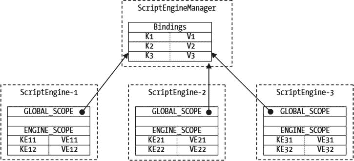
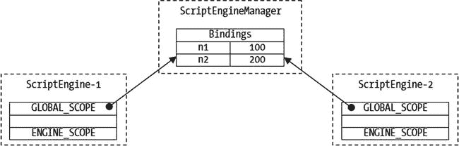
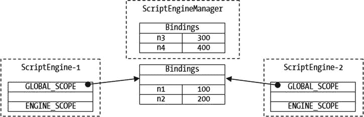
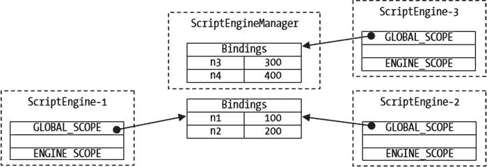

# 三、向脚本传递参数

在本章中，您将学习:

*   用于从 Java 程序向脚本传递参数的类
*   如何创建和使用`Bindings`对象来保存参数
*   如何定义参数的范围
*   如何使用不同的对象和范围向脚本传递参数
*   不同参数传递方式的优缺点
*   如何将脚本的输出写入文件

## 绑定、范围和上下文

为了理解参数传递机制的细节，必须清楚地理解三个术语:绑定、范围和上下文。这些术语起初令人困惑。本章使用以下步骤解释参数传递机制:

*   首先，它定义了这些术语
*   其次，它定义了这些术语之间的关系
*   第三，它解释了如何在 Java 程序中使用它们

### 粘合剂

`Bindings`是一组键-值对，其中所有键必须是非空的非空字符串。在 Java 代码中，`Bindings`是`Bindings`接口的一个实例。`SimpleBindings`类是`Bindings`接口的一个实现。脚本引擎可以提供自己的`Bindings`接口实现。

Tip

如果你熟悉`java.util.Map`界面，就很容易理解`Bindings`。`Bindings`接口继承自`Map<String,Object>`接口。因此，`Bindings`只是一个`Map`，它的键必须是非空的非空字符串。

清单 3-1 显示了如何使用一个`Bindings`。它创建一个`SimpleBindings`的实例，添加一些键值对，检索键值，删除键值对，等等。`Bindings`接口的`get()`方法返回`null`，如果键不存在或者键存在且其值为`null`。如果你想测试一个键是否存在，你需要使用它的`contains()`方法。

清单 3-1。使用绑定对象

```java
// BindingsTest.java

package com.jdojo.script;

import javax.script.Bindings;

import javax.script.SimpleBindings;

public class BindingsTest {

public static void main(String[] args) {

// Create a Bindings instance

Bindings params = new SimpleBindings();

// Add some key-value pairs

params.put("msg", "Hello");

params.put("year", 1969);

// Get values

Object msg = params.get("msg");

Object year = params.get("year");

System.out.println("msg = " + msg);

System.out.println("year = " + year);

// Remove year from Bindings

params.remove("year");

year = params.get("year");

boolean containsYear = params.containsKey("year");

System.out.println("year = " + year);

System.out.println("params contains year = " + containsYear);

}

}

msg = Hello

year = 1969

year = null

params contains year = false
```

你不能单独使用一个`Bindings`。通常，您会使用它将参数从 Java 代码传递到脚本引擎。`ScriptEngine`接口包含一个返回`Bindings`接口实例的`createBindings()`方法。这个方法给脚本引擎一个机会来返回一个`Bindings`接口的特殊实现的实例。您可以使用这种方法，如下所示:

```java
// Get the Nashorn engine

ScriptEngineManager manager = new ScriptEngineManager();

ScriptEngine engine = manager.getEngineByName("JavaScript");

// Do not instantiate the SimpleBindings class, use the

// createBindings() method of the engine instead

Bindings params = engine.createBindings();

// Work with params as usual
```

### 范围

让我们转到下一个术语，即范围。一个作用域用于一个`Bindings`。`Bindings`的范围决定了它的键值对的可见性。您可以让多个`Bindings`出现在多个作用域中。但是，一个`Bindings`只能出现在一个作用域中。你如何指定一个`Bindings`的范围？我很快会谈到这一点。

使用`Bindings`的作用域可以让您按照层次顺序为脚本引擎定义参数变量。如果在引擎状态下搜索变量名，首先搜索优先级较高的`Bindings`，然后是优先级较低的`Bindings`。返回找到的第一个变量的值。

Java 脚本 API 定义了两个范围。它们在`ScriptContext`接口中被定义为两个`int`常量。它们是:

*   `ScriptContext.ENGINE_SCOPE`
*   `ScriptContext.GLOBAL_SCOPE`

引擎范围的优先级高于全局范围。如果将两个具有相同键的键-值对添加到两个`Bindings`(一个在引擎范围内，一个在全局范围内)，每当必须解析与键同名的变量时，将使用引擎范围内的键-值对。

理解作用域对于一个`Bindings`的作用是如此重要，以至于我将通过另一个类比来解释它。考虑一个有两组变量的 Java 类:一组包含类中的所有实例变量，另一组包含方法中的所有局部变量。这两组变量及其值是两个`Bindings`。`Bindings`中变量的类型定义了作用域。为了便于讨论，我将定义两个范围:实例范围和本地范围。当执行一个方法时，首先在局部范围`Bindings`中查找变量名，因为局部变量优先于实例变量。如果在本地作用域`Bindings`中没有找到变量名，就在实例作用域`Bindings`中查找。当一个脚本被执行时，`Bindings`和它们的作用域扮演着相似的角色。

### 定义脚本上下文

脚本引擎在上下文中执行脚本。您可以将上下文视为脚本执行的环境。Java 宿主应用为脚本引擎提供了两样东西:脚本和脚本需要执行的上下文。接口的一个实例代表一个脚本的上下文。`SimpleScriptContext`类是`ScriptContext`接口的一个实现。脚本上下文由四部分组成:

*   一组`Bindings`，其中每个`Bindings`与一个不同的作用域相关联
*   脚本引擎用来读取输入的`Reader`
*   脚本引擎用来写输出的一个`Writer`
*   脚本引擎用来写入错误输出的错误`Writer`

上下文中的一组`Bindings`用于向脚本传递参数。上下文中的读取器和写入器分别控制脚本的输入源和输出目的地。例如，通过将文件编写器设置为编写器，可以将脚本的所有输出发送到文件。

每个脚本引擎都维护一个默认的脚本上下文，用于执行脚本。到目前为止，您已经在没有提供脚本上下文的情况下执行了几个脚本。在这些情况下，脚本引擎使用它们的默认脚本上下文来执行脚本。在这一节中，我将介绍如何单独使用`ScriptContext`接口的实例。在下一节中，我将介绍如何在脚本执行期间将一个`ScriptContext`接口的实例传递给一个`ScriptEngine`。

您可以使用`SimpleScriptContext`类创建一个`ScriptContext`接口的实例，如下所示:

```java
// Create a script context

ScriptContext ctx = new SimpleScriptContext();
```

一个`SimpleScriptContext`类的实例维护两个`Bindings`实例:一个用于引擎范围，一个用于全局范围。当您创建`SimpleScriptContext`的实例时，就会创建引擎范围内的`Bindings`。要使用全局范围`Bindings`，您需要创建一个`Bindings`接口的实例。

默认情况下，`SimpleScriptContext`类将上下文的输入读取器、输出写入器和错误写入器分别初始化为标准输入`System.in`、标准输出`System.out`和标准错误输出`System.err`。您可以使用`ScriptContext`接口的`getReader()`、`getWriter()`和`getErrorWriter()`方法分别从`ScriptContext`中获取阅读器、编写器和错误编写器的引用。还提供了 Setter 方法来设置读取器和编写器。下面的代码片段显示了如何获取阅读器和编写器。它还展示了如何将 writer 设置为`FileWriter`以将脚本输出写入文件:

```java
// Get the reader and writers from the script context

Reader inputReader = ctx.getReader();

Writer outputWriter = ctx.getWriter();

Writer errWriter = ctx.getErrorWriter();

// Write all script outputs to an out.txt file

Writer fileWriter = new FileWriter("out.txt");

ctx.setWriter(fileWriter);
```

在创建了`SimpleScriptContext`之后，您可以开始在引擎范围`Bindings`中存储键值对，因为当您创建`SimpleScriptContext`对象时，在引擎范围中创建了一个空的`Bindings`。`setAttribute()`方法用于向`Bindings`添加一个键值对。您必须为`Bindings`提供键名、值和范围。以下代码片段添加了三个键值对:

```java
// Add three key-value pairs to the engine scope bindings

ctx.setAttribute("year", 1969, ScriptContext.ENGINE_SCOPE);

ctx.setAttribute("month", 9, ScriptContext.ENGINE_SCOPE);

ctx.setAttribute("day", 19, ScriptContext.ENGINE_SCOPE);
```

如果您想在全局范围内将键值对添加到一个`Bindings`中，您将需要首先创建并设置`Bindings`,如下所示:

```java
// Add a global scope Bindings to the context

Bindings globalBindings = new SimpleBindings();

ctx.setBindings(globalBindings, ScriptContext.GLOBAL_SCOPE);
```

现在，您可以使用`setAttribute()`方法在全局范围内向`Bindings`添加键值对，如下所示:

```java
// Add two key-value pairs to the global scope bindings

ctx.setAttribute("year", 1982, ScriptContext.GLOBAL_SCOPE);

ctx.setAttribute("name", "Boni", ScriptContext.GLOBAL_SCOPE);
```

此时，你可以看到`ScriptContext`实例的状态，如图 [3-1](#Fig1) 所示。


图 3-1。

A pictorial view of an instance of the SimpleScriptContext class

您可以在`ScriptContext`上执行多项操作。您可以使用`setAttribute(String name, Object value, int scope)`方法为已存储的密钥设置不同的值。对于指定的键和范围，可以使用`removeAttribute(String name, int scope)`方法移除键-值对。您可以使用`getAttribute(String name`、`int scope)`方法获取指定范围内的键值。

使用`ScriptContext`可以做的最有趣的事情是检索一个键值，而不用使用它的`getAttribute(String name)`方法指定它的作用域。一个`ScriptContext`首先在引擎范围`Bindings`中搜索关键字。如果在引擎范围内没有找到，则在全局范围内搜索`Bindings`。如果在这些范围中找到该键，则返回首先找到该键的范围中的相应值。如果两个范围都不包含该键，则返回`null`。

在您的示例中，您已经在引擎范围和全局范围中存储了名为`year`的键。当首先搜索引擎范围时，下面的代码片段从引擎范围返回关键字`year`的 1969。`getAttribute()`方法的返回类型是`Object`。

```java
// Get the value of the key year without specifying the scope.

// It returns 1969 from the Bindings in the engine scope.

int yearValue = (Integer)ctx.getAttribute("year");
```

您只在全局范围内存储了名为`name`的键。如果尝试检索其值，将首先搜索引擎范围，这不会返回匹配项。随后，搜索全局范围并返回值`"Boni"`，如下所示:

```java
// Get the value of the key named name without specifying the scope.

// It returns "Boni" from the Bindings in the global scope.

String nameValue = (String)ctx.getAttribute("name");
```

您还可以检索特定范围内的键值。以下代码片段从引擎范围和全局范围中检索关键字"`year`"的值:

```java
// Assigns 1969 to engineScopeYear and 1982 to globalScopeYear

int engineScopeYear = (Integer)ctx.getAttribute("year", ScriptContext.ENGINE_SCOPE);

int globalScopeYear = (Integer)ctx.getAttribute("year", ScriptContext.GLOBAL_SCOPE);
```

Tip

Java 脚本 API 只定义了两个作用域:引擎和全局。`ScriptContext`接口的子接口可以定义额外的作用域。`ScriptContext`接口的`getScopes()`方法返回一个支持范围的列表作为`List<Integer>`。请注意，作用域表示为整数。`ScriptContext`界面中的两个常量`ENGINE_SCOPE`和`GLOBAL_SCOPE`分别被赋值为 100 和 200。当在出现在多个范围中的多个`Bindings`中搜索一个键时，首先搜索具有较小整数值的范围。因为引擎范围的值 100 小于全局范围的值 200，所以当您不指定范围时，首先在引擎范围中搜索一个键。

清单 3-2 展示了如何使用一个实现了`ScriptContext`接口的类的实例。请注意，您不能在应用中单独使用`ScriptContext`。它由脚本引擎在脚本执行期间使用。最常见的是，你通过一个`ScriptEngine`和一个`ScriptEngineManager`间接地操纵一个`ScriptContext`，这将在下一节详细讨论。

清单 3-2。使用 ScriptContext 接口的实例

```java
// ScriptContextTest.java

package com.jdojo.script;

import java.util.List;

import javax.script.Bindings;

import javax.script.ScriptContext;

import javax.script.SimpleBindings;

import javax.script.SimpleScriptContext;

import static javax.script.ScriptContext.ENGINE_SCOPE;

import static javax.script.ScriptContext.GLOBAL_SCOPE;

public class ScriptContextTest {

public static void main(String[] args) {

// Create a script context

ScriptContext ctx = new SimpleScriptContext();

// Get the list of scopes supported by the script context

List<Integer> scopes = ctx.getScopes();

System.out.println("Supported Scopes: " + scopes);

// Add three key-value pairs to the engine scope bindings

ctx.setAttribute("year", 1969, ENGINE_SCOPE);

ctx.setAttribute("month", 9, ENGINE_SCOPE);

ctx.setAttribute("day", 19, ENGINE_SCOPE);

// Add a global scope Bindings to the context

Bindings globalBindings = new SimpleBindings();

ctx.setBindings(globalBindings, GLOBAL_SCOPE);

// Add two key-value pairs to the global scope bindings

ctx.setAttribute("year", 1982, GLOBAL_SCOPE);

ctx.setAttribute("name", "Boni", GLOBAL_SCOPE);

// Get the value of year without specifying the scope

int yearValue = (Integer)ctx.getAttribute("year");

System.out.println("yearValue = " + yearValue);

// Get the value of name

String nameValue = (String)ctx.getAttribute("name");

System.out.println("nameValue = " + nameValue);

// Get the value of year from engine  and global scopes

int engineScopeYear = (Integer)ctx.getAttribute("year", ENGINE_SCOPE);

int globalScopeYear = (Integer)ctx.getAttribute("year", GLOBAL_SCOPE);

System.out.println("engineScopeYear = " + engineScopeYear);

System.out.println("globalScopeYear = " + globalScopeYear);

}

}

Supported Scopes: [100, 200]

yearValue = 1969

nameValue = Boni

engineScopeYear = 1969

globalScopeYear = 1982
```

### 把它们放在一起

在这一节中，我将向您展示`Bindings`的实例及其作用域、`ScriptContext`、`ScriptEngine`、`ScriptEngineManager`和宿主应用是如何协同工作的。重点将是如何使用一个`ScriptEngine`和一个`ScriptEngineManager`在不同的范围内操作存储在`Bindings`中的键值对。

一个`ScriptEngineManager`在一个`Bindings`中维护一组键值对。它允许您使用以下四种方法操作这些键值对:

*   `void put(String key, Object value)`
*   `Object get(String key)`
*   `void setBindings(Bindings bindings)`
*   `Bindings getBindings()`

`put()`方法向`Bindings`添加一个键值对。`get()`方法返回指定键的值；如果没有找到密钥，它返回`null`。使用`setBindings()`方法可以替换发动机管理器的`Bindings`。`getBindings()`方法返回`ScriptEngineManager`的`Bindings`的引用。

默认情况下，每个`ScriptEngine`都有一个被称为默认上下文的`ScriptContext`。回想一下，除了读者和作者，一个`ScriptContext`有两个`Bindings`:一个在引擎范围内，一个在全局范围内。当一个`ScriptEngine`被创建时，它的引擎作用域`Bindings`为空，它的全局作用域`Bindings`引用创建它的`ScriptEngineManager`的`Bindings`。

默认情况下，由`ScriptEngineManager`创建的`ScriptEngine`的所有实例共享`ScriptEngineManager`的`Bindings`。在同一个 Java 应用中可能有多个`ScriptEngineManager`实例。在这种情况下，由同一个`ScriptEngineManager`创建的`ScriptEngine`的所有实例共享`ScriptEngineManager`的`Bindings`作为它们默认上下文的全局作用域`Bindings`。

下面的代码片段创建了一个`ScriptEngineManager`，用于创建`ScriptEngine`的三个实例:

```java
// Create a ScriptEngineManager

ScriptEngineManager manager = new ScriptEngineManager();

// Create three ScriptEngines using the same ScriptEngineManager

ScriptEngine engine1 = manager.getEngineByName("JavaScript");

ScriptEngine engine2 = manager.getEngineByName("JavaScript");

ScriptEngine engine3 = manager.getEngineByName("JavaScript");
```

现在，让我们给`ScriptEngineManager`的`Bindings`添加三个键值对，给每个`ScriptEngine`的引擎范围`Bindings`添加两个键值对:

`// Add three key-value pairs to the Bindings of the` `manager`

```java
manager.put("K1", "V1");

manager.put("K2", "V2");

manager.put("K3", "V3");

// Add two key-value pairs to each engine

engine1.put("KE11", "VE11");

engine1.put("KE12", "VE12");

engine2.put("KE21", "VE21");

engine2.put("KE22", "VE22");

engine3.put("KE31", "VE31");

engine3.put("KE32", "VE32");
```

图 [3-2](#Fig2) 显示了代码片段执行后`ScriptEngineManager`和三个`ScriptEngine`的状态。从图中可以明显看出，所有`ScriptEngine`的默认上下文共享`ScriptEngineManager`的`Bindings`作为它们的全局作用域`Bindings`。



图 3-2。

A pictorial view of three ScriptEngines created by a ScriptEngineManager

`ScriptEngineManager`中的`Bindings`可以通过以下方式修改:

*   通过使用`ScriptEngineManager`的`put()`方法
*   通过使用`ScriptEngineManager`的`getBindings()`方法获取`Bindings`的参考，然后在`Bindings`上使用`put()`和`remove()`方法
*   通过使用`getBindings()`方法在`ScriptEngine`的默认上下文的全局范围内获取`Bindings`的引用，然后在`Bindings`上使用`put()`和`remove()`方法

当一个`ScriptEngineManager`中的`Bindings`被修改时，由这个`ScriptEngineManager`创建的所有`ScriptEngine`的默认上下文中的全局作用域`Bindings`被修改，因为它们共享同一个`Bindings`。

每个`ScriptEngine`的默认上下文分别维护一个引擎范围`Bindings`。要将一个键值对添加到一个`ScriptEngine`的引擎作用域`Bindings`中，使用它的`put()`方法，如下所示:

```java
ScriptEngine engine1 = null; // get an engine

// Add an "engineName" key with its value as "Engine-1" to the

// engine scope Bindings of the default context of engine1

engine1.put("engineName", "Engine-1");
```

`ScriptEngine`的`get(String key)`方法从其引擎作用域`Bindings`返回指定的`key`的值。以下语句返回“Engine-1”，它是`engineName`键的值:

```java
String eName = (String)engine1.get("engineName");
```

在默认的`ScriptEngine`上下文中，获得全局作用域`Bindings`的键值对需要两个步骤。首先，您需要使用它的`getBindings()`方法获得全局作用域`Bindings`的引用，如下所示:

```java
Bindings e1Global = engine1.getBindings(ScriptContext.GLOBAL_SCOPE);
```

现在，您可以使用`e1Global`引用来修改引擎的全局范围`Bindings`。下面的语句向`e1Global Bindings`添加了一个键值对:

```java
e1Global.put("id", 89999);
```

因为所有`ScriptEngine`共享一个`ScriptEngine`的全局作用域`Bindings`，这段代码将把键`"id"`和它的值添加到所有`ScriptEngine`的默认上下文的全局作用域`Bindings`中，所有`ScriptEngine`是由创建`engine1`的同一个`ScriptEngineManager`创建的。不建议使用此处所示的代码修改`ScriptEngineManager`中的`Bindings`。您应该改为使用`ScriptEngineManager`引用来修改`Bindings`，这使得代码的读者可以更清楚地理解逻辑。

清单 3-3 展示了本节讨论的概念。A `ScriptEngineManager`向它的`Bindings`添加两个键-值对，键为`n1`和`n2`。创建了两个脚本引擎；他们在引擎范围`Bindings`中添加了一个名为`engineName`的键。当脚本被执行时，脚本中的`engineName`变量的值从`ScriptEngine`的引擎范围中被使用。脚本中变量`n1`和`n2`的值是从`ScriptEngine`的全局作用域`Bindings`中获取的。在第一次执行该脚本后，每个`ScriptEngine`向它们的引擎范围`Bindings`添加一个名为`n2`的键，该键具有不同的值。当您第二次执行脚本时，变量`n1`的值从引擎的全局作用域`Bindings`中检索，而变量`n2`的值从引擎作用域`Bindings`中检索，如输出所示。

清单 3-3。使用由同一个 ScriptEngineManager 创建的引擎的全局和引擎范围绑定

```java
// GlobalBindings.java

package com.jdojo.script;

import javax.script.ScriptEngine;

import javax.script.ScriptEngineManager;

import javax.script.ScriptException;

public class GlobalBindings {

public static void main(String[] args) {

ScriptEngineManager manager = new ScriptEngineManager();

// Add two numbers to the Bindings of the manager that will be

// shared by all its engines

manager.put("n1", 100);

manager.put("n2", 200);

// Create two JavaScript engines and add the name of the engine

// in the engine scope of the default context of the engines

ScriptEngine engine1 = manager.getEngineByName("JavaScript");

engine1.put("engineName", "Engine-1");

ScriptEngine engine2 = manager.getEngineByName("JavaScript");

engine2.put("engineName", "Engine-2");

// Execute a script that adds two numbers and prints the

// result

String script = "var sum = n1 + n2; "

+ "print(engineName + ' - Sum = ' + sum)";

try {

// Execute the script in two engines

engine1.eval(script);

engine2.eval(script);

// Now add a different value for n2 for each engine

engine1.put("n2", 1000);

engine2.put("n2", 2000);

// Execute the script in two engines again

engine1.eval(script);

engine2.eval(script);

}

catch (ScriptException e) {

e.printStackTrace();

}

}

}

Engine-1 - Sum = 300

Engine-2 - Sum = 300

Engine-1 - Sum = 1100

Engine-2 - Sum = 2100
```

由一个`ScriptEngineManager`创建的所有 ScriptEngines 共享的全局作用域`Bindings`的故事还没有结束。这是最复杂、最令人困惑的事情！现在重点将放在使用`ScriptEngineManager`类的`setBindings()`方法和`ScriptEngine`接口的效果上。考虑以下代码片段:

```java
// Create a ScriptEngineManager and two ScriptEngines

ScriptEngineManager manager = new ScriptEngineManager();

ScriptEngine engine1 = manager.getEngineByName("JavaScript");

ScriptEngine engine2 = manager.getEngineByName("JavaScript");

// Add two key-value pairs to the manager

manager.put("n1", 100);

manager.put("n2", 200);
```

图 [3-3](#Fig3) 显示了执行上述脚本后引擎管理器及其引擎的状态。此时，`ScriptEngineManager`中只存储了一个`Bindings`，两个脚本引擎将它作为它们的全局作用域`Bindings`来引用。



图 3-3。

Initial state of ScriptEngineManager and two ScriptEngines

让我们创建一个新的`Bindings`，并使用`setBindings()`方法将其设置为`ScriptEngineManager`的`Bindings`，如下所示:

```java
// Create a Bindings, add two key-value pairs to it, and set it as the new

// Bindings for the manager

Bindings newGlobal = new SimpleBindings();

newGlobal.put("n3", 300);

newGlobal.put("n4", 400);

manager.setBindings(newGlobal);
```

图 [3-4](#Fig4) 显示了代码执行后`ScriptEngineManager`和两个`ScriptEngine`的状态。请注意，`ScriptEngineManager`有了新的`Bindings`，而两个`ScriptEngine`仍然将旧的`Bindings`称为它们的全球范围`Bindings`。



图 3-4。

State of ScriptEngineManager and two ScriptEngines after a new Bindings is set to the ScriptEngineManager

此时，对`ScriptEngineManager`的`Bindings`所做的任何更改都不会反映在两个`ScriptEngine`的全局作用域`Bindings`中。您仍然可以对两个`ScriptEngine`共享的`Bindings`进行更改，并且两个`ScriptEngine`都将看到其中一个所做的更改。

让我们新建一个`ScriptEngine`，如图所示:

```java
// Create a new ScriptEngine

ScriptEngine engine3 = manager.getEngineByName("JavaScript");
```

回想一下，`ScriptEngine`在创建时获得了全局作用域`Bindings`,`Bindings`与`ScriptEngineManager`的`Bindings`相同。该语句执行后，`ScriptEngineManager`和三个 ScriptEngines 的状态如图 [3-5](#Fig5) 所示。



图 3-5。

State of ScriptEngineManager and three ScriptEngines after the third ScriptEngine is created

这里是另一个所谓的`ScriptEngine` s 的全局作用域的全球性的扭曲。这一次，您将使用一个`ScriptEngine`的`setBindings()`方法来设置它的全局作用域`Bindings`。图 [3-6](#Fig6) 显示了执行以下代码片段后`ScriptEngineManager`和三个脚本引擎的状态:

```java
// Set a new Bindings for the global scope of engine1

Bindings newGlobalEngine1 = new SimpleBindings();

newGlobalEngine1.put("n5", 500);

newGlobalEngine1.put("n6", 600);

engine1.setBindings(newGlobalEngine1, ScriptContext.GLOBAL_SCOPE);
```


图 3-6。

State of ScriptEngineManager and Three ScriptEngines After a New Global Scope Bindings Is Set for engine1 Tip

默认情况下，一个`ScriptEngineManager`创建的所有脚本引擎共享它的`Bindings`作为它们的全局作用域`Bindings`。如果您使用一个`ScriptEngine`的`setBindings()`方法来设置它的全局作用域`Bindings`，或者如果您使用一个`ScriptEngineManager`的`setBindings()`方法来设置它的`Bindings`，您就打破了“全球性”链，如本节所讨论的。为了保持“全局”链的完整性，您应该总是使用`ScriptEngineManager`的`put()`方法将键值对添加到它的`Bindings`中。要从由`ScriptEngineManager`创建的所有 ScriptEngines 的全局范围中删除一个键-值对，您需要使用`ScriptEngineManager`的`getBindings()`方法获取`Bindings`的引用，并在`Bindings`上使用`remove()`方法。

## 使用自定义脚本上下文

在上一节中，您看到每个`ScriptEngine`都有一个默认的脚本上下文。`ScriptEngine`的`get()`、`put()`、`getBindings()`和`setBindings()`方法在默认`ScriptContext`下运行。当`ScriptEngine`的`eval()`方法没有指定`ScriptContext`时，使用引擎的默认上下文。`ScriptEngine`的`eval()`方法的以下两个版本使用其默认上下文来执行脚本:

*   `Object eval(String script)`
*   `Object eval(Reader reader)`

您可以将一个`Bindings`传递给下面两个版本的`eval()`方法:

*   `Object eval(String script, Bindings bindings)`
*   `Object eval(Reader reader, Bindings bindings)`

这些版本的`eval()`方法不使用默认的`ScriptEngine`上下文。他们使用一个新的`ScriptContext`，它的引擎作用域`Bindings`是传递给这些方法的，全局作用域`Bindings`与引擎的默认上下文相同。注意，`eval()`方法的这两个版本保持了`ScriptEngine`的默认上下文不变。

您可以将一个`ScriptContext`传递给下面两个版本的`eval()`方法:

*   `Object eval(String script, ScriptContext context)`
*   `Object eval(Reader reader, ScriptContext context)`

这些版本的`eval()`方法使用指定的上下文来执行脚本。它们保持`ScriptEngine`的默认上下文不变。

三组`eval()`方法允许您使用不同的隔离级别执行脚本:

*   第一组让您共享所有脚本的默认上下文
*   第二组让脚本使用不同的引擎作用域`Bindings`并共享全局作用域`Bindings`
*   第三组让脚本在一个隔离的`ScriptContext`中执行

清单 3-4 展示了如何使用不同版本的`eval()`方法在不同的隔离级别执行脚本。该程序使用三个变量，分别叫做`msg`、`n1`和`n2`。它显示存储在`msg`变量中的值。将`n1`和`n2`的值相加，并显示总和。该脚本打印出在计算总和时使用了什么值`n1`和`n2`。`n1`的值存储在由所有`ScriptEngine`的默认上下文共享的`ScriptEngineManager`的`Bindings`中。`n2`的值存储在默认上下文和自定义上下文的引擎范围中。该脚本使用引擎的默认上下文执行两次，一次在开始，一次在结束，以证明在`eval()`方法中使用自定义`Bindings`或`ScriptContext`不会影响`ScriptEngine`的默认上下文中的`Bindings`。该程序在其`main()`方法中声明了一个`throws`子句，以使代码更短。

清单 3-4。使用不同的隔离级别执行脚本

```java
// CustomContext.java

package com.jdojo.script;

import javax.script.Bindings;

import javax.script.ScriptContext;

import javax.script.ScriptEngine;

import javax.script.ScriptEngineManager;

import javax.script.ScriptException;

import javax.script.SimpleScriptContext;

import static javax.script.SimpleScriptContext.ENGINE_SCOPE;

import static javax.script.SimpleScriptContext.GLOBAL_SCOPE;

public class CustomContext {

public static void main(String[] args) throws ScriptException {

ScriptEngineManager manager = new ScriptEngineManager();

ScriptEngine engine = manager.getEngineByName("JavaScript");

// Add n1 to Bindings of the manager, which will be shared

// by all engines as their global scope Bindings

manager.put("n1", 100);

// Prepare the script

String script = "var sum = n1 + n2;" +

"print(msg + " +

"' n1=' + n1 + ', n2=' + n2 + " +

"', sum=' + sum);";

// Add n2 to the engine scope of the default context of the

// engine

engine.put("n2", 200);

engine.put("msg", "Using the default context:");

engine.eval(script);

// Use a Bindings to execute the script

Bindings bindings = engine.createBindings();

bindings.put("n2", 300);

bindings.put("msg", "Using a Bindings:");

engine.eval(script, bindings);

// Use a ScriptContext to execute the script

ScriptContext ctx = new SimpleScriptContext();

Bindings ctxGlobalBindings = engine.createBindings();

ctx.setBindings(ctxGlobalBindings, GLOBAL_SCOPE);

ctx.setAttribute("n1", 400, GLOBAL_SCOPE);

ctx.setAttribute("n2", 500, ENGINE_SCOPE);

ctx.setAttribute("msg", "Using a ScriptContext:", ENGINE_SCOPE);

engine.eval(script, ctx);

// Execute the script again using the default context to

// prove that the default context is unaffected.

engine.eval(script);

}

}

Using the default context: n1=100, n2=200, sum=300

Using a Bindings: n1=100, n2=300, sum=400

Using a ScriptContext: n1=400, n2=500, sum=900

Using the default context: n1=100, n2=200, sum=300
```

## eval()方法的返回值

`ScriptEngine`的`eval()`方法返回一个`Object`，这是脚本中的最后一个值。如果脚本中没有最后一个值，它将返回`null`。依赖脚本中的最后一个值容易出错，同时也令人困惑。下面的代码片段展示了一些为 Nashorn 使用`eval()`方法返回值的例子。代码中的注释表示从`eval()`方法返回的值:

```java
Object result = null;

// Assigns 3 to result because the last expression 1 + 2 evaluates to 3

result = engine.eval("1 + 2;");

// Assigns 7 to result because the last expression 3 + 4 evaluates to 7

result = engine.eval("1 + 2; 3 + 4;");

// Assigns 6 to result because the last statement v = 6 evaluates to 6

result = engine.eval("1 + 2; 3 + 4; var v = 5; v = 6;");

// Assigns 7 to result. The last statement "var v = 5" is a

// declaration and it does not evaluate to a value. So, the last

// evaluated value is 3 + 4 (=7).

result = engine.eval("1 + 2; 3 + 4; var v = 5;");

// Assigns null to result because the print() function returns undefined

// that is translated to null in Java.

result = engine.eval("print(1 + 2)");
```

最好不要依赖于`eval()`方法的返回值。您应该将一个 Java 对象作为参数传递给脚本，并让脚本将脚本的返回值存储在该对象中。在执行了`eval()`方法之后，您可以查询这个 Java 对象的返回值。清单 3-5 包含一个包装整数的`Result`类的代码。您将向脚本传递一个`Result`类的对象，脚本将在其中存储返回值。脚本完成后，您可以在 Java 代码中读取存储在 Result 对象中的整数值。需要将`Result`声明为公共的，以便脚本引擎可以访问它。清单 3-6 中的程序展示了如何将一个`Result`对象传递给一个用值填充`Result`对象的脚本。该程序在`main()`方法的声明中包含一个`throws`子句，以保持代码简短。

清单 3-5。包装整数的结果类

```java
// Result.java

package com.jdojo.script;

public class Result {

private int val = -1;

public void setValue(int x) {

val = x;

}

public int getValue() {

return val;

}

}
```

清单 3-6。在结果对象中收集脚本的返回值

```java
// ResultBearingScript.java

package com.jdojo.script;

import javax.script.ScriptEngine;

import javax.script.ScriptEngineManager;

import javax.script.ScriptException;

public class ResultBearingScript {

public static void main(String[] args) throws ScriptException {

// Get the Nashorn engine

ScriptEngineManager manager = new ScriptEngineManager();

ScriptEngine engine = manager.getEngineByName("JavaScript");

// Pass a Result object to the script. The script will store the

// result of the script in the result object

Result result = new Result();

engine.put("result", result);

// Store the script in a String

String script = "3 + 4; result.setValue(101);";

// Execute the script, which uses the passed in

// Result object to return a value

engine.eval(script);

// Use the result object to get the returned value from // the script

int returnedValue = result.getValue(); // Will be 101

System.out.println("Returned value is " + returnedValue);

}

}

Returned value is 101
```

## 引擎范围绑定的保留键

通常，引擎范围`Bindings`中的一个键代表一个脚本变量。有些键是保留的，它们有特殊的含义。它们的值可以通过引擎的实现传递给引擎。一个实现可以定义附加的保留密钥。

表 [3-1](#Tab1) 包含所有保留密钥的列表。这些键在`ScriptEngine`接口中也被声明为常量。脚本引擎的实现不需要在引擎范围绑定中将所有这些键传递给引擎。作为开发人员，您不应该使用这些键将参数从 Java 应用传递到脚本引擎。

表 3-1。

The List of Reserved Keys for Engine Scope Bindings

   
| 钥匙 | ScriptEngine 接口中的常数 | 键值的含义 |
| --- | --- | --- |
| " javax.script.argv " | `ScriptEngine.ARGV` | 用来传递一个数组对象来传递一组位置参数 |
| " javax.script.engine " | `ScriptEngine.ENGINE` | 脚本引擎的名称 |
| " javax.script.engine_version " | `ScriptEngine.ENGINE_VERSION` | 脚本引擎的版本 |
| " javax.script.filename " | `ScriptEngine.FILENAME` | 用于传递文件或资源的名称，即脚本的来源 |
| " javax.script.language " | `ScriptEngine.LANGUAGE` | 脚本引擎支持的语言的名称 |
| " javax.script.language_version " | `ScriptEngine.LANGUAGE_VERSION` | 引擎支持的脚本语言版本 |
| " javax.script.name " | `ScriptEngine.NAME` | 脚本语言的简称 |

## 更改默认脚本上下文

您可以分别使用`getContext()`和`setContext()`方法来获取和设置`ScriptEngine`的默认上下文，如下所示:

```java
ScriptEngineManager manager = new ScriptEngineManager();

ScriptEngine engine = manager.getEngineByName("JavaScript");

// Get the default context of the ScriptEngine

ScriptContext defaultCtx = engine.getContext();

// Work with defaultCtx here

// Create a new context

ScriptContext ctx = new SimpleScriptContext();

// Configure ctx here

// Set ctx as the new default context for the engine

engine.setContext(ctx);
```

注意，为一个`ScriptEngine`设置一个新的默认上下文不会使用`ScriptEngineManager`的`Bindings`作为它的全局作用域`Bindings`。如果您希望新的默认上下文使用`ScriptEngineManager`的`Bindings`，您需要显式设置它，如下所示:

```java
// Create a new context

ScriptContext ctx = new SimpleScriptContext();

// Set the global scope Bindings for ctx the same as the Bindings for

// the manager

ctx.setBindings(manager.getBindings(), ScriptContext.GLOBAL_SCOPE);

// Set ctx as the new default context for the engine

engine.setContext(ctx);
```

## 将脚本输出发送到文件

您可以自定义脚本执行的输入源、输出目标和错误输出目标。您需要为用于执行脚本的`ScriptContext`设置适当的读取器和写入器。下面的代码片段将把脚本输出写到当前目录中名为`jsoutput.txt`的文件中:

```java
// Create a FileWriter

FileWriter writer = new FileWriter("jsoutput.txt");

// Get the default context of the engine

ScriptContext defaultCtx = engine.getContext();

// Set the output writer for the default context of the engine

defaultCtx.setWriter(writer);
```

该代码为`ScriptEngine`的默认上下文设置了一个自定义输出编写器，在使用默认上下文的脚本执行过程中将会用到这个编写器。如果您想使用定制的输出编写器来执行特定的脚本，您需要使用一个定制的`ScriptContext`并设置它的编写器。

Tip

为`ScriptContext`设置自定义输出编写器不会影响 Java 应用标准输出的目的地。要重定向 Java 应用的标准输出，您需要使用`System.setOut()`方法。

清单 3-7 显示了如何将脚本执行的输出写到名为`jsoutput.txt`的文件中。该程序在标准输出中打印输出文件的完整路径。运行该程序时，您可能会得到不同的输出。您需要在文本编辑器中打开输出文件来查看脚本的输出。

清单 3-7。将脚本输出写入文件

```java
// CustomScriptOutput.java

package com.jdojo.script;

import java.io.File;

import java.io.FileWriter;

import java.io.IOException;

import javax.script.ScriptContext;

import javax.script.ScriptEngine;

import javax.script.ScriptEngineManager;

import javax.script.ScriptException;

public class CustomScriptOutput {

public static void main(String[] args) {

// Get the Nashorn engine

ScriptEngineManager manager = new ScriptEngineManager();

ScriptEngine engine = manager.getEngineByName("JavaScript");

// Print the absolute path of the output file

File outputFile = new File("jsoutput.txt");

System.out.println("Script output will be written to " +

outputFile.getAbsolutePath());

FileWriter writer = null;

try {

writer = new FileWriter(outputFile);

// Set a custom output writer for the engine

ScriptContext defaultCtx = engine.getContext();

defaultCtx.setWriter(writer);

// Execute a script

String script =                                  "print('Hello custom output writer')";

engine.eval(script);

}

catch (IOException | ScriptException e) {

e.printStackTrace();

}

finally {

if (writer != null) {

try {

writer.close();

}

catch (IOException e) {

e.printStackTrace();

}

}

}

}

}

Script output will be written to C:\jsoutput.txt
```

## 摘要

您可以使用`ScriptContext`将参数传递给脚本。`Bindings`接口的一个实例充当参数持有者。`Bindings`接口从`Map`接口继承而来，施加了一个限制，即它的键必须是非空的、非空的`String`。`SimpleBinding`类是`Bindings`接口的一个实现。最好使用`ScriptEngine`的`createBindings()`方法来获取`Bindings`接口的实例，给`ScriptEngine`一个机会返回`Bindings`接口的特定实现。`Bindings`与一个作用域相关联，该作用域可以是引擎作用域或全局作用域。在引擎范围内传递的参数优先于在全局范围内传递的参数。传递的参数可以是脚本引擎的本地参数、脚本执行的本地参数或由`ScriptManager`创建的所有脚本引擎的全局参数。

脚本引擎在由四个组件组成的上下文中执行脚本:一组`Bindings`，其中每个`Bindings`与不同的范围相关联；一个`Reader`，由脚本引擎用来读取输入；一个`Writer`，由脚本引擎用来写入输出；以及一个错误`Writer`，由脚本引擎用来写入错误输出。`ScriptContext`接口的一个实例表示脚本执行的上下文。`SimpleScriptContext`类是`ScriptContext`接口的一个实现。

上下文中的一组`Bindings`用于向脚本传递参数。上下文中的读取器和写入器分别控制脚本的输入源和输出目的地。例如，通过将文件编写器设置为编写器，可以将脚本的所有输出发送到文件。每个`ScriptEngine`都有一个默认的`ScriptContext`，用于在没有`ScriptContext`被传递给`eval()`方法时执行脚本。`ScriptEngine`的`getContext()`方法返回引擎的默认上下文。您还可以通过`eval()`方法传递一个单独的`ScriptContext`，该方法将用于执行您的脚本，而不改变引擎的默认`ScriptContext`。