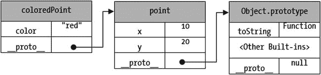
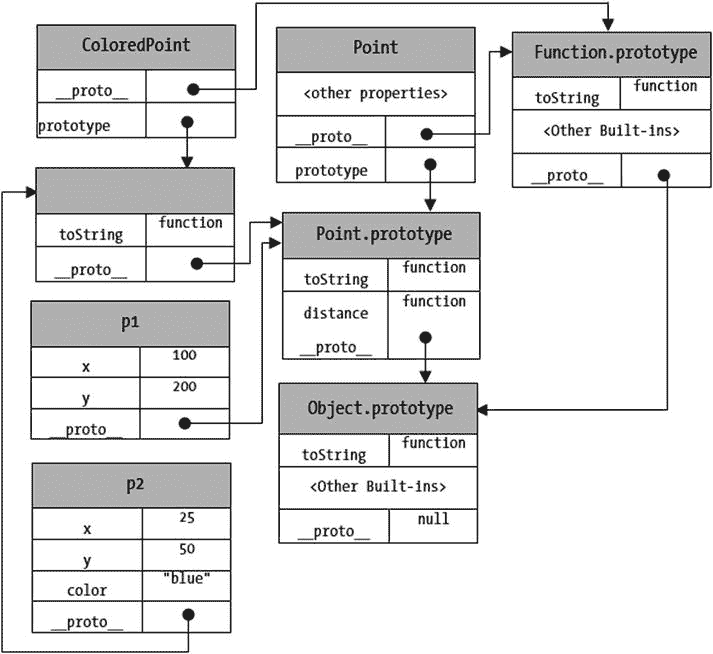

# 四、使用 Nashorn 编写脚本

在本章中，您将学习:

*   如何用 Nashorn 编写脚本
*   在严格模式和非严格模式下运行脚本的区别
*   如何声明变量和编写注释
*   基元和对象数据类型，以及如何将一种数据类型的值转换为另一种数据类型
*   Nashorn 中的运算符、语句以及创建和调用函数
*   创建和使用对象的不同方式
*   变量范围和提升
*   关于内置全局对象和函数

Nashorn 是 JVM 上 ECMAScript 5.1 规范的运行时实现。ECMAScript 定义了自己的语法和构造，用于声明变量、编写语句、操作符、创建和使用对象、集合、迭代数据集合等等。Nashorn 100%符合 ECMAScript 5.1，因此在使用 Nashorn 时，您需要学习一套新的语言语法。例如，在 Nashorn 中处理对象与在 Java 中处理对象完全不同。

本章假设您对 Java 编程语言至少有初级的理解。我不会详细解释 Nashorn 提供的结构和语法，它们在 Java 中的工作方式是一样的。例如，我不会解释 Nashorn 中的赋值操作符`=`是做什么的。相反，我将简单地提到赋值操作符`=`在 Nashorn 和 Java 中是一样的。Nashorn 的强大之处在于它允许您在脚本中使用 Java 库。然而，要在 Nashorn 中使用 Java 库，您必须知道 Nashorn 的语法和结构。本章简要介绍了 Nashorn 的语法和结构。

## 严格和非严格模式

Nashorn 可以在两种模式下运行:严格模式和非严格模式。ECMAScript 的某些功能不能在严格模式下使用。通常，在严格模式下不允许使用容易出错的功能。一些在非严格模式下工作的功能在严格模式下会产生错误。我会在解释具体特性的同时，列出适用于严格模式的特性。您可以通过两种方式在脚本中启用严格模式:

*   使用带有`jjs`命令的`–strict`选项
*   使用`"use strict"`或`'use strict'`指令

以下命令在严格模式下调用`jjs`命令行工具，并试图在不声明变量的情况下将值 10 赋给名为`empId`的变量。您会收到一条错误消息，指出变量`empId`未定义:

```java
C:\> jjs -strict

jjs> empId = 10;

<shell>:1 ReferenceError: "empId" is not defined

jjs> exit()
```

解决方案是使用关键字`var`(稍后讨论)在严格模式下声明`empId`变量。

下面的命令在非严格模式下调用`jjs`命令行工具(没有`–strict`选项),并试图在不声明变量的情况下给名为`empId`的变量赋值 10。这一次，您不会收到错误；相反，变量的值(即`10`)被打印出来:

```java
C:\> jjs

jjs> empId = 10;

10

jjs>exit()
```

清单 4-1 显示了一个使用 use strict 指令的脚本。该指令在脚本或函数的开头指定。use strict 指令就是字符串`"use strict"`。您也可以像`'use strict'`一样用单引号将指令括起来。该脚本在没有声明变量的情况下为变量赋值，这将产生一个错误，因为启用了严格模式。

清单 4-1。带有严格模式指令的脚本

```java
// strict.js

"use strict"; // This is the use strict directive.

empId = 10;   // This will generate an error.
```

## 标识符

标识符是脚本中变量、函数、标签等的名称。Nashorn 中的标识符是一个 Unicode 字符序列，其规则如下:

*   它可以包含字母、数字、下划线和美元符号
*   它不能以数字开头
*   它不能是保留字之一
*   标识符中的字符可以替换为 Unicode 转义序列，其形式为`\uxxxx`，其中`xxxx`是十六进制格式的字符的 Unicode 数值

以下是有效标识符的示例:

*   `empId`
*   `emp_id`
*   `_empId`
*   `emp$Id`
*   `num1`
*   `\u0061bc`(与`abc`相同，因为`\u0061`是字符`a`的 Unicode 转义序列)

以下是无效标识符的示例:

*   `4num`(不能以数字开头)
*   `emp id`(不能包含空格)
*   `emp+id`(不能包含+号)
*   `break` ( `break`是保留字，不能用作标识符)

表 [4-1](#Tab1) 、 [4-2](#Tab2) 和 [4-3](#Tab3) 列出了 Nashorn 中的保留字。表 [4-1](#Tab1) 中列出的保留字已经被用作关键字。您对 Java 中的大多数关键字都很熟悉。在纳顺，它们有相同的意义；例如，`for`、`do`和`while`用于表示循环结构，而`break`和`continue`用于中断循环并继续循环中的下一次迭代。我将在这一章简单解释一下 Nashorn 特有的关键词。表 [4-2](#Tab2) 和 [4-3](#Tab3) 列出了现在还没有使用的关键字，但是以后会用到。

使用任何保留字作为标识符都会产生错误。表 [4-3](#Tab3) 中的保留字仅在严格模式下会产生错误。它们可以在非严格模式下使用，没有任何错误。

表 4-3。

The List of Future Reserved Words in Strict-Mode in Nashorn

    
| `implements` | `let` | `private` | `public` |
| --- | --- | --- | --- |
| `yield` | `interface` | `package` | `protected` |
| `static` |   |   |   |

表 4-2。

The List of Future Reserved Words in Nashorn

    
| `class` | `enum` | `extends` | `super` |
| --- | --- | --- | --- |
| `const` | `export` | `import` |   |

表 4-1。

The List of Reserved Words in Nashorn Used as Keywords

    
| `break` | `do` | `instanceof` | `typeof` |
| --- | --- | --- | --- |
| `case` | `else` | `new` | `var` |
| `catch` | `finally` | `return` | `void` |
| `continue` | `for` | `switch` | `while` |
| `debugger` | `function` | `this` | `with` |
| `default` | `if` | `throw` |   |
| `delete` | `in` | `try` |   |

## 评论

Nashorn 支持两种类型的注释:

*   单行注释
*   多行注释

在 Nashorn 中编写注释的语法与 Java 相同。以下是注释的示例:

```java
// Let us declare a variable named empId (A single-line comment)

var empId;

/* Let us declare a variable named empList

and another variable named deptId (A multi-line comment)

*/

var empList;

var deptId;
```

## 声明变量

脚本语言是松散类型的。变量的类型在编译时是未知的。在程序执行期间，变量的类型可以改变。变量的类型是在运行时根据变量中存储的值确定的。例如，同一个变量可以在某处存储一个数字，在另一处存储一个字符串。Nashorn 中的这条规则与 Java 有很大的不同，Java 是一种强类型语言，变量的类型在其声明中是已知的。

在 Nashorn 中，关键字`var`用于声明一个变量。在 ECMAScript 术语中，变量声明被称为变量语句:

```java
// Declare a variable named msg

var msg;
```

注意，与 Java 不同的是，在 Nashorn 中不需要指定声明变量的数据类型。您可以在一个变量语句中声明多个变量。变量名由逗号分隔:

```java
// Declare three variables

var empId, deptId, emplList;
```

Tip

在严格模式下，将变量命名为`eval`或`arguments`都是错误的。

变量在声明时被初始化为`undefined`。我将在下一节讨论数据类型和`undefined`值。也可以在声明时用值初始化变量:

```java
/* Declare and initialize variables deptId, and empList. deptId is

initialized to the number 400 and empList is initialized to an

array of strings.

*/

var deptId = 400, emplList = ["Ken", "Lydia", "Simon"];
```

请注意，您可以使用数组文字在 Nashorn 中创建一个数组，该数组文字包含用括号括起来的逗号分隔的数组元素列表。我将在第 7 章中详细讨论数组。

在非严格模式下，可以在变量声明中省略关键字`var`:

```java
// Declare a variable named greeting without using the keyword var

greeting = "Hello";
```

## 数据类型

中的数据类型可以分为两类:基元类型和对象类型。基本类型包括以下五种数据类型:

*   不明确的
*   空
*   数字
*   布尔代数学体系的
*   线

### 未定义的类型

未定义的类型只有一个名为`undefined`的值。Nashorn 中已声明但已赋值的变量的值为`undefined`。你也可以显式地给一个变量赋值`undefined`。另外，你可以用`undefined`比较另一个值。下面的代码片段显示了如何使用值`undefined`:

```java
// empId is initialized to undefined implicitly

var empId;

// deptId is initilaized to undefined explicitly

var deptId = undefined;

// Print the values of empId and deptId

print("empId is", empId)

print("deptId is", deptId);

if (empId == undefined) {

print("empId is undefined")

}

if (deptId == undefined) {

print("deptId is undefined")

}

empId is undefined

deptId is undefined

empId is undefined

deptId is undefined
```

### 空类型

空类型只有一个名为`null`的值。尽管值`null`被认为是原始类型，但它通常用在需要一个对象但没有有效对象要指定的地方。下面的代码片段显示了如何使用值`null`:

```java
var person = null;

print("person is", person);

person is null
```

### 数字类型

与 Java 不同，Nashorn 不区分整数和浮点数。它只有一种称为 Number 的类型来表示这两种类型的数值。数字以双精度 64 位 IEEE 浮点格式存储。所有的数字常量都称为数字文字。像 Java 一样，您可以用十进制、十六进制、八进制和科学记数法来表示数字文字。Nashorn 定义了数字类型的三个特殊值:非数字、正无穷大和负无穷大。在脚本中，这些特殊值分别由`NaN`、+ `Infinity`和`–Infinity`表示。正无穷大值也可以简单地表示为`Infinity`，没有前导的`+`符号。以下代码片段显示了如何使用数字文字和特殊数字类型值:

```java
var empId = 100;               // An integer of type Number

var salary = 1500.678;         // A lfoating-point number of type Number

var hexNumber = 0x0061;        // Same as 97 is decimal

var octalNumber = 0141;        // Same 97 in decimal

var scientificNumber = 0.97E2; // Same 97 in decimal

var notANumber = NaN;

var posInfinity = Infinity;

var negInfinity = -Infinity;

// Print all values

print("empId =", empId);

print("salary =", salary);

print("hexNumber =", hexNumber);

print("octalNumber =", octalNumber);

print("scientificNumber =", scientificNumber);

print("notANumber =", notANumber);

print("posInfinity =", posInfinity);

print("negInfinity =", negInfinity);

empId = 100

salary = 1500.678

hexNumber = 97

octalNumber = 97

scientificNumber = 97

notANumber = NaN

posInfinity = Infinity
```

`negInfinity = -` `Infinity`

### 布尔类型

布尔类型代表一个逻辑实体，它或者为真或者为假。像 Java 一样，Nashorn 有两个布尔类型的文字，`true`和`false`:

```java
Var isProcessing = true;

var isProcessed = false;

print("isProcessing =", isProcessing);

print("isProcessed =", isProcessed);

isProcessing = true

isProcessed = false
```

### 字符串类型

字符串类型包括零个或多个 Unicode 字符的所有有限有序序列。用双引号或单引号括起来的字符序列称为字符串文字。序列中的字符数称为字符串的长度。以下是使用字符串文字的示例:

```java
var greetings = "Hi there";     // A string literal of length 8

var title = 'Scripting in Java'; // A string literal enclosed in single quotes

var emptyMsg = "";              // An empty string of length zero
```

如果字符串文字用双引号括起来，它可以包含单引号，反之亦然。如果字符串文字用双引号括起来，如果想在字符串中包含双引号，就需要用反斜杠对双引号进行转义。单引号中的字符串也是如此。以下代码片段向您展示了一些示例:

```java
var msg1 = "It's here and now.";

var msg2 = 'He said, "He is happy."';

var msg3 = 'It\'s here and now.';

var msg4 = "He said, \"He is happy.\"";

print(msg1);

print(msg2);

print(msg3);

print(msg4);

It's here and now.

He said, "He is happy."

It's here and now.

He said, "He is happy."
```

与 Java 不同，Nashorn 中的字符串文字可以写成多行。您需要在行尾使用反斜杠作为延续字符。注意反斜杠和行结束符不是字符串的一部分。下面是一个用三行代码编写字符串文本`Hello World!`的示例:

```java
// Assigns the string, Hello world!, to msg using a multi-line string literal

var msg = "Hello \

world\

!";

print(msg);

Hello world!
```

如果想在多行字符串中插入换行符，需要使用转义序列`\n`，如下所示。请注意，我将开头和结尾的引号放在了单独的一行上，这使得多行文本更加易读:

```java
// Uses a multi-line string with embedded newlines

var lucyPoem = "\

STRANGE fits of passion have I known:\n\

And I will dare to tell,\n\

But in the lover's ear alone,\n\

What once to me befell.\

";

print(lucyPoem);

STRANGE fits of passion have I known:

And I will dare to tell,

But in the lover's ear alone,

What once to me befell.
```

字符串中的字符可以按字面意思出现，也可以以转义序列的形式出现。您可以使用 Unicode 转义序列来表示任何字符。某些字符(如行分隔符、回车符等)不能按字面意思表示，它们必须以转义序列的形式出现。表 [4-4](#Tab4) 列出了 Nashorn 中定义的转义序列。

表 4-4。

Single Character Escape Sequences in Nashorn

   
| 字符转义序列 | Unicode 转义序列 | 字符名称 |
| --- | --- | --- |
| \b | \u0008 | 退格键 |
| \t | \u0009 | 横表 |
| \n | \ u000A | 换行(新行) |
| \v | \u000B | 垂直标签 |
| \f | \ u000C | 换页 |
| \r | \u000D | 回车 |
| \" | \u0022 | 双引号 |
| \' | \u0027 | 单引号 |
| \\ | \u005C | 反斜线符号 |

Nashorn 和 Java 解释 Unicode 转义序列的方式有很大的不同。与 Java 不同，Nashorn 在执行代码之前不会将 Unicode 转义序列解释为实际字符。Java 中的以下单行注释、字符文字和字符串文字将不会编译，因为编译器会在编译程序之前将`\u000A`转换为新的一行:

```java
// This, \u000A, is a new line, making the single line comment invalid

char c = '\u000A';

String str = "Hello\u000Aworld!";
```

在 Java 中，你必须将代码中的`\u000A`替换为`\n`才能工作。Nashorn 中的以下代码片段工作正常:

```java
// This, \u000A, is a new line that is valid in Nashorn

var str = "Hello\u000AWorld!";

print(str);

Hello

World!
```

我将推迟对对象类型的讨论，直到我解释完 Nashorn 中的基本构造，比如操作符、语句、循环等等。

## 经营者

Nashorn 支持许多运营商。大部分和 Java 操作符一样。我将在这一节列出所有的操作符，并在这里讨论其中的几个。我将在后续章节中适当的时候讨论其他问题。表 [4-5](#Tab5) 列出了 Nashorn 的操作员。

表 4-5。

The List of Operators in Nashorn

    
| 操作员 | 名字 | 句法 | 描述 |
| --- | --- | --- | --- |
| `++` | 增量 | `++i` `i++` | 将操作数增加 1。 |
| `--` | 减量 | `--i` `i--` | 将操作数减 1。 |
| `delete` |   | `delete prop` | 从对象中删除指定的属性。 |
| `void` |   | `void expr` | 丢弃指定表达式的返回值。 |
| `typeof` |   | `typeof expr` | 返回描述指定表达式类型的字符串。 |
| `+` | 一元加号 | `+op` | 将操作数转换为数字类型。 |
| `-` | 一元否定 | `-op` | 将操作数转换为数字类型，然后对转换后的值求反。 |
| `∼` | 按位非 | `∼op` | 将操作数用作 32 位有符号整数，翻转其位，并将结果作为 32 位有符号整数返回。 |
| `!` | 逻辑非 | `!expr` | 如果`expr`的计算结果为`false`，则返回`true`。如果`expr`评估为`true`，则返回`false`。 |
| `+` | 数字加法/字符串串联 | `op1 + op2` | 如果其中一个操作数是字符串或者它们可以转换为字符串，则执行字符串串联。否则，执行数字加法。 |
| `-` | 减法 | `op1 - op2` | 对两个操作数执行数字减法，如果它们不是数字，则将它们转换为数字。 |
| `/` | 分开 | `op1 / op2` | 执行除法并返回两个操作数的商。 |
| `*` | 增加 | `op1 * op2` | 执行乘法并返回操作数的乘积。 |
| `%` | 剩余物 | `op1 % op2` | 使用左操作数作为除法运算的被除数，右操作数作为除数，并返回余数。 |
| `in` |   | `prop in obj` | 如果`obj`包含名为`prop`的属性，则返回`true`。否则，返回 false。这里，`prop`是字符串或可转换为字符串的值，`obj`是对象。 |
| `instanceof` |   | `obj instanceof cls` | `obj`的返回`true`是类`cls`的一个实例。否则，返回`false`。 |
| `<` | 小于 | `op1 < op2` | `op1`的返回值`true`小于`op2`。否则，返回`false`。 |
| `<=` | 小于或等于 | `op1 <= op2` | `op1`的返回值`true`小于或等于`op2`。否则，返回`false`。 |
| `>` | 大于 | `op1 > op2` | `op1`的返回值`true`大于`op2`。否则，返回`false`。 |
| `>=` | 大于或等于 | `op1 >= op2` | `op1`的返回值`true`大于等于`op2`。否则，返回`false`。 |
| `==` | 平等 | `op1 == op2` | 如果`op1`和`op2`相等，则返回`true`。否则，返回`false`。如有必要，将应用类型转换。例如，`"2" == 2`返回`true`，因为字符串`"2"`被转换为数字`2`，然后两个操作数相等。 |
| `!=` | 不平等 | `op1 != op2` | 如果`op1`和`op2`不相等，则返回`true`。否则，返回`false`。如有必要，将应用类型转换。 |
| `===` | 同一性或严格平等 | `op1 === op2` | 如果两个操作数的类型和值相同，则返回`true`。否则，返回`false`。表达式，`"2" === 2`返回的`false "2"`是一个字符串，`2`是一个数字。表达式`"2" === "2"`和`2 === 2`都返回`true`。 |
| `!==` | 非同一性或严格不平等 | `op1 !== op2` | 如果操作数不相等和/或不属于同一类型，则返回`true`。两个表达式`"2" !== 2`和`2 !==3`都返回`true`。在第一个表达式中，操作数的类型不匹配(字符串和数字),在第二个表达式中，操作数的值不匹配。 |
| `<<` | 按位左移 | `op1 << op2` | 按照`op2`指定的量对`op1`执行按位左移操作。在执行左移之前，`op1`被转换为 32 位有符号整数。结果也是一个 32 位有符号整数。 |
| `>>` | 按位带符号右移 | `op1 >> op2` | 按照`op2`指定的量对`op1`执行符号填充按位右移操作。左边的新位填充了保持`op1`符号和结果相同的原始最高有效位。将`op1`转换为 32 位有符号整数，结果也是 32 位有符号整数。 |
| `>>>` | 按位无符号右移 | `op1 >>> op2` | 按照`op2`指定的量对`op1`执行补零按位右移操作。左边的新位用零填充，使结果成为无符号 32 位整数。 |
| `&` | 按位“与” | `op1 & op2` | 对`op1`和`op2`的每一对位执行按位 AND 运算。如果两位都为 1，则结果位为 1。否则，结果位为 0。 |
| `&#124;` | 按位或 | `op1 &#124; op2` | 对`op1`和`op2`的每一对位执行按位“或”运算。如果任一位为 1，则结果位为 1。如果两位都为 0，则结果位为 0。 |
| `^` | 按位异或 | `op1 ^ op2` | 对`op1`和`op2`的每一对位执行逐位异或运算。如果位不同，则结果位为 1。否则，结果位为 0。 |
| `&&` | 逻辑“与” | `op1 && op2` | 返回`op1`或`op2`。如果`op1`为`false`或者可以转换为`false`，则返回`op1`。否则，返回`op2`。 |
| `&#124;&#124;` | 逻辑或 | `op1 &#124;&#124; op2` | 返回`op1`或`op2`。如果`op1`为`true`或者可以转换为`true`，则返回`op1`。否则，返回`op2`。 |
| `?:` | 条件或三元运算符 | `op1 ? op2 : op3` | 如果`op1`评估为真，则返回 op2 的值。否则，返回 op3 的值。 |
| `=` | 分配 | `op1 = op2` | 将`op2`的值赋给`op1`并返回`op2`。 |
| `+=, -=, *=, /=, %=, <<=, >>=, >>>=, &=, ^=, &#124;=` | 复合赋值 | `op1 op= op2` | 如同执行类似`op1 = op1 op op2`的语句一样工作。应用运算(+、=、*、/、%)上的`op1`和`op2`，将结果赋给 op1 并返回结果。 |
| `,` | 逗点算符 | `op1, op2, op3...` | 从左到右计算每个操作数，并返回最后一个操作数的值。用于需要一个表达式，但你想使用多个表达式的地方，例如在`for`循环头中。 |

运算符具有优先权。在表达式中，优先级较高的运算符在优先级较低的运算符之前计算。像 Java 一样，可以将表达式中优先级最高的部分括在括号中。以下是运算符的优先级列表。级别 1 的操作员比级别 2 的操作员具有更高的优先级。同一级别的运算符具有相同的优先级:

`++` (Postfix increment), `--` (postfix decrement)   `!, ∼, +` (Unary plus), `-` (Unary negation), `++` (Prefix increment), `--` (Prefix decrement), `typeof`, `void`, `delete`   `*, /, %`   `+` (Addition), `-` (Subtraction)   `<< , >>, >>>`   `<, <=, >, >=, in, instanceof`   `==, !=, ===, !==`   `&`   `^`   `|`   `&&`   `||`   `? :`   `=, +=, -=, *=, /=, %=, <<=, >>=, >>>=, &=,  ^=,  |=`   `,` (Comma operator)  

我将在这一节讨论几个操作符。Nashorn 中的这些操作符要么不是 Java 语言，要么工作方式非常不同:

*   相等运算符(`==`)和严格相等运算符(`===`)
*   逻辑 AND ( `&&`)和逻辑 OR ( `||`)运算符

`==`操作符的工作方式与它在 Java 中的工作方式几乎相同。它检查两个操作数是否相等，如果可能的话，执行诸如字符串到数字的类型转换。例如，`"2" == 2`返回`true`，因为字符串`"2"`被转换为数字 2，然后两个操作数相等。表达式`2 == 2`也返回`true`，因为两个操作数都是 number 类型，并且它们的值相等。相比之下，`===`操作符检查两个操作数的类型和值是否相等。如果两者不相同，则返回`false`。例如，“2”= = = 2 返回`false`，因为一个操作数是字符串，另一个是数字。它们的类型不匹配，即使它们的值在转换为字符串或数字时匹配。

在 Java 中，`&&`和`||`操作符处理布尔操作数，它们返回`true`或`false`。在纳顺，情况并非如此；这些运算符返回任意类型的操作数值之一。在 Nashorn 中，任何类型的值都可以转换成布尔值`true`或`false`。可以转换成`true`的值称为 truthy，可以转换成`false`的值称为 falsy。我将在本章的下一节提供真值和假值的完整列表。

`&&`和`||`运算符处理 truthy 和 falsy 操作数，并返回一个不一定是布尔值的操作数值。`&&`和`||`运算符也称为短路运算符，因为如果第一个操作数本身可以确定结果，它们不会计算第二个操作数。

如果第一个操作数为 falsy，则`&&`操作符返回该操作数。否则，它返回第二个操作数。考虑以下语句:

```java
var result = true && 120; // Assigns 120 to result
```

该语句将 120 分配给`result`。`&&`的第一个操作数为真，所以它对第二个操作数求值并返回。考虑另一种说法:

```java
var result = false && 120; // Assigns false to result
```

该语句将`false`赋给结果。`&&`的第一个操作数是`false`，所以它不计算第二个操作数。它只是返回第一个操作数。

如果第一个操作数为真，则`||`运算符返回该操作数。否则，它返回第二个操作数。考虑以下语句:

```java
var result = true || 120; // Assigns true to result
```

该语句将 true 赋值给`result`。`||`的第一个操作数是`true`，所以它返回第一个操作数。考虑另一种说法:

```java
var result = false || 120; // Assigns 120 to result
```

该语句将`120`赋给结果。`||`的第一个操作数是`false`，因此它计算第二个操作数并返回其值。

## 类型变换

Java 中不允许的事情在 Nashorn 中是允许的，比如在需要布尔值的地方使用数字或字符串。考虑 Nashorn 中的以下代码片段，它将一个布尔值添加到一个数字中:

```java
var n1 = true + 120;

var n2 = false + 120;

print("n1 = " + n1);

print("n2 = " + n2);

n1 = 121

n2 = 120
```

Java 中不允许使用表达式`true + 120`。然而，在纳斯雄是允许的。注意，纳斯霍恩隐式地将`true`转换为数字 1，将`false`转换为数字 0。Nashorn 执行了大量隐式转换。您需要对它们有很好的理解，才能在 Nashorn 中编写无 bug 的代码。以下部分详细解释了这些转换。

### 到布尔转换

在 Nashorn 中，只要需要布尔值，就可以使用 true 或 falsy 值。例如，`if`语句中的条件不需要产生布尔值。它可以是任何真值或假值。表 [4-6](#Tab6) 列出了值的类型及其对应的转换布尔值。

表 4-6。

The List of Value Types and Their Corresponding Converted Boolean Values

  
| 值类型 | 转换的布尔值 |
| --- | --- |
| `Undefined` | `false` |
| `Null` | `false` |
| `Boolean` | 身份转换 |
| `Number` | 如果参数为`+0`、`-0`或`NaN`，则计算结果为`false`；否则，评估为`true` |
| `String` | 空字符串的计算结果为`false`。所有其他字符串评估为`true` |
| `Object` | `true` |

您还可以使用`Boolean()`全局函数来显式地将一个值转换为布尔类型。该函数将待转换的值作为参数。以下代码片段包含一些隐式和显式转换为布尔类型的示例:

```java
var result;

result = undefined ? "undefined is truthy" : "undefined is falsy";

print(result);

result = null ? "null is truthy" : "null is falsy";

print(result);

result = 100 ? "100 is truthy" : "100 is falsy";

print(result);

result = 0 ? "0 is truthy" : "0 is falsy";

print(result);

result = Boolean("") ? "The empty string is truthy"

: "The empty string is falsy";

print(result);

result = 'Hello' ? "'Hello' is truthy" : "'Hello' is falsy";

print(result);

undefined is falsy

null is falsy

100 is truthy

0 is falsy

The empty string is falsy

'Hello' is truthy
```

### 至数字转换

Nashorn 中所有类型的值都可以隐式或显式地转换为 Number 类型。表 [4-7](#Tab7) 列出了数值的类型及其对应的转换数值。

表 4-7。

The List of Value Types and Their Corresponding Converted Numeric Values

  
| 值类型 | 转换后的数值 |
| --- | --- |
| `Undefined` | `NaN` |
| `Null` | `+0` |
| `Boolean` | 布尔值`true`被转换为 1，而`false`被转换为 0 |
| `Number` | 身份转换 |
| `String` | 空字符串和只包含空格的字符串被转换为零。一个字符串，其内容在修剪了前导空格和尾随空格后可被解释为数字，该字符串被转换为相应的数值。如果字符串的数字内容过大或过小，则分别转换为`+Infinity`或`–Infinity`。所有其他字符串都转换为`NaN` |
| `Object` | 如果对象的内容可以解释为数字，则对象被转换为相应的数值；否则，对象被转换为`NaN` |

您可以使用`Number()`全局函数显式地将一个值转换为数字类型。该函数将要转换的值作为参数，并返回一个数字。以下代码片段包含一些隐式和显式转换为数字类型的示例:

```java
var result;

result = Number(undefined);

print("undefined is converted to", result);

// Any number + NaN is NaN

result = 10 + undefined;

print("10 + undefined is", result);

result = Number("");

print("The empty string is converted to", result);

result = Number('Hello');

print("'Hello' is converted to", result);

// Convertes to the number 1982, ignoring leading and trailing whitespaces

result = Number(' 1982 ');

print("' 1982 ' is converted to", result);

result = Number(new Object(88));

print("new Object(88) is converted to", result);

result = Number(new Object());

print("new Object() is converted to", result);

// A very big number in a string

result = Number("10E2000");

print("10E2000 is converted to", result);

undefined is converted to NaN

10 + undefined is NaN

The empty string is converted to 0

'Hello' is converted to NaN

' 1982 ' is converted to 1982

new Object(88) is converted to 88

new Object() is converted to NaN

10E2000 is converted to Infinity
```

### 到字符串转换

Nashorn 中所有类型的值都可以隐式或显式地转换为 String 类型。表 [4-8](#Tab8) 列出了值的类型及其对应的转换后的字符串值。

表 4-8。

The List of Value Types and Their Corresponding Converted String Values

  
| 值类型 | 转换后的字符串值 |
| --- | --- |
| `Undefined` | `"undefined"` |
| `Null` | `"null"` |
| `Boolean` | 布尔值`true`被转换为“真”,而`false`被转换为“假” |
| `Number` | `+0`、`0`、`-0`转换为“0”；`NaN`转换为“南”；`Infinity`(或`+Infinity`)转换为“无穷大”；`-Infinity`转换为“-无穷大”。所有其他数字都转换为相应的十进制或科学记数法的字符串表示形式。较大的数字可能无法准确转换 |
| `String` | 身份转换 |
| `Object` | 如果对象是原始值的包装器，它将原始值作为字符串返回；否则，通过调用`toString()`方法返回对象的字符串表示。如果对象中不存在`toString()`方法，则返回`valueOf()`方法返回值的字符串表示 |

您可以使用`String()`全局函数显式地将一个值转换为字符串类型。该函数将要转换的值作为参数，并返回一个字符串。以下代码片段包含一些隐式和显式转换为字符串类型的示例:

```java
var result;

result = String(undefined);

print("undefined is converted to", result);

result = String(true);

print("true is converted to", result);

result = String(9088);

print("9088 is converted to", result);

result = String(0x786A);

print("0x786A is converted to", result);

result = String(900000000000000000000);

print("900000000000000000000 is converted to", result);

result = String(9000000000000000000000);

print("9000000000000000000000 is converted to", result);

result = String(new Object(1982));

print("new Object(1982) is converted to", result);

result = String(new Object());

print("new Object() is converted to", result);

undefined is converted to undefined

true is converted to true

9088 is converted to 9088

0x786A is converted to 30826

900000000000000000000 is converted to 900000000000000000000

9000000000000000000000 is converted to 9e+21

new Object(1982) is converted to 1982

new Object() is converted to [object Object]
```

## 声明

Nashorn 包含了 Java 中的大部分语句。大多数语句类型的工作方式与 Java 非常相似。以下是 Nashorn 中的语句类型列表:

*   块语句
*   可变语句
*   空白语句
*   表达式语句
*   `if`声明
*   迭代(或循环)语句
*   `continue`声明
*   `break`声明
*   `return`声明
*   `with`声明
*   `switch`声明
*   带标签的陈述
*   `throw`声明
*   `try`声明
*   调试器语句

和 Java 一样，你可以用分号来结束一个语句。然而，与 Java 不同，语句结束符是可选的。Nashorn 会在很多情况下插入分号。大多数情况下，您可以省略分号作为语句结束符，没有任何问题。Nashorn 会根据需要自动插入它们。在某些情况下，分号的自动插入可能会导致程序的错误解释。以下规则用于自动插入分号:

*   如果解析器遇到当前正在解析的语句中不允许的源文本，并且该文本前面至少有一个行结束符，则会自动插入分号
*   如果语句后有右大括号(`}`)，则在语句后插入分号
*   在程序的末尾插入一个分号
*   如果分号将被解析为空语句，它不会自动插入(我将在本章后面解释空语句)。分号也不会插入到`for`语句的头部

考虑以下代码:

```java
var x = 1, y = 3, z = 5

x = y

z++

printf("x = %d, y = %d, z = %d", x, y, z)
```

解析器将自动插入分号作为语句终止符，就像您编写了如下代码一样:

```java
var x = 1, y = 3, z = 5;

x = y;

z++;

printf("x = %d, y = %d, z = %d", x, y, z);
```

考虑以下代码:

```java
var x = 10, y = 20

if (x > y)

else x = y
```

解析器会在变量语句和赋值语句`x = y`后插入分号，但不会在`if`语句后插入分号。转换后的代码如下:

```java
var x = 10, y = 20;

if (x > y)

else x = y;
```

分号不会自动插入到`if`语句之后，因为插入的分号将被解释为空语句。这段代码将无法编译，因为`if`语句有一个条件，但缺少一个语句。

解析器一直解析源代码，直到找到一个有问题的标记。它并不总是在行结束符前插入分号。考虑以下代码:

```java
var x

x

=

200

printf("x = %d", x)
```

解析器将把三行源代码(第二到第四行)视为一个赋值语句(x = 200 ),并在 200 后面插入一个分号。转换后的代码如下:

```java
var x;

x

=

200;

printf("x = %d", x);
```

考虑以下打印 20 的代码:

```java
var x = 200, y = 200, z

z = Math.sqrt

(x + y).toString()

print(z)
```

解析器不会在第三行(`z = Math.sqrt`)的末尾插入分号。它认为下一行中的`(`是函数`Math.sqrt`的参数列表的开始。转换后的代码如下所示:

```java
var x = 200, y = 200, z;

z = Math.sqrt

(x + y).toString();

print(z);
```

然而，代码的作者可能打算将函数引用`Math.sqrt`赋给名为`z`的变量。在这种情况下，分号的自动插入会改变代码的预期含义。如果您自己在赋值语句后插入分号，代码输出会有所不同:

```java
var x = 200, y = 200, z;

z = Math.sqrt;      // Assigns Math.sqrt function reference to z

(x + y).toString(); // Converts x + y to a string and ignores the result

print(z);

function sqrt() { [native code] }
```

如果您使用关键字`void`编写了相同的代码来忽略表达式`(x + y).toString()`的结果，解析器会在文本 z = `Math.sqrt`后添加一个分号。下面的代码工作起来就好像你打算将函数引用`Math.sqrt`赋给名为`z`的变量:

```java
var x = 200, y = 200, z   // A semicolon is inserted here

z = Math.sqrt             // A semicolon is inserted here

void (x + y).toString()   // A semicolon is inserted here
```

`print(z)                  // A semicolon is inserted` `here`

```java
function sqrt() { [native code] }
```

在第二行末尾插入分号的原因是，关键字`void`是第三行中一个有问题的标记。关键字`void`不能是从第二行开始的赋值语句的一部分。

Tip

我建议在任何需要的地方使用分号作为语句结束符。依赖分号的自动插入有时可能会导致细微的错误。

我将在下面几节中简要讨论这些语句类型。

### 块语句

block 语句的工作方式类似于 Java 中的。它是一组用大括号(`{ }`)括起来的零个或多个语句。与 Java 不同，block 语句中声明的变量没有该块的局部范围。可以在声明它们的 block 语句之前和之后访问它们。以下代码片段演示了这一点:

```java
var empId = 100;

// Print empId and deptId. Note that deptId has not been

// declared yet, but you can access it.

print("empId = " + empId + ", deptId = " + deptId);

// A block statement

{

var deptId = 200;

print("empId = " + empId + ", deptId = " + deptId);

// Compute the area of a circle

var radius = 2.3;

var area = Math.PI * radius * radius;

printf("Radius = %.2f, Area = %.2f", radius, area);

}

print("empId = " + empId + ", deptId = " + deptId);

empId = 100, deptId = undefined

empId = 100, deptId = 200

Radius = 2.30, Area = 16.62
```

`empId = 100, deptId =` `200`

在代码中，变量`deptId`被声明为块的局部变量。但是，您可以在块的外部(之前和之后)访问它。这不是纳斯雄的 bug。这是根据变量作用域规则设计的。Nashorn 中的变量作用域与 Java 中的很不一样。我将在变量作用域和提升一节中讨论变量的作用域。

### 可变语句

变量语句用于声明和(可选)初始化变量。我已经在声明变量一节中讨论了变量语句。变量语句的示例如下:

```java
// Declare a variable named empId

var empId;

// Declare a variable named deptId and initialize it to 200

var deptId = 200;
```

### 空白语句

分号用作空语句。Nashorn 中的空语句的工作方式与 Java 中的相同。没有效果。它可以用在任何需要语句的地方。像 Java 一样，Nashorn 中的`for`语句用于迭代目的。下面的代码使用一个`for`语句来打印整数 1 到 10。空语句用作语句体:

```java
// The semicolon at the end is the empty statement

for(var i = 1; i <= 10; print(i++));
```

### 表达式语句

表达式语句是由带/不带副作用的表达式组成的语句。以下是表达式语句的一些示例:

```java
var i = 100; // A variable statement

i++;         // An expression statement

print(i);    // An expression statement
```

### if 语句

Nashorn 中的`if`语句的工作方式与它在 Java 中的工作方式相同。它的一般语法是:

```java
if(condition)

statement;
```

对于`if`语句，也可以有一个`else`部分:

```java
if(condition)

statement-1;

else

statement-2;
```

如果`condition`评估为`true`，则执行`statement-1`；否则，执行`statement-2`。注意，`condition`可以是任何类型的表达式，不一定是布尔表达式。`condition`表达式被计算并转换为布尔型值。以下代码片段显示了如何使用一个`if`和一个`if-else`语句:

```java
var x = 100, y = 200;

if (x <= y)

printf("%d <= %d", x, y);

// The print() function returns undefined that evaluates to a Boolean false.

if (print(x)) {

print("Inside if");

}

else {

print("Inside else")

}

100 <= 200

100

Inside else
```

注意，表达式`print(x)`被用作第二个`if`语句的`condition`。`print()`函数打印变量`x`的值并返回`undefined`。值`undefined`被转换成布尔型`false`(请参考布尔型转换一节)，它将执行与`else`部分相关的语句。

### 迭代语句

Nashorn 支持五种类型的迭代语句:

*   `while`声明
*   `do-while`声明
*   `for`声明
*   `for..in`声明
*   `for..each..in`声明

Nashorn 中的`while`、`do-while`和`for`语句的工作方式与 Java 中的相同。我不会详细讨论它们，因为作为 Java 开发人员，你知道如何使用它们。下面的代码演示了它们的用法:

```java
// Print first 3 natural numbers using the while,

// do-while, and for statements

var count;

print("Using the while statement...");

count = 1;

while (count <= 3) {

print(count);

count++;

}

print("Using the do-while statement...");

count = 1;

do {

print(count);

count++;

} while (count <= 3);

print("Using the for statement...");

for(var i = 1; i <= 3; i++) {

print(i);

}

Using the while statement...

1

2

3

Using the do-while statement...

1

2

3

Using the for statement...

1

2

3
```

`for..in`语句用于迭代数组的索引或对象的属性名。它可以用于数组、列表、地图、任何 Nashorn 对象等集合。它的语法是:

```java
for(var index in object)

Statement;
```

首先，对`object`进行评估。如果计算结果为`null`或`undefined`，则跳过整个`for..in`语句。如果它评估为一个对象，该语句将可枚举属性分配给`index`，并执行主体。该索引属于字符串类型。对于数组，`index`是数组元素的索引，作为一个字符串。对于任何其他集合，如列表或地图(Nashorn 对象也是地图)，对象的属性被分配给`index`。您可以使用括号符号(`object[index]`)来访问属性的值。下面的代码演示了如何使用`for..in`语句迭代数组的索引:

```java
// Create an array of three strings

var empNames = ["Ken", "Fred", "Li"];

// Use the for..in statement to iterate over indices of the array

for(var index in empNames) {

var empName = empNames[index];

printf("empNames[%s]=%s", index, empName);

}

empNames[0]=Ken

empNames[1]=Fred

empNames[2]=Li
```

Tip

`index`在 for 中...in 语句是字符串类型，而不是数字类型。

`for..each..in`语句不在 ECMAScript 5.1 规范中。Nashorn 支持的 Mozilla JavaScript 1.6 扩展。当`for..in`语句遍历集合的索引/属性名时，`for..each..in`语句遍历集合中的值。它的工作方式与 Java 中的`for-each`语句相同。请注意，集合是唯一值的集合，没有给这些值命名。不能使用`for..in`语句迭代集合，但是可以使用`for..each..in`语句。它的语法是:

```java
for(var value in object)

Statement;
```

以下代码显示了如何使用`for..each..in`语句迭代数组的元素(不是索引):

```java
// Create an array of three strings

var empNames = ["Ken", "Fred", "Li"];

// Use the for..each..in statement to iterate over elements of the array

for each(var empName in empNames) {

printf(empName);

}

Ken

Fred

Li
```

我将在[第 7 章](07.html)中讨论更多关于`for..in`和`for..each..in`的语句。

### continue、break 和 return 语句

Nashorn 中的`continue`、`break`和`return`语句的工作方式与 Java 中的相同。可以对`continue`和`break`语句进行标记。`continue`语句跳过迭代语句体的其余部分，跳到迭代语句的开头，继续下一次迭代。`break`语句跳转到它所在的迭代和`switch`语句的末尾。函数中的`return`语句将控制权返回给函数的调用者。可选地，`return`语句也可以向调用者返回值。

### with 语句

Nashorn 在一个称为执行上下文的上下文中执行脚本。它使用与执行上下文相关联的作用域链在脚本中查找非限定名。首先在最近的范围内搜索该名称。如果没有找到，则继续沿着范围链向上搜索，直到找到该名称，或者在范围链的顶部执行搜索。它的语法是:

```java
with(expression)

statement
```

在执行`statement`时，`with`语句将计算为对象的指定的`expression`添加到作用域链的头部。

Tip

不推荐使用`with`语句，因为它会导致混淆非限定名存在于何处——在`with`语句指定的对象中，还是在作用域链上的某个位置。在严格模式下是不允许的。

以下代码演示了`with`语句的用法:

```java
var greetings = new String("Hello");

// Must use greetings.length to access the length property

// of the String object named greetings

printf("greetings = %s, length = %d", greetings, greetings.length);

with(greetings) {

// You can use the length property of the greetings object

// as an unqualified identifier within this with statement.

printf("greetings = %s, length = %d", greetings, length);

}

with(new String("Hi")) {

// The toString() and length will be resolved using the

// new String("Hi") object

printf("greetings = %s, length = %d", toString(), length);

}

with(Math) {

// Compute the area of a circle

var radius = 2.3;

// PI and pow are resolved as properties of the Math object

var area = PI * pow(radius, 2);

printf("Radius = %.2f, Area = %.2f", radius, area);

}

greetings = Hello, length = 5

greetings = Hello, length = 5

greetings = Hi, length = 2
```

`Radius = 2.30, Area = 16.` `62`

### switch 语句

Nashorn 中的`switch`语句与 Java 中的`switch`语句非常相似。它的语法是:

```java
switch(expression) {

case expression-1:

statement-1;

case expression-2:

statement-2;

default:

statement-3;

}
```

使用`===`操作符将`expression`与`case`子句中的表达式进行匹配。执行第一个匹配的`case`子句中的语句。如果`case`子句包含一个`break`语句，则控制权转移到`switch`语句的末尾；否则，执行匹配的`case`子句后的语句。如果没有找到匹配，则执行`default`子句中的语句。如果有多个匹配，则只执行第一个匹配的`case`子句中的语句。在 Java 中，`expression`必须是类型`int`、`String`或`enum,`，而在 Nashorn 中，`expression`可以是任何类型，包括 Object、Null 和 Undefined 类型。以下代码片段演示了如何使用`switch`语句:

```java
// Define a match function that matches the passed in argument

// using a switch statement

function match(value) {

switch (value) {

case undefined:

print("Matched undefined:", value);

break;

case null:

print("Matched null:", value);

break;

case '2':

print("Matched string '2':", value);

break;

case 2:

print("Matched number 2: ", value);

break;

default:

print("No match:", value);

break;

}

}

// Call the match function with different arguments

match(undefined);

match(null);

match(2);

match('2');

match("Hello");

Matched undefined: undefined

Matched null: null

Matched number 2: 2

Matched string '2': 2

No match: Hello
```

### 带标签的陈述

标签只是一个后跟冒号的标识符。Nashorn 中的任何语句都可以通过在语句前放置标签来标记。事实上，Nashorn 允许一个语句有多个标签。一旦你标记了一个语句，你可以使用相同的标签和`break`和`continue`语句来中断并继续这个标签。通常，您会标记外部迭代语句，以便可以继续或中断嵌套循环。标签语句的工作方式与它们在 Java 中的工作方式相同。以下是使用带标签的语句和带标签的`continue`语句打印 3x3 矩阵左下半部分的示例:

```java
// Create a 3x3 matrix using an array of arrays

var matrix = [[11, 12, 13],

[21, 22, 23],

[31, 32, 33]];

outerLoop:

for(var i = 0; i < matrix.length; i++) {

for(var j = 0; j < matrix[i].length; j++) {

java.lang.System.out.printf("%d ", matrix[i][j]);

if (i === j) {

print();

continue outerLoop;

}

}

}

11
```

`21` `22`

```java
31 32 33
```

### throw 语句

一个`throw`语句用于抛出一个用户定义的异常。它的工作方式类似于 Java 中的`throw`语句。它的语法是:

```java
throw expression;
```

在 Java 中，`throw`语句抛出一个`Throwable`类或者它的一个子类的对象；`expression`必须评估为`Throwable`实例。在 Nashorn 中，`throw`语句可以抛出任何类型的值，包括数字或字符串。Nashorn 几乎没有内置对象可以用作在`throw`语句中抛出的错误对象。这样的对象有`Error`、`TypeError`、`RangeError`、`SyntaxError`等。以下代码片段显示了当`empId`不在 1 和 10000 之间时如何抛出一个`RangeError`:

```java
var empId = -900;

if (empId <= 0 || empId >= 10000) {

throw new RangeError(

"empId must be between 1 and 10000\. Found: " + empId);

}
```

当您运行代码时，它将在标准错误上打印错误的堆栈跟踪。像 Java 一样，Nashorn 允许您处理抛出的错误。您将需要使用一个`try-catch-finally`语句来处理抛出的错误，这将在下一节中讨论。

### try 语句

Nashorn 中的`try-catch-finally`语句的工作方式与它在 Java 中的工作方式相同。`try`块包含一个或多个要执行的可能抛出错误的语句。如果语句抛出一个错误，控制被转移到`catch`块。最后，执行`finally`块中的语句。像在 Java 中一样，您可以有三种组合的`try`、`catch`和`finally`块:`try-catch`、`try-finally`和`try-catch-finally`。与 Java 不同，ECMAScript 只支持每个`try`块一个`catch`块。Nashorn 支持 Mozilla JavaScript 1.4 扩展，允许每个`try`块有多个`catch`块。使用`try`块的语法是:

```java
/* A try-catch block */

try {

// Statements that may throw errors

}

catch(identifier) {

// Handle the error here

}

/* A try-finally block */

try {

// Statements that may throw errors

}

finally {

// Perform cleanup work here

}

/* A try-catch-finally block */

try {

// Statements that may throw errors

}

catch(identifier) {

// Handle the error here

}

finally {

// Perform cleanup work here

}
```

Tip

在严格模式下，使用`eval`或`arguments`作为`catch`块中的标识符是一个`SyntaxError`。

下面是一个带有多个`catch`块的`try`块，支持作为 Nashorn 扩展，其中`e`是一个标识符。您可以使用任何其他标识符来代替`e`:

```java
/* A try block with multiple catch blocks */

try {

// Statements that may throw errors

}

catch (e if e instanceof RangeError) {

// Handle RangeError here

}

catch (e if e instanceof TypeError) {

// Handle TypeError here

}

catch (e) {

// Handle other errors here

}
```

考虑清单 4-2 中的代码。它定义了两个函数:`isInteger()`和`factorial()`。如果`isInteger()`函数的参数是一个整数，它将返回`true`；否则，它返回`false`。`factorial()`函数计算并返回自然数的阶乘。如果参数不是数字，它抛出一个`TypeError`,如果参数不是大于或等于 1 的数字，它抛出一个`RangeError`。

清单 4-2。factorial.js 文件的内容

```java
// factorial.js

// Returns true if n is an integer. Otherwise, returns false.

function isInteger(n) {

return typeof n === "number" && isFinite(n) && n%1 === 0;

}

// Define a function that computes and returns the factorial of an integer

function factorial(n) {

if (!isInteger(n)) {

throw new TypeError(

"The number must be an integer. Found:" + n);

}

if(n < 0) {

throw new RangeError(

"The number must be greater than 0\. Found: " + n);

}

var fact = 1;

for(var counter = n; counter > 1; fact *= counter--);

return fact;

}
```

清单 4-3 中的程序使用`factorial()`函数计算一个数字和一个字符串的阶乘。`load()`函数用于从`factorial.js`文件加载程序。`Error`对象(或其子类型)的`message`属性包含错误消息。程序使用`message`属性来显示错误信息。当“Hello”作为参数传递给函数时,`factorial()`函数抛出一个`TypeError`。程序处理错误并显示错误消息。

清单 4-3。factorial_test.js 文件的内容

```java
// factorial_test.js

// Load the factorial.js file that contains the factorial() function

load("factorial.js");

try {

var fact3 = factorial(3);

print("Factorial of 3 is", fact3);

var factHello = factorial("Hello");

print("Factorial of 3 is", factHello);

}

catch (e if e instanceof RangeError) {

print("A RangeError has occurred.", e.message);

print("Error:", e.message);

}

catch (e if e instanceof TypeError) {

print("A TypeError has occurred.", e.message);

}

catch (e) {

print(e.message);

}

Factorial of 3 is 6

A TypeError has occurred. The number must be an integer. Found:Hello
```

Nashorn 扩展了 ECMAScript 提供的`Error`对象。它添加了几个有用的属性来获取抛出的错误的详细信息。表 [4-9](#Tab9) 列出了这些属性及其描述。

表 4-9。

The List of the Proeprties of Error Object in Nashorn

   
| 财产 | 类型 | 描述 |
| --- | --- | --- |
| `lineNumber` | 数字 | 源代码中引发错误对象的行号 |
| `columnNumber` | 数字 | 源代码中引发错误对象的列号 |
| `fileName` | 线 | 源脚本的文件名 |
| `stack` | 线 | 脚本堆栈以字符串形式跟踪 |
| `printStackTrace()` | 功能 | 打印完整的堆栈跟踪，包括抛出错误的所有 Java 帧 |
| `getStackTrace()` | 功能 | 仅为 ECMAScript 框架返回一个`java.lang.StackTraceElement`实例数组 |
| `dumpStack()` | 功能 | 像 Java 中的`java.lang.Thread.dumpStack()`方法一样打印当前线程的堆栈跟踪。`dumpStack()`是`Error`对象的一个函数属性，你需要调用它作为`Error.dumpStack()` |

清单 4-4 显示了清单 4-3 中程序的另一个版本。这一次，您仅使用`catch`块，并使用针对`Error`对象的 Nashorn 扩展来打印错误的详细信息。

清单 4-4。文件 factorial_test2.js 的内容

```java
// factorial_test2.js

load("factorial.js");

try {

// throw new TypeError("A type error occurred.");

var fact3 = factorial(3);

print("Factorial of 3 is", fact3);

var factHello = factorial("Hello");

print("Factorial of 3 is", factHello);

}

catch (e) {

printf("Line %d, column %d, file %s. %s",

e.lineNumber, e.columnNumber, e.fileName, e.message);

}

Factorial of 3 is 6

Line 10, column 8, file factorial.js. The number must be an integer. Found:Hello
```

### 调试器语句

`debugger`语句用于调试目的。它本身不采取任何行动。如果调试器是活动的，实现可能会导致断点，但当它遇到一个`debugger`语句时，并不要求它这样做。语法是:

```java
debugger;
```

NetBeans 8.0 IDE 在调试模式下支持`debugger`语句。我将在[第 13 章](13.html)中展示如何使用`debugger`语句调试 Nashorn 脚本。

## 定义函数

在 Nashorn 中，函数是一个可执行的参数化代码块，声明一次就可以执行多次。执行函数被称为调用或调用函数。函数是一个对象；它可以有属性，可以作为参数传递给另一个函数；它可以被赋给一个变量。一个函数可以有以下几个部分:

*   一个名字
*   形式参数
*   一具尸体

可以选择给一个函数起一个名字。当一个函数被调用时，你可以传递一些被称为该函数参数的值。实参被复制到函数的形参中。函数体由一系列语句组成。函数可以选择使用`return`语句返回值。如果没有使用`return`语句从函数返回，默认情况下，将返回值`undefined`。Nashorn 中的函数可以用多种方式定义，如后续章节所述。

Tip

你可能认为 Nashorn 中的`function`是 Java 中的一个方法。但是，请注意，Nashorn 中的函数是一个对象，它有许多不同的用法，而 Java 中的方法是无法使用的。

### 函数声明

您可以使用`function`语句声明一个函数，如下所示:

```java
function functionName(param1, param2...) {

function-body

}
```

关键字`function`用于声明一个函数。`functionName`是函数的名称，可以是任何标识符。`param1`、`param2`等是形式参数名。一个函数可以没有形参，在这种情况下，函数名后面会有一个左括号和一个右括号。由零个或多个语句组成的函数体用大括号括起来。

Tip

在严格模式下，不能使用 eval 和 arguments 作为函数名或函数的形参名。

到目前为止，函数声明中的所有内容看起来都像是 Java 中的方法声明。但是，有两个显著的区别:

*   函数声明没有返回类型
*   函数只指定形参的名称，而不指定它们的类型

下面是一个名为`adder`的函数的例子，它接受两个参数，并通过对它们应用`+`运算符来返回值:

```java
// Applies the + operator on parameters named x and y,

// and returns the result

function adder(x, y) {

return x + y;

}
```

在 Java 中调用函数和调用方法是一样的。您需要使用函数名，后跟用圆括号括起来的逗号分隔的参数列表。以下代码片段调用带有两个值分别为 5 和 10 的参数的`adder`函数，并将该函数的返回值赋给一个名为`sum`的变量:

```java
var sum = adder(5, 10); // Assigns 15 to sum
```

考虑以下代码片段和输出:

```java
var sum1 = adder(5, true); // Assigns 6 to sum1

var sum2 = adder(5, "10"); // Assigns "510" to sum2

print(sum1, typeof sum1);

print(sum2, typeof sum2);

6 number

510 string
```

这会给你一个惊喜。您可能已经编写了`adder()`函数，记住要将两个数相加。但是，您能够传递 Number、Boolean 和 String 类型的参数。事实上，您可以向该函数传递任何类型的参数。这是因为 Nashorn 是一种松散类型的语言，类型检查是在运行时执行的。在给定的上下文中，所有值都被转换为预期的类型。在第一个调用`adder(5, true)`中，布尔值`true`被自动转换为数字 1；在第二个调用`adder(5, "10")`中，数字 5 被转换为字符串“5 ”,+操作符作为字符串连接操作符。如果你希望函数中的参数是类型安全的，你需要自己验证它们，就像你在清单 4-2 的`factorial()`函数中所做的那样。

Tip

每个函数都有一个只读属性，名为`length`，它包含函数的形参数量。在我们的例子中，`adder.length`将返回 2，因为`adder()`函数声明了两个名为`x`和`y`的形参。

函数是一个对象。函数名是对函数对象的引用。您可以将函数名赋给另一个变量，并将其传递给其他函数。以下代码片段将对`adder()`函数的引用分配给一个名为`myAdder`的变量，并使用`myAdder`变量调用该函数:

```java
// Assigns the reference of the adder function to the variable myAdder

var myAdder = adder;

// Call the function (adder()) referenced by myAdder

var sum = myAdder(5, 10);

print(sum);

15
```

#### 使用函数参数

在我讨论函数中的参数传递是如何工作的之前，考虑下面的代码片段，它用零到三个参数调用`adder()`函数:

```java
var sum1 = adder();         // Passes no arguments

var sum2 = adder(10);       // Passes only one arguments

var sum3 = adder(10, 5);    // Passes two arguments

var sum4 = adder(10, 5, 9); // Passes three arguments - one extra

print("sum1 = " + sum1)

print("sum2 = " + sum2)

print("sum3 = " + sum3)

print("sum4 = " + sum4)

sum1 = NaN

sum2 = NaN

sum3 = 15

sum4 = 15
```

首先要注意的是，代码执行时没有任何错误，也就是说，Nashorn 允许您向函数传递少于或多于函数形参数量的参数。这个特性是好是坏取决于你如何看待它。从某种意义上说，您可以认为 Nashorn 中的所有函数都是 varargs，其中可以命名一些形参。从坏的方面来说，您可能会认为，如果您希望调用方传递的参数数量与声明的形参数量相同，就需要验证传递给函数的参数数量。

在每个函数体内，都有一个名为`arguments`的对象引用。它的行为就像一个数组，但它是一个对象，而不是一个数组。它的`length`属性是传递给函数的实际参数的数量。实际的参数使用索引 0、1、2、3 等存储在`arguments`对象中。第一个参数是`arguments[0]`，第二个参数是`arguments[1]`，以此类推。以下规则适用于函数调用的参数:

*   传递给函数的参数存储在`arguments`对象中
*   如果传递的参数数量小于声明的形参，则未填充的形参被初始化为`undefined`
*   如果传递的参数的数量大于形参的数量，您可以使用`arguments`对象来访问额外的参数。事实上，您可以使用`arguments`对象随时访问所有参数
*   如果为形参传递一个变量，形参名称和该形参的`arguments`对象索引属性被绑定到同一个值。改变参数值或`arguments`对象中的相应值会改变两者

清单 4-5 显示了一个`avg()`函数的代码，它计算传递参数的平均值。该函数不声明任何形参。它检查是否至少传递了两个参数，并且所有参数都必须是数字(原始数字或数字对象)。

清单 4-5。使用 arguments 对象访问所有传递的参数的函数

```java
// avg.js

function avg() {

// Make sure at least two arguments are passed

If (arguments.length < 2) {

throw new Error(

"Minimum 2 arguments are required to compute average.");

}

// Compute the sum of all arguments

var sum = 0;

for each (var arg in arguments) {

if (!(typeof arg === "number" ||

arg instanceof Number)) {

throw new Error("Not a number: " + arg);

}

sum += arg;

}

// Compute and return the average

return sum / arguments.length;

}
```

下面的代码片段调用了`avg()`函数:

```java
// Load avg.js file, so the avg() function is available

load("avg.js");

printf("avg(1, 2, 3) = %.2f", avg(1, 2, 3));

printf("avg(12, 15, 300, 8) = %.2f", avg(12, 15, 300, 8));

avg(1, 2, 3) = 2.00

avg(12, 15, 300, 8) = 83.75
```

### 函数表达式

函数表达式是可以在任何可以定义表达式的地方定义的函数。函数表达式看起来非常类似于函数声明，除了函数名是可选的。下面是一个函数表达式示例，它将函数定义为赋值表达式的一部分:

```java
var fact = function factorial(n) {

if (n <= 1) {

return 1;

}

var f = 1;

for(var i = n; i > 1; f *= i--);

return f;

};

/* Here, you can use the variable name fact to call the function,

not the function name factorial.

*/

var f1 = fact(3);

var f2 = fact(7);

printf("fact(3) = %d", f1);

printf("fact(10) = %d", f2);

fact(3) = 6
```

`fact(10) =` `5040`

请注意函数表达式中右大括号末尾的分号，它是赋值语句的终止符。您已经为函数表达式命名为`factorial`。然而，除了在函数体内部之外，名字`factorial`不能用作函数名。如果要调用函数，必须使用存储了函数引用的变量。下面的代码显示了函数体中函数表达式的函数名的用法。这段代码使用递归函数调用来计算阶乘:

`var fact = function``factorial`T2】

```java
if (n <= 1) {

return 1;

}

// Uses the function name factorial to call itself
```

`return n *``factorial`T2】

```java
};

var f1 = fact(3);

var f2 = fact(7);

printf("fact(3) = %d", f1);

printf("fact(10) = %d", f2);

fact(3) = 6

fact(10) = 5040
```

函数表达式中的函数名是可选的。代码可以写成如下形式:

```java
// There is no function name in the function expression. It is an // anonymous function.

var fact = function (n) {

if (n <= 1) {

return 1;

}

var f = 1;

for(var i = n; i > 1; f *= i--);

return f;

};

var f1 = fact(3);

var f2 = fact(7);

printf("fact(3) = %d", f1);

printf("fact(10) = %d", f2);
```

`fact(3) =` `6`

```java
fact(10) = 5040
```

还可以定义一个函数表达式，并在同一个表达式中调用它。以下代码显示了如何以两种不同的方式定义和调用函数表达式:

```java
// Load the avg.js file, so the avg() function will be available

load("avg.js");

// Encloses the entire expression in (). Defines a function expression and calls

// it at the same time.

(function printAvg(n1, n2, n3){

// Call the avg() function

var average = avg(n1, n2, n3);

printf("Avarage of %.2f, %.2f and %.2f is %.2f.", n1, n2, n3, average);

}(10, 20, 40));

// Uses the void operator to create an expression. Defines a function // expression and calls it at the same time.

void function printAvg(n1, n2, n3) {

var average = avg(n1, n2, n3);

printf("Avarage of %.2f, %.2f and %.2f is %.2f.", n1, n2, n3, average);

}(10, 20, 40);

Avarage of 10.00, 20.00 and 40.00 is 23.33.

Avarage of 10.00, 20.00 and 40.00 is 23.33.
```

首先，加载定义了`avg()`函数的`avg.js`文件。函数表达式需要用圆括号括起来，或者在前面加上`void`操作符，以帮助解析器不要将其混淆为函数声明。函数参数列表跟在函数表达式右大括号后面。在第二种情况下，您使用了`void`操作符而不是括号。解析器将能够正确地解析函数参数，因为它期望在`void`操作符之后有一个表达式，而不是函数声明。您可以在两个函数表达式的代码中删除函数名。

Nashorn 支持 Mozilla JavaScript 1.8 扩展，这是定义函数表达式的简写，函数表达式的主体只由一个表达式组成。在这种情况下，可以从函数体中去掉大括号和`return`语句。以下代码使用简写语法定义了`adder`函数表达式:

```java
// The function expressions' body does not use {} and a return statement

var adder = function(x, y) x + y;

// Call the function using the adder variable

printf("adder(10, 5) = %d", adder(10, 5));

adder(10, 5) = 15
```

作为 Java 开发人员，你可以将函数表达式与 lambda 表达式和匿名类进行比较。通常，函数表达式被用作回调，并封装不应该向全局范围公开的业务逻辑。

### Function()构造函数

您也可以使用`Function`构造函数或`Function`函数创建一个函数对象。它允许你从一个字符串创建一个函数对象。Nashorn 中的构造函数是一个使用`new`操作符创建新对象的函数。Nashorn 有一个内置函数，名为`Function,`，可以用作构造函数。使用`Function`构造函数创建函数的语法是:

```java
var func = new Function("param1", "param2"..., "function-body");
```

也可以简单的用`Function`作为函数，如下图:

```java
var func = Function("param1", "param2"..., "function-body");
```

`param1`、`param2`等是正在定义的新函数的形参的名称。函数体是函数的体。`Function`的所有参数都作为字符串传递。如果你只传递一个参数，它被认为是函数的主体。您也可以在一个字符串中指定所有参数名称，方法是用逗号分隔名称，如下所示:

```java
var func = Function("param1, param2,...", "function-body");
```

下面的代码创建了我们之前创建的`adder()`函数。这一次，我们使用了`Function`对象:

```java
// Create a function that takes two arguments and returns

// the value after applying the + operator

var adder = new Function("x", "y", "return x + y;")

printf("adder(10, 15) = %d", adder(10, 15));

printf("adder('Hello', ' world') = %s", adder('Hello', ' world'));

adder(10, 15) = 25

adder('Hello', ' world') = Hello world
```

有时，您可能需要一个不带参数、不执行任何逻辑的空函数。一个空函数在被调用时总是返回`undefined`。您可以通过不向`Function`指定任何参数来创建这样一个空函数，如下所示:

```java
// Define an empty function

var emptyFunction = Function();

// Print the string form of the new function

print(emptyFunction);

// Call the function that will return undefined

var nothing = emptyFunction();

print(nothing);

function () {

}

undefined
```

建议您不要使用`Function`对象来定义函数，因为运行时无法对字符串中包含的函数体进行优化，并且每次遇到使用`Function`的表达式时都会创建函数。

## 对象类型

Nashorn 中的对象是属性的集合。有两种类型的属性:

*   命名数据属性
*   命名访问器属性

命名数据属性将名称与值相关联。该值可以是原始值、对象或函数。您可以将 Nashorn 中对象的命名数据属性视为 Java 对象的实例变量或方法。

命名访问器属性将名称与一个或两个访问器函数相关联。这些函数也被称为 getter 和 setter。访问器函数用于获取或设置值。当使用命名的访问器属性(赋值或读取)时，会调用相应的访问器函数。您可以将命名的访问器属性视为 Java 对象的 getter/setter 方法。

您还可以为对象的属性指定一些布尔属性。例如，您可以将对象的`writable`属性设置为`false`，使该属性为只读。在 Nashorn 中创建对象有几种方法:

*   使用对象文字
*   使用构造函数
*   使用`Object.create()`方法

下一节将解释如何使用这些方法创建对象。

### 使用对象文字

对象文字是创建和初始化对象的表达式。使用对象文字的语法是:

```java
{propName1:value1, propName2:value2, propName3:value3,...}
```

对象文字用大括号括起来。每个属性由一个名称-值对组成。属性的名称和值由冒号分隔。两个属性由逗号分隔。最后一个属性值后允许有尾随逗号。在对象文字中，`propName1`、`propName2`等是属性的名称，`value1`、`value2`等是它们的值。属性的名称可以是标识符、用单引号或双引号括起来的字符串，或者只是一个数字。如果属性名包含空格，则必须用单引号或双引号引起来。您也可以使用空字符串作为对象的属性名。

以这种方式定义的属性称为对象的自身属性。注意，一个对象可以从它的原型继承属性，这些属性被称为继承属性。以下语句使用对象文本创建几个对象:

```java
// An object with no own properties

var emptyObject = {};

// An object with two own properties named x and y

var origin2D = {x:0, y:0};

// An object with three own properties named x, y, and z

var origin3D = {x:0, y:0, z:0};

// An object with whitespaces in property names

var redColor = {"red value": 1.0,

green: 0.0,

"black value": 0.0,

alpha: 1.0};
```

#### 访问对象的属性

您可以使用两种语法之一，通过属性访问器表达式来访问对象的属性:

*   使用点符号
*   使用括号符号

点符号使用以下语法:

```java
objectExpression.property
```

`objectExpression`是一个表达式，其计算结果是对对象的引用，而`property`是属性名。

括号符号使用类似数组的语法:

```java
objectExpression[propertyExpression]
```

`objectExpression`是一个表达式，其计算结果是对对象的引用。接下来是左括号和右括号。`propertyExpression`是一个可转换为字符串的表达式，它是被访问的属性名。

Tip

如果属性名包含空格或存储在变量中，则必须使用括号符号而不是点符号来访问属性。

考虑上一节中的以下对象:

```java
// An object with whitespaces in the property names

var redColor = {"red value": 1.0,

green: 0.0,

"black Value": 0.0,

alpha: 1.0};
```

以下语句将对象的`alpha`属性的值读入名为`alphaValue`的变量中:

```java
// Assigns 1.0 to alphaValue

var alphaValue = redColor.alpha;
```

如果属性访问器表达式出现在赋值运算符的右侧，则表示您正在为属性设置新值。以下语句将`redColor`对象的`alpha`属性设置为 0.5:

```java
// Make the color semi-transparent

redColor.alpha = 0.5;
```

以下代码片段使用括号符号执行相同的操作:

```java
// Assigns 1.0 to alphaValue

var alphaValue = redColor["alpha"];

// Make the color semi-transparent

redColor["alpha"] = 0.5;
```

`"red value"`和`"black value"`属性包含一个空格，所以您只能使用括号符号来访问它们:

```java
// Assigns 1.0 to redValue

var redValue = redColor["red value"];

// Assigns 0.8 to the "red value" property

redColor["red value"] = 0.8
```

使用括号表示法时，可以使用任何可以转换为字符串形式的属性名的表达式。以下代码片段以两种方式将值 0.8 分配给`"red Value"`属性:

```java
var prop = "red value";

redColor[prop] = 0.8;                   // Using a variable

redColor["red" + " " + "value"] = 0.8;  // Using an expression
```

考虑下面的代码，它用两个名为`x`和`y`的属性定义了一个`point2D`对象，并试图读取一个名为`z`的不存在的属性:

```java
// Define a point2D object

var point2D = {x:10, y:-20};

// Try accessing x, y, and z properties

var x = point2D.x;

var y = point2D.y;

var z = point2D.z;

print("x = " + x + ", y =" + y + ", z = " + z);

x = 10, y =-20, z = undefined
```

你对输出感到惊讶吗？在 Nashorn 中访问不存在的对象属性不会产生错误。如果读取一个不存在的属性，则返回`undefined`；如果设置了不存在的属性，则会使用新值创建一个同名的新属性。以下代码显示了这种行为:

```java
// Create an object with one property x

var point3D = {x:10};

// Create a new property named y and assign -20 to it

point3D.y = -20;

// Create a new property named z and assign 35 to it

point3D.z = 35;

// Print all properties of point3D

print("x = " + point3D.x + ", y =" + point3D.y + ", z = " + point3D.z);

x = 10, y =-20, z = 35
```

如何知道不存在的属性和值为`undefined`的现有属性之间的区别？您可以使用`in`操作符来知道一个属性是否存在于一个对象中。语法是:

```java
propertyNameExpression in objectExpression
```

`propertyNameExpression`评估为一个字符串，它是属性的名称。`objectExpression`评估为一个对象。如果对象具有指定名称的属性，`in`操作符返回`true`；否则，它返回`false`。`in`操作符搜索对象的自身属性和继承属性。以下代码显示了如何使用`in`操作符:

```java
// Create an object with x and y properties

var colorPoint2D = {x:10, y:20};

// Check if the object has a property named x

var xExists = "x" in colorPoint2D;

print("Property x exists: " + xExists + ", x = " + colorPoint2D.x);

// Check if the object has a property named color

var colorExists = "color" in colorPoint2D;

print("Property color exists: " + colorExists + ", color = " + colorPoint2D.color);

// Add a color property and set it to undefined, and then, perform the check

colorPoint2D.color = undefined;

colorExists = "color" in colorPoint2D;

print("Property color exists: " + colorExists + ", color = " + colorPoint2D.color);

Property x exists: true, x = 10

Property color exists: false, color = undefined
```

`Property color exists: true, color =` `undefined`

下面的语句创建一个具有三个属性的对象；其中两个包含数据值，另一个包含函数。它向您展示了如何使用作为函数的属性。您需要调用传递参数的函数，如果有的话:

```java
// A person object with fName, lName, and getFullName properties

var john = {fName: "John",

lName: "Jacobs",

getFullName: function () {

return this.fName + " " + this.lName;

}

};

var fullName = john.getFullName();

print("Full name is " + fullName);

Full name is John Jacobs
```

注意函数中关键字`this`的使用。关键字`this`指的是调用函数的对象。

Tip

如果一个对象的数据属性有一个函数作为它的值，这样的函数被称为该对象的一个方法。换句话说，方法是定义为对象属性的函数。

您也可以使用括号符号访问作为函数的属性。语法看起来有点别扭。使用点符号的函数调用可以替换为括号符号，如下所示:

```java
var fullName = john["getFullName"]();

print("Full name is " + fullName);

Full name is John Jacobs
```

#### 定义访问者属性

访问器属性也称为 getter 和 setter 方法。您可以将访问器属性看作 Java 类中的一组`getXxx()`和`setXxx()`方法。当读取`xxx`属性时，调用名为`xxx`的 getter 方法；当设置了`xxx`属性时，名为`xxx`的 setter 方法被调用。getter 方法没有声明形参。setter 方法声明了一个形参。一个属性只能有一个 getter 方法和/或 setter 方法。以下是定义访问者属性的语法:

```java
{ prop1: value1, /* A data property */

prop2: value2, /* A data property */

/* The getter for the property propName */

get propName() {

// Getter method's body goes here

},

/* The setter for the property propName */

set propName(propValue) {

// Setter method's body goes here

}

}
```

定义一个访问器属性等同于用关键字`get`和`set`替换关键字`function`来声明函数。关键字`get`和`set`分别用于定义 getter 和 setter 方法。请注意，您没有使用冒号来定义访问者属性，但是您仍然需要使用逗号来分隔对象的两个属性。以下代码定义了一个对象，该对象具有两个名为`fName`和`lName`的数据属性，以及一个名为`fullName`的访问器属性:

```java
// A person object with fName and lName as data proeprties

// and fullName as an accessor property

var john = {fName: "John",

lName: "Jacobs",

get fullName() {

return this.fName + " " + this.lName;

},

set fullName(name) {

names = name.split(" ");

if(names.length === 2) {

this.fName = names[0];

this.lName = names[1];

}

else {

throw new Error("Full name must be in the form 'fName lName'.");

}

}

};

// Get the full name using the fullName accessor property and print it

print("Full name is " + john.fullName);

// Set a new full name

john.fullName = "Ken McEwen";

// Get the new full name and print it

print("New full name is " + john.fullName);

Full name is John Jacobs

New full name is Ken McEwen
```

注意，您通过设置`fullName`属性来设置这个人的名字和姓氏。当设置`fullName`属性的值时，如果该值遵循`"fName lName"`格式，则该值被传递给设置名字和姓氏的属性的 setter 方法。

#### 设置属性特性

您可以设置数据的属性和对象的访问者属性。表 [4-10](#Tab10) 列出了属性的属性。请注意，并非所有属性都适用于所有类型的属性。

表 4-10。

The List of Property Attributes and Their Descriptions

    
| 属性 | 类型 | 适用于 | 描述 |
| --- | --- | --- | --- |
| `value` | 任何类型 | 仅数据属性 | 财产的价值 |
| `writable` | 布尔代数学体系的 | 仅数据属性 | 指定属性的值是否可以更改。如果`false`，该属性是只读的。否则，该属性是可读写的。默认为`true` |
| `get` | 功能 | 仅访问器属性 | 属性或`undefined`的 getter 方法。默认为`undefined` |
| `set` | 功能 | 仅访问器属性 | `undefined`属性的 setter 方法。默认为`undefined` |
| `enumerable` | 布尔代数学体系的 | 两者 | 如果设置为`false`，则不能使用`for..in`和`for..each..in`循环枚举对象的属性。默认为`true` |
| `configurable` | 布尔代数学体系的 | 两者 | 设置为`false`，属性不能被删除，属性的属性不能被改变。默认为`true` |

您可以使用名为属性描述符的对象来读取和设置属性。下面的语句创建一个属性描述符，该描述符将`value`属性设为 10，将`writable`属性设为`false`:

```java
var descriptor = {value:10, writable:false};
```

创建属性描述符没有任何作用。它只是创建了一个对象。您需要使用`Object`的以下三种方法之一来定义一个带有属性的新属性，改变一个已经定义的属性的属性，以及读取一个已有属性的属性描述符:

*   `Object.defineProperty(object, "propertyName", propertyDescriptor)`
*   `Object.defineProperty(object, "propertyName", attributeObject)`
*   `Object.getOwnPropertyDescriptor(object, "propertyName")`

`defineProperty()`功能允许您定义一个带有属性的新属性或更改现有属性的属性。使用`defineProperties()`函数，您可以做同样的事情，但是需要多个属性。`getOwnPropertyDescriptor()`函数返回对象指定属性的描述符。所有这三个函数都与对象的自身属性一起工作。

以下代码定义了一个`origin2D`对象来定义 2D 坐标系中的原点，并使`x`和`y`属性不可写:

```java
// Define an object

var origin2D = {x:0, y:0};

// Read the property descriptors for x and y

var xDesc = Object.getOwnPropertyDescriptor(origin2D, "x");

var yDesc = Object.getOwnPropertyDescriptor(origin2D, "y");

printf("x.value = %d, x.writable = %b", xDesc.value, xDesc.writable);

printf("y.value = %d, y.writable = %b", yDesc.value, yDesc.writable);

// Make x and y non-writable

Object.defineProperty(origin2D, "x", {writable:false});

Object.defineProperty(origin2D, "y", {writable:false});

print("After setting x and y non-writable... ")

// Read the property descriptors for x and y again

var xDesc = Object.getOwnPropertyDescriptor(origin2D, "x");

var yDesc = Object.getOwnPropertyDescriptor(origin2D, "y");

printf("x.value = %d, x.writable = %b", xDesc.value, xDesc.writable);

printf("y.value = %d, y.writable = %b", yDesc.value, yDesc.writable);

x.value = 0, x.writable = true

y.value = 0, y.writable = true

After setting x and y non-writable...

x.value = 0, x.writable = false

y.value = 0, y.writable = false
```

以下代码向您展示了如何使用`Object.defineProperty()`函数添加新属性:

```java
// Define an object with no properties

var origin2D = {};

// Add two non-writable x and y properties to origina2D with their value set to 0.

Object.defineProperty(origin2D, "x", {value:0, writable:false});

Object.defineProperty(origin2D, "y", {value:0, writable:false});
```

在这段代码中，您可以使用`defineProperties()`函数一次性定义`x`和`y`属性。函数`defineProperty()`和`defineProperties()`都返回正在设置属性的对象，这样你就可以链接它们的调用。以下代码重写了前面的示例:

```java
// Create an empty object

var origin2D = {};

// Add two non-writable x and y properties to origina2D

// with their value set to 0.

Object.defineProperties(origin2D, {x: {value:0, writable: false},

y: {value:0, writable: false}});
```

Tip

当您在 object literal 中或通过给属性赋值来给对象添加属性时，`writable`、`enumerable`和`configurable`属性的默认值被设置为`true`。当您使用属性描述符定义一个属性或者改变属性的属性时，属性描述符中这些属性的缺省值是`false`。确保在使用属性描述符时为所有需要设置为`true`的属性指定值。

一旦您将属性的`writable`属性设置为`false`，更改其值将不起作用。在严格模式下，更改不可写属性的值会生成错误:

```java
var point = {x:0, y:10};

printf("x = %d", point.x);

// Make x non-writable

Object.defineProperty(point, "x", {writable: false});

// Try changing the value of x

point.x = 100; // Has no effect, because x is non-writable

printf("x = %d", point.x);

x = 0

x = 0
```

在 Nashorn 中定义常数并不简单。您将需要使用`Object.defineProperty()`函数来定义一个常数。下面的代码在全局范围内定义了一个名为`MAX_SIZE`的常量。关键字`this`指的是下面代码中的全局对象:

```java
// Define a constant named MAX_SIZE with a value 100

Object.defineProperty(this, "MAX_SIZE", {value:100, writable:false, configurable:false});

printf("MAX_SIZE = %d", MAX_SIZE);

MAX_SIZE = 100
```

您可以使用`for..in`和`for..each..in`迭代器语句迭代对象的`enumerable`属性。下面的代码创建一个具有两个默认属性`enumerable`的对象，使用`for..in`和`for..each..in`语句迭代属性，将其中一个属性更改为不可数，然后再次迭代属性:

```java
// Create an object with two properties x and y

var point = {x:10, y:20};

// Using for..in reports x and y as properties

for(var prop in point) {

printf("point[%s] = %d", prop, point[prop]);

}

// Make x non-enumerable

Object.defineProperty(point, "x", {enumerable: false});

print("After making x non-enumerable");

// Using for..in reports only y as property

// because x is now non-enumerable

for(var prop in point) {

printf("point[%s] = %d", prop, point[prop]);

}

point[x] = 10

point[y] = 20

After making x non-enumerable

point[y] = 20
```

#### 删除对象的属性

您可以使用`delete`操作符删除对象的`configurable`属性。它的语法是:

```java
delete property;
```

下面的代码片段创建一个具有两个属性`x`和`y`的对象，遍历属性，删除名为`x`的属性，并再次遍历属性。第二次，属性`x`及其值没有被打印出来，因为它已经被删除了:

```java
// Create an object with two properties x and y

var point = {x:10, y:20};

for(var prop in point) {

printf("point[%s] = %d", prop, point[prop]);

}

// Delete property x from the point object

delete point.x;

print("After deleting x");

for(var prop in point) {

printf("point[%s] = %d", prop, point[prop]);

}

point[x] = 10

point[y] = 20

After deleting x

point[y] = 20
```

在严格模式下，删除属性`configurable`设置为`false`的属性是错误的。在非严格模式下删除不可配置的属性没有任何效果。

### 使用构造函数

构造函数(或简称为构造函数)是与`new`操作符一起使用来创建对象的函数。习惯上，构造函数以大写字母开头。下面的代码创建了一个名为`Person`的函数，旨在用作构造函数:

```java
// Declare a constructor named Person

function Person(fName, lName) {

this.fName = fName;

this.lName = lName;

this.fullName = function () {

return this.fName + " " + this.lName;

}

}
```

注意，构造函数只是一个像其他函数一样的函数，它也可以在不使用`new`关键字的情况下作为函数被调用。结果可能会非常不同，这取决于函数是如何编写的。我将很快讨论这样的场景。

构造函数中的关键字`this`指的是用`new`操作符调用函数时被构造的对象。在这种情况下，`Person`函数中的`this.fName`指的是正在构造的新对象的`fName`属性。`lName`和`toString`也是。`Person`构造函数简单地给正在创建的对象添加了三个属性。以下代码片段使用`Person`构造函数创建了两个对象，并打印了它们的字符串表示:

```java
// Create few Person objects

var john = new Person("John", "Jacobs");

var ken = new Person("Ken", "McEwen");

// The print() function calls the toString() method when

// it needs to convertan object to a string

print(john);

print(ken);

John Jacobs

Ken McEwen
```

让我们试着简单地将`Person`用作函数，而不是构造函数:

```java
// Print details

printf("fName = %s, lName = %s", this.fName, this.lName);

// Call the Person function

var john = Person("John", "Jacobs");

// Print details

printf("fName = %s, lName = %s, full name = %s", this.fName, this.lName, this.fullName());

// Call the Person function

var ken = Person("Ken", "McEwen");

// The print two person references

print("john = " + john);

print("ken = " + ken);

printf("fName = %s, lName = %s, full name = %s", this.fName, this.lName, this.fullName());

fName = undefined, lName = undefined

fName = John, lName = Jacobs, full name = John Jacobs

john = undefined

ken = undefined

fName = Ken, lName = McEwen, full name = Ken McEwen
```

您可以在代码中观察到以下几点:

*   代码打印出`this.fName`和`this.lName`的值。在全局上下文中调用`printf()`函数，关键字`this`指的是全局对象。因为您没有为全局对象定义任何`fName`和`lName`属性，所以这两个属性的值都作为`undefined`返回。
*   调用`Person()`函数，其返回值存储在`john`变量中。`Person()`函数是在全局上下文中调用的，所以函数内部的关键字`this`指的是全局对象。该函数向全局对象添加三个属性。
*   `printf()`函数用于打印全局对象的详细信息(由`this`引用),以确认之前对`Person()`函数的调用将这些属性添加到了全局对象中。
*   用不同的参数再次调用`Person()`函数。第一次调用已经向全局对象添加了三个属性。这个调用只是用新值更新它们。通过再次从全局对象中读取这些属性来确认这一点。
*   因为`Person()`函数没有显式返回值，所以它默认返回`undefined`,这由输出中的最后两行确认。

如果不向构造函数传递任何参数，可以省略新对象创建表达式中的括号。下面的代码调用`Person`作为构造函数，而不传递任何参数，这些参数将函数内部的实际参数默认为`undefined`。注意，`new`操作符后面简单地跟了构造函数名:

```java
// Create a person with both names as undefined

var person = new Person;  // No arguments list

print(person.fullName());

// Set the names for the person

person.fName = "Ken";

person.lName = "Smith";

print(person.fullName());

undefined undefined

Ken Smith
```

通常情况下，构造函数不会在它的主体中使用`return`语句。如果它不返回值或原始值，则使用新对象，忽略原始值。如果它返回一个对象，则返回的对象被用作调用`new`操作符的值。构造函数的返回值可能会改变`new`操作符的返回对象，这听起来可能有点奇怪；然而，这是该语言的一个强大功能。您可以使用它来实现一个函数，该函数既可以用作函数，也可以用作构造函数，并且都返回一个对象。您可以使用它来缓存对象，并在缓存中已经存在新对象时返回缓存的对象。清单 4-6 展示了这样一种技术。

清单 4-6。Logger.js 文件的内容

```java
// Logger.js

// Declare a function object named Logger

function Logger() {

// A private method

function getLogger() {

if (!Logger.logger) {

// Create a new logger and store its reference in

// the looger pproperty of the Logger function

Logger.logger = {log: function(msg) {

print(msg);

}

};

}

return Logger.logger;

}

return getLogger();

}

// Create two logger objects

var logger1 = new Logger(); // A constructor call

var logger2 = new Logger(); // A constructor call

var logger3 = Logger();     // A function call

// Check if the logger is cached

print("logger1 === logger2 is " + (logger1 === logger2));

print("logger1 === logger3 is " + (logger1 === logger3));

logger1.log("Hello 1");

logger2.log("Hello 2");

logger3.log("Hello 3");

logger1 === logger2 is true

logger1 === logger3 is true

Hello 1

Hello 2

Hello 3
```

第一次调用`Logger`时，作为一个函数或者构造函数，用`log()`方法创建一个对象，在`Logger`函数的`logger`属性中缓存该对象，并返回该对象。当再次调用`Logger`时，它只是返回缓存的对象。

使用构造函数，可以维护对象的私有状态。这是使用闭包来完成的。如果在函数中用关键字`var`定义一个变量，该变量具有局部范围。它只能在函数内部访问。嵌套函数捕获其封闭范围，包括在其外部函数中声明的局部变量。清单 4-7 展示了使用构造函数维护对象私有状态的概念。它创建了一个维护当前值的`Sequence`对象，该对象只能通过方法`curValue()`和`nextValue()`访问。注意，当对象被创建时，局部变量`currentValue`被两个函数捕获。调用这些函数时，它们处理相同的捕获变量，如输出所示。

清单 4-7。Sequence.js 文件的内容

```java
// Sequence.js

// This object generates strictly increasing sequence numbers

function Sequence() {

var currentValue = 0;

// Using Nashorn extension syntax to define one-liner functions

this.nextValue = function () ++currentValue;

this.curValue = function () currentValue;

}

// Create a Sequence object

var empId = new Sequence();

print("empId sequence...");

printf("Current Value = %d, next Value = %d", empId.curValue(), empId.nextValue());

printf("Current Value = %d, next Value = %d", empId.curValue(), empId.nextValue());

printf("Current Value = %d, next Value = %d", empId.curValue(), empId.nextValue());

// Create a Sequence object

var deptId = new Sequence();

print("deptId sequence...");

printf("Current Value = %d, next Value = %d", deptId.curValue(), deptId.nextValue());

printf("Current Value = %d, next Value = %d", deptId.curValue(), deptId.nextValue());

printf("Current Value = %d, next Value = %d", deptId.curValue(), deptId.nextValue());

empId sequence...

Current Value = 0, next Value = 1

Current Value = 1, next Value = 2
```

`Current Value = 2, next Value =` `3`

```java
deptId sequence...

Current Value = 0, next Value = 1

Current Value = 1, next Value = 2

Current Value = 2, next Value = 3
```

### 对象继承

与 Java 不同，Nashorn 没有类。Nashorn 只处理对象。它支持基于原型的对象继承。除了属性集合，Nashorn 中的每个对象都有一个原型，即一个对象或`null`值。您可以使用`__proto__`属性访问对象原型的引用。注意，在属性名`__proto__`中，单词`proto`的前后有两个下划线。此属性已被否决，您可以使用以下两个函数来获取和设置对象的原型:

*   `Object.getPrototypeOf(object)`
*   `Object.setPrototypeOf(object, newPrototype)`

如果访问对象中的属性，首先搜索它自己的属性。如果找到属性，则返回该属性。如果找不到该属性，则搜索该对象的原型。如果找不到该属性，则搜索该对象的原型的原型，依此类推。搜索将继续，直到在原型链中找到该属性或搜索到整个原型链。这种搜索与 Java 中基于类的继承是一样的，其中属性沿着类继承链向上搜索，直到搜索到`java.lang.Object`类。

Tip

在 Java 中，类继承总是扩展到`java.lang.Object`类。在 Nashorn 中，`Object.prototype`是对象的默认原型。但是，您可以将原型设置为任何对象，包括`null`值。

考虑清单 4-8 中的代码。

清单 4-8。prototype.js 文件的内容

```java
// prototype.js

var point = {x: 10,

y: 20,

print: function() {

printf("(%d, %d)", this.x, this.y);

}

};

var coloredPoint = {color: "red",

print: function() {

printf("(%d, %d, %s)", this.x, this.y,                                          this.color);

}

};

// Set the point object as the prototype of the coloredPoint object

// That is, the coloredPoint object inherits from the point object.

Object.setPrototypeOf(coloredPoint, point);

print("After setting the prototype for coloredPoint...");

// Call the print() methods of both objects

point.print();

coloredPoint.print();

// Change the x and y values in the point object.

point.x = 100;

point.y = 200;

print("After setting the x and y properties for point...");

// Print the two points details again

point.print();

coloredPoint.print();

/* Call the toString() method that is defined in Object.prototype object and are

available in point and coloredPoint object through prototype chain.

*/

print(point.toString());

print(coloredPoint.toString());

// Print prototypes of objects

print("Object.getPrototypeOf(point) === Object.prototype is " +

(Object.getPrototypeOf(point) === Object.prototype));

print("Object.getPrototypeOf(colorPoint) === point is " +

(Object.getPrototypeOf(coloredPoint) === point));

print("Object.getPrototypeOf(colorPoint) === Object.prototype is " +

(Object.getPrototypeOf(coloredPoint) === Object.prototype));

After setting the prototype for coloredPoint...

(10, 20)

(10, 20, red)

After setting the x and y properties for point...

(100, 200)

(100, 200, red)

[object Object]

[object Object]

Object.getPrototypeOf(point) === Object.prototype is true

Object.getPrototypeOf(colorPoint) === point is true
```

`Object.getPrototypeOf(colorPoint) === Object.prototype is` `false`

您可以在代码中观察到以下几点:

*   它定义了一个具有三个属性的`point`对象，这三个属性分别是`x`、`y`和`print`
*   它定义了另一个名为`coloredPoint` `,`的对象，具有两个名为`color`和`print`的属性。此时，这两个对象是不相关的。
*   它使用`Object.setPrototypeOf()`函数将`point`对象设置为`coloredPoint`对象的原型，所以现在`coloredPoint`对象继承了`point`对象。此时，`coloredPoint`对象继承了`point`对象的所有属性，包括属性`x`和`y`。注意，x 和`y`只有一个副本，它们由`point`和`coloredPoint`对象共享。
*   它在两个对象上调用`print()`方法。输出确认两个对象都调用了各自版本的`print()`方法。这是一个财产超越的案例。`coloredPoint`对象覆盖了`point`对象的`print()`方法。这与 Java 中的工作原理相同。
*   它更改了`point`对象上的`x`和`y`属性的值，并再次调用这两个对象的`print()`方法。输出确认了`point`和`coloredPoint`对象的 x 和 y 值都已更改。
*   它对两个对象调用`toString()`方法，它们打印相同的字符串。这是另一个继承的例子。`point`对象没有设置它的原型，所以默认情况下，它的原型被设置为`Object.prototype`对象，其中`Object`是 Nashorn 中的内置对象。`toString()`方法在`Object.prototype`中定义，默认情况下被所有对象继承。`coloredPoint`对象从`point`对象继承而来，`point`对象从`Object.prototype`对象继承而来。
*   最后，它比较对象的原型并打印结果。输出证实了所讨论的原型链。

图 [4-1](#Fig1) 描绘了`point`和`coloredPoint`对象的原型链。注意，`Object.prototype`将其原型设置为`null`，表示原型链的结束。您可以将`point`对象的原型设置为`null`，从而从原型链中删除`Object.prototype`。



图 4-1。

The Prototype Chain for the point and coloredPoint Objects

在前面的例子中，您看到两个对象共享相同的属性，名为`x`和`y`。你并不真的想要共享对象的状态。通常，您希望每个对象都有自己的状态。您可以通过在`coloredPoint`对象中重新声明`x`和`y`属性来解决这个问题。如果在`coloredObject`上设置`x`和`y`属性，`coloredObject`将获得自己新的`x`和`y`属性。以下内容说明了这一点:

```java
var point = {x: 10,

y: 20,

print: function() {

printf("(%d, %d)", this.x, this.y);

}

};

var coloredPoint = {color: "red",

print: function() {

printf("(%d, %d, %s)", this.x, this.y, this.color);

}

};

Object.setPrototypeOf(coloredPoint, point);

// Call the print() methods of both objects

point.print();

coloredPoint.print();

// Change the x and y values in the point object

point.x = 100;

point.y = 200;

// Add own x and y properties to the coloredPoint object

coloredPoint.x = 300;

coloredPoint.y = 400;

// Call the print() methods of both objects

point.print();

coloredPoint.print();

(10, 20)

(10, 20, red)

(100, 200)

(300, 400, red)
```

Tip

原型链是在读取对象的属性时搜索的，而不是在更新它们时。回想一下，更新不存在的属性会向设置了该属性的对象添加一个新属性。

在前面的例子中，您看到了原型继承链在 Nashorn 中是如何工作的。您使用对象文字创建了对象，并使用`Object.setPrototypeOf()`函数设置了对象的原型。使用函数构造函数，您也可以做同样的事情，尽管有点不同。Nashorn 中的函数也是一个对象，默认情况下，函数的原型被设置为`Function.prototype`对象。`Function.prototype`以`Object.prototype`为原型。`Function.prototype`包含几个有用的方法和属性，可以用于所有的函数。例如，它覆盖了`Object.prototype`的`toString()`方法，该方法打印该函数的源代码。下面的代码演示了这一点:

```java
// Create a function object called log

function log(str) {

print(new Date() + ": " + str);

}

// Call toString() method on the log object

print(log.toString());

function log(str) {

print(new Date() + ": " + str);

}
```

Nashorn 中的每个函数都有一个名为`prototype`的属性，这是另一个对象。不要混淆函数的`prototype`属性和函数的原型对象(或简单的原型)。函数的`prototype`属性被自动设置为所有使用该函数作为构造函数创建的对象的原型。`prototype`属性有一个名为`constructor`的属性，它引用回函数本身。

清单 4-9 创建了一个名为`Point`的构造函数，并在其`prototype`属性中添加了两个名为`toString()`和`distance()`的方法。

清单 4-9。Point.js 文件的内容

```java
// Point.js

// Define the Point constructor

function Point(x, y) {

this.x = x;

this.y = y;

}

// Override the toString() method in Object.prototype

Point.prototype.toString = function() {

return "Point(" + this.x + ", " + this.y + ")";

};

// Define a new method called distance()

Point.prototype.distance = function(otherPoint) {

var dx = this.x - otherPoint.x;

var dy = this.y - otherPoint.y;

var dist = Math.sqrt(dx * dx + dy * dy);

return dist;

};
```

清单 4-10 中的代码使用了`Point`构造函数来创建两个对象并计算它们之间的距离。

清单 4-10。PointTest.js 文件的内容

```java
// PointTest.js

load("Point.js");

// Create two Point object, compute the distnce

// between them, and print the results

var p1 = new Point(100, 200);

var p2 = new Point(-100, -200);

var dist = p1.distance(p2);

printf("Distance between %s and %s is %.2f.", p1.toString(), p2.toString(), dist);

Distance between Point(100, 200) and Point(-100, -200) is 447.21.
```

如果你创建一个`Point`对象，它的原型将自动被设置为`Point.prototype`对象，所以新对象将继承`toString`和`distance`方法。以下代码片段演示了这一点:

```java
// Create two Point objects, compute and print the distnce between them

var p1 = new Point(100, 200);

var p2 = new Point(-100, -200);

var dist = p1.distance(p2);

printf("Distance between %s and %s is %.2f.", p1.toString(), p2.toString(), dist);

Distance between Point(100, 200) and Point(-100, -200) is 447.21
```

清单 4-11 包含了`ColoredPoint`构造函数的代码。上市后我会对此进行更多的解释。

清单 4-11。ColoredPoint.js 文件的内容

```java
// ColoredPoint.js

load("Point.js");

function ColoredPoint(x, y, color) {

// Call the Point constructor function binding this,

// which is the current ColoredPoint object context

// as this for the Point invocation, so the x and y

// properties will be added to the current ColoredPoint object

Point.call(this, x, y);

// Add a color property to the new object

this.color = color;

};

// Set a new object whose prototype is Point.prototype as

// the prototype for the ColoredPoint function

ColoredPoint.prototype = Object.create(Point.prototype);

// Set the constructor property of the prototype

ColoredPoint.prototype.constructor = ColoredPoint;

// Override the toString() method of the Point.prototype object

ColoredPoint.prototype.toString = function() {

return "ColoredPoint(" + this.x + ", " + this.y + ", " + this.color + ")";

};
```

首先，代码加载包含`Point`构造函数定义的`Point.js`文件。

`ColoredPoint`构造函数中的第一条语句调用了传递`x`和`y`参数的`Point()`函数。理解这句话的意图很重要。这与在 Java 中从子类构造函数调用超类构造函数是一样的。你正在创建一个`ColoredPoint`对象，你想调用`Point`函数作为构造函数，所以被创建的`ColoredPoint`对象首先被初始化为`Point`。你可能很想用`Point(x, y)`而不是`Point.call(this, x, y)`。然而，这是行不通的。困惑来自于关键字`this`的含义。当您从`ColoredPoint`函数调用`Point()`函数时，您需要将`Point()`函数中的关键字`this`指向正在创建的新的`ColoredPoint`对象。调用`Point(x, y)`时，`Point()`函数内的关键字`this`指向全局对象，而不是正在创建的`ColoredPoint`对象。函数的`call()`方法让您将`this`引用作为第一个参数传递。在这种情况下，您传递了在`ColorPoint()`函数中可用的`this`引用，因此`Point()`函数在与`ColoredPoint`函数相同的上下文中执行。`Point()`函数中的语句`this.x  = x`和`this.y = y`会将`x`和`y`属性添加到新的`ColoredPoint`对象中。

现在，您需要为将使用`ColoredPoint`函数创建的对象设置原型链。这是通过将`ColoredPoint`函数的`prototype`属性设置为原型为`Point.prototype`的对象来实现的。`Object.create()`函数是这样做的，就像这样:

```java
// Set a new object whose prototype is Point.prototype as the prototype for the

// ColoredPoint function

ColoredPoint.prototype = Object.create(Point.prototype);
```

该语句替换了`ColoredPoint`函数的`prototype`属性，这也将重置`prototype`属性的`constructor`属性。以下语句恢复了`constructor`属性:

```java
// Set the constructor property of the prototype

ColoredPoint.prototype.constructor = ColoredPoint;
```

`ColoredPoint`对象将从`Point.prototype`继承`toString()`方法。确保在调用`toString()`方法时`ColoredPoint`返回它的颜色分量。为了实现这一点，您覆盖了`toString()`方法，如下所示:

```java
// Override the toString() method of the Point.prototype object

ColoredPoint.prototype.toString = function() {

return "ColoredPoint(" + this.x + ", " + this.y + ", " + this.color + ")";

};
```

清单 4-12 显示了测试`Point`和`ColoredPoint`函数的代码。它创建每种类型的对象，并计算它们之间的距离。最后，打印结果。

清单 4-12。ColoredPointTest.js 文件的内容

```java
// ColoredPointTest.js

load("Point.js");

load("ColoredPoint.js")

// Create a Point and a ColoredPoint objects

var p1 = new Point(100, 200);

var p2 = new ColoredPoint(25, 50, "blue");

// Compute the distance between two points

var p1Top2 = p1.distance(p2);

var p2Top1 = p2.distance(p1);

printf("Distance of %s from %s = %.2f", p1.toString(), p2.toString(), p1Top2);

printf("Distance of %s from %s = %.2f", p2.toString(), p1.toString(), p2Top1);

Distance of Point(100, 200) from ColoredPoint(25, 50, red) = 167.71

Distance of ColoredPoint(25, 50, red) from Point(100, 200) = 167.71
```

图 [4-2](#Fig2) 描绘了`Point`和`ColoredPoint`函数及其对象的原型链。乍一看，这个数字似乎有些吓人。一旦你理解了使用函数的`__proto__`属性和`prototype`属性链接一个对象和它的原型，剩下的就是通过引用链接对象了。



图 4-2。

The Prototype Chain for the Point and ColoredPoint Functions and Their Objects

### 使用 Object.create()方法

`Object.create()`方法是通过指定对象的原型和初始属性来创建对象的另一种方法。它的语法是:

```java
Object.create(prototypeObject, propertiesObject)
```

该函数返回新对象的引用。`prototypeObject`是被设置为新对象的原型的对象或`null`。`propertiesObject`是可选的；它是一个属性描述符，包含新对象的初始属性列表。下面两个语句是等价的。两者都创建原型为`Object.prototype`的空对象:

```java
var obj1 = {};

var obj2 = Object.create(Object.prototype);
```

以下语句创建一个空对象，以`null`作为其原型:

```java
var obj = Object.create(null);
```

清单 4-13 创建了一个对象来表示 2D 平面上的原点。它使用`Point.prototype`作为新对象的原型。它为对象指定了`x`和`y`属性。注意，`writable`、`enumerable`和`configurable`属性在属性描述符中默认设置为`false`。因此，`origin2D`对象是不可改变的。代码还打印了新对象的属性，证明了`x`和`y`属性是不可数的。注意，新对象从`Point.prototype`对象继承了`toString`和`distance`属性。

清单 4-13。使用 Object.create()创建对象

```java
// ObjectCreate.js

load("Point.js");

// Create a non-writable, non-enumerable, non-configurable

// Point to represent the origin

var origin2D = Object.create(Point.prototype, {x:{value:0}, y:{value:0}});

print("After creating:", origin2D);

// Cannot change x and y properties of origin2D.

// They are non-writable by default.

origin2D.x = 100; // No effect

origin2D.y = 100; // No effect

print("After changing x and y:", origin2D);

print("origin2D instanceof Point = " + (origin2D instanceof Point));

print("origin2D properties:");

for(var x in origin2D) {

print(x);

}

After creating: Point(0, 0)

After changing x and y: Point(0, 0)

origin2D instanceof Point = true

origin2D properties:

toString

distance
```

## 绑定对象属性

Nashorn 允许您使用`Object.bindProperties(target, source)`方法将一个对象的属性绑定到另一个对象，其中`target`是其属性将被绑定到`source`属性的对象。清单 4-14 显示了如何将一个对象的属性绑定到另一个对象。

清单 4-14。将一个对象的属性绑定到另一个对象

```java
// bindproperties.js

var trg = {};

var src = {x:100, y:200, z:300};

// Bind properties of sourceObject to targetObject

Object.bindProperties(trg, src);

// Print properties using trg

printf("trg-1: x=%d, y=%d,z=%d", trg.x, trg.y, trg.z);

// Now change z using trg

trg.z = 30;  // Using src.z = 30 will have the same efect

// Print the properties using both objects and both

// should have the new value of z as 30

printf("trg-2: x=%d, y=%d,z=%d", trg.x, trg.y, trg.z);

printf("src-2: x=%d, y=%d,z=%d", src.x, src.y, src.z);

// Now add a new property to trg

trg.u = 30;

// At this point, trg has the property named u, but src does not.

printf("trg-3: x=%d, y=%d,z=%d, u=%d", trg.x, trg.y, trg.z, trg.u);

printf("src-3: x=%d, y=%d,z=%d, u=%s", src.x, src.y, src.z, src.u);

// Now add a new property to src

src.v = 30;

// Contrary to our expectation, trg.v does not exist. It may indicate a bug.

printf("trg-4: x=%d, y=%d,z=%d, u=%d, v=%s", trg.x, trg.y, trg.z, trg.u, trg.v);

printf("src-4: x=%d, y=%d,z=%d, u=%s, v=%d", src.x, src.y, src.z, src.u, src.v);

trg-1: x=100, y=200,z=300

trg-2: x=100, y=200,z=30

src-2: x=100, y=200,z=30

trg-3: x=100, y=200,z=30, u=30

src-3: x=100, y=200,z=30, u=undefined

trg-4: x=100, y=200,z=30, u=30, v=undefined

src-4: x=100, y=200,z=30, u=undefined, v=30
```

`Object.bindProperties()`方法有两种实际用途:

*   枚举 Nashorn 脚本中 Java 对象的属性
*   您可以将对象的属性导入全局范围，就像这些属性是全局声明的一样

在 Nashorn 中，不能使用`for..in`或`for..each..in`语句枚举 Java 对象的属性。注意，我们讨论的是 Java 对象，而不是 Nashorn 对象。解决方案是将 Java 对象的属性绑定到 Nashorn 对象，并在 Nashorn 对象上使用这些迭代语句之一。清单 4-15 显示了如何迭代`java.util.HashSet`对象的属性。

清单 4-15。迭代 Java 对象的属性

```java
// bindjavaobject.js

var trg = {};

var src = new java.util.HashSet();

// Try iterating src properties

print("Iterating over src properties:");

for (var propName in src) {

print(propName); // Will not get here

}

// Bind properties of the java.util.HashSet object referenced by src to trg

Object.bindProperties(trg, src);

// Try iterating src properties

print("Iterating over trg properties:");

for (var propName in trg) {

print(propName);

}

Iterating over src properties:

Iterating over trg properties:

getClass

wait

notifyAll

notify

remove

removeAll

iterator

stream

hashCode

toArray

parallelStream

add

spliterator

forEach

containsAll

clear

isEmpty

removeIf

contains

size

addAll

equals

clone

toString

retainAll

class

empty
```

清单 4-16 显示了创建一个 logger 对象的代码，该对象只有一个名为`log`的属性，即一个函数。它使用`Object.bindProperties()`方法将对象的属性绑定到由`this`引用的全局对象。一旦绑定发生，您就可以像使用全局函数一样使用函数`log()`。当加载代码时，它打印日志文件的位置。

清单 4-16。将对象的属性绑定到全局对象

```java
// loadglobals.js

// Create a function obejct using a function expression

var Logger = function () {

var LOG_FILE = new java.io.File("nashorn_app.log");

var printer = new java.io.PrintWriter(

new java.io.FileWriter(LOG_FILE, true /*append*/), true /*autoflush*/);

this.log = function (msg) {

printer["println(String)"](java.time.LocalDateTime.now() + ": " + msg);

};

// Print the path for the log file

print("Logs using the log(msg) global function will be written to " +

LOG_FILE.absolutePath);

};

// Bind a Logger object to the global object.

// Here, this refers to the global object

Object.bindProperties(this, new Logger());
```

下面的代码加载`loadglobals.js`文件并使用`log()`函数，就像它是一个全局函数一样。您可能会得到不同的输出。记录的消息将存储在输出中打印的文件中。您可以使用这种技术在您需要的全局范围内导入尽可能多的全局对象。您需要做的就是将所有这些属性添加到一个对象中，并将该对象绑定到全局对象`this`:

```java
// Load the globals

load("loadglobals.js");

// Now you can use the log() method as a global function

log("Hello logger!");

Logs using the log(msg)  global function will be written to C:\nashorn_app.log
```

## 锁定对象

`Object`提供了几种锁定对象的方法。这些方法使您可以更好地控制锁定对象的哪些部分或功能:

*   您可以阻止对象的扩展(或使其不可扩展),这样就不能向其添加新属性
*   您可以密封对象，这样既不能删除现有属性，也不能添加新属性
*   您可以冻结对象，以便不能删除现有特性，不能添加新特性，并且特性是只读的

`Object.preventExtensions(obj)`方法让你使指定的对象不可扩展。`Object.seal(obj)`方法密封指定的对象。方法冻结了指定的对象。请注意，一旦您将一个对象设置为不可扩展、密封或冻结，就没有办法逆转这些属性。您可以分别使用`Object.isExtensible(obj)`、`Object.isSealed(obj)`和`Object.isFrozen(obj)`方法来检查指定的对象是否是可扩展的、密封的和冻结的。在严格模式下，如果试图对对象进行不允许的更改，则会引发错误；例如，向不可扩展的对象添加新属性会引发错误。

Tip

防止扩展、密封和冻结对象只会影响该对象，而不会影响其原型。仍然可以对其原型进行更改，并且该对象将继承这些更改。如果要完全冻结对象，需要冻结对象原型链上的所有对象。

清单 4-17 显示了如何防止一个对象的扩展。它还展示了您可以向不可扩展对象的原型添加属性，并且该对象将继承该属性。代码使`point`对象不可扩展，添加名为`z`的属性不会将属性添加到对象中。然而，您可以向`Object.prototype`添加相同的属性，然后`point`对象继承它。

清单 4-17。防止对象扩展

```java
// preventextensions.js

var point = {x:1, y:1};

print("isExtensible() = " + Object.isExtensible(point));

// Make point non-extensible

Object.preventExtensions(point);

print("isExtensible() = " + Object.isExtensible(point));

// Try adding a new property to point

point.z = 1; // Will throw an error in strict mode

// Check if the property z was added to point

print("point has property z = " + ("z" in point));

// point inherits from Object.prototype. Let us add a property

// named z in Object.prototype

Object.prototype.z = 1;

// Check if the property z was added to point. Now point inherits

// the proeprty named z from Object.prototype.

print("point has property z = " + ("z" in point));

// The following statement has no effect as the point object

// is still non-extensible.

point.z = 100;

print("z = " + point.z); // Reads the Object.prototype.z

isExtensible() = true

isExtensible() = false

point has property z = false

point has property z = true

z = 1
```

## 访问缺失的属性

Nashorn 提供了一个扩展，允许您向对象添加一个方法，当访问一个不存在的对象属性时调用该方法。您也可以为不存在的方法提供这样的方法。属性名为`__noSuchProperty__`和`__noSuchMethod__`。注意属性名前后的两个下划线。这两个属性都是函数。如果你正在做一个项目，并且到处都需要这种行为，你应该把这些钩子添加到`Object.prototype`，这样它们在默认情况下在所有对象中都是可用的。清单 4-18 显示了如何将这些属性添加到`Object.prototype`中。向`__noSuchProperty__`的函数传递被访问的属性名。向`__noSuchMethod__`的函数传递方法名和方法调用中使用的所有参数。您可以使用函数中的`arguments`对象来访问所有参数。

清单 4-18。添加缺少的属性和方法挂钩

```java
// missingprops.js

var point = {x:10, y:20};

// Add no such property and no such method hooks

Object.prototype.__noSuchProperty__ = function (prop) {

throw Error("No such property: " + prop);

};

Object.prototype.__noSuchMethod__ = function () {

var desc = arguments[0] + "(";

if (arguments.length > 1) {

desc += arguments[1];

}

for (var i = 2; i < arguments.length; i++) {

desc += ", " + arguments[i];

}

desc += ")";

throw Error("No matching method found: " + desc);

};

// Try accessing point.z. Will throw an Error.

try {

var z = point.z;

}

catch(e) {

print(e.message);

}

// try calling a ono-existent method named dustance

try {

point.distance(10, 20);

}

catch(e) {

print(e.message);

}

No such property: z

No matching method found: distance(10, 20)
```

## 序列化对象

Nashorn 使用名为`JSON`的内置对象支持对象的序列化和反序列化。JSON 也是代表 JavaScript 对象符号的首字母缩写词，它指定了 JavaScript 对象如何转换为字符串，反之亦然。JSON 是 RFC 4627 在 [`http://www.ietf.org/rfc/rfc4627.txt`](http://www.ietf.org/rfc/rfc4627.txt) 中描述的一种数据交换格式。`JSON`对象包含两个方法:

*   `JSON.stringify(value, replacer, indentation)`
*   `JSON.parse(text, reviver)`

方法将一个 Nashorn 值转换成一个字符串。`JSON.parse()`方法将 JSON 格式的字符串转换成 Nashorn 值。

`stringify()`方法中的`value`参数可以是一个对象，也可以是一个原始值。并非所有类型的值都可以字符串化。例如，`undefined`不能串化。`NaN`和`Infinity`串成`null`。

`replacer`参数是一个`function`或者一个数组。如果`replacer`是一个函数，它有两个参数。第一个参数是被字符串化的属性的名称，第二个参数是属性的值。函数的返回值被用作最终的字符串值。如果函数返回`undefined`或没有值，则属性不被字符串化。第一次调用`replacer`时，空字符串作为属性名，被字符串化的对象作为值。后续调用传递被字符串化的属性的属性名和属性值。如果`replacer`是一个数组，它包含要被字符串化的属性的名称。任何没有出现在数组中的属性都不会被字符串化。

`indentation`是用于在输出中缩进的数字或字符串。如果是数字，则是用于缩进的空格数。其价值上限为 10 英镑。如果是`"\t"`这样的字符串，则用于每一级的缩进。`replacer`和`indentation`参数在`stringify()`方法中是可选的。

`reviver`是一个函数，当 JSON 文本被解析成一个对象时会调用这个函数。它需要两个参数。第一个参数是被解析的属性的名称，第二个参数是属性的值。如果函数返回`null`或`undefined`，则相应的属性被删除。

清单 4-19 展示了`JSON`对象的使用。它字符串化一个对象。在字符串化过程中，它将属性值乘以 2。在解析期间，它应用反向逻辑来恢复对象。

清单 4-19。使用 JSON 对象来字符串化和解析对象

`// json.` `js`

```java
var point = {x: 10, y: 20};

function replacer (key, value) {

if (key === "x" || key === "y") {

// Multiply the value by 2

return value * 2;

}

else {

// Simply return the value

return value;

}

}

function reviver (key, value) {

if (key === "x" || key === "y") {

// Divide the value by 2

return value / 2;

}

else {

return value;

}

}

var pointString = JSON.stringify(point, replacer, "  ");

print("Stringified object is");

print(pointString);

var obj = JSON.parse(pointString, reviver);

print("Parsed object proeprties are");

for(var prop in obj) {

print("obj[" + prop + "] =  " + obj[prop]);

}

Stringified object is

{

"x": 20,

"y": 40

}

Parsed object proeprties are

obj[x] =  10
```

`obj[y] =` `20`

## 动态评估脚本

Nashorn 包含一个名为`eval(string)`的全局函数。它将包含 Nashorn 代码的字符串作为参数，执行代码，并返回代码中最后计算的值。下面的代码片段展示了一个使用`eval()`函数将两个数字相加的简单示例:

```java
// Assigns 300 to sum

var sum = eval("100 + 200");
```

您不会使用`eval()`函数来进行如此琐碎的计算。Nashorn 可以在不使用`eval()`函数的情况下执行 100 + 200 这样的算术表达式。当您在运行时获得字符串形式的 Nashorn 代码时，您将使用它。

`eval()`函数在调用者的上下文中执行。如果从全局上下文中调用它，它将在全局上下文中执行。如果它是从函数中调用的，它将在函数的上下文中执行。

清单 4-20 展示了`eval()`函数执行的上下文。第一次，它在全局上下文中被调用，因此它定义了一个新变量`z`，并在全局上下文中将它设置为 300。它从全局上下文中读取`x`的值，将其乘以 2，并返回设置为`y`的 200。第二次，从函数中调用它，它作用于函数的局部变量`x`、`y`和`x`。

清单 4-20。EvalTest.js 文件的内容

```java
// EvalTest.js

var x = 100;

var y = eval("var z = 300; x * 2;"); // Called from the global context

print(x, y, z);

function testEval() {

var x = 300;

// Called from the function context

var y = eval("var z = 900; x * 2;");

print(x, y, z);

}

testEval();

100 200 300

300 600 900
```

## 变量范围和提升

Java 支持块级作用域。块中声明的变量是该块的局部变量，在该块前后都不可访问。Nashorn(和所有 JavaScript 实现)支持两个范围:

*   全球范围
*   功能范围

全局代码中的变量和函数声明在全局范围内随处可见。类似地，函数中的变量和函数声明在函数中随处可见。

考虑清单 4-21 中的代码及其输出。如果您以前没有使用过 JavaScript，输出会让您大吃一惊。

清单 4-21。纳斯霍恩的申报吊装

```java
// beforehoisting.js

// Try accessing empId variable before declaring it

print("1\. empId = " + empId);

// Declare and initialize empId now

var empId = 100;

function test() {

if (empId === undefined) {

var empId = 200;

}

print("2\. empId = " + empId);

}
```

`// Call the test` `function`

```java
test();

print("3\. empId = " + empId);

1\. empId = undefined

2\. empId = 200

3\. empId = 100
```

第一个输出显示您可以在声明变量之前访问它。变量值为`undefined`。在`test()`函数中，你会期望表达式`empId === undefined`会从全局范围读取`empId`的值，并且它会对`false`求值。但是，输出显示的却不是这样。第二个输出显示了`test()`函数中的`if`条件被评估为`true`，并且`empId`局部变量被设置为 200。第三个输出显示函数调用没有影响全局变量`empId`，它的值仍然是 100。

您可以通过两种方式理解此变量的作用域行为:

*   作为一个两阶段的过程:首先，处理所有的声明。第二，执行代码。因为所有声明都是在执行代码之前处理的，所以在执行代码时，所有变量和函数声明都是可用的，而不管它们是在哪里声明的。当然，您需要考虑这些声明的全局和函数范围。
*   As 声明提升:这仅仅意味着所有的变量和函数声明都被移动到各自作用域的顶部。这相当于说你已经在全局和函数作用域的顶部声明了所有的变量和函数。

清单 4-22 显示了与清单 4-21 相同的代码，但是在声明被提升之后。这一次，您在理解输出方面不会有任何问题。

清单 4-22。声明提升后重新组织代码

```java
// afterhoisting.js

var empId; // Hoisted

function test() {

var empId; // Hoisted

if (empId === undefined) {

empId = 200; // Left after hoisting

}

print("2\. empId = " + empId);

}

// Try accessing empId variable before declaring it

print("1\. empId = " + empId);

// Declare and initialize empId now

empId = 100; // Left after hoisting

// Call the test function

test();

print("3\. empId = " + empId);

1\. empId = undefined

2\. empId = 200

3\. empId = 100
```

请注意，提升发生在函数声明中，而不是函数表达式中，这使您能够在声明函数之前调用函数。还有一点要记住:只提升变量声明，而不是变量声明中的赋值部分，如清单 4-22 所示。

## 使用严格模式

您可以通过使用`"use strict"`指令在 Nashorn 脚本中使用严格模式。它用在全局代码的开头或函数代码的开头。如果在全局代码的开头使用它，所有代码都被认为是以字符串模式执行的。如果它出现在函数代码的开头，那么只有该函数代码在严格模式下执行。您也可以在由`eval()`函数执行的脚本中使用`"use strict"`指令。

以下代码片段将`"use strict"`指令用于全局范围:

```java
"use strict";

// An error. Using a variable without declaring it with var

x = 10;

// other code goes here
```

当调用`test()`函数时，下面的代码将抛出一个错误，因为该函数使用了`"use strict"`指令，并且它使用了一个名为`y`的变量，而没有用关键字`var`声明它:

```java
x = 10; // OK. The global code is not in strict mode

function test() {

"use strict";

y = 100; // Will cause an error when executed

}

test();
```

## 内置全局对象

Nashorn 定义了许多内置对象。我将在随后的章节中讨论其中的一些。

### 对象对象

Nashorn 提供了一个名为`Object`的内置对象。你可以把它想成类似于 Java 中的`java.lang.Object`类。`Object`在 Nashorn 中充当其他对象的基础对象。它有几个有用的属性，用于处理所有类型的对象。我已经在前面的章节中讨论了其中的许多。

`Object`是一个函数，也可以用作构造函数。它接受一个可选参数。如果你调用`Object`函数，它与用`new`操作符调用`Object`构造函数的效果相同。如果将一个对象传递给函数，它将返回对同一对象的引用。如果传递一个原始值，它将返回一个包装原始值的包装器对象。您可以在返回的对象上使用`valueOf()`方法获得原始值。不带参数调用函数会创建一个空对象。以下代码说明了如何使用`Object`:

```java
var str = "Hello";

// Assigns a wrapper for str to p1 because str is a primitive type

var p1 = new Object(str);

print("p1.valueOf() is", p1.valueOf());

print("typeof p1 is", typeof p1);

print("p1.valueOf() === str is", p1.valueOf() === str);

var msg = new String("Hello");

// Assigns the reference of msg to p2\. new Object(msg) returns

// the reference of msg because msg is an object.

var p2 = new Object(msg);

print("p2 === msg is", p2 === msg);

print("p2.valueOf() is", p2.valueOf());

print("typeof p2 is", typeof p2);

print("p2.valueOf() === msg is", p2.valueOf() === msg);

p1.valueOf() is Hello

typeof p1 is object

p1.valueOf() === str is true

p2 === msg is true

p2.valueOf() is Hello

typeof p2 is object
```

`p2.valueOf() === msg is` `false`

表 [4-11](#Tab11) 包含了`Object`的属性和方法列表及其描述。

表 4-11。

The List of Properties and Methods of Object with Their Descriptions

  
| 属性/方法 | 描述 |
| --- | --- |
| `Object.prototype` | 它是`Object`的原型对象。其`writable`、`enumerable`和`configurable`属性被设置为`false` |
| `Object.prototype.constructor` | 包含对创建对象的`constructor`函数的引用 |
| `Object.create(p, descriptor)` | 创建一个新对象，将指定的`p`设置为原型，并将`descriptor`中的所有属性添加到新对象中。`descriptor`参数是可选的 |
| `Object.defineProperties(obj, descriptors)` | 创建或更新指定对象的属性 |
| `Object.defineProperty(obj, prop, descriptor)` | 用指定对象的创建或更新指定属性 |
| `Object.freeze(obj)` | 通过使指定对象不可扩展、不可配置并使其所有属性为只读来冻结该对象 |
| `Object.getOwnPropertyDescriptor(obj, prop)` | 返回指定对象的指定属性的属性说明符 |
| `Object.getOwnPropertyNames(obj)` | 返回一个数组，包含指定对象的所有自身属性的名称。该数组还包括不可数的属性 |
| `Object.getPrototypeOf(obj)` | 返回指定对象的原型 |
| `Object.isExtensible(obj)` | 返回指定对象的`true`是可扩展的，否则返回`false` |
| `Object.isFrozen(obj)` | 返回指定对象的`true`被冻结，否则返回`false` |
| `Object.isSealed(obj)` | 返回指定对象的`true`是密封的，否则返回`false` |
| `Object.keys(obj)` | 返回一个数组，其中包含指定对象的所有可枚举、非继承属性的名称 |
| `Object.preventExtensions(object)` | 使指定的对象不可扩展，以便不能向该对象添加新属性 |
| `Object.prototype.hasOwnProperty(prop)` | 如果对象将指定的属性作为自己的属性，则返回`true`；否则返回`false` |
| `Object.prototype.isPrototypeOf(obj)` | 如果指定的对象是调用了`isPrototypeOf()`方法的对象的原型，则返回`true` |
| `Object.prototype.propertyIsEnumerable(prop)` | 如果指定的属性是可枚举的，则返回`true`；否则返回`false` |
| `Object.prototype.toLocaleString()` | 返回了对象的本地化字符串表示形式。它旨在被对象重写。默认情况下，它返回一个由`toString()`方法返回的字符串 |
| `Object.prototype.toString()` | 返回对象的字符串表示形式。它旨在被对象重写。默认情况下，它返回一个字符串`[object class]`，其中`class`是对象的类名，例如`String`、`Date`、`Object`等等 |
| `Object.prototype.valueOf()` | 如果对象包装了一个原始值，它将返回该原始值。否则，它返回对象本身 |
| `Object.seal(obj)` | 密封指定的对象 |
| `Object.setPrototypeOf(obj, proto)` | 将指定的`proto`设置为指定的`obj`的原型 |

### 功能对象

`Function`对象是一个可以作为函数或构造函数调用的函数。将其作为函数调用与作为构造函数调用的方式相同。它从一个字符串创建一个新的函数对象。它接受可变数量的参数，并具有以下签名:

```java
Function(p1, p2, p3,..., body);
```

这里，`p1`、`p2`、`p3`等是新函数的形参名称，`body`是函数体。最后一个参数总是函数的主体。如果在没有任何参数的情况下调用它，它将创建一个没有形参的空函数和一个空体。下面的代码片段创建了一个函数，它接受两个参数，并返回对两个参数应用`+`运算符的结果。调用`adder(10, 20)`将返回 30:

```java
var adder = new Function("p1", "p2", "return p1 + p2");
```

`Function.prototype`是一个本身是一个`Function`对象的对象。`Function.prototype`被设置为您创建的所有函数的原型对象。因此，`Function.prototype`中可用的所有属性在所有函数中都可用。以下属性在`Function.prototype`中定义:

*   `Function.prototype.constructor`
*   `Function.prototype.toString()`
*   `Function.prototype.apply(thisArg, argArray)`
*   `Function.prototype.call(thisArg, arg1, arg2,...)`
*   `Function.prototype.bind(thisArg, arg1, arg2,...)`

`Function.prototype.constructor`属性被设置为内置的`Function`构造函数。

`Function.prototype.toString()`方法返回函数对象的依赖于实现的表示。下面的代码演示如何使用此方法以及它为不同类型的对象返回的值。注意，对于用户定义的函数，它以字符串形式返回函数声明，对于内置函数，函数体以`[native code]`形式返回:

```java
function adder(n1, n2) {

return n1 + n2;

}

// Call the toString() method of the user-defined adder function

var adderStr = adder.toString();

// Call the toString() method of the built-in print function

var printStr = print.toString;

print("adderStr: \n" + adderStr);

print("printstr:\n" + printStr);

adderStr:

function adder(n1, n2) {

return n1 + n2;

}

printstr:

function toString() { [native code] }
```

`apply()`和`call()`方法用于相同的目的。两者都用于调用对象的方法。它们的区别仅在于参数类型。这两个方法的第一个参数都是调用该方法的上下文中的一个对象。`apply()`方法让您在一个数组中指定方法的参数，而`call()`方法让您分别指定每个参数。这些方法允许您在任何其他对象上调用一个对象的方法。您可以使用这些方法来调用对象的重写方法。

下面的代码展示了如何在一个`String`对象上调用`Object.prototype`的`toString()`方法:

```java
// Create a String object

var str = new String("Hello");

// Call the toString() method of the String object

var stringToString = str.toString();

// Call the toString() method of the Object.prototype object on str

var objectToString = Object.prototype.toString.call(str);

print("String.toString(): " + stringToString);

print("Object.prototype.toString(): " + objectToString);

String.toString(): Hello

Object.prototype.toString(): [object String]
```

`bind()`方法将一个函数绑定到一个对象，并返回一个新的函数对象。当调用新函数时，它在绑定对象的上下文中执行。它采用可变长度的参数。第一个参数是要与函数绑定的对象。其余的参数是您希望与函数绑定的参数。如果将任何参数绑定到该函数，则在调用绑定的函数时将使用这些参数。

假设您想要为`Point`对象创建一个函数，该函数将计算`Point`到原点的距离。您可以创建一个`Point`来表示原点，并将`Point.prototype.distance`函数绑定到这个对象来获得一个新函数。清单 4-23 展示了这项技术。

清单 4-23。将函数绑定到对象

```java
// functionbind.js

load("Point.js");

// Create a 2D origin

var origin = new Point(0, 0);

// Create a new method called distanceFromOrigin() by binding

// the distance() method of the Point to the origin object

var distanceFromOrigin = Point.prototype.distance.bind(origin);

var dist = distanceFromOrigin(new Point(0, 10));

print(dist);

// The above distanceFromOrigin() is the same as follows

var dist2 = origin.distance(new Point(0, 10));

print(dist2);

10

10
```

关于`Function()`构造函数的重要一点是，它创建的函数不使用词法范围；相反，它们总是像顶级函数一样被编译。清单 4-24 展示了这一微妙之处。

清单 4-24。测试由函数对象创建的函数的捕获范围

```java
// functioncapture.js

var empId = 100; // Global

function createFunction1() {

var empId = 200;  // Local

// Does not capture local empId

var test = new Function("print(empId)");

return test;

}

function createFunction2() {

var empId = 200; // Local

function test () {

print(empId); // Captures local empId

}

return test;

}

createFunction1()(); // Prints 100 (the global empId)

createFunction2()(); // Prints 200 (the local empId)

100

200
```

当`createFunction1()`使用`Function`对象创建一个新函数时，这个新函数不捕获局部`empId`，而是捕获全局`empId`。然而，当在`createFunction2()`函数中声明了一个嵌套函数时，新函数会捕获局部`empId`。输出验证了该规则。

### 字符串对象

字符串对象是一个函数。它可以简单地用作函数或构造函数。当它用作函数时，它将参数转换为原始类型的字符串值。下面是一个使用`String`作为函数的例子:

```java
var str1 = String(100); // Returns "100"

var str2 = String();    // Returns ""
```

当`String`被用作构造函数时，它创建一个新的`String`对象，其内容作为传递的参数:

```java
// Create a String object

var str = new String("Hello");
```

String 对象中的每个字符都被分配了一个索引。第一个字符的索引为 0，第二个字符的索引为 1，依此类推。每个 String 对象都有一个名为`length`的只读属性，它包含字符串中的字符数。

包含许多有用的方法来操作字符串对象，并以不同的方式获取其内容。表 [4-12](#Tab12) 列出了这些方法。请注意，您可以对原始字符串值使用所有字符串对象方法；在应用该方法之前，原始字符串将自动转换为字符串对象。

表 4-12。

The List of Methods of in String.prototype with Their Descriptions

  
| 方法 | 描述 |
| --- | --- |
| `charAt(index)` | 将指定的`index`处的字符作为原始字符串值返回 |
| `charCodeAt(index)` | 返回指定`index`处字符的 Unicode 值 |
| `concat(arg1, arg2, ...)` | 返回连接对象内容和指定参数的原始字符串 |
| `indexOf(substring, start)` | 返回子字符串在对象中第一次出现的索引。搜索从`start`开始。如果`start`未通过，则从索引 0 开始搜索 |
| `lastIndexOf(substring, start)` | 它的工作方式与`indexOf()`方法相同，只是它从字符串的末尾搜索`substring` |
| `localeCompare(target)` | 返回一个数字。如果字符串小于`target`，则返回负数；如果 string 大于`target`，则返回正数；否则，它返回零 |
| `match(regexp)` | 在字符串中搜索指定的正则表达式`regexp`，并以数组形式返回结果 |
| `replace(regexp, replacement)` | 使用正则表达式`regexp`搜索字符串，用替换项替换匹配的子字符串，并将结果作为原始字符串值返回 |
| `search(regexp)` | 在字符串中搜索指定的正则表达式，并返回第一个匹配项的索引。如果没有找到匹配项，则返回–1 |
| `slice(start, end)` | 返回包含字符串中的`start`和`end`索引中的字符的子字符串，其中`start`是包含性的，`end`是排他性的。如果没有指定`end`，则返回从`start`开始的所有字符。如果`end`为负，则从末尾开始计算索引。`"Hello".slice(1, 2)`返回`"e"`，`"Hello".slice(1, -2)`返回`"el"` |
| `split(delimiter, limit)` | 通过拆分指定`delimiter`周围的字符串返回一个数组。`limit`是可选的，它指定数组中返回的元素的最大数量 |
| `substring(start, end)` | 返回从`start`开始到`end`的子字符串。如果其中一个参数为`NaN`或负数，它将被替换为零。如果它们大于字符串的长度，它们将被替换为字符串的长度。如果`start`大于`end`，它们被交换。`"Hello".slice(1, 2)`返回`"e"`并且`"Hello".slice(1, -2)`返回`"H"` |
| `toLowerCase()` | 通过用相应的小写字符替换大写字符，返回字符串的小写等效项 |
| `toLocaleLowerCase()` | 与`toLowerCase()`的工作方式相同，除了它使用特定于地区的大写到小写字符映射 |
| `toUpperCase()` | 通过用相应的大写字符替换小写字符，返回字符串的大写等效项 |
| `toLocaleUpperCase()` | 与`toUpperCase()`的工作方式相同，除了它使用特定于地区的小写到大写的字符映射 |
| `toString()` | 以原始字符串值的形式返回字符串对象的内容 |
| `trim()` | 通过删除字符串中的空格来返回原始字符串值 |
| `valueOf()` | 同`toString()` |

### 数字对象

`Number`对象是一个函数。它可以作为函数或构造函数调用。当作为函数调用时，它将提供的参数转换为原始数值。如果不带参数调用它，它将返回原始数字零。当它作为构造函数被调用时，它返回一个包装了指定参数的 Number 对象。您可以将 Number 对象看作 Java 中的包装器对象`Integer`、`Long`、`Float`、`Double`、`Short`和`Byte`类型。Number 对象的`valueOf()`方法返回存储在对象中的原始数值。以下代码显示了如何将 Number 对象用作函数和构造函数:

```java
// Converts the string "24" to a number 24 and assigns 24 to n1

var n1 = Number("24");

// Asigns zero to n2

var n2 = Number();

// Create a Number object for the nuembr 100.43

var n3 = new Number(100.43);

printf("n1 = %d, n2 = %d, n3 = %f", n1, n2, n3.valueOf());

n1 = 24, n2 = 0, n3 = 100.430000
```

Number 对象包含几个使用数字的有用属性。它们在表 [4-13](#Tab13) 中列出。所有列出的方法都在`Number.prototype`对象中定义。

表 4-13。

The List of Properties and Method of the Number Object with Their Descriptions

  
| 属性/方法 | 描述 |
| --- | --- |
| `Number.MAX_VALUE` | 它是 Number 类型的最大正的有限值。大约是 1.7976931348623157e+308 |
| `Number.MIN_VALUE` | 它是数字类型的最小正的有限值。大约是 4.9e-324 |
| `Number.NaN` | 它与代表非数字的全局变量`NaN`相同 |
| `Number.NEGATIVE_INFINITY` | 表示负无穷大。它与全局变量`–Infinity`相同 |
| `Number.POSITIVE_INFINITY` | 表示正无穷大。它与全局变量`Infinity`相同 |
| `toString(radix)` | 将数字转换为指定的`radix`。如果未指定基数，则使用 10。基数必须是介于 2 和 36 之间的数字，包括 2 和 36 |
| `toLocaleString()` | 将数字格式化为本地特定的格式，并将其作为原始字符串值返回。目前，它返回与`toString()`方法相同的值 |
| `valueOf()` | 返回存储在 Number 对象中的基元值 |
| `toFixed(digits)` | 返回一个数字的字符串表示形式，该数字在小数点后恰好包含指定的`digits`。如有必要，将数字四舍五入。如果小数点后的位数小于指定的`digits`，则该数字用零填充。如果该数字大于 1e+21，它将返回一个以指数表示法表示该数字的字符串。如果没有指定`digits`，则假定为零。`digits`可以在 0 到 20 之间 |
| `toExponential(digits)` | 以指数记数法返回数字的字符串表示形式。包含小数点前的一位数字和小数点后的`digits`位数。`digits`可以在 0 到 20 之间 |
| `toPrecision(precision)` | 返回带有`precision`有效数字的数字的字符串表示。它可能以十进制或指数记数法返回数字。如果没有指定`precision`，它将数字转换为字符串并返回结果 |

您可以在所有原始数字上调用 Number 对象的所有方法。然而，在原始数值上调用方法时必须小心。数字也可以有小数。解析器在下面的语句中变得混乱:

```java
var x = 1969.toString(16); // A SyntaxError
```

解析器不知道 1969 之后的小数是数字的一部分还是调用`toString()`方法的点。有两种方法可以解决这个问题:

*   你需要在数字中使用两位小数。最后一个小数将被认为是调用下面方法的点，例如`1969..toString(16)`。
*   用一对圆括号将数字括起来，例如`(1969).toString(16)`。

以下代码显示了如何将 Number 对象的方法用于原始数字:

```java
var n1 = 1969..toString(16);

print("1969..toString(16) is " + n1);

var n2 = (1969).toString(16);

print("(1969).toString(16) is " + n2);

var n3 = (1969.79).toFixed(1);

print("(1969.79).toFixed(1) is " + n3);

1969..toString(16) is 7b1

(1969).toString(16) is 7b1

(1969.79).toFixed(1) is 1969.8
```

### 布尔对象

布尔对象是一个函数。它可以作为函数或构造函数调用。它需要一个可选参数。如果作为函数调用，它会将指定的参数转换为布尔原始值(`true`或`false`)。如果未指定参数，函数将返回`false`。作为构造函数，它将指定的参数包装到一个布尔对象中。请注意，如果参数不是 Boolean 类型，则首先将参数转换为 Boolean 原始值。例如，参数 100 将被转换为布尔值`true`并存储为`true`，而不是 100。它的`toString()`方法返回一个字符串“true”或“false”，这取决于布尔对象中包装的值。`valueOf()`方法返回包装在对象中的原始布尔值。布尔对象没有任何其他有趣的属性或方法。以下代码显示了如何使用布尔对象:

```java
var b1 = Boolean(100);      // Assins true to b1

var b2 = Boolean(0);        // Assins false to b1

var b3 = Boolean();         // Assigns false to b3

var b4 = new Boolean(true); // Assign a Boolean object to b4

print("Boolean(100) returns " + b1);

print("Boolean(0) returns " + b2);

print("Boolean() returns " + b3);

print("b4.valueOf() returns " + b4.valueOf());

Boolean(100) returns true

Boolean(0) returns false

Boolean() returns false

b4.valueOf() returns true
```

### 日期对象

日期对象是一个函数。它可以作为函数或构造函数调用。它的签名是:

```java
Date(year, month, date, hours, minutes, seconds, milliseconds)
```

Date 对象中的所有参数都是可选的。当作为函数调用时，它以字符串形式返回当前日期和时间。当作为函数调用它时，可以向它传递参数；但是，所有的参数总是被忽略。当它作为构造函数被调用时，参数表示日期部分，并用于初始化 date 对象。下面的代码显示了如何使用 Date 对象作为函数来获取当前日期和时间。运行代码时，您可能会得到不同的输出:

```java
// Call Date as a function

print(Date());

print(Date(2014, 10, 4, 19, 2)); // Arguments to Date are ignored

Sat Oct 04 2014 19:07:20 GMT-0500 (CDT)

Sat Oct 04 2014 19:07:20 GMT-0500 (CDT)
```

Date 对象可以作为构造函数调用，以下列形式传递参数:

*   `new Date()`
*   `new Date(milliseconds)`
*   `new Date(dateString)`
*   `new Date(year, month, day, hours, minutes, seconds, milliseconds)`

如果参数的数量少于两个，则使用前三种形式之一。如果参数的数量为两个或更多，则使用第四种形式。如果没有传递参数，它将创建一个具有当前日期和时间的 Date 对象。如果只传递了一个 number 参数，则它被认为是自 UTC 1970 年 1 月 1 日午夜以来经过的毫秒数。如果只传递了一个字符串参数，则字符串中的日期和时间将被解析并用作新 date 对象的日期和时间值。如果传递两个或更多参数，则构造一个日期对象；其余值设置为 1 表示天，0 表示小时、分钟、秒和毫秒。Date 对象有一个静态方法`Date.now()`，该方法返回 UTC 1970 年 1 月 1 日午夜到当前时间之间经过的毫秒数。

下面的代码演示如何创建日期对象，并将不同数量的参数传递给构造函数:

```java
// Current date and time

print("new Date() =", new Date());

// Pass 2000 milliisesonds

print("new Date(2000) =", new Date(2000));

// Pass 2000 milliisesonds and convert to UTC date time string

print("new Date(2000).toUTCString() =", new Date(2000).toUTCString());

// Pass a date as a string. Date is considered in UTC

print('new Date("2014-14-04") =', new Date("2014-14-04"));

// Pass year and month. day will default to 1

print("new Date(2014, 10) = ", new Date(2014, 10));

// Pass year, month. day, and hour. Other parts will default to 0

print("new Date(2014, 10, 4, 10) = ", new Date(2014, 10, 4, 10));

// Milliseconds elapsed from midnight Januray 1070 and now

print("Date.now() = ", Date.now());

new Date() = Sat Oct 04 2014 19:38:46 GMT-0500 (CDT)

new Date(2000) = Wed Dec 31 1969 18:00:02 GMT-0600 (CST)

new Date(2000).toUTCString() = Thu, 01 Jan 1970 00:00:02 GMT

new Date("2014-14-04") = Fri Oct 03 2014 19:00:00 GMT-0500 (CDT)

new Date(2014, 10) =  Sat Nov 01 2014 00:00:00 GMT-0500 (CDT)

new Date(2014, 10, 4, 10) =  Tue Nov 04 2014 10:00:00 GMT-0600 (CST)
```

`Date.now() =` `1412469527013`

在日期对象中有超过四十种方法。我将简要地解释它们。这些方法的工作方式是相同的，只是日期和时间的组成部分不同。它包含`getYear()`、`getFullYear()`、`getDate()`、`getMonth`()、`getHours()`、`getMinutes()`、`getSeconds()`和`getMilliseconds()`方法，分别返回 date 对象的两位数年份、整年、日期、月、小时、分钟、秒和毫秒组成部分。它包含一个返回星期几的`getDay()`方法(0 表示星期天，6 表示星期六)。有相应的 setter 方法如`setHours()`、`setDate()`等来设置日期和时间组件。还有另一组 getters 和 setters 处理 UTC 日期和时间；它们的名称是基于`getUTCXxx`和`setUTCXxx`的模式，如`getUTCYear()`、`getUTCHours()`、`setUTCYears()`、`setUTCHours()`等等。`getTime()`和`setTime()`方法处理自 1970 年 1 月午夜以来的毫秒数。`Date`对象包含几个名为`toXxxString()`的方法，将日期转换成特定的字符串格式。例如，`toDateString()`返回人类可读的日期部分的字符串格式，而`toTimeString()`以同样的方式工作，但是是在时间部分。

`Date.parse(str)`静态方法解析指定的`str`,将其视为`YYYY-MM-DDTHH:mm:ss.sssZ`格式的日期和时间，并返回自 UTC 1970 年 1 月 1 日午夜以来经过的毫秒数以及解析的日期和时间。

### 数学对象

Math 对象包含数学常量和函数属性。表 [4-14](#Tab14) 列出了数学对象的属性及其描述。数学对象的属性是不言自明的；我不会讨论任何使用它们的例子。

表 4-14。

The List of Properties and Methods of the Math Object

  
| 属性/方法 | 描述 |
| --- | --- |
| `Math.E` | 自然对数的底 e 的数值，大约为 2.7182818284590452354 |
| `Math.LN10` | 10 的自然对数的数值，约等于 2.302585092994046 |
| `Math.LN2` | 2 的自然对数的数值，大约为 0.6931471805599453 |
| `Math.LOG2E` | e 的以 2 为底的对数的数值，大约为 1.4426950408889634 |
| `Math.LOG10E` | e 的以 10 为底的对数的数值，大约为 0.4342944819032518 |
| `Math.PI` | π的数值，即圆的周长与其直径之比，大约为 3.1415926535897932 |
| `Math.SQRT1_2` | 0.50 的平方根的数值，大约为 0.7071067811865476 |
| `Math.SQRT2` | 2 的平方根的数值，大约为 1.4142135623730951 |
| `Math.abs(x)` | 返回 x 的绝对值。例如，`Math.abs(2)`和`Math.abs(-2)`都返回 2 |
| `Math.acos(x), Math.asin(x), Math.atan(x)` | 返回`x`的反余弦、反正弦和反正切 |
| `Math.atan(y, x)` | 返回参数`y`和`x`的商`y/x`的反正切值，其中`y`和`x`的符号用于确定结果的象限 |
| `Math.ceil(x)` | 返回大于或等于 x 的最接近的整数 |
| `Math.cos(x), Math.sin(x), Math.tan(x)` | 返回`x`的余弦、正弦和正切值 |
| `Math.exp(x)` | 返回`e`的 x 次方，其中`e`是`Math.E` |
| `Math.floor(x)` | 返回小于或等于 x 的最接近的整数 |
| `Math.log(x)` | 返回 x 的自然对数。也就是说，计算 x 底数- `e`的对数 |
| `Math.max(v1, v2,...)` | 返回所有参数`v1`、`v2`等的最大值，必要时将参数转换为数字类型。如果没有参数被传递，则返回`–Infinity` |
| `Math.min(v1, v2,...)` | 返回所有参数`v1`、`v2`的最小值，依此类推，必要时将参数转换为数字类型。如果没有参数被传递，则返回`Infinity` |
| `Math.pow(x, y)` | 返回`x`的幂`y`的结果 |
| `Math.random()` | 返回介于 0(含)和 1(不含)之间的随机数 |
| `Math.round(x)` | 返回一个接近`x`的整数。如果两个整数同样接近，则返回更接近于`+Infinity`的整数。例如，`Math.round(2.3)`返回 2，`Math.round(2.9)`返回 3，`Math.round(2.5)`返回 3 |
| `Math.sqrt(x)` | 返回 x 的平方根 |

### RegExp 对象

正则表达式表示输入文本中的模式。`RegExp`对象是一个函数。它表示一个正则表达式，并包含几个方法和属性来匹配输入文本中的模式。`RegExp`可用作函数或构造函数。它的签名是:

```java
RegExp(pattern, flags)
```

这里，`pattern`是输入文本中要匹配的模式。它可以是另一个`RegExp`对象或代表模式的字符串。`flags`是定义文本匹配规则的字符串。可以是空字符串，`undefined`，也可以是包含一个或全部字符的字符串:`g`、`i`和`m`。在一个`RegExp`对象中重复标志是一个`SyntaxError`。表 [4-15](#Tab15) 包含了标志及其描述的列表。

表 4-15。

The List of Flags Used in Regular Expressions

  
| 旗 | 描述 |
| --- | --- |
| `g` | 执行全局匹配。默认是在第一次匹配后停止匹配 |
| `i` | 执行不区分大小写的匹配。默认情况下，执行区分大小写的匹配 |
| `m` | 启用多线模式。默认为单行模式。在单行模式下，模式中的`^`和`$`字符分别匹配输入文本的开头和结尾。在多行模式下，它们匹配输入文本的开头和结尾以及行的开头和结尾 |

根据以下规则，`RegExp`对象可用作函数或构造函数:

*   如果`pattern`是一个`RegExp`对象，`flags`是`undefined`，则返回`pattern`
*   如果`pattern`是一个`RegExp`对象，而`flags`不是`undefined`，则生成一个`SyntaxError`
*   否则，返回一个代表由`pattern`和`flags`指定的模式的`RegExp`对象

以下是创建`RegExp`对象的例子:

```java
// Creates a RegExp object with a pattern to match the word

// "Java" in the input text. The g flag will perform the match

// globally and the m flag will use multiline mode.

var pattern1 = new RegExp("Java", "gm");

// Assigns pattern1 to pattern2\. The constructor returns

// pattern1 because its first argument, pattern1, is a RegExp object.

var pattern2 = new RegExp(pattern1);

// Prints true

print(pattern1 === pattern2);
```

您还可以使用正则表达式文本创建正则表达式。使用正则表达式文字的语法是:

```java
/pattern/flags
```

以下是使用正则表达式文字创建正则表达式的示例:

```java
var pattern1 = /Java/gm;  // The same as new RegExp("Java", "gm")

var pattern2 = /Nashorn/; // The same as new RegExp("Nashorn")
```

每次对正则表达式进行求值时，它都被转换成一个`RegExp`对象。根据这个规则，如果两个内容相同的正则表达式文字出现在同一个程序中，它们将计算为两个不同的`RegExp`对象，如下所示:

```java
// pattern1 and pattern2 have the same contents, but they evaluate to // different RegExp objects

var pattern1 = /Java/gm;

var pattern2 = /Java/gm;

// Prints false in both cases

print(pattern1 === pattern2);

print(/Nashoern/ === /Nashorn/);
```

`RegExp.prototype`对象包含表 [4-16](#Tab16) 中列出的三种方法。`test()`方法是`exec()`方法的一个特例。`toString()`方法返回正则表达式的字符串形式。你只需要详细学习`exec()`的方法。

表 4-16。

The List of Methods in the RegExp.prototype Object

  
| 方法 | 描述 |
| --- | --- |
| `exec(string)` | 根据正则表达式对`string`执行匹配。返回一个包含匹配结果的`Array`对象，如果不匹配，则返回`null` |
| `test(string)` | 调用`exec(string)`方法。如果`exec()`方法返回 not `null`，则返回`true`，否则返回`false`。如果您只想知道是否有匹配，请使用此方法而不是`exec()`方法 |
| `toString()` | 返回形式为`/pattern/gim`的字符串，其中`gim`是在创建`RegExp`对象时指定的标志 |

正则表达式是任何编程语言非常强大的特性。Java 支持正则表达式。如果您熟悉 Java 或 Perl 中的正则表达式，下面的讨论将很容易理解。正则表达式中的模式可能非常复杂。通常，模式中的字母和数字与输入文本完全匹配。例如，正则表达式`/Java/`将尝试匹配输入文本中任何位置的单词`Java`。下面的代码使用`test()`方法检查正则表达式是否与输入文本匹配:

```java
var pattern = new RegExp("Java"); // Same as var pattern = /Java/;

var match = pattern.test("JavaScript");

print(pattern + " matches \"JavaScript\": " + match);

// Perfoms a case-sensitive match that is the default

var match2 = /java/.test("JavaScript");

print("/java/ matches \"JavaScript\": " + match2);

// Performs a case-insensitive match using the i flag

var match3 = /java/i.test("JavaScript");

print("/java/i matches \"JavaScript\": " + match3);

/Java/ matches "JavaScript": true

/java/ matches "JavaScript": false

/java/i matches "JavaScript": true
```

`RegExp`对象有四个属性，如表 [4-17](#Tab17) 所列。`source`、`global`、`ignoreCase`和`multiline`属性是只读的、不可计数的和不可配置的，它们是在创建正则表达式时设置的。`lastIndex`属性是可写、不可数和不可配置的。

表 4-17。

The List of Methods in the RegExp.prototype Object

  
| 财产 | 描述 |
| --- | --- |
| `source` | 一个字符串，它是`RegExp`对象的模式部分。如果您使用`new RegExp("Java", "gm")`创建一个正则表达式，那么对象的`source`属性被设置为“Java” |
| `global` | 如果标志`g`被使用，则布尔值被设置为`true`，否则为`false` |
| `ignoreCase` | 如果标志`i`被使用，则布尔值被设置为`true`，否则为`false` |
| `multiline` | 如果标志`m`被使用，则布尔值被设置为`true`，否则为`false` |
| `lastIndex` | 它是一个整数值，指定输入文本中下一个匹配开始的位置。当`RegExp`对象被创建时，它被设置为零。它可以在您执行匹配时自动更改，也可以在代码中更改 |

`exec()`方法根据模式搜索输入文本，并返回`null`或`Array`对象。当没有找到匹配时，它返回`null`。当找到匹配时，返回的`Array`对象包含以下信息:

*   数组的第一个元素是输入文本的匹配文本。数组中的后续元素(如果有)是通过模式中的捕获括号匹配的文本。(我将在本章后面讨论捕捉括号。)
*   该数组有一个`index`属性，该属性被设置为匹配开始的位置。
*   该数组有一个设置为输入文本的`input`属性。
*   如果搜索是全局的(使用标志`g`)，那么`RegExp`对象的`lastIndex`属性被设置为紧接在匹配文本之后的输入文本中的位置。如果对于全局搜索，没有找到匹配，那么`RegExp`对象的`lastIndex`属性被设置为零。对于非全局匹配，`lastIndex`属性不变。

注意，`exec()`方法从由`RegExp`对象的`lastIndex`属性定义的位置开始搜索。如果执行全局搜索，可以使用循环来查找输入文本中的所有匹配项。清单 4-25 展示了如何使用`exec()`方法。

清单 4-25。使用 RegExp 对象的 exec()方法进行全局匹配

```java
// regexexec.js

var pattern = /Java/g;

var text = "Java and JavaScript are not the same";

var result;

while((result = pattern.exec(text)) !== null) {

var msg = "Matched '" + result[0] + "'" + " at " + result.index +

". Next match will begin at " + pattern.lastIndex;

print(msg);

}

print("After the search finishes, lastIndex = " + pattern.lastIndex);

Matched 'Java' at 0\. Next match will begin at 4

Matched 'Java' at 9\. Next match will begin at 13

After the search finishes, lastIndex = 0
```

注意，当搜索不是全局的时，不要在循环中使用`exec()`方法，因为对于非全局匹配，它不会改变将使循环成为无限循环的`lastIndex`属性。对于非全局匹配，应该只调用一次该方法。以下代码将永远运行:

```java
var pattern = /Java/; // A non-global pattern

var text = "Java and JavaScript are not the same";

var result;

/* Do not use this loop. It will run forever because

pattern is non-global.

*/

while((result = pattern.exec(text)) !== null) {

// Code goes here

}
```

有些字符在特定的上下文中使用时有特殊的含义。这些字符被称为元字符，它们是`(, )`、`[`、`]`、`{`、`}`、`\`、`^`、`$`、`|`、`?`、`*`、`+`和圆点。我将在本节的适当位置讨论这些字符的特殊含义。

在正则表达式中，一对括号内的一组字符称为字符类。正则表达式将匹配集合中的任何字符。例如，`/[abc]/`将匹配输入文本中的`a`、`b`或`c`。您还可以使用字符类指定字符范围。范围用连字符表示。例如，`[a-z]`代表任何小写英文字母；`[0-9]`表示 0 到 9 之间的任意数字。如果你在一个字符类的开头使用字符`^`，它的意思是补码(意思是不补码)。例如，`[^abc]`表示除`a`、`b`和`c`以外的任何字符。字符类`[^a-z]`代表除小写英文字母以外的任何字符。如果你在字符类的任何地方使用字符`^`，除了开头，它失去了特殊的含义，它只匹配一个`^`字符。例如，`[abc^]`将匹配`a`、`b`、`c`或`^`。字符类还支持多个范围和对这些范围的操作，如并集、交集、减法。表 [4-18](#Tab18) 显示了一些在字符类中使用范围的例子。纳斯霍恩有一些预定义的字符类，如表 [4-19](#Tab19) 所列。

表 4-19。

The List of the Predefined Character Classes

  
| 预定义的字符类 | 意义 |
| --- | --- |
| 。(一个点) | 任何字符(可能与行终止符匹配，也可能不匹配) |
| `\d` | 一个数字。同`[0-9]` |
| `\D` | 一个非数字。同`[^0-9]` |
| `\s` | 空白字符。同`[\t\n\x0B\f\r]`。该列表包括空格、制表符、换行符、垂直制表符、换页符和回车符 |
| `\S` | 非空白字符。同`[^\s]` |
| `\w` | 一个单词字符。同`[a-zA-Z_0-9]`。该列表包括小写字母、大写字母、下划线和十进制数字 |
| `\W` | 非单词字符。同`[^\w]` |

表 4-18。

A Few Examples of Character Classes

   
| 字符类别 | 意义 | 种类 |
| --- | --- | --- |
| `[abc]` | 人物`a`、`b,`或`c` | 简单字符类 |
| `[^xyz]` | 除了`x`、`y,`和`z`之外的一个角色 | 补充还是否定 |
| `[a-p]` | 字符`a`到`p` | 范围 |
| `[a-cx-z]` | 人物`a`至`c`，或`x`至`z`，包括`a`、`b`、`c`、`x`、`y`或`z`。 | 联盟 |
| `[0-9&&[4-8]]` | 两个范围的交集(`4`、`5`、`6`、`7`或`8`) | 交集 |
| `[a-z&&[^aeiou]]` | 所有小写字母减去元音。换句话说，不是元音的小写字母。也就是全部小写辅音。 | 减法 |

您还可以指定正则表达式中的字符与字符序列匹配的次数。如果想匹配所有两位数的整数，正则表达式应该是`/\d\d/`，与`/[0-9][0-9]/`相同。匹配整数的正则表达式是什么？您无法编写正则表达式来用您到目前为止获得的知识匹配一个整数。您需要能够使用正则表达式表达“一位数或更多位数”的模式。表 [4-20](#Tab20) 列出了量词及其含义。

表 4-20。

Quantifiers and Their Meanings

  
| 量词 | 意义 |
| --- | --- |
| `*` | 零次或多次 |
| `+` | 一次或多次 |
| `?` | 一次或根本没有 |
| `{m}` | 恰好`m`次 |
| `{m, }` | 至少`m`次 |
| `{m, n}` | 至少 m 次`,`但不超过 n 次 |

注意量词必须跟在它指定数量的字符或字符类之后，这一点很重要。匹配任何整数的正则表达式应该是`/\d+/`，它指定:“匹配一个或多个数字”。这个匹配整数的解法对吗？不，不是。假设文本是“这是包含 10 和 120 的文本 123”。如果我们将模式`/\d+/`与文本匹配，它将与 123、10 和 120 匹配。下面的代码演示了这一点:

```java
var pattern = /\d+/g;

var text = "This is text123 which contains 10 and 120";

var result;

while((result = pattern.exec(text)) !== null) {

print("Matched '" + result[0] + "' at " + result.index +

". Next match will begin at " + pattern.lastIndex);

}

Matched '123' at 12\. Next match will begin at 15

Matched '10' at 31\. Next match will begin at 33

Matched '120' at 38\. Next match will begin at 41
```

注意，123 不是一个整数，而是单词 text123 的一部分。如果您在文本中寻找整数，那么 text123 中的 123 肯定不是整数。您希望匹配文本中构成单词的所有整数。您需要指定只在单词边界上进行匹配，而不是在嵌入了整数的文本中。这是从结果中排除整数 123 所必需的。表 [4-21](#Tab21) 列出了在正则表达式中匹配边界的元字符。

表 4-21。

List of Boundary Matchers Inside Regular Expressions

  
| 边界匹配器 | 意义 |
| --- | --- |
| ^ | 一行的开始 |
| `$` | 一行的结尾 |
| `\b` | 单词边界 |
| `\B` | 非单词边界 |
| `\A` | 输入的开始 |
| `\G` | 上一场比赛的结束 |
| `\Z` | 输入的结尾，但最后一个终止符除外，如果有的话 |
| `\z` | 输入的结束 |

有了边界匹配器的知识，您可以重写前面的示例，只匹配输入文本中的整数:

```java
var pattern = /\b\d+\b/g;

var text = "This is text123 which contains 10 and 120";

var result;

while((result = pattern.exec(text)) !== null) {

print("Matched '" + result[0] + "' at " + result.index +

". Next match will begin at " + pattern.lastIndex);

}

Matched '10' at 31\. Next match will begin at 33

Matched '120' at 38\. Next match will begin at 41
```

`String`对象有一个`replace(regExp, replacement)`方法，可以用来在文本中执行查找和替换操作。以下代码查找文本中出现的所有单词`apple`，并用单词`orange`替换它:

```java
var pattern = /\bapple\b/g;

var text = "I have an apple and five pineapples.";

var replacement = "orange";

var newText = text.replace(pattern, replacement);

print("Regular Expression: " + pattern + ", Input Text: " + text);

print("Replacement Text: " + replacement + ", New Text: " + newText);

Regular Expression: /\bapple\b/g, Input Text: I have an apple and five pineapples.

Replacement Text: orange, New Text: I have an orange and five pineapples.
```

您可以将多个字符作为一个组来使用，从而将它们视为一个单元。通过将一个或多个字符括在括号内，可以在正则表达式中创建组。`(ab)`、`ab(z)`、`ab(ab)(xyz)`和`(the((is)(are)))`是组的例子。正则表达式中的每个组都有一个组号。组号从 1 开始。左括号开始一个新组。您可以在正则表达式中反向引用组号。假设您想要匹配文本，该文本以`ab`开头，后跟`xy`，后跟`ab`。可以把正则表达式写成`/abxyab/`。你也可以通过组成一个包含`ab`的组并反向引用为`/(ab)xy\1/`来达到同样的结果，其中`\1`指的是组 1，在本例中是`(ab)`。注意，从`RegExp`对象的`exec()`方法返回的`Array`对象包含第一个元素中的匹配文本和后续元素中的所有匹配组。如果您想有一个组，但不想捕获它的结果或反向引用它，您可以将字符序列`?:`添加到组的开头；例如，`(?:ab)xy`包含一个模式为`ab`的组，但是您不能将其引用为\1，并且它的匹配文本不会被填充到由`exec()`方法返回的`Array`对象中。以`?:`开头的组称为非捕获组，不以`?:`开头的组称为捕获组。还可以将`String`对象的`replace()`方法中的替换文本中的抓取文本引用为$1、`$2`、`$3`，以此类推，其中 1、2、3 为组号。表 [4-22](#Tab22) 列出了可用于替换文本的所有字符组合，以引用匹配文本。

表 4-22。

List of Boundary Matchers Inside Regular Expressions

  
| 特性 | 替换文本 |
| --- | --- |
| `$$` | $ |
| `$&` | 匹配的子字符串 |
| `$`` | 匹配子字符串之前的字符串部分。它是一个$后面跟着一个反引号 |
| `$'` | 匹配子字符串之后的字符串部分。它是一个$后跟一个单引号 |
| `$n` | 指组`n`的匹配文本，其中`n`为 1 到 99 之间的整数。如果组`n`是`undefined`，则使用空字符串。如果 n 大于组的数量，则结果为$n |

在替换文本中使用分组和反向引用，您可以将 10 位数的电话号码`nnnnnnnnnn`格式化为`(nnn) nnn-nnnn`，如清单 4-26 所示。

清单 4-26。格式化 10 位数的电话号码

```java
// tendigitsphonesformatter.js

var pattern = /\b(\d{3})(\d{3})(\d{4})\b/g;

var text = "3342449999, 2229822, and 6152534734";

var replacement = "($1) $2-$3";

var formattedPhones = text.replace(pattern, replacement);

print("Phones: " + text);

print("Formatted Phones: " + formattedPhones);

Phones: 3342449999, 2229822, and 6152534734

Formatted Phones: (334) 244-9999, 2229822, and (615) 253-4734
```

在本例中，7 位数的电话号码没有格式化。假设你想把一个 7 位数的电话格式化为`nnn-nnnn`。您可以使用替换函数作为`String`对象的`replace()`方法的第二个参数来实现这一点。对于每个匹配项，使用以下参数调用替换函数:

*   参数的数量是正则表达式中的组数加上 3
*   第一个参数是匹配的文本
*   第二个和后续参数是从组 1 开始的组的匹配文本(如果有)
*   最后一组的匹配文本后跟输入文本中找到匹配的位置
*   最后一个参数是输入文本本身

替换函数的返回值替换了由`replace()`方法返回的结果中的匹配文本。清单 4-27 显示了如何使用替换函数来格式化 7 位数和 10 位数的电话号码。注意，第一组三位数在模式中是可选的。如果一个组在匹配的文本中不匹配，反向引用该组将返回`undefined`。该逻辑用于`phoneFormatter()`功能。如果名为`group1`的参数是`undefined`，则意味着匹配了一个 7 位数的电话号码；否则，匹配的是一个 10 位数的电话号码。

清单 4-27。使用替换函数格式化 7 位数和 10 位数的电话号码

```java
// phoneformatter.js

// Formats 10-digit and 7-digit phone numbers

function phoneFormatter(macthedText, group1, group2, group3, startIndex, inputText) {

if (group1 === undefined) {

// Matched a 7-digit phone number

return group2 + "-" + group3;

}

else {

// Matched a 10-digit phone number

return "(" + group1 + ") " + group2 + "-" + group3;

}

}

// Make the first group of 3-digits optional using the ? metacharacter

var pattern = /\b(\d{3})?(\d{3})(\d{4})\b/g;

var text = "3342449999, 2229822, and 6152534734";

// Use the phoneFormatter() function as the replacement in the replace() // method

var formattedPhones = text.replace(pattern, phoneFormatter);

print("Phones: " + text);

print("Formatted Phones: " + formattedPhones);

Phones: 3342449999, 2229822, and 6152534734

Formatted Phones: (334) 244-9999, 222-9822, and (615) 253-4734
```

### 了解脚本位置

Nashorn 提供了三个全局对象:

*   `__FILE__`
*   `__DIR__`
*   `__LINE__`

请注意这些属性名称前后的两个下划线。它们包含脚本文件名、脚本文件的目录名以及读取`__LINE__`属性的脚本的行号。如果属性`__FILE__`和`__DIR__`不可用，例如从标准输入中读取脚本时，则可以将其报告为`null`。有时，您会得到一个不是您的脚本的真实文件名的文件名。您可以使用`Reader`在 Java 程序的文件中运行您的脚本，在这种情况下，文件名将被报告为`<eval>`。清单 4-28 包含打印这些属性的代码。代码存储在一个名为`scriptdetails.js`的文件中。

清单 4-28。scriptdetails.js 文件的内容

```java
// scriptdetails.js

// Print the location details of the following statement

print("File Name =", __FILE__, ", Directory =",__DIR__, ", Line # =" ,__LINE__);
```

以下命令使用打印脚本详细信息的`jjs`命令在命令行上运行`scriptdetails.js`文件:

```java
c:\>jjs c:\kishori\scriptdetails.js
```

`File Name = c:\kishori\scriptdetails.js, Directory = c:\kishori\, Line # =` `4`

Tip

通常，`__FILE__`、`__DIR__`和`__LINE__`全局属性用于调试目的。您还可以使用`__DIR__`属性从相对于当前运行的脚本文件的位置加载脚本。

## 内置全局函数

Nashorn 定义了内置的全局函数。我已经讨论过一个这样的函数，名为`eval()`,用于评估存储在字符串中的脚本。在这一节中，我将讨论一些更多的内置全局函数。

### parseInt()函数

函数的作用是从字符串中解析出一个整数。它有以下签名:

```java
parseInt(string, radix)
```

该函数通过解析指定的`string`返回一个整数。如果指定了`radix`，它被认为是`string`中整数的基数。`string`中的前导空格被忽略。如果没有指定`radix`、`undefined`或 0，`radix`被假定为 10，除非`string`以 0x 或 0X(忽略前导空格)开始，在这种情况下`radix`被假定为 16。如果`radix`小于 2 或大于 36，函数返回`NaN`。

`parseInt()`函数只解析`string`的前导部分，该部分可以是用指定的`radix`表示的整数中的有效数字。当遇到无效字符时，它停止解析并返回到目前为止解析的整数值。如果没有前导字符可以解析成整数，则返回`NaN`。请注意，当`string`包含无效字符时，您不会得到任何错误。该函数总是返回值。

Tip

Nashorn 中的`parseInt()`函数的工作方式类似于 Java 中的`Integer.parseInt()`方法，只是前者非常宽松，不会抛出异常。

以下代码片段显示了使用不同参数调用`parseInt()`函数的输出:

```java
printf("parseInt('%s') = %d", "1969", parseInt('1969'));

printf("parseInt('%s') = %d", "  1969", parseInt('  1969'));

printf("parseInt('%s') = %d", "  1969 Hello", parseInt('  1969 Hello'));

printf("parseInt('%s') = %s", "Hello1969", parseInt('Hello1969'));

printf("parseInt('%s') = %d", "0x1969", parseInt('0x1969'));

printf("parseInt('%s', 16) = %d", "0x1969", parseInt('0x1969', 16));

printf("parseInt('%s', 2) = %d", "1001001", parseInt('1001001', 2));

printf("parseInt('%s') = %d", "-1969", parseInt('-1969'));

printf("parseInt('%s') = %s", "-  1969", parseInt('-  1969'));

printf("parseInt('%s') = %s", "xyz", parseInt('xyz'));

parseInt('1969') = 1969

parseInt('  1969') = 1969

parseInt('  1969 Hello') = 1969

parseInt('Hello1969') = NaN

parseInt('0x1969') = 6505

parseInt('0x1969', 16) = 6505

parseInt('1001001', 2) = 73

parseInt('-1969') = -1969

parseInt('-  1969') = NaN
```

`parseInt('xyz') =` `NaN`

### 函数的作用是

`parseFloat()`函数用于从字符串中解析浮点数。它有以下签名:

```java
parseFloat(string)
```

`parseFloat()`函数的工作方式与`parseInt()`函数相同，只是前者解析`string`得到一个浮点数。如果`string`不包含数字，则返回`NaN`。以下代码显示了使用不同参数调用`parseFloat()`函数的输出:

```java
printf("parseFloat('%s') = %f", "1969.0919", parseFloat('1969.0919'));

printf("parseFloat('%s') = %f", "  1969.0919", parseFloat('  1969.0919'));

printf("parseFloat('%s') = %f", "-1969.0919", parseFloat('-1969.0919'));

printf("parseFloat('%s') = %f", "-1.9690919e3", parseFloat('1.9690919e3'));

printf("parseFloat('%s') = %f", "1969Hello", parseFloat('1969Hello'));

printf("parseFloat('%s') = %f", "Hello", parseFloat('Hello'));

parseFloat('1969.0919') = 1969.091900

parseFloat('  1969.0919') = 1969.091900

parseFloat('-1969.0919') = -1969.091900

parseFloat('-1.9690919e3') = 1969.091900

parseFloat('1969Hello') = 1969.000000

parseFloat('Hello') = NaN
```

### isNaN()函数

`isNaN()`函数具有以下签名:

```java
isNaN(value)
```

如果`value`转换为数字时产生`NaN`，则返回`true`；也就是说，如果`Number(value)`返回`NaN`，则返回`true`。如果该值代表一个数字，`isNaN()`返回`false`。注意`isNaN()`不仅检查`value`是否为`NaN`；它检查`value`是否是一个数字。`NaN`不被认为是数字，所以`isNaN(NaN)`返回`true`。如果您有兴趣检查`value`在哪里是`NaN`，请使用表达式`value !== value. NaN`是唯一不等于自身的值。所以，当且仅当`value`是`NaN`时，`value !== value`将返回`true`。以下代码显示了如何使用`isNaN()`功能:

```java
printf("isNaN(%s) = %b", NaN, isNaN(NaN));

printf("isNaN('%s') = %b", "123", isNaN('123'));

printf("isNaN('%s') = %b", "Hello", isNaN('Hello'));

printf("isNaN('%s') = %b", "97Hello", isNaN('97Hello'));

printf("isNaN('%s') = %b", "Infinity", isNaN('Infinity'));

printf("isNaN(%s) = %b", "1.89e23", isNaN(1.89e23));

var value = NaN;

if (value !== value) {

print("value is NaN")

}

else {

print("value is not NaN")

}

isNaN(NaN) = true

isNaN('123') = false

isNaN('Hello') = true

isNaN('97Hello') = true

isNaN('Infinity') = false

isNaN(1.89e23) = false
```

`value is` `NaN`

### isFinite()函数

`isFinite()`函数具有以下签名:

```java
isFinite(value)
```

如果`value`是一个有限的数字或者它可以被转换成一个有限的数值，那么它返回`true`。否则，它返回`false`。换句话说，如果`Number(value)`返回`NaN`、`+Infinity`或`–Infinity`，则`isFinite(value)`函数返回`false`；否则返回`true`。以下代码显示了如何使用`isFinite()`功能:

```java
printf("isFinite(%s) = %b", NaN, isFinite(NaN));

printf("isFinite(%s) = %b", Infinity, isFinite(Infinity));

printf("isFinite(%s) = %b", -Infinity, isFinite(-Infinity));

printf("isFinite(%s) = %b", 1089, isFinite(1089));

printf("isFinite('%s') = %b", "1089", isFinite('1089'));

printf("isFinite('%s') = %b", "Hello", isFinite('Hello'));

printf("isFinite(%s) = %b", "true", isFinite(true));

printf("isFinite(%s) = %b", "new Object()", isFinite(new Object()));

printf("isFinite(%s) = %b", "new Object(7889)", isFinite(new Object(7889)));

isFinite(NaN) = false

isFinite(Infinity) = false

isFinite(-Infinity) = false

isFinite(1089) = true

isFinite('1089') = true

isFinite('Hello') = false

isFinite(true) = true

isFinite(new Object()) = false
```

`isFinite(new Object(7889)) =` `true`

### decodeURI()函数

`decodeURI()`函数具有以下签名:

```java
decodeURI(encodedURI)
```

在用转义序列代表的字符替换转义序列后，`decodeURI()`函数返回`encodedURI`。下面的代码对包含%20 作为转义序列的 URI 进行解码，该转义序列被转换为空格:

`var encodedUri = "`[`http://www.jdojo.com/hi%20there`](http://www.jdojo.com/hi%20there)T2】

```java
var decodedUri = decodeURI(encodedUri);

print("Encoded URI:", encodedUri);

print("Decoded URI:", decodedUri);
```

`Encoded URI:`[`http://www.jdojo.com/hi%20there`T3】](http://www.jdojo.com/hi%20there)

`Decoded URI:`[`http://www.jdojo.com/hi`](http://www.jdojo.com/hi)T2】

### decodeURIComponent()函数

`decodeURIComponent()`函数具有以下签名:

```java
decodeURIComponent(encodedURIComponent)
```

`decodeURIComponent()`函数用于将 URI 组件中的转义序列(URI 查询部分中的值)替换为相应的字符。例如，%26 需要在&符号的值中用作转义序列。这个函数将把%26 转换成一个&符号。以下代码显示了如何使用该函数:

```java
var encodedUriComponent = "Ken%26Donna";

var decodedUriComponent = decodeURIComponent(encodedUriComponent);

print("Encoded URI Component:", encodedUriComponent);

print("Decoded URI Component:", decodedUriComponent);

Encoded URI Component: Ken%26Donna

Decoded URI Component: Ken&Donna
```

### encodeURI()函数

`encodeURI()`函数具有以下签名:

```java
encodeURI(uri)
```

在用转义序列替换某些字符后，它返回`uri`。下面的代码对包含空格的 URI 进行编码。空格字符编码为%20。

`var uri = "`[`http://www.jdojo.com/hi`](http://www.jdojo.com/hi)T2】

```java
var encodedUri = encodeURI(uri);

print("URI:", uri);

print("Encoded URI:", encodedUri);
```

`URI:`[`http://www.jdojo.com/hi`](http://www.jdojo.com/hi)T2】

`Encoded URI:`[`http://www.jdojo.com/hi%20there`T3】](http://www.jdojo.com/hi%20there)

### encodeURIComponent()函数

`encodeURIComponent()`函数具有以下签名:

```java
encodeURIComponent(uriComponent)
```

它用于将 URI 组件中的某些字符(URI 查询部分中的值)替换为转义序列。例如，URI 组件中的&符号被转义为%26。以下代码显示了如何使用该函数:

```java
var uriComponent = "Ken&Donna";

var encodedUriComponent = encodeURIComponent(uriComponent);

print("URI Component:", uriComponent);

print("Encoded URI Component:", encodedUriComponent);

URI Component: Ken&Donna

Encoded URI Component: Ken%26Donna
```

### load()和 loadWithNewGlobal 函数

`load()`和`loadWIthNewGlobal()`函数用于加载和评估存储在文件(本地或远程)和脚本对象中的脚本。他们的签名是:

*   `load(scriptPath)`
*   `load(scriptObject)`
*   `loadWIthNewGlobal(scriptPath, args1, arg2, ...)`
*   `loadWIthNewGlobal(scriptObject, arg1, arg2,...)`

这两个函数都加载和评估脚本。`load()`函数在同一个全局范围内加载脚本。全局范围中的现有名称和加载的脚本中的名称可能会冲突，加载的脚本可能会覆盖现有的全局值。

`loadWithNewGlobal()`函数在一个新的全局作用域中加载脚本，加载的脚本中的名字不会与加载脚本的全局作用域中已经存在的名字冲突。该函数允许您将参数传递给新的全局范围。您可以在脚本路径或脚本对象后指定参数。这样，现有的全局作用域可以将信息传递给新的全局作用域。可以使用`arguments`全局对象在加载的脚本中访问传递的参数。当加载的脚本在新的全局范围内修改内置的全局对象时，如`String`、`Object`等，这些修改在调用者的全局范围内是不可用的。

Tip

在使用新的全局作用域的新线程中执行脚本时，`loadWithNewGlobal()`函数非常有用，因此消除了线程覆盖现有全局变量的可能性。这两个函数都返回一个值，该值是加载的脚本中最后计算的表达式的值。

您已经使用了`load()`函数来加载本章中的脚本。您可以指定脚本的本地路径(绝对或相对)或 URL:

```java
// Load a script from a local path from the current directory

load("Point.js");

// Load a script from a local path using an absolute path on Windows

load("C:\\scripts\\Point.js");

// Load a script from Internet
```

`load("`[`http://jdojo.com/scripts/Point.js`](http://jdojo.com/scripts/Point.js)T2】

`load()`和`loadWithNewGlobal()`函数还支持 n `ashorn`和`fx`等伪 URL 方案。`nashorn`方案用于加载 Nashorn 脚本；例如，`load("nashorn:mozilla_compat.js")`加载内置的 Mozilla 兼容性脚本，以便您可以在 Nashorn 中使用 Mozilla 功能。`fx`方案用于加载 JavaFX 相关脚本；例如，`load("fx:controls.js")`加载内置的 JavaFX 脚本，该脚本将所有 JavaFX 控件类名导入到 Nashorn 代码中，因此您可以使用它们的简单名称。

`load()`和`loadWithNewGlobal()`方法也可以在一个名为 script 对象的对象中加载和评估脚本。一个脚本对象应该包含两个名为`name`和`script`的属性。`name`属性为脚本指定一个名称，在抛出错误时用作脚本名。你可以给你的脚本起任何你想要的名字。`script`属性包含要加载和评估的脚本。这两个属性都是必需的。下面的代码创建一个脚本对象，该对象在标准输出中打印当前日期，加载并使用`load()`函数评估脚本。当脚本打印当前日期和时间时，您可能会得到不同的输出:

```java
// Create a script object

var scriptObject = {

name: "myscript",

script: "var today = new Date; print('Today is', today);"

};

// Load and evaluate the script object

load(scriptObject);

Today is Wed Oct 08 2014 11:56:50 GMT-0500 (CDT)
```

让我们看一些例子来看看`load()`和`loadWithNewGlobal()`函数之间的区别。我在示例中使用了一个 script 对象来保持整个代码的简短。您也可以从文件或 URL 加载脚本。

下面的代码声明了一个名为`x`的全局变量，并给它赋值 100。它加载了一个脚本对象，该对象也声明了一个同名的全局变量`x`，并给它赋值 200。当使用`load()`函数加载脚本对象时，它会覆盖现有全局变量`x`的值，如输出所示:

```java
// Declare and initialize a glocal variable named x

var x = 100;

print("Before loading the script object: x =", x);  // x is 100

// Create a script object that declares a global variable x

var scriptObject = {name: "myscript", script: "var x = 200;"};

// Load and evaluate the script object

load(scriptObject);

print("After loading the script object: x =", x); // x is 200

Before loading the script object: x = 100

After loading the script object: x = 200
```

下面的代码与前面的代码相同，只是它使用了`loadWithNewGlobal()`函数来加载相同的脚本对象。因为`loadWithNewGlobal()`函数创建了一个新的全局范围，它的全局变量 x 并没有影响现有的全局范围。输出确认现有的全局变量 x 保持不变:

```java
// Declare and initialize a glocal variable named x

var x = 100;

print("Before loading the script object: x =", x);  // x is 100

// Create a script object that declares a global variable x

var scriptObject = {name: "myscript", script: "var x = 200;"};

// Load and evaluate the script object

loadWithNewGlobal(scriptObject);

print("After loading the script object: x =", x); // x is 200

Before loading the script object: x = 100

After loading the script object: x = 100
```

下面的代码向您展示了如何将参数传递给`loadWithNewGlobal()`函数。代码只是打印传递的参数:

```java
// Create a script object prints the passed arguments

var scriptObject = {

name: "myscript",

script: "for each(var arg in arguments) {print(arg)}"

};

// Load and evaluate the script object passing three argumsnts

loadWithNewGlobal(scriptObject, 10, 20, 30);

10

20

30
```

您不仅限于将原始值传递给新的全局范围。也可以传递函数。您可以使用函数在两个全局作用域之间进行通信。下面的代码将一个回调函数传递给新的全局范围。注意，当从新的全局作用域调用传递的函数时，该函数仍然使用在其创建者全局作用域中定义的变量`x`，而不是新的全局作用域:

```java
var x = 100;

// Create a script object that prints the passed arguments

var scriptObject = {

name: "myscript",

script: "var x = 200; print('Inside new global. x =', x); " +                 "arguments[0]();"

};

// Load and evaluate the script object passing a function object

loadWithNewGlobal(scriptObject, function () {

print("Called back from new global. x = " + x);

});

Inside new global. x = 200

Called back from new global. x = 100
```

## 摘要

Nashorn 是 JVM 上 ECMAScript 5.1 规范的运行时实现。ECMAScript 定义了自己的语法和构造，用于声明变量、编写语句和运算符、创建和使用对象和集合、迭代数据集合等等。Nashorn 100%符合 ECMAScript 5.1 规范，因此在使用 Nashorn 时，您需要学习一套新的语言语法。

Nashorn 以两种模式运行:严格模式和非严格模式。通常，在严格模式下不允许使用容易出错的功能。您可以在脚本或函数的开头使用`"use strict"`指令，以严格模式执行脚本或函数。

Nashorn 语法支持两种类型的注释:单行注释和多行注释。它们与 Java 中的单行和多行注释具有相同的语法。单行注释从`//`开始，一直延伸到行尾。多行评论以`/*`开头，以`*/`结尾；它们可以延伸到多条线。

Nashorn 定义了几个关键字和保留字。您不能将它们用作命名变量和函数的标识符。关键字`var`用于声明一个变量。关键字`function`用于声明一个函数。

Nashorn 定义了两种数据类型:基本类型和对象类型。Undefined、Null、Number、Boolean、String 是原始数据类型；其他的都是对象类型。Nashorn 中的函数也是对象。如果需要，原始值会自动转换为对象。

Nashorn 定义了几个运算符和语句，让您可以编写脚本。大部分和 Java 里的一样。Nashorn 和 Java 最大的区别之一是 Nashorn 处理布尔表达式的方式。Nashorn 处理可转换为布尔值`true`或`false`的真值和假值。这使得在 Nashorn 中需要布尔值的地方使用任何值成为可能。

函数是一个参数化的、命名的代码块，它只定义一次并按需执行。函数是一级对象。还可以将函数定义为函数表达式，或者使用包含函数代码的字符串。一个函数也可以作为带有`new`操作符的构造函数来创建新的对象。当一个函数作为一个值赋给一个对象的属性时，这个函数就称为方法。

Nashorn 中的对象只是一个地图，它是命名属性的集合。对象的属性可以具有简单数据值、对象或函数的值。Nashorn 支持三种创建新对象的方法:使用对象文字、使用构造函数和使用`Object.create()`方法。对象的属性也可以具有控制如何使用属性的属性。例如，将属性的`writable`属性设置为`false`会使属性变为只读。您可以使用点符号或括号符号来访问对象的属性。为对象的不存在的属性赋值会创建一个名为的新属性，并为其赋值。Nashorn 支持基于原型的对象继承。

Nashorn 包含一个名为`JSON`的内置对象，它分别支持将 Nashorn 对象字符串化和解析为一个字符串，以及将一个字符串解析为一个 Nashorn 对象。

在 Nashorn 中，变量和函数声明没有块范围。也就是说，块内的声明在块外也是可见的。这被称为声明提升。您可以将声明提升视为所有声明都是在声明范围的顶部进行的。

Nashorn 包含几个内置的全局对象和函数。`Object`、`Function`、`String`、`Number`和`Boolean`都是内置对象的例子。`parseInt()`、`parseFloat()`、`load()`和`loadWithNewGlobal()`是全局函数的例子。

正则表达式代表文本中的模式。Nashorn 包含一个`RegExp`内置对象，它的实例表示正则表达式。您也可以使用正则表达式文字来表示`RegExp`对象。正则表达式文字用正斜杠括起来，并且可以选择后跟定义高级文本匹配规则的标志。`/Java/gi`是一个正则表达式文字的例子，它将对文本`Java`执行全局的、不区分大小写的匹配。`RegExp`对象包含了`test()`和`exec()`方法来对输入文本进行匹配。`String`对象的`replace()`和`match()`等几个方法以正则表达式为参数，执行匹配、查找替换等操作。