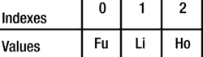

# 七、集合

在本章中，您将学习:

*   纳申中的数组是什么
*   如何使用数组文字和`Array`对象在 Nashorn 中创建数组
*   如何使用`Array`对象的不同方法
*   如何使用类似数组的对象
*   如何在 Nashorn 中创建和使用类型化数组
*   如何在 Nashorn 中使用 Java 集合
*   如何在 Nashorn 中创建 Java 数组
*   如何将 Java 数组转换成 Nashorn 数组，反之亦然

## 纳森的数组是什么？

Nashorn 中的数组是一个专门的对象，称为`Array`对象，用于表示值的有序集合。一个`Array`对象以一种特殊的方式对待某些属性名。如果一个属性名可以转换成一个介于 0 和 2 <sup>32</sup> -2(包括 0 和 2)之间的整数，这样的属性名称为数组索引，属性称为元素。换句话说，数组中的元素是一个特殊的属性，它的名称是数组索引。除了向数组中添加元素之外，还可以像对 Nashorn 对象一样添加任何其他属性。注意，在一个`Array`对象中，每个数组索引都是一个属性，但是每个属性并不是一个数组索引。例如，您可以将两个名为“0”和“name”的属性添加到数组中，其中“0”是数组索引，因为它可以转换为整数，而“name”只是一个属性。

每个`Array`对象都有一个名为`length`的属性，其值大于所有元素的索引。添加元素时，`length`会自动调整。如果`length`改变，索引大于或等于新`length`的元素被删除。注意，与 Java 数组不同，Nashorn 数组是可变长度数组。也就是说，Nashorn 数组不是定长数组；当添加和删除元素或者`length`属性改变时，它们可以扩展和收缩。

有两种类型的数组:密集数组和稀疏数组。在密集数组中，所有元素的索引都是连续的。Java 数组总是密集数组。在稀疏数组中，所有元素的索引可能不连续。Nashorn 阵列是稀疏阵列。例如，在 Nashorn 中可以有一个数组，该数组在索引 1000 处有一个元素，而在索引 0 到 999 之间没有任何元素。

与 Java 不同，Nashorn 中的数组没有类型。数组中的元素可以是混合类型，一个元素可以是数字，另一个是字符串，另一个是对象，等等。Nashorn 也支持类型化数组，但是它们的工作方式与 Java 数组完全不同。我将在本章的类型化数组部分讨论类型化数组。

## 创建数组

在 Nashorn 中创建数组有两种方法:

*   使用数组文本
*   使用`Array`对象

### 使用数组文本

数组文字是表示一个`Array`对象的表达式。数组文字也称为数组初始值设定项。它是用括号括起来的逗号分隔的表达式列表；列表中的每个表达式代表数组中的一个元素。以下是使用数组文字的示例:

```java
// An array with no elements, also called an empty array

var emptyArray = [];

// An array with two elements

var names = ["Ken", "Li"];

// An array with four element. Elements are of mixed types.

var misc = [1001, "Ken", 1003, new Object()];

// Print the array length and its elements

print("Array's length: " + emptyArray.length + ", elements: " + emptyArray);

print("Array's length: " + names.length + ", elements: " + names);

print("Array's length: " + misc.length + ", elements: " + misc);

Array's length: 0, elements:

Array's length: 2, elements: Ken,Li

Array's length: 4, elements: 1001,Ken,1003,[object Object]
```

每个`Array`对象都包含一个`toString()`方法，该方法以字符串形式返回逗号分隔的数组元素列表。在添加到列表之前，每个元素都被转换为一个字符串。示例中调用了所有数组的`toString()`方法来打印它们的内容。

忽略数组文本中的尾随逗号。以下两个数组被认为是相同的。两者都有三个要素:

```java
var empIds1 = [10, 20, 30];  // Without a trailing comma. empIds1.length is 3

var empIds2 = [10, 20, 30,]; // Same as [10, 20, 30]. empIds2.length is 3
```

数组文本中的元素是数组对象的索引属性。对于密集数组，第一个元素的索引为 0，第二个元素的索引为 1，第三个元素的索引为 3，依此类推。我将很快讨论稀疏数组的索引方案。考虑以下具有三个元素的密集阵列。图 [7-1](#Fig1) 显示了数组中元素的值及其索引。

```java
var names = ["Fu", "Li", "Ho"]
```



图 7-1。

Array elements and their indexes in a three-element dense array

可以像访问对象属性一样访问数组元素。唯一的区别是元素的属性名是一个整数。比如在`names`数组中，`names[0]`是指第一个元素`"Fu"`，`names[1]`是指第二个元素`"Li"`，`names[2]`是指第三个元素`"Ho"`。下面的代码创建一个密集数组，并使用一个`for`循环来访问和打印数组的所有元素:

```java
// Create an array with three elements

var names = ["Fu", "Li", "Ho"]

// Print all array elements

for(var i = 0, len = names.length; i < len; i++) {

print("names[" + i + "] = " + names[i]);

}

names[0] = Fu

names[1] = Li

names[2] = Ho
```

向数组中添加元素等同于在不存在的索引处赋值。下面的代码创建一个包含三个元素的数组，并添加第四个和第五个元素。最后，代码打印数组中的所有元素:

```java
// Create an array with three elements

var names = ["Fu", "Li", "Ho"]

// Add fourth element

names[3] = "Su"; // Adds an element at index 3

// Add fifth element

names[4] = "Bo"; // Adds an element at index 4

// Print all array elements

for(var i = 0, len = names.length; i < len; i++) {

print("names[" + i + "] = " + names[i]);

}

names[0] = Fu

names[1] = Li

names[2] = Ho

names[3] = Su

names[4] = Bo
```

回想一下，数组是一个对象，因此您可以像向任何其他对象添加属性一样向数组添加属性。如果属性名不是索引，那么该属性将只是一个属性，而不是一个元素。非元素属性对数组的`length`没有贡献。下面的代码创建一个数组，添加一个元素和一个非元素属性，并打印详细信息:

```java
// Create an array with three elements

var names = ["Fu", "Li", "Ho"]

// Add fourth element

names[3] = "Su"; // Adds an element at index 3

// Add a non-element property to the array. The property name is

// "nationality" that is not an index, so it does not define an element.

// Rather, it is a simply property.

names["nationality"] = "Chinese";

print("names.length = " + names.length);

// Print all array elements using a for loop

print("Using a for loop:");

for(var i = 0, len = names.length; i < len; i++) {

print("names[" + i + "] = " + names[i]);

}

// Print all properties of the array using a for..in loop

print("Using a for..in loop:");

for(var prop in names) {

print("names[" + prop + "] = " + names[prop]);

}

names.length = 4

Using a for loop:

names[0] = Fu

names[1] = Li

names[2] = Ho

names[3] = Su

Using a for..in loop:

names[0] = Fu

names[1] = Li

names[2] = Ho

names[3] = Su

names[nationality] = Chinese
```

关于这个例子，有几点需要注意:

*   它创建了一个包含三个元素的数组，索引分别为 0、1 和 2。此时，数组的`length`为 3。
*   它在索引 3 处添加了值为“Su”的元素。通过添加这个元素，数组的`length`自动增加到 4。
*   它添加了一个名为“国籍”的属性这个属性只是一个属性，而不是一个元素，因为它的名称是一个不能转换为索引的字符串。添加该属性不会影响数组的`length`。也就是说，`length`停留在 4。
*   当它使用 for 循环打印数组时，名为`"nationality"`的属性不会被打印，因为代码循环遍历索引，而不是所有属性。
*   当它使用`for..in`循环时，所有元素和“nationality”属性都被打印出来，因为`for..in`循环遍历对象的所有属性。这证明了一个数组的所有元素都是属性，但所有属性都不是元素。

请注意，如果属性名可以转换为 0 到 2 <sup>32</sup> -2(含)之间的整数，则该属性名被视为索引。检查属性名是否是索引的真正测试是应用以下条件。假设属性名为`prop`，是一个字符串。如果下面的表达式返回`true`，则属性名是一个索引；否则，它只是一个属性名:

```java
ToString(ToUint32(prop)) = prop
```

这里，假设`ToUint32()`是将属性名转换成无符号 32 位整数的函数，而`ToString()`是将整数转换成字符串的函数。换句话说，如果将字符串属性名转换为无符号 32 位整数，然后再转换回字符串，从而得到原始的属性名，那么这样的属性名就是索引。如果属性名只是有效范围内的一个数字，如果不包含小数部分，则它是一个索引。下面的代码演示了这条规则:

```java
// Create an array with two elements

var names = ["Fu", "Li"]

// Adds an element at the index 2

names[2.0] = "Su";

// Adds a property named "2.0", not an element at index 2

names["2.0"] = "Bo";

// Adds an element at index 3

names["3"] = "Do";

print("names.length = " + names.length);

// Print all properties of the array using a for..in loop

print("Using a for..in loop:");

for(var prop in names) {

print("names[" + prop + "] = " + names[prop]);

}

names.length = 4

Using a for..in loop:

names[0] = Fu

names[1] = Li

names[2] = Su

names[3] = Do

names[2.0] = Bo
```

可以将负数属性添加到数组中。注意，作为属性名的负数不符合索引的条件，所以它只是添加一个属性，而不是元素:

```java
// Create an array with two elements

var names = ["Fu", "Li"]

// Adds property with the name "-1", not an element.

names[-1] = "Do"; // names.length is still 2

print("names.length = " + names.length);

names.length = 2
```

还可以使用数组文本创建稀疏数组。使用逗号而不指定元素列表中的元素会创建一个稀疏数组。请注意，在稀疏数组中，元素的索引是不连续的。下面的代码创建一个稀疏数组:

```java
var names = ["Fu",,"Lo"];
```

`names`数组包含两个元素。它们位于索引 0 和 2 处。索引 1 处的元素丢失，这由两个连续的逗号表示。`names`阵的`length`是什么？是 3，不是 2。回想一下，数组的`length`总是大于所有元素的最大索引。数组中的最大索引是 2，所以`length`是 3。当你尝试阅读`names[1]`这个不存在的元素时会发生什么？读取`names[1]`被简单地视为从`names`对象中读取名为“1”的属性，而名为“1”的属性并不存在。回想一下`Chapter 4`，读取一个不存在的对象属性会返回`undefined`。因此，`names[1]`将简单地返回`undefined`，而不会导致任何错误。如果您给`names[1]`赋值，那么您将在索引 1 处创建一个新元素，并且该数组将不再是一个稀疏数组。以下代码显示了这条规则:

```java
// Create a sparse array with 2 existing and 1 missing elements

var names = ["Fu",,"Lo"]; // names.length is 3

print("names.length = " + names.length);

for(var prop in names) {

print("names[" + prop + "] = " + names[prop]);

}

// Add an element at index 1.

names[1] = "Do";  // names.length is still 3

print("names.length = " + names.length);

for(var prop in names) {

print("names[" + prop + "] = " + names[prop]);

}

names.length = 3

names[0] = Fu

names[2] = Lo

names.length = 3

names[0] = Fu

names[1] = Do

names[2] = Lo
```

以下是稀疏数组的更多示例。注释解释了数组:

```java
var names = [,];   // A sparse array. length = 1 and no elements

names = [,,];      // A sparse array. length = 2 and no elements

names = [,,,];     // A sparse array. length = 3 and no elements

names = [,,,7,,2]; // A sparse array. length = 6 and 2 elements
```

你能说出下面两个数组的区别吗？

```java
var names1 = [,,];

var names2 = [undefined,undefined];
```

两个数组都有`length` 2。名为`names1`的数组是一个稀疏数组。`names1`中索引 0 和 1 处的元素不存在。读数`names1[0]`和`names1[1]`将返回`undefined`。名为`names2`的数组是一个密集数组。`names2`中索引 0 和 1 处的元素存在，并且都被设置为`undefined`。读数`names2[0]`和`names2[1]`将返回`undefined`。

如何知道一个数组是否稀疏？在`Array`对象中没有检查稀疏数组的内置方法。你需要自己检查它，记住如果一个属性名是一个索引(从 0 到 T1)在数组中不存在，那么它就是一个稀疏数组。在遍历数组元素一节中，我将讨论几种检查稀疏数组的方法。

### 使用数组对象

Nashorn 包含一个名为`Array`的内置函数对象。它用于创建和初始化数组。它可以作为函数或构造函数调用。它作为函数或构造函数使用的方式是一样的。它的签名是:

```java
Array(arg1, arg2, arg3,...)
```

`Array`对象可以接受零个或多个参数。它的初始化行为取决于传递的参数的数量和类型，这些参数可以分为三类:

*   不传递任何参数
*   一个参数被传递
*   传递了两个或多个参数

### 不传递任何参数

当没有参数传递给`Array`构造函数时，它创建一个空数组，将数组的`length`设置为零:

```java
var names1 = new Array(); // Same as: var names = [];
```

### 传递一个参数

当一个参数传递给`Array`构造函数时，参数的类型决定了新数组的创建方式:

*   如果参数是一个数字，并且是 0 到 2 <sup>32</sup> -1(含)范围内的整数，则该参数被视为数组的`length`。否则，抛出一个`RangeError`异常。
*   如果参数不是数字，则创建一个数组，将传递的参数作为该数组的唯一元素。数组的`length`被设置为 1。

以下代码在 Nashorn 中创建了最大可能的数组:

```java
var names = new Array(Math.pow(2, 32) -1); // The biggest possible array

print("names.length = " + names.length);

names.length = 4294967295
```

以下语句创建一个数组，其中`length`为 10。数组中还不存在任何元素:

```java
var names = new Array(10);
```

以下数组创建表达式抛出了一个`RangeError`异常，因为参数是一个数字，并且它不是有效范围内的整数或者超出了范围:

```java
var names1 = new Array(34.89);           // Not an integer

var names1 = new Array(Math.pow(2, 32)); // Out of range

var namess = new Array(-10);             // Out of range
```

以下代码将一个非数字参数传递给`Array`构造函数，该构造函数使用传递的参数作为唯一元素创建一个数组，并将数组的`length`设置为 1:

```java
var names1 = new Array("Fu"); // Creates an array with one element "Fu"

var names2 = new Array(true); // Creates an array with one element true
```

### 传递两个或多个参数

当两个或更多参数被传递给`Array`构造函数时，它用指定的参数创建一个密集数组。`length`被设置为传递的参数数量。以下语句创建一个带有三个传递参数的数组，并将`length`设置为 3:

```java
var names = new Array("Fu", "Li". "Do");
```

不能使用`Array`构造函数创建稀疏数组。在`Array`构造函数中使用连续逗号或尾随逗号会抛出一个`SyntaxError`异常:

```java
var names1 = new Array("Fu", "Li",, "Do");  // A SyntaxError

var names2 = new Array("Fu", "Li", "Do", ); // A SyntaxError
```

您可以通过在不连续的索引处添加元素或删除现有元素来创建稀疏数组，从而使索引变得不连续。我将在下一节讨论删除数组的元素。下面的代码创建一个密集数组，并添加一个不连续的元素使其成为一个稀疏数组:

```java
// Creates a dense array with elements at indexes 0 and 1.

var names = new Array("Fu", "Li");  // names.length is set to 2

print("After creating the array: names.length = " + names.length);

// Add an element at index 4, skipping index 2 and 3.

names[4] = "Do"; // names.length is set to 5, making names a sparse array

print("After adding an element at index 4: names.length = " + names.length);

for(var prop in names) {

print("names[" + prop + "] = " + names[prop]);

}

After creating the array: names.length = 2

After adding an element at index 4: names.length = 5

names[0] = Fu

names[1] = Li

names[4] = Do
```

## 删除数组元素

删除数组元素或数组的非元素属性与删除对象的属性相同。使用`delete`操作符删除一个数组元素。如果从密集数组的中间或开头删除一个元素，数组将变得稀疏。下面的代码显示了如何从数组中删除元素:

```java
// Creates a dense array with elements at indexes 0, 1, and 2.

var names = new Array("Fu", "Li", "Do");

print("Before deleting:");

print("names.length = " + names.length + ", Elements = " + names);

// Delete the element at index 1

delete names[1]; // names.length remains 3

print("AFter deleting:");

print("names.length = " + names.length + ", Elements = " + names);

Before deleting:

names.length = 3, Elements = Fu,Li,Do

AFter deleting:

names.length = 3, Elements = Fu,,Do
```

您可以将数组的元素设置为不可配置和不可写，这样它们就不能被删除和修改。删除不可配置的元素没有任何效果。在严格模式下，删除不可配置的元素会产生错误。下面的代码演示了这一点:

```java
var names = new Array("Fu", "Li", "Do");

// Make the element at index 1 non-configurable

Object.defineProperty(names, "1", {configurable: false});

print("Before deleting:");

print("names.length = " + names.length + ", Elements = " + names);

delete names[1]; // Will not delete "Li" as it is non-configurable.

print("AFter deleting:");

print("names.length = " + names.length + ", Elements = " + names);

Before deleting:

names.length = 3, Elements = Fu,Li,Do

AFter deleting:

names.length = 3, Elements = Fu,Li,Do
```

## 数组长度

每个`Array`对象都有一个名为`length`的属性，当在数组中添加和删除元素时会自动维护该属性。`length`属性使数组不同于其他类型的对象。对于密集数组，`length`比数组中最大的索引大 1。对于稀疏数组，它保证大于所有元素(现有的和缺失的)的最大索引。

数组的`length`属性是可写的。也就是说，您也可以在代码中更改它。如果您将`length`设置为大于当前值的值，`length`将被更改为新值，从而在末尾创建一个稀疏数组。如果将`length`设置为一个小于其当前值的值，从末尾开始的所有元素都将被删除，直到找到一个大于或等于新的`length`值的不可删除元素。也就是说，将`length`设置为较小的值会使数组收缩为不可删除的元素。下面的例子将阐明这一规则:

```java
var names = new Array("Fu", "Li", "Do", "Ho");

print("names.length = " + names.length + ", Elements = " + names);

print("Setting length to 10...");

names.length = 10;

print("names.length = " + names.length + ", Elements = " + names);

print("Setting length to 0...");

names.length = 0;

print("names.length = " + names.length + ", Elements = " + names);

print("Recreating the array...");

names = new Array("Fu", "Li", "Do", "Ho");

print("names.length = " + names.length + ", Elements = " + names);

print('Making "Do" non-configurable...');

// Makes "Do" non-configurable (non-deletable)

Object.defineProperty(names, "2", {configurable:false});

print("Setting length to 0...");

names.length = 0; // Will delete only "Ho" as "Do" is non-deletable

print("names.length = " + names.length + ", Elements = " + names);

names.length = 4, Elements = Fu,Li,Do,Ho

Setting length to 10...

names.length = 10, Elements = Fu,Li,Do,Ho,,,,,,

Setting length to 0...

names.length = 0, Elements =

Recreating the array...

names.length = 4, Elements = Fu,Li,Do,Ho

Making "Do" non-configurable...

Setting length to 0...

names.length = 3, Elements = Fu,Li,Do
```

`Array`对象的`length`属性是可写的、不可数的和不可配置的。如果不希望有人在代码中更改它，可以将其设置为不可写。在数组中添加和删除元素时，不可写的`length`属性仍然会自动改变。以下代码显示了这条规则:

```java
var names = new Array("Fu", "Li", "Do", "Ho");

// Make the length property non-writable.

Object.defineProperty(names, "length", {writable:false});

// The length property cannot be changed directly anymore

names.length = 0; // No effects

// Add a new element

names[4] = "Nu"; // names.length changes from 4 to 5
```

## 迭代数组元素

如果您对迭代数组的所有属性(包括元素)感兴趣，可以简单地使用`for..in`和`for..each..in`语句。这些语句不应该以任何特定的顺序迭代数组。正如这一节的标题所暗示的，我将讨论如何只迭代数组的元素，尤其是当数组是稀疏的时候。如果您只向数组中添加元素(而不是任何非元素属性)，这是您在大多数情况下都会做的，那么使用`for..in`和`for..each..in`语句对于密集和稀疏都很好。

### 使用 for 循环

如果您知道数组是密集的，您可以使用简单的`for`循环来迭代数组，如下所示:

```java
// Create a dense array

var names = new Array("Fu", "Li", "Do");

// Use a for loop to iterate all elements of an array

for(var i = 0, len = names.length; i < len; i++) {

print("names[" + i + "]=" + names[i]);

}

names[0]=Fu

names[1]=Li

names[2]=Do
```

如果你有一个稀疏的数组，`for`循环不起作用。如果您尝试访问稀疏数组中缺少的元素，它将返回`undefined`，但不会告诉您是缺少元素还是现有元素的值是`undefined`。您可以通过使用`in`操作符来检查被迭代的索引是否存在，从而摆脱这个限制。如果索引存在，则元素存在；如果索引不存在，则它是稀疏数组中缺少的元素。下面的代码演示了这种方法:

```java
// Create a sparse array with an element set to undefined

var names = ["Fu", "Li", , "Do", undefined, , "Lu"];

// Use a for lop to iterate all elements of an array

for (var i = 0, len = names.length; i < len; i++) {

// Check if the index being visited exists in the array

if (i in names) {

print("names[" + i + "]=" + names[i]);

}

}

names[0]=Fu

names[1]=Li

names[3]=Do

names[4]=undefined

names[6]=Lu
```

考虑下面的代码。它创建一个只有一个元素的稀疏数组。该数组是 Nashorn 中可能的最大数组，元素被添加到数组的最后一个索引处。实际上，你永远也不会有这个大数组。我使用它只是为了证明使用`for`循环并不是访问稀疏数组中所有元素的最有效方式:

```java
// Create an empty array

var names = new Array();

// Add one element to the end of the biggest possible  array

names[4294967294] = "almost lost";

// Use a for loop to iterate all elements of an array

for (var i = 0, len = names.length; i < len; i++) {

// Check if the index being visited exists in the array

if (i in names) {

print("names[" + i + "]=" + names[i]);

}

}
```

在这个例子中使用`for`循环是非常低效的，因为它必须访问 4294967293 个索引，才能到达最后一个有值的索引。只访问数组中的一个元素花费的时间太长。我将很快使用`for..in`循环解决这个运行缓慢的`for`循环问题。

### 使用 forEach()方法

`Array.prototype`对象包含一个名为`forEach()`的方法，该方法按照升序为数组中的每个元素调用回调函数。它只访问稀疏数组中的现有元素。它的签名是:

```java
forEach (callbackFunc [, thisArg])
```

这里，`callbackFunc`是按升序对数组中的每个元素调用一次的函数。传递给它三个参数:元素的值、元素的索引和被迭代的对象。`thisArg`是可选的；如果指定了它，它将被用作每次调用`callbackFunc`的`this`值。

`forEach()`方法在开始执行之前设置它将访问的索引范围。如果在执行过程中添加了超出该范围的元素，则不会访问这些元素。如果初始设置范围内的元素被删除，这些元素也不会被访问:

```java
// Create a sparse array with an element set to undefined

var names = ["Fu", "Li", , "Do", undefined, , "Lu"];

// Define the callback function

var visitor = function (value, index, array) {

print("names[" + index + "]=" + value);

};

// Print all elements

names.forEach(visitor);

names[0]=Fu

names[1]=Li

names[3]=Do

names[4]=undefined

names[6]=Lu
```

如果您使用`forEach()`方法访问一个大的稀疏数组，您将会遇到与使用我在上一节中讨论的`for`循环相同的问题。

### 使用 for-in 循环

让我们使用`for..in`循环来解决访问长稀疏数组中元素的低效问题。使用`for..in`循环带来了另一个问题，它遍历数组的所有属性，而不仅仅是元素。但是，它不会迭代丢失的元素。您需要一种方法来区分简单属性和现有元素。只需使用数组索引的定义就可以做到这一点。数组索引是一个介于 0 和 2 <sup>32</sup> -2 之间的整数。如果属性是数组索引，则它是一个元素；否则，它只是一个属性，而不是一个元素。清单 7-1 包含一个名为`isValidArrayIndex()`的函数的代码。该函数将属性名作为参数。如果属性名是有效的数组索引，则返回`true`；否则，它返回`false`。

清单 7-1。isValidArrayIndex()函数的代码

```java
// arrayutil.js

var UPPER_ARRAY_INDEX = Math.pow(2, 32) - 2;

Object.defineProperty(this, "UPPER_ARRAY_INDEX", {writable: false});

function isValidArrayIndex(prop) {

// Convert the prop to a Number

var numericProp = Number(prop);

// Check if prop is a number

if (String(numericProp) === prop) {

// Check if is an integer

if (Math.floor(numericProp) === numericProp) {

// Check if it is in the valid array index range

if (numericProp >= 0 &&                             numericProp <= UPPER_ARRAY_INDEX) {

return true;

}

}

}

return false;

}
```

下面的代码使用`for..in`循环只迭代稀疏数组的元素。它利用`isValidArrayIndex()`函数来确定一个属性是否是有效的数组索引。请注意，代码在数组中最大可能的索引处添加了一个元素。`for..in`循环非常快速地到达数组的所有元素。

```java
// load the script that contains isValidArrayIndex() function

load("arrayutil.js");

// Create a sparse array with an element set to undefined

var names = ["Fu", "Li", , "Do", undefined, , "Lu"];

// Add some properties to the array

names["nationality"] = "Chinese";  // A property

names[4294967294] = "almost lost"; // An element at the largest

// possible array index

names[3.2] = "3.2";   // A property

names[7.00] = "7.00"; // An element

// Print all elements, ignoring the non-element properties

for(var prop in names) {

if (isValidArrayIndex(prop)) {

// It is an element

print("names[" + prop + "]=" + names[prop]);

}

}

names[0]=Fu

names[1]=Li

names[3]=Do

names[4]=undefined

names[6]=Lu

names[7]=7.00

names[4294967294]=almost lost
```

## 检查数组

`Array`对象包含一个`isArray()`静态方法，可以用来检查一个对象是否是一个数组。下面的代码演示了它的用法:

```java
var obj1 = [10, 20];     // An array

var obj2 = {x:10, y:20}; // An object, but not an array

print("Array.isArray(obj1) =",  Array.isArray(obj1));

print("Array.isArray(obj2) =",  Array.isArray(obj2));

Array.isArray(obj1) = true

Array.isArray(obj2) = false
```

## 多维数组

Nashorn 有任何特殊的构造来支持多维数组。您需要使用数组的数组(曲折数组)来创建多维数组，其中数组的元素可以是数组。通常，您需要嵌套的`for`循环来填充和访问多维数组的元素。下面的代码演示了如何创建、填充和打印 3x3 矩阵的元素。代码使用`Array`对象的`join()`方法，使用制表符作为分隔符来连接数组的元素:

```java
var ROWS = 3;

var COLS = 3;

// Create a 3x3 array, so you pre-allocate the memory

var matrix = new Array(ROWS);

for(var i = 0; i < ROWS; i++) {

matrix[i] = new Array(COLS);

}

// Populate the array

for(var i = 0; i < ROWS; i++) {

for(var j = 0; j < COLS; j++) {

matrix[i][j] = i + "" + j;

}

}

// Print the array elements

for(var i = 0; i < ROWS; i++) {

var rowData = matrix[i].join("\t");

print(rowData);

}

00        01        02

10        11        12

20        21        22
```

## 数组对象的方法

`Array.prototype`对象定义了几个方法，作为所有`Array`对象的实例方法。在这一节中，我将讨论这些方法。所有数组方法都是有意泛型的，因此它们不仅可以应用于数组，还可以应用于任何类似数组的对象。

### 串联元素

`concat(arg1, arg2,...)`方法创建并返回一个新数组，该数组包含调用该方法的数组对象的元素，后跟指定的参数。如果一个参数是一个数组，数组的元素被连接起来。如果参数是嵌套数组，它将被展平一级。此方法不会修改原始数组和作为参数传递的数组。如果原始数组或参数包含对象，则创建对象的浅表副本。使用`concat()`方法的例子如下:

```java
var names = ["Fu", "Li"];

// Assigns ["Fu", "Li", "Do", "Su"] to names2

var names2 = names.concat("Do", "Su");

// Assigns ["Fu", "Li", "Do", "Su", ["Lu", "Zu"], "Yu"] to names3

var names3 = names.concat("Do", ["Su", ["Lu","Zu"]], "Yu");
```

### 连接数组元素

`join(separator)`方法将数组的所有元素转换成字符串，使用`separator`将它们连接起来，并返回结果字符串。如果未指定`separator`，则使用逗号作为分隔符。该方法作用于数组的所有元素，从索引 0 到等于`length - 1`的索引。如果元素是`undefined`或`null`，则使用空字符串。以下是使用`join()`方法的一些例子:

```java
var names = ["Fu", "Li", "Su"];

var namesList1 = names.join();    // Assigns "Fu,Li,Su" to namesList1

var namesList2 = names.join("-"); // Assigns "Fu-Li-Su" to namesList2

var ids = [10, 20, , 30, undefined, 40, null]; // A sparse array

var idsList1 = ids.join();    // Assigns "10,20,,30,,40," to idsList1

var idsList2 = ids.join("-"); // Assigns "10-20--30--40-" to idsList2
```

### 反转数组元素

方法以相反的顺序重新排列数组的元素并返回数组。使用这种方法的例子如下:

```java
var names = ["Fu", "Li", "Su"];

names.reverse(); // Now, the names array contains ["Su","Li","Fu"]

// Assigns "Fu,Li,Su" to reversedList

var reversedList = names.reverse().join();
```

### 分割数组

`slice(start, end)`方法从`start`和`end`之间的索引返回一个数组，该数组包含原始数组的子数组。如果`start`和`end`为负，则分别作为`start + length`和`end + length`处理，其中`length`是数组的长度。`start`和`end`都被限制在 0 和`length`之间(包括 0 和 T10)。如果未指定`end`，则假定为`length`。如果`start`和`end`(互斥)包含一个稀疏范围，那么得到的子数组将是稀疏的。以下是使用`slice()`方法的例子:

```java
var names = ["Fu", "Li", "Su"];

// Assigns ["Li","Su"] to subNames1\. end = 5 will be replaced with end = 3.

var subNames1 = names.slice(1, 5);

// Assigns ["Li","Su"] to subNames2\. start = -1 is used as start = 1 (-2 + 3).

var subNames12 = names.slice(-2, 3);

var ids = [10, 20,,,30, 40, 40]; // A sparse array

// Assigns [20,,,30,40] to idsSubList whose length = 5

var idsSubList = ids.slice(1, 6);
```

### 拼接数组

根据传递的参数，`splice()`方法可以执行插入和/或删除。它的签名是:

```java
splice (start, deleteCount, value1, value2,...)
```

该方法删除从索引`start`开始的`deleteCount`元素，并插入指定的参数(`value1`、`value2`等)。)在索引`start`。它返回一个数组，其中包含从原始数组中删除的元素。在删除和/或插入之后，现有元素的索引被调整，因此它们是连续的。如果`deleteCount`为 0，则插入指定值而不删除任何元素。以下是使用该方法的示例:

```java
var ids = [10, 20, 30, 40, 50];

// Replace 10 and 20 in the array with 100 and 200

var deletedIds  = ids.splice(1, 2, 100, 200);

print("ids = " + ids);

print("deletedIds = " + deletedIds);

// Keep the first 3 elements and delete the rest

var deletedIds2  = ids.splice(3, 2);

print("ids = " + ids);

print("deletedIds2 = " + deletedIds2);

ids = 10,100,200,40,50

deletedIds = 20,30

ids = 10,100,200

deletedIds2 = 40,50
```

### 对数组排序

`sort(compareFunc)`方法就地对数组进行排序，并返回排序后的数组。`compareFunc`参数是一个有两个参数的函数，是可选的。如果未指定，则数组按字母顺序排序，如果需要，在比较期间将元素转换为字符串。未定义的元素被排序到末尾。

如果指定了`compareFunc`，它将被传递两个元素，它的返回值将决定这两个元素的顺序。假设它被传递了 x 和 y，如果 x < y 返回负值，如果`x = y`返回零，如果`x > y`返回正值。下面的代码通过不指定`compareFunc`对一个整数数组进行升序排序。随后，它通过指定一个`compareFunc`对同一个数组进行降序排序:

```java
var ids = [30, 10, 40, 20];

print("ids = " + ids);

// Sort the array

ids.sort();

print("Sorted ids = " + ids);

// A comparison function to sort ids in descending order

var compareDescending = function (x, y) {

if (x > y) {

return -1;

}

else if (x < y) {

return 1;

}

else {

return 0;

}

};

ids.sort(compareDescending);

print("Sorted in descending order, ids = " + ids);

ids = 30,10,40,20

Sorted ids = 10,20,30,40

Sorted in descending order, ids = 40,30,20,10
```

### 在端点添加和移除元素

以下四种方法允许您在数组的开头和结尾添加和移除元素:

*   `unshift(value1, value2,...)`:`unshift()`方法将参数添加到数组的前面，因此它们出现在数组开头的顺序与它们作为参数出现的顺序相同。它返回数组的新的`length`。调整现有元素的索引以为新元素腾出空间。
*   `shift()`:`shift()`方法移除并返回数组的第一个元素，将所有其他元素左移一个位置。
*   `push(value1, value2,...)`:`push()`方法与`unshift()`方法的工作原理相同，除了它在数组的末尾添加元素。
*   `pop()`:`pop()`方法与`shift()`方法工作方式相同，除了它移除并返回数组的最后一个元素

以下是使用这些方法的示例:

```java
var ids = [10, 20, 30];

print("ids: " + ids);

ids.unshift(100, 200, 300);

print("After ids.unshift(100, 200, 300): " + ids);

ids.shift();

print("After ids.shift(): " + ids);

ids.push(1, 2, 3);

print("After ids.push(1, 2, 3): " + ids);

ids.pop();

print("After ids.pop(): " + ids);

ids: 10,20,30

After ids.unshift(100, 200, 300): 100,200,300,10,20,30

After ids.shift(): 200,300,10,20,30

After ids.push(1, 2, 3): 200,300,10,20,30,1,2,3

After ids.pop(): 200,300,10,20,30,1,2
```

使用这些方法，您可以实现堆栈、队列和双端队列。让我们使用`push()`和`pop()`方法实现一个堆栈。清单 7-2 包含了`Stack`对象的代码。它将堆栈的数据保存在私有的`Array`对象中。它提供了`isEmpty()`、`push()`、`pop()`和`peek()`方法来执行堆栈操作。它覆盖了`Object.prototype`的`toString()`方法，以字符串形式返回堆栈中的当前元素。清单 7-3 包含了测试`Stack`对象的代码。

清单 7-2。堆栈对象声明

```java
// stack.js

// Define the constructor for the Stack object

function Stack(/*varargs*/) {

// Define a private array to keep the stack elements

var data = new Array();

// If any arguments were passed to the constructor, add them to the stack

for (var i in arguments) {

data.push(arguments[i]);

}

// Define methods

this.isEmpty = function () {

return (data.length === 0);

};

this.pop = function () {

if (this.isEmpty()) {

throw new Error("Stack is empty.");

}

return data.pop();

};

this.push = function (arg) {

data.push(arg);

return arg;

};

this.peek = function () {

if (this.isEmpty()) {

throw new Error("Stack is empty.");

}

else {

return data[data.length - 1];

}

};

this.toString = function () {

return data.toString();

};

}
```

清单 7-3。测试堆栈对象

```java
// stacktest.js

load("stack.js");

// Create a Stack with initial 2 elements

var stack = new Stack(10, 20);

print("Stack = " + stack);

// Push an element

stack.push(40);

print("After push(40), Stack = " + stack);

// Pop two elements

stack.pop();

stack.pop();

print("After 2 pops, Stack = " + stack);

print("stack.peek() = " + stack.peek());

print("stack.isEmpty() = " + stack.isEmpty());

// Pop the last element

stack.pop();

print("After another pop(), stack.isEmpty() = " + stack.isEmpty());

Stack = 10,20

After push(40), Stack = 10,20,40

After 2 pops, Stack = 10

stack.peek() = 10

stack.isEmpty() = false

After another pop(), stack.isEmpty() = true
```

### 搜索数组

有两种方法，`indexOf()`和`lastIndexOf()`，可以让您在数组中搜索指定的元素。他们的签名是:

*   `indexOf(searchElement, fromIndex)`
*   `lastIndexOf(searchElement, fromIndex)`

`indexOf()`方法从`fromIndex`开始在数组中搜索指定的`searchElement`。如果没有指定`fromIndex`，则假定为 0，这意味着搜索整个数组。该方法使用`===`运算符返回数组中等于`searchElement`的第一个元素的索引。如果没有找到`searchElement`，则返回-1。

`lastIndexOf()`方法的工作方式与`indexOf()`方法相同，除了它从末尾到开头执行搜索。也就是说，它返回数组中最后找到的元素的索引，该索引等于`searchElement`。下面的代码显示了如何使用这些方法:

```java
var ids = [10, 20, 30, 20];

print("ids = " + ids);

print("ids.indexOf(20) = " + ids.indexOf(20));

print("ids.indexOf(20, 2) = " + ids.indexOf(20, 2));

print("ids.lastIndexOf(20) = " + ids.lastIndexOf(20));

print("ids.indexOf(25) = " + ids.lastIndexOf(25));

ids = 10,20,30,20

ids.indexOf(20) = 1

ids.indexOf(20, 2) = 3

ids.lastIndexOf(20) = 3

ids.indexOf(25) = -1
```

### 评估谓词

您可以检查一个数组中的所有或部分元素的谓词是否计算为`true`。以下两种方法允许您执行此操作:

*   `every(predicate, thisArg)`
*   `some(predicate, thisArg)`

第一个参数`predicate`是一个函数，对数组中的每个现有元素调用一次。向该函数传递三个参数:元素的值、元素的索引和数组对象。如果指定了第二个参数`thisArg`，它将被用作由`predicate`指定的函数调用的`this`值。

如果指定的`predicate`函数为数组中的每个现有元素返回真值，则`every()`方法返回`true`。否则返回`false`。一旦`predicate`返回一个元素的 falsy 值，该方法就返回`false`。

如果`predicate`返回至少一个元素的真值，则`some()`方法返回`true`。否则返回`false`。一旦`predicate`返回一个元素的真值，该方法就返回`true`。以下示例显示如何检查数字数组是否包含任何/所有偶数/奇数:

```java
var ids = [10, 20, 30, 20];

print("ids = " + ids);

var hasAnyEven = ids.some(function (value, index, array) {

return value %2 === 0;

});

var hasAllEven = ids.every(function (value, index, array) {

return value %2 === 0;

});

var hasAnyOdd = ids.some(function (value, index, array) {

return value %2 === 1;

});

var hasAllOdd = ids.every(function (value, index, array) {

return value %2 === 1;

});

print("ids has any even numbers: " + hasAnyEven);

print("ids has all even numbers: " + hasAllEven);

print("ids has any odd numbers: " + hasAnyOdd);

print("ids has all odd numbers: " + hasAllOdd);

ids = 10,20,30,20

ids has any even numbers: true

ids has all even numbers: true

ids has any odd  numbers: false

ids has all odd  numbers: false
```

## 将数组转换为字符串

你可以用任何方式将数组转换成字符串。然而，`toString()`和`toLocaleString()`方法提供了两个内置的实现来将数组元素转换成字符串。`toString()`方法返回一个字符串，该字符串是在没有指定任何分隔符的情况下通过调用数组上的`join()`方法返回的。也就是说，它以字符串形式返回元素列表，其中元素用逗号分隔。`toLocaleString()`方法调用所有数组元素的`toLocaleString()`方法，使用特定于本地的分隔符连接返回的字符串，并返回最终的字符串。每当您将数组对象用作`print()`方法的参数或将其与字符串连接操作符一起使用时，您就一直在使用`Array`对象的`toString()`方法。

## 数组的流状处理

Java 8 引入了 Streams API，允许您使用 map-filter-reduce 等几种模式将 Java 集合作为流进行处理。Nashorn 中的`Array`对象提供了将类似流的处理应用于数组的方法。这些方法是:

*   `map()`
*   `filter()`
*   `reduce()`
*   `reduceRight()`
*   `forEach()`
*   `some()`
*   `every()`

我已经在前一节详细讨论了最后三种方法。我将在本节讨论其他方法。

方法将一个数组的元素映射到另一个值，并返回一个包含映射值的新数组。原始数组不会被修改。它的签名是:

```java
map(callback, thisArg)
```

第一个参数`callback`是为数组中的每个元素调用的函数；向该函数传递三个参数:元素的值、元素的索引和数组本身。函数的返回值是新的(映射的)数组的元素。第二个参数用作函数调用中的`this`值。下面是一个使用`map()`方法的例子。它将数字数组的每个元素映射到它们的正方形:

```java
var nums = [1, 2, 3, 4, 5];

// Map each element in the nums array to their squares

var squaredNums = nums.map(function (value, index, data) value * value);

print(nums);

print(squaredNums);

1,2,3,4,5

1,4,9,16,25
```

`filter()`方法返回一个新数组，其中包含传递谓词的原始数组的元素。它的签名是:

```java
filter(callback, thisArg)
```

第一个参数`callback`是为数组中的每个元素调用的函数；向该函数传递三个参数:元素的值、元素的索引和数组本身。如果函数返回一个真值，则该元素包含在返回的数组中；否则，该元素将被排除。第二个参数用作函数调用中的`this`值。下面的代码展示了如何使用`filter()`方法从数组中过滤出偶数:

```java
var nums = [1, 2, 3, 4, 5];

// Filter out even numbers, keep odd numbers only

var oddNums = nums.filter(function (value, index, data) (value % 2 !== 0));

print(nums);

print(oddNums);

1,2,3,4,5

1,3,5
```

`reduce()`方法对数组应用归约操作，将其归约为单个值，比如计算一个数字数组中所有元素的总和。它返回一个计算值。它的签名是:

```java
reduce(callback, initialValue)
```

第一个参数`callback`是用四个参数调用的函数:前一个值、当前值、当前索引和数组本身。

如果未指定`initialValue`:

*   对于第一次调用`callback`，数组的第一个元素作为前一个值传递，第二个元素作为当前值传递；第二个元素的索引作为索引传递
*   对于对`callback`的后续调用，从先前调用返回的值作为先前的值传递。当前值和索引是当前元素的值和索引

如果指定了`initialValue`:

*   对于第一次调用`callback`，`initialValue`作为前一个值传递，第一个元素作为当前值传递；第一个元素的索引作为索引传递
*   对于对`callback`的后续调用，前一次调用返回的值作为前一次值传递；当前值和索引是当前元素的值和索引

除了从头到尾处理数组元素之外，`reduceRight()`方法的工作方式与`reduce()`方法相同。下面的代码展示了如何使用`reduce()`和`reduceRight()`方法来计算数组中所有数字的总和，以及连接字符串数组的元素:

```java
var nums = [1, 2, 3, 4, 5];

// Defines a reducer function to compute sum of elements of an array

var sumReducer = function(previous, current, index, data) {

return previous + current;

};

var sum = nums.reduce(sumReducer);

print("Numbers :" + nums);

print("Sum: " + sum);

// Defines a reducer function to concatenate elements of an array

var concatReducer = function(previous, current, index, data) {

return previous + "-" + current;

};

var names = ["Fu", "Li", "Su"];

var namesList = names.reduce(concatReducer);

var namesListRight = names.reduceRight(concatReducer);

print("Names: " + names);

print("Names Reduced List: " + namesList);

print("Names Reduced Right List: " + namesListRight);

Numbers :1,2,3,4,5

Sum: 15

Names: Fu,Li,Su

Names Reduced List: Fu-Li-Su

Names Reduced Right List: Su-Li-Fu
```

您还可以将这些方法链接起来，对数组执行复杂的处理。以下代码显示了如何在一条语句中计算数组中所有正奇数的平方和:

```java
var nums = [-2, 1, 2, 3, 4, 5, -11];

// Compute the sum of squares of all positive odd numbers

var sum = nums.filter(function (value, index, data) value > 0 && value % 2 !== 0)

.map(function (value, index, data) value * value)

.reduce(function (prev, curr, index, data) prev + curr, 0);

print("Numbers: " + nums);

print("Sum of squares of positive odd elements: " + sum);

Numbers: -2,1,2,3,4,5,-11

Sum of squares of positive odd elements: 35
```

## 类似数组的对象

数组有两个不同于常规对象的特征:

*   它有一个`length`属性
*   它的元素有特殊的整数属性名

您可以定义任何具有这两个特征的对象，并将它们称为类数组对象。下面的代码定义了一个名为`list`的对象，它是一个类似数组的对象:

```java
// Creates an array-like object

var list = {"0":"Fu", "1":"Su", "2":"Li", length:3};
```

Nashorn 包含一些类似数组的对象，比如 String 和`arguments`对象。`Array.prototype`对象中的大多数方法都是通用的，这意味着它们可以在任何类似数组的对象上调用，而不一定只在数组上调用。下面的代码显示了如何在类似数组的对象上调用`Array.prototype`对象的`join()`方法:

```java
// An array-like object

var list = {"0":"Fu", "1":"Su", "2":"Li", length:3};

var joinedList = Array.prototype.join.call(list, "-");

print(joinedList);

Fu-Su-Li
```

字符串对象也是一个类似数组的对象。它维护一个只读的`length`属性，每个字符都有一个索引作为它的属性名。您可以对字符串执行以下类似数组的操作:

```java
// A String obejct

var str = new String("ZIP");

print("str[0] = " + str[0]);

print("str[1] = " + str[1]);

print("str[2] = " + str[2]);

print('str["length"] = ' + str["length"]);
```

使用 String 对象的`charAt()`和`length()`方法可以获得相同的结果。下面的代码将字符串转换为大写，删除英文字母的元音字母，并使用连字符作为分隔符连接所有字符。所有这些都是使用`Array.prototype`对象上的方法完成的，就好像字符串是一个字符数组一样:

```java
// A String object

var str = new String("Nashorn");

// Use the map-filter-reduce patern on the string

var newStr = Array.prototype.map.call(str, (function (v, i, d) v.toUpperCase()))

.filter(function (v, i, d) (v !== "A" && v !== 'E' && v !== 'I' && v !== 'O' && v !== 'U'))

.reduce(function(prev, cur, i, data) prev + "-" + cur);

print("Original string: " + str);

print("New string: " + newStr);

Original string: Nashorn

New string: N-S-H-R-N
```

## 类型化数组

Nashorn 中的类型化数组是类似数组的对象。它们提供了被称为缓冲区的原始二进制数据的视图。同一个缓冲区可以有多个类型化视图。假设你有一个 4 字节的缓冲区。您可以拥有一个 8 位有符号整数类型的缓冲区数组视图，它将表示四个 8 位有符号整数。同时，您可以拥有同一缓冲区的 32 位无符号整数类型数组视图，该视图可以表示一个 32 位无符号整数。

Tip

类型化数组是一个类似数组的对象，提供内存中原始二进制数据的类型化视图。Nashorn 中类型化数组实现的规范可以在 [`https://www.khronos.org/registry/typedarray/specs/latest/`](https://www.khronos.org/registry/typedarray/specs/latest/) 找到。

类型化数组中的缓冲区由一个`ArrayBuffer`对象表示。直接或间接地使用一个`ArrayBuffer`对象，您可以创建一个类型化的数组视图。一旦有了类型化数组视图，就可以使用类似数组的语法写入或读取类型化数组视图支持的特定类型的数据。在下一节中，我将讨论如何使用`ArrayBuffer`对象。在随后的章节中，我将讨论不同类型的类型化数组视图(或者简称为类型化数组)。

### ArrayBuffer 对象

一个`ArrayBuffer`对象表示原始二进制数据的固定长度缓冲区。`ArrayBuffer`的内容没有类型。您不能直接修改`ArrayBuffer`中的数据；为此，您必须在其上创建并使用一个类型化视图。它包含一些属性和方法，可以将其内容复制到另一个`ArrayBuffer`中，并查询其大小。

`ArrayBuffer`构造函数接受一个参数，即缓冲区的长度(以字节为单位)。创建后，`ArrayBuffer`对象的长度不可更改。该对象有一个名为`byteLength`的只读属性，表示缓冲区的长度。以下语句创建一个 32 字节的缓冲区，并打印其长度:

```java
// Create a ArrayBuffer of 32 bytes

var buffer = new ArrayBuffer(32);

// Assigns 32 to len

var len = buffer.byteLength;
```

Tip

当您创建一个`ArrayBuffer`时，它的内容被初始化为零。在创建时，无法用非零值初始化其内容。`ArrayBuffer`中的每个字节使用一个从零开始的索引。第一个字节的索引为 0，第二个为 1，第三个为 2，依此类推。

Nashorn 实现的类型化数组规范在`ArrayBuffer`对象中包含一个`isView(args)`静态方法。不过在 Java 8u40 中似乎并没有被 Nashorn 实现。一个错误已经在[https://bugs.openjdk.java.net/browse/JDK-8061959](https://bugs.openjdk.java.net/browse/JDK-8061959)备案。如果指定的参数表示数组缓冲区视图，该方法返回`true`。例如，如果您将一个类似于`Int8Array`、`Int16Array`、`DataView`等的对象传递给这个方法，它将返回`true`，因为这些对象表示一个数组缓冲区视图。如果您向该方法传递一个简单的对象或原始值，它将返回`false`。下面的代码显示了如何使用此方法。注意，从 Java 8u40 开始，这个方法在 Nashorn 中不存在，代码将抛出一个异常:

```java
// Creates an array buffer view of length 4

var int8View = new Int8Array(4);

// Assigns true to isView1

var isView1 = ArrayBuffer.isView(int8View);

// Assigns false to isView2

var isView2 = ArrayBuffer.isView({});
```

`ArrayBuffer`对象包含一个`slice(start, end)`方法，该方法创建并返回一个新的`ArrayBuffer`，它的内容是从索引`start`到`end`的原始`ArrayBuffer`的副本，包含在内，不包含在内。如果`start`或`end`为负，则表示从缓冲区末端开始的索引。如果未指定`end`，则默认为`ArrayBuffer`的`byteLength`属性。`start`和`end`都夹在 0 和`byteLength—1`之间。以下代码显示了如何使用`slice()`方法:

```java
// Create an ArrayBuffer of 4 bytes. Bytes have indexes 0, 1, 2, and 3

var buffer = new ArrayBuffer(4);

// Manipulate buffer using one of the typed views here...

// Copy the last 2 bytes from buffer to buffer2

var buffer2 = buffer.slice(2, 4);

// Copy the bytes from buffer from index 1 to the end (last 3 bytes)

// to buffer3

var buffer3 = buffer.slice(1);
```

### 数组缓冲区的视图

一个`ArrayBuffer`有两种视图:

*   类型化数组视图
*   数据视图视图

#### 类型化数组

类型化数组视图是类似数组的对象，处理特定类型的值，如 32 位有符号整数。它们提供了向`ArrayBuffer`读写特定类型数据的方法。在类型化数组视图中，所有数据值的大小都相同。表 [7-1](#Tab1) 包含类型化数组视图的列表、它们的大小和描述。表中的大小是类型化数组视图的一个元素的大小。例如，`Int8Array`包含长度为 1 个字节的元素。你可以把`Int8Array`想象成 Java 中的`byte`数组类型，把`Int16Array`想象成 Java 中的`short`数组类型，把`Int32Array`想象成 Java 中的`int`数组类型。

Tip

类型化数组是一个固定长度、类似密集数组的对象，而`Array`对象是一个可变长度的数组，可以是稀疏的也可以是密集的。

表 7-1。

The List of Typed Array Views, Their Sizes, and Descriptions

   
| 类型化数组视图 | 字节大小 | 描述 |
| --- | --- | --- |
| `Int8Array` | one | 8 位二进制补码有符号整数 |
| `Uint8Array` | one | 8 位无符号整数 |
| `Uint8ClampedArray` | one | 8 位无符号整数(箝位) |
| `Int16Array` | Two | 16 位二进制补码有符号整数 |
| `Uint16Array` | Two | 16 位无符号整数 |
| `Int32Array` | four | 32 位二进制补码有符号整数 |
| `Uint32Array` | four | 32 位无符号整数 |
| `Float32Array` | four | 32 位 IEEE 浮点 |
| `Float64Array` | eight | 64 位 IEEE 浮点 |

让我们区分两种数组类型:`Uint8Array`和`Uint8ClampedArray`。两个数组中的元素都包含从 0 到 255 的 8 位无符号整数。`Uint8Array`使用模 256 来存储数组中的值，而`Uint8ClampedArray`将值固定在 0 到 255 之间(包括 0 和 255)。例如，如果您在一个`UInt8array`中存储 260，则存储 4，因为 260 对 256 取模是 4。如果你在一个`Uint8ClampedArray`中存储 260，存储 255 是因为 260 大于 255，上限被箝位在 255。类似地，存储-2 在 a `Uint8Array`中存储 254，在`Uint8ClampedArray`中存储 0。

每个类型化数组视图对象定义了以下两个属性:

*   `BYTES_PER_ELEMENT`
*   `name`

属性包含类型数组元素的大小，以字节为单位。它在视图类型中的值与表 0-1 中“以字节为单位的大小”栏中的值相同。`name`属性包含一个作为视图名称的字符串，它与表中的“类型化数组视图”列相同。例如，`Int16Array.BYTES_PR_ELEMNET`是 2，`Int16Array.name`是`"Int16Array"`。

所有类型化数组视图都提供了四个构造函数。下面是`Int8Array`的四个构造函数。您可以用其他类型化数组视图的名称替换名称`Int8Array`,以获得它们的构造函数:

*   `Int8Array(arrayBuffer, byteOffset, elementCount)`
*   `Int8Array(length)`
*   `Int8Array(typedArray)`
*   `Int8Array(arrayObject)`

第一个构造函数从一个`ArrayBuffer`创建一个类型化数组视图。您可以创建指定`ArrayBuffer`的完整或部分视图。如果`byteOffset`和`elementCount`未指定，它会创建一个完整的视图`ArrayBuffer. byteOffset`是缓冲区中从开始的字节偏移量，`elementCount`是将占用缓冲区的数组元素的数量。

第二个构造函数将类型化数组的`length`作为一个参数，创建一个适当大小的`ArrayBuffer`，并返回完整的`ArrayBuffer`的视图。

第三和第四个构造函数让你从另一个类型化数组和一个`Array`对象创建一个类型化数组；新类型化数组的内容从指定数组的内容初始化。创建一个适当大小的新`ArrayBuffer`来保存复制的内容。

以下代码显示了如何使用不同的构造函数创建`Int8Array`对象(字节数组):

```java
// Create an ArrayBuffer of 8 bytes

var buffer = new ArrayBuffer(8);

// Create an Int8Array that is a full view of buffer

var fullView = new Int8Array(buffer);

// Create an Int8Array that is the first half view of buffer

var firstHalfView = new Int8Array(buffer, 0, 4);

// Create an Int8Array that is the copy of the firstHalfView array

var copiedView = new Int8Array(firstHalfView);

// Create an Int8Array using elements from an Array object

var ids = new Int8Array([10, 20, 30]);
```

所有类型化数组对象都具有以下属性:

*   `length`:数组中元素的个数
*   `byteLength`:数组的长度，以字节为单位
*   `buffer`:类型化数组使用的底层`ArrayBuffer`对象的引用
*   `byteOffset`:从其`ArrayBuffer`开始的偏移量，以字节为单位

一旦创建了类型化数组，就可以将其作为简单的数组对象使用。您可以使用括号符号和索引来设置和读取它的元素。如果设置的值不是类型化数组类型的类型，则该值会被适当地转换。例如，将 23.56 设置为一个`Int8Array`中的一个元素会将 23 设置为值。下面的代码演示如何读写类型化数组的内容:

```java
// Create an Int8Array of 3 elements. Each element is an 8-bit sign integer.

var ids = new Int8Array(3);

// Populate the array

ids[0] = 10;

ids[1] = 20.89; // 20 will be stored

ids[2] = 140;   // -116 is stored as byte's range is -128 to 127.

// Read the elements

print("ids[0] = " + ids[0]);

print("ids[1] = " + ids[1]);

print("ids[2] = " + ids[2]);

ids[0] = 10

ids[1] = 20

ids[2] = -116
```

下面的代码从一个`Array`对象创建一个`Int32Array`，并读取所有元素:

```java
// An Array object

var ids = [10, 20, 30];

// Create an Int32Array from ids

var typedIds = new Int32Array(ids);

// Read elements from typedids

for(var i = 0, len = typedIds.length; i < len; i++) {

print("typedIds[" + i + "] = " + typedIds[i]);

}

typedIds[0] = 10

typedIds[1] = 20

typedIds[2] = 30
```

也可以使用相同的`ArrayBuffer`来存储不同类型的值。回想一下，`ArrayBuffer`上的视图是打印出来的，而不是`ArrayBuffer`本身；它只包含原始的二进制数据。下面的代码创建了一个 8 字节的`ArrayBuffer`，在前 4 个字节中存储一个 32 位有符号整数，在后 4 个字节中存储一个 32 位有符号浮点数:

```java
// Create an 8=byte buffer

var buffer = new ArrayBuffer(8);

// Create an Int32Array view for the first 4 bytes. byteOffset is 0

// and element count is 1

var id = new Int32Array(buffer, 0, 1);

// Create a Float32Array view for the second 4 bytes. The first 4 bytes

// will be used for integer value. byteOffset is 4 and element count is 1

var salary = new Float32Array(buffer, 4, 1);

// Use the Int32Array view to store an integer

id[0] = 1001;

// Use the Float32Array view to store a floating-point number

salary[0] = 129019.50;

// Read and print the two values using the two views

print("id = " + id[0]);

print("salary = " + salary[0]);

id = 1001

salary = 129019.5
```

当通过提供`ArrayBuffer`的长度来创建类型化数组时，`ArrayBuffer`的长度或大小必须是元素大小的倍数。例如，当您创建一个`Int32Array`时，其缓冲区的大小必须是 4 的倍数(32 位等于 4 字节)。以下代码将引发异常:

```java
var buffer = new ArrayBuffer(15);

// Throws an exception because an element of Int32Array takes 4 bytes and

// 15, which is the buffer size for the view, is not a multiple of 4

var id = new Int32Array(buffer);
```

以下代码显示了如何使用`slice()`方法复制`ArrayBuffer`的一部分，并在复制的缓冲区上创建一个新视图:

```java
// Create an ArrayBuffer of 4 bytes

var buffer = new ArrayBuffer(4);

// Create an Int8Array from buffer

var int8View1 = new Int8Array(buffer);

// Populate the array

int8View1[0] = 10;

int8View1[1] = 20;

int8View1[2] = 30;

int8View1[3] = 40;

print("In original buffer:")

for(var i = 0; i < int8View1.length; i++) {

print(int8View1[i]);

}

// Copy the last two bytes from buffer to buffer2

var buffer2 = buffer.slice(2, 4);

// Create an Int8Array from buffer2

var int8View2 = new Int8Array(buffer2);

print("In copied buffer:");

for(var i = 0; i < int8View2.length; i++) {

print(int8View2[i]);

}

In original buffer:

10

20

30

40

In copied buffer:

30

40
```

因为类型化数组是类似数组的对象，所以您可以在类型化数组上使用`Array`对象的大多数方法。下面的代码展示了如何使用`join()`方法连接`Int32Array`的元素:

```java
// Create an Int32Array of 4 elements

var ids = new Int32Array(4);

// Populate the array

ids[0] = 101;

ids[1] = 102;

ids[2] = 103;

ids[3] = 104;

// Call the join() method of the Array.prototype object and print the result

var idsList = Array.prototype.join.call(ids);

print(idsList);

101,102,103,104
```

#### 数据视图视图

`DataView`视图提供了从`ArrayBuffer`中读取和写入不同类型数据的底层接口。通常，当一个`ArrayBuffer`中的数据包含同一个`ArrayBuffer`的不同区域中不同类型的数据时，您会使用一个`DataView`。注意`DataView`不是一个类型化数组；它只是一个`ArrayBuffer`的视图。`DataView`构造函数的签名是:

```java
DataView(arrayBuffer, byteOffset, byteLength)
```

它从`byteOffset`索引中引用`byteLength`字节，创建指定`arrayBuffer`的视图。如果`byteLength`未指定，则引用从`byteOffset`开始到结束的`arrayBuffer`。如果`byteOffset`和`byteLength`都未指定，则引用入口`arrayBuffer`。

与类型化数组视图类型不同，`DataView`对象可以使用混合数据类型值，因此它没有`length`属性。像类型化数组一样，它有`buffer`、`byteOffset`和`byteLength`属性。它包含以下 getter 和 setter 方法，用于读取和写入不同类型的值:

*   `getInt8(byteOffset)`
*   `getUint8(byteOffset)`
*   `getInt16(byteOffset, littleEndian)`
*   `getUint16(byteOffset, littleEndian)`
*   `getInt32(byteOffset, littleEndian)`
*   `getUint32(byteOffset, littleEndian)`
*   `getFloat32(byteOffset, littleEndian)`
*   `getFloat64(byteOffset, littleEndian)`
*   `setInt8(byteOffset, value)`
*   `setUint8(byteOffset, value)`
*   `setInt16(byteOffset, value, littleEndian)`
*   `setUint16(byteOffset, value, littleEndian)`
*   `setInt32(byteOffset, value, littleEndian)`
*   `setUint32(byteOffset, value, littleEndian)`
*   `setFloat32(byteOffset, value, littleEndian)`
*   `setFloat64(byteOffset, value, littleEndian)`

多字节值类型的 getters 和 setters 有一个名为`littleEndian`的布尔型可选参数。它指定正在读取和设置的值是小端还是大端格式，如果未指定，则该值被假定为大端格式。如果您读取的数据来自不同的来源，并且具有不同的字节顺序，这将非常有用。下面的代码使用一个`DataView`从一个`ArrayBuffer`中读写一个 32 位有符号整数和一个 32 位浮点数:

```java
// Create an ArrayBuffer of 8 bytes

var buffer = new ArrayBuffer(8);

// Create a DataView from the ArrayBuffer

var data = new DataView(buffer);

// Use the first 4 bytes to store a 32-bit signed integer

data.setInt32(0, 1001);

// Use the second 4 bytes to store a 32-bit floating-point number

data.setFloat32(4, 129019.50);

var id = data.getInt32(0);

var salary = data.getFloat32(4);

print("id = " + id);

print("salary = " + salary);

id = 1001

salary = 129019.5
```

## 使用列表、地图和集合

Nashorn 不提供内置对象来表示通用地图和集合。您可以将 Nashorn 中的任何对象用作键为字符串的地图。可以在 Nashorn 中创建对象来表示地图和集合。然而，这样做就像重新发明轮子一样。Java 编程语言提供了许多类型的集合，包括映射和集合。您可以直接在 Nashorn 中使用这些集合。关于如何在 Nashorn 脚本中使用 Java 类的更多细节，请参考`Chapter 6`。我将在这一节讨论在 Nashorn 中受到特殊对待的 Java `List`和`Map`。

### 使用 Java 列表作为 Nashorn 数组

Nashorn 允许您将 Java `List`视为 Nashorn 数组来读取和更新`List`的元素。注意，它不允许您使用数组索引向`List`添加元素。您可以使用索引来访问和更新`List`的元素。Nashorn 为 Java `List`的实例添加了一个`length`属性，因此您可以将`List`视为一个类似数组的对象。清单 7-4 展示了一个在 Nashorn 脚本中使用 Java `List`的例子。

清单 7-4。在 Nashorn 脚本中将 java.util.List 作为数组对象进行访问和更新

```java
// list.js

var ArrayList = Java.type("java.util.ArrayList");

var nameList = new ArrayList();

// Add few names using List.add() Java method

nameList.add("Lu");

nameList.add("Do");

nameList.add("Yu");

// Print the List

print("After adding names:");

for(var i = 0, len = nameList.size(); i < len; i++) {

print(nameList.get(i));

}

// Update names using array indexes

nameList[0] = "Su";

nameList[1] = "So";

nameList[2] = "Bo";

// The following statement will throw an IndexOutOfBoundsException because

// it is trying to add a new element using teh array syntax. You can only

// update an element, not add a new element, using the array syntax.

// nameList[3] = "An";

print("After updating names:");

for(var i = 0, len = nameList.length; i < len; i++) {

print(nameList[i]);

}

// Sort the list in natural order

nameList.sort(null);

// Use the Array.prototype.forEach() method to print the list

print("After sorting names:");

Array.prototype.forEach.call(nameList, function (value, index, data) {

print(value);

});

After adding names:

Lu

Do

Yu

After updating names:

Su

So

Bo

After sorting names:

Bo

So

Su
```

该示例执行几项操作:

*   创建一个`java.util.ArrayList`的实例
*   使用 Java `List`接口的`add()`方法向列表中添加三个元素
*   使用`List`接口的`size()`和`get()`方法打印元素
*   使用用于访问数组元素的 Nashorn 语法更新元素并打印它们。它使用 Nashorn 属性`length`来获取列表的大小
*   使用 Java `List.sort()`方法按照自然顺序对元素进行排序
*   使用`Array.prototype.forEach()`方法打印排序后的元素

### 使用 Java 地图作为 Nashorn 对象

您已经看到 Nashorn 对象只是存储字符串-对象对的映射。Nashorn 允许使用 Java `Map`作为 Nashorn 对象，其中你可以使用`Map`中的键作为对象的属性。清单 7-5 显示了如何使用 Java `Map`作为 Nashorn 对象。

清单 7-5。使用 Java 地图作为 Nashorn 对象

```java
// map.js

// Create a Map instance

var HashMap = Java.type("java.util.HashMap");

var map = new HashMap();

// Add key-value pairs to the map using Java methods

map.put("Li", "999-11-0001");

map.put("Su", "999-11-0002");

// You can treat the Map as an object and add key-value pairs

// as if you are adding proeprties to the object

map["Yu"] = "999-11-0003";

map["Do"] = "999-11-0004";

// Access values using the Java Map.get() method and the bracket notation

var liPhone = map.get("Li");  // Java way

var suPhone = map.get("Su");  // Java way

var yuPhone = map["Yu"];      // Nashorn way

var doPhone = map["Do"];      // Nashorn way

print("Li's Phone: " + liPhone);

print("su's Phone: " + suPhone);

print("Yu's Phone: " + yuPhone);

print("Do's Phone: " + doPhone);

Li's Phone: 999-11-0001

su's Phone: 999-11-0002

Yu's Phone: 999-11-0003

Do's Phone: 999-11-0004
```

## 使用 Java 数组

您可以在 Nashorn 脚本中使用 Java 数组。在 Rhino 和 Nashorn 中，用 JavaScript 创建 Java 数组的方式是不同的。在 Rhino 中，你需要使用`java.lang.reflect.Array`类的`newInstance()`静态方法创建一个 Java 数组，这种方法效率很低，也很有限。Nashorn 支持一种创建 Java 数组的新方法，我将很快讨论这种方法。Nashorn 也支持这种语法。以下代码显示了如何使用 Rhino 语法创建和访问 Java 数组:

```java
// Create a java.lang.String array of 2 elements, populate it, and print the

// elements. In Rhino, you were able to use java.lang.String as the first

// argument; in Nashorn, you need to use java.lang.String.class instead.

var strArray = java.lang.reflect.Array.newInstance(java.lang.String.class, 2);

strArray[0] = "Hello";

strArray[1] = "Array";

for(var i = 0; i < strArray.length; i++) {

print(strArray[i]);

}

Hello

Array
```

要创建原始类型数组，如数组`int`、`double`等，您需要将它们的`TYPE`常量用于它们对应的包装类，如下所示:

```java
// Create an int array of 2 elements, populate it, and print the elements

var intArray = java.lang.reflect.Array.newInstance(java.lang.Integer.TYPE, 2);

intArray[0] = 100;

intArray[1] = 200;

for(var i = 0; i < intArray.length; i++) {

print(intArray[i]);

}

100

200
```

Nashorn 支持创建 Java 数组的新语法。首先，使用`Java.type()`方法创建适当的 Java 数组类型，然后使用熟悉的`new`操作符创建数组。下面的代码展示了如何在 Nashorn 中创建两个元素的`String[]`:

```java
// Get the java.lang.String[] type

var StringArray = Java.type("java.lang.String[]");

// Create a String[] array of 2 elements

var strArray = new StringArray(2);

// Populate the array

strArray[0] = "Hello";

strArray[1] = "Array";

for(var i = 0; i < strArray.length; i++) {

print(strArray[i]);

}

Hello

Array
```

Nashorn 支持以同样的方式创建原始类型的数组。以下代码在 Nashorn 中创建两个元素的`int[]`:

```java
// Get the int[] type

var IntArray = Java.type("int[]");

// Create a int[] array of 2 elements

var intArray = new IntArray(2);

intArray[0] = 100;

intArray[1] = 200;

for(var i = 0; i < intArray.length; i++) {

print(intArray[i]);

}

100

200
```

Tip

如果你想在 Nashorn 中创建多维 Java 数组，数组类型将会是你在 Java 中声明的数组。比如，`Java.type("int[][]")`会导入一个 Java `int[][]`数组类型；在导入的类型上使用 new 操作符将创建`int[][]`数组。

当需要 Java 数组时，可以使用 Nashorn 数组。Nashorn 将执行必要的转换。假设你有一个`PrintArray`类，如清单 7-6 所示，它包含一个接受`String`数组作为参数的`print()`方法。

清单 7-6。PrintArray 类

```java
// PrintArray.java

package com.jdojo.script;

public class PrintArray {

public void print(String[] list) {

System.out.println("Inside print(String[] list):" + list.length);

for(String s : list) {

System.out.println(s);

}

}

}
```

以下脚本将一个 Nashorn 数组传递给`PrintArray.print(String[])`方法。Nashorn 负责将本机数组转换成一个`String`数组，如输出所示:

```java
// Create a JavaScript array and populate it with three strings

var names = new Array();

names[0] = "Rhino";

names[1] = "Nashorn";

names[2] = "JRuby";

// Create an object of the PrintArray class

var PrintArray = Java.type("com.jdojo.script.PrintArray");

var pa = new PrintArray();

// Pass a JavaScript array to the PrintArray.print(String[] list) method

pa.print(names);

Inside print(String[] list):3

Rhino

Nashorn

JRuby
```

Nashorn 使用`Java.to()`和`Java.from()`方法支持 Java 和 Nashorn 数组之间的数组类型转换。`Java.to()`方法将 Nashorn 数组类型转换为 Java 数组类型；它将 array 对象作为第一个参数，将目标 Java 数组类型作为第二个参数。目标数组类型可以指定为字符串或类型对象。下面的代码片段将 Nashorn 数组转换成 Java `String[]`:

```java
// Create a JavaScript array and populate it with three integers

var personIds = [100, 200, 300];

// Convert the JavaScript integer array to Java String[]

var JavaStringArray = Java.to(personIds, "java.lang.String[]")
```

如果省略`Java.to()`函数中的第二个参数，Nashorn 数组将被转换为 Java `Object[]`。

方法将 Java 数组类型转换成 Nashorn 数组。该方法将 Java 数组作为参数。以下代码片段显示了如何将 Java `int[]`转换为 JavaScript 数组:

```java
// Create a Java int[]

var IntArray = Java.type("int[]");

var personIds = new IntArray(3);

personIds[0] = 100;

personIds[1] = 200;

personIds[2] = 300;

// Convert the Java int[] array to a Nashorn array

var jsArray = Java.from(personIds);

// Print the elements in the Nashorn array

for(var i = 0; i < jsArray.length; i++) {

print(jsArray[i]);

}

100

200

300
```

Tip

从一个 Nashorn 函数返回一个 Nashorn 数组到 Java 代码是可能的。您需要在 Java 代码中提取原生数组的元素，因此，您需要在 Java 中使用特定于 Nashorn 的类。不建议使用这种方法。您应该将 Nashorn 数组转换为 Java 数组，并从 Nashorn 函数返回 Java 数组，这样 Java 代码只处理 Java 类。

## 数组到 Java 集合的转换

只要有可能，Nashorn 就提供从 Nashorn 数组到 Java 数组、`List` s 和`Map` s 的自动转换。当 Nashorn 数组被转换成 Java `Map`时，数组元素的索引成为`Map`中的键，元素的值成为相应索引的值。考虑一个名为`ArrayConversion`的 Java 类，如清单 7-7 所示。它包含四个接受数组、`List` s 和`Map` s 作为参数的方法。

清单 7-7。一个名为 ArrayConversion 的 Java 类

```java
// ArrayConversion.java

package com.jdojo.script;

import java.util.Arrays;

import java.util.List;

import java.util.Map;

public class ArrayConversion {

public static void printInts(int[] ids) {

System.out.print("Inside printInts():");

System.out.println(Arrays.toString(ids));

}

public static void printDoubles(double[] salaries) {

System.out.print("Inside printDoubles(double[]):");

System.out.println(Arrays.toString(salaries));

}

public static void printList(List<Integer> idsList) {

System.out.print("Inside printList():");

System.out.println(idsList);

}

public static void printMap(Map<?,?> phoneMap) {

System.out.println("Inside printMap():");

phoneMap.forEach((key, value) -> {

System.out.println("key = " + key + ", value = " + value);

});

}

}
```

考虑清单 7-8 所示的 Nashorn 脚本。它将 Nashorn 数组传递给期望数组、`List` s 和`Map` s 的 Java 方法。输出证明所有方法都被调用，并且 Nashorn 运行时提供自动转换。请注意，当 Nashorn 数组包含与 Java 类型不匹配的类型元素时，这些元素会根据 Nashorn 类型转换规则转换为适当的 Java 类型。例如，Nashorn 中的一个字符串被转换为 Java `int`中的 0。

清单 7-8。测试 ArrayConversion 类的 Nashorn 脚本

```java
// arrayconversion.js

var ArrayConversion = Java.type("com.jdojo.script.ArrayConversion");

ArrayConversion.printInts([1, 2, 3]);

ArrayConversion.printInts([1, "Hello", 3]); // "hello" is converted to 0

// Non-integers will be converted to corresponding integers per Nashorn rules

// when a Nashorn array is converted to a Java array. true and false are

// converted to 1 and 0, and 10.3 is converted to 10.

ArrayConversion.printInts([1, true, false, 10.3]);

// Nashorn array to Java double[] conversion

ArrayConversion.printDoubles([10.89, "Hello", 3]);

// Nashorn array to Java List conversion

ArrayConversion.printList([10.89, "Hello", 3]);

// Nashorn array to Java Map conversion

ArrayConversion.printMap([10.89, "Hello", 3]);

Inside printInts():[1, 2, 3]

Inside printInts():[1, 0, 3]

Inside printInts():[1, 1, 0, 10]

Inside printDoubles(double[]):[10.89, NaN, 3.0]

Inside printList():[10.89, Hello, 3]

Inside printMap():

key = 0, value = 10.89

key = 1, value = Hello

key = 2, value = 3
```

有时候，Nashorn 不可能自动地将 Nashorn 数组转换成 Java 数组——特别是当 Java 方法重载时。考虑下面引发异常的代码:

```java
var Arrays = Java.type("java.util.Arrays");

var str = Arrays.toString([0, 1, 2]); // Throws a java.lang.NoSuchMethodException
```

`Arrays.toString()`方法被重载，Nashorn 无法决定调用哪个版本的方法。在这种情况下，您必须显式地将 Nashorn 数组转换为特定的 Java 数组类型，或者选择要调用的特定 Java 方法。以下代码显示了这两种方法:

```java
var Arrays = Java.type("java.util.Arrays");

// Explicitly convert Nashorn array to Java int[]

var str1 = Arrays.toString(Java.to([1, 2, 3], "int[]"));

// Explicitly choose the Arrays.toString(int[]) method to call

var str2 = Arrays["toString(int[])"]([1, 2, 3]);
```

## 摘要

Nashorn 中的数组是一个专门的对象，称为`Array`对象，用于表示值的有序集合。一个`Array`对象以一种特殊的方式对待某些属性名。如果一个属性名可以转换成一个介于 0 和 2 <sup>32</sup> -2(包括 0 和 2)之间的整数，这样的属性名称为数组索引，属性称为元素。一个`Array`对象有一个称为`length`的特殊属性，代表数组中元素的数量。

可以使用数组文字或使用`Array`对象的构造函数来创建数组。数组文字是用括号括起来的逗号分隔的表达式列表，组成数组的元素。Nashorn 中的数组是可变长度的，可以是密集的，也可以是稀疏的。数组中的元素也可以是不同的类型。

您可以使用括号符号和数组元素的索引来访问数组元素。您可以使用`delete`操作符删除数组元素。您可以使用`for`循环、`for..in`循环和`for..each..in`循环来迭代数组元素。`for..in`和`for..each..in`循环遍历数组的元素和非元素属性。`Array.prototype`对象包含一个`forEach()`方法，该方法只迭代数组元素，并为每个元素回调传递的函数。

`Array`对象包含几个有用的方法来处理数组元素。如果指定的`object`是一个数组，`Array.isArray(object)`静态方法返回`true`；否则，它返回`false`。其他方法如`concat()`、`join()`、`slice()`、`splice()`、`sort()`等等都在`Array.prototype`对象中。

类似数组的对象是一个 Nashorn 对象，它有一个`length`属性和属性名，这些属性名是有效的数组索引。String 对象和`arguments`对象是类数组对象的例子。`Array`对象中的大多数方法都是通用的，它们可以用在任何类似数组的对象上。

Nashorn 支持类型化数组。类型化数组是包含原始二进制数据的`ArrayBuffer`对象的类型化视图。不同类型的数组是可用的，比如`Int8Array`处理 8 位有符号整数，`Int32Array`处理 32 位有符号整数，等等。一旦创建了类型化数组，就可以像数组一样使用它来处理特定类型的值。`DataView`对象提供了一个低级接口来处理一个`ArrayBuffer`对象，其二进制数据可能包含不同类型的数值。

所有 Nashorn 对象都是地图。Nashorn 允许您以一种特殊的方式对待 Java `Map` s，允许您使用带键的括号符号作为索引来访问它们的值。Nashorn 让你像对待 Nashorn 数组一样对待 Java。您可以使用括号符号读取和更新 Java `List`的元素，其中元素的索引被视为数组中的索引。Nashorn 为 Java `List`对象创建了一个名为`length`的特殊属性，表示`List`中元素的数量。如果在 Nashorn 中需要任何其他类型的集合，可以使用 Java 中相应的集合。

Nashorn 允许您在脚本中使用 Java 数组。您需要使用`Java.type()`方法在脚本中导入 Java 数组类型。比如说。`Java.type("int[]")`返回一个代表 Java `int[]`的 Java 类型。一旦获得了 Java 数组类型，就需要使用`new`操作符来创建数组。Nashorn 还支持 Nashorn 到 Java 和 Java 到 Nashorn 的数组转换。`Java.to()`方法将 Nashorn 数组转换成 Java 数组，而`Java.from()`方法将 Java 数组转换成 Nashorn 数组。Nashorn 尝试执行从 Nashorn 数组到 Java 数组、`List` s 和`Map` s 的自动转换，前提是类型转换的选择是唯一的。在其他情况下，您将需要执行从 Nashorn 数组到集合的显式转换。