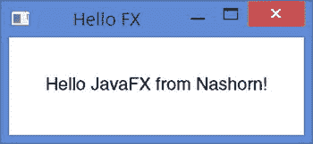
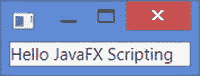
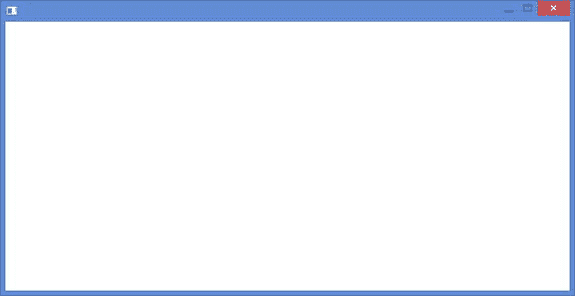
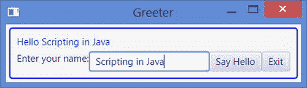

# 十一、在 Nashorn 中使用 JavaFX

在本章中，您将学习:

*   `jjs`命令行工具中的 JavaFX 支持
*   在脚本中提供 JavaFX `Application`类的`init()`、`start()`和`stop()`方法的实现
*   如何使用预定义的脚本加载和使用 JavaFX 包和类
*   使用 Nashorn 脚本创建和启动简单的 JavaFX 应用

在本章中，我们假设您已经有了 JavaFX 8 的初级经验。如果您没有 JavaFX 的经验，请在阅读本章之前学习 JavaFX。

## jjs 中的 JavaFX 支持

`jjs`命令行工具允许您启动在 Nashorn 脚本中创建的 JavaFX 应用。您需要使用带有`jjs`工具的`–fx`选项来作为 JavaFX 应用运行脚本。以下命令将存储在`myfxapp.js`文件中的脚本作为 JavaFX 应用运行:

```java
jjs –fx myfxapp.js
```

## 脚本中 JavaFX 应用的结构

在 JavaFX 应用中，您可以覆盖下面三个`Application`类的方法来管理应用的生命周期:

*   `init()`法
*   `start()`法
*   `stop()`法

在 Nashorn 脚本中，您可以像在 Java 中一样管理 JavaFX 应用的生命周期。脚本中可以有三个名为`init()`、`start()`和`stop()`的函数。注意，在 Nashorn 脚本中，这三个函数都是可选的。这些函数对应于 Java 类中的三个方法，它们的调用顺序如下:

The `init()` function is called. You can initialize the application in this function.   The `start()` function is called. As is the case in a Java application, the `start()` function is passed the reference to the primary stage of the application. You need to populate the scene, add the scene to the primary stage, and show the stage.   The `stop()` function is called when the JavaFX application exits.   Tip

如果 JavaFX 应用的脚本中没有`start()`函数，那么全局范围内的整个脚本都被认为是`start()`函数的代码。除了这三个函数之外，还可以有其他函数。它们将被视为函数，没有任何特殊的含义。这些函数不会被自动调用；您需要在脚本中调用它们。

清单 11-1 包含了一个简单的 JavaFX 应用的 Java 代码。它显示一个窗口，在一个`StackPane`中有一个`Text`节点。`HelloFX`类包含了`init()`、`start()`和`stop()`方法。图 [11-1](#Fig1) 显示了`HelloFX`应用显示的窗口。当您退出应用时，`stop()`方法会在标准输出中显示一条消息。

清单 11-1。Java 中的 HelloFX 应用

```java
// HelloFX.java

package com.jdojo.script;

import javafx.application.Application;

import javafx.scene.Scene;

import javafx.scene.layout.StackPane;

import javafx.scene.text.Font;

import javafx.scene.text.Text;

import javafx.stage.Stage;

public class HelloFX extends Application {

private Text msg;

private StackPane sp;

public static void main(String[] args) {

Application.launch(HelloFX.class);

}

@Override

public void init() {

msg = new Text("Hello JavaFX from Nashorn!");

msg.setFont(Font.font("Helvetica", 18));

sp = new StackPane(msg);

}

@Override

public void start(Stage stage) throws Exception {

stage.setTitle("Hello FX");

stage.setScene(new Scene(sp, 300, 100));

stage.sizeToScene();

stage.show();

}

@Override

public void stop() {

System.out.println("Hello FX application is stopped.");

}

}

Hello FX application is stopped.
```



图 11-1。

The Windows Displayed by the HelloFX Application

清单 11-2 包含了用于`HelloFX`应用的 Nashorn 脚本。它是清单 11-1 中 Java 代码的一对一翻译。请注意，用 Nashorn 编写的相同应用的代码要短得多。脚本存储在`hellofx.js`文件中。您可以使用如下命令提示符运行该脚本，它将显示如图 [11-1](#Fig1) 所示的相同窗口:

```java
jjs –fx hellofx.js
```

清单 11-2。存储在 hellofx.js 中的 HelloFX 应用的 Nashorn 脚本

```java
// hellofx.js

var msg;

var sp;

function init() {

msg = new javafx.scene.control.Label("Hello JavaFX from Nashorn!");

msg.font = javafx.scene.text.Font.font("Helvetica", 18);

sp = new javafx.scene.layout.StackPane(msg);

}

function start(stage) {

stage.setTitle("Hello FX");

stage.setScene(new javafx.scene.Scene(sp, 300, 100));

stage.sizeToScene();

stage.show();

}

function stop() {

java.lang.System.out.println("Hello FX application is stopped.");

}
```

您不需要在脚本中拥有任何`init()`、`start()`和`stop()`函数。清单 11-3 包含了另一个版本的`HelloFX`应用。不包括`init()`和`stop()`功能。来自`init()`函数的代码已经被移动到全局范围。`stop()`方法已经被移除，所以当应用退出时，您将不会在标准输出上看到消息。Nashorn 会先执行全局范围内的代码，然后调用`start()`方法。脚本存储在`hellofx2.js`文件中。运行它显示如图 [11-1](#Fig1) 所示的相同窗口。您可以运行该脚本:

```java
jjs –fx hellofx2.js
```

清单 11-3。HelloFX 应用的另一个版本，没有 init()和 stop()方法

```java
// hellofx2.js

var msg = new javafx.scene.control.Label("Hello JavaFX from Nashorn!");

msg.font = javafx.scene.text.Font.font("Helvetica", 18);

var sp = new javafx.scene.layout.StackPane(msg);

function start(stage) {

stage.setTitle("Hello FX");

stage.setScene(new javafx.scene.Scene(sp, 300, 100));

stage.sizeToScene();

stage.show();

}
```

您可以进一步简化 HelloFX 应用的脚本。您可以从脚本中删除`start()`函数。JavaFX 运行时创建初级阶段的引用并将其传递给`start()`函数。如果没有`start()`功能，如何获取初级阶段的引用？Nashorn 创建了一个名为`$STAGE`的全局对象，它是对初级阶段的引用。您可以使用此全局对象来处理主要阶段。你甚至不需要展示初级阶段；Nashorn 会自动显示给你看。

清单 11-3 包含的脚本是同一个 HelloFX 应用的另一个版本。它使用全局对象`$STAGE`来引用初级阶段。我已经去掉了`init()`功能。这一次，你甚至没有调用初级阶段的`show()`方法。你在让 Nashorn 自动为你展示初级阶段。脚本保存在`hellofx3.js`文件中。您可以运行该脚本:

```java
jjs –fx hellofx3.js
```

清单 11-4。HelloFX 应用的另一个版本，没有 init()、start()和 stop()函数

```java
// hellofx3.js

var msg = new javafx.scene.control.Label("Hello JavaFX from Nashorn!");

msg.font = javafx.scene.text.Font.font("Helvetica", 18);

var sp = new javafx.scene.layout.StackPane(msg);

$STAGE.setTitle("Hello FX");

$STAGE.setScene(new javafx.scene.Scene(sp, 300, 100));

$STAGE.sizeToScene();

// $STAGE.show(); // No need to show the primary stage. Nashorn will // automatically show it.
```

让我们再尝试一种功能组合。您将提供`init()`函数，但不提供`start()`函数。清单 11-5 包含了同一个 HelloFX 应用的代码。它包含了创建控件的`init()`方法，但是删除了`start()`方法。

清单 11-5。Nashorn 脚本中 JavaFX 应用的不正确实现

`//` `incorrectfxapp.js`

```java
var msg;

var sp;

function init() {

msg = new javafx.scene.control.Label("Hello JavaFX from Nashorn!");

msg.font = javafx.scene.text.Font.font("Helvetica", 18);

sp = new javafx.scene.layout.StackPane(msg);

}

$STAGE.setTitle("Hello FX");

$STAGE.setScene(new javafx.scene.Scene(sp, 300, 100));

$STAGE.sizeToScene();
```

当您运行清单 11-5 中的脚本时，它抛出一个异常，如下所示:

```java
jjs –fx incorrectfxapp.js

Exception in Application start method

Exception in thread "main" java.lang.RuntimeException: Exception in Application start method

at com.sun.javafx.application.LauncherImpl.launchApplication1(LauncherImpl.java:875)

at com.sun.javafx.application.LauncherImpl.lambda$launchApplication$149(LauncherImpl.java:157)

at com.sun.javafx.application.LauncherImpl$$Lambda$1/23211803.run(Unknown Source)

at java.lang.Thread.run(Thread.java:745)

Caused by: java.lang.ClassCastException: Cannot cast jdk.nashorn.internal.runtime.Undefined to javafx.scene.Parent

at java.lang.invoke.MethodHandleImpl.newClassCastException(MethodHandleImpl.java:364)

...
```

当您试图使用全局变量`sp`创建场景时抛出异常，该变量是对`StackPane`的引用。与预期相反，在全局范围内运行代码之前，不会调用`init()`方法。在自动调用`init()`函数之前，先调用全局范围内的代码。在脚本中，`init()`方法创建了要添加到场景中的控件。当创建场景时，变量`sp`仍然是`undefined`，这导致了异常。如果您在脚本中显示了主要阶段，那么在主要阶段已经显示之后会调用`init()`函数。如果您让 Nashorn 为您显示初级阶段，则在初级阶段之前调用`init()`函数。

Tip

如果在 JavaFX 脚本中没有提供`start()`函数，那么提供`init()`函数几乎没有任何用处，因为这样的`init()`函数将在主阶段构建完成后被调用。如果您想使用`init()`函数来初始化您的 JavaFX 应用，您应该同时提供`init()`和`start()`方法，以便它们被按顺序调用。

最后，我将向您展示最简单的 JavaFX 应用，它只用一行脚本就可以编写完成。它会在一个窗口中显示一条消息。但是，该窗口没有标题文本。清单 11-6 包含了一行脚本。它展示了 Nashorn 的妙处，将 10 到 15 行 Java 代码压缩成 1 行脚本！以下命令运行显示窗口的脚本，如图 [11-2](#Fig2) 所示:

```java
jjs –fx simplestfxapp.js
```

清单 11-6。Nashorn 中最简单的 JavaFX 应用

```java
// simplestfxapp.js

$STAGE.scene = new javafx.scene.Scene(new javafx.scene.control.Label("Hello JavaFX Scripting"));
```



图 11-2。

The simplest JavaFX application using Nashorn script

在 Nashorn 中，您只需为最简单的 JavaFX 应用编写一行代码，这是一种保守的说法。正确的说法是，您甚至不需要在 Nashorn 中编写一行代码来显示一个窗口。创建一个名为`empty.js`的脚本文件，不要在其中写任何代码。您可以将该文件命名为任何其他名称。使用以下命令运行`empty.js`文件:

```java
jjs –fx empty.js
```

该命令将显示如图 [11-3](#Fig3) 所示的窗口。Nashorn 是如何在你不写任何代码的情况下显示一个窗口的？回想一下，Nashorn 创建了初级阶段和一个全局对象`$STAGE`来表示初级阶段。如果它看到你没有展示初级阶段，它就为你展示。这就是本案中发生的情况。脚本文件为空，Nashorn 自动显示空的初级阶段。



图 11-3。

The simplest JavaFX application using a Nashorn script without writing even one line of code

## 导入 JavaFX 类型

您可以使用 JavaFX 类的完全限定名，或者使用`Java.type()`函数导入它们。在上一节中，您使用了所有 JavaFX 类的完全限定名。下面的代码片段展示了在 JavaFX 中创建`Label`的两种方法:

`// Using the``fully qualified name`T2】

```java
var msg = new javafx.scene.control.Label("Hello JavaFX!");

// Using Java.type() function

var Label = Java.type("javafx.scene.control.Label");

var msg = new Label("Hello JavaFX!");
```

键入所有 JavaFX 类的完全限定名可能很麻烦。脚本不是应该比 Java 代码短吗？Nashorn 有一种方法可以缩短 JavaFX 脚本。它包括几个脚本文件，这些文件将 JavaFX 类型作为它们的简单名称导入。在脚本中使用 JavaFX 类的简单名称之前，您需要使用`load()`方法加载这些脚本文件。例如，Nashorn 包含一个`fx:controls.js`脚本文件，它将所有 JavaFX 控件类作为它们的简单类名导入。表 [11-1](#Tab1) 包含脚本文件和它们导入的类/包的列表。

表 11-1。

The List of Nashorn Script Files and the Classes/Packages That They Import

  
| Nashorn 脚本文件 | 导入的类/包 |
| --- | --- |
| `fx:base.js` | `javafx.stage.Stage` `javafx.scene.Scene` `javafx.scene.Group` `javafx/beans` `javafx/collections` |
| `fx:graphics.js` | `javafx/animation` `javafx/application` `javafx/concurrent` `javafx/css` `javafx/geometry` `javafx/print` `javafx/scene` `javafx/stage` |
| `fx:controls.js` | `javafx/scene/chartjavafx/scene/control` |
| `fx:fxml.js` | `javafx/fxml` |
| `fx:web.js` | `javafx/scene/web` |
| `fx:media.js` | `javafx/scene/media` |
| `fx:swing.js` | `javafx/embed/swing` |
| `fx:swt.js` | `javafx/embed/swt` |

下面的代码片段显示了如何加载这个脚本文件并使用简单的名称`javafx.scene.control.Label`类:

```java
// Import all JavaFX control class names

load("fx:controls.js")

// Use the simple name of the Label control

var msg = new Label("Hello JavaFX!");
```

清单 11-7 包含 JavaFX 欢迎应用的代码，它保存在一个名为`greeter.js`的文件中。您可以按如下方式运行脚本:

```java
jjs –fx greeter.js
```

清单 11-7。使用 Nashorn 脚本的 JavaFX 应用

```java
// greeter.js

// Load Nashorn predefined scripts to import JavaFX specific classes // and packages

load("fx:base.js");

load("fx:controls.js");

load("fx:graphics.js");

// Define the start() method of the JavaFX application class

function start(stage) {

var nameLbl = new Label("Enter your name:");

var nameFld = new TextField();

var msg = new Label();

msg.style = "-fx-text-fill: blue;";

// Create buttons

var sayHelloBtn = new Button("Say Hello");

var exitBtn = new Button("Exit");

// Add the event handler for the Say Hello button

sayHelloBtn.onAction = sayHello;

// Call the same fucntion sayHello() when the user

nameFld.onAction = sayHello;

// Add the event handler for the Exit button

exitBtn.onAction = function() {

Platform.exit();

};

// Create the root node

var root = new VBox();

root.style = "-fx-padding: 10;" +

"-fx-border-style: solid inside;" +

"-fx-border-width: 2;" +

"-fx-border-insets: 5;" +

"-fx-border-radius: 5;" +

"-fx-border-color: blue;";

// Set the vertical spacing between children to 5px

root.spacing = 5;

// Add children to the root node

root.children.addAll(msg, new HBox(nameLbl, nameFld, sayHelloBtn, exitBtn));

// Set the scene and title for the stage

stage.scene = new Scene(root);

stage.title = "Greeter";

// Show the stage

stage.show();

// A nested function to say hello based on the entered name

function sayHello(evt) {

var name = nameFld.getText();

if (name.trim().length() > 0) {

msg.text = "Hello " + name;

}

else {

msg.text = "Hello there";

}

}

}
```

欢迎应用显示一个窗口，如图 [11-4](#Fig4) 所示。输入名称并按下`Enter`键或点击`Say Hello`按钮。将显示带有问候语的讯息。



图 11-4。

The greeter JavaFX aplication in action

在 Nashorn 中开发 JavaFX 应用要容易得多。在脚本中，您可以使用属性调用 Java 对象的 getters 和 setters。可以直接访问所有 Java 对象的属性，而不仅仅是 JavaFX 对象的属性。比如不用 Java 写`root.setSpacing(5)`，可以用 Nashorn 写`root.spacing = 5`。

为按钮添加事件处理程序也更容易。您可以设置一个匿名函数作为按钮的事件处理程序。请注意，您可以使用`onAction`属性来设置事件处理程序，而不是调用`Button`类的`setOnAction()`方法。下面的代码片段展示了如何使用函数引用`sayHello`来设置按钮的`ActionEvent`处理程序:

```java
// Add the event handler for the Say Hello button

sayHelloBtn.onAction = sayHello
```

注意，在这个例子中，您在`start()`函数中使用了一个嵌套函数`sayHello()`。对函数的引用被用作事件处理程序。一个事件处理器接受一个参数，`sayHello()`函数中的`evt`形参就是那个事件对象。

## 摘要

Nashorn 中的`jjs`命令行工具支持启动用脚本编写的 JavaFX 应用。`–fx`选项与`jjs`一起使用来启动 JavaFX 应用。JavaFX 应用的脚本可以有与 JavaFX `Application`类的`init()`、`start()`和`stop()`方法相对应的`init()`、`start()`和`stop()`函数。Nashorn 调用这些函数的顺序与在 JavaFX 应用中调用它们的顺序相同。

向`start()`函数传递对初级阶段的引用。如果你不提供一个`start()`函数，整个脚本被认为是`start()`函数。Nashorn 提供了一个名为`$STAGE`的全局对象，它是对初级阶段的引用。如果你没有提供`start()`函数，你需要使用`$STAGE`全局变量来访问初级阶段。如果您没有提供`start()`方法，也没有显示初级阶段，Nashorn 将为您调用`$STAGE.show()`方法。