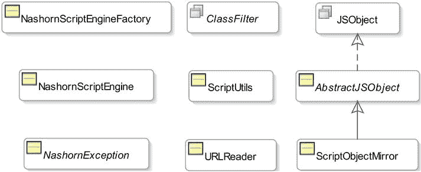

# 十二、Nashorn 的 Java APIs

在本章中，您将学习:

*   Nashorn 的 Java APIs 是什么
*   如何直接实例化 Nashorn 引擎
*   如何在 Java 代码中和命令行上将选项传递给 Nashorn 引擎
*   如何在 Nashorn 引擎中的脚本上下文之间共享全局
*   如何在 Java 代码中添加、更新、删除和读取脚本对象的属性
*   如何在 Java 代码中创建脚本对象并调用它们的方法
*   如何从 Java 代码中调用脚本函数
*   如何将脚本日期转换成 Java 日期

## Nashorn 的 Java APIs 是什么？

在 Nashorn 脚本中使用 Java 类很简单。有时您可能想在 Java 代码中使用 Nashorn 对象。您可以将 Nashorn 对象传递给 Java 代码，或者 Java 代码可以评估 Nashorn 脚本并检索 Nashorn 对象的引用。当 Nashorn 对象跨越边界(脚本到 Java)时，它们需要表示为 Java 类的对象，并且您应该能够像使用任何其他 Java 对象一样使用它们。

如果您的应用只使用 Nashorn，为了充分利用 Nashorn 引擎，您可能希望使用 Nashorn 中可用的选项和扩展。您需要用 Java 代码实例化 Nashorn 引擎，使用特定于 Nashorn 引擎的类，而不是使用 Java 脚本 API 中的类。

Nashorn 的 Java APIs 提供了 Java 类和接口，允许您直接在 Java 代码中处理 Nashorn 脚本引擎和 Nashorn 对象。图 [12-1](#Fig1) 描述了当你处理 Nashorn 引擎时，你应该在客户端代码中使用的那些类和接口的类图。它们在`jdk.nashorn.api.scripting`包里。



图 12-1。

A class diagram of Java APIs for Nashorn in the jdk.nashorn.api.scripting package

注意，Nashorn 脚本引擎在内部使用了其他包中的许多其他类。然而，你不应该在你的应用中直接使用它们，除了来自`jdk.nashorn.api.scripting`包的类。位于[https://wiki . open JDK . Java . net/display/Nashorn/Nashorn+JSR 223+engine+notes](https://wiki.openjdk.java.net/display/Nashorn/Nashorn+jsr223+engine+notes)的网页包含了`jdk.nashorn.api.scripting`包文档的链接。

Note

JDK8u40 中已经增加了`jdk.nashorn.api.scripting`包中的`ClassFilter`接口，计划 2015 年一季度末出货。如果您想更早地使用这个接口，您需要下载 JDK8u40 的早期访问版本。

我将在后续章节中详细讨论一些特定于 Nashorn 的 Java 类和接口。表 [12-1](#Tab1) 列出了`jdk.nashorn.api.scripting`包中的类和接口及其描述。

表 12-1。

The List of Java Classes/Interfaces to be Used with Nashorn Scripting Engine

  
| 类别/接口 | 描述 |
| --- | --- |
| `NashornScriptEngineFactory` | 这是 Nashorn 引擎的脚本引擎工厂实现。当您想要创建一个使用 Nashorn 特定选项和扩展的 Nashorn 引擎时，您需要实例化这个类。 |
| `NashornScriptEngine` | 这是 Nashorn 引擎的脚本引擎实现类。不要直接实例化这个类。它的实例是使用一个`NashornScriptEngineFactory`对象的`getScriptEngine()`方法获得的。 |
| `NashornException` | 这是从 Nashorn 脚本抛出的所有异常的基本异常类。当您使用 Java 脚本 API 时，您的 Java 代码接收到一个`ScriptException`类的实例，该实例将成为`NashornException`的包装器。如果您直接从 Java 代码中访问脚本，例如通过在脚本中实现 Java 接口并在 Java 代码中使用该接口的实例，则可能会在 Java 代码中直接抛出`NashornException`的实例。该类包含许多方法，这些方法使您可以访问脚本错误的详细信息，如行号、列号、脚本的错误对象等。 |
| `ClassFilter` | `ClassFilter`是一个接口。您可以使用它的实例来限制 Nashorn 脚本中部分或全部 Java 类的可用性。当使用一个`NashornScriptEngineFactory`实例化一个`NashornScriptEngine`时，您将需要传递这个接口的一个实例。 |
| `ScriptUtils` | 一个用于 Nashorn 脚本的实用程序类。 |
| `URLReader` | 读取 URL 的内容。它继承自`java.io.Reader`类。 |
| `JSObject` | 这个接口的一个实例用 Java 代码表示一个 Nashorn 对象。如果您想将一个 Java 对象传递给一个应该被视为 Nashorn 对象的 Nashorn 脚本，您需要传递这个接口的一个实例。您可以在 Nashorn 脚本中使用括号符号来访问和设置此类 Java 对象的属性。 |
| `AbstractJSObject` | 这是一个实现了`JSObject`接口的抽象类。 |
| `ScriptObjectMirror` | 这是一个镜像对象，它包装了一个 Nashorn 脚本对象。它继承自`AbstractJSObject`类并实现了`Bindings`接口。当 Java 代码从脚本中接收到一个 Nashorn 对象时，脚本对象在被传递给 Java 代码之前被包装在一个`ScriptObjectMirror`实例中。 |

## 实例化 Nashorn 引擎

在前面的章节中，您已经使用标准的 Java 脚本 API 用 Java 代码实例化了 Nashorn 引擎。Nashorn 引擎提供了几个自定义功能。为了利用这些特性，您需要直接实例化 Nashorn 引擎。首先，您需要创建一个`NashornScriptEngineFactory`类的对象，然后调用`getScriptEngine()`方法的一个重载版本来创建一个 Nashorn 引擎:

```java
// Create a Nashorn engine factory

NashornScriptEngineFactory factory = new NashornScriptEngineFactory();

// Create a Nashorn engine with default options

ScriptEngine engine = factory.getScriptEngine();
```

默认情况下，Nashorn 引擎工厂创建一个启用了`--dump-on-error`选项的 Nashorn 引擎。在下一个示例中，我将向您展示如何为 Nashorn 引擎设置其他选项。

以下代码片段使用`--no-java`和`–strict`选项创建了一个 Nashorn 引擎:

```java
// Create a Nashorn engine factory

NashornScriptEngineFactory factory = new NashornScriptEngineFactory();

// Store the Nashorn options in a String array

String[] options = {"--no-java", "-strict"};

// Create the Nashorn engine with the options

ScriptEngine engine = factory.getScriptEngine(options);
```

由于使用了`--no-java`选项，您不能在这个引擎执行的脚本中使用任何 Java 类。`–strict`选项将强制引擎以严格模式执行所有脚本。

您还可以在命令行上使用`nashorn.args`系统属性将选项传递给 Nashorn 引擎。以下命令运行`com.jdojo.script.Test`类，将四个选项传递给 Nashorn 引擎:

```java
java -Dnashorn.args="--global-per-engine -strict --no-java --language=es5" com.jdojo.script.Test
```

请注意，选项由空格分隔，它们都作为一个字符串传递。如果只有一个要传递的选项，可以省略选项值两边的双引号。以下命令只将一个选项`--no-java`传递给引擎:

```java
java -Dnashorn.args=--no-java com.jdojo.script.Test
```

下面的代码片段使用类过滤器创建了一个 Nashorn 引擎，它是`ClassFilter`接口的一个实例，用来限制来自`com.jdojo`包及其子包的任何类的使用。注意 JDK8u40 中增加了`ClassFilter`接口；它在 JDK8 中不可用:

```java
NashornScriptEngineFactory factory = new NashornScriptEngineFactory();

ScriptEngine engine = factory.getScriptEngine(clsName -> clsName.startsWith("com.jdojo"));
```

`ClassFilter`是功能界面。它的方法被传递了 Nashorn 脚本试图使用的 Java 类的完全限定名。如果方法返回`true`，则可以在脚本中使用该类；否则，该类不能在脚本中使用。

Tip

如果不希望脚本中暴露任何 Java 类，可以使用`clsName -> false`作为`ClassFilter`的 lambda 表达式。在脚本中使用受`ClassFilter`限制的 Java 类会抛出`java.lang.ClassNotFound`异常。

下面是`NashornScriptEngineFactory`类的`getScriptEngine()`方法的重载版本列表:

*   `ScriptEngine getScriptEngine()`
*   `ScriptEngine getScriptEngine(String... args)`
*   `ScriptEngine getScriptEngine(ClassFilter classFilter)`
*   `ScriptEngine getScriptEngine(ClassLoader appLoader)`
*   `ScriptEngine getScriptEngine(String[] args, ClassLoader appLoader)`
*   `ScriptEngine getScriptEngine(String[] args, ClassLoader appLoader, ClassFilter classFilter)`

## 共享引擎全局

默认情况下，Nashorn 引擎维护每个脚本上下文的全局对象。在本讨论中，术语“全局”指的是存储在 Nashorn 脚本的全局作用域中的全局变量和声明，您在顶级脚本中通过`this`引用它们。不要将脚本上下文中的全局范围绑定与脚本中的全局范围绑定混淆。当您在脚本中引用任何变量或创建变量时，会首先搜索脚本全局变量。如果您在脚本中引用了一个在脚本全局中找不到的变量，引擎将在脚本上下文的全局范围`bindings`中搜索它。例如，脚本对象`Object`、`Math`、`String`等等都是脚本全局的一部分。考虑清单 12-1 中的程序及其输出。

清单 12-1。每个 Nashron 引擎使用多个脚本全局变量

```java
// MultiGlobals.java

package com.jdojo.script;

import javax.script.ScriptContext;

import javax.script.ScriptEngine;

import javax.script.ScriptEngineManager;

import javax.script.SimpleScriptContext;

public class MultiGlobals {

public static void main(String[] args) {

// Get the Nashorn script engine

ScriptEngineManager manager = new ScriptEngineManager();

ScriptEngine engine = manager.getEngineByName("JavaScript");

try {

// Add a variable named msg to the script globals

engine.eval("var msg = 'Hello globals'");

// Print the value of the msg variable

engine.eval("print(this.msg);");

// Execute the same script as above, but using a new

// ScriptContext object. The engine will use a fresh

// copy of the globals and will not find this.msg that

// was created and associated with the default script

// context of the engine previously.

ScriptContext ctx = new SimpleScriptContext();

engine.eval("print(this.msg);", ctx);

}

catch (Exception e) {

e.printStackTrace();

}

}

}

Hello globals

undefined
```

该程序执行以下步骤:

*   使用默认选项创建 Nashorn 引擎。
*   使用使用引擎默认脚本上下文的`eval()`方法执行脚本。该脚本创建了一个名为`msg`的全局变量，它存储在脚本 globals 中。你可以在全局范围内使用简单的名字`msg`或`this.msg`来引用变量。
*   使用`eval()`方法执行脚本，该方法使用打印`msg`变量的值的引擎的默认脚本上下文。输出中的第一行确认打印出了`msg`变量的正确值。
*   使用使用新脚本上下文的`eval()`方法执行脚本。该脚本试图打印全局变量`msg`的值。输出中的第二行，通过打印`undefined`，确认名为`msg`的变量在脚本 globals 中不存在。

这是 Nashorn 引擎的默认行为。它为每个脚本上下文创建全局变量的新副本。如果您想要使用默认上下文的全局变量(如果您想要共享全局变量)，您可以通过将默认上下文的引擎作用域`Bindings`复制到您的新脚本上下文来实现。清单 12-2 使用这种方法在两个脚本上下文之间共享脚本全局变量。

清单 12-2。通过复制引擎默认上下文的引擎范围绑定来共享脚本全局变量

```java
// CopyingGlobals.java

package com.jdojo.script;

import javax.script.Bindings;

import javax.script.ScriptContext;

import static javax.script.ScriptContext.ENGINE_SCOPE;

import javax.script.ScriptEngine;

import javax.script.ScriptEngineManager;

import javax.script.SimpleScriptContext;

public class CopyingGlobals {

public static void main(String[] args) {

// Get the Nashorn script engine

ScriptEngineManager manager = new ScriptEngineManager();

ScriptEngine engine = manager.getEngineByName("JavaScript");

try {

// Add a variable named msg to the global scope of // the script

engine.eval("var msg = 'Hello globals'");

// Print the value of the msg value

engine.eval("print(this.msg);");

// Create a ScriptContext and copy the ENGINE_SCOPE // Bindings of the default

// script context to the new ScriptContext

ScriptContext ctx = new SimpleScriptContext();

ScriptContext defaultCtx = engine.getContext();

Bindings engineBindings = defaultCtx.getBindings(ENGINE_SCOPE);

ctx.setBindings(engineBindings, ENGINE_SCOPE);

// Use the new ScriptContext to execute the script

engine.eval("print(this.msg);", ctx);

}

catch (Exception e) {

e.printStackTrace();

}

}

}

Hello globals

Hello globals
```

Nashorn 引擎的`–-global-per-engine`选项完成了与前一个例子相同的事情。它在所有脚本上下文中共享脚本全局变量。清单 12-3 显示了如何为引擎设置这个选项。输出确认引擎仅使用一个全局副本来执行所有脚本。

清单 12-3。在 Nashorn 引擎中的所有脚本上下文之间共享脚本全局

```java
// SharedGlobals.java

package com.jdojo.script;

import javax.script.Bindings;

import javax.script.ScriptContext;

import static javax.script.ScriptContext.ENGINE_SCOPE;

import javax.script.ScriptEngine;

import javax.script.ScriptEngineManager;

import javax.script.SimpleScriptContext;

import jdk.nashorn.api.scripting.NashornScriptEngineFactory;

public class SharedGlobals {

public static void main(String[] args) {

// Get the Nashorn script engine using the // --global-per_engine option

NashornScriptEngineFactory factory = new NashornScriptEngineFactory();

ScriptEngine engine = factory.getScriptEngine("--global-per-engine");

try {

// Add a variable named msg to the global scope of // the script

engine.eval("var msg = 'Hello globals'");

// Print the value of the msg value

engine.eval("print(this.msg);");

// Execute the same script, but using a new

// ScriptContext. Note that the script globals // are shared and this script will find the

// this.msg variable created by the first // script execution.

ScriptContext ctx = new SimpleScriptContext();

engine.eval("print(this.msg);", ctx);

}

catch (Exception e) {

e.printStackTrace();

}

}

}

Hello globals

Hello globals
```

## 在 Java 代码中使用脚本对象

当来自 Nashorn 的对象和值跨越 script-Java 边界进入 Java 代码时，它们需要被表示为 Java 对象和值。表 [12-2](#Tab2) 列出了脚本对象和它们对应的 Java 对象之间的类映射。

表 12-2。

The List of Mapping Between Classes of Script Objects and Java Objects

  
| 脚本对象的类型 | Java 对象的类型 |
| --- | --- |
| 不明确的 | `jdk.nashorn.internal.runtime.Undefined` |
| 空 | `null` |
| 数字 | `java.lang.Number` |
| 布尔代数学体系的 | `java.lang.Boolean` |
| 原始字符串类型 | `java.lang.String` |
| 任何脚本对象 | `jdk.nashorn.api.scripting.ScriptObjectMirror` |
| 任何 Java 对象 | `The same as the Java object in the script` |

注意，您不应该使用`jdk.nashorn.internal`包及其子包中的类和接口。表中列出它们只是为了提供信息。在此表中，Nashorn 数字类型的映射显示为`java.lang.Number`类型。尽管 Nashorn 试图尽可能地为数值传递`java.lang.Integer`和 j `ava.lang.Double`对象，但是依赖这样的专用 Java 类型是不可靠的。当一个 Nashorn 数从脚本传递到 Java 代码时，您应该会看到一个`java.lang.Number`实例。只要有必要，Nashorn 中的 Number 和 Boolean 类型的值都会被转换成相应的 Java 原语类型，比如`int`、`double`、`boolean`等等。

在 Nashorn 中，脚本对象被表示为`jdk.nashorn.internal.runtime.ScriptObject`类的一个实例。当脚本对象被传递给 Java 代码时，它被包装在一个`ScriptObjectMirror`对象中。在 JDK8u40 之前，如果你将一个脚本对象传递给一个声明其参数为`java.lang.Object`类型的 Java 方法，传递的是一个`ScriptObject`，而不是一个`ScriptObjectMirror`。JDK8u40 改变了这种行为，每次都将一个脚本对象作为`ScriptObjectMirror`传递给 Java 代码。如果您在 Java 中将方法的参数声明为`JSObject`或`ScriptObjectMirror`，Nashorn 总是将脚本对象作为`ScriptObjectMirror`传递给 Java。

Tip

脚本可以将值`undefined`传递给 Java 代码。您可以使用`ScriptObjectMirror`类的`isUndefined(Object obj)`静态方法来检查传递给 Java 的脚本对象是否是`undefined`。如果指定的`obj`为`undefined`，则该方法返回 true 否则，它返回 false。

`ScriptObjectMirror`类实现了`JSObject`和`Bindings`接口。该类添加了更多的方法来处理脚本对象。您可以将 Java 代码中脚本对象的引用存储在三种类型的变量中的任何一种:`JSObject`、`Bindings`或`ScriptObjectMirror`。你用什么类型取决于你的需要。使用`ScriptObjectMirror`类型给你更多的灵活性和访问脚本对象的所有特性。表 [12-3](#Tab3) 包含了在`JSObject`接口中声明的方法列表。

我将在接下来的小节中展示如何使用这些方法和`ScriptObjectMirror`类的一些方法。任何 Java 类都可以实现`JSObject`接口。这种类的对象可以像脚本对象一样使用，并且可以使用语法`obj.func()`、`obj[prop]`、`delete obj.prop`等在脚本中处理它们的方法和属性。

表 12-3。

The List of Methods Declared in the JSObject Interface with Their Descriptions

  
| 方法 | 描述 |
| --- | --- |
| `Object call(Object thiz, Object... args)` | 将此对象作为函数调用。当`JSObject`包含 Nashorn 函数或方法的引用时，您将使用该方法。参数`thiz`被用作函数调用中`this`的值。`args`中的参数作为参数传递给被调用的函数。这个方法在 Java 中的工作方式与`func.apply(thiz, args)`在 Nashorn 脚本中的工作方式相同。 |
| `Object eval(String script)` | 评估指定的脚本。 |
| `String getClassName()` | 返回对象的 ECMAScript 类名。这和 Java 里的类名不一样。 |
| `Object getMember(String name)` | 返回脚本对象的命名属性的值。 |
| `Object getSlot(int index)` | 返回脚本对象的索引属性的值。 |
| `boolean hasMember(String name)` | 如果脚本对象具有命名属性，则返回 true 否则返回 false。 |
| `boolean hasSlot(int index)` | 如果脚本对象具有索引属性，则返回 true 否则返回 false。 |
| `boolean isArray()` | 如果脚本对象是数组对象，则返回 true 否则返回 false。 |
| `boolean isFunction()` | 如果脚本对象是函数对象，则返回 true 否则返回 false。 |
| `boolean isInstance(Object instance)` | 如果指定的`instance`是该对象的实例，则返回 true 否则返回 false。 |
| `boolean isInstanceOf(Object clazz)` | 如果该对象是指定的`clazz`的实例，则返回 true 否则返回 false。 |
| `boolean isStrictFunction()` | 如果该对象是严格函数，则返回 true 否则返回 false。 |
| `Set<String> keySet()` | 以一组字符串的形式返回该对象的所有属性的名称。 |
| `Object newObject(Object... args)` | 调用此方法的对象应该是构造函数对象。调用此构造函数创建一个新对象。这相当于 Nashorn 脚本中的`new func(arg1, arg2...)`。 |
| `void removeMember(String name)` | 从对象中移除指定的属性。 |
| `void setMember(String name, Object value)` | 将指定的`value`设置为该对象的指定属性名。如果属性名不存在，则添加一个具有指定`name`的新属性。 |
| `void setSlot(int index, Object value)` | 将指定的`value`设置为该对象的指定索引属性。如果`index`不存在，则添加一个具有指定`index`的新属性。 |
| `double toNumber()` | 返回对象的数值。通常，如果脚本对象是数值的包装器，比如在 Nashorn 中使用表达式`new Object(234.90)`创建的脚本对象，您将使用此方法。在其他脚本对象上，它返回值`Double.NAN`。 |
| `Collection<Object> values()` | 在一个`Collection`中返回该对象的所有属性值。 |

### 使用脚本对象的属性

`ScriptObjectMirror`类实现了`JSObject`和`Bindings`接口。您可以使用这两个接口的方法来访问属性。您可以使用`JSObject`的`getMember()`和`getSlot()`方法来读取脚本对象的命名和索引属性。您可以使用`Bindings`的`get()`方法来获取属性的值。您可以使用`JSObject`的`setMember()`和`setSlot()`方法来添加和更新属性。`Bindings`的`put()`方法可以让你做同样的事情。

您可以使用`JSObject`的`hasMember()`和`hasSlot()`方法来检查命名属性和索引属性是否存在。同时，您可以使用`Bindings`接口的`containsKey()`方法来检查一个属性是否存在。您可以认为由`ScriptObjectMirror`类实现的`JSObject`和`Bindings`接口提供了同一个脚本对象的两个视图——前者是一个简单的对象，后者是一个地图。

清单 12-4 包含一个 Nashorn 脚本，它创建两个脚本对象并调用一个 Java 类的两个方法，如清单 12-5 所示。该脚本将脚本对象传递给 Java 方法。Java 方法打印传递的对象的属性，并向两个脚本对象添加一个新属性。该脚本在方法返回后打印属性，以确认 Java 代码中添加到脚本对象的新属性仍然存在。

清单 12-4。一个 Nashorn 脚本，它调用 Java 方法并将脚本对象传递给它们

```java
// scriptobjectprop.js

// Create an object

var point = {x: 10, y: 20};

// Create an array

var empIds = [101, 102];

// Get the Java type

var ScriptObjectProperties = Java.type("com.jdojo.script.ScriptObjectProp");

// Pass the object to Java

ScriptObjectProperties.propTest(point);

// Print all properties of the point object

print("In script, after calling the Java method propTest()...");

for(var prop in point) {

var value = point[prop];

print(prop + " = " + value);

}

// Pass the array object to Java

ScriptObjectProperties.arrayTest(empIds);

// Print all elements of teh empIds array

print("In script, after calling the Java method arrayTest()...");

for(var i = 0, len = empIds.length; i < len; i++) {

var value = empIds[i];

print("empIds[" + i + "] = " + value);

}
```

清单 12-5。一个 Java 类，其方法访问脚本对象的属性

```java
// ScriptObjectProp.java

package com.jdojo.script;

import java.nio.file.Files;

import java.nio.file.Path;

import java.nio.file.Paths;

import javax.script.ScriptEngine;

import javax.script.ScriptEngineManager;

import javax.script.ScriptException;

import jdk.nashorn.api.scripting.ScriptObjectMirror;

public class ScriptObjectProp {

public static void main(String[] args) {

// Construct the script file path

String scriptFileName = "scriptobjectprop.js";

Path scriptPath = Paths.get(scriptFileName);

// Make sure the script file exists. If not, print the full // path of the script file and terminate the program.

if (!Files.exists(scriptPath)) {

System.out.println(scriptPath.toAbsolutePath()

+ " does not exist.");

return;

}

// Create a scripting engine manager

ScriptEngineManager manager = new ScriptEngineManager();

// Obtain a Nashorn scripting engine from the manager

ScriptEngine engine = manager.getEngineByName("JavaScript");

try {

// Execute the script that will call the propTest() and

// arrayTest() methods of this class

engine.eval("load('" + scriptFileName + "')");

}

catch (ScriptException e) {

e.printStackTrace();

}

}

public static void propTest(ScriptObjectMirror point) {

// List all properties

System.out.println("Properties of point received in Java...");

for (String prop : point.keySet()) {

Object value = point.getMember(prop);

System.out.println(prop + " = " + value);

}

// Let us add a property named z

System.out.println("Adding z = 30 to point in Java... ");

point.setMember("z", 30);

}

public static void arrayTest(ScriptObjectMirror empIds) {

if (!empIds.isArray()) {

System.out.println("Passed in obejct is not an array.");

return;

}

// Get the length proeprty of teh array

int length = ((Number) empIds.getMember("length")).intValue();

System.out.println("empIds received in Java...");

for (int i = 0; i < length; i++) {

int value = ((Number) empIds.getSlot(i)).intValue();

System.out.printf("empIds[%d] = %d%n", i, value);

}

// Let us add an element to the array

System.out.println("Adding empIds[2] = 103 in Java... ");

empIds.setSlot(length, 103);

}

}

Properties of point received in Java...

x = 10

y = 20

Adding z = 30 to point in Java...

In script, after calling the Java method propTest()...

x = 10

y = 20

z = 30

empIds received in Java...

empIds[0] = 101

empIds[1] = 102

Adding empIds[2] = 103 in Java...

In script, after calling the Java method arrayTest()...

empIds[0] = 101

empIds[1] = 102

empIds[2] = 103
```

### 在 Java 中创建 Nashorn 对象

您可能在脚本中有构造函数，并希望使用这些构造函数在 Java 中创建对象。`ScriptObjectMirror`类的`newObject()`方法允许您在 Java 中创建脚本对象。方法声明是:

```java
Object newObject(Object... args)
```

方法的参数是要传递给构造函数的参数。方法返回新的对象引用。此方法需要在构造函数上调用。首先，您需要获取 Java 中构造函数的引用作为一个`ScriptObjectMirror`对象，然后调用这个方法使用这个构造函数创建一个新的脚本对象。

您可以使用`ScriptObjectMirror`类的`callMember()`方法调用脚本对象的方法。该方法的声明是:

```java
Object callMember(String methodName, Object... args)
```

在[第 4 章](04.html)中，你创建了一个名为`Point`的构造函数。它的声明如清单 12-6 所示，供您参考。在这个例子中，您将在 Java 中创建`Point`类型的对象。

清单 12-6。Nashorn 中名为 Point 的构造函数的声明

```java
// Point.js

// Define the Point constructor

function Point(x, y) {

this.x = x;

this.y = y;

}

// Override the toString() method in Object.prototype

Point.prototype.toString = function() {

return "Point(" + this.x + ", " + this.y + ")";

};

// Define a new method called distance()

Point.prototype.distance = function(otherPoint) {

var dx = this.x - otherPoint.x;

var dy = this.y - otherPoint.y;

var dist = Math.sqrt(dx * dx + dy * dy);

return dist;

};
```

清单 12-7 包含了执行下列步骤的 Java 程序:

*   加载将加载`Point`构造函数定义的`point.js`脚本文件
*   通过调用`engine.get("Point")`获取`Point`构造函数的引用
*   通过调用`Point`构造函数上的`newObject()`方法创建两个名为`p1`和`p2`的`Point`对象
*   调用`p1`上的`callMember()`方法来调用它的`distance()`方法来计算`p1`和`p2`之间的距离
*   调用`p1`和`p2`上的`callMember()`方法，通过调用在`Point`构造函数中声明的`toString()`方法来获取它们的字符串表示
*   最后，打印两点之间的距离

清单 12-7。用 Java 代码创建 Nashorn 对象

```java
// CreateScriptObject.java

package com.jdojo.script;

import java.nio.file.Files;

import java.nio.file.Path;

import java.nio.file.Paths;

import javax.script.ScriptEngine;

import javax.script.ScriptEngineManager;

import jdk.nashorn.api.scripting.ScriptObjectMirror;

public class CreateScriptObject {

public static void main(String[] args) {

// Construct the script file path

String scriptFileName = "point.js";

Path scriptPath = Paths.get(scriptFileName);

// Make sure the script file exists. If not, print the full

// path of the script file and terminate the program.

if (! Files.exists(scriptPath) ) {

System.out.println(scriptPath.toAbsolutePath() +

" does not exist.");

return;

}

// Get the Nashorn script engine

ScriptEngineManager manager = new ScriptEngineManager();

ScriptEngine engine = manager.getEngineByName("JavaScript");

try {

// Execute the script in the file

engine.eval("load('" + scriptFileName + "');");

// Get the Point constructor as a ScriptObjectMirror // object

ScriptObjectMirror pointFunc = (ScriptObjectMirror)engine.get("Point");

// Create two Point objects. The following statements // are the same as var p1 = new Point(10, 20);

// and var p2 = new Point(13, 24); in a Nashorn script

ScriptObjectMirror p1 = (ScriptObjectMirror)pointFunc.newObject(10, 20);

ScriptObjectMirror p2 = (ScriptObjectMirror)pointFunc.newObject(13, 24);

// Compute the distance between p1 and p2 calling

// the distance() method of the Point object

Object result = p1.callMember("distance", p2);

double dist = ((Number)result).doubleValue();

// Get the string forms of p1 and p2 by calling // their toString() method

String p1Str = (String)p1.callMember("toString");

String p2Str = (String)p2.callMember("toString");

System.out.printf("The distance between %s and %s is %.2f.%n",

p1Str, p2Str, dist);

}

catch (Exception e) {

e.printStackTrace();

}

}

}

The distance between Point(10, 20) and Point(13, 24) is 5.00.
```

### 从 Java 调用脚本函数

您可以从 Java 代码中调用脚本函数。可以从脚本向 Java 代码传递脚本函数对象，或者它可以通过脚本引擎获得函数对象的引用。您可以在作为函数对象引用的`ScriptObjectMirror`上使用`call()`方法。该方法的声明是:

```java
Object call(Object thiz, Object... args)
```

第一个参数是在函数调用中用作`this`的对象引用。第二个参数是传递给函数的参数列表。要在全局范围内调用函数，使用`null`作为第一个参数。

在第 4 章中，你创建了一个`factorial()`函数来计算一个数的阶乘。这个函数的声明如清单 12-8 所示。

清单 12-8。factorial()函数的声明

```java
// factorial.js

// Returns true if n is an integer. Otherwise, returns false.

function isInteger(n) {

return typeof n === "number" && isFinite(n) && n%1 === 0;

}

// Define a function that computes and returns the factorial of an integer

function factorial(n) {

if (!isInteger(n)) {

throw new TypeError("The number must be an integer. Found:" + n);

}

if(n < 0) {

throw new RangeError("The number must be greater than 0\. Found: " + n);

}

var fact = 1;

for(var counter = n; counter > 1; fact *= counter--);

return fact;

}
```

清单 12-9 包含的 Java 程序从`factorial.js`文件加载脚本，在`ScriptObjectMirror`中获取`factorial()`函数的引用，使用`call()`方法调用`factorial()`函数，并打印结果。最后，程序使用`ScriptObjectMirror`类的`call()`方法调用`String`对象上的`Array.prototype.join()`函数。

清单 12-9。从 Java 代码调用脚本函数

```java
// InvokeScriptFunctionInJava.java

package com.jdojo.script;

import java.nio.file.Files;

import java.nio.file.Path;

import java.nio.file.Paths;

import javax.script.ScriptEngine;

import javax.script.ScriptEngineManager;

import jdk.nashorn.api.scripting.ScriptObjectMirror;

public class InvokeScriptFunctionInJava {

public static void main(String[] args) {

// Construct the script file path

String scriptFileName = "factorial.js";

Path scriptPath = Paths.get(scriptFileName);

// Make sure the script file exists. If not, print the full

// path of the script file and terminate the program.

if (!Files.exists(scriptPath)) {

System.out.println(scriptPath.toAbsolutePath()

+ " does not exist.");

return;

}

// Get the Nashorn script engine

ScriptEngineManager manager = new ScriptEngineManager();

ScriptEngine engine = manager.getEngineByName("JavaScript");

try {

// Execute the script in the file, so teh factorial() function is loaded

engine.eval("load('" + scriptFileName + "');");

// Get the reference of the factorial() script function

ScriptObjectMirror factorialFunc =                                  (ScriptObjectMirror)engine.get("factorial");

// Invoke the factorial function and print the result

Object result = factorialFunc.call(null, 5);

double factorial = ((Number) result).doubleValue();

System.out.println("Factorial of 5 is " + factorial);

/* Call the Array.prototype.join() function on a String object */

// Get the reference of the Array.prototype.join method

ScriptObjectMirror arrayObject =

(ScriptObjectMirror)engine.eval("Array.prototype");

ScriptObjectMirror joinFunc =

(ScriptObjectMirror)arrayObject.getMember("join");

// Call the join() function of Array.prototype on a // string object passing a hyphen as a separator

String thisObject = "Hello";

String separator = "-";

String joinResult = (String)joinFunc.call(thisObject, separator);

System.out.println(joinResult);

}

catch (Exception e) {

e.printStackTrace();

}

}

}

Factorial of 5 is 120.0

H-e-l-l-o
```

`ScriptObjectMirror`类包含其他几个方法来处理 Java 代码中的脚本对象。您可以使用`seal()`、`freeze()`和`preventExtensions()`方法来密封、冻结和阻止脚本对象的扩展。它们的工作原理与 Nashorn 脚本中的`Object.seal()`、`Object.freeze()`和`Object.preventExtensions()`方法相同。该类包含一个名为`to()`的实用方法，声明如下:

```java
<T> T to(Class<T> type)
```

您可以使用`to()`方法将脚本对象转换为指定的`type`。

### 将脚本日期转换为 Java 日期

你将如何在 Java 中创建一个日期对象，比如从一个脚本`Date`对象创建一个`java.time.LocalDate`对象？将脚本日期转换成 Java 日期并不简单。这两种日期有一个共同点:它们使用相同的纪元，即 UTC 1970 年 1 月 1 日午夜。您需要获取 JavaScript 日期中自纪元以来经过的毫秒数，创建一个`Instant`，并从`Instant`创建一个`ZonedDateTime`。清单 12-10 包含了一个完整的程序来演示 JavaScript 和 Java 之间的日期转换。运行这个程序时，您可能会得到不同的输出。在输出中，JavaScript 日期的字符串形式不包含毫秒部分，而 Java 对应部分包含毫秒部分。然而，这两个日期在内部表示同一时刻。

清单 12-10。将脚本日期转换为 Java 日期

```java
// ScriptDateToJavaDate.java

package com.jdojo.script;

import java.time.Instant;

import java.time.ZoneId;

import java.time.ZonedDateTime;

import javax.script.ScriptEngine;

import javax.script.ScriptEngineManager;

import jdk.nashorn.api.scripting.ScriptObjectMirror;

public class ScriptDateToJavaDate {

public static void main(String[] args) {

// Get the Nashorn script engine

ScriptEngineManager manager = new ScriptEngineManager();

ScriptEngine engine = manager.getEngineByName("JavaScript");

try {

// Create a Date object in script

ScriptObjectMirror jsDt = (ScriptObjectMirror)engine.eval("new Date()");

// Get the string representation of the script date

String jsDtString = (String) jsDt.callMember("toString");

System.out.println("JavaScript Date: " + jsDtString);

// Get the epoch milliseconds from the script date

long jsMillis = ((Number) jsDt.callMember("getTime")).longValue();

// Convert the milliseconds from JavaScript date to // java Instant

Instant instant = Instant.ofEpochMilli(jsMillis);

// Get a ZonedDateTime for the system default zone id

ZonedDateTime zdt =

ZonedDateTime.ofInstant(instant, ZoneId.systemDefault());

System.out.println("Java ZonedDateTime: " + zdt);

}

catch (Exception e) {

e.printStackTrace();

}

}

}

JavaScript Date: Fri Oct 31 2014 18:17:02 GMT-0500 (CDT)

Java ZonedDateTime: 2014-10-31T18:17:02.489-05:00[America/Chicago]
```

## 摘要

Nashorn 的 Java APIs 提供了 Java 类和接口，允许您直接在 Java 代码中处理 Nashorn 脚本引擎和 Nashorn 对象。Nashorn 的所有 Java APIs 类都在`jdk.nashorn.api.scripting`包中。注意，Nashorn 脚本引擎在内部使用了其他包中的许多其他类。然而，您不应该在您的应用中直接使用它们，除了来自`jdk.nashorn.api.scripting`包的类。

Nashorn 脚本可以使用不同类型的值和对象，例如数字、字符串、原始值的布尔类型以及对象、字符串、日期和自定义对象。您也可以在脚本中创建 Java 对象。Number 和 Boolean 类型的脚本值在 Java 中表示为`java.lang.Number`和`java.lang.Boolean`。脚本中的空类型在 Java 中表示为`null`。脚本中的 String 原语类型在 Java 中表示为`java.lang.String`。在 Java 中，脚本对象被表示为`ScriptObjectMirror`类的对象。

`jdk.nashorn.api.scripting`包中的`NashornScriptEngineFactory`和`ScriptEngine`类分别代表 Nashorn 脚本引擎工厂和脚本引擎。如果您想将选项传递给 Nashorn 引擎，您将需要直接使用这些类。您还可以在命令行上使用`-Dnashorn.args="<options>"`将选项传递给 Nashorn 引擎。如果您将`--globals-per-engine`传递给 Nashorn 引擎，所有脚本上下文将共享全局变量。默认情况下，脚本上下文不共享全局变量。

`ScriptObjectMirror`类包含几个从脚本对象添加、更新和删除属性的方法。该类实现了`JSObject`和`Bindings`接口。`JSObject`接口让您将脚本对象视为简单的 Java 类，而`Bindings`接口让您将脚本对象视为地图。您可以使用`getMember()`、`getSlot()`和`get()`方法来获取脚本对象的属性值。您可以使用`setMember()`、`setSlot()`和`put()`方法来添加或更新属性值。您可以使用`callMember()`方法来调用脚本对象的方法。`call()`方法允许您调用脚本函数，允许您为函数调用传递`this`值。`ScriptObjectMirror`类包含其他几个方法，让您在 Java 程序中使用脚本对象。