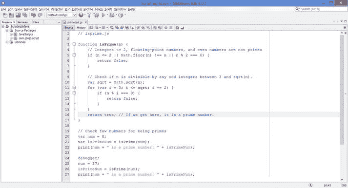
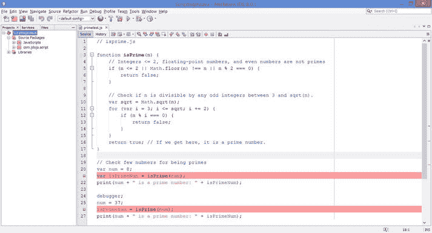
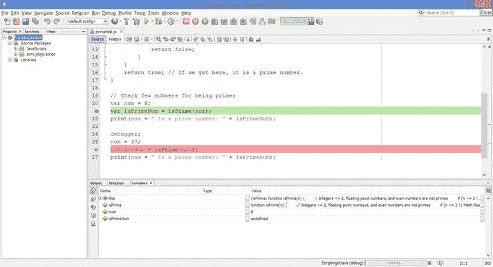
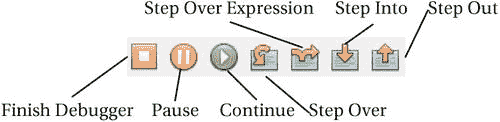
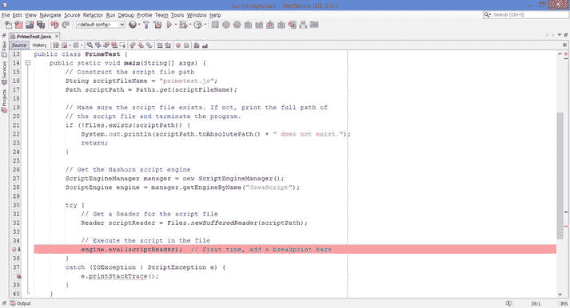
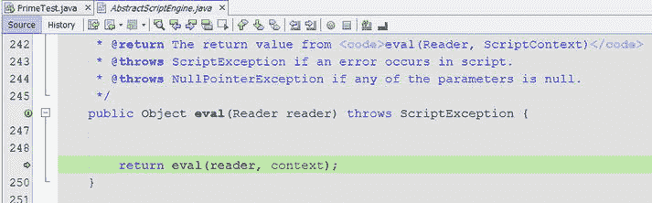
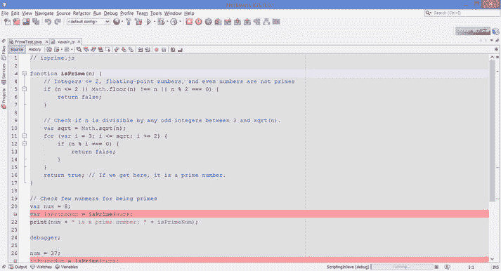

# 十三、调试、跟踪和分析脚本

在本章中，您将学习:

*   如何在 NetBeans IDE 中调试独立的 Nashorn 脚本
*   如何在 NetBeans IDE 中调试从 Java 代码调用的 Nashorn 脚本
*   如何跟踪和分析 Nashorn 脚本

带有 JDK 8 或更高版本的 NetBeans 8 支持调试、跟踪和分析 Nashorn 脚本。您可以在 NetBeans IDE 中运行和调试独立的 Nashorn 脚本。当从 Java 代码调用 Nashorn 脚本时，您也可以调试它们。您可以使用调试脚本的所有调试功能来调试 Java 代码；您可以设置断点、显示变量值、添加观察器、监视调用堆栈等等。调试 Nashorn 脚本时，调试器显示 Nashorn 堆栈。

在 NetBeans 中，所有与调试器相关的窗格都可以使用菜单项`Windows ➤ Debugging`打开。有关 NetBeans 中完整调试功能的列表，请参考 NetBeans 中的帮助页面。当 NetBeans 应用处于活动状态时，您可以通过按下`F1`键来打开帮助页面。在本章中，我将使用清单 13-1 中的脚本作为调试脚本的例子。

清单 13-1。包含 isPrime()函数和对该函数的调用的测试脚本

```java
// primetest.js

function isPrime(n) {

// Integers <= 2, floating-point numbers, and even numbers are not         // primes

if (n <= 2 || Math.floor(n) !== n || n % 2 === 0) {

return false;

}

// Check if n is divisible by any odd integers between 3 and sqrt(n).

var sqrt = Math.sqrt(n);

for (var i = 3; i <= sqrt; i += 2) {

if (n % i === 0) {

return false;

}

}

return true; // If we get here, it is a prime number.

}

// Check few nubmers for being primes

var num = 8;

var isPrimeNum = isPrime(num);

print(num + " is a prime number: " + isPrimeNum);

debugger;

num = 37;

isPrimeNum = isPrime(num);

print(num + " is a prime number: " + isPrimeNum);
```

## 调试独立脚本

要在 NetBeans 中运行或调试独立的 Nashorn 脚本，首先需要在 NetBeans IDE 中打开脚本文件。图 [13-1](#Fig1) 显示了在 NetBeans 中打开的清单 13-1 所示的脚本。要运行脚本，在显示脚本的编辑器中右击并选择`Run File`菜单项。或者，在脚本窗格激活时按下`Shift + F6`。



图 13-1。

A Nashorn script opened in the NetBeans IDE

要调试脚本，您需要使用以下三种方法之一添加断点:

*   将光标放在要设置/取消设置断点的行上。右键选择菜单项`Toggle Line Breakpoint`，设置和取消设置断点。
*   将光标放在您想要设置/取消设置断点的行上，然后按`Ctrl + F8`。第一次按下此组合键会设置断点。如果已经设置了断点，则按下相同的组合键会取消设置断点。
*   在脚本中添加`debugger`语句。当调试会话处于活动状态时，`debugger`语句就像一个断点。否则没有效果。

图 [13-2](#Fig2) 显示了在第 21 行和第 26 行有两个断点的相同脚本。



图 13-2。

A Nashorn script opened in the NetBeans IDE that has two breakpoints

现在您已经准备好调试脚本了。在脚本窗格中右击并选择`Debug File`菜单项。或者，当脚本窗格激活时，按下`Ctrl + Shift + F5`。它将启动调试会话，如图 [13-3](#Fig3) 所示。调试器在第一个断点处停止，如图所示。在底部，您会看到`Variables`窗格打开，显示所有变量及其值。如果您想查看调试会话的其他细节，请使用主菜单`Window ➤ Debugging`下的一个菜单项。如果您关闭任何调试窗格，如`Variables`窗格，您可以使用`Window ➤ Debugging`菜单重新打开它们。



图 13-3。

A Nashorn script opened in the NetBeans IDE in an active debugging session

当调试器会话处于活动状态时，您可以使用调试操作，如单步执行、单步跳过、单步退出、继续等。这些操作可从名为`Debug`的主菜单项以及调试器工具栏中获得。图 [13-4](#Fig4) 显示了调试器工具栏。默认情况下，当调试器会话处于活动状态时，它会出现。如果调试器会话激活时不可见，右击工具栏区域并选择`Debug`菜单项使其可见。表 [13-1](#Tab1) 包含脚本可用的调试操作及其快捷方式和描述。

表 13-1。

The List of Debugger Actions in NetBeans

   
| 调试操作 | 捷径 | 描述 |
| --- | --- | --- |
| 完成调试器 | `Shift + F5` | 结束调试会话。 |
| 中止 |   | 停止当前会话中的所有线程。 |
| 继续 | `Ctrl + F5` | 继续执行程序，直到下一个断点。 |
| 跨过 | `F8` | 执行当前行并将程序计数器移动到文件中的下一行。如果执行的行是对函数的调用，那么函数中的代码也会被执行。 |
| 跳过表达式 | `Shift + F8` | 使您能够继续执行表达式中的每个方法调用，并查看每个方法调用的输入参数和结果输出值。如果没有进一步的方法调用，它的行为类似于单步执行操作。 |
| 进入 | `F7` | 执行当前行。如果该行是对一个函数的调用，并且被调用的函数有可用的源代码，则程序计数器移到该函数的声明处。否则，程序计数器移动到脚本中的下一行。 |
| 走出去 | `Ctrl + F7` | 执行当前函数中的其余代码，并将程序计数器移动到函数调用方之后的行。如果您单步执行了不再需要调试的函数，请使用此操作。 |



图 13-4。

The items in the debugger toolbar in NetBeans IDE

## 从 Java 代码调试脚本

从 Java 代码调用的调试脚本的工作方式略有不同。仅仅在脚本文件中设置断点并启动调试器或从 Java 代码进入脚本是不起作用的。您将使用清单 13-2 所示的 Java 程序来调试清单 13-1 所示的脚本。Java 程序使用一个`Reader`来执行来自`primetest.js`文件的脚本。但是，您也可以使用`load()`功能。在清单 13-2 中，您可以用下面的代码片段替换`try-catch`块中的代码，程序将会同样工作；您需要删除两个从`java.io`包中导入类的 import 语句:

```java
try {

// Execute the script in the file

engine.eval("load('" + scriptFileName + "');"); // First time, add a                                              // breakpoint here

}

catch (ScriptException e) {

e.printStackTrace();

}
```

清单 13-2。调试从 Java 代码调用的脚本

```java
// PrimeTest.java

package com.jdojo.script;

import java.io.IOException;

import java.io.Reader;

import java.nio.file.Files;

import java.nio.file.Path;

import java.nio.file.Paths;

import javax.script.ScriptEngine;

import javax.script.ScriptEngineManager;

import javax.script.ScriptException;

public class PrimeTest {

public static void main(String[] args) {

// Construct the script file path

String scriptFileName = "primetest.js";

Path scriptPath = Paths.get(scriptFileName);

// Make sure the script file exists. If not, print the full

// path of the script file and terminate the program.

if (!Files.exists(scriptPath)) {

System.out.println(scriptPath.toAbsolutePath() +"                  "does not exist.");

return;

}

// Get the Nashorn script engine

ScriptEngineManager manager = new ScriptEngineManager();

ScriptEngine engine = manager.getEngineByName("JavaScript");

try {

// Get a Reader for the script file

Reader scriptReader = Files.newBufferedReader(scriptPath);

// Execute the script in the file

engine.eval(scriptReader);  // First time, add a   // breakpoint here

}

catch (IOException | ScriptException e) {

e.printStackTrace();

}

}

}
```

作为调试脚本的第一步，您需要在调用脚本引擎的`eval()`方法的代码行设置一个断点。如果不执行此步骤，您将无法从调试器单步执行脚本。图 [13-5](#Fig5) 显示了在第 35 行有一个断点的`PrimeTest`类的代码。



图 13-5。

The code of the PrimeTest class with a breakpint at line 35 in the NetBeans IDE

下一步是启动调试器。当包含`PrimeTest`类的编辑器窗格处于活动状态时，您可以使用`Ctrl + Shift + F5`。调试器将在第 35 行的断点处停止。你需要通过按`F7`进入`eval()`方法调用；这将把你带到`AbstractScriptEngine.java`文件，如图 [13-6](#Fig6) 所示。



图 13-6。

The debugger window when the AbstractScriptEngine.java file is being debugged

按下`F7`进入`eval()`方法调用。调试器将打开一个名为`<eval>.js`的文件，其中包含您试图使用`Reader`通过 Java 代码加载的`primetest.js`文件中的脚本。您可以滚动脚本并在`<eval>.js`文件中设置断点。图 [13-7](#Fig7) 显示了带有两个断点的文件——一个在第 21 行，一个在第 27 行。



图 13-7。

The debugger window showing the loaded script in the <eval>.js file

在`<eval>.js`文件的脚本中设置了断点之后，就可以继续正常的调试操作了。例如，`Continue`调试动作(`F5`)会在下一个断点停止执行。

当调试器结束时，您可以从 Java 代码中移除断点，在本例中，Java 代码是`PrimaTest.java`文件。如果您启动一个新的调试会话，调试器将在您之前在`<eval>.js`文件中设置的断点处停止。请注意，您只需进入`<eval>.js`文件一次。所有后续调试会话都会记住先前会话中的断点。

Tip

即使 Nashorn 支持`debugger`语句，NetBeans IDE 似乎也不会将其识别为 Nashorn 脚本中的断点。当调试器处于活动状态时，在脚本中添加`debugger`语句不会暂停执行。

## 跟踪和分析脚本

Nashorn 支持调用点跟踪和分析。您可以在`jjs`命令行工具以及嵌入式 Nashorn 引擎中启用这些选项。您可以为引擎运行的所有脚本或每个脚本/函数启用跟踪和分析。`–tcs`选项为所有脚本启用调用点跟踪，并在标准输出中打印调用点跟踪信息。`-pcs`选项为所有脚本启用调用点分析，并在当前目录下名为`NashornProfile.txt`的文件中打印调用点分析数据。

您可以在脚本或函数的开头使用以下四个 Nashorn 指令，有选择地跟踪和分析整个脚本或函数:

*   `"nashorn callsite trace enterexit"; // Equivalent to -tcs=enterexit`
*   `"nashorn callsite trace miss";      // Equivalent to -tcs=miss`
*   `"nashorn callsite trace objects";   // Equivalent to -tcs=objects`
*   `"nashorn callsite profile";         // Equivalent to -pcs`

Tip

`–tcs`和`–pcs`选项基于每个脚本引擎工作，而四个跟踪和分析指令基于每个脚本和每个函数工作。

这些 Nashorn 指令仅在调试模式下启用。您可以通过将`nashorn.debug`系统属性设置为 true 来启用 Nashorn 调试模式。这些指令在 JDK8u40 和更高版本中可用。在撰写本书时，JDK8u40 仍在开发中。清单 13-3 显示了一个为函数启用了 Nashorn callsite 配置文件选项的脚本。该脚本已保存在名为`primeprofiler.js`的文件中。

清单 13-3。为函数启用了 Nashorn Callsite 配置文件指令的脚本

```java
// primeprofiler.js

function isPrime(n) {

// Profile this function only

"nashorn callsite profile";

// Integers <= 2, floating-point numbers, and even numbers are not primes

if (n <= 2 || Math.floor(n) !== n || n % 2 === 0) {

return false;

}

// Check if n is divisible by any odd integers between 3 and sqrt(n).

var sqrt = Math.sqrt(n);

for (var i = 3; i <= sqrt; i += 2) {

if (n % i === 0) {

return false;

}

}

return true; // If we get here, it is a prime number.

}

// Check few nubmers for being primes

var num = 8;

var isPrimeNum = isPrime(num);

print(num + " is a prime number: " + isPrimeNum);

num = 37;

isPrimeNum = isPrime(num);

print(num + " is a prime number: " + isPrimeNum);
```

以下命令在启用 Nashorn 调试选项的情况下运行`primeprofile.js`文件中的脚本:

```java
c:\>jjs -J-Dnashorn.debug=true primeprofile.js

8 is a prime number: false

37 is a prime number: true

C:\
```

该命令将在当前直接生成一个名为`NashornProfile.txt`的文件，该文件包含`isPrime()`函数调用的概要数据。这个文件的内容如清单 13-4 所示。

清单 13-4。NashornProfile.txt 文件的内容

```java
0        dyn:getProp|getElem|getMethod:Math        438462        2

1        dyn:getMethod|getProp|getElem:floor       433936        2

2        dyn:call                                  650602        2

3        dyn:getProp|getElem|getMethod:Math        313834        1

4        dyn:getMethod|getProp|getElem:sqrt        283356        1

5        dyn:call                                       0        1
```

清单 13-5 包含设置`nashorn.debug`系统属性并运行清单 13-3 所示脚本的 Java 程序。运行该程序将在当前目录下创建一个`NashornProfile.txt`文件，该文件的内容与清单 13-2 所示的相同。

清单 13-5。设置 nashorn.debug 系统属性和分析脚本

```java
// ProfilerTest.java

package com.jdojo.script;

import java.io.IOException;

import java.io.Reader;

import java.nio.file.Files;

import java.nio.file.Path;

import java.nio.file.Paths;

import javax.script.ScriptEngine;

import javax.script.ScriptEngineManager;

import javax.script.ScriptException;

public class ProfilerTest {

public static void main(String[] args) {

// Set the nashorn.debug system property, so the tracing and

// profiling directives will be recognized

System.setProperty("nashorn.debug", "true");

// Construct the script file path

String scriptFileName = "primeprofiler.js";

Path scriptPath = Paths.get(scriptFileName);

// Make sure the script file exists. If not, print the full

// path of the script file and terminate the program.

if (!Files.exists(scriptPath)) {

System.out.println(scriptPath.toAbsolutePath() +                    "does not exist.");

return;

}

// Get the Nashorn script engine

ScriptEngineManager manager = new ScriptEngineManager();

ScriptEngine engine = manager.getEngineByName("JavaScript");

try {

// Get a Reader for the script file

Reader scriptReader = Files.newBufferedReader(scriptPath);

// Execute the script in the file

engine.eval(scriptReader);

}

catch (IOException | ScriptException e) {

e.printStackTrace();

}

}

}

8 is a prime number: false

37 is a prime number: true
```

## 摘要

带有 JDK 8 或更高版本的 NetBeans 8 支持在 NetBeans IDE 中调试 Nashorn 脚本。您可以在 NetBeans IDE 中运行和调试独立的 Nashorn 脚本。当从 Java 代码调用 Nashorn 脚本时，您也可以调试它们。调试器无缝地从 Java 代码跳到 Nashorn 脚本。

Nashorn 支持调用点跟踪和分析。您可以在`jjs`命令行工具以及嵌入式 Nashorn 引擎中启用这些选项。您可以为引擎运行的所有脚本或每个脚本/函数启用跟踪和分析。`–tcs`选项为引擎运行的所有脚本启用调用点跟踪。`-pcs`选项为引擎运行的所有脚本启用调用点分析，并在当前目录中名为`NashornProfile.txt`的文件中打印调用点分析数据。JDK8u40 增加了四个 Nashorn 指令:`"nashorn callsite trace enterexit"`、`"nashorn callsite trace miss"`、`"nashorn callsite trace objects"`和`"nashorn callsite profile"`。这些指令可以添加到脚本和函数的开头，以便有选择地跟踪和分析脚本和函数。它们仅在调试模式下工作，可通过将系统属性`nashorn.debug`设置为 true 来启用。